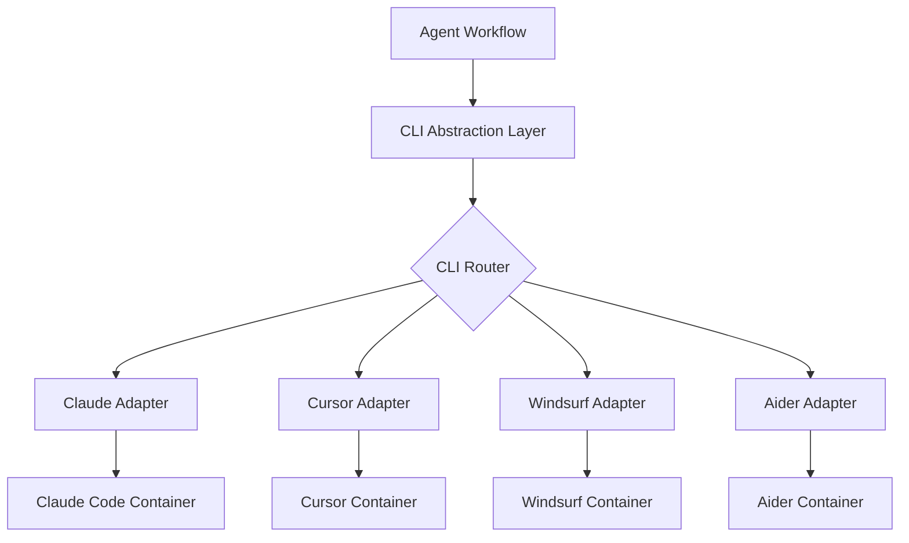

# CLI-Agnostic Platform Migration Plan

## Executive Summary

Transform the Multi-Agent Software Development Orchestration Platform from Claude Code-specific implementation to support multiple AI CLI tools (Cursor, Windsurf, Aider, etc.) through abstraction layers and harmonized interfaces.

## Current State Analysis

### Claude Code Dependencies
- **System Prompts**: Hardcoded Claude-specific instructions in templates
- **MCP Servers**: Claude-specific MCP protocol implementation
- **Context Management**: CLAUDE.md files throughout repositories
- **Tool Interfaces**: Claude-specific tool calling conventions
- **Response Formatting**: Claude markdown and interaction patterns

### Available CLI Images (Untested)
- Cursor CLI
- Windsurf CLI
- Aider CLI
- Continue CLI
- OpenHands CLI

## Discovery Project Specification

### Phase 1: CLI Capability Assessment

#### Test Harness Creation
```yaml
testCases:
  basic:
    - file_read_write
    - code_generation
    - git_operations
    - terminal_execution
  advanced:
    - context_window_management
    - tool_calling_patterns
    - error_recovery
    - session_persistence
  integration:
    - github_api_interaction
    - workspace_management
    - multi_file_editing
    - test_execution
```

#### CLI Profiling Matrix
| CLI Tool | Context Format | Tool Protocol | Session Model | Output Format | Rate Limits |
|----------|---------------|---------------|---------------|---------------|-------------|
| Claude Code | CLAUDE.md | MCP | Persistent | Markdown | 5 req/min |
| Cursor | TBD | TBD | TBD | TBD | TBD |
| Windsurf | TBD | TBD | TBD | TBD | TBD |
| Aider | TBD | TBD | TBD | TBD | TBD |

### Phase 2: Abstraction Layer Design

#### Unified CLI Interface
```typescript
interface UnifiedCLI {
  // Core capabilities
  readFile(path: string): Promise<string>
  writeFile(path: string, content: string): Promise<void>
  executeCommand(cmd: string): Promise<CommandResult>
  
  // Context management
  loadContext(format: ContextFormat): Promise<void>
  updateContext(changes: ContextDelta): Promise<void>
  
  // Tool invocation
  invokeTool(tool: Tool, params: any): Promise<ToolResult>
  
  // Session management
  saveSession(): Promise<SessionSnapshot>
  restoreSession(snapshot: SessionSnapshot): Promise<void>
}
```

#### Context Harmonization Strategy
```yaml
contextAdapters:
  claude:
    input: CLAUDE.md
    format: markdown
    sections: [overview, instructions, memory]
  
  cursor:
    input: .cursorrules
    format: yaml
    sections: [context, rules, preferences]
  
  windsurf:
    input: windsurf.config
    format: json
    sections: [system, project, session]
  
  universal:
    format: structured_yaml
    schema:
      project:
        description: string
        architecture: object
        constraints: array
      agent:
        role: string
        capabilities: array
        restrictions: array
      session:
        task: string
        context: object
        state: object
```

## Implementation Architecture

### 1. CLI Abstraction Layer



### 2. Dynamic Template System

#### Template Structure
```
templates/
├── base/
│   ├── system-prompt.yaml      # CLI-agnostic prompt
│   ├── context-schema.yaml     # Universal context format
│   └── tool-definitions.yaml   # Abstract tool specs
├── adapters/
│   ├── claude/
│   │   ├── transform.js        # Claude-specific transforms
│   │   └── config.yaml         # Claude configuration
│   ├── cursor/
│   │   ├── transform.js
│   │   └── config.yaml
│   └── windsurf/
│       ├── transform.js
│       └── config.yaml
```

### 3. Tool Protocol Harmonization

#### Universal Tool Definition
```yaml
tool:
  name: file_operations
  description: Read, write, and manipulate files
  operations:
    - read:
        params: [path]
        adapters:
          claude: "Read tool with file_path param"
          cursor: "fs.readFile API call"
          aider: "/read command"
    - write:
        params: [path, content]
        adapters:
          claude: "Write tool"
          cursor: "fs.writeFile API"
          aider: "/write command"
```

### 4. Context Management System

#### Unified Context Service
```go
type ContextManager struct {
    // Core context storage
    projectContext  ProjectContext
    agentContext    AgentContext
    sessionContext  SessionContext
    
    // CLI-specific adapters
    adapters map[string]ContextAdapter
}

type ContextAdapter interface {
    // Convert universal context to CLI-specific format
    Marshal(ctx UniversalContext) ([]byte, error)
    
    // Parse CLI-specific context to universal format
    Unmarshal(data []byte) (UniversalContext, error)
    
    // Update running CLI session context
    UpdateSession(ctx UniversalContext) error
}
```

## Migration Strategy

### Phase 1: Foundation (Weeks 1-2)
1. **Discovery Environment Setup**
   - Deploy test cluster with all CLI containers
   - Create automated test harness
   - Build capability assessment framework

2. **CLI Profiling**
   - Run standardized tests against each CLI
   - Document capabilities and limitations
   - Create compatibility matrix

### Phase 2: Abstraction Layer (Weeks 3-4)
1. **Core Abstractions**
   - Implement UnifiedCLI interface
   - Build CLI router and adapter framework
   - Create context transformation pipeline

2. **Template Refactoring**
   - Extract CLI-specific elements from templates
   - Create universal template format
   - Build adapter-specific transforms

### Phase 3: Integration (Weeks 5-6)
1. **Controller Modifications**
   - Add CLI type to CRD spec
   - Implement dynamic container selection
   - Update PVC naming for CLI types

2. **Workflow Updates**
   - Parameterize workflows for CLI selection
   - Add CLI-specific environment variables
   - Implement adapter injection

### Phase 4: Testing & Validation (Weeks 7-8)
1. **Multi-CLI Testing**
   - Run same tasks across different CLIs
   - Compare outputs and performance
   - Validate context persistence

2. **Production Hardening**
   - Error handling for CLI failures
   - Fallback mechanisms
   - Performance optimization

## Configuration Management

### CRD Enhancement
```yaml
apiVersion: cto.5dlabs.com/v1
kind: CodeRun
spec:
  cli:
    type: claude  # claude | cursor | windsurf | aider
    version: latest
    config:
      contextFormat: claude-md
      toolProtocol: mcp
      sessionMode: persistent
```

### Dynamic Configuration
```yaml
cliConfigs:
  claude:
    image: claude-code:latest
    contextFile: CLAUDE.md
    mcp:
      enabled: true
      servers: [docs, k8s, fs]
  
  cursor:
    image: cursor-cli:latest
    contextFile: .cursorrules
    api:
      enabled: true
      endpoint: internal
  
  windsurf:
    image: windsurf-cli:latest
    contextFile: windsurf.config
    plugins:
      enabled: true
      list: [git, test, lint]
```

## Success Metrics

### Technical Metrics
- **CLI Coverage**: Support for 5+ CLI tools
- **Feature Parity**: 90% feature compatibility across CLIs
- **Performance**: <10% overhead from abstraction layer
- **Reliability**: 99.9% success rate for CLI operations

### Business Metrics
- **Flexibility**: Switch CLIs without workflow changes
- **Cost Optimization**: Use most cost-effective CLI per task
- **Vendor Independence**: No lock-in to single AI provider
- **Scalability**: Support new CLIs with minimal effort

## Risk Mitigation

### Technical Risks
1. **CLI Incompatibility**
   - Mitigation: Graceful degradation for missing features
   - Fallback: Default to Claude for complex operations

2. **Context Loss**
   - Mitigation: Universal context persistence layer
   - Recovery: Session snapshot and restore

3. **Performance Degradation**
   - Mitigation: Caching and optimization in adapters
   - Monitoring: CLI-specific performance metrics

### Operational Risks
1. **Increased Complexity**
   - Mitigation: Comprehensive documentation
   - Training: Team education on multi-CLI operations

2. **Debugging Difficulty**
   - Mitigation: Unified logging with CLI tags
   - Tools: CLI-specific debug modes

## Next Steps

### Immediate Actions (Week 1)
1. Create discovery project repository
2. Deploy test environment with all CLIs
3. Design and implement test harness
4. Begin CLI capability assessment

### Short-term Goals (Month 1)
1. Complete CLI profiling matrix
2. Prototype abstraction layer
3. Test basic operations across CLIs
4. Document findings and recommendations

### Long-term Vision (Quarter)
1. Full production deployment of multi-CLI platform
2. Dynamic CLI selection based on task type
3. Cost-optimized CLI routing
4. Open-source CLI adapter framework

## Appendix: CLI-Specific Considerations

### Claude Code
- Strengths: MCP protocol, comprehensive tool set
- Challenges: Rate limits, cost
- Adaptation: Minimal changes needed

### Cursor
- Strengths: VSCode integration, fast iteration
- Challenges: Limited API documentation
- Adaptation: Custom tool bridge needed

### Windsurf
- Strengths: Collaborative features, real-time sync
- Challenges: Session management complexity
- Adaptation: State synchronization layer

### Aider
- Strengths: Git-native, lightweight
- Challenges: Limited context window
- Adaptation: Context chunking strategy

### Continue
- Strengths: Open-source, extensible
- Challenges: Plugin compatibility
- Adaptation: Custom plugin development

## Conclusion

This migration plan provides a structured approach to evolving the platform from Claude-specific to CLI-agnostic, enabling flexibility, cost optimization, and vendor independence while maintaining the sophisticated multi-agent orchestration capabilities.