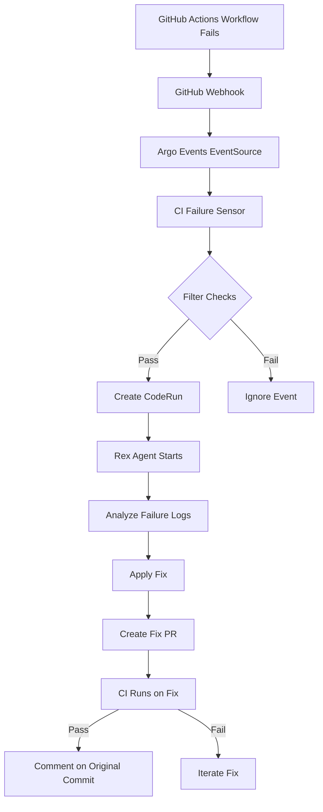

# CI Failure Remediation System

## Overview

The CI Failure Remediation System automatically detects GitHub Actions workflow failures in the 5dlabs/cto repository and triggers an AI agent (Rex) to analyze and fix the issues.

## Architecture

### Components

1. **GitHub EventSource** (`infra/gitops/resources/github-webhooks/eventsource.yaml`)
   - Receives all GitHub webhook events
   - Already deployed and operational

2. **CI Failure Sensor** (`infra/gitops/resources/sensors/ci-failure-remediation-sensor.yaml`)
   - Filters for `workflow_run` events with `conclusion=failure`
   - Only processes 5dlabs/cto repository
   - Excludes commits with `[skip-ci-remediation]` flag
   - Triggers CodeRun creation for Rex agent

3. **Rex Agent Template** (`infra/charts/controller/agent-templates/code/claude/container-rex.sh.hbs`)
   - Enhanced with CI remediation mode
   - Activated when `REMEDIATION_MODE=ci-failure`
   - Provides specialized prompts for CI failure analysis and fixes

4. **Test Script** (`scripts/test-ci-remediation.sh`)
   - Comprehensive testing tool
   - Supports dry-run, simulation, and monitoring modes

## How It Works

### Event Flow



### Sensor Filtering

The sensor only triggers remediation when ALL conditions are met:

- **Event Type**: `workflow_run`
- **Action**: `completed`
- **Conclusion**: `failure`
- **Repository**: `5dlabs/cto`
- **Commit Message**: Does NOT contain `[skip-ci-remediation]`

### Rex Remediation Process

When Rex is activated in CI remediation mode:

1. **Analyze Failure**
   - Fetch workflow logs via `gh run view`
   - Identify failure type (build, test, lint, permission, etc.)
   - Extract error messages and context

2. **Identify Root Cause**
   - Docker build failures
   - Rust Clippy pedantic violations
   - Test failures
   - Permission errors (GHCR, PR creation)
   - Linting failures (YAML, Markdown)
   - Resource issues (timeout, OOM)

3. **Apply Targeted Fix**
   - Minimal changes to fix specific issue
   - No refactoring or scope creep
   - Maintain code quality standards

4. **Create Fix PR**
   - Branch from failing branch
   - Descriptive commit message with root cause
   - PR with full context and validation checklist
   - Labels: `ci-fix`, `automated-fix`

5. **Validate Fix**
   - Monitor CI on fix PR
   - Iterate if checks fail
   - Max 3 attempts per failure

6. **Report Results**
   - Comment on original commit with fix PR link
   - Document root cause and solution
   - Tag author if human help needed

## Deployment

### Prerequisites

- Argo Events installed and running
- GitHub EventSource deployed
- Rex GitHub App configured
- Kubernetes cluster access

### Deploy Sensor

```bash
# Apply sensor configuration
kubectl apply -f infra/gitops/resources/sensors/ci-failure-remediation-sensor.yaml

# Verify deployment
kubectl get sensor ci-failure-remediation -n argo
kubectl get pods -n argo -l sensor-name=ci-failure-remediation

# Check logs
kubectl logs -n argo -l sensor-name=ci-failure-remediation --tail=50
```

### Update Agent Templates

The Rex agent template has been enhanced with CI remediation mode. The controller will automatically use the updated template for new CodeRuns.

To force template update:

```bash
# Regenerate templates ConfigMap
cd infra/charts/controller
./scripts/generate-templates-configmap.sh

# Apply to cluster
kubectl apply -f agent-templates-configmap.yaml
```

## Testing

### Dry-Run Test (Safe)

```bash
# Validate configuration without triggering actual failures
./scripts/test-ci-remediation.sh --dry-run
```

### Check Deployment Status

```bash
# Verify all components are running
./scripts/test-ci-remediation.sh --check-only
```

### Simulate CI Failure (Requires Caution)

```bash
# Creates a test branch with intentional Clippy error
# Pushes to GitHub and monitors for remediation
./scripts/test-ci-remediation.sh --simulate

# Clean up after test
./scripts/test-ci-remediation.sh --cleanup
```

### Monitor Existing Activity

```bash
# Watch for remediation CodeRuns
./scripts/test-ci-remediation.sh --monitor
```

## Configuration

### Sensor Configuration

Edit `infra/gitops/resources/sensors/ci-failure-remediation-sensor.yaml`:

```yaml
spec:
  dependencies:
    - name: workflow-failure
      filters:
        data:
          # Add/remove workflow names to filter
          - path: body.workflow_run.name
            type: string
            comparator: "in"
            value:
              - "Infrastructure Images"
              - "Controller CI"
              # Add more workflows here
```

### Agent Configuration

The Rex agent uses these environment variables in CI remediation mode:

- `REMEDIATION_MODE=ci-failure` - Activates CI remediation mode
- `WORKFLOW_NAME` - Name of failed workflow
- `WORKFLOW_RUN_ID` - GitHub Actions run ID
- `WORKFLOW_RUN_URL` - Direct link to failure
- `FAILURE_BRANCH` - Branch where failure occurred
- `FAILURE_COMMIT_SHA` - Commit that triggered failure
- `FAILURE_COMMIT_MESSAGE` - Original commit message

### Skipping Remediation

To prevent remediation for specific commits, include in commit message:

```bash
git commit -m "fix: manual fix [skip-ci-remediation]"
```

## Monitoring

### Check Sensor Status

```bash
# Sensor health
kubectl get sensor ci-failure-remediation -n argo -o yaml

# Recent events processed
kubectl logs -n argo -l sensor-name=ci-failure-remediation --tail=100
```

### Check Remediation CodeRuns

```bash
# List all CI remediation CodeRuns
kubectl get coderun -n cto -l role=ci-remediation

# Get details of specific CodeRun
kubectl describe coderun <name> -n cto

# View agent logs
kubectl logs -n cto <pod-name> --tail=100
```

### Metrics (Future)

Planned Grafana dashboard metrics:

- Remediation success rate per workflow
- Time to fix (failure → green CI)
- False positive rate
- Human intervention rate
- Cost per remediation (AI API usage)

## Troubleshooting

### Sensor Not Triggering

1. **Check EventSource is running**:
   ```bash
   kubectl get eventsource github -n argo
   kubectl logs -n argo -l eventsource-name=github
   ```

2. **Verify webhook delivery**:
   - Check GitHub webhook settings: https://github.com/5dlabs/cto/settings/hooks
   - Look for recent deliveries and responses

3. **Check sensor filters**:
   ```bash
   kubectl logs -n argo -l sensor-name=ci-failure-remediation | grep -i filter
   ```

### CodeRun Not Created

1. **Check sensor logs for errors**:
   ```bash
   kubectl logs -n argo -l sensor-name=ci-failure-remediation --tail=50
   ```

2. **Verify RBAC permissions**:
   ```bash
   kubectl get serviceaccount argo-events-sa -n argo
   kubectl get rolebinding -n cto | grep argo-events
   ```

3. **Check CodeRun CRD**:
   ```bash
   kubectl get crd coderuns.agents.platform.5dlabs.ai
   ```

### Remediation Fails

1. **Check agent logs**:
   ```bash
   kubectl logs -n cto <coderun-pod> --tail=200
   ```

2. **Verify GitHub App permissions**:
   - Rex needs: `contents: write`, `pull-requests: write`, `workflows: read`

3. **Check rate limits**:
   ```bash
   gh api rate_limit
   ```

## Safety Features

### Rate Limiting

- Max 3 remediation attempts per workflow failure
- Sensor respects GitHub webhook rate limits
- AI API usage monitored and capped

### Branch Protection

- Never pushes directly to `main`
- Always creates PR for review
- Respects branch protection rules

### Human Override

- Use `[skip-ci-remediation]` flag to disable
- Add `blocked` label if unable to fix
- Tag original author for complex issues

### Audit Trail

- All remediation attempts logged
- CodeRun metadata tracks workflow context
- PR descriptions include full failure details

## Workflow Coverage

Currently supported workflows:

- ✅ Infrastructure Images (Docker builds, GHCR)
- ✅ Controller CI (Rust clippy, tests, formatting)
- ✅ Agent Templates Check (Handlebars validation)
- ✅ Markdown Lint (Documentation quality)
- ✅ Helm Publish (Chart packaging)
- ✅ All other CI/CD workflows

## Future Enhancements

### Phase 2 (Planned)

- [ ] Specialized CI agent (separate from Rex)
- [ ] Predictive remediation (fix before failure)
- [ ] Learning system (knowledge base of fixes)
- [ ] Multi-repository support
- [ ] Grafana monitoring dashboard

### Phase 3 (Proposed)

- [ ] Integration with play workflows
- [ ] Automatic dependency updates
- [ ] Security vulnerability auto-patching
- [ ] Performance regression detection

## Success Metrics

Target KPIs:

- **Auto-fix rate**: 70%+ of CI failures fixed automatically
- **Time to green**: < 30 minutes from failure to fix
- **False positive rate**: < 10% unnecessary remediations
- **Human intervention**: < 30% of failures need human help

## References

- [Argo Events Documentation](https://argoproj.github.io/argo-events/)
- [GitHub Webhooks](https://docs.github.com/en/webhooks)
- [GitHub Actions API](https://docs.github.com/en/rest/actions)
- [Rex Agent Documentation](../AGENTS.md#rex-implementation-agent)

## Support

For issues or questions:

1. Check sensor logs: `kubectl logs -n argo -l sensor-name=ci-failure-remediation`
2. Review CodeRun logs: `kubectl logs -n cto <pod>`
3. Run test script: `./scripts/test-ci-remediation.sh --check-only`
4. Create issue: https://github.com/5dlabs/cto/issues

---

**Last Updated**: 2025-11-12
**Status**: Production Ready
**Maintainer**: CTO Platform Team

