# PR Comment Feedback Loop Design


## Overview
Design for implementing a recursive feedback loop where Rex responds to PR comments from Tess (and potentially humans), implementing fixes until all acceptance criteria are met.

## Core Principles


1. **Tess is the Quality Gate** - Only Tess's comments trigger Rex remediation


2. **Cleo is Silent** - Cleo fixes issues directly, no comment-based feedback


3. **Recursive Until Satisfied** - Loop continues until Tess approves (120% satisfied)


4. **Stateless Restarts** - Each iteration starts fresh, no complex state management

## Agent Responsibilities

### Rex (Implementation)


- Monitors PR comments for actionable feedback


- Implements fixes based on Tess's findings


- Pushes updates to feature branch


- Restarts the validation cycle


### Cleo (Code Quality)


- Silently fixes linting, formatting, build issues


- Pushes fixes directly to feature branch


- Does NOT post comments requiring action


- Adds "ready-for-qa" label when done

### Tess (QA Testing)
- Posts detailed PR comments about:


  - Missing acceptance criteria


  - Bugs and issues found


  - Failed manual tests


  - Regression failures


- Uses structured comment format for actionability


- Only approves when 120% satisfied

## Comment Classification

### Actionable Comments (Trigger Rex)


```markdown
## 🔴 Required Changes

**Issue Type**: [Bug|Missing Feature|Regression|Performance]
**Severity**: [Critical|High|Medium|Low]

### Description
[Clear description of the issue]

### Acceptance Criteria Not Met


- [ ] Specific criterion not satisfied


- [ ] Another missing requirement


### Steps to Reproduce (if bug)


1. Step one


2. Step two


### Expected vs Actual
- **Expected**: [what should happen]
- **Actual**: [what actually happens]


```

### Non-Actionable Comments (Informational Only)


```markdown
## ✅ Testing Progress Update

[Status update, no action required]


```

## Proposed Implementation

### 1. New Sensor: PR Comment Handler


```yaml
apiVersion: argoproj.io/v1alpha1
kind: Sensor
metadata:
  name: pr-comment-feedback
  namespace: argo
spec:
  replicas: 2
  dependencies:
    - name: github-pr-comment
      eventSourceName: github
      eventName: org
      filters:
        data:
          - path: headers.X-Github-Event
            type: string
            value: ["issue_comment", "pull_request_review_comment"]
          - path: body.action
            type: string
            value: ["created"]
  triggers:
    - template:
        name: process-pr-feedback
        k8s:
          operation: create
          source:
            resource:
              apiVersion: argoproj.io/v1alpha1
              kind: Workflow
              metadata:
                generateName: rex-feedback-
                namespace: cto
              spec:
                entrypoint: handle-feedback
                templates:
                  - name: handle-feedback
                    script:
                      image: alpine/k8s:1.31.0
                      source: |
                        #!/bin/bash
                        # Parse comment
                        COMMENT_BODY='{{.Input.body.comment.body}}'
                        COMMENT_AUTHOR='{{.Input.body.comment.user.login}}'
                        PR_NUMBER='{{.Input.body.issue.number}}'

                        # Check if comment is from Tess
                        if [[ "$COMMENT_AUTHOR" != *"Tess"* ]]; then
                          # Could also check for human authors
                          echo "Comment not from Tess, ignoring"
                          exit 0
                        fi

                        # Check if comment is actionable (contains Required Changes)
                        if ! echo "$COMMENT_BODY" | grep -q "🔴 Required Changes"; then
                          echo "Comment is informational only"
                          exit 0
                        fi

                        # Extract task ID from PR labels or branch
                        TASK_ID=$(kubectl get workflows -n cto \


                          -l pr-number=$PR_NUMBER \


                          -o jsonpath='{.items[0].metadata.labels.task-id}')

                        # Cancel any running Cleo/Tess for this task
                        kubectl get coderuns -n cto \


                          -l task-id=$TASK_ID \


                          -o jsonpath='{range .items[*]}{.metadata.name}{"\t"}{.metadata.labels.agent-type}{"\n"}{end}' | \
                        while read coderun agent; do
                          if [[ "$agent" == "cleo" || "$agent" == "tess" ]]; then
                            kubectl patch coderun $coderun -n cto \
                              --type=merge -p '{"spec":{"suspend":true}}'
                          fi
                        done

                        # Create Rex CodeRun with comment context
                        cat <<EOF | kubectl create -f -
                        apiVersion: coderun.fivedsolutions.com/v1
                        kind: CodeRun
                        metadata:
                          generateName: coderun-rex-feedback-
                          namespace: cto
                          labels:
                            task-id: "$TASK_ID"
                            workflow-stage: "remediation"
                            agent-type: "rex"
                            trigger: "pr-comment"
                        spec:
                          service: "task$TASK_ID"
                          github_app: "5DLabs-Rex"
                          github_owner: "5dlabs"
                          github_repo: "cto-play-test"
                          pr_number: $PR_NUMBER
                          pr_comment_id: "{{.Input.body.comment.id}}"
                        EOF


```

### 2. Rex Container Enhancement


```bash
# In container-rex.sh.hbs
if [ -n "$PR_COMMENT_ID" ]; then
  echo "════════════════════════════════════════════════════════════════"
  echo "📝 PROCESSING FEEDBACK FROM QA"
  echo "════════════════════════════════════════════════════════════════"

  # Fetch the specific comment
  COMMENT_JSON=$(gh api /repos/$REPO_OWNER/$REPO_NAME/issues/comments/$PR_COMMENT_ID)
  COMMENT_BODY=$(echo "$COMMENT_JSON" | jq -r '.body')

  # Parse structured feedback
  echo "$COMMENT_BODY" > /tmp/qa-feedback.md

  # Extract issue type and severity
  ISSUE_TYPE=$(grep "Issue Type" /tmp/qa-feedback.md | sed 's/.*\[\(.*\)\].*/\1/')
  SEVERITY=$(grep "Severity" /tmp/qa-feedback.md | sed 's/.*\[\(.*\)\].*/\1/')

  echo "Issue Type: $ISSUE_TYPE"
  echo "Severity: $SEVERITY"

  # Prepare context for Claude
  FEEDBACK_CONTEXT="You have received QA feedback that requires remediation.

  The feedback is in /tmp/qa-feedback.md. Please:


  1. Read and understand the issues raised


  2. Implement the necessary fixes


  3. Ensure all acceptance criteria mentioned are met


  4. Commit and push your changes

  This is a $SEVERITY priority $ISSUE_TYPE that must be resolved."

  # Continue with normal Claude execution but with feedback context
fi


```

### 3. Workflow State Tracking

Add labels to track iteration count:


```yaml
metadata:
  labels:
    task-id: "1"
    iteration: "3"  # Increments each time Rex responds to feedback
    max-iterations: "10"  # Safety limit


```

### 4. Loop Termination Conditions

The loop ends when:


1. **Tess Approves** - Posts approval comment and adds "approved" label


2. **Max Iterations** - Safety limit reached (configurable)


3. **Human Override** - CTO adds "skip-automation" label


4. **Timeout** - Overall workflow timeout (e.g., 48 hours)

## Sequence Diagram

```mermaid
sequenceDiagram
    participant PR as Pull Request
    participant Rex as Rex (Implementation)
    participant Cleo as Cleo (Quality)
    participant Tess as Tess (QA)
    participant WH as Webhook/Sensor

    Rex->>PR: Push implementation
    PR->>WH: PR updated event
    WH->>Cleo: Start quality review
    Cleo->>PR: Push fixes (silent)
    Cleo->>PR: Add ready-for-qa label
    PR->>WH: Label added event
    WH->>Tess: Start QA testing

    alt Issues Found
        Tess->>PR: Post "🔴 Required Changes" comment
        PR->>WH: Comment created event
        WH->>Rex: Start remediation
        Note over Rex: Read comment, implement fixes
        Rex->>PR: Push fixes
        Note over Cleo,Tess: Cycle repeats
    else All Criteria Met
        Tess->>PR: Post approval
        Tess->>PR: Add approved label
        Note over PR: Ready for human review
    end








```




## Edge Cases to Handle


1. **Concurrent Comments** - Queue or process most recent only


2. **Conflicting Feedback** - Tess's comments take priority


3. **Invalid Comment Format** - Log and ignore


4. **Rex Failures** - Escalate to human after N attempts


5. **Infinite Loops** - Max iteration safety limit

## Labels for State Management


- `needs-fixes` - Tess (or a human) requested remediation from Rex


- `fixing-in-progress` - Rex is actively working on a remediation pass


- `needs-cleo` - Rex finished; Cleo must re-run quality checks


- `needs-tess` - Cleo approved; Tess needs to re-review


- `iteration-{n}` - Track attempt number


- `approved` - Tess is satisfied


- `skip-automation` - Human override

## Benefits of This Design


1. **Simple State Model** - Labels and comments drive state


2. **Auditability** - All feedback visible in PR


3. **Interruptible** - Humans can intervene at any point


4. **Scalable** - Can handle multiple PRs/tasks concurrently


5. **Resilient** - Stateless restarts, no complex recovery

## Open Questions


1. Should we differentiate between bugs vs missing features in handling?


2. Should Rex acknowledge receipt of feedback with a comment?


3. Should there be a cooldown between iterations?


4. How to handle partial fixes (some criteria met, others not)?


5. Should we track metrics on iteration counts for learning?


## Next Steps


1. Implement basic sensor for PR comments


2. Add comment parsing logic to Rex


3. Define structured comment format for Tess


4. Test with simple feedback loop


5. Add safety limits and monitoring


6. Iterate based on real usage patterns
