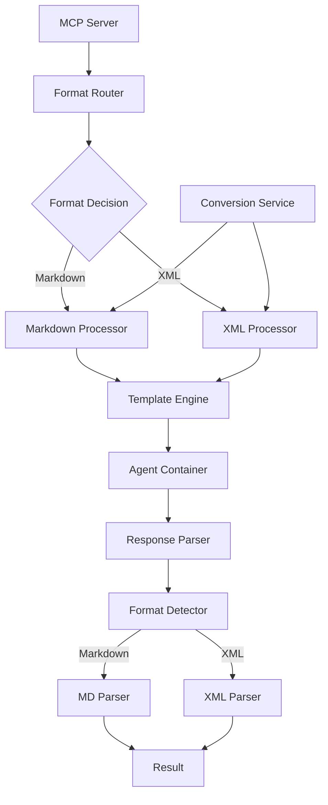

# Format Selection System Architecture

## Overview

This architecture enables dynamic selection between XML and Markdown formats for task documentation and agent communication, providing structured data advantages while maintaining backward compatibility.

## Architecture Principles

1. **Format Agnosticism**: Core logic independent of specific format
2. **Lossless Conversion**: Preserve all information during format transformation
3. **Runtime Selection**: Format chosen at task submission time
4. **Schema Validation**: Enforce structure for XML documents
5. **Performance Parity**: Minimal performance difference between formats

## System Architecture

### High-Level Design



## Component Design

### 1. Format Router

Determines which format to use based on explicit parameters or defaults.

```rust
// controller/src/formats/router.rs
pub struct FormatRouter {
    config: FormatConfig,
    metrics: FormatMetrics,
}

impl FormatRouter {
    pub fn select_format(
        &self,
        explicit_format: Option<DocumentFormat>,
        task_type: &str,
        agent: &str,
    ) -> DocumentFormat {
        // Priority order:
        // 1. Explicit format parameter
        if let Some(format) = explicit_format {
            self.metrics.record_format_selection(format.clone(), "explicit");
            return format;
        }
        
        // 2. Task-type specific override
        if let Some(format) = self.config.task_format_overrides.get(task_type) {
            self.metrics.record_format_selection(format.clone(), "task_override");
            return format.clone();
        }
        
        // 3. Agent preference
        if let Some(format) = self.config.agent_format_preferences.get(agent) {
            self.metrics.record_format_selection(format.clone(), "agent_preference");
            return format.clone();
        }
        
        // 4. Default format
        self.metrics.record_format_selection(self.config.default_format.clone(), "default");
        self.config.default_format.clone()
    }
}
```

### 2. Format Processors

Handle format-specific processing and generation.

```rust
// controller/src/formats/markdown.rs
pub struct MarkdownProcessor {
    parser: Parser,
    renderer: Renderer,
}

impl MarkdownProcessor {
    pub fn format_task(&self, task: &Task) -> Result<String> {
        let mut output = String::new();
        
        // Title
        output.push_str(&format!("# Task {}\n\n", task.id));
        
        // Metadata section
        output.push_str("## Metadata\n");
        output.push_str(&format!("- ID: {}\n", task.id));
        output.push_str(&format!("- Priority: {}\n", task.priority));
        output.push_str(&format!("- Agent: {}\n", task.agent));
        output.push_str(&format!("- Status: {}\n\n", task.status));
        
        // Requirements section
        output.push_str("## Requirements\n\n");
        for req in &task.requirements {
            output.push_str(&format!("### {}\n", req.requirement_type));
            output.push_str(&format!("{}\n\n", req.description));
            
            if !req.acceptance_criteria.is_empty() {
                output.push_str("**Acceptance Criteria:**\n");
                for criterion in &req.acceptance_criteria {
                    output.push_str(&format!("- [ ] {}\n", criterion));
                }
                output.push_str("\n");
            }
        }
        
        // Context section
        if let Some(context) = &task.context {
            output.push_str("## Context\n\n");
            
            if !context.files.is_empty() {
                output.push_str("### Files\n");
                for file in &context.files {
                    output.push_str(&format!("- `{}` ({})\n", file.path, file.action));
                }
                output.push_str("\n");
            }
            
            if !context.dependencies.is_empty() {
                output.push_str("### Dependencies\n");
                for dep in &context.dependencies {
                    output.push_str(&format!("- {}\n", dep));
                }
                output.push_str("\n");
            }
        }
        
        Ok(output)
    }
    
    pub fn parse_response(&self, content: &str) -> Result<TaskResponse> {
        let mut response = TaskResponse::default();
        let mut current_section = String::new();
        let mut current_content = String::new();
        
        for line in content.lines() {
            if line.starts_with("## ") {
                // Process previous section
                if !current_section.is_empty() {
                    self.process_section(&mut response, &current_section, &current_content)?;
                }
                
                // Start new section
                current_section = line.trim_start_matches("## ").to_string();
                current_content.clear();
            } else {
                current_content.push_str(line);
                current_content.push('\n');
            }
        }
        
        // Process final section
        if !current_section.is_empty() {
            self.process_section(&mut response, &current_section, &current_content)?;
        }
        
        Ok(response)
    }
}

// controller/src/formats/xml.rs
use roxmltree::{Document, Node};
use xmlwriter::XmlWriter;

pub struct XmlProcessor {
    schema: Option<Schema>,
}

impl XmlProcessor {
    pub fn format_task(&self, task: &Task) -> Result<String> {
        let mut writer = XmlWriter::new(Default::default());
        
        writer.start_element("task");
        
        // Metadata
        writer.start_element("metadata");
        writer.element("id", &task.id.to_string());
        writer.element("priority", &task.priority);
        writer.element("agent", &task.agent);
        writer.element("status", &task.status);
        writer.end_element(); // metadata
        
        // Requirements
        writer.start_element("requirements");
        for req in &task.requirements {
            writer.start_element("requirement");
            writer.attribute("type", &req.requirement_type);
            
            writer.element("description", &req.description);
            
            if !req.acceptance_criteria.is_empty() {
                writer.start_element("acceptance_criteria");
                for criterion in &req.acceptance_criteria {
                    writer.element("criterion", criterion);
                }
                writer.end_element(); // acceptance_criteria
            }
            
            writer.end_element(); // requirement
        }
        writer.end_element(); // requirements
        
        // Context
        if let Some(context) = &task.context {
            writer.start_element("context");
            
            if !context.files.is_empty() {
                writer.start_element("files");
                for file in &context.files {
                    writer.start_element("file");
                    writer.attribute("path", &file.path);
                    writer.attribute("action", &file.action);
                    writer.end_element();
                }
                writer.end_element(); // files
            }
            
            if !context.dependencies.is_empty() {
                writer.start_element("dependencies");
                for dep in &context.dependencies {
                    writer.element("dependency", dep);
                }
                writer.end_element(); // dependencies
            }
            
            writer.end_element(); // context
        }
        
        writer.end_element(); // task
        
        Ok(writer.to_string())
    }
    
    pub fn parse_response(&self, content: &str) -> Result<TaskResponse> {
        let doc = Document::parse(content)?;
        let root = doc.root_element();
        
        let mut response = TaskResponse::default();
        
        // Parse status
        if let Some(status) = root.find_child("status") {
            response.status = status.text().unwrap_or("").to_string();
        }
        
        // Parse outputs
        if let Some(outputs) = root.find_child("outputs") {
            for output in outputs.children() {
                if output.is_element() && output.tag_name().name() == "output" {
                    let output_type = output.attribute("type").unwrap_or("unknown");
                    let content = output.text().unwrap_or("");
                    response.outputs.insert(output_type.to_string(), content.to_string());
                }
            }
        }
        
        // Parse errors
        if let Some(errors) = root.find_child("errors") {
            for error in errors.children() {
                if error.is_element() && error.tag_name().name() == "error" {
                    response.errors.push(error.text().unwrap_or("").to_string());
                }
            }
        }
        
        Ok(response)
    }
    
    pub fn validate(&self, content: &str) -> Result<()> {
        let doc = Document::parse(content)?;
        
        if let Some(schema) = &self.schema {
            schema.validate(&doc)?;
        }
        
        // Basic structure validation
        let root = doc.root_element();
        if root.tag_name().name() != "task" {
            return Err(anyhow!("Root element must be 'task'"));
        }
        
        // Check required elements
        root.find_child("metadata")
            .ok_or_else(|| anyhow!("Missing metadata element"))?;
        
        root.find_child("requirements")
            .ok_or_else(|| anyhow!("Missing requirements element"))?;
        
        Ok(())
    }
}
```

### 3. Conversion Service

Handles bidirectional format conversion.

```rust
// controller/src/formats/conversion.rs
pub struct ConversionService {
    markdown_processor: MarkdownProcessor,
    xml_processor: XmlProcessor,
}

impl ConversionService {
    pub fn convert(
        &self,
        content: &str,
        from: DocumentFormat,
        to: DocumentFormat,
    ) -> Result<String> {
        if from == to {
            return Ok(content.to_string());
        }
        
        // Parse to intermediate representation
        let task = match from {
            DocumentFormat::Markdown => self.parse_markdown_to_task(content)?,
            DocumentFormat::Xml => self.parse_xml_to_task(content)?,
        };
        
        // Generate target format
        match to {
            DocumentFormat::Markdown => self.markdown_processor.format_task(&task),
            DocumentFormat::Xml => self.xml_processor.format_task(&task),
        }
    }
    
    fn parse_markdown_to_task(&self, content: &str) -> Result<Task> {
        let mut task = Task::default();
        let mut current_section = String::new();
        
        for line in content.lines() {
            if line.starts_with("# Task ") {
                task.id = line.trim_start_matches("# Task ")
                    .trim()
                    .parse()
                    .unwrap_or(0);
            } else if line.starts_with("## ") {
                current_section = line.trim_start_matches("## ").to_string();
            } else if !line.trim().is_empty() {
                match current_section.as_str() {
                    "Metadata" => self.parse_metadata_line(&mut task, line)?,
                    "Requirements" => self.parse_requirement_line(&mut task, line)?,
                    "Context" => self.parse_context_line(&mut task, line)?,
                    _ => {}
                }
            }
        }
        
        Ok(task)
    }
    
    fn parse_xml_to_task(&self, content: &str) -> Result<Task> {
        let doc = Document::parse(content)?;
        let root = doc.root_element();
        
        let mut task = Task::default();
        
        // Parse metadata
        if let Some(metadata) = root.find_child("metadata") {
            if let Some(id) = metadata.find_child("id") {
                task.id = id.text().unwrap_or("0").parse().unwrap_or(0);
            }
            if let Some(priority) = metadata.find_child("priority") {
                task.priority = priority.text().unwrap_or("medium").to_string();
            }
            if let Some(agent) = metadata.find_child("agent") {
                task.agent = agent.text().unwrap_or("").to_string();
            }
        }
        
        // Parse requirements
        if let Some(requirements) = root.find_child("requirements") {
            for req_node in requirements.children() {
                if req_node.is_element() && req_node.tag_name().name() == "requirement" {
                    let requirement = self.parse_xml_requirement(req_node)?;
                    task.requirements.push(requirement);
                }
            }
        }
        
        Ok(task)
    }
}
```

### 4. Template Engine Integration

Supports both formats in Handlebars templates.

```rust
// controller/src/templates/format_aware.rs
pub struct FormatAwareTemplateEngine {
    handlebars: Handlebars,
    format_router: FormatRouter,
}

impl FormatAwareTemplateEngine {
    pub fn render_task(
        &self,
        task: &Task,
        format: DocumentFormat,
    ) -> Result<String> {
        let template_name = match format {
            DocumentFormat::Markdown => "task_markdown",
            DocumentFormat::Xml => "task_xml",
        };
        
        let data = json!({
            "task": task,
            "format": format.to_string(),
        });
        
        self.handlebars.render(template_name, &data)
            .map_err(|e| anyhow!("Template render error: {}", e))
    }
    
    pub fn register_format_helpers(&mut self) {
        // Helper for conditional format rendering
        self.handlebars.register_helper(
            "if_format",
            Box::new(|h: &Helper, r: &Handlebars, ctx: &Context, rc: &mut RenderContext, out: &mut dyn Output| {
                let format = h.param(0)
                    .and_then(|v| v.value().as_str())
                    .ok_or_else(|| RenderError::new("Format parameter required"))?;
                
                let current_format = ctx.data()
                    .get("format")
                    .and_then(|v| v.as_str())
                    .unwrap_or("markdown");
                
                if format == current_format {
                    h.template()
                        .map(|t| t.render(r, ctx, rc, out))
                        .unwrap_or(Ok(()))
                } else {
                    h.inverse()
                        .map(|t| t.render(r, ctx, rc, out))
                        .unwrap_or(Ok(()))
                }
            })
        );
    }
}
```

## Schema Definitions

### XML Task Schema (XSD)
```xml
<?xml version="1.0" encoding="UTF-8"?>
<xs:schema xmlns:xs="http://www.w3.org/2001/XMLSchema"
           targetNamespace="http://5dlabs.com/cto/task"
           xmlns:task="http://5dlabs.com/cto/task"
           elementFormDefault="qualified">
    
    <!-- Root element -->
    <xs:element name="task" type="task:TaskType"/>
    
    <!-- Task type definition -->
    <xs:complexType name="TaskType">
        <xs:sequence>
            <xs:element name="metadata" type="task:MetadataType"/>
            <xs:element name="requirements" type="task:RequirementsType"/>
            <xs:element name="context" type="task:ContextType" minOccurs="0"/>
            <xs:element name="implementation_notes" type="xs:string" minOccurs="0"/>
            <xs:element name="response" type="task:ResponseType" minOccurs="0"/>
        </xs:sequence>
        <xs:attribute name="version" type="xs:string" default="1.0"/>
    </xs:complexType>
    
    <!-- Metadata type -->
    <xs:complexType name="MetadataType">
        <xs:sequence>
            <xs:element name="id" type="xs:positiveInteger"/>
            <xs:element name="priority" type="task:PriorityType"/>
            <xs:element name="agent" type="xs:string"/>
            <xs:element name="status" type="task:StatusType"/>
            <xs:element name="format" type="task:FormatType"/>
            <xs:element name="created_at" type="xs:dateTime" minOccurs="0"/>
            <xs:element name="updated_at" type="xs:dateTime" minOccurs="0"/>
        </xs:sequence>
    </xs:complexType>
    
    <!-- Enumerations -->
    <xs:simpleType name="PriorityType">
        <xs:restriction base="xs:string">
            <xs:enumeration value="low"/>
            <xs:enumeration value="medium"/>
            <xs:enumeration value="high"/>
            <xs:enumeration value="critical"/>
        </xs:restriction>
    </xs:simpleType>
    
    <xs:simpleType name="StatusType">
        <xs:restriction base="xs:string">
            <xs:enumeration value="pending"/>
            <xs:enumeration value="in_progress"/>
            <xs:enumeration value="completed"/>
            <xs:enumeration value="failed"/>
        </xs:restriction>
    </xs:simpleType>
    
    <xs:simpleType name="FormatType">
        <xs:restriction base="xs:string">
            <xs:enumeration value="xml"/>
            <xs:enumeration value="markdown"/>
        </xs:restriction>
    </xs:simpleType>
</xs:schema>
```

## Container Integration

### Format-Aware Container Script
```bash
#!/bin/bash
# format-handler.sh

FORMAT="${DOC_FORMAT:-markdown}"
INPUT_FILE="$1"
OUTPUT_FILE="$2"

echo "Processing format: $FORMAT"

case "$FORMAT" in
    xml)
        # XML processing
        echo "🔧 Validating XML structure"
        xmllint --schema /schemas/task.xsd --noout "$INPUT_FILE" || exit 1
        
        echo "📄 Formatting XML document"
        xmllint --format "$INPUT_FILE" > "$OUTPUT_FILE"
        ;;
        
    markdown)
        # Markdown processing
        echo "📝 Processing Markdown document"
        
        # Validate structure
        if ! grep -q "^# Task" "$INPUT_FILE"; then
            echo "Error: Invalid Markdown structure - missing Task header"
            exit 1
        fi
        
        cp "$INPUT_FILE" "$OUTPUT_FILE"
        ;;
        
    *)
        echo "Error: Unknown format: $FORMAT"
        exit 1
        ;;
esac

echo "✅ Format processing complete"
```

## Monitoring and Observability

### Metrics
```rust
use prometheus::{register_histogram_vec, register_int_counter_vec};

lazy_static! {
    static ref FORMAT_SELECTION: IntCounterVec = register_int_counter_vec!(
        "format_selection_total",
        "Format selection counts",
        &["format", "reason"]
    ).unwrap();
    
    static ref CONVERSION_DURATION: HistogramVec = register_histogram_vec!(
        "format_conversion_duration_seconds",
        "Time to convert between formats",
        &["from_format", "to_format"]
    ).unwrap();
    
    static ref VALIDATION_ERRORS: IntCounterVec = register_int_counter_vec!(
        "format_validation_errors_total",
        "Format validation failures",
        &["format", "error_type"]
    ).unwrap();
    
    static ref TOKEN_USAGE: HistogramVec = register_histogram_vec!(
        "format_token_usage",
        "Token usage by format",
        &["format", "operation"]
    ).unwrap();
}
```

## Testing Strategy

### Format Parity Testing
```rust
#[cfg(test)]
mod tests {
    use super::*;
    
    #[test]
    fn test_format_parity() {
        let task = create_test_task();
        
        // Format in both formats
        let markdown = markdown_processor.format_task(&task).unwrap();
        let xml = xml_processor.format_task(&task).unwrap();
        
        // Convert both back to task
        let task_from_md = parse_markdown_to_task(&markdown).unwrap();
        let task_from_xml = parse_xml_to_task(&xml).unwrap();
        
        // Verify equivalence
        assert_eq!(task_from_md, task_from_xml);
    }
    
    #[test]
    fn test_bidirectional_conversion() {
        let original_markdown = load_test_markdown();
        
        // Convert MD -> XML -> MD
        let xml = conversion_service.convert(
            &original_markdown,
            DocumentFormat::Markdown,
            DocumentFormat::Xml
        ).unwrap();
        
        let recovered_markdown = conversion_service.convert(
            &xml,
            DocumentFormat::Xml,
            DocumentFormat::Markdown
        ).unwrap();
        
        // Verify no information loss
        assert_markdown_equivalent(&original_markdown, &recovered_markdown);
    }
}
```

This architecture provides a robust, extensible system for supporting multiple documentation formats while maintaining consistency and performance.
