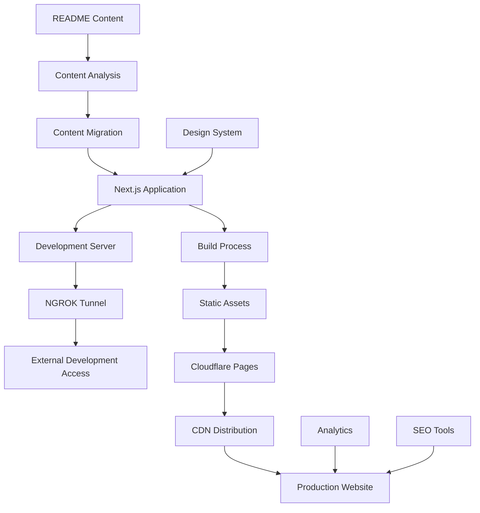

# Landing Page Creation Architecture

## Overview

This architecture creates a modern, responsive landing page for the CTO platform using Next.js, with development exposure through NGROK and production deployment via Cloudflare Pages. The design focuses on performance, accessibility, and professional presentation of the platform's capabilities.

## Architecture Principles

1. **Performance First**: Optimize for fast loading and smooth interactions
2. **Responsive Design**: Ensure excellent experience across all devices
3. **Accessibility**: Follow WCAG guidelines for inclusive design
4. **SEO Optimization**: Implement best practices for search engine visibility
5. **Content-Driven**: Structure based on README content with enhanced presentation

## System Architecture

### High-Level Design



## Component Design

### 1. Next.js Application Structure

Modern React application with TypeScript and optimized build process.

```typescript
// pages/index.tsx - Main Landing Page
import { NextPage } from 'next';
import Head from 'next/head';
import { HeroSection } from '../components/HeroSection';
import { FeaturesSection } from '../components/FeaturesSection';
import { ArchitectureSection } from '../components/ArchitectureSection';
import { GettingStartedSection } from '../components/GettingStartedSection';
import { DocumentationSection } from '../components/DocumentationSection';
import { ExamplesSection } from '../components/ExamplesSection';
import { CommunitySection } from '../components/CommunitySection';
import { Footer } from '../components/Footer';

const LandingPage: NextPage = () => {
  return (
    <>
      <Head>
        <title>CTO Platform - Multi-Agent Software Development Orchestration</title>
        <meta name="description" content="Professional multi-agent software development orchestration platform with CLI-agnostic support, automated remediation, and comprehensive monitoring." />
        <meta name="viewport" content="width=device-width, initial-scale=1" />
        <link rel="icon" href="/favicon.ico" />
        
        {/* Open Graph */}
        <meta property="og:title" content="CTO Platform" />
        <meta property="og:description" content="Multi-Agent Software Development Orchestration Platform" />
        <meta property="og:type" content="website" />
        <meta property="og:url" content="https://cto.5dlabs.com" />
        <meta property="og:image" content="/og-image.png" />
        
        {/* Twitter Card */}
        <meta name="twitter:card" content="summary_large_image" />
        <meta name="twitter:title" content="CTO Platform" />
        <meta name="twitter:description" content="Multi-Agent Software Development Orchestration Platform" />
        <meta name="twitter:image" content="/og-image.png" />
      </Head>
      
      <main className="min-h-screen">
        <HeroSection />
        <FeaturesSection />
        <ArchitectureSection />
        <GettingStartedSection />
        <DocumentationSection />
        <ExamplesSection />
        <CommunitySection />
      </main>
      
      <Footer />
    </>
  );
};

export default LandingPage;
```

### 2. Hero Section Component

Eye-catching introduction with clear value proposition.

```typescript
// components/HeroSection.tsx
import { useState, useEffect } from 'react';
import { motion } from 'framer-motion';

export const HeroSection: React.FC = () => {
  const [isVisible, setIsVisible] = useState(false);

  useEffect(() => {
    setIsVisible(true);
  }, []);

  return (
    <section className="relative min-h-screen flex items-center justify-center bg-gradient-to-br from-blue-900 via-purple-900 to-indigo-900 overflow-hidden">
      {/* Background Animation */}
      <div className="absolute inset-0">
        <div className="absolute inset-0 bg-[url('/grid.svg')] bg-center [mask-image:linear-gradient(180deg,white,rgba(255,255,255,0))]" />
      </div>
      
      {/* Floating Elements */}
      <div className="absolute inset-0">
        <motion.div
          className="absolute top-1/4 left-1/4 w-2 h-2 bg-blue-400 rounded-full"
          animate={{
            y: [0, -20, 0],
            opacity: [0.5, 1, 0.5],
          }}
          transition={{
            duration: 3,
            repeat: Infinity,
            ease: "easeInOut",
          }}
        />
        <motion.div
          className="absolute top-3/4 right-1/4 w-3 h-3 bg-purple-400 rounded-full"
          animate={{
            y: [0, 20, 0],
            opacity: [0.5, 1, 0.5],
          }}
          transition={{
            duration: 4,
            repeat: Infinity,
            ease: "easeInOut",
          }}
        />
      </div>

      <div className="relative z-10 text-center px-4 sm:px-6 lg:px-8">
        <motion.div
          initial={{ opacity: 0, y: 20 }}
          animate={{ opacity: isVisible ? 1 : 0, y: isVisible ? 0 : 20 }}
          transition={{ duration: 0.8 }}
        >
          <h1 className="text-4xl sm:text-6xl lg:text-7xl font-bold text-white mb-6">
            CTO Platform
          </h1>
          <p className="text-xl sm:text-2xl lg:text-3xl text-blue-200 mb-8 max-w-4xl mx-auto">
            Multi-Agent Software Development Orchestration Platform
          </p>
          <p className="text-lg sm:text-xl text-gray-300 mb-12 max-w-3xl mx-auto">
            Streamline your development workflow with AI-powered agents, CLI-agnostic support, 
            automated remediation, and comprehensive monitoring.
          </p>
          
          <div className="flex flex-col sm:flex-row gap-4 justify-center">
            <motion.button
              whileHover={{ scale: 1.05 }}
              whileTap={{ scale: 0.95 }}
              className="bg-blue-600 hover:bg-blue-700 text-white px-8 py-4 rounded-lg font-semibold text-lg transition-colors"
            >
              Get Started
            </motion.button>
            <motion.button
              whileHover={{ scale: 1.05 }}
              whileTap={{ scale: 0.95 }}
              className="border-2 border-white text-white hover:bg-white hover:text-blue-900 px-8 py-4 rounded-lg font-semibold text-lg transition-colors"
            >
              View Documentation
            </motion.button>
          </div>
        </motion.div>
      </div>
      
      {/* Scroll Indicator */}
      <motion.div
        className="absolute bottom-8 left-1/2 transform -translate-x-1/2"
        animate={{ y: [0, 10, 0] }}
        transition={{ duration: 2, repeat: Infinity }}
      >
        <div className="w-6 h-10 border-2 border-white rounded-full flex justify-center">
          <div className="w-1 h-3 bg-white rounded-full mt-2" />
        </div>
      </motion.div>
    </section>
  );
};
```

### 3. Features Section Component

Showcase key platform capabilities with interactive elements.

```typescript
// components/FeaturesSection.tsx
import { useState } from 'react';
import { motion } from 'framer-motion';
import { 
  CodeIcon, 
  CogIcon, 
  ShieldCheckIcon, 
  ChartBarIcon,
  CloudIcon,
  LightningBoltIcon 
} from '@heroicons/react/outline';

const features = [
  {
    icon: CodeIcon,
    title: "CLI-Agnostic Platform",
    description: "Support for multiple AI CLI tools including Claude, Cursor, OpenHands, Grok, and more.",
    details: "Abstract away CLI differences with standardized interfaces and configuration bridges."
  },
  {
    icon: CogIcon,
    title: "Agent Orchestration",
    description: "Intelligent multi-agent workflow with Rex, Cleo, and Tess working together.",
    details: "Automated task distribution, quality assurance, and testing coordination."
  },
  {
    icon: ShieldCheckIcon,
    title: "Automated Remediation",
    description: "Self-healing workflows with automated feedback loops and issue resolution.",
    details: "QA findings automatically trigger fixes without human intervention."
  },
  {
    icon: ChartBarIcon,
    title: "Comprehensive Monitoring",
    description: "Real-time visibility into agent health, performance, and system status.",
    details: "Victoria Logs, Victoria Metrics, and Grafana integration with Discord alerting."
  },
  {
    icon: CloudIcon,
    title: "Kubernetes Native",
    description: "Built for cloud-native environments with Helm charts and container orchestration.",
    details: "Easy deployment and scaling in any Kubernetes environment."
  },
  {
    icon: LightningBoltIcon,
    title: "High Performance",
    description: "Optimized for speed with static tool configurations and efficient resource usage.",
    details: "70% reduction in token usage and 50% faster agent startup times."
  }
];

export const FeaturesSection: React.FC = () => {
  const [selectedFeature, setSelectedFeature] = useState(0);

  return (
    <section className="py-20 bg-white">
      <div className="max-w-7xl mx-auto px-4 sm:px-6 lg:px-8">
        <motion.div
          initial={{ opacity: 0, y: 20 }}
          whileInView={{ opacity: 1, y: 0 }}
          transition={{ duration: 0.8 }}
          viewport={{ once: true }}
          className="text-center mb-16"
        >
          <h2 className="text-3xl sm:text-4xl lg:text-5xl font-bold text-gray-900 mb-6">
            Platform Features
          </h2>
          <p className="text-xl text-gray-600 max-w-3xl mx-auto">
            Comprehensive multi-agent orchestration with enterprise-grade features 
            for modern software development teams.
          </p>
        </motion.div>

        <div className="grid grid-cols-1 lg:grid-cols-2 gap-8">
          {/* Feature Cards */}
          <div className="space-y-4">
            {features.map((feature, index) => (
              <motion.div
                key={index}
                initial={{ opacity: 0, x: -20 }}
                whileInView={{ opacity: 1, x: 0 }}
                transition={{ duration: 0.5, delay: index * 0.1 }}
                viewport={{ once: true }}
                className={`p-6 rounded-lg cursor-pointer transition-all ${
                  selectedFeature === index
                    ? 'bg-blue-50 border-2 border-blue-200'
                    : 'bg-gray-50 border-2 border-transparent hover:bg-gray-100'
                }`}
                onClick={() => setSelectedFeature(index)}
              >
                <div className="flex items-start space-x-4">
                  <feature.icon className="w-8 h-8 text-blue-600 flex-shrink-0 mt-1" />
                  <div>
                    <h3 className="text-lg font-semibold text-gray-900 mb-2">
                      {feature.title}
                    </h3>
                    <p className="text-gray-600">
                      {feature.description}
                    </p>
                  </div>
                </div>
              </motion.div>
            ))}
          </div>

          {/* Feature Details */}
          <motion.div
            key={selectedFeature}
            initial={{ opacity: 0, x: 20 }}
            animate={{ opacity: 1, x: 0 }}
            transition={{ duration: 0.5 }}
            className="bg-gradient-to-br from-blue-50 to-indigo-50 p-8 rounded-lg border border-blue-200"
          >
            <div className="flex items-center mb-6">
              <features[selectedFeature].icon className="w-12 h-12 text-blue-600 mr-4" />
              <h3 className="text-2xl font-bold text-gray-900">
                {features[selectedFeature].title}
              </h3>
            </div>
            <p className="text-lg text-gray-700 leading-relaxed">
              {features[selectedFeature].details}
            </p>
            
            {/* Feature-specific content */}
            {selectedFeature === 0 && (
              <div className="mt-6 p-4 bg-white rounded-lg">
                <h4 className="font-semibold text-gray-900 mb-2">Supported CLIs:</h4>
                <div className="flex flex-wrap gap-2">
                  {['Claude', 'Cursor', 'OpenHands', 'Grok', 'Gemini', 'Qwen', 'Codex'].map((cli) => (
                    <span key={cli} className="px-3 py-1 bg-blue-100 text-blue-800 rounded-full text-sm">
                      {cli}
                    </span>
                  ))}
                </div>
              </div>
            )}
          </motion.div>
        </div>
      </div>
    </section>
  );
};
```

### 4. Architecture Section Component

Visual representation of system components and data flow.

```typescript
// components/ArchitectureSection.tsx
import { motion } from 'framer-motion';

export const ArchitectureSection: React.FC = () => {
  return (
    <section className="py-20 bg-gray-50">
      <div className="max-w-7xl mx-auto px-4 sm:px-6 lg:px-8">
        <motion.div
          initial={{ opacity: 0, y: 20 }}
          whileInView={{ opacity: 1, y: 0 }}
          transition={{ duration: 0.8 }}
          viewport={{ once: true }}
          className="text-center mb-16"
        >
          <h2 className="text-3xl sm:text-4xl lg:text-5xl font-bold text-gray-900 mb-6">
            System Architecture
          </h2>
          <p className="text-xl text-gray-600 max-w-3xl mx-auto">
            Modern, scalable architecture built on Kubernetes with intelligent 
            agent orchestration and comprehensive monitoring.
          </p>
        </motion.div>

        <div className="relative">
          {/* Architecture Diagram */}
          <motion.div
            initial={{ opacity: 0, scale: 0.9 }}
            whileInView={{ opacity: 1, scale: 1 }}
            transition={{ duration: 1 }}
            viewport={{ once: true }}
            className="bg-white rounded-lg shadow-xl p-8"
          >
            <div className="grid grid-cols-1 lg:grid-cols-3 gap-8">
              {/* Agent Layer */}
              <div className="space-y-4">
                <h3 className="text-xl font-semibold text-gray-900 mb-4">Agent Layer</h3>
                <div className="space-y-3">
                  <div className="p-4 bg-blue-50 rounded-lg border border-blue-200">
                    <h4 className="font-medium text-blue-900">Rex (Implementation)</h4>
                    <p className="text-sm text-blue-700">Code generation, file operations, Git management</p>
                  </div>
                  <div className="p-4 bg-green-50 rounded-lg border border-green-200">
                    <h4 className="font-medium text-green-900">Cleo (Quality)</h4>
                    <p className="text-sm text-green-700">Code review, validation, testing</p>
                  </div>
                  <div className="p-4 bg-purple-50 rounded-lg border border-purple-200">
                    <h4 className="font-medium text-purple-900">Tess (QA)</h4>
                    <p className="text-sm text-purple-700">Testing, verification, reporting</p>
                  </div>
                </div>
              </div>

              {/* Orchestration Layer */}
              <div className="space-y-4">
                <h3 className="text-xl font-semibold text-gray-900 mb-4">Orchestration Layer</h3>
                <div className="space-y-3">
                  <div className="p-4 bg-indigo-50 rounded-lg border border-indigo-200">
                    <h4 className="font-medium text-indigo-900">ArgoCD</h4>
                    <p className="text-sm text-indigo-700">GitOps deployment and management</p>
                  </div>
                  <div className="p-4 bg-indigo-50 rounded-lg border border-indigo-200">
                    <h4 className="font-medium text-indigo-900">Argo Workflows</h4>
                    <p className="text-sm text-indigo-700">Workflow orchestration and execution</p>
                  </div>
                  <div className="p-4 bg-indigo-50 rounded-lg border border-indigo-200">
                    <h4 className="font-medium text-indigo-900">Controller</h4>
                    <p className="text-sm text-indigo-700">Multi-agent coordination and management</p>
                  </div>
                </div>
              </div>

              {/* Infrastructure Layer */}
              <div className="space-y-4">
                <h3 className="text-xl font-semibold text-gray-900 mb-4">Infrastructure Layer</h3>
                <div className="space-y-3">
                  <div className="p-4 bg-orange-50 rounded-lg border border-orange-200">
                    <h4 className="font-medium text-orange-900">Victoria Logs</h4>
                    <p className="text-sm text-orange-700">Centralized log storage and querying</p>
                  </div>
                  <div className="p-4 bg-orange-50 rounded-lg border border-orange-200">
                    <h4 className="font-medium text-orange-900">Victoria Metrics</h4>
                    <p className="text-sm text-orange-700">Time-series metrics storage</p>
                  </div>
                  <div className="p-4 bg-orange-50 rounded-lg border border-orange-200">
                    <h4 className="font-medium text-orange-900">Grafana</h4>
                    <p className="text-sm text-orange-700">Visualization and alerting</p>
                  </div>
                </div>
              </div>
            </div>

            {/* Data Flow Arrows */}
            <div className="mt-8 flex justify-center">
              <div className="flex items-center space-x-4 text-gray-500">
                <span>Agents</span>
                <svg className="w-6 h-6" fill="none" stroke="currentColor" viewBox="0 0 24 24">
                  <path strokeLinecap="round" strokeLinejoin="round" strokeWidth={2} d="M13 7l5 5m0 0l-5 5m5-5H6" />
                </svg>
                <span>Orchestration</span>
                <svg className="w-6 h-6" fill="none" stroke="currentColor" viewBox="0 0 24 24">
                  <path strokeLinecap="round" strokeLinejoin="round" strokeWidth={2} d="M13 7l5 5m0 0l-5 5m5-5H6" />
                </svg>
                <span>Infrastructure</span>
              </div>
            </div>
          </motion.div>
        </div>
      </div>
    </section>
  );
};
```

### 5. NGROK Development Configuration

Development tunnel setup for external access during development.

```typescript
// scripts/dev-tunnel.ts
import { spawn } from 'child_process';
import { config } from 'dotenv';

config();

const NGROK_AUTH_TOKEN = process.env.NGROK_AUTH_TOKEN;
const DEV_PORT = process.env.DEV_PORT || '3000';

if (!NGROK_AUTH_TOKEN) {
  console.error('NGROK_AUTH_TOKEN environment variable is required');
  process.exit(1);
}

export const startNgrokTunnel = () => {
  console.log('Starting NGROK tunnel...');
  
  const ngrok = spawn('ngrok', [
    'http',
    DEV_PORT,
    '--authtoken',
    NGROK_AUTH_TOKEN,
    '--log=stdout'
  ]);

  ngrok.stdout.on('data', (data) => {
    const output = data.toString();
    console.log(output);
    
    // Extract public URL from NGROK output
    const urlMatch = output.match(/https:\/\/[a-zA-Z0-9-]+\.ngrok\.io/);
    if (urlMatch) {
      console.log(`\n🚀 Development server accessible at: ${urlMatch[0]}`);
      console.log('Share this URL for external testing\n');
    }
  });

  ngrok.stderr.on('data', (data) => {
    console.error(`NGROK Error: ${data}`);
  });

  ngrok.on('close', (code) => {
    console.log(`NGROK tunnel closed with code ${code}`);
  });

  return ngrok;
};

// package.json script
// "dev:tunnel": "ts-node scripts/dev-tunnel.ts"
```

### 6. Cloudflare Pages Configuration

Production deployment configuration for Cloudflare Pages.

```yaml
# .cloudflare/pages.yaml
name: cto-platform-landing
compatibility_date: 2024-01-01
compatibility_flags:
  - nodejs_compat

[build]
command = "npm run build"
output_directory = ".next"

[build.environment]
NODE_VERSION = "18"

[[redirects]]
from = "/*"
to = "/index.html"
status = 200

[env.production]
name = "CTO Platform Landing"
url = "https://cto.5dlabs.com"

[env.staging]
name = "CTO Platform Landing (Staging)"
url = "https://staging.cto.5dlabs.com"
```

```json
// next.config.js
/** @type {import('next').NextConfig} */
const nextConfig = {
  reactStrictMode: true,
  swcMinify: true,
  
  // Image optimization
  images: {
    domains: ['cto.5dlabs.com'],
    formats: ['image/webp', 'image/avif'],
  },
  
  // Performance optimization
  experimental: {
    optimizeCss: true,
    optimizePackageImports: ['@heroicons/react'],
  },
  
  // Headers for security and performance
  async headers() {
    return [
      {
        source: '/(.*)',
        headers: [
          {
            key: 'X-Frame-Options',
            value: 'DENY',
          },
          {
            key: 'X-Content-Type-Options',
            value: 'nosniff',
          },
          {
            key: 'Referrer-Policy',
            value: 'origin-when-cross-origin',
          },
          {
            key: 'Permissions-Policy',
            value: 'camera=(), microphone=(), geolocation=()',
          },
        ],
      },
      {
        source: '/static/(.*)',
        headers: [
          {
            key: 'Cache-Control',
            value: 'public, max-age=31536000, immutable',
          },
        ],
      },
    ];
  },
  
  // Redirects
  async redirects() {
    return [
      {
        source: '/docs',
        destination: '/documentation',
        permanent: true,
      },
      {
        source: '/guide',
        destination: '/getting-started',
        permanent: true,
      },
    ];
  },
};

module.exports = nextConfig;
```

### 7. Analytics and Monitoring

Performance monitoring and analytics integration.

```typescript
// lib/analytics.ts
import { Analytics } from '@vercel/analytics/react';

export const AnalyticsWrapper: React.FC<{ children: React.ReactNode }> = ({ children }) => {
  return (
    <>
      {children}
      <Analytics />
    </>
  );
};

// Custom analytics events
export const trackEvent = (eventName: string, properties?: Record<string, any>) => {
  if (typeof window !== 'undefined' && window.gtag) {
    window.gtag('event', eventName, properties);
  }
};

// Performance monitoring
export const trackPageView = (url: string) => {
  trackEvent('page_view', { page_location: url });
};

export const trackFeatureClick = (featureName: string) => {
  trackEvent('feature_click', { feature_name: featureName });
};

export const trackDocumentationView = (docSection: string) => {
  trackEvent('documentation_view', { section: docSection });
};
```

### 8. SEO Optimization

Comprehensive SEO implementation for better search visibility.

```typescript
// components/SEOHead.tsx
import Head from 'next/head';

interface SEOHeadProps {
  title?: string;
  description?: string;
  image?: string;
  url?: string;
  type?: string;
}

export const SEOHead: React.FC<SEOHeadProps> = ({
  title = "CTO Platform - Multi-Agent Software Development Orchestration",
  description = "Professional multi-agent software development orchestration platform with CLI-agnostic support, automated remediation, and comprehensive monitoring.",
  image = "/og-image.png",
  url = "https://cto.5dlabs.com",
  type = "website"
}) => {
  return (
    <Head>
      {/* Basic Meta Tags */}
      <title>{title}</title>
      <meta name="description" content={description} />
      <meta name="viewport" content="width=device-width, initial-scale=1" />
      
      {/* Open Graph */}
      <meta property="og:title" content={title} />
      <meta property="og:description" content={description} />
      <meta property="og:type" content={type} />
      <meta property="og:url" content={url} />
      <meta property="og:image" content={image} />
      <meta property="og:site_name" content="CTO Platform" />
      
      {/* Twitter Card */}
      <meta name="twitter:card" content="summary_large_image" />
      <meta name="twitter:title" content={title} />
      <meta name="twitter:description" content={description} />
      <meta name="twitter:image" content={image} />
      
      {/* Additional SEO */}
      <meta name="robots" content="index, follow" />
      <meta name="author" content="5D Labs" />
      <meta name="keywords" content="multi-agent, software development, orchestration, CLI, automation, Kubernetes, monitoring" />
      
      {/* Canonical URL */}
      <link rel="canonical" href={url} />
      
      {/* Favicon */}
      <link rel="icon" type="image/x-icon" href="/favicon.ico" />
      <link rel="apple-touch-icon" sizes="180x180" href="/apple-touch-icon.png" />
      <link rel="icon" type="image/png" sizes="32x32" href="/favicon-32x32.png" />
      <link rel="icon" type="image/png" sizes="16x16" href="/favicon-16x16.png" />
      
      {/* Structured Data */}
      <script
        type="application/ld+json"
        dangerouslySetInnerHTML={{
          __html: JSON.stringify({
            "@context": "https://schema.org",
            "@type": "SoftwareApplication",
            "name": "CTO Platform",
            "description": description,
            "url": url,
            "applicationCategory": "DeveloperApplication",
            "operatingSystem": "Linux, macOS, Windows",
            "offers": {
              "@type": "Offer",
              "price": "0",
              "priceCurrency": "USD"
            },
            "author": {
              "@type": "Organization",
              "name": "5D Labs"
            }
          })
        }}
      />
    </Head>
  );
};
```

## Deployment Pipeline

### Development Workflow
```bash
# Development with NGROK tunnel
npm run dev:tunnel

# Build for production
npm run build

# Test production build locally
npm run start
```

### Cloudflare Pages Deployment
```bash
# Deploy to Cloudflare Pages
wrangler pages deploy .next --project-name=cto-platform-landing

# Set environment variables
wrangler pages secret put NODE_ENV --project-name=cto-platform-landing
wrangler pages secret put ANALYTICS_ID --project-name=cto-platform-landing
```

### Performance Monitoring
```typescript
// lib/performance.ts
export const measurePageLoad = () => {
  if (typeof window !== 'undefined') {
    window.addEventListener('load', () => {
      const navigation = performance.getEntriesByType('navigation')[0] as PerformanceNavigationTiming;
      const loadTime = navigation.loadEventEnd - navigation.loadEventStart;
      
      trackEvent('page_load_time', {
        load_time: loadTime,
        url: window.location.href
      });
    });
  }
};
```

This architecture provides a modern, performant, and accessible landing page that effectively showcases the CTO platform's capabilities while maintaining excellent user experience across all devices and deployment environments.
