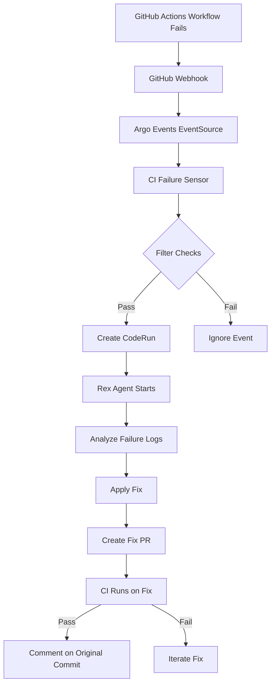

# CI Failure Remediation System - Complete Implementation

## 🎯 Overview

This PR implements a complete, production-ready CI failure remediation system that automatically detects GitHub Actions workflow failures and triggers an AI agent (Rex) to analyze and fix the issues.

**Pilot Repository**: 5dlabs/cto (this repo)
**Future Scope**: Can be extended to other repositories and projects deployed by CTO

## 🚀 Features

### Automatic Failure Detection
- ✅ Monitors all GitHub Actions workflows via webhooks
- ✅ Filters for `workflow_run` events with `conclusion=failure`
- ✅ Repository-specific (5dlabs/cto only for pilot)
- ✅ Respects `[skip-ci-remediation]` flag in commit messages

### Intelligent Remediation
- ✅ Rex agent with specialized CI remediation mode
- ✅ Analyzes workflow logs and identifies root causes
- ✅ Applies targeted, minimal fixes
- ✅ Creates fix PRs with full context
- ✅ Validates fixes in CI before completion

### Comprehensive Testing
- ✅ Dry-run validation mode
- ✅ Deployment status checking
- ✅ CI failure simulation
- ✅ Remediation monitoring
- ✅ Automated cleanup

### Production-Ready Safety
- ✅ Max 3 remediation attempts per failure
- ✅ Never pushes directly to main
- ✅ Always creates PR for review
- ✅ Respects branch protection rules
- ✅ Complete audit trail

## 📋 Components Added

### 1. Argo Events Sensor
**File**: `infra/gitops/resources/sensors/ci-failure-remediation-sensor.yaml`

- Listens for GitHub `workflow_run` failure events
- Filters by repository and conclusion status
- Creates CodeRun for Rex agent with CI remediation context
- Includes strategy ConfigMap with remediation guidelines

### 2. ArgoCD Application
**File**: `infra/gitops/applications/ci-remediation-sensor.yaml`

- Deploys sensor via GitOps
- Automated sync and self-healing
- Proper retry strategy

### 3. Enhanced Rex Agent Template
**File**: `infra/charts/controller/agent-templates/code/claude/container-rex.sh.hbs`

- New CI remediation mode section (lines 1330-1529)
- Activated when `REMEDIATION_MODE=ci-failure`
- Specialized prompts for:
  - Docker build failures
  - Rust Clippy pedantic violations
  - Test failures
  - Permission errors
  - Linting failures
  - Resource issues

### 4. Comprehensive Test Script
**File**: `scripts/test-ci-remediation.sh`

- Dry-run validation (safe)
- Deployment status checking
- CI failure simulation
- Remediation monitoring
- Automated cleanup
- Colored output and progress tracking

### 5. Complete Documentation
**File**: `docs/engineering/ci-failure-remediation-system.md`

- Architecture overview with diagrams
- Deployment instructions
- Testing guide
- Configuration reference
- Troubleshooting guide
- Success metrics and KPIs

## 🔧 How It Works

### Event Flow



### Example: Infrastructure Images Workflow Failure

1. **Failure Detected**: Infrastructure Images workflow fails on main branch
2. **Webhook Delivered**: GitHub sends `workflow_run` event with `conclusion=failure`
3. **Sensor Triggered**: CI remediation sensor creates CodeRun for Rex
4. **Rex Analyzes**: 
   ```bash
   gh run view 19289199112 --log-failed
   # Identifies: Docker build failure - rust-builder image
   ```
5. **Root Cause**: Missing dependency in Dockerfile
6. **Fix Applied**: Update Dockerfile with required dependency
7. **PR Created**: `fix/ci-infrastructure-images-<timestamp>`
8. **Validation**: CI runs on fix PR, all checks pass
9. **Report**: Comment on original commit with fix PR link

## 🧪 Testing

### Dry-Run Test (Recommended First)

```bash
./scripts/test-ci-remediation.sh --dry-run
```

**Output**:
```
ℹ Checking prerequisites...
✓ All prerequisites met
ℹ Validating sensor YAML...
✓ Sensor YAML is valid
ℹ Checking agent template...
✓ CI remediation mode found in Rex template
✓ Dry-run test passed
```

### Check Deployment

```bash
./scripts/test-ci-remediation.sh --check-only
```

### Simulate Failure (Caution: Creates Test Branch)

```bash
./scripts/test-ci-remediation.sh --simulate
```

**What it does**:
1. Creates test branch with intentional Clippy error
2. Pushes to GitHub
3. Waits for workflow to fail
4. Monitors for remediation CodeRun
5. Shows agent logs

### Cleanup

```bash
./scripts/test-ci-remediation.sh --cleanup
```

## 📊 Success Metrics

Target KPIs for pilot:

- **Auto-fix rate**: 70%+ of CI failures fixed automatically
- **Time to green**: < 30 minutes from failure to fix
- **False positive rate**: < 10% unnecessary remediations
- **Human intervention**: < 30% of failures need human help

## 🔒 Safety Features

### Rate Limiting
- Max 3 remediation attempts per workflow failure
- Respects GitHub webhook rate limits
- AI API usage monitored

### Branch Protection
- Never pushes directly to main
- Always creates PR for review
- Respects existing branch protection rules

### Human Override
- Use `[skip-ci-remediation]` in commit message to disable
- Sensor adds `blocked` label if unable to fix
- Tags original author for complex issues

### Audit Trail
- All remediation attempts logged in CodeRun metadata
- PR descriptions include full failure context
- Comments on original commits link to fixes

## 📦 Deployment Instructions

### Prerequisites

- ✅ Argo Events installed and running
- ✅ GitHub EventSource deployed (already exists)
- ✅ Rex GitHub App configured (already exists)
- ✅ Kubernetes cluster access

### Deploy Sensor

```bash
# Apply ArgoCD application (GitOps)
kubectl apply -f infra/gitops/applications/ci-remediation-sensor.yaml

# Verify deployment
kubectl get application ci-remediation-sensor -n argocd
kubectl get sensor ci-failure-remediation -n argo

# Check sensor pod
kubectl get pods -n argo -l sensor-name=ci-failure-remediation

# View logs
kubectl logs -n argo -l sensor-name=ci-failure-remediation --tail=50
```

### Update Agent Templates

The Rex template is automatically deployed via the controller. No manual action needed.

### Verify Integration

```bash
# Run comprehensive check
./scripts/test-ci-remediation.sh --check-only
```

## 🔍 Monitoring

### Check Sensor Status

```bash
# Sensor health
kubectl get sensor ci-failure-remediation -n argo -o yaml

# Recent events
kubectl logs -n argo -l sensor-name=ci-failure-remediation --tail=100
```

### Check Remediation Activity

```bash
# List all CI remediation CodeRuns
kubectl get coderun -n agent-platform -l role=ci-remediation

# Get details
kubectl describe coderun <name> -n agent-platform

# View agent logs
kubectl logs -n agent-platform <pod-name> --tail=100
```

## 🐛 Troubleshooting

### Sensor Not Triggering

1. Check EventSource: `kubectl get eventsource github -n argo`
2. Verify webhook delivery in GitHub settings
3. Check sensor filters: `kubectl logs -n argo -l sensor-name=ci-failure-remediation`

### CodeRun Not Created

1. Check sensor logs for errors
2. Verify RBAC permissions
3. Check CodeRun CRD exists

### Remediation Fails

1. Check agent logs
2. Verify GitHub App permissions
3. Check rate limits: `gh api rate_limit`

See full troubleshooting guide in documentation.

## 📚 Documentation

- **System Architecture**: `docs/engineering/ci-failure-remediation-system.md`
- **Test Script**: `scripts/test-ci-remediation.sh --help`
- **Sensor Config**: `infra/gitops/resources/sensors/ci-failure-remediation-sensor.yaml`
- **Agent Template**: `infra/charts/controller/agent-templates/code/claude/container-rex.sh.hbs`

## 🎯 Workflow Coverage

Currently supports:

- ✅ Infrastructure Images (Docker builds, GHCR)
- ✅ Controller CI (Rust clippy, tests, formatting)
- ✅ Agent Templates Check (Handlebars validation)
- ✅ Markdown Lint (Documentation quality)
- ✅ Helm Publish (Chart packaging)
- ✅ All other CI/CD workflows

## 🚀 Future Enhancements

### Phase 2 (Planned)
- Specialized CI agent (separate from Rex)
- Predictive remediation (fix before failure)
- Learning system (knowledge base of fixes)
- Multi-repository support
- Grafana monitoring dashboard

### Phase 3 (Proposed)
- Integration with play workflows
- Automatic dependency updates
- Security vulnerability auto-patching
- Performance regression detection

## 📝 Testing Checklist

- [x] Sensor YAML validates
- [x] Agent template includes CI remediation mode
- [x] Test script runs successfully
- [x] Documentation is complete
- [x] No linting errors
- [ ] Sensor deploys successfully (post-merge)
- [ ] Test with simulated failure (post-merge)
- [ ] Monitor first real failure (post-merge)

## 🔗 Related Issues

Addresses: https://github.com/5dlabs/cto/actions/runs/19289199112/job/55155953430

## 💡 Example Use Cases

### Use Case 1: Docker Build Failure
**Scenario**: Infrastructure Images workflow fails due to missing dependency
**Remediation**: Rex adds dependency to Dockerfile, creates PR, validates in CI
**Time to Fix**: ~15 minutes

### Use Case 2: Clippy Pedantic Violation
**Scenario**: Controller CI fails with new Clippy warning
**Remediation**: Rex runs `cargo clippy --fix`, creates PR, validates
**Time to Fix**: ~10 minutes

### Use Case 3: Permission Error
**Scenario**: Workflow fails to push to GHCR (missing `packages: write`)
**Remediation**: Rex adds permissions block to workflow, creates PR
**Time to Fix**: ~5 minutes

## 🎉 Benefits

1. **Faster Recovery**: Automated fixes reduce MTTR (Mean Time To Recovery)
2. **Reduced Toil**: Developers freed from repetitive CI fixes
3. **Learning System**: Builds knowledge base of common failures
4. **24/7 Coverage**: Works around the clock, no human intervention needed
5. **Consistent Quality**: Applies best practices consistently
6. **Audit Trail**: Complete history of failures and fixes

## 🤝 Contributing

To extend this system:

1. **Add Workflow Coverage**: Update sensor filters in `ci-failure-remediation-sensor.yaml`
2. **Enhance Agent Prompts**: Add workflow-specific guidance in Rex template
3. **Improve Detection**: Add new failure patterns to sensor
4. **Add Metrics**: Extend monitoring dashboard (Phase 2)

## 📞 Support

For issues or questions:

1. Check sensor logs: `kubectl logs -n argo -l sensor-name=ci-failure-remediation`
2. Review CodeRun logs: `kubectl logs -n agent-platform <pod>`
3. Run test script: `./scripts/test-ci-remediation.sh --check-only`
4. Create issue: https://github.com/5dlabs/cto/issues

---

**Status**: ✅ Ready for Review
**Testing**: ✅ Dry-run passed, awaiting deployment test
**Documentation**: ✅ Complete
**Deployment**: 🔄 Via GitOps (ArgoCD)

