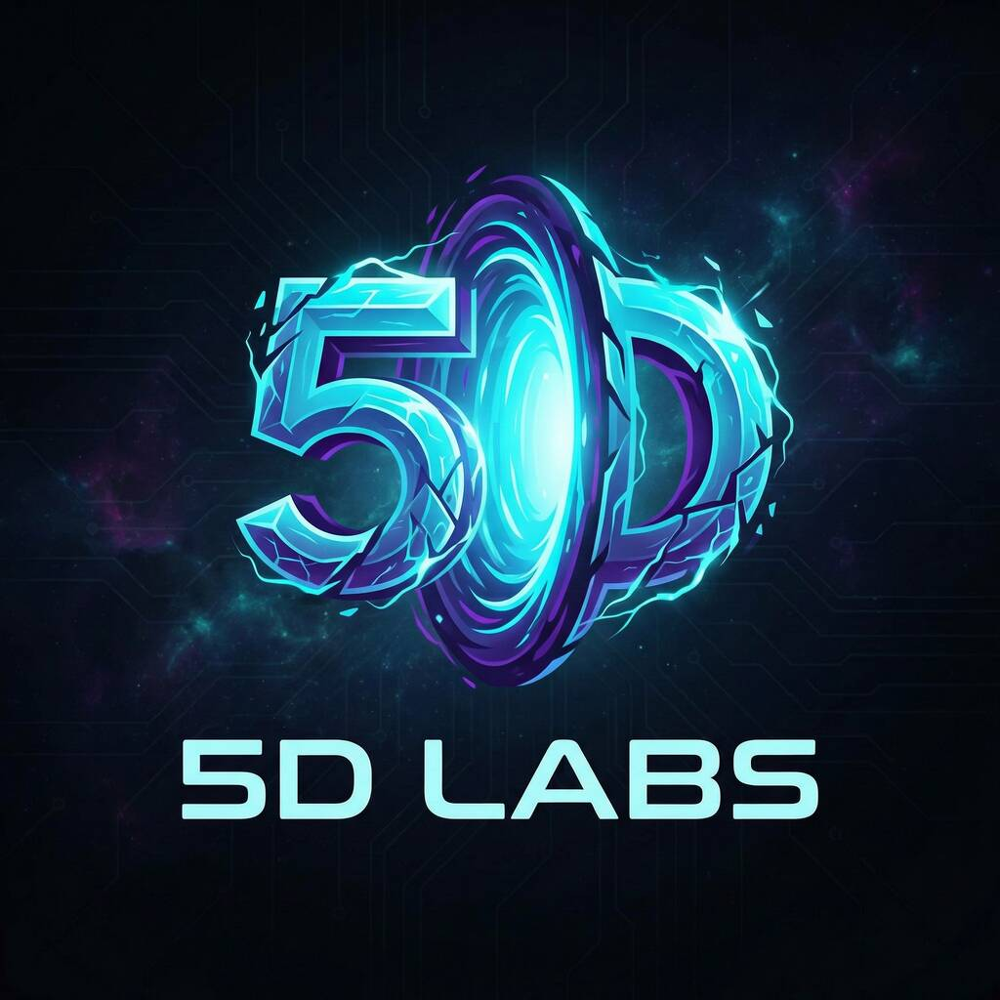
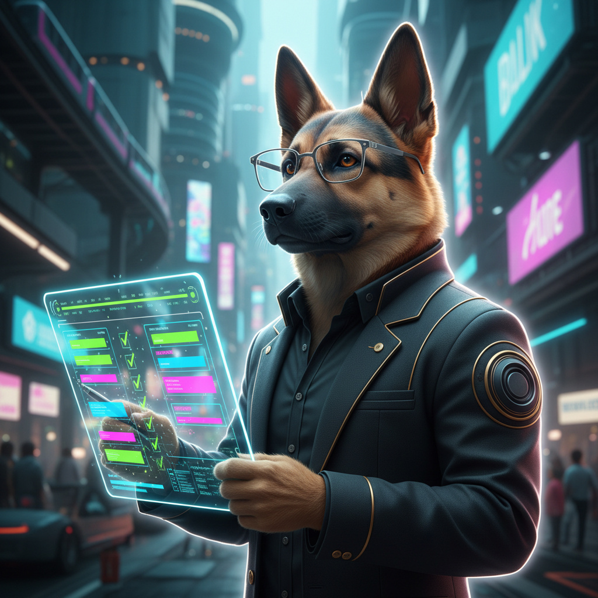

<div align="center">

> **Note:** This project is under active development and is not yet ready for production use. APIs, configurations, and documentation may change without notice. Contributions and feedback are welcome!



# **Cognitive Task Orchestrator**
## **AI Engineering Team + Open Source Bare Metal Infrastructure** 🚀

[](https://github.com/5dlabs/cto)
[](https://discord.gg/A6yydvjZKY)
[](LICENSE)
[](https://kubernetes.io/)

### **💎 Self-Hosted AI Development Platform • Bare-Metal Ready • MCP Native 💎**
*Deploy an autonomous engineering team on your own infrastructure—ship production code while slashing cloud & staffing costs*

</div>

---

<div align="center">

## **💰 Why CTO?**

<table>
<tr>
<td align="center" width="33%">

### **🏗️ Full Engineering Team**
13 specialized AI agents covering backend, frontend, QA, security, and DevOps—working 24/7

</td>
<td align="center" width="33%">

### **🔧 Self-Hosted & Bare-Metal**
Deploy on your own infrastructure: bare-metal servers, on-prem, or any cloud—no vendor lock-in

</td>
<td align="center" width="33%">

### **💸 Massive Cost Savings**
Cut cloud bills with bare-metal deployment + reduce engineering headcount for routine tasks

</td>
</tr>
</table>

### **💵 Cost Comparison**

| Traditional Approach | With CTO |
|---------------------|----------|
| $150k-250k/yr per engineer × 5-10 | **~$500-2k/mo** model usage (or self-host for near-zero) |
| $5k-50k/mo managed cloud services | **60-80% savings** on bare-metal |
| 24/7 on-call rotation costs | **Automated** self-healing |
| Weeks to onboard new team members | **Instant** agent deployment |

**Local Model Support**: Run Ollama, vLLM, or other local inference—bring your own GPUs and pay only for electricity.

### **🔐 Bring Your Own Keys (BYOK)**

- **Your API keys** — Anthropic, OpenAI, Google, etc. stored securely in your infrastructure
- **Your infrastructure credentials** — Cloud (AWS, GCP, Azure) or bare-metal (Latitude, Hetzner) keys never leave your cluster
- **Secret management with OpenBao** — Open-source HashiCorp Vault fork for enterprise-grade secrets
- **Zero vendor lock-in** — Switch providers anytime, no data hostage situations

### **🌐 Zero-Trust Networking**

| Feature | Technology | What It Does |
|---------|------------|--------------|
| **Cloudflare Tunnels** | `cloudflared` | Expose services publicly without opening firewall ports — no public IPs needed, automatic TLS, global edge CDN |
| **Kilo VPN** | WireGuard | Secure mesh VPN for remote cluster access — connect from anywhere with encrypted tunnels |
| **OpenBao** | Vault fork | Centralized secrets management with dynamic credentials and audit logging |

Your entire platform can run on air-gapped infrastructure while still being accessible from anywhere. No ingress controllers, no load balancers, no exposed ports—just secure outbound tunnels.

### **🏭 Infrastructure Operators (Managed by Bolt)**

Replace expensive managed cloud services with open-source Kubernetes operators:

| Operator | Replaces | Savings | License |
|----------|----------|---------|---------|
| **CloudNative-PG** | AWS RDS PostgreSQL, Cloud SQL, Azure PostgreSQL | ~70-80% | Apache 2.0 |
| **Percona MySQL** | AWS RDS MySQL, Aurora, Cloud SQL MySQL | ~70-80% | Apache 2.0 |
| **Percona MongoDB** | MongoDB Atlas, DocumentDB | ~60-70% | Apache 2.0 |
| **Strimzi Kafka** | AWS MSK, Confluent Cloud | ~60-70% | Apache 2.0 |
| **RabbitMQ** | Amazon MQ, CloudAMQP | ~70-80% | MPL 2.0 |
| **NATS** | AWS SNS/SQS, GCP Pub/Sub | ~80-90% | Apache 2.0 |
| **SeaweedFS** | AWS S3, GCS, Azure Blob | ~80-90% | Apache 2.0 |
| **Redis Operator** | ElastiCache, Memorystore | ~70-80% | Apache 2.0 |
| **OpenSearch** | AWS OpenSearch, Elastic Cloud | ~60-70% | Apache 2.0 |
| **ClickHouse** | BigQuery, Redshift, Snowflake | ~70-80% | Apache 2.0 |
| **QuestDB** | TimescaleDB Cloud, InfluxDB Cloud | ~70-80% | Apache 2.0 |
| **Keycloak** | AWS Cognito, Auth0, Okta | ~90%+ | Apache 2.0 |
| **Temporal** | AWS Step Functions, Azure Logic Apps | ~80-90% | Apache 2.0 |
| **ScyllaDB** | AWS DynamoDB, Cassandra Managed | ~70-80% | Apache 2.0 |

**Bolt** automatically deploys, monitors, and maintains these operators—giving you managed-service reliability at self-hosted prices.

### **🌐 Supported Infrastructure Providers**

Deploy CTO on any infrastructure—bare-metal, on-premises, or cloud:

#### **Bare-Metal Providers**

| Provider | Description | Regions |
|----------|-------------|---------|
| **🌟 Sidero Metal** | **Bare-metal provisioning for Talos Linux** — API-driven Cluster API integration for automated server lifecycle management | **Any infrastructure** |
| **🌟 Omni** | **Managed Kubernetes SaaS** — API-driven cluster management on bare-metal, edge, or cloud with Talos Linux | **Global SaaS** |
| **Latitude.sh** | Global bare-metal cloud with Gen4 10G+ networking | Americas, Europe, Asia-Pacific |
| **Hetzner** | European dedicated servers with excellent price/performance | Germany, Finland |
| **OVH** | European cloud & bare-metal with global reach | Europe, Americas, Asia-Pacific |
| **Vultr** | Global bare-metal & cloud with simple pricing | 25+ locations worldwide |
| **Scaleway** | European cloud provider with ARM & x86 options | France, Netherlands, Poland |
| **Cherry Servers** | European bare-metal with high-performance networking | Lithuania, Netherlands |
| **DigitalOcean** | Developer-friendly bare-metal droplets | Americas, Europe, Asia-Pacific |
| **Servers.com** | Global bare-metal and cloud with flexible deployment | Global |
| **PhoenixNAP** | Bare-metal and hybrid cloud with global data centers | Americas, Europe, Asia |
| **i3D.net** | FlexMetal bare metal API; Talos Omni supported | Americas, Europe, Asia |
| **Hivelocity** | Instant bare metal via API; custom iPXE, economical | Americas (TPA, DAL, LAX, etc.) |
| **On-Premises** | Your own hardware with Talos Linux | Anywhere |

#### **Cloud Providers**

| Provider | Services | Description |
|----------|----------|-------------|
| **AWS** | EC2, EKS | Full AWS integration for hybrid deployments |
| **Azure** | VMs, AKS | Microsoft Azure support for enterprise environments |
| **GCP** | GCE, GKE | Google Cloud Platform integration |

All providers are managed through the `cto-metal` CLI with unified provisioning workflows.

</div>

---

<div align="center">

## **🚧 Development Status**

**Stay tuned for the official release!** 🚀

The platform is under active development.

**Current Status:**
✅ Core platform architecture implemented  
✅ MCP server with dynamic tool registration  
✅ Kubernetes controllers with self-healing  
✅ GitHub Apps + Linear integration  
✅ Bare-metal deployment (Latitude, Hetzner, OVH, Vultr, Scaleway, Cherry, DigitalOcean, Servers.com, PhoenixNAP, i3D.net, Hivelocity)  
✅ Cloudflare Tunnels for public access without exposed interfaces  
✅ Infrastructure operators (PostgreSQL, MySQL, MongoDB, Kafka, RabbitMQ, NATS, Redis, SeaweedFS, OpenSearch, ClickHouse, QuestDB, Keycloak, Temporal, ScyllaDB)  
✅ Long-term memory with OpenMemory  
✅ Parallel task batching for faster development  
🔄 Documentation and onboarding improvements  
🔄 Automatic agent provisioning (including GitHub App creation)  

</div>

---

<div align="center">

## **Meet Your AI Engineering Team**

*Thirteen specialized agents with distinct personalities working together 24/7—your full-stack engineering department in a box*

<div align="center">

### **🎯 Project Management & Architecture**

<table>
<tr>
<td align="center" width="100%">

### **Morgan**
#### *The Technical Program Manager*

<div align="center">

</div>

🐕 **Personality:** Articulate & organized  
📋 **Superpower:** Turns chaos into actionable roadmaps  
💬 **Motto:** *"A plan without tasks is just a wish."*

**Morgan orchestrates project lifecycles—syncing GitHub Issues with Linear roadmaps, decomposing PRDs into sprint-ready tasks, and keeping stakeholders aligned through `intake()` MCP calls.**

</td>
</tr>
</table>

### **🦀 Backend Engineering Squad**

<table>
<tr>
<td align="center" valign="top" width="33%">

### **Rex**
#### *The Rust Architect*

<div align="center">

</div>

🦀 **Stack:** Rust, Tokio, Axum  
⚡ **Superpower:** Zero-cost abstractions at scale  
💬 **Motto:** *"If it compiles, it ships."*

**Rex builds high-performance APIs, real-time services, and systems-level infrastructure. When microseconds matter, Rex delivers.**

</td>
<td align="center" valign="top" width="33%">

### **Grizz**
#### *The Go Specialist*

<div align="center">

</div>

🐻 **Stack:** Go, gRPC, PostgreSQL  
🛠️ **Superpower:** Ships bulletproof services under pressure  
💬 **Motto:** *"Simple scales."*

**Grizz builds backend services, REST/gRPC APIs, CLI tools, and Kubernetes operators. From simple CRUD to distributed systems—battle-tested reliability is his signature.**

</td>
<td align="center" valign="top" width="33%">

### **Nova**
#### *The Node.js Engineer*

<div align="center">

</div>

✨ **Stack:** Node.js, TypeScript, Fastify  
🌌 **Superpower:** Rapid API development & integrations  
💬 **Motto:** *"Move fast, type safe."*

**Nova builds REST/GraphQL APIs, serverless functions, and third-party integrations. Speed-to-market is her specialty.**

</td>
</tr>
</table>

### **🎨 Frontend Engineering Squad**

<table>
<tr>
<td align="center" valign="top" width="33%">

### **Blaze**
#### *The Web App Developer*

<div align="center">

</div>

🎨 **Stack:** React, Next.js, shadcn/ui  
✨ **Superpower:** Pixel-perfect responsive interfaces  
💬 **Motto:** *"Great UX is invisible."*

**Blaze creates stunning web applications with modern component libraries. From dashboards to marketing sites, she delivers polished experiences.**

</td>
<td align="center" valign="top" width="33%">

### **Tap**
#### *The Mobile Developer*

<div align="center">

</div>

📱 **Stack:** Expo, React Native, NativeWind  
🎯 **Superpower:** Cross-platform mobile excellence  
💬 **Motto:** *"One codebase, every pocket."*

**Tap builds native-quality iOS and Android apps from a single TypeScript codebase. App Store ready, always.**

</td>
<td align="center" valign="top" width="33%">

### **Spark**
#### *The Desktop Developer*

<div align="center">

</div>

⚡ **Stack:** Electron, Tauri, React  
🖥️ **Superpower:** Native desktop apps that feel right  
💬 **Motto:** *"Desktop isn't dead—it's evolved."*

**Spark crafts cross-platform desktop applications with native integrations, system tray support, and offline-first architectures.**

</td>
</tr>
</table>

### **🛡️ Quality & Security Squad**

<table>
<tr>
<td align="center" valign="top" width="33%">

### **Cleo**
#### *The Quality Guardian*

<div align="center">

</div>

🔍 **Personality:** Meticulous & wise  
✨ **Superpower:** Spots code smells instantly  
💬 **Motto:** *"Excellence isn't negotiable."*

**Cleo refactors for maintainability, enforces patterns, and ensures enterprise-grade code quality across every PR.**

</td>
<td align="center" valign="top" width="33%">

### **Cipher**
#### *The Security Sentinel*

<div align="center">

</div>

🛡️ **Personality:** Vigilant & protective  
🔒 **Superpower:** Finds vulnerabilities before attackers  
💬 **Motto:** *"Trust nothing, verify everything."*

**Cipher runs security audits, dependency scans, and ensures OWASP compliance across all workflows.**

</td>
<td align="center" valign="top" width="33%">

### **Tess**
#### *The Testing Genius*

<div align="center">

</div>

🕵️ **Personality:** Curious & thorough  
🎪 **Superpower:** Finds edge cases others miss  
💬 **Motto:** *"If it can break, I'll find it first!"*

**Tess creates comprehensive test suites—unit, integration, and e2e—ensuring reliability before every merge.**

</td>
</tr>
</table>

### **🚀 Operations Squad**

<table>
<tr>
<td align="center" valign="top" width="33%">

### **Stitch**
#### *The Automated Code Reviewer*

<div align="center">

</div>

🧵 **Personality:** Meticulous & tireless  
🔎 **Superpower:** Reviews every PR with surgical precision  
💬 **Motto:** *"No loose threads."*

**Stitch provides automated code review on every pull request—catches bugs, suggests improvements, and ensures consistency across your entire codebase.**

</td>
<td align="center" valign="top" width="33%">

### **Atlas**
#### *The Integration Master*

<div align="center">

</div>

🔗 **Personality:** Systematic & reliable  
🌉 **Superpower:** Resolves merge conflicts automatically  
💬 **Motto:** *"Every branch finds its way home."*

**Atlas manages PR merges, rebases stale branches, and ensures clean integration with trunk-based development.**

</td>
<td align="center" valign="top" width="33%">

### **Bolt**
#### *The Deployment Specialist*

<div align="center">

</div>

⚡ **Personality:** Fast & action-oriented  
🚀 **Superpower:** Zero-downtime deployments  
💬 **Motto:** *"Ship it fast, ship it right!"*

**Bolt handles GitOps deployments, monitors rollouts, and ensures production health with automated rollbacks.**

</td>
</tr>
</table>

</div>

---

</div>

### 🌟 **The Magic: How Your AI Team Collaborates**

<div align="center">

**Watch the magic happen when they work together:**

<table>
<tr>
<td align="center" width="20%">

**📚 Phase 1**  
**Morgan** documents  
requirements & architecture

*via `intake()`*

</td>
<td align="center" width="20%">

**⚡ Phase 2**  
**Rex & Blaze** build  
backend + frontend

*via `play()`*

</td>
<td align="center" width="20%">

**🛡️ Phase 3**  
**Cleo, Tess, Cipher**  
quality, testing, security

*via `play()`*

</td>
<td align="center" width="20%">

**🔗 Phase 4**  
**Stitch & Atlas**  
review, merge & integrate

*via `play()`*

</td>
<td align="center" width="20%">

**🚀 Phase 5**  
**Bolt** deploys  
and distributes

*via `play()`*

</td>
</tr>
</table>

**💡 Project Flexibility:**

<table>
<tr>
<td align="center" width="50%">
**🦀 Backend Projects**<br/>
Rex (Rust) • Grizz (Go) • Nova (Node.js)
</td>
<td align="center" width="50%">
**🎨 Frontend Projects**<br/>
Blaze (Web/shadcn) • Tap (Mobile/Expo) • Spark (Desktop/Electron)
</td>
</tr>
<tr>
<td align="center" width="50%">
**🚀 Full-Stack Projects**<br/>
Mix backend + frontend agents seamlessly
</td>
<td align="center" width="50%">
**🛡️ Quality Always**<br/>
Cleo reviews • Tess tests • Cipher secures • Stitch code-reviews
</td>
</tr>
</table>

### **🎯 Result: Production-Ready Code**
*Fast • Elegant • Tested • Documented • Secure*

**It's like having a senior development team that never sleeps, never argues, and always delivers!** 🎭

</div>

---

## **⚡ What CTO Does**

The Cognitive Task Orchestrator provides a complete AI engineering platform:

### **🚀 Unified Project Intake (`intake()`)**
**Morgan** processes PRDs, generates tasks, and syncs with your project management tools.

- Parses PRD and generates structured task breakdown
- **Linear Integration**: Two-way sync with Linear roadmaps and sprints
- **GitHub Projects**: Auto-creates issues and project boards
- Enriches context via Firecrawl (auto-scrapes referenced URLs)
- Creates comprehensive documentation (task.md, prompt.md, acceptance-criteria.md)
- **XML Prompts**: Structured prompts optimized for AI agent consumption
- Agent routing: automatically assigns frontend/backend/mobile tasks
- Works with any supported model (Claude, GPT, Gemini, local models)

### **🎮 Multi-Agent Play Workflows (`play()`)**
**The entire team** orchestrates complex multi-agent workflows with event-driven coordination.

- **Phase 1 - Intake**: Morgan documents requirements and architecture
- **Phase 2 - Implementation**: Backend (Rex/Grizz/Nova) or Frontend (Blaze/Tap/Spark)
- **Phase 3 - Quality**: Cleo reviews, Tess tests, Cipher secures
- **Phase 4 - Integration**: Stitch code-reviews, Atlas merges and rebases
- **Phase 5 - Deployment**: Bolt deploys and distributes
- **Event-Driven Coordination**: Automatic handoffs between phases
- **GitHub Integration**: Each phase submits detailed PRs
- **Auto-Resume**: Continues from where you left off (task_id optional)

### **🔧 Workflow Management**
Control and monitor your AI development workflows:

- **`jobs()`** - List all running workflows with status
- **`stop_job()`** - Stop any running workflow gracefully
- **`addTool()`** - Dynamically register new MCP tools at runtime

### **🔄 Self-Healing Infrastructure**
The platform includes comprehensive self-healing capabilities:

- **Platform Self-Healing**: Monitors CTO's own health—detects stuck workflows, pod failures, step timeouts, and auto-remediates
- **Application Self-Healing**: Extends healing to your deployed apps—CI failures, silent errors, stale progress alerts
- **Alert Types**: Comment order issues, silent failures, approval loops, post-Tess CI failures, pod failures, step timeouts, stuck CodeRuns
- **Automated Remediation**: Spawns healing agents to diagnose and fix issues automatically

All operations run as **Kubernetes jobs** with enhanced reliability through TTL-safe reconciliation, preventing infinite loops and ensuring proper resource cleanup.

---

## **🚀 Getting Started**

### Prerequisites
- Access to any AI coding assistant (Claude Code, Cursor, Factory, Codex, OpenCode, etc.)
- GitHub repository for your project

---

## **🏗️ Platform Architecture**

This is an integrated platform with crystal-clear data flow:

### **🖥️ Supported AI CLIs**

CTO works with your favorite AI coding assistant:

| CLI | Description | Status |
|-----|-------------|--------|
| **Claude Code** | Anthropic's official CLI | ✅ Full support |
| **Cursor** | AI-first code editor | ✅ Full support |
| **Codex** | OpenAI's coding assistant | ✅ Full support |
| **Factory** | Code Factory CLI | ✅ Full support |
| **Gemini** | Google's AI assistant | ✅ Full support |
| **OpenCode** | Open-source alternative | ✅ Full support |
| **Dexter** | Lightweight AI CLI | ✅ Full support |

### **🔧 Integrated Tools Library**

Dynamic MCP tool registration with 60+ pre-configured tools:

| Category | Tools |
|----------|-------|
| **Kubernetes** | Pod logs, exec, resource CRUD, events, metrics, Helm operations |
| **ArgoCD** | Application sync, logs, events, GitOps management |
| **GitHub** | PRs, issues, code scanning, secret scanning, repository management |
| **Context7** | Library documentation lookup and code examples |
| **OpenMemory** | Persistent memory across agent sessions |

**Frontend Stack Options**: Blaze supports two frontend philosophies:
- **shadcn Stack** (default): Next.js App Router + shadcn/ui + Server Actions + React Query
- **TanStack Stack**: TanStack Router + DB + Query + Table + Form + Virtual for client-first, reactive UIs

Configure via `frontendStack: "shadcn" | "tanstack"` in Blaze's agent config or let Morgan auto-detect based on PRD keywords

**Component Architecture:**
- **MCP Server (`cto-mcp`)**: Handles MCP protocol calls from any CLI with dynamic tool registration
- **Controller Service**: Kubernetes controller that manages CodeRun CRDs via Argo Workflows
- **Healer Service**: Self-healing daemon monitoring platform and application health
- **Argo Workflows**: Orchestrates agent deployment through workflow templates
- **CodeRun Controller**: Reconciles CodeRun resources with TTL-safe job management
- **Agent Workspaces**: Isolated persistent volumes for each service with session continuity
- **GitHub Apps + Linear**: Secure authentication and project management integration
- **Cloudflare Tunnels**: Expose services publicly without opening firewall ports

### **🌐 Cloudflare Tunnels**

Access your services from anywhere without exposing your infrastructure:

- **Zero External Interface**: No public IPs or open firewall ports required
- **Automatic TLS**: End-to-end encryption via Cloudflare
- **Global Edge**: Low-latency access from anywhere in the world
- **Secure by Default**: Traffic routes through Cloudflare's network

**Data Flow:**
1. Any CLI calls MCP tools (`intake()`, `play()`, etc.) via MCP protocol
2. MCP server loads configuration from your MCP config and applies defaults
3. MCP server submits workflow to Argo with all required parameters
4. Argo Workflows creates CodeRun custom resources
5. CodeRun controller reconciles CRDs with idempotent job management
6. Controller deploys configured CLI agents as Jobs with workspace isolation
7. Agents authenticate via GitHub Apps and complete work
8. Agents submit GitHub PRs with automatic cleanup
9. Healer monitors for issues and auto-remediates failures

---

## **📦 Installation**

### **🔧 Deployment Options**

CTO runs anywhere you have Kubernetes—from bare-metal servers to managed cloud:

| Deployment Type | Providers | Best For |
|-----------------|-----------|----------|
| **Bare-Metal** | Latitude, Hetzner, OVH, Vultr, Scaleway, Cherry, DigitalOcean, Servers.com, PhoenixNAP, i3D.net, Hivelocity | Maximum cost savings, data sovereignty |
| **On-Premises** | Any server with Talos Linux | Air-gapped environments, full control |
| **Cloud** | AWS, Azure, GCP | Existing cloud infrastructure |

### Deploy on Bare-Metal (Recommended)

Save 60-80% vs cloud by running on dedicated servers:

```bash
# Bootstrap a Talos cluster on bare-metal (Latitude example)
cto-metal init --provider latitude --region MIA --plan c3-large-x86 --nodes 3

# Or use your own hardware
cto-metal init --provider onprem --config ./my-servers.yaml

# Deploy CTO platform
helm repo add 5dlabs https://5dlabs.github.io/cto
helm install cto 5dlabs/cto --namespace cto --create-namespace
```

**Supported Bare-Metal Providers:**
- **🌟 Sidero Metal** - Native Talos Linux bare-metal provisioning (API-driven Cluster API)
- **🌟 Omni** - Managed Kubernetes SaaS on any hardware (Talos-powered)
- **Latitude.sh** - Global bare-metal cloud
- **Hetzner** - European dedicated servers
- **OVH** - European cloud & bare-metal
- **Vultr** - Global bare-metal & cloud
- **Scaleway** - European cloud provider
- **Cherry Servers** - European bare-metal
- **DigitalOcean** - Droplets & bare-metal
- **Servers.com** - Global bare-metal and cloud
- **PhoenixNAP** - Bare-metal and hybrid cloud
- **i3D.net** - FlexMetal API, Talos supported
- **Hivelocity** - Instant bare metal via API, custom iPXE

### Deploy on Existing Kubernetes

```bash
# Add the 5dlabs Helm repository
helm repo add 5dlabs https://5dlabs.github.io/cto
helm repo update

# Install Custom Resource Definitions (CRDs) first
kubectl apply -f https://raw.githubusercontent.com/5dlabs/cto/main/infra/charts/cto/crds/platform-crds.yaml

# Install the cto
helm install cto 5dlabs/cto --namespace cto --create-namespace

# Setup agent secrets (interactive)
wget https://raw.githubusercontent.com/5dlabs/cto/main/infra/scripts/setup-agent-secrets.sh
chmod +x setup-agent-secrets.sh
./setup-agent-secrets.sh --help
```

**Requirements:**
- Kubernetes 1.19+
- Helm 3.2.0+
- GitHub Personal Access Token (or GitHub App)
- API key for your preferred model provider (Anthropic, OpenAI, Google, or local)

**What you get:**
- Complete CTO platform deployed to Kubernetes
- Self-healing infrastructure monitoring
- CodeRun controller with TTL-safe reconciliation
- Agent workspace management and isolation with persistent volumes
- Automatic resource cleanup and job lifecycle management
- MCP tools with dynamic registration
- Cloudflare Tunnels for secure public access

### Remote Cluster Access with Kilo VPN

Kilo is an open-source WireGuard-based VPN that provides secure access to cluster services. It's deployed automatically via ArgoCD.

**Client Setup:**

1. Install WireGuard and kgctl:
```bash
# macOS
brew install wireguard-tools
go install github.com/squat/kilo/cmd/kgctl@latest

# Linux
sudo apt install wireguard-tools
go install github.com/squat/kilo/cmd/kgctl@latest
```

2. Generate your WireGuard keys and create a Peer resource (see `docs/vpn/kilo-client-setup.md`)

3. Connect to access cluster services:
```bash
sudo wg-quick up ~/.wireguard/kilo.conf
```

This enables direct access to:
- ClusterIPs (e.g., `curl http://10.x.x.x:port`)
- Service DNS (e.g., `curl http://service.namespace.svc.cluster.local`)

See `docs/vpn/kilo-client-setup.md` for full setup instructions.

### Install MCP Server

For CLI integration (Cursor, Claude Code, etc.), install the MCP server:

```bash
# One-liner installer (Linux/macOS)
curl --proto '=https' --tlsv1.2 -LsSf https://github.com/5dlabs/cto/releases/download/v0.2.0/tools-installer.sh | sh

# Verify installation
cto-mcp --help   # MCP server for any CLI
```

**What you get:**
- `cto-mcp` - MCP server that integrates with any CLI
- Multi-platform support (Linux x64/ARM64, macOS Intel/Apple Silicon)
- Automatic installation to system PATH

---

## **⚙️ Configuration**

CTO uses a **two-file configuration approach** for maximum compatibility across all AI coding assistants:

1. **MCP Server Registration** (`.cursor/mcp.json`) — Minimal config to register the MCP server with your CLI
2. **CTO Configuration** (`cto-config.json`) — Full platform configuration auto-detected from your project

### Step 1: Register the MCP Server

Create `.cursor/mcp.json` (or equivalent for your CLI) with the minimal MCP server registration:

```json
{
  "mcpServers": {
    "cto-mcp": {
      "command": "cto-mcp",
      "args": []
    }
  }
}
```

That's it! The MCP server will **auto-detect** your `cto-config.json` from the current working directory.

> **Note**: Cursor's MCP protocol only supports `command`, `args`, `env`, and `envFile` fields. The `cto-mcp` server handles all CTO-specific configuration via a separate config file for maximum compatibility.

### Step 2: Create Your CTO Configuration

Create `cto-config.json` in your project root (or `~/.config/cto/config.json` for global defaults):

```json
{
  "version": "1.0",
  "defaults": {
    "docs": {
      "model": "your-docs-model",
      "githubApp": "5DLabs-Morgan",
      "includeCodebase": false,
      "sourceBranch": "main"
    },
    "intake": {
      "githubApp": "5DLabs-Morgan",
      "primary": { "model": "opus", "provider": "claude-code" },
      "research": { "model": "opus", "provider": "claude-code" },
      "fallback": { "model": "gpt-5", "provider": "openai" }
    },
    "play": {
      "model": "your-play-model",
      "cli": "factory",
      "implementationAgent": "5DLabs-Rex",
      "frontendAgent": "5DLabs-Blaze",
      "qualityAgent": "5DLabs-Cleo",
      "securityAgent": "5DLabs-Cipher",
      "testingAgent": "5DLabs-Tess",
      "repository": "your-org/your-repo",
      "service": "your-service",
      "docsRepository": "your-org/your-docs-repo",
      "docsProjectDirectory": "docs",
      "workingDirectory": ".",
      "maxRetries": 10,
      "autoMerge": true,
      "parallelExecution": true
    }
  },
  "agents": {
    "morgan": {
      "githubApp": "5DLabs-Morgan",
      "cli": "claude",
      "model": "your-model",
      "maxTokens": 8192,
      "temperature": 0.8,
      "modelRotation": {
        "enabled": true,
        "models": ["model-a", "model-b"]
      },
      "tools": {
        "remote": [
          "brave_search_brave_web_search",
          "openmemory_openmemory_query",
          "openmemory_openmemory_store",
          "github_search_issues",
          "github_create_issue"
        ],
        "localServers": {}
      }
    },
    "rex": {
      "githubApp": "5DLabs-Rex",
      "cli": "factory",
      "model": "your-model",
      "maxTokens": 64000,
      "temperature": 0.7,
      "reasoningEffort": "high",
      "modelRotation": {
        "enabled": true,
        "models": ["model-a", "model-b", "model-c"]
      },
      "tools": {
        "remote": [
          "brave_search_brave_web_search",
          "context7_resolve_library_id",
          "context7_get_library_docs",
          "github_create_pull_request",
          "github_push_files",
          "openmemory_openmemory_query"
        ],
        "localServers": {}
      }
    },
    "blaze": {
      "githubApp": "5DLabs-Blaze",
      "cli": "factory",
      "model": "your-model",
      "maxTokens": 64000,
      "temperature": 0.6,
      "reasoningEffort": "high",
      "modelRotation": {
        "enabled": true,
        "models": ["model-a", "model-b"]
      },
      "tools": {
        "remote": [
          "context7_resolve_library_id",
          "context7_get_library_docs",
          "shadcn_list_components",
          "shadcn_get_component",
          "ai_elements_get_ai_elements_components",
          "github_create_pull_request"
        ],
        "localServers": {}
      }
    },
    "cleo": {
      "githubApp": "5DLabs-Cleo",
      "cli": "claude",
      "model": "your-model",
      "maxTokens": 2048,
      "temperature": 0.3,
      "modelRotation": { "enabled": true, "models": ["model-a", "model-b"] },
      "tools": {
        "remote": [
          "github_get_pull_request",
          "github_get_pull_request_files",
          "github_create_pull_request_review"
        ],
        "localServers": {}
      }
    },
    "cipher": {
      "githubApp": "5DLabs-Cipher",
      "cli": "cursor",
      "model": "your-model",
      "maxTokens": 200000,
      "reasoningEffort": "high",
      "role": "Security Agent",
      "modelRotation": { "enabled": true, "models": ["model-a", "model-b"] },
      "tools": {
        "remote": [
          "github_list_code_scanning_alerts",
          "github_list_secret_scanning_alerts",
          "hexstrike_trivy_scan",
          "hexstrike_kube_bench_check",
          "hexstrike_gitleaks_scan"
        ],
        "localServers": {}
      }
    },
    "tess": {
      "githubApp": "5DLabs-Tess",
      "cli": "claude",
      "model": "your-model",
      "maxTokens": 4096,
      "temperature": 0.7,
      "modelRotation": { "enabled": true, "models": ["model-a", "model-b"] },
      "tools": {
        "remote": [
          "kubernetes_listResources",
          "kubernetes_getPodsLogs",
          "github_get_pull_request_status"
        ],
        "localServers": {}
      }
    },
    "atlas": {
      "githubApp": "5DLabs-Atlas",
      "cli": "claude",
      "model": "your-model",
      "modelRotation": { "enabled": false, "models": [] },
      "tools": {
        "remote": [
          "github_create_pull_request",
          "github_push_files",
          "github_create_branch"
        ],
        "localServers": {}
      }
    },
    "bolt": {
      "githubApp": "5DLabs-Bolt",
      "cli": "claude",
      "model": "your-model",
      "modelRotation": { "enabled": true, "models": ["model-a", "model-b"] },
      "tools": {
        "remote": [
          "kubernetes_listResources",
          "kubernetes_helmInstall",
          "kubernetes_helmUpgrade",
          "github_merge_pull_request"
        ],
        "localServers": {}
      }
    }
  }
}
```

### Config File Auto-Detection

The `cto-mcp` server automatically searches for configuration in this order:

1. `./cto-config.json` — Current working directory (project-specific)
2. `./.cursor/cto-config.json` — Cursor config directory
3. `~/.config/cto/config.json` — User global config (fallback)

This allows you to:
- **Per-project configs**: Different settings for different repositories
- **Global defaults**: Fall back to user-wide defaults when no project config exists
- **Override hierarchy**: Project configs override global configs

### Configuration Reference

**Key Features:**
- **CLI & Model Rotation**: Configure different CLIs and models per agent—rotate between providers for cost optimization or capability matching
- **Automatic ArgoCD Management**: Platform manages ArgoCD applications and GitOps deployments automatically
- **Parallel Execution**: Run multiple agents simultaneously for faster development cycles
- **Tool Profiles**: Fine-grained control over which tools each agent can access
- **Security Scanning**: Integrated Hexstrike tools for vulnerability scanning, secret detection, and compliance checks

**Agent Configuration Fields:**
- **`githubApp`**: GitHub App name for authentication
- **`cli`**: Which CLI to use (`claude`, `cursor`, `codex`, `opencode`, `factory`)
- **`model`**: Model identifier for the CLI
- **`maxTokens`**: Maximum tokens for agent responses
- **`temperature`**: Model temperature (creativity vs determinism)
- **`reasoningEffort`**: Reasoning effort level (`low`, `medium`, `high`)
- **`modelRotation`**: Enable automatic model rotation for resilience and cost optimization
- **`frontendStack`** (Blaze only): Frontend stack choice - `"shadcn"` (default) or `"tanstack"`
- **`tools.remote`**: Array of remote MCP tool names
- **`tools.localServers`**: Local MCP server configurations

**Usage:**
1. Register `cto-mcp` in your CLI's MCP config (`.cursor/mcp.json`)
2. Create `cto-config.json` in your project root with your settings
3. Restart your CLI to load the MCP server
4. All MCP tools will be available with your configured defaults

---

## **🎨 Multi-CLI Support**

The platform supports multiple AI coding assistants with the same unified architecture. Choose the CLI that best fits your workflow:

<table>
<tr>
<td align="center" width="20%">

### **Claude Code**
Official Anthropic CLI
- **Native Integration**
- Best for Claude models
- Enterprise-ready

</td>
<td align="center" width="20%">

### **Cursor**
Popular AI editor
- **VS Code-based**
- Rich IDE features
- Excellent UX

</td>
<td align="center" width="20%">

### **Codex**
Multi-model support
- **Provider Agnostic**
- Flexible configuration
- OpenAI, Anthropic, more

</td>
<td align="center" width="20%">

### **OpenCode**
Open-source CLI
- **Community Driven**
- Extensible architecture
- Full transparency

</td>
<td align="center" width="20%">

### **Factory**
Autonomous AI CLI
- **Auto-Run Mode**
- Unattended execution
- CI/CD optimized

</td>
</tr>
</table>

**How It Works:**
- Each agent in your MCP config specifies its `cli` and `model`
- Controllers automatically use the correct CLI for each agent
- All CLIs follow the same template structure
- Seamless switching between CLIs per-agent

**Example Multi-CLI Configuration:**
```json
{
  "agents": {
    "morgan": {
      "githubApp": "5DLabs-Morgan",
      "cli": "claude",
      "model": "claude-opus-4-20250514",
      "tools": {
        "remote": ["brave_search_brave_web_search"]
      }
    },
    "rex": {
      "githubApp": "5DLabs-Rex",
      "cli": "factory",
      "model": "gpt-5-factory-high",
      "tools": {
        "remote": ["memory_create_entities"]
      }
    },
    "blaze": {
      "githubApp": "5DLabs-Blaze",
      "cli": "opencode",
      "model": "claude-sonnet-4-20250514",
      "tools": {
        "remote": ["brave_search_brave_web_search"]
      }
    },
    "cleo": {
      "githubApp": "5DLabs-Cleo",
      "cli": "cursor",
      "model": "claude-sonnet-4-20250514",
      "tools": {
        "localServers": {
          "filesystem": {"enabled": true, "tools": ["read_file", "write_file"]}
        }
      }
    },
    "tess": {
      "githubApp": "5DLabs-Tess",
      "cli": "codex",
      "model": "gpt-4o",
      "tools": {
        "remote": ["memory_add_observations"]
      }
    }
  }
}
```

Each agent independently configured with its own CLI, model, and tool access.

---

## **🔧 MCP Tools (Model Context Protocol)**

The platform includes built-in MCP tools for project management, workflow orchestration, and infrastructure provisioning:

### **🎯 Project & Workflow Tools**

- **`intake()`** — Project onboarding — parses PRDs, generates tasks, and creates documentation
- **`play()`** — Full orchestration — coordinates the entire team through build/test/deploy phases
- **`play_status()`** — Query workflow progress — shows active workflows, next tasks, and blocked tasks
- **`jobs()`** — List running workflows — view all active Argo workflows with status
- **`stop_job()`** — Stop workflows — gracefully terminate running workflows
- **`input()`** — Send messages — communicate with running agent jobs in real-time

### **🔌 MCP Server Management**

- **`add_mcp_server()`** — Add MCP servers — install new MCP servers from GitHub repos with auto-PR and merge
- **`remove_mcp_server()`** — Remove MCP servers — uninstall MCP servers with auto-cleanup
- **`update_mcp_server()`** — Update MCP servers — refresh server configs from upstream repos

### **🖥️ CLI Tools**

| Tool | Description |
|------|-------------|
| **`cto-mcp`** | MCP server that integrates with any AI coding CLI (Claude, Cursor, Codex, Factory, etc.) |
| **`cto-metal`** | Bare-metal provisioning CLI for Talos Linux clusters on any provider |
| **`cto-installer`** | Platform installation and validation tool |

### **🔧 Integrated MCP Servers**

The platform includes 17 pre-configured MCP servers proxied through the tools service:

| Server | Description | Transport |
|--------|-------------|-----------|
| **OpenMemory** | Long-term memory system for AI agents | HTTP |
| **Context7** | Up-to-date library documentation and code examples | stdio |
| **Docker** | Docker container management | stdio |
| **Kubernetes** | Kubernetes cluster management with Helm support | stdio |
| **Terraform** | Terraform Registry API integration | stdio |
| **GitHub** | GitHub API operations for repos, issues, PRs, and code scanning | stdio |
| **shadcn/ui** | Official shadcn/ui MCP server - browse, search, and install components | stdio |
| **AI Elements** | AI-native UI component library for chat interfaces and streaming UIs | HTTP |
| **Playwright** | Headless browser automation for visual testing - navigate, interact, screenshot | stdio |
| **PostgreSQL AI Guide** | AI-optimized PostgreSQL expertise with semantic search over official docs | HTTP |
| **Solana** | Solana blockchain development tools | HTTP |
| **Firecrawl** | Web scraping, crawling, and content extraction with search capabilities | stdio |
| **Grafana** | Dashboards, alerts, Prometheus/Loki queries, and incident management | stdio |
| **Loki** | Query and analyze Grafana Loki logs with LogQL | stdio |
| **Prometheus** | Query and analyze Prometheus metrics with PromQL | stdio |
| **Cloudflare** | Workers, DNS, security, and edge computing management | HTTP |
| **Rust Tools** | Rust analyzer integration (local, runs in agent containers) | stdio |

### **📚 Available Tool Categories**

#### **Context7** — Library Documentation
- `resolve_library_id` — Find library IDs for documentation lookup
- `get_library_docs` — Get up-to-date docs and code examples

#### **Kubernetes** — Cluster Management
- **Pods**: `pods_log`, `pods_exec`, `pods_list`, `pods_get`
- **Resources**: `listResources`, `getResource`, `describeResource`, `createResource`
- **Monitoring**: `getEvents`, `getPodsLogs`, `getPodMetrics`, `getNodeMetrics`, `getAPIResources`
- **Helm**: `helmList`, `helmGet`, `helmHistory`, `helmInstall`, `helmUpgrade`, `helmRollback`, `helmUninstall`, `helmRepoAdd`, `helmRepoList`

#### **ArgoCD** — GitOps Management
- `get_application` — Get application details and status
- `sync_application` — Trigger application sync
- `get_application_workload_logs` — View workload logs
- `get_application_events` — View application events

#### **GitHub** — Repository & Code Management
- **Repositories**: `search_repositories`, `create_repository`, `get_file_contents`
- **Pull Requests**: `create_pull_request`, `get_pull_request`, `update_pull_request`, `list_pull_requests`, `merge_pull_request`, `get_pull_request_status`, `get_pull_request_files`, `get_pull_request_comments`, `add_pull_request_review_comment`, `create_pull_request_review`
- **Issues**: `search_issues`, `create_issue`, `get_issue`, `list_issues`, `update_issue`, `add_issue_comment`
- **Code**: `push_files`, `create_or_update_file`, `create_branch`, `list_commits`, `search_code`
- **Security**: `list_code_scanning_alerts`, `get_code_scanning_alert`, `list_secret_scanning_alerts`, `get_secret_scanning_alert`

#### **OpenMemory** — Agent Memory
- `openmemory_query` — Search memories by context
- `openmemory_store` — Store new memories
- `openmemory_list` — List all memories
- `openmemory_reinforce` — Strengthen memory associations
- `openmemory_get` — Retrieve specific memories

#### **Firecrawl** — Web Scraping
- `scrape` — Scrape content from a single URL
- `crawl` — Crawl a website and extract content from multiple pages
- `search` — Search the web and extract content from results
- `map` — Discover all URLs on a website

#### **Playwright** — Browser Automation
- `navigate` — Navigate to a URL
- `screenshot` — Take screenshots of pages
- `click` — Click on elements
- `fill` — Fill form fields
- `evaluate` — Execute JavaScript in the browser

#### **Terraform** — Infrastructure as Code
- Registry API for provider and module documentation

#### **shadcn/ui** — Component Library
- `list_components` — List available shadcn/ui components
- `get_component` — Get component source code and demos
- `install_component` — Install components to your project

#### **AI Elements** — UI Components
- `get_ai_elements_components` — Browse AI-native UI components for chat and streaming interfaces

#### **PostgreSQL AI Guide** — Database Expertise
- Semantic search over PostgreSQL documentation and best practices

#### **Solana** — Blockchain Development
- Solana blockchain tools for Web3 development

#### **Grafana** — Observability & Dashboards
- `search_dashboards` — Find dashboards by title
- `get_dashboard_by_uid` — Retrieve full dashboard details
- `query_prometheus` — Execute PromQL queries
- `query_loki_logs` — Run LogQL queries
- `list_alert_rules` — View alert rules and statuses
- `list_incidents` — Search and manage incidents
- `list_datasources` — View configured datasources

#### **Loki** — Log Aggregation
- `loki_query` — Query logs with LogQL
- Supports time ranges, limits, and multi-tenant org IDs

#### **Prometheus** — Metrics & Monitoring
- `execute_query` — Execute instant PromQL queries
- `execute_range_query` — Execute range queries with step intervals
- `list_metrics` — List available metrics with filtering
- `get_metric_metadata` — Get metadata for specific metrics
- `get_targets` — View all scrape targets

#### **Cloudflare** — Edge & CDN
- Workers development and deployment
- DNS management and analytics
- Security configuration
- Edge computing primitives

### Detailed Tool Reference

### 1. **`intake()` - Unified Project Intake** ⭐ NEW
Process PRDs, generate tasks, and create comprehensive documentation in one operation.

```javascript
// Minimal call - handles everything
intake({
  project_name: "my-awesome-app"
});

// Customize with options
intake({
  project_name: "my-awesome-app",
  enrich_context: true,        // Auto-scrape URLs via Firecrawl
  include_codebase: false,     // Include existing code context
  model: "your-preferred-model" // Any supported model
});
```

**What unified intake does:**
✅ Parses PRD and generates structured task breakdown  
✅ Enriches context by scraping URLs found in PRD (via Firecrawl)  
✅ Creates comprehensive documentation (task.md, prompt.md, acceptance-criteria.md)  
✅ **XML Prompts**: Generates task.xml with structured prompts optimized for AI agents  
✅ Adds agent routing hints for frontend/backend task assignment  
✅ Submits single PR with complete project structure  
✅ Works with any supported model provider

### 2. **`play()` - Multi-Agent Orchestration**
Executes complex multi-agent workflows with event-driven coordination.

```javascript
// Minimal call - auto-resumes from where you left off
play();

// Or specify a task
play({
  task_id: 1  // optional - auto-detects if omitted
});

// Customize agent assignments
play({
  implementation_agent: "rex",
  quality_agent: "cleo",
  repository: "myorg/my-project"
});
```

**What the team does:**
✅ **Phase 1 - Intake**: Morgan documents requirements and architecture  
✅ **Phase 2 - Implementation**: Backend (Rex/Grizz/Nova) or Frontend (Blaze/Tap/Spark) builds the feature  
✅ **Phase 3 - Quality**: Cleo reviews, Tess tests, Cipher secures  
✅ **Phase 4 - Integration**: Stitch code-reviews, Atlas merges and rebases  
✅ **Phase 5 - Deployment**: Bolt deploys and distributes  
✅ **Parallel Task Batching**: Run multiple tasks simultaneously for faster development  
✅ **Automatic Integration & Testing**: CI runs automatically, agents fix failures  
✅ **Long-Term Memory**: OpenMemory persists context across sessions and agents  
✅ **Event-Driven**: Automatic phase transitions  
✅ **Auto-Resume**: Continues from where you left off

### 3. **`jobs()` - Workflow Status**
List all running Argo workflows with simplified status info.

```javascript
// List all workflows
jobs();

// Filter by type
jobs({
  include: ["play", "intake"]
});

// Specify namespace
jobs({
  namespace: "cto"
});
```

**Returns:** List of active workflows with type, name, phase, and status

### 4. **`stop_job()` - Workflow Control**
Stop any running Argo workflow gracefully.

```javascript
// Stop a specific workflow
stop_job({
  job_type: "play",
  name: "play-workflow-abc123"
});

// Stop with explicit namespace
stop_job({
  job_type: "intake",
  name: "intake-workflow-xyz789",
  namespace: "cto"
});
```

**Workflow types:** `intake`, `play`, `workflow`

---

## **📋 Complete MCP Tool Parameters**

### `docs` Tool Parameters

**Required:**
- `working_directory` - Working directory for the project (e.g., `"projects/simple-api"`)

**Optional (with config defaults):**
- `agent` - Agent name to use (defaults to `defaults.docs.githubApp` mapping)
- `model` - Model to use for the docs agent (defaults to `defaults.docs.model`)
- `source_branch` - Source branch to work from (defaults to `defaults.docs.sourceBranch`)
- `include_codebase` - Include existing codebase as context (defaults to `defaults.docs.includeCodebase`)

### `play` Tool Parameters

**All parameters are optional** — the platform auto-resumes from where you left off:

- `task_id` - Task ID to implement (auto-detected if omitted)

**Optional (with config defaults):**
- `repository` - Target repository URL (e.g., `"5dlabs/cto"`) (defaults to `defaults.play.repository`)
- `service` - Service identifier for persistent workspace (defaults to `defaults.play.service`)
- `docs_repository` - Documentation repository URL (defaults to `defaults.play.docsRepository`)
- `docs_project_directory` - Project directory within docs repository (defaults to `defaults.play.docsProjectDirectory`)
- `implementation_agent` - Agent for implementation work (defaults to `defaults.play.implementationAgent`)
- `quality_agent` - Agent for quality assurance (defaults to `defaults.play.qualityAgent`)
- `testing_agent` - Agent for testing and validation (defaults to `defaults.play.testingAgent`)
- `model` - Model to use for play-phase agents (defaults to `defaults.play.model`)

---

## **🎨 Template Customization**

The platform uses a template system to customize agent behavior, settings, and prompts. Templates are Handlebars (`.hbs`) files rendered with task-specific data at runtime. Multi-CLI support lives alongside these templates so Claude, Codex, and future CLIs follow the same structure.

**Model Defaults**: Models are configured through your MCP config defaults (and can be overridden via MCP parameters). Any supported model for a CLI can be supplied via configuration.

### Template Architecture

All templates live under `templates/` with agent and CLI-specific subdirectories:

**Agent Templates**

Each agent has flat job-type templates in `templates/agents/{agent}/`:

- **System Prompts**: `templates/agents/{agent}/{job}.md.hbs`
- **Container Scripts**: Use shared `templates/_shared/container.sh.hbs` (except `morgan/intake.sh.hbs`)

Examples:
- Morgan intake: `templates/agents/morgan/intake.md.hbs` (+ `intake.sh.hbs`)
- Rex coder: `templates/agents/rex/coder.md.hbs`
- Blaze coder: `templates/agents/blaze/coder.md.hbs`

**CLI Templates**

Each CLI has an invoke script in `templates/clis/` (flat structure: `{cli}.sh.hbs`):

- **Claude**: `templates/clis/claude.sh.hbs`
- **Code (Every Code)**: `templates/clis/code.sh.hbs`
- **Codex**: `templates/clis/codex.sh.hbs`
- **Cursor**: `templates/clis/cursor.sh.hbs`
- **Dexter**: `templates/clis/dexter.sh.hbs`
- **Factory**: `templates/clis/factory.sh.hbs`
- **Gemini**: `templates/clis/gemini.sh.hbs`
- **OpenCode**: `templates/clis/opencode.sh.hbs`

**Shared Templates**

Shared partials and utilities in `templates/_shared/`:
- Container base: `templates/_shared/container.sh.hbs`
- Partials: `templates/_shared/partials/` (git-setup, tools-config, etc.)

**Play Workflow Orchestration**

- **Workflow Template**: `play-workflow-template.yaml` defines the multi-phase workflow
- **Phase Coordination**: Each phase triggers the next phase automatically
- **Agent Handoffs**: Seamless transitions between implementation → QA → security → testing → integration → deployment

### How to Customize

#### 1. Changing Agent Settings

Edit the settings template files for your chosen CLI:

```bash
# For Morgan intake agent (flat structure: {job}.md.hbs)
vim templates/agents/morgan/intake.md.hbs

# For Rex coder agent
vim templates/agents/rex/coder.md.hbs

# For Blaze coder agent
vim templates/agents/blaze/coder.md.hbs

# For CLI invoke scripts (flat structure: {cli}.sh.hbs)
vim templates/clis/claude.sh.hbs
vim templates/clis/factory.sh.hbs
```

Settings control:
- Model selection (CLI-specific model identifiers)
- Tool permissions and access
- MCP tool configuration
- CLI-specific settings (permissions, hooks, etc.)

Refer to your CLI's documentation for complete configuration options:
- [Claude Code](https://docs.anthropic.com/en/docs/claude-code/settings)
- [Cursor](https://docs.cursor.com)
- [Codex (OpenAI)](https://platform.openai.com/docs/guides/code)
- [Factory](https://docs.factory.ai)
- [Gemini CLI](https://ai.google.dev/gemini-api/docs)
- [OpenCode](https://github.com/opencode-ai/opencode)

#### 2. Updating Prompts

**For intake templates** (affects project onboarding — `intake()` handles all documentation):

```bash
# Edit the intake system prompt template (flat structure: {job}.md.hbs)
vim templates/agents/morgan/intake.md.hbs

# Edit shared partials used across templates
vim templates/_shared/partials/git-setup.sh.hbs
vim templates/_shared/partials/tools-config.sh.hbs
```

**For play templates** (affects task implementation via `play()`):

```bash
# Edit task-specific files in your docs repository
vim {docs_project_directory}/tasks/task-{id}/prompt.md
vim {docs_project_directory}/tasks/task-{id}/task.md
vim {docs_project_directory}/tasks/task-{id}/acceptance-criteria.md
```

#### 3. Customizing Play Workflows

**For play workflow orchestration** (affects multi-agent coordination):

```bash
# Edit the play workflow template
vim infra/charts/cto/templates/controller/workflow-rbac.yaml
```

The play workflow template controls:
- Phase sequencing and dependencies
- Agent assignments for each phase
- Event triggers between phases
- Parameter passing between phases

#### 4. Deploying Template Changes

After editing any template files, redeploy the cto:

```bash
# Deploy template changes
helm upgrade cto infra/charts/cto -n cto

# Verify ConfigMap was updated
kubectl get configmap cto-controller-agent-templates -n cto -o yaml
```

**Important**: Template changes only affect new agent jobs. Running jobs continue with their original templates.

### Template Variables

Common variables available in templates:
- `{{task_id}}` - Task ID for code tasks
- `{{service_name}}` - Target service name
- `{{github_user}}` - GitHub username
- `{{repository_url}}` - Target repository URL
- `{{working_directory}}` - Working directory path
- `{{model}}` - Model name
- `{{docs_repository_url}}` - Documentation repository URL

---

## **💡 Best Practices**

1. **Configure your MCP config first** to set up your agents, models, tool profiles, and repository defaults
2. **Use `intake()` for new projects** to parse PRD, generate tasks, and create documentation in one operation
3. **Choose the right tool for the job**:
   - Use `intake()` for new project setup from PRDs (handles docs automatically)
   - Use `play()` for full-cycle development (implementation → QA → testing)
   - Use `jobs()` / `stop_job()` for workflow management
4. **Mix and match CLIs** - assign the best CLI to each agent based on task requirements
5. **Customize tool access** - use the `tools` configuration to control agent capabilities
6. **Use minimal MCP calls** - let configuration defaults handle most parameters
7. **Review GitHub PRs promptly** - agents provide detailed logs and explanations
8. **Update config file** when adding new agents, tools, or changing project structure

---

## **🛠️ Building from Source (Development)**

```bash
# Build from source
git clone https://github.com/5dlabs/cto.git
cd cto/controller

# Build MCP server
cargo build --release --bin cto-mcp

# Verify the build
./target/release/cto-mcp --help   # MCP server

# Install to your system (optional)
cp target/release/cto-mcp /usr/local/bin/
```

---

## **🆘 Support**

- Check GitHub PRs for detailed agent logs and explanations
- Verify MCP configuration and GitHub Apps authentication setup
- Ensure Argo Workflows are properly deployed and accessible

---

## **📄 License**

This project is licensed under the GNU Affero General Public License v3.0 (AGPL-3.0). This means:

- You can use, modify, and distribute this software freely
- You can use it for commercial purposes
- ⚠️ If you deploy a modified version on a network server, you must provide source code access to users
- ⚠️ Any derivative works must also be licensed under AGPL-3.0

The AGPL license is specifically designed for server-side software to ensure that improvements to the codebase remain open source, even when deployed as a service. This protects the open source nature of the project while allowing commercial use.

**Source Code Access**: Since this platform operates as a network service, users interacting with it have the right to access the source code under AGPL-3.0. The complete source code is available at this repository, ensuring full compliance with AGPL-3.0's network clause.

For more details, see the [LICENSE](LICENSE) file.

---

## **🛠️ Tech Stack**

| Category | Technologies |
|----------|-------------|
| **Platform** | Kubernetes, Helm, ArgoCD, Argo Workflows |
| **Language** | Rust (Tokio, Axum, Serde) |
| **AI/ML** | Claude, GPT, Gemini, Ollama, vLLM |
| **MCP Servers** | OpenMemory, Context7, GitHub, Kubernetes, Terraform, Playwright, Firecrawl, Grafana, Loki, Prometheus, Cloudflare, PostgreSQL AI Guide, Solana, shadcn/ui, AI Elements |
| **Frontend** | React, Next.js, shadcn/ui, Tailwind CSS, Expo, Electron |
| **Backend** | Rust, Go, Node.js, TypeScript |
| **Databases** | PostgreSQL (CloudNative-PG), Redis, ClickHouse, QuestDB, OpenSearch |
| **Messaging** | Kafka (Strimzi) |
| **Storage** | SeaweedFS (S3-compatible, Apache 2.0) |
| **Secrets** | OpenBao (Vault fork) |
| **Networking** | Cloudflare Tunnels, Kilo VPN (WireGuard) |
| **CI/CD** | GitHub Actions, ArgoCD Image Updater, Self-hosted Arc Runners (Rust-optimized) |
| **Observability** | Prometheus, Grafana, Loki |
| **Security** | Trivy, Kube-bench, Gitleaks, Falco |
| **Bare-Metal** | Talos Linux, Latitude, Hetzner, OVH, Vultr, Scaleway, Cherry, DigitalOcean, Servers.com, PhoenixNAP, i3D.net, Hivelocity |
| **Cloud** | AWS, Azure, GCP |
| **Agent Runtime** | Custom container image with multi-CLI support, Git, and development tooling |

---

<div align="center">

### **🌟 Join the AI Development Revolution**

| | | | |
|:---:|:---:|:---:|:---:|
| [**⭐ Star**](https://github.com/5dlabs/cto)<br/>Support project | [**🍴 Fork**](https://github.com/5dlabs/cto/fork)<br/>Build with us | [**💬 Discord**](https://discord.gg/A6yydvjZKY)<br/>Join community | [**🐦 X**](https://x.com/5dlabs)<br/>Get updates |
| [**📺 YouTube**](https://www.youtube.com/@5DLabs)<br/>Watch tutorials | [**📖 Docs**](https://docs.5dlabs.com)<br/>Learn more | [**🐛 Issues**](https://github.com/5dlabs/cto/issues)<br/>Report bugs | [**💡 Discuss**](https://github.com/orgs/5dlabs/discussions)<br/>Share ideas |

**Built with ❤️ and 🤖 by the 5D Labs Team**

---

*The platform runs on Kubernetes and automatically manages multi-CLI agent deployments, workspace isolation, and GitHub integration. All you need to do is call the MCP tools and review the resulting PRs.*

</div>

