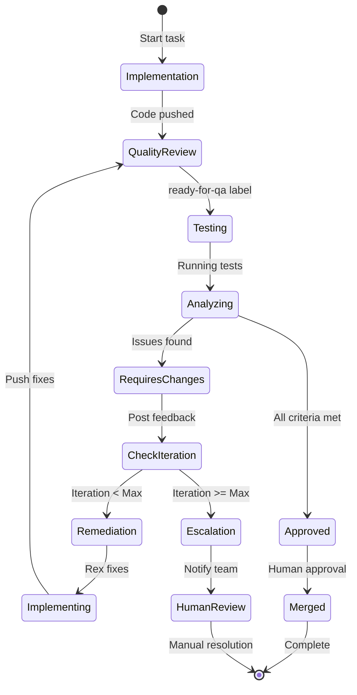

# Agent Remediation Loop Architecture

## Overview

This architecture enables automated feedback loops where QA findings trigger implementation fixes without human intervention, creating a self-healing development pipeline.

## Architecture Principles

1. **Event-Driven Coordination**: GitHub events drive all state transitions
2. **Stateless Restarts**: Each remediation cycle starts fresh with accumulated context
3. **Fail-Safe Design**: Multiple termination conditions prevent infinite loops
4. **Observable State**: All state visible through PR labels and logs
5. **Human Override**: Manual intervention possible at any point

## System Architecture

### High-Level Design

```mermaid
sequenceDiagram
    participant PR as Pull Request
    participant Rex as Rex (Implementation)
    participant Cleo as Cleo (Quality)
    participant Tess as Tess (QA)
    participant WH as Webhook/Sensor
    participant CM as State Manager

    Rex->>PR: Push implementation
    PR->>WH: PR updated event
    WH->>Cleo: Start quality review
    Cleo->>PR: Push fixes (silent)
    Cleo->>PR: Add ready-for-qa label
    PR->>WH: Label added event
    WH->>Tess: Start QA testing

    alt Issues Found
        Tess->>PR: Post "🔴 Required Changes" comment
        PR->>WH: Comment created event
        WH->>CM: Check iteration limit
        CM-->>WH: Iteration 3/10
        WH->>Rex: Start remediation
        Note over Rex: Read comment, implement fixes
        Rex->>PR: Push fixes
        WH->>Cleo: Cancel current work
        WH->>Tess: Cancel current work
        Note over Cleo,Tess: Cycle repeats
    else All Criteria Met
        Tess->>PR: Post approval
        Tess->>PR: Add approved label
        Note over PR: Ready for human review
    end
```



## Component Design

### 1. Feedback Detection System

The core component that monitors PR comments and triggers remediation.

```yaml
apiVersion: argoproj.io/v1alpha1
kind: EventSource
metadata:
  name: github-pr-feedback
  namespace: argo
spec:
  github:
    org:
      owner: "5dlabs"
      repositories:
        - names: ["*"]
      webhook:
        endpoint: /github
        port: "12000"
        method: POST
      events:
        - issue_comment
        - pull_request_review_comment
        - pull_request_review
      apiToken:
        name: github-token
        key: token
```

```yaml
apiVersion: argoproj.io/v1alpha1
kind: Sensor
metadata:
  name: pr-comment-remediation
spec:
  template:
    serviceAccountName: argo-events
  dependencies:
    - name: feedback-comment
      eventSourceName: github-pr-feedback
      eventName: org
      filters:
        data:
          - path: body.action
            type: string
            value: ["created"]
          - path: body.comment.body
            type: string
            comparator: "~"
            value: ".*🔴 Required Changes.*"
            
  triggers:
    - template:
        name: trigger-remediation
        k8s:
          operation: create
          source:
            resource: |
              apiVersion: platform.5dlabs.com/v1
              kind: CodeRun
              metadata:
                generateName: rex-remediation-
                namespace: agent-platform
                labels:
                  task-id: "{{.TaskId}}"
                  iteration: "{{.Iteration}}"
                  trigger-type: "comment-feedback"
              spec:
                service: "task{{.TaskId}}"
                github_app: "5DLabs-Rex"
                pr_number: {{.PRNumber}}
                pr_comment_id: "{{.CommentId}}"
                continue_session: true
                env:
                  REMEDIATION_MODE: "true"
                  FEEDBACK_COMMENT_ID: "{{.CommentId}}"
                  ITERATION_COUNT: "{{.Iteration}}"
```

### 2. Comment Parser

Extracts structured feedback from PR comments.

```rust
// controller/src/remediation/parser.rs
use regex::Regex;
use serde::{Deserialize, Serialize};

#[derive(Debug, Serialize, Deserialize)]
pub struct StructuredFeedback {
    pub issue_type: IssueType,
    pub severity: Severity,
    pub description: String,
    pub criteria_not_met: Vec<String>,
    pub reproduction_steps: Option<Vec<String>>,
    pub expected_behavior: Option<String>,
    pub actual_behavior: Option<String>,
}

#[derive(Debug, Serialize, Deserialize)]
pub enum IssueType {
    Bug,
    MissingFeature,
    Regression,
    Performance,
}

#[derive(Debug, Serialize, Deserialize)]
pub enum Severity {
    Critical,
    High,
    Medium,
    Low,
}

pub struct FeedbackParser {
    issue_type_pattern: Regex,
    severity_pattern: Regex,
    criteria_pattern: Regex,
}

impl FeedbackParser {
    pub fn parse_comment(&self, comment_body: &str) -> Result<StructuredFeedback> {
        // Check if this is actionable feedback
        if !comment_body.contains("🔴 Required Changes") {
            return Err(anyhow!("Not actionable feedback"));
        }
        
        // Extract issue type
        let issue_type = self.extract_issue_type(comment_body)?;
        
        // Extract severity
        let severity = self.extract_severity(comment_body)?;
        
        // Extract description
        let description = self.extract_section(comment_body, "Description")?;
        
        // Extract unmet criteria
        let criteria = self.extract_criteria(comment_body)?;
        
        // Extract optional sections
        let reproduction = self.extract_section_lines(comment_body, "Steps to Reproduce").ok();
        let expected = self.extract_section(comment_body, "Expected").ok();
        let actual = self.extract_section(comment_body, "Actual").ok();
        
        Ok(StructuredFeedback {
            issue_type,
            severity,
            description,
            criteria_not_met: criteria,
            reproduction_steps: reproduction,
            expected_behavior: expected,
            actual_behavior: actual,
        })
    }
    
    fn extract_issue_type(&self, body: &str) -> Result<IssueType> {
        if let Some(captures) = self.issue_type_pattern.captures(body) {
            match captures.get(1).map(|m| m.as_str()) {
                Some("Bug") => Ok(IssueType::Bug),
                Some("Missing Feature") => Ok(IssueType::MissingFeature),
                Some("Regression") => Ok(IssueType::Regression),
                Some("Performance") => Ok(IssueType::Performance),
                _ => Err(anyhow!("Unknown issue type"))
            }
        } else {
            Err(anyhow!("Issue type not found"))
        }
    }
}
```

### 3. State Management

Tracks remediation cycles and prevents infinite loops.

```rust
// controller/src/remediation/state.rs
use k8s_openapi::api::core::v1::ConfigMap;
use kube::{Api, Client};

pub struct RemediationStateManager {
    client: Client,
    namespace: String,
}

#[derive(Debug, Serialize, Deserialize)]
pub struct RemediationState {
    pub task_id: String,
    pub pr_number: u32,
    pub iteration: u8,
    pub max_iterations: u8,
    pub start_time: DateTime<Utc>,
    pub feedback_history: Vec<FeedbackRecord>,
    pub current_status: RemediationStatus,
}

#[derive(Debug, Serialize, Deserialize)]
pub struct FeedbackRecord {
    pub iteration: u8,
    pub timestamp: DateTime<Utc>,
    pub author: String,
    pub issue_type: IssueType,
    pub severity: Severity,
    pub resolved: bool,
}

#[derive(Debug, Serialize, Deserialize)]
pub enum RemediationStatus {
    InProgress,
    WaitingForQA,
    RequiresChanges,
    Approved,
    MaxIterationsReached,
    HumanInterventionRequired,
}

impl RemediationStateManager {
    pub async fn get_or_create_state(&self, task_id: &str, pr_number: u32) -> Result<RemediationState> {
        let cm_api: Api<ConfigMap> = Api::namespaced(self.client.clone(), &self.namespace);
        let cm_name = format!("task-{}-remediation-state", task_id);
        
        match cm_api.get(&cm_name).await {
            Ok(cm) => {
                let data = cm.data.unwrap_or_default();
                let state_json = data.get("state")
                    .ok_or_else(|| anyhow!("State data not found"))?;
                Ok(serde_json::from_str(state_json)?)
            }
            Err(_) => {
                // Create new state
                let state = RemediationState {
                    task_id: task_id.to_string(),
                    pr_number,
                    iteration: 1,
                    max_iterations: 10,
                    start_time: Utc::now(),
                    feedback_history: Vec::new(),
                    current_status: RemediationStatus::InProgress,
                };
                
                self.save_state(&state).await?;
                Ok(state)
            }
        }
    }
    
    pub async fn increment_iteration(&self, task_id: &str) -> Result<u8> {
        let mut state = self.get_or_create_state(task_id, 0).await?;
        
        state.iteration += 1;
        
        if state.iteration >= state.max_iterations {
            state.current_status = RemediationStatus::MaxIterationsReached;
            self.trigger_escalation(task_id).await?;
        }
        
        self.save_state(&state).await?;
        Ok(state.iteration)
    }
    
    async fn trigger_escalation(&self, task_id: &str) -> Result<()> {
        // Post comment to PR
        // Send notification
        // Create alert
        todo!("Implement escalation logic")
    }
}
```

### 4. Agent Cancellation System

Ensures clean state when remediation begins.

```rust
// controller/src/remediation/cancellation.rs
use kube::api::{DeleteParams, ListParams};

pub struct AgentCancellationManager {
    client: Client,
    namespace: String,
}

impl AgentCancellationManager {
    pub async fn cancel_quality_agents(&self, task_id: &str) -> Result<()> {
        let coderun_api: Api<CodeRun> = Api::namespaced(self.client.clone(), &self.namespace);
        
        // List all CodeRuns for this task
        let lp = ListParams::default()
            .labels(&format!("task-id={}", task_id));
        
        let coderuns = coderun_api.list(&lp).await?;
        
        for coderun in coderuns {
            let agent_type = coderun.metadata.labels
                .as_ref()
                .and_then(|l| l.get("agent-type"))
                .map(|s| s.as_str());
            
            match agent_type {
                Some("cleo") | Some("tess") => {
                    info!("Cancelling {} for task {}", agent_type.unwrap(), task_id);
                    
                    // Delete the CodeRun
                    coderun_api.delete(
                        &coderun.metadata.name.unwrap_or_default(),
                        &DeleteParams::default()
                    ).await?;
                }
                _ => {}
            }
        }
        
        Ok(())
    }
    
    pub async fn reset_pr_labels(&self, pr_number: u32) -> Result<()> {
        // Remove ready-for-qa label
        self.remove_label(pr_number, "ready-for-qa").await?;
        
        // Add remediation-in-progress label
        self.add_label(pr_number, "remediation-in-progress").await?;
        
        Ok(())
    }
}
```

## Container Integration

### Rex Remediation Mode

Enhanced container script for handling feedback:

```bash
#!/bin/bash
# container-rex-remediation.sh

# Check if we're in remediation mode
if [ "$REMEDIATION_MODE" = "true" ]; then
    echo "════════════════════════════════════════════════════════════════"
    echo "🔧 REMEDIATION MODE - Iteration $ITERATION_COUNT"
    echo "════════════════════════════════════════════════════════════════"
    
    # Fetch feedback comment
    COMMENT_JSON=$(gh api /repos/$GITHUB_ORG/$GITHUB_REPO/issues/comments/$FEEDBACK_COMMENT_ID)
    COMMENT_BODY=$(echo "$COMMENT_JSON" | jq -r '.body')
    COMMENT_AUTHOR=$(echo "$COMMENT_JSON" | jq -r '.user.login')
    
    echo "Feedback from: $COMMENT_AUTHOR"
    
    # Save feedback for Claude
    cat > /workspace/current-feedback.md << EOF
# QA Feedback - Iteration $ITERATION_COUNT

## Author: $COMMENT_AUTHOR
## Timestamp: $(date -Iseconds)

$COMMENT_BODY
EOF
    
    # Check iteration limit
    if [ "$ITERATION_COUNT" -ge "10" ]; then
        echo "⚠️ MAXIMUM ITERATIONS REACHED"
        
        # Post escalation comment
        gh pr comment $PR_NUMBER --body "## 🚨 Automated Remediation Limit Reached

After $ITERATION_COUNT attempts, the automated remediation process has reached its limit.
        
**Human intervention required** to resolve the remaining issues.

Please review the feedback history and implement the necessary changes manually."
        
        exit 1
    fi
    
    # Load original task context
    if [ -f "/workspace/CLAUDE.md" ]; then
        cp /workspace/CLAUDE.md /workspace/CLAUDE.original.md
    fi
    
    # Prepare remediation context
    cat > /workspace/remediation-instructions.md << 'EOF'
# Remediation Instructions

You are addressing QA feedback in iteration $ITERATION_COUNT of the remediation process.

## Your Task:
1. Read the feedback in `/workspace/current-feedback.md`
2. Review your previous implementation
3. Implement fixes for ALL issues mentioned
4. Ensure acceptance criteria are met
5. Commit and push your changes

## Important:
- This is iteration $ITERATION_COUNT out of a maximum of 10
- Focus on addressing the specific issues raised
- Maintain compatibility with existing functionality
- Add tests if applicable to prevent regression

## Feedback Summary:
The QA team has identified issues that must be resolved before approval.
Please implement comprehensive fixes.
EOF
    
    # Update CLAUDE.md with remediation context
    cat > /workspace/CLAUDE.md << EOF
$(cat /workspace/CLAUDE.original.md)

---

# CURRENT REMEDIATION TASK

$(cat /workspace/remediation-instructions.md)

## Feedback to Address:
$(cat /workspace/current-feedback.md)
EOF
fi

# Continue with normal Claude execution
exec /usr/local/bin/claude-runner
```

## State Transitions

### Remediation State Machine



## Label Management

### PR Label Lifecycle

```yaml
Label Transitions:
  task-{id}:
    - Added: When PR created
    - Persistent: Throughout lifecycle
    
  iteration-{n}:
    - Added: On first remediation
    - Updated: Each remediation cycle
    - Format: iteration-1, iteration-2, etc.
    
  needs-remediation:
    - Added: When Tess posts required changes
    - Removed: When Rex starts fixing
    
  remediation-in-progress:
    - Added: When Rex starts remediation
    - Removed: When Rex pushes fixes
    
  ready-for-qa:
    - Added: When Cleo completes
    - Removed: When Rex starts remediation
    
  approved:
    - Added: When Tess approves
    - Persistent: Until merge
    
  skip-automation:
    - Added: Manual override by human
    - Stops: All automation
```

## Performance Optimizations

### Resource Management
```yaml
# Resource limits for remediation cycles
apiVersion: v1
kind: ResourceQuota
metadata:
  name: remediation-quota
  namespace: agent-platform
spec:
  hard:
    requests.cpu: "20"
    requests.memory: "40Gi"
    persistentvolumeclaims: "10"
  scopeSelector:
    matchExpressions:
    - operator: In
      scopeName: "remediation"
      values: ["true"]
```

### Cleanup Policy
```yaml
# TTL for completed remediation resources
apiVersion: batch/v1
kind: CronJob
metadata:
  name: remediation-cleanup
spec:
  schedule: "0 */6 * * *"  # Every 6 hours
  jobTemplate:
    spec:
      template:
        spec:
          containers:
          - name: cleanup
            image: bitnami/kubectl
            command:
            - kubectl
            - delete
            - coderun
            - -l
            - "trigger-type=comment-feedback,age>24h"
```

## Monitoring and Observability

### Metrics
```prometheus
# Remediation cycle metrics
remediation_cycles_total{task_id, outcome}
remediation_iteration_count{task_id}
remediation_duration_seconds{task_id, iteration}
remediation_escalations_total{reason}

# Agent cancellation metrics
agent_cancellations_total{agent_type, trigger}
agent_restart_duration_seconds{agent_type}
```

### Logging
```json
{
  "timestamp": "2024-01-15T10:30:00Z",
  "level": "INFO",
  "component": "remediation-manager",
  "task_id": "42",
  "pr_number": 123,
  "iteration": 3,
  "event": "feedback_received",
  "author": "5DLabs-Tess",
  "severity": "high",
  "issue_type": "bug"
}
```

### Alerting Rules
```yaml
groups:
  - name: remediation
    rules:
    - alert: ExcessiveRemediationCycles
      expr: remediation_iteration_count > 7
      annotations:
        summary: "Task {{ $labels.task_id }} has {{ $value }} remediation cycles"
        
    - alert: RemediationStuck
      expr: rate(remediation_cycles_total[1h]) == 0
      for: 2h
      annotations:
        summary: "No remediation progress in 2 hours"
```

## Security Considerations

### GitHub Token Scoping
```yaml
# Minimal permissions for remediation
github_token_scopes:
  - repo:status
  - public_repo
  - write:discussion
  - read:discussion
```

### Validation Rules
```rust
impl RemediationValidator {
    fn validate_feedback(&self, feedback: &StructuredFeedback) -> Result<()> {
        // Verify author is authorized
        if !self.is_authorized_reviewer(&feedback.author) {
            return Err(anyhow!("Unauthorized feedback source"));
        }
        
        // Validate iteration limits
        if feedback.iteration >= MAX_ITERATIONS {
            return Err(anyhow!("Maximum iterations exceeded"));
        }
        
        // Check for malicious patterns
        if self.contains_malicious_content(&feedback.description) {
            return Err(anyhow!("Potentially malicious content detected"));
        }
        
        Ok(())
    }
}
```

This architecture provides a robust, event-driven system for automated remediation with proper safeguards against infinite loops and resource exhaustion.
