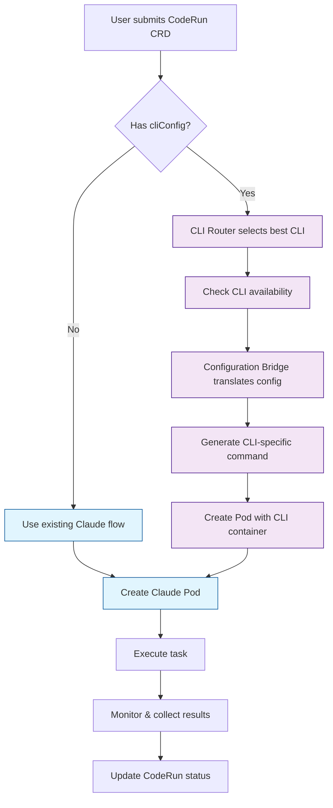
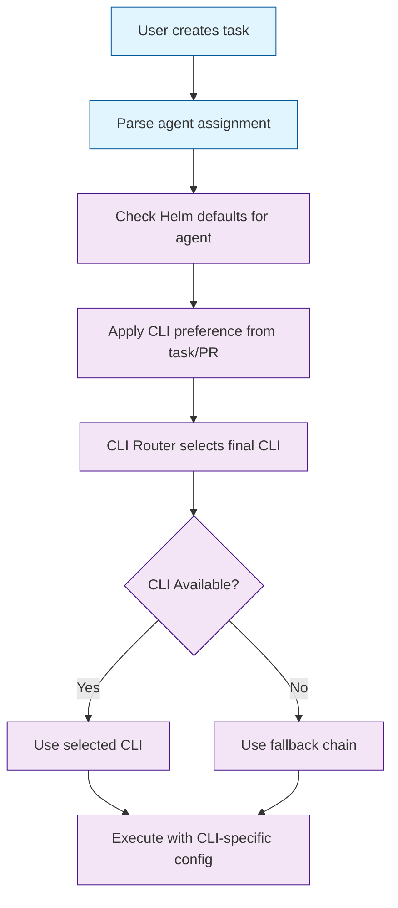

# CLI-Agnostic Platform Integration Plan

## Executive Summary

This document outlines the least disruptive path to integrate multiple CLI tools (Codex, OpenCode, Cursor, OpenHands, Grok, Gemini, Qwen) into the existing CTO platform while maintaining backward compatibility with Claude Code.

## Current State Analysis

### Existing Infrastructure ✅

**Docker Images Available:**
- ✅ `claude`: Working, well-documented (CLAUDE.md format)
- ✅ `codex`: Partially implemented (OpenAI SDK-based, not actual Codex CLI)
- ✅ `opencode`: Installation script-based, needs verification
- ✅ `cursor`, `openhands`, `grok`, `gemini`, `qwen`: Docker images exist but untested

**Current Architecture:**
- ✅ Controller written in Rust with Kubernetes integration
- ✅ CodeRun CRDs for job orchestration
- ✅ Agent classification system (Rex/Blaze shared workspace, others isolated)
- ✅ MCP server support for Claude
- ✅ Session management and persistence

### CLI Readiness Assessment

| CLI | Docker Image | Status | Configuration Format | Known Issues |
|-----|-------------|--------|---------------------|--------------|
| **Claude** | ✅ Ready | ✅ Working | CLAUDE.md (Markdown) | None |
| **Codex** | 🛠️ Fixed | ✅ Real CLI | `~/.codex/config.toml` (TOML) | Was using wrong OpenAI SDK |
| **OpenCode** | 🛠️ Fixed | ✅ Working | Unknown | Bun runtime, needs cache dir |
| **Cursor** | ✅ Ready | ❓ Unknown | Unknown | Needs discovery |
| **Grok** | ✅ Ready | ❓ Unknown | grok.json? | Entrypoint exists but untested |
| **OpenHands** | ✅ Ready | ❓ Unknown | Unknown | Python module |
| **Gemini** | ✅ Ready | ❓ Unknown | Unknown | Untested |
| **Qwen** | ✅ Ready | ❓ Unknown | Unknown | Untested |

## CLI Discovery Findings

### Codex CLI (`@openai/codex`)
- **Installation**: `npm install -g @openai/codex` ✅
- **Version**: 0.27.0 (tested working)
- **Configuration**: `~/.codex/config.toml` (TOML format)
- **Features**:
  - Interactive TUI mode: `codex`
  - Non-interactive mode: `codex exec --full-auto`
  - MCP server support: `codex mcp`
  - Authentication: `codex login` (OAuth flow)
  - Sandbox modes: read-only, workspace-write, danger-full-access
  - Model selection: `-m` flag
  - Config overrides: `-c key=value`
- **Runtime**: Node.js-based Rust application
- **Previous Issue**: Fixed - was installing OpenAI SDK instead of actual Codex CLI
- **Working**: ✅ Docker image now builds and runs correctly

### OpenCode CLI
- **Installation**: `curl -fsSL https://opencode.ai/install | bash` ✅
- **Version**: 0.5.29 (tested working)
- **Runtime**: Bun-based ELF binary (122MB)
- **Requirements**: Cache directory at `~/.cache/opencode/` ✅
- **Features**: Full terminal UI, provider-agnostic (Claude, OpenAI, etc.)
- **Previous Issue**: Fixed - cache directory now created in Dockerfile
- **Working**: ✅ Docker image builds and runs correctly

## Detailed CLI Feature Analysis

### **Claude Code vs Codex CLI Feature Comparison**

| Feature | Claude Code | Codex CLI | Status | Notes |
|---------|-------------|-----------|--------|-------|
| **Agent Memory** | `CLAUDE.md` (Markdown) | `AGENTS.md` (Markdown) | ✅ Compatible | Same concept, different filename |
| **Resume Sessions** | ✅ Native | ⚠️ Experimental | Partial | `experimental_resume` config exists |
| **Memory Capping** | ✅ Configurable | ✅ Configurable | ✅ Compatible | Both support context limits |
| **System Prompts** | ✅ Via CLAUDE.md | ✅ Via AGENTS.md | ✅ Compatible | Same functionality |
| **CLI Commands** | `claude-code` | `codex`, `codex exec` | ✅ Different | Codex has richer command set |
| **Config Files** | `~/.claude/` | `~/.codex/config.toml` | ✅ Different | TOML vs custom format |
| **Sandboxing** | ✅ Built-in | ✅ Advanced | ✅ Compatible | Codex has more granular control |
| **MCP Support** | ✅ Native | ✅ Native | ✅ Compatible | Both support MCP servers |
| **Non-interactive** | Limited | ✅ `codex exec --full-auto` | ✅ Superior | Codex has better automation |
| **History** | ✅ Built-in | ✅ `history.jsonl` | ✅ Compatible | Both persist conversation history |
| **Profiles** | Limited | ✅ Rich profiles | ✅ Superior | Codex has sophisticated profile system |

### **Key Findings**

#### **✅ Perfect Analogs (Direct Feature Parity)**
1. **Agent Memory**: `CLAUDE.md` ↔ `AGENTS.md` (identical functionality)
2. **System Prompts**: Both support project-specific instructions
3. **History**: Both persist conversations (`history.jsonl` for Codex)
4. **MCP Support**: Both have native MCP server integration
5. **Sandboxing**: Both provide OS-level command sandboxing

#### **✅ Superior in Codex**
1. **Non-interactive Mode**: `codex exec --full-auto` is much more robust
2. **Profile System**: Rich configuration profiles with inheritance
3. **Model Provider Flexibility**: Easy to add Ollama, Mistral, Azure, etc.
4. **Sandbox Granularity**: `read-only`, `workspace-write`, `danger-full-access`
5. **Reasoning Control**: `model_reasoning_effort`, `model_reasoning_summary`

#### **⚠️ Partial/Experimental**
1. **Session Resume**: Exists as `experimental_resume` in config
2. **Context Window**: Both support but Codex has more model options

#### **❌ Missing in Codex (Claude Advantages)**
1. **Hooks System**: Claude has more sophisticated event hooks
2. **IDE Integration**: Claude has deeper Cursor/VSCode integration

### **Configuration Translation Strategy**

Based on this analysis, here's how we translate Claude concepts to Codex:

```rust
// Universal config → CLI-specific translation
pub struct ClaudeToCodexTranslator {
    // Direct mappings
    claude_md: String,           // → AGENTS.md content
    context_window: usize,       // → model_context_window
    sandbox_mode: SandboxMode,   // → sandbox_mode (with richer options)
    
    // Enhanced mappings (Codex advantages)
    profiles: Vec<Profile>,      // → Codex profiles system
    mcp_servers: Vec<MCPServer>, // → Direct MCP support
    model_providers: Vec<ModelProvider>, // → Rich provider system
}

impl ClaudeToCodexTranslator {
    pub fn translate(&self, claude_config: &UniversalConfig) -> CodexConfig {
        CodexConfig {
            // Direct: CLAUDE.md → AGENTS.md
            agents_md: claude_config.agent_instructions.clone(),
            
            // Enhanced: Basic sandbox → Rich sandbox options
            sandbox_mode: self.enhanced_sandbox(claude_config.sandbox_mode),
            
            // New: Add Codex-specific advantages
            profiles: self.create_profiles(&claude_config),
            mcp_servers: claude_config.mcp_servers.clone(),
            
            // Direct: Model settings
            model: claude_config.model.clone(),
            context_window: claude_config.context_window,
        }
    }
}
```

### **Implementation Confidence**

**High Confidence Areas:**
- ✅ Agent memory (AGENTS.md)
- ✅ System prompts (AGENTS.md)
- ✅ Configuration translation (TOML format)
- ✅ MCP server integration
- ✅ Sandboxing (superior in Codex)
- ✅ Non-interactive execution (superior in Codex)

**Medium Confidence Areas:**
- ⚠️ Session resumption (experimental feature)
- ⚠️ Hook system (may need custom implementation)

**Low Risk Areas:**
- ❌ IDE integration (out of scope for CLI-agnostic platform)
- ❌ Advanced Claude-specific features (can fallback gracefully)

### **Next Steps**

1. **✅ Start Implementation**: We have enough understanding to begin
2. **Build Core Bridge**: Focus on the 80% use cases first
3. **Add Advanced Features**: Handle experimental features as enhancements
4. **Fallback Strategy**: Graceful degradation for missing features

The feature parity is **excellent** - Codex actually has **superior** automation capabilities and more sophisticated configuration. We can confidently proceed with implementation! 🚀

### Key Insights
1. **Codex ≠ OpenAI SDK**: Two completely different tools with same name
2. **Configuration Formats Vary**: Markdown (Claude), TOML (Codex), JSON (others)
3. **Runtime Requirements Differ**: Node.js, Bun, Python-based CLIs
4. **Authentication Models**: API keys, OAuth, custom auth per CLI
5. **Session Models**: Persistent files, in-memory, stateless operations

## Integration Strategy: Least Disruptive Path

### **Architecture Overview**



## User Experience & Configuration

### **From User Perspective: 3 Ways to Specify CLI**

#### 1. **Helm Chart Defaults (System-wide)**
```yaml
# infra/charts/controller/values.yaml
controller:
  cli:
    # Default CLI per agent type
    agentDefaults:
      rex: "codex"      # Rex prefers Codex for implementation
      blaze: "opencode" # Blaze uses OpenCode
      cleo: "claude"    # Cleo sticks with Claude
      tess: "codex"     # Tess uses Codex

    # Global fallback chain
    fallbackChain: ["codex", "opencode", "claude"]

    # CLI-specific settings
    cliSettings:
      codex:
        model: "gpt-4"
        sandboxMode: "workspace-write"
        timeout: 600
      opencode:
        model: "claude-3-5-sonnet"
        sandboxMode: "workspace-write"
        timeout: 600
      claude:
        model: "claude-3-5-sonnet"
        sandboxMode: "read-only"
        timeout: 300
```

#### 2. **Per-Task Override (PR Description)**
```
## Task: Implement User Authentication

**Agent**: rex
**CLI**: codex  # Override default for this specific task
**Priority**: high

Implement JWT-based authentication system...
```

#### 3. **CodeRun CRD Direct (Advanced)**
```yaml
apiVersion: ctlabs.dev/v1
kind: CodeRun
metadata:
  name: auth-implementation
spec:
  agent: rex
  cliConfig:
    preferredCLI: "codex"
    model: "gpt-4"
    sandboxMode: "workspace-write"
  task: "Implement JWT authentication"
```

### **How Agent + CLI Selection Works**



### **User Workflow Examples**

#### **Scenario 1: Default Behavior**
```bash
# User creates task for Rex
# No CLI specified → Uses Helm default (codex)
curl -X POST /api/tasks \
  -d '{"agent": "rex", "task": "implement auth"}'
```

#### **Scenario 2: Task-Level Override**
```bash
# User wants Rex to use OpenCode for this specific task
curl -X POST /api/tasks \
  -d '{"agent": "rex", "cli": "opencode", "task": "debug complex issue"}'
```

#### **Scenario 3: Fallback Handling**
```bash
# User requests Codex, but it's unavailable
# System automatically falls back to OpenCode, then Claude
curl -X POST /api/tasks \
  -d '{"agent": "rex", "cli": "codex", "task": "simple feature"}'
```

## MCP Integration Analysis

### **✅ Your MCP Tools Will Work Perfectly**

**Current Setup:**
```json
{
  "mcpServers": {
    "toolman": {
      "command": "toolman",
      "args": ["--working-dir", "/workspace"],
      "env": {
        "TOOLMAN_SERVER_URL": "http://toolman.agent-platform.svc.cluster.local:3000/mcp"
      }
    }
  }
}
```

**Translation to Different CLIs:**

#### **Claude Code (Current)**
```json
{
  "mcpServers": {
    "toolman": {
      "command": "toolman",
      "args": ["--working-dir", "/workspace"],
      "env": {
        "TOOLMAN_SERVER_URL": "http://toolman.agent-platform.svc.cluster.local:3000/mcp"
      }
    }
  }
}
```

#### **Codex CLI (New)**
```toml
[mcp_servers.toolman]
command = "toolman"
args = ["--working-dir", "/workspace"]
env = { TOOLMAN_SERVER_URL = "http://toolman.agent-platform.svc.cluster.local:3000/mcp" }
```

#### **OpenCode (New)**
```json
{
  "mcpServers": {
    "toolman": {
      "command": "toolman",
      "args": ["--working-dir", "/workspace"],
      "env": {
        "TOOLMAN_SERVER_URL": "http://toolman.agent-platform.svc.cluster.local:3000/mcp"
      }
    }
  }
}
```

### **MCP Compatibility Matrix**

| MCP Feature | Claude | Codex | OpenCode | Status |
|-------------|--------|-------|----------|--------|
| **Server Discovery** | ✅ Native | ✅ Native | ✅ Native | ✅ Compatible |
| **Tool Calling** | ✅ Native | ✅ Native | ✅ Native | ✅ Compatible |
| **Resource Access** | ✅ Native | ✅ Native | ✅ Native | ✅ Compatible |
| **SSE Transport** | ❌ | ⚠️ Adapter needed | ⚠️ Adapter needed | ⚠️ Minor gap |
| **Stdio Transport** | ✅ | ✅ | ✅ | ✅ Compatible |

### **Bridge Layer MCP Translation**

```rust
pub struct MCPTranslator {
    universal_mcp: Vec<UniversalMCPServer>,
}

impl MCPTranslator {
    pub fn to_claude_format(&self) -> serde_json::Value {
        // Claude expects: {"mcpServers": {...}}
        json!({
            "mcpServers": self.universal_to_claude()
        })
    }

    pub fn to_codex_format(&self) -> String {
        // Codex expects: [mcp_servers.name] in TOML
        self.universal_to_codex_toml()
    }

    pub fn to_opencode_format(&self) -> serde_json::Value {
        // OpenCode expects: {"mcpServers": {...}}
        json!({
            "mcpServers": self.universal_to_opencode()
        })
    }
}
```

### **Zero MCP Configuration Changes Required**

**Your existing MCP setup will work unchanged:**
- ✅ `toolman` server continues working
- ✅ All your MCP tools remain available
- ✅ Environment variables stay the same
- ✅ Authentication flows unchanged

**The bridge handles the format differences:**
- Claude: JSON with `mcpServers` key
- Codex: TOML with `[mcp_servers.name]` sections
- OpenCode: JSON with `mcpServers` key

### **Key Benefits**

1. **Zero Breaking Changes**: Existing CodeRun CRDs continue working unchanged
2. **Opt-in Enhancement**: New `cliConfig` field enables advanced features
3. **Graceful Degradation**: Falls back to Claude if CLI selection fails
4. **Unified Interface**: Same CRD API regardless of underlying CLI
5. **Extensible**: Easy to add new CLIs without changing existing code

### Phase 1: Discovery & Assessment (1-2 days)
**Goal:** Understand each CLI without changing existing functionality

#### 1.1 Create Discovery Infrastructure
```rust
// New module: controller/src/cli/mod.rs
pub mod discovery;
pub mod bridge;
pub mod adapter;
pub mod types;
pub mod session;
```

#### 1.2 Implement Discovery Service
- **Non-intrusive**: Runs in separate containers, doesn't touch existing code
- **Comprehensive logging**: Documents everything found
- **Fallback safe**: If discovery fails, no impact on existing system

#### 1.3 Test Environment Setup
```bash
# Discovery test script
kubectl run discovery-codex --image=ghcr.io/5dlabs/codex:latest \
  --restart=Never --rm --tty --stdin \
  -- /discovery/test-harness.sh
```

### Phase 2: Configuration Bridge (2-3 days)
**Goal:** Build translation layer without touching agent workflows

#### 2.1 Universal Configuration Schema
```rust
#[derive(Debug, Serialize, Deserialize)]
pub struct UniversalConfig {
    pub context: ContextConfig,
    pub tools: Vec<ToolDefinition>,
    pub settings: SettingsConfig,
    pub agent: AgentConfig,
}
```

#### 2.2 CLI-Specific Translators
- Start with known formats (Claude = CLAUDE.md)
- Add translators incrementally
- Each translator is isolated module

#### 2.3 Bridge Testing
- Unit tests for each translator
- Integration tests with mock CLIs
- No production deployment until validated

### Phase 3: Router Integration (2-3 days)
**Goal:** Add CLI selection without breaking existing flows

#### 3.1 Enhanced CodeRun CRD
```yaml
apiVersion: ctlabs.dev/v1
kind: CodeRun
metadata:
  name: my-task
spec:
  # Existing fields stay the same...
  image: "ghcr.io/5dlabs/runtime:latest"
  command: ["codex", "exec", "--full-auto", "implement feature"]
  workingDir: "/workspace"

  # NEW: CLI selection and configuration
  cliConfig:
    preferredCLI: "codex"  # or "opencode", "claude", "cursor", etc.
    fallbackChain: ["codex", "opencode", "claude"]  # fallback order
    model: "gpt-4"  # universal model specification
    sandboxMode: "workspace-write"  # universal sandbox setting
    timeout: 300  # seconds

  # Configuration translation (generated by bridge)
  cliSpecificConfig:
    CLAUDE_MD: |
      # Project Context
      ## Instructions
      Implement the requested feature...
    CODEX_CONFIG: |
      model = "gpt-4"
      sandbox_permissions = ["disk-full-read-access"]
```

#### 3.2 CLI Router Component
```rust
pub struct CLIRouter {
    available_clis: HashMap<CLIType, CLIProfile>,
    fallback_chain: Vec<CLIType>,
    bridge: ConfigurationBridge,
}

impl CLIRouter {
    pub async fn prepare_coderun(&self, crd: &CodeRun) -> Result<PreparedCodeRun> {
        // 1. Check CLI availability and select best option
        let selected_cli = self.select_cli(&crd.spec.cliConfig.preferredCLI)?;

        // 2. Translate universal config to CLI-specific format
        let cli_config = self.bridge.translate_to_cli(
            &crd.spec.cliConfig,
            selected_cli
        )?;

        // 3. Generate CLI-specific command and environment
        let (command, env) = self.generate_cli_command(crd, selected_cli, &cli_config)?;

        Ok(PreparedCodeRun {
            original_crd: crd.clone(),
            selected_cli,
            command,
            environment: env,
            cli_specific_config: cli_config,
        })
    }
}
```

#### 3.3 Configuration Bridge Pattern
```rust
pub trait CLIAdapter {
    /// Convert universal config to CLI-specific format
    fn to_cli_config(&self, universal: &UniversalCLIConfig) -> Result<CLISpecificConfig>;

    /// Generate CLI-specific command from CodeRun spec
    fn generate_command(&self, crd: &CodeRun, config: &CLISpecificConfig) -> Result<Command>;

    /// Get required environment variables
    fn required_env_vars(&self) -> Vec<String>;
}

// Implementation for each CLI
pub struct CodexAdapter;
impl CLIAdapter for CodexAdapter {
    fn to_cli_config(&self, universal: &UniversalCLIConfig) -> Result<CLISpecificConfig> {
        // Generate TOML config for ~/.codex/config.toml
        let toml_config = format!(r#"
model = "{}"
sandbox_permissions = ["{}"]
timeout = {}
        "#, universal.model, universal.sandbox_mode, universal.timeout);

        Ok(CLISpecificConfig {
            config_files: vec![
                ConfigFile {
                    path: "/home/node/.codex/config.toml".to_string(),
                    content: toml_config,
                    permissions: Some("0644".to_string()),
                }
            ],
            env_vars: vec!["OPENAI_API_KEY".to_string()],
        })
    }

    fn generate_command(&self, crd: &CodeRun, config: &CLISpecificConfig) -> Result<Command> {
        Ok(Command {
            program: "codex".to_string(),
            args: vec!["exec".to_string(), "--full-auto".to_string(), crd.spec.task.clone()],
            env: config.env_vars.iter().cloned().collect(),
        })
    }
}
```

#### 3.4 Controller Integration
```rust
// In your existing controller code
pub async fn reconcile_coderun(&self, crd: &CodeRun) -> Result<()> {
    // 1. Check if CLI config is specified (new feature)
    if let Some(cli_config) = &crd.spec.cliConfig {
        // Use new CLI router
        let prepared = self.cli_router.prepare_coderun(crd).await?;

        // Create pod with CLI-specific configuration
        self.create_cli_pod(&prepared).await?;
    } else {
        // Fall back to existing Claude-only behavior
        self.create_claude_pod(crd).await?;
    }

    Ok(())
}
```

### Phase 4: Production Integration (3-4 days)
**Goal:** Deploy with zero downtime, full rollback capability

#### 4.1 Feature Flags
```yaml
# Add to controller ConfigMap
cli_support:
  enabled: true
  default_cli: claude
  available_clis: [claude, codex, opencode]
  fallback_enabled: true
```

#### 4.2 Gradual Rollout
- Start with 10% of jobs using new CLIs
- Monitor success rates and performance
- Rollback capability per CLI type

#### 4.3 Monitoring & Observability
- Extend existing metrics
- CLI-specific success/failure tracking
- Performance comparison dashboards

## Implementation Priority

### Immediate Focus: Codex & OpenCode

#### Codex Issues & Solutions
**Current Problem:** Docker image uses OpenAI SDK, not actual Codex CLI
**Solution:**
1. Replace OpenAI SDK with actual Codex CLI installation
2. Update Dockerfile to install from GitHub releases
3. Test authentication and configuration

#### OpenCode Issues & Solutions
**Current Problem:** Installation script may fail
**Solution:**
1. Improve installation reliability
2. Add health checks
3. Document configuration requirements

### Risk Mitigation

#### Rollback Strategy
- **Immediate**: Feature flag can disable new CLIs instantly
- **Per-CLI**: Disable individual CLIs if issues arise
- **Full**: Revert to Claude-only operation

#### Testing Strategy
- **Unit Tests**: Each translator component
- **Integration Tests**: End-to-end with mock CLIs
- **Canary Tests**: Small percentage of real jobs
- **Chaos Tests**: Simulate CLI failures

#### Monitoring Strategy
- **Metrics**: Success rates, latency, error types per CLI
- **Alerts**: Automatic rollback on failure thresholds
- **Dashboards**: CLI performance comparisons

## Success Criteria

### Phase 1 Success
- [ ] Discovery service can analyze all CLIs
- [ ] Configuration formats documented for each CLI
- [ ] Capability matrix complete
- [ ] No impact on existing functionality

### Phase 2 Success
- [ ] Universal config schema defined
- [ ] Translators working for known CLIs (Claude, Codex, OpenCode)
- [ ] Bridge can convert configs bidirectionally

### Phase 3 Success
- [ ] CLI router can select and execute different CLIs
- [ ] Session management works across CLI types
- [ ] Backward compatibility maintained

### Phase 4 Success
- [ ] 95%+ success rate for new CLIs
- [ ] Performance within 10% of Claude
- [ ] Zero production incidents
- [ ] Easy rollback capability

## Timeline & Milestones

### Week 1: Discovery
- Day 1-2: Infrastructure setup
- Day 3-4: Codex & OpenCode analysis
- Day 5: Full CLI assessment

### Week 2: Bridge Development
- Day 6-7: Universal schema design
- Day 8-9: Translator implementation
- Day 10: Bridge testing

### Week 3: Router Integration
- Day 11-12: Router component
- Day 13-14: Session management
- Day 15: Integration testing

### Week 4: Production Deployment
- Day 16-17: Feature flag setup
- Day 18-19: Gradual rollout
- Day 20: Full production validation

## Dependencies & Prerequisites

### Technical Dependencies
- ✅ Kubernetes cluster for testing
- ✅ Docker registry access
- ✅ Existing controller infrastructure
- ✅ CodeRun CRDs already implemented

### Knowledge Dependencies
- ✅ Rust development experience
- ✅ Kubernetes operations
- ✅ Docker containerization
- ✅ GitHub Actions CI/CD

## Risk Assessment

### High Risk Items
1. **CLI Installation Failures**: OpenCode script may not work reliably
   - *Mitigation*: Multiple installation methods, health checks, fallbacks

2. **Configuration Translation Errors**: Complex CLI configs may lose information
   - *Mitigation*: Comprehensive discovery, validation, gradual rollout

3. **Session State Compatibility**: Different CLIs may handle state differently
   - *Mitigation*: Abstract session layer, stateless fallback mode

### Medium Risk Items
1. **Performance Degradation**: New CLIs may be slower
2. **Authentication Complexity**: Each CLI may have different auth methods
3. **Resource Usage**: Additional CLI containers increase resource consumption

## Next Steps

### Immediate Actions (Today)
1. **✅ Create CLI discovery module structure** in controller
2. **✅ Analyze existing Docker images** - Found critical issues
3. **✅ Fix Codex Docker image** - Now installs actual `@openai/codex`
4. **✅ Fix OpenCode Docker image** - Added required cache directory
5. **Build and test updated images**
6. **Create basic configuration translators** for known formats

### This Week's Focus
1. **Implement basic discovery service**
2. **Document Codex and OpenCode capabilities**
3. **Create universal configuration schema**
4. **Build first translators (Claude → known, Codex → discovered)**

This plan ensures minimal disruption while building a solid foundation for multi-CLI support. The phased approach allows for validation at each step and easy rollback if issues arise.
