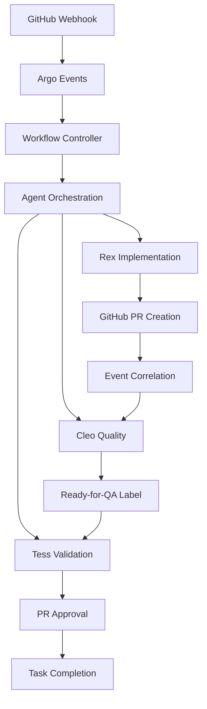

# Task 24: Create Operations Runbook

## Overview

This task creates comprehensive operational documentation for the multi-agent workflow orchestration system. The runbook provides detailed procedures for common operations, troubleshooting guides, maintenance tasks, and incident response protocols to ensure reliable system operation and rapid issue resolution.

## Technical Implementation

### 1. System Architecture Documentation

#### High-Level System Overview


#### Component Interaction Matrix
```yaml
# System component dependencies and interactions
component_interactions:
  github_webhooks:
    triggers: ["argo_events", "workflow_correlation"]
    dependencies: ["github_apps", "webhook_configuration"]
    
  argo_events:
    triggers: ["workflow_resume", "agent_cancellation"]
    dependencies: ["kubernetes_api", "webhook_payload_parsing"]
    
  workflow_controller:
    triggers: ["agent_pod_creation", "workflow_state_transitions"]
    dependencies: ["coderun_crd", "kubernetes_rbac"]
    
  agent_pods:
    triggers: ["github_operations", "workspace_persistence"]
    dependencies: ["pvc_storage", "github_app_secrets", "mcp_servers"]
    
  artifact_repository:
    triggers: ["workflow_archival", "artifact_storage"]
    dependencies: ["minio_storage", "retention_policies"]
```

### 2. Common Operational Procedures

#### Workflow Monitoring and Management
```bash
#!/bin/bash
# Workflow status checking and management procedures

# Check overall system health
check_system_health() {
    echo "=== Multi-Agent Workflow System Health Check ==="
    
    # 1. Check Argo Workflows controller
    kubectl get pods -n argo -l app=argo-workflows-server
    kubectl get deployment -n argo argo-workflows-server
    
    # 2. Check Argo Events components
    kubectl get pods -n argo-events -l app=argo-events
    kubectl get sensor -n argo-events github-webhook-sensor
    
    # 3. Check CodeRun controller
    kubectl get pods -n agent-platform -l app=coderun-controller
    
    # 4. Check active workflows
    echo -e "\n=== Active Workflows ==="
    kubectl get workflows -A --field-selector=status.phase=Running
    
    # 5. Check resource utilization
    echo -e "\n=== Resource Utilization ==="
    kubectl top nodes
    kubectl get resourcequota -n agent-platform
}

# Monitor specific workflow progression
monitor_workflow() {
    local task_id=$1
    local workflow_name=$2
    
    echo "Monitoring workflow for task ${task_id}..."
    
    # Watch workflow status
    kubectl get workflow ${workflow_name} -o jsonpath='{.status.phase}' -w &
    
    # Monitor agent pods
    kubectl get pods -l task-id=${task_id} -w &
    
    # Check event correlation
    kubectl get events --field-selector=involvedObject.kind=Workflow,involvedObject.name=${workflow_name}
}

# Emergency workflow cancellation
cancel_workflow() {
    local workflow_name=$1
    local reason=$2
    
    echo "Cancelling workflow ${workflow_name} - Reason: ${reason}"
    
    # Stop workflow execution
    argo stop ${workflow_name}
    
    # Cancel running agent pods
    kubectl delete pods -l workflow-name=${workflow_name}
    
    # Log cancellation
    kubectl annotate workflow ${workflow_name} cancellation.reason="${reason}" cancellation.timestamp=$(date -u +%Y-%m-%dT%H:%M:%SZ)
    
    echo "Workflow ${workflow_name} cancelled successfully"
}
```

#### Agent Pod Management
```bash
#!/bin/bash
# Agent pod operational procedures

# Check agent pod health and resource usage
check_agent_health() {
    local agent_type=$1  # rex, cleo, tess
    
    echo "=== ${agent_type} Agent Health Check ==="
    
    # List active agent pods
    kubectl get pods -l github-app=5DLabs-${agent_type} -o wide
    
    # Check resource utilization
    kubectl top pods -l github-app=5DLabs-${agent_type}
    
    # Check recent events
    kubectl get events --field-selector=involvedObject.kind=Pod | grep -i ${agent_type}
    
    # Check PVC usage
    kubectl get pvc -l agent=${agent_type}
}

# Restart stuck agent pod
restart_agent() {
    local pod_name=$1
    local reason=$2
    
    echo "Restarting agent pod ${pod_name} - Reason: ${reason}"
    
    # Get pod metadata for restoration
    kubectl get pod ${pod_name} -o yaml > /tmp/${pod_name}-backup.yaml
    
    # Delete the pod (will be recreated by controller)
    kubectl delete pod ${pod_name}
    
    # Wait for new pod to be ready
    kubectl wait --for=condition=Ready pod -l job-name=${pod_name%-*} --timeout=300s
    
    echo "Agent pod restarted successfully"
}

# Provide live input to struggling agent
provide_agent_input() {
    local pod_name=$1
    local input_message=$2
    
    echo "Providing live input to agent ${pod_name}: ${input_message}"
    
    # Use MCP input tool to send message to agent
    kubectl exec ${pod_name} -- curl -X POST http://localhost:8080/input \
        -H "Content-Type: application/json" \
        -d "{\"message\": \"${input_message}\", \"priority\": \"high\"}"
}
```

### 3. Troubleshooting Decision Trees

#### Workflow Stuck in Suspended State
```yaml
# Troubleshooting workflow suspension issues
troubleshooting_workflows:
  suspended_workflow:
    symptoms:
      - Workflow shows status "Running" but no active pods
      - Workflow stuck at suspend node for > expected time
      - No progress indicators in Argo UI
      
    diagnosis_steps:
      1. check_webhook_correlation:
         command: "kubectl get events --field-selector=involvedObject.kind=Workflow"
         look_for: "Missing webhook events or correlation failures"
         
      2. verify_github_webhook_delivery:
         command: "Check GitHub webhook delivery logs in repo settings"
         look_for: "Failed webhook deliveries or payload issues"
         
      3. check_event_sensor_status:
         command: "kubectl get sensor github-webhook-sensor -o yaml"
         look_for: "Sensor errors or configuration issues"
         
      4. verify_task_correlation:
         command: "Check PR labels match workflow task-id"
         look_for: "Mismatch between PR labels and workflow parameters"
         
    resolution_steps:
      - resend_webhook: "Manually trigger webhook event from GitHub"
      - restart_sensor: "kubectl rollout restart deployment/eventsource-controller"
      - manual_resume: "argo resume <workflow-name>"
      - cancel_restart: "argo stop <workflow-name> && resubmit with correct parameters"
```

#### Agent Pod Failure Scenarios
```yaml
agent_failures:
  oom_killed_agent:
    symptoms:
      - Pod status shows "OOMKilled"
      - Container restart count increasing
      - Agent execution incomplete
      
    immediate_actions:
      - check_memory_usage: "kubectl describe pod <pod-name>"
      - review_memory_limits: "kubectl get pod <pod-name> -o jsonpath='{.spec.containers[0].resources}'"
      - check_workspace_size: "kubectl exec <pod-name> -- df -h /workspace"
      
    resolution:
      - increase_memory_limits: "Update CodeRun resource specifications"
      - cleanup_workspace: "Remove unnecessary files from persistent workspace"
      - restart_with_clean_workspace: "Delete PVC and restart agent"
  
  agent_authentication_failure:
    symptoms:
      - GitHub API errors in agent logs
      - "Authentication failed" or "Bad credentials" messages
      - Agent unable to create or modify PRs
      
    diagnosis:
      - verify_github_app_config: "kubectl get secret github-app-5dlabs-<agent>"
      - check_token_expiration: "Check GitHub App installation token validity"
      - validate_permissions: "Verify GitHub App permissions in organization settings"
      
    resolution:
      - rotate_github_app_keys: "Update GitHub App private key in secret"
      - refresh_installation_token: "Regenerate GitHub App installation token"
      - update_app_permissions: "Grant required permissions in GitHub App settings"
```

### 4. Performance Tuning Guidelines

#### Resource Optimization Procedures
```yaml
# Performance tuning recommendations
performance_tuning:
  workflow_execution_optimization:
    areas:
      - agent_resource_allocation:
          current_limits: "CPU: 4000m, Memory: 16Gi"
          optimization_guidelines:
            - Monitor actual usage with "kubectl top pods"
            - Right-size based on 80% utilization target
            - Consider VPA for automatic adjustment
            
      - workspace_storage_optimization:
          current_size: "10Gi per agent"
          optimization_strategies:
            - Implement workspace cleanup scripts
            - Use emptyDir for temporary files
            - Monitor PVC usage patterns
            
      - workflow_parallelization:
          current_approach: "Sequential Rex → Cleo → Tess"
          potential_improvements:
            - Parallel Cleo analysis during Rex work
            - Concurrent test preparation during code review
            - Optimize suspension/resume overhead
            
  system_scaling_optimization:
    horizontal_scaling:
      controllers:
        - argo_workflows: "Scale to 3 replicas for high availability"
        - coderun_controller: "Use HPA based on workflow queue depth"
        - event_sensors: "Multiple replicas for webhook processing"
        
    vertical_scaling:
      resource_recommendations:
        - controller_pods: "CPU: 1000m, Memory: 2Gi"
        - agent_pods: "Dynamic based on model and task complexity"
        - storage_volumes: "SSD for workspace, Standard for archives"
```

#### Monitoring and Alerting Optimization
```yaml
monitoring_optimization:
  key_metrics:
    workflow_performance:
      - end_to_end_duration: "Target: < 4 hours for complex tasks"
      - stage_transition_time: "Target: < 60 seconds for webhook correlation"
      - agent_execution_time: "Track by agent type and task complexity"
      
    resource_utilization:
      - cpu_memory_efficiency: "Target: 60-80% utilization"
      - storage_growth_rate: "Monitor PVC usage trends"
      - network_bandwidth: "Track external API calls and data transfer"
      
    system_reliability:
      - workflow_success_rate: "Target: > 95% successful completion"
      - agent_failure_rate: "Target: < 5% pod failures"
      - webhook_correlation_accuracy: "Target: 100% correct correlation"
      
  alerting_thresholds:
    critical_alerts:
      - workflow_stuck: "> 6 hours without progress"
      - agent_oom_rate: "> 10% of agents in 1 hour"
      - storage_full: "> 90% PVC utilization"
      
    warning_alerts:
      - workflow_slow: "> 2x expected duration"
      - resource_pressure: "> 85% CPU/memory utilization"
      - webhook_delays: "> 5 minutes correlation time"
```

### 5. Incident Response Playbooks

#### Major System Outage Response
```markdown
# INCIDENT RESPONSE: Multi-Agent System Outage

## Severity: CRITICAL
## Expected Response Time: 15 minutes
## Escalation: On-call SRE → Platform Team Lead → CTO

### Immediate Response (0-15 minutes)
1. **Acknowledge Incident**
   - Update incident status in monitoring system
   - Notify stakeholders via incident communication channel
   - Begin incident log documentation

2. **Quick System Assessment**
   ```bash
   # Check overall cluster health
   kubectl get nodes
   kubectl get pods -A | grep -v Running
   
   # Check critical components
   kubectl get deployment -n argo
   kubectl get deployment -n agent-platform
   kubectl get deployment -n argo-events
   ```

3. **Identify Impact Scope**
   - Count affected workflows: `argo list --running`
   - Check user-facing services status
   - Assess data consistency and backup status

### Investigation Phase (15-45 minutes)
4. **Root Cause Analysis**
   - Check recent deployments and configuration changes
   - Review system logs for error patterns
   - Analyze resource utilization and capacity issues
   - Investigate external dependencies (GitHub API, storage)

5. **Containment Actions**
   - Implement temporary workarounds if available
   - Prevent further system degradation
   - Preserve diagnostic information

### Resolution Phase (45+ minutes)
6. **Implement Fix**
   - Apply identified resolution steps
   - Monitor system recovery progress
   - Validate functionality restoration

7. **Post-Incident Actions**
   - Conduct post-mortem within 48 hours
   - Document lessons learned and prevention measures
   - Update runbooks and monitoring based on findings
```

#### GitHub Integration Failure
```yaml
github_integration_failure:
  detection_signals:
    - "GitHub webhook delivery failures"
    - "Agent authentication errors in logs"
    - "PR creation/modification failures"
    - "Event correlation timeouts"
    
  immediate_response:
    1. verify_github_status:
       action: "Check https://status.github.com/"
       escalate_if: "GitHub reports service disruption"
       
    2. check_webhook_endpoints:
       command: "curl -I https://your-webhook-endpoint.com/health"
       expected: "HTTP 200 OK"
       
    3. verify_authentication:
       command: "kubectl get secret github-app-* -o yaml"
       check: "App ID, private key, and installation ID present"
       
    4. test_api_connectivity:
       command: "curl -H 'Authorization: Bearer <token>' https://api.github.com/rate_limit"
       expected: "Valid rate limit response"
       
  resolution_steps:
    - refresh_github_tokens: "Regenerate and update GitHub App tokens"
    - restart_event_sensors: "kubectl rollout restart deployment/eventsource-controller"
    - manual_webhook_replay: "Resend failed webhook events from GitHub"
    - fallback_manual_process: "Temporary manual PR processing if needed"
```

### 6. Maintenance Procedures

#### Routine Maintenance Tasks
```bash
#!/bin/bash
# Weekly maintenance procedures

weekly_maintenance() {
    echo "=== Weekly Multi-Agent System Maintenance ==="
    
    # 1. Check and clean up completed workflows
    echo "Cleaning up completed workflows..."
    kubectl delete workflows --field-selector=status.phase=Succeeded -A --dry-run=client
    
    # 2. Analyze resource usage trends
    echo "Analyzing resource usage..."
    kubectl top nodes
    kubectl get resourcequota -A
    
    # 3. Check certificate expiration
    echo "Checking certificate expiration..."
    kubectl get certificates -A
    
    # 4. Update monitoring dashboards
    echo "Validating monitoring stack..."
    curl -s http://prometheus:9090/-/healthy
    curl -s http://grafana:3000/api/health
    
    # 5. Test backup procedures
    echo "Testing backup procedures..."
    test_backup_restore
    
    # 6. Review and update documentation
    echo "Documentation review reminder sent to team"
    
    echo "Weekly maintenance completed"
}

# Monthly maintenance procedures
monthly_maintenance() {
    echo "=== Monthly Multi-Agent System Maintenance ==="
    
    # 1. Full system performance analysis
    generate_performance_report
    
    # 2. Security vulnerability assessment
    kubectl get pods -o jsonpath='{range .items[*]}{.spec.containers[*].image}{"\n"}{end}' | sort -u
    
    # 3. Capacity planning review
    analyze_storage_growth
    project_resource_requirements
    
    # 4. Disaster recovery test
    test_disaster_recovery_procedures
    
    # 5. Update operational procedures
    review_and_update_runbooks
    
    echo "Monthly maintenance completed"
}
```

#### Upgrade Procedures
```yaml
# System upgrade procedures
upgrade_procedures:
  kubernetes_cluster_upgrade:
    preparation:
      - backup_etcd: "Create full etcd backup"
      - document_current_state: "Record all resource versions and configurations"
      - test_upgrade_staging: "Validate upgrade in staging environment"
      - schedule_maintenance_window: "Coordinate with stakeholders"
      
    execution:
      - drain_nodes_sequentially: "kubectl drain <node> --ignore-daemonsets"
      - upgrade_control_plane: "Follow Kubernetes upgrade documentation"
      - upgrade_worker_nodes: "Rolling upgrade to minimize disruption"
      - validate_functionality: "Run comprehensive health checks"
      
    rollback_plan:
      - restore_etcd_backup: "If critical issues detected"
      - revert_node_versions: "Rollback worker nodes if needed"
      - validate_rollback: "Ensure system returns to previous functionality"
      
  argo_workflows_upgrade:
    steps:
      - check_compatibility: "Review breaking changes in release notes"
      - backup_workflow_data: "Export active workflows and configurations"
      - update_crd_versions: "kubectl apply -f new-workflow-crd.yaml"
      - upgrade_controller: "helm upgrade argo-workflows argo/argo-workflows"
      - migrate_workflows: "Update workflow specifications if needed"
      - validate_upgrade: "Test workflow creation and execution"
```

### 7. Backup and Restore Procedures

#### Data Backup Strategy
```yaml
backup_strategy:
  critical_data:
    kubernetes_resources:
      - workflows: "kubectl get workflows -A -o yaml > workflows-backup.yaml"
      - configmaps: "kubectl get configmaps -A -o yaml > configmaps-backup.yaml"
      - secrets: "kubectl get secrets -A -o yaml > secrets-backup.yaml"  # Handle securely
      - crds: "kubectl get crd -o yaml > crds-backup.yaml"
      
    persistent_data:
      - agent_workspaces: "PVC snapshots using CSI snapshot controller"
      - artifact_repository: "MinIO backup using mc mirror command"
      - monitoring_data: "Prometheus data backup for historical analysis"
      
    external_configurations:
      - github_app_settings: "Document GitHub App configurations"
      - webhook_configurations: "Export webhook endpoint configurations"
      - dns_and_networking: "Document network policies and ingress rules"
      
  backup_schedule:
    daily: ["active workflows", "recent PVC snapshots"]
    weekly: ["full system configuration", "artifact repository"]
    monthly: ["complete disaster recovery backup", "off-site storage sync"]
    
  retention_policy:
    daily_backups: "30 days retention"
    weekly_backups: "12 weeks retention"  
    monthly_backups: "12 months retention"
    yearly_archives: "7 years retention for compliance"
```

#### Disaster Recovery Procedures
```bash
#!/bin/bash
# Disaster recovery restore procedures

full_system_restore() {
    local backup_date=$1
    local cluster_config=$2
    
    echo "Starting disaster recovery restore for ${backup_date}"
    
    # 1. Restore Kubernetes cluster
    echo "Restoring Kubernetes resources..."
    kubectl apply -f backups/${backup_date}/crds-backup.yaml
    kubectl apply -f backups/${backup_date}/configmaps-backup.yaml
    kubectl apply -f backups/${backup_date}/secrets-backup.yaml
    
    # 2. Restore persistent volumes
    echo "Restoring persistent volumes..."
    restore_pvc_snapshots ${backup_date}
    
    # 3. Restore application deployments
    echo "Restoring application deployments..."
    helm install argo-workflows argo/argo-workflows -f configs/argo-workflows-values.yaml
    helm install coderun-controller ./charts/coderun-controller
    
    # 4. Restore workflows
    echo "Restoring active workflows..."
    kubectl apply -f backups/${backup_date}/workflows-backup.yaml
    
    # 5. Validate system functionality
    echo "Validating system restore..."
    validate_system_functionality
    
    echo "Disaster recovery restore completed"
}

validate_system_functionality() {
    echo "Validating system functionality after restore..."
    
    # Test workflow creation
    argo submit test-workflows/simple-test.yaml
    
    # Test agent pod creation
    kubectl apply -f test-configs/test-coderun.yaml
    
    # Test GitHub webhook processing
    curl -X POST webhook-endpoint/test -d '{"test": "webhook"}'
    
    # Verify monitoring stack
    curl -f http://prometheus:9090/api/v1/query?query=up
    
    echo "System functionality validation completed"
}
```

## Implementation Steps

### Phase 1: Documentation Foundation (Week 1)
1. **System Architecture Documentation**
   - Create detailed system architecture diagrams
   - Document component interactions and dependencies
   - Establish troubleshooting decision trees

2. **Basic Operational Procedures**
   - Develop common workflow monitoring procedures
   - Create agent pod management scripts
   - Document routine health check procedures

### Phase 2: Troubleshooting and Performance (Week 2)
3. **Advanced Troubleshooting Guides**
   - Create comprehensive failure scenario documentation
   - Develop diagnostic scripts and tools
   - Establish escalation procedures

4. **Performance Tuning Guidelines**
   - Document resource optimization procedures
   - Create performance monitoring guidelines
   - Establish benchmarking and optimization processes

### Phase 3: Incident Response and Maintenance (Week 3)
5. **Incident Response Playbooks**
   - Create incident response procedures for common scenarios
   - Establish communication and escalation protocols
   - Document post-incident review processes

6. **Maintenance Procedures**
   - Develop routine maintenance schedules and procedures
   - Create upgrade and migration documentation
   - Establish preventive maintenance protocols

### Phase 4: Backup and Operational Excellence (Week 4)
7. **Backup and Disaster Recovery**
   - Implement comprehensive backup procedures
   - Create disaster recovery testing protocols
   - Document restore and validation procedures

8. **Operational Excellence Framework**
   - Create operational metrics and KPIs
   - Establish continuous improvement processes
   - Develop training and onboarding materials

## Success Metrics

### Documentation Quality
- **Completeness**: 100% coverage of common operational scenarios
- **Accuracy**: Regular validation and updates based on real-world usage
- **Accessibility**: Clear, well-organized documentation easily searchable
- **Actionability**: All procedures include specific commands and expected outcomes

### Operational Effectiveness
- **Mean Time to Resolution**: < 30 minutes for common issues
- **First-Call Resolution Rate**: > 80% of issues resolved without escalation
- **Incident Escalation Rate**: < 20% of incidents require escalation
- **Prevention Effectiveness**: 50% reduction in repeat incidents

### Team Preparedness
- **Training Completion**: 100% of operations team trained on runbook procedures
- **Procedure Testing**: All critical procedures tested in staging environment
- **Knowledge Retention**: Regular knowledge checks and updates
- **Cross-Training**: Multiple team members capable of handling each scenario

## Dependencies

### Team Requirements
- **Operations Team**: SRE and platform engineering staff trained on procedures
- **Development Team**: Input on system behavior and troubleshooting approaches
- **Management**: Approval of incident response procedures and escalation paths

### Infrastructure Requirements
- **Monitoring Systems**: Comprehensive monitoring stack for diagnostic information
- **Communication Tools**: Incident communication channels and notification systems
- **Documentation Platform**: Centralized documentation system with search capabilities

## Risk Mitigation

### Documentation Maintenance
- Regular review and update cycles based on system changes
- Version control for all operational documentation
- Automated validation where possible (e.g., command syntax checking)
- Feedback mechanisms from operations team usage

### Knowledge Management
- Cross-training to prevent single points of failure in operational knowledge
- Regular practice exercises and disaster recovery drills
- Knowledge transfer procedures for team changes
- Integration with training and onboarding programs

### Continuous Improvement
- Post-incident analysis to update procedures and prevent recurrence
- Regular operational metrics review and improvement identification
- User feedback collection and incorporation into documentation
- Alignment with industry best practices and standards

This comprehensive operations runbook ensures reliable system operation through detailed procedures, troubleshooting guides, and incident response protocols while supporting continuous operational excellence.