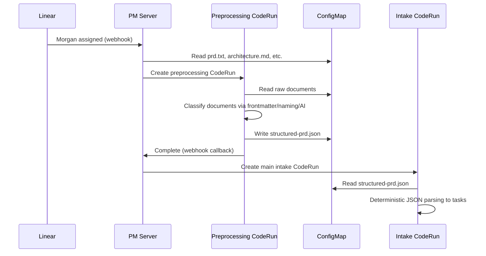

# PRD Preprocessing Pipeline

## Architecture Overview




## Structured JSON Schema

The preprocessing step produces a predictable JSON structure:

```json
{
  "version": "1.0",
  "project": {
    "name": "AlertHub",
    "description": "Multi-Platform Notification System"
  },
  "prd": {
    "vision": "...",
    "features": [
      {
        "id": "1",
        "title": "Notification Router",
        "agent": "rex",
        "priority": "high",
        "description": "...",
        "endpoints": [...],
        "dataModels": [...]
      }
    ],
    "constraints": [...],
    "nonGoals": [...],
    "successCriteria": [...]
  },
  "architecture": "...",
  "resources": [
    { "url": "https://...", "title": "Effect.ts Docs", "type": "research" }
  ]
}
```

## Document Classification Strategy

The preprocessing agent uses this priority order:

1. **Frontmatter metadata** (preferred) - Documents with YAML frontmatter:
  ```markdown
   ---
   type: architecture
   title: System Architecture
   ---
  ```
2. **Naming conventions** (fallback) - File naming patterns:
  - `architecture*.md` → architecture
  - `research-*.md`, `resources.md` → resources
  - `api-*.md`, `spec-*.md` → resources (type: api)
3. **AI classification** (last resort) - Morgan analyzes content to determine type

## Implementation Changes

### 1. PM Server Changes

File: [crates/pm/src/handlers/intake.rs](crates/pm/src/handlers/intake.rs)

- Add new `submit_preprocessing_coderun()` function
- Modify `submit_intake_coderun()` to check for `structured-prd.json` in ConfigMap
- Add webhook callback handling for preprocessing completion

```rust
// New preprocessing CodeRun submission
pub async fn submit_preprocessing_coderun(
    kube_client: &KubeClient,
    namespace: &str,
    request: &IntakeRequest,
) -> Result<IntakeResult>

// Modified intake submission - reads structured JSON
pub async fn submit_intake_coderun(
    // ... existing params ...
    use_structured: bool,  // New param
)
```

### 2. Preprocessing Prompt Template

New file: [templates/preprocessing/system.hbs](templates/preprocessing/system.hbs)

Morgan receives a lightweight prompt to:

- Read all documents from the project ConfigMap
- Classify each document by type
- Extract structured PRD fields
- Output `structured-prd.json`

### 3. Intake CLI Updates

File: [crates/intake/src/bin/cli.rs](crates/intake/src/bin/cli.rs)

- Add `--structured` flag to read from JSON instead of markdown
- Add `--structured-path` to specify JSON file path

File: [crates/intake/src/domain/ai.rs](crates/intake/src/domain/ai.rs)

- Add `parse_structured_prd()` function for deterministic JSON parsing
- Skip AI parsing when structured input is provided

### 4. ConfigMap Schema Update

The project ConfigMap gains a new key:

```yaml
data:
  prd.txt: "..."           # Original markdown (kept for reference)
  architecture.md: "..."    # Original architecture
  config.json: "..."        # Project config
  structured-prd.json: "..." # NEW: Preprocessed structured data
```

### 5. Webhook Callback Flow

When preprocessing completes, it calls back to PM server:

```
POST /api/intake/preprocessing-complete
{
  "project_id": "...",
  "configmap_name": "...",
  "success": true
}
```

PM server then creates the main intake CodeRun.

## Migration Path

1. **Phase 1**: Add preprocessing as optional (feature flag in cto-config.json)
2. **Phase 2**: Run both flows in parallel to validate JSON accuracy
3. **Phase 3**: Make preprocessing the default, keep markdown fallback

## Configuration

Add to [cto-config.json](cto-config.json):

```json
{
  "defaults": {
    "intake": {
      "preprocessing": {
        "enabled": true,
        "fallbackToMarkdown": true
      }
    }
  }
}
```

