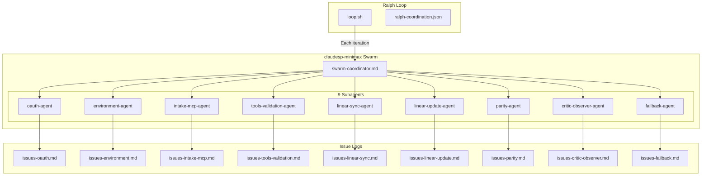

# MiniMax Swarm Ralph Loop - Full Plan

## Overview

Ralph loop using Claude Sneakpeek's swarm mode with MiniMax M2.1. 9 specialized subagents for E2E testing of the preprocessing pipeline. Per-agent issue logging. TMux visualization.

---

## Claude Sneakpeek with MiniMax

Claude Sneakpeek creates a custom Claude Code variant that routes all API calls through MiniMax's Anthropic-compatible endpoint. This gives you Claude Code's full feature set (swarm mode, TeammateTool, Task system) powered by MiniMax-M2.1.

### How It Works

1. **Installation** creates a wrapper script at `~/.local/bin/claudesp-minimax`
2. **Configuration** stored at `~/.claude-sneakpeek/claudesp-minimax/config/`
3. **API routing**: Sets `ANTHROPIC_BASE_URL=https://api.minimax.io/anthropic`
4. **Model mapping**: All Claude model references → MiniMax-M2.1

### Installation

```bash
# One-time setup (creates the claudesp-minimax command)
npx @realmikekelly/claude-sneakpeek quick \
  --provider minimax \
  --api-key "$MINIMAX_API_KEY" \
  --name claudesp-minimax

# Verify installation
claudesp-minimax --version
# → 2.1.19 (Claude Code)
```

### Skills Setup

Skills from `~/.claude/skills/` and `.factory/skills/` must be copied to the claudesp-minimax config:

```bash
# Copy main Claude skills (133 skills)
cd ~/.claude-sneakpeek/claudesp-minimax/config/skills
for skill in ~/.claude/skills/*.md; do cp "$skill" .; done

# Copy factory skills (directory-based)
for dir in /path/to/repo/.factory/skills/*/; do
  skillname=$(basename "$dir")
  if [ -f "${dir}SKILL.md" ]; then
    mkdir -p "$skillname" && cp "${dir}SKILL.md" "$skillname/"
  fi
done
```

### Critical Skill: Swarm Orchestration

The `orchestrating-swarms` skill documents Claude Code's TeammateTool and Task system for multi-agent coordination. This is essential reading for swarm mode.

**Location:** `~/.claude-sneakpeek/claudesp-minimax/config/skills/orchestrating-swarms/SKILL.md`
**Source:** https://gist.github.com/kieranklaassen/4f2aba89594a4aea4ad64d753984b2ea

Key patterns covered:
- **Parallel Specialists** - Multiple reviewers working simultaneously
- **Pipeline** - Sequential task dependencies
- **Swarm** - Self-organizing workers claiming from a task pool
- **TeammateTool** - spawnTeam, write, broadcast, requestShutdown, cleanup
- **Task System** - TaskCreate, TaskList, TaskUpdate, dependencies

---

## Command

```bash
# Run swarm (claudesp-minimax routes to MiniMax API)
claudesp-minimax \
  --dangerously-skip-permissions \
  --permission-mode delegate \
  --agents "$(cat agents.json)" \
  --add-dir "$(pwd)" \
  --verbose \
  "$(cat swarm-coordinator.md)"

# Failback to Anthropic Claude (when failback.active=true)
claude \
  --dangerously-skip-permissions \
  --permission-mode delegate \
  --agents "$(cat agents.json)" \
  --add-dir "$(pwd)" \
  --verbose \
  "$(cat swarm-coordinator.md)"
```

---

## Architecture Diagram



---

## Subagents

| # | Agent | Priority | Responsibility |
|---|-------|----------|----------------|
| 1 | oauth-agent | 1 (blocking) | Validate Morgan OAuth tokens |
| 2 | environment-agent | 2 | Service health, restarts |
| 3 | intake-mcp-agent | 3 | Run MCP intake, create Linear |
| 4 | tools-validation-agent | 3 | Verify MCP tools config |
| 5 | linear-sync-agent | 4 | Task → Linear sync |
| 6 | linear-update-agent | 5 | Bidirectional sync test |
| 7 | parity-agent | 6 | Feature parity check |
| 8 | critic-observer-agent | 4 | Multi-model critic test |
| 9 | failback-agent | 7 | Monitor failures, trigger failback |

---

## Execution Flow

```
┌─────────────────────────────────────────────────────────────┐
│                      Ralph Loop                              │
├─────────────────────────────────────────────────────────────┤
│  1. oauth-agent (blocking)                                   │
│     ↓                                                        │
│  2. environment-agent                                        │
│     ↓                                                        │
│  3. intake-mcp-agent ←→ tools-validation-agent (parallel)    │
│     ↓                                                        │
│  4. [Wait for task generation]                               │
│     ↓                                                        │
│  5. linear-sync-agent ←→ critic-observer-agent (parallel)    │
│     ↓                                                        │
│  6. linear-update-agent                                      │
│     ↓                                                        │
│  7. parity-agent (final verification)                        │
│     ↓                                                        │
│  8. failback-agent (continuous monitor)                      │
│     ↓                                                        │
│  9. Check milestones → Complete or iterate                   │
└─────────────────────────────────────────────────────────────┘
```

---

## Milestones

| Milestone | Agent | Description |
|-----------|-------|-------------|
| `oauth_valid` | oauth | Morgan tokens validated |
| `services_healthy` | environment | All services responsive |
| `linear_project_created` | intake-mcp | Linear project + PRD created |
| `tasks_generated` | intake-mcp | Tasks JSON generated |
| `tasks_synced` | linear-sync | Tasks synced to Linear |
| `updates_tested` | linear-update | Bidirectional sync works |
| `parity_verified` | parity | Feature parity confirmed |
| `critic_tested` | critic-observer | Multi-model feature works |

---

## Coordination Schema

```json
{
  "version": "1.0",
  "iteration": 0,
  "started_at": null,
  "status": "pending",
  "agents": {
    "oauth-agent": { "status": "pending", "last_run": null, "issues_open": 0 },
    "environment-agent": { "status": "pending", "last_run": null, "issues_open": 0 },
    "intake-mcp-agent": { "status": "pending", "last_run": null, "issues_open": 0 },
    "tools-validation-agent": { "status": "pending", "last_run": null, "issues_open": 0 },
    "linear-sync-agent": { "status": "pending", "last_run": null, "issues_open": 0 },
    "linear-update-agent": { "status": "pending", "last_run": null, "issues_open": 0 },
    "parity-agent": { "status": "pending", "last_run": null, "issues_open": 0 },
    "critic-observer-agent": { "status": "pending", "last_run": null, "issues_open": 0 },
    "failback-agent": { "status": "pending", "last_run": null, "issues_open": 0 }
  },
  "failback": {
    "active": false,
    "failures_detected": 0,
    "failbacks_executed": 0,
    "current_model": "minimax",
    "last_failure": null
  },
  "milestones": {
    "oauth_valid": false,
    "services_healthy": false,
    "linear_project_created": false,
    "tasks_generated": false,
    "tasks_synced": false,
    "updates_tested": false,
    "parity_verified": false,
    "critic_tested": false
  },
  "issues_count": { "open": 0, "resolved": 0 }
}
```

---

## Failback Logic

**Trigger conditions:**
- HTTP 4xx/5xx from MiniMax API
- Timeout > 60s
- Invalid JSON response
- Empty/malformed output
- Agent-reported errors citing MiniMax

**Execution:**
1. Detect failure in coordination or agent output
2. Set `failback.active = true` in ralph-coordination.json
3. Loop switches from `claudesp-minimax` to `claude`
4. Log failback event
5. Continue monitoring

---

## Issue Logging Pattern

Each agent checks `issues/issues-{agent}.md` before executing. Format:

```markdown
## ISSUE-{N}: {title}
- **Status**: OPEN | IN_PROGRESS | RESOLVED
- **Severity**: BLOCKING | HIGH | MEDIUM | LOW
- **Discovered**: {timestamp}
- **Description**: {what}
- **Root Cause**: {why}
- **Resolution**: {how}
```

---

## Related Plans

1. **Intake SDK Migration** (`docs/intake_sdk_migration_61705da7.plan.md`)
   - TypeScript intake binary using Claude Agent SDK
   - Full MCP tool support
   - Research phase with web/code search

2. **PRD Preprocessing Pipeline** (`docs/2026-01/prd_preprocessing_pipeline_39fc3823.plan.md)`)
   - Markdown → JSON preprocessing
   - Document classification (frontmatter → naming → AI)
   - Structured PRD output

---

## Prerequisites

```bash
# 1. Set API key (from .env.local or export directly)
export MINIMAX_API_KEY="sk-..."

# 2. Install claudesp-minimax (creates ~/.local/bin/claudesp-minimax)
npx @realmikekelly/claude-sneakpeek quick \
  --provider minimax \
  --api-key "$MINIMAX_API_KEY" \
  --name claudesp-minimax

# 3. Copy skills to claudesp-minimax
cd ~/.claude-sneakpeek/claudesp-minimax/config/skills
for skill in ~/.claude/skills/*.md; do cp "$skill" .; done
# Also copy .factory/skills/* (see Skills Setup section above)

# 4. Verify swarm skill is installed
cat orchestrating-swarms/SKILL.md | head -5
# Should show: name: orchestrating-swarms

# 5. Verify installation
claudesp-minimax --version
# → 2.1.19 (Claude Code)

# 6. Verify services
just launchd-status

# 7. Build intake-agent
cd apps/intake-agent && bun run build
```

## Swarm Operations Checklist

### Pre-Flight Checklist

- [ ] `MINIMAX_API_KEY` exported or in `.env.local`
- [ ] `claudesp-minimax --version` returns 2.1.19+
- [ ] Skills copied to `~/.claude-sneakpeek/claudesp-minimax/config/skills/`
- [ ] `orchestrating-swarms/SKILL.md` present
- [ ] Services healthy: `just launchd-status`
- [ ] Tool server running: `curl http://localhost:8082/health`
- [ ] TMux backend forced: `export CLAUDE_CODE_SPAWN_BACKEND=tmux`
- [ ] TMux session started: `tmux new-session -s preprocessing-e2e`
- [ ] **RepoMix:** Pack target codebase before starting (for existing projects)

### During Execution

- [ ] Monitor team inbox: `tail -f ~/.claude/teams/preprocessing-e2e/inboxes/team-lead.json`
- [ ] Check task states: `cat ~/.claude/tasks/preprocessing-e2e/*.json | jq '{id, subject, status, owner}'`
- [ ] Watch for idle notifications (agent finished work)
- [ ] Watch for shutdown_approved messages before cleanup

### Shutdown Sequence (CRITICAL)

**Never call `cleanup` with active teammates.** Always follow this sequence:

```javascript
// 1. Request shutdown for ALL teammates
Teammate({ operation: "requestShutdown", target_agent_id: "oauth-agent" })
Teammate({ operation: "requestShutdown", target_agent_id: "environment-agent" })
// ... repeat for all 9 agents

// 2. Wait for shutdown_approved messages in inbox
// Each agent sends: {"type": "shutdown_approved", "from": "agent-name", ...}

// 3. Only then cleanup
Teammate({ operation: "cleanup" })
```

---

## File Locations (Debugging)

| Resource | Path |
|----------|------|
| Team config | `~/.claude/teams/preprocessing-e2e/config.json` |
| Leader inbox | `~/.claude/teams/preprocessing-e2e/inboxes/team-lead.json` |
| Agent inboxes | `~/.claude/teams/preprocessing-e2e/inboxes/{agent}.json` |
| Task files | `~/.claude/tasks/preprocessing-e2e/{N}.json` |
| Sneakpeek config | `~/.claude-sneakpeek/claudesp-minimax/config/settings.json` |

### Useful Debug Commands

```bash
# List all teams
ls ~/.claude/teams/

# Check team members and backend type
cat ~/.claude/teams/preprocessing-e2e/config.json | jq '.members[] | {name, agentType, backendType}'

# Watch inbox for new messages
tail -f ~/.claude/teams/preprocessing-e2e/inboxes/team-lead.json | jq '.'

# Check all task states
cat ~/.claude/tasks/preprocessing-e2e/*.json | jq '{id, subject, status, owner, blockedBy}'

# View tmux panes (if using tmux backend)
tmux list-panes

# Switch to specific agent pane
tmux select-pane -t 1
```

---

## Task Dependencies (Implementation)

The execution flow maps to TaskUpdate dependencies:

```javascript
// Create tasks for each milestone
TaskCreate({ subject: "OAuth Validation", description: "Validate Morgan OAuth tokens" }) // #1
TaskCreate({ subject: "Service Health", description: "Check all services responsive" }) // #2
TaskCreate({ subject: "MCP Intake", description: "Run intake, create Linear project" }) // #3
TaskCreate({ subject: "Tools Validation", description: "Verify MCP tools config" }) // #4
TaskCreate({ subject: "Linear Sync", description: "Sync tasks to Linear" }) // #5
TaskCreate({ subject: "Bidirectional Update", description: "Test bidirectional sync" }) // #6
TaskCreate({ subject: "Parity Check", description: "Verify feature parity" }) // #7
TaskCreate({ subject: "Critic Test", description: "Test multi-model critic" }) // #8

// Set up dependencies matching execution flow
TaskUpdate({ taskId: "2", addBlockedBy: ["1"] })  // health after oauth
TaskUpdate({ taskId: "3", addBlockedBy: ["2"] })  // intake after health
TaskUpdate({ taskId: "4", addBlockedBy: ["2"] })  // tools after health (parallel with #3)
TaskUpdate({ taskId: "5", addBlockedBy: ["3", "4"] })  // sync after intake+tools
TaskUpdate({ taskId: "6", addBlockedBy: ["5"] })  // update after sync
TaskUpdate({ taskId: "7", addBlockedBy: ["6"] })  // parity after update
TaskUpdate({ taskId: "8", addBlockedBy: ["5"] })  // critic can run parallel with #6
```

---

## Message Types to Monitor

The Ralph loop should watch the leader inbox for these structured messages:

| Message Type | Meaning | Action |
|--------------|---------|--------|
| `idle_notification` | Agent finished work, waiting | Check if more tasks available |
| `task_completed` | Agent completed a specific task | Update milestone tracking |
| `shutdown_approved` | Agent acknowledged shutdown | Safe to proceed with cleanup |
| `shutdown_request` | (Rare) Agent requesting to exit | Approve if appropriate |

**Example idle_notification:**
```json
{
  "type": "idle_notification",
  "from": "oauth-agent",
  "timestamp": "2026-01-29T...",
  "completedTaskId": "1",
  "completedStatus": "completed"
}
```

---

## Heartbeat & Recovery

- **Heartbeat timeout:** 5 minutes per teammate
- **Crashed agent handling:** Tasks remain in task list, can be reclaimed by another agent
- **Recovery:** If agent crashes, spawn replacement with same name to claim orphaned tasks

```javascript
// If oauth-agent crashes, spawn replacement
Task({
  team_name: "preprocessing-e2e",
  name: "oauth-agent",  // Same name reclaims tasks
  subagent_type: "general-purpose",
  prompt: "Check TaskList for unclaimed tasks with 'OAuth' in subject. Claim and complete.",
  run_in_background: true
})
```

---

## TMux Backend (Recommended)

For visibility during E2E testing, force the tmux backend. See skill `tmux-swarm-orchestration/SKILL.md` for full setup scripts.

### Quick Setup

```bash
# Force tmux backend
export CLAUDE_CODE_SPAWN_BACKEND=tmux

# Start session with 9 panes (run setup script)
./scripts/setup-swarm-tmux.sh /path/to/project

# Or manually create session
tmux new-session -s preprocessing-e2e
```

### Pre-Spawn Error Check (CRITICAL)

**Always check panes for errors before spawning agents:**

```bash
# Check each pane for errors before spawning
for pane in $(tmux list-panes -t preprocessing-e2e -F '#{pane_index}'); do
    output=$(tmux capture-pane -t "preprocessing-e2e:0.$pane" -p -S -10)
    if echo "$output" | grep -qiE 'error|failed|panic'; then
        echo "WARNING: Pane $pane has errors"
    fi
done
```

### TMux Layout with 9 Agents

```
┌─────────┬─────────┬─────────┐
│ Leader  │ oauth   │ environ │
├─────────┼─────────┼─────────┤
│ intake  │ tools   │ sync    │
├─────────┼─────────┼─────────┤
│ update  │ parity  │ critic  │
└─────────┴─────────┴─────────┘

# Rebalance layout
tmux select-layout tiled
```

### Open in Separate Terminal (macOS)

```bash
# After creating session, open in new Terminal window
osascript -e 'tell application "Terminal" to do script "tmux attach -t preprocessing-e2e"'
```

**Full documentation:** See skill `tmux-swarm-orchestration/SKILL.md`

---

## Prompt Structure (XML with Code Examples)

Agent prompts should use XML structure for clarity and include relevant code examples. This format works better with Claude models.

### XML Prompt Template

```xml
<agent_prompt name="intake-mcp-agent">
  <role>
    You are the intake-mcp-agent responsible for running MCP intake 
    and creating Linear projects.
  </role>

  <context>
    <team_name>preprocessing-e2e</team_name>
    <task_id>3</task_id>
    <dependencies>oauth_valid, services_healthy</dependencies>
  </context>

  <instructions>
    1. Verify prerequisites are met (check milestones)
    2. Run MCP intake with the test PRD
    3. Verify Linear project creation
    4. Update milestone: linear_project_created
    5. Report results to team-lead via Teammate write
  </instructions>

  <code_examples>
    <example name="mcp_intake_call">
      <description>How to call MCP intake tool</description>
      <code language="javascript">
// Call intake MCP tool
const result = await mcp.call('intake', {
  project_name: 'preprocessing-e2e-test',
  prd_path: './test-prd.json'
});

// Check result
if (result.linear_project_id) {
  console.log('Created:', result.linear_project_id);
}
      </code>
    </example>
    
    <example name="teammate_write">
      <description>Report findings to team-lead</description>
      <code language="javascript">
Teammate({
  operation: "write",
  target_agent_id: "team-lead",
  value: JSON.stringify({
    type: "task_completed",
    agent: "intake-mcp-agent",
    taskId: "3",
    result: {
      linear_project_id: "PRJ-123",
      tasks_generated: 15
    }
  })
})
      </code>
    </example>
  </code_examples>

  <success_criteria>
    - Linear project exists with correct name
    - PRD issue created with description
    - Tasks JSON file generated
    - Milestone updated in ralph-coordination.json
  </success_criteria>

  <error_handling>
    On failure, log to issues/issues-intake-mcp.md with:
    - Error message and stack trace
    - API response if available
    - Suggested remediation
  </error_handling>
</agent_prompt>
```

### Code Example Sections by Agent Type

| Agent | Code Examples Needed |
|-------|---------------------|
| oauth-agent | Token refresh, OAuth flow, credential validation |
| environment-agent | Health checks, service restart, launchd commands |
| intake-mcp-agent | MCP tool calls, Linear API, task generation |
| tools-validation-agent | MCP config parsing, tool schema validation |
| linear-sync-agent | Linear GraphQL mutations, task sync logic |
| linear-update-agent | Bidirectional sync, conflict resolution |
| parity-agent | Feature comparison, diff generation |
| critic-observer-agent | Multi-model API calls, response comparison |
| failback-agent | Error detection, model switching |

---

## RepoMix Integration (Existing Codebase Analysis)

**CRITICAL for existing projects:** Before agents start work, use RepoMix to pack and index the codebase into a digestible format. This gives agents full context of the existing architecture.

### Configuration Setting

In `cto-config.json`, the `includeCodebase` flag controls whether RepoMix is used:

```json
{
  "defaults": {
    "intake": {
      "includeCodebase": true,  // Enable for existing projects
      "sourceBranch": "main"
    }
  }
}
```

| Setting | Use Case |
|---------|----------|
| `includeCodebase: false` | New/greenfield projects (default) |
| `includeCodebase: true` | Existing projects - triggers RepoMix packing |

**Note:** This feature has not been fully tested yet. When enabled, intake should automatically pack the codebase before task generation.

### Why RepoMix Matters

Without RepoMix, agents work "blind" on existing codebases - they may:
- Duplicate existing functionality
- Break existing patterns
- Miss integration points
- Ignore established conventions

### RepoMix Workflow

```javascript
// 1. Pack the repository (do this ONCE at start)
const packed = await repomix_pack_remote_repository({
  remote: "https://github.com/5dlabs/cto",
  branch: "develop"
});
// Returns: { output_id: "abc123", stats: { files: 500, lines: 50000 } }

// 2. Search for relevant patterns
const authCode = await repomix_grep_repomix_output({
  pattern: "authentication|OAuth|token",
  output_id: "abc123"
});

// 3. Read specific sections
const details = await repomix_read_repomix_output({
  output_id: "abc123",
  start_line: 1500,
  end_line: 1700
});
```

### Agent Pre-Flight with RepoMix

Add to swarm coordinator prompt:

```xml
<pre_flight>
  <repomix>
    Before starting any implementation:
    1. Pack the target repository with repomix_pack_remote_repository
    2. Search for existing patterns related to your task
    3. Understand the codebase structure before writing code
    4. Reference existing conventions in your implementation
  </repomix>
</pre_flight>
```

### RepoMix Tools

| Tool | Purpose |
|------|---------|
| `repomix_pack_codebase` | Pack local codebase |
| `repomix_pack_remote_repository` | Pack a GitHub repository |
| `repomix_grep_repomix_output` | Search within packed output |
| `repomix_read_repomix_output` | Read sections of packed output |

### Use Cases in Swarm

| Agent | RepoMix Usage |
|-------|---------------|
| intake-mcp-agent | Pack repo to understand architecture before task generation |
| tools-validation-agent | Search for existing MCP patterns |
| linear-sync-agent | Find existing Linear integration code |
| parity-agent | Compare implementations against existing codebase |

---

## Context7 Integration (Documentation Lookup)

Use Context7 MCP tools to fetch up-to-date documentation before implementing code. This prevents hallucinated APIs and ensures best practices.

### Workflow

```javascript
// 1. Resolve library ID first (don't guess!)
const libraryId = await context7_resolve_library_id({
  libraryName: "effect typescript"
});
// Returns: "/effect-ts/effect"

// 2. Query specific topic
const docs = await context7_get_library_docs({
  context7CompatibleLibraryID: "/effect-ts/effect",
  topic: "schema validation"
});
// Returns: Current documentation with examples
```

### Common Library IDs

| Library | Context7 ID | Use Case |
|---------|-------------|----------|
| Effect | `/effect-ts/effect` | Type-safe errors, schemas |
| Better Auth | `/better-auth/better-auth` | Authentication |
| Next.js | `/vercel/next.js` | React framework |
| React | `/facebook/react` | UI components |
| Axum | `/tokio-rs/axum` | Rust web framework |
| Drizzle ORM | `/drizzle-team/drizzle-orm` | Database queries |
| Elysia | `elysiajs` | Bun web framework |

### Agent Documentation Queries

Each agent should query relevant docs before implementing:

```javascript
// intake-mcp-agent: Query Linear API docs
await context7_get_library_docs({
  libraryId: "linear/sdk",
  topic: "create project and issues"
});

// critic-observer-agent: Query Anthropic SDK docs
await context7_get_library_docs({
  libraryId: "anthropic/sdk",
  topic: "message streaming with tools"
});
```

### Alternative: Library-Specific MCP Tools

If Context7 isn't available, use library-specific MCP tools:

| Tool | Library | Query Example |
|------|---------|---------------|
| `better_auth_search` | Better Auth | `{ query: "session management", mode: "deep" }` |
| `pg_aiguide_search_docs` | PostgreSQL | `{ source: "postgres", query: "indexes", version: "17" }` |
| `exa_mcp_web_search_exa` | General | `{ query: "Linear API create project" }` |

---

## Language-Based Agent Selection

Different languages require different agent configurations for optimal results.

### Language → Agent Type Mapping

| Language | subagent_type | Model Preference | Rationale |
|----------|---------------|------------------|-----------|
| **Rust** | `general-purpose` | sonnet/opus | Complex type system, ownership |
| **TypeScript** | `general-purpose` | sonnet | Type inference, async patterns |
| **Python** | `general-purpose` | haiku/sonnet | Simpler syntax, fast iteration |
| **Go** | `general-purpose` | sonnet | Concurrency, error handling |
| **SQL** | `Explore` | haiku | Read-only, query analysis |
| **Shell/Bash** | `Bash` | inherit | Command execution only |
| **YAML/JSON** | `Explore` | haiku | Config validation |

### Language Detection in Prompts

Include language context in agent prompts:

```xml
<language_context>
  <primary_language>TypeScript</primary_language>
  <frameworks>Effect, Elysia, Better Auth</frameworks>
  <documentation_queries>
    - context7: /effect-ts/effect (schema validation)
    - context7: /better-auth/better-auth (session handling)
    - better_auth_search: "OAuth flow" (mode: deep)
  </documentation_queries>
</language_context>
```

### Agent Prompt with Language Awareness

```xml
<agent_prompt name="linear-sync-agent">
  <language_context>
    <primary>TypeScript</primary>
    <runtime>Bun</runtime>
    <key_libraries>
      <library name="@linear/sdk" context7_id="linear/sdk" />
      <library name="effect" context7_id="/effect-ts/effect" />
    </key_libraries>
  </language_context>
  
  <pre_implementation>
    Before writing code, query documentation:
    1. context7_get_library_docs({ libraryId: "linear/sdk", topic: "sync issues" })
    2. context7_get_library_docs({ libraryId: "/effect-ts/effect", topic: "error handling" })
  </pre_implementation>
  
  <code_examples>
    <example name="linear_sync" language="typescript">
import { LinearClient } from "@linear/sdk";
import { Effect, pipe } from "effect";

const syncTask = (task: Task) => 
  pipe(
    Effect.tryPromise(() => linear.createIssue({
      teamId: TEAM_ID,
      title: task.subject,
      description: task.description,
    })),
    Effect.mapError((e) => new LinearSyncError({ cause: e }))
  );
    </example>
  </code_examples>
</agent_prompt>
```

---

## Best Practices Summary

1. **Always cleanup** - Don't leave orphaned teams (`~/.claude/teams/`)
2. **Meaningful names** - `oauth-agent` not `worker-1` (aids debugging)
3. **Clear prompts** - Tell agents exactly what to do and how to report
4. **Use task dependencies** - Let TaskUpdate manage unblocking, don't poll
5. **Check inboxes** - Workers send results via Teammate write, not stdout
6. **Prefer write over broadcast** - Broadcast sends N messages (expensive)
7. **Force tmux** - For visibility during debugging/testing
8. **Graceful shutdown** - Always requestShutdown → wait → cleanup
9. **XML prompt structure** - Use XML tags for role, context, instructions, examples
10. **Query docs first** - Use Context7 before implementing (prevents hallucinations)
11. **Include code examples** - Each prompt should have runnable examples in `<code_examples>`
12. **Language awareness** - Set model/agent type based on primary language

---

## Tool Server Architecture

The CTO platform uses a client-server architecture where MCP tools are filtered per-agent based on `cto-config.json`. Understanding this is critical for debugging "tool not found" issues.

### Architecture Summary

```
CLI Binary (claude/claudesp-minimax)
    │ stdin/stdout (JSON-RPC)
    ▼
tools-mcp-bridge (Rust binary)
    │ Reads client-config.json
    │ Filters tools per remoteTools list
    ├──► Remote Tool Server (HTTP, port 8082)
    │        └──► Context7, OctoCode, Firecrawl, GitHub MCP servers
    └──► Local MCP Servers (stdio, spawned per-session)
             └──► remotion-documentation, etc.
```

### Tool Configuration Flow

1. **cto-config.json** defines which tools each agent gets:
```json
{
  "agents": {
    "morgan": {
      "tools": {
        "remote": ["context7_*", "octocode_*", "firecrawl_*"],
        "localServers": {}
      }
    }
  }
}
```

2. **Controller generates** `client-config.json` with filtered tools

3. **CLI binary** reads `client-config.json` and only exposes those tools

### Quick Debug Commands

```bash
# Check what tools an agent should have
jq '.agents.morgan.tools.remote' cto-config.json

# Check generated config
cat client-config.json | jq '.remoteTools'

# Verify tool server health
curl http://localhost:8082/health

# List all tools on server
curl http://localhost:8082/tools | jq '.tools[].name'
```

### For Swarm Agents

Each swarm agent inherits tools from its spawning context. Ensure:
- `claudesp-minimax` has access to required MCP servers
- Tool server is running: `curl http://localhost:8082/health`
- Check logs: `tail -f /tmp/cto-launchd/tools.log`

**Full documentation:** See skill `cto-tool-server-architecture/SKILL.md`

---

## Specialized Subagents

The platform includes specialized subagents for delegation. These are available in both Cursor (`~/.cursor/agents/`) and Claude SP (`~/.claude-sneakpeek/claudesp-minimax/config/agents/`).

### Infrastructure Subagents

| Subagent | Purpose | Key Commands |
|----------|---------|--------------|
| `argocd-sync` | GitOps sync monitoring & remediation | `argocd app list`, `argocd app sync` |
| `argo-workflows` | Play workflow orchestration | `argo list`, `argo get`, `argo watch` |
| `argo-events` | Webhook and event handling | EventSource logs, Sensor status |
| `controller-crd` | CRD processing & templates | `kubectl get coderuns`, template debugging |
| `cloudflare-tunnels` | Tunnel configuration | TunnelBinding CRDs, cloudflared |

### Platform Subagents

| Subagent | Purpose | Focus |
|----------|---------|-------|
| `healer-expert` | Self-healing & remediation | Detection patterns, CI routing |
| `stitch-reviewer` | Code review specialist | PR review workflow, GitHub App |
| `bolt-devops` | Infrastructure & DevOps | Helm charts, operators, deployments |

### Agent Expert Subagents

| Subagent | Focus | Template Source |
|----------|-------|-----------------|
| `morgan-expert` | PRD intake, task generation | `templates/agents/morgan/` |
| `rex-expert` | Rust implementation | `templates/agents/rex/` |
| `blaze-expert` | React/Next.js frontend | `templates/agents/blaze/` |
| `cleo-expert` | Code quality review | `templates/agents/cleo/` |
| `cipher-expert` | Security analysis | `templates/agents/cipher/` |
| `tess-expert` | Testing strategies | `templates/agents/tess/` |
| `atlas-expert` | PR merging (CI gate) | `templates/agents/atlas/` |
| `grizz-expert` | Go implementation | `templates/agents/grizz/` |

### Using Subagents in Swarm

When orchestrating swarms, delegate to specialized subagents for domain-specific tasks:

```javascript
// Example: Delegate ArgoCD sync check to specialist
Task.create({
  assignee: 'argocd-sync',
  description: 'Check all applications are in sync',
  context: 'Verify no OutOfSync or Degraded applications exist'
})

// Example: Delegate Rust implementation to rex-expert
Task.create({
  assignee: 'rex-expert',
  description: 'Implement notification service API',
  context: 'Use Axum, follow existing patterns in crates/pm/'
})
```

### Subagent Locations

- **Cursor:** `~/.cursor/agents/*.md`
- **Claude SP:** `~/.claude-sneakpeek/claudesp-minimax/config/agents/*.md`

---

## Key References

**Skills:**
- **Tool Server Architecture:** `~/.claude-sneakpeek/claudesp-minimax/config/skills/cto-tool-server-architecture/SKILL.md`
- **Swarm Orchestration:** `~/.claude-sneakpeek/claudesp-minimax/config/skills/orchestrating-swarms/SKILL.md`
- **TMux Swarm Setup:** `~/.claude-sneakpeek/claudesp-minimax/config/skills/tmux-swarm-orchestration/SKILL.md`
- **RepoMix (Codebase Packing):** `~/.claude-sneakpeek/claudesp-minimax/config/skills/repomix/SKILL.md`
- **Context7 (Docs Lookup):** `~/.claude-sneakpeek/claudesp-minimax/config/skills/context7/SKILL.md`
- **OctoCode (Code Search):** `~/.claude-sneakpeek/claudesp-minimax/config/skills/octocode/SKILL.md`
- **Firecrawl (Web Research):** `~/.claude-sneakpeek/claudesp-minimax/config/skills/firecrawl/SKILL.md`
- **Rust Patterns:** `~/.claude-sneakpeek/claudesp-minimax/config/skills/rust-patterns/SKILL.md`
- **CodeQL (Security):** `~/.claude-sneakpeek/claudesp-minimax/config/skills/codeql/SKILL.md`

**Subagents (Claude SP):**
- **Infrastructure:** `~/.claude-sneakpeek/claudesp-minimax/config/agents/{argocd-sync,argo-workflows,argo-events,controller-crd,cloudflare-tunnels}.md`
- **Platform:** `~/.claude-sneakpeek/claudesp-minimax/config/agents/{healer-expert,stitch-reviewer,bolt-devops}.md`
- **Agent Experts:** `~/.claude-sneakpeek/claudesp-minimax/config/agents/{morgan,rex,blaze,cleo,cipher,tess,atlas,grizz}-expert.md`

**Subagents (Cursor):**
- `~/.cursor/agents/*.md` (same as Claude SP)

**External Docs:**
- **Claude Sneakpeek Providers:** https://github.com/mikekelly/claude-sneakpeek/blob/main/docs/providers.md
- **Swarm Patterns Gist:** https://gist.github.com/kieranklaassen/4f2aba89594a4aea4ad64d753984b2ea
- **Cursor Subagents:** https://cursor.com/docs/context/subagents
