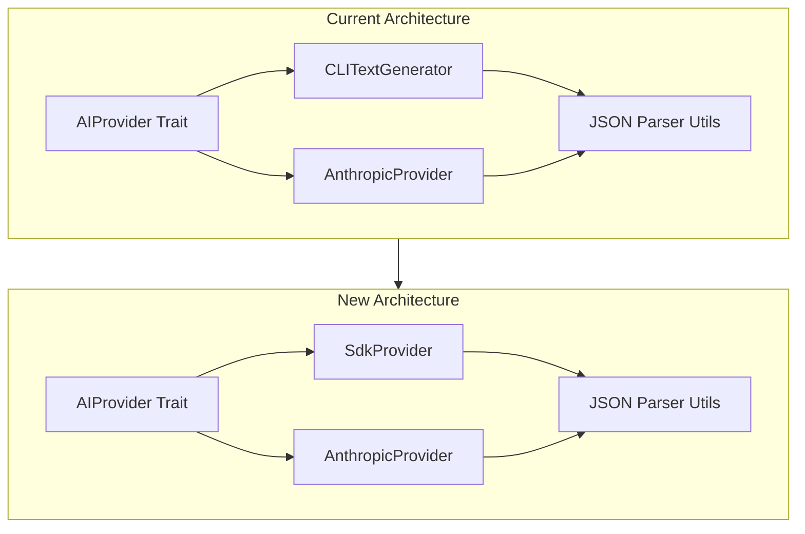
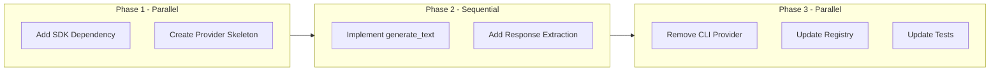

# Intake SDK Migration Plan

## Background

The current intake CLI mode has persistent JSON parsing failures when Claude returns prose instead of structured JSON. The `claude-agent-sdk-rs` crate (v0.6.2) provides a more reliable Rust-native integration with 100% feature parity with the official Python SDK.

**SDK Choice**: [`claude-agent-sdk-rs`](https://docs.rs/claude-agent-sdk-rs/0.6.2/claude_agent_sdk_rs/) over `claude-agent-sdk` because:
- More mature (v0.6.2 vs v0.1.1)
- Better streaming support
- Built-in permission bypass mode
- Includes `query()` one-shot function (perfect for intake)

## Architecture



## Key Files

| File | Action |
|------|--------|
| [`crates/intake/Cargo.toml`](crates/intake/Cargo.toml) | Add `claude-agent-sdk-rs` dependency |
| [`crates/intake/src/ai/sdk_provider.rs`](crates/intake/src/ai/sdk_provider.rs) | **NEW** - SDK implementation |
| [`crates/intake/src/ai/cli_provider.rs`](crates/intake/src/ai/cli_provider.rs) | Remove (1300+ lines) |
| [`crates/intake/src/ai/registry.rs`](crates/intake/src/ai/registry.rs) | Update to use SDK provider |
| [`crates/intake/src/ai/provider.rs`](crates/intake/src/ai/provider.rs) | Keep JSON parsing utils |

## SDK Provider Implementation

Core integration using `query()` for one-shot task generation:

```rust
use claude_agent_sdk_rs::{query, ClaudeAgentOptions, Message, ContentBlock, PermissionMode};
use crate::ai::provider::{AIProvider, AIMessage, AIResponse, GenerateOptions};

pub struct SdkProvider {
    model: String,
}

#[async_trait]
impl AIProvider for SdkProvider {
    async fn generate_text(
        &self,
        model: &str,
        messages: &[AIMessage],
        options: &GenerateOptions,
    ) -> TasksResult<AIResponse> {
        let prompt = self.messages_to_prompt(messages);
        
        let sdk_options = ClaudeAgentOptions::builder()
            .model(model)
            .permission_mode(PermissionMode::BypassPermissions)
            .max_turns(1)  // One-shot for task generation
            .build();
        
        let result = query(&prompt, Some(sdk_options)).await?;
        
        // Extract text from response
        let text = self.extract_text_from_messages(&result);
        
        Ok(AIResponse {
            text,
            usage: self.extract_usage(&result),
            model: model.to_string(),
            provider: "sdk".to_string(),
        })
    }
}
```

## Preserve Existing Components

**Keep unchanged:**
- [`crates/intake/src/ai/provider.rs`](crates/intake/src/ai/provider.rs) - JSON extraction logic:
  - `extract_json_continuation()` (lines 236-326)
  - `validate_json_continuation()` (lines 328-404)  
  - `parse_ai_response()` (lines 406-519)
- [`crates/intake/src/domain/ai.rs`](crates/intake/src/domain/ai.rs) - Retry logic with `MAX_PRD_PARSE_RETRIES = 3`
- [`crates/intake/src/ai/anthropic.rs`](crates/intake/src/ai/anthropic.rs) - API fallback provider
- Prompt template system (Handlebars)
- Prefill technique for JSON output

## Parallel Execution Strategy

Tasks can be executed by swarm agents in parallel where dependencies allow:



## Environment Variables

**Remove:**
- `TASKS_USE_CLI` - No longer needed
- `TASKS_CLI` - No longer needed

**Keep:**
- `TASKS_MODEL` - Model selection
- `TASKS_EXTENDED_THINKING` - Enable via SDK options
- `TASKS_THINKING_BUDGET` - Map to `max_thinking_tokens`

## Testing

1. Unit tests for `SdkProvider` message conversion
2. Integration test with actual SDK call
3. Verify JSON parsing works with SDK responses
4. Test retry logic still functions

## Rollback

If SDK fails, the `AnthropicProvider` API mode remains available as fallback via the registry.