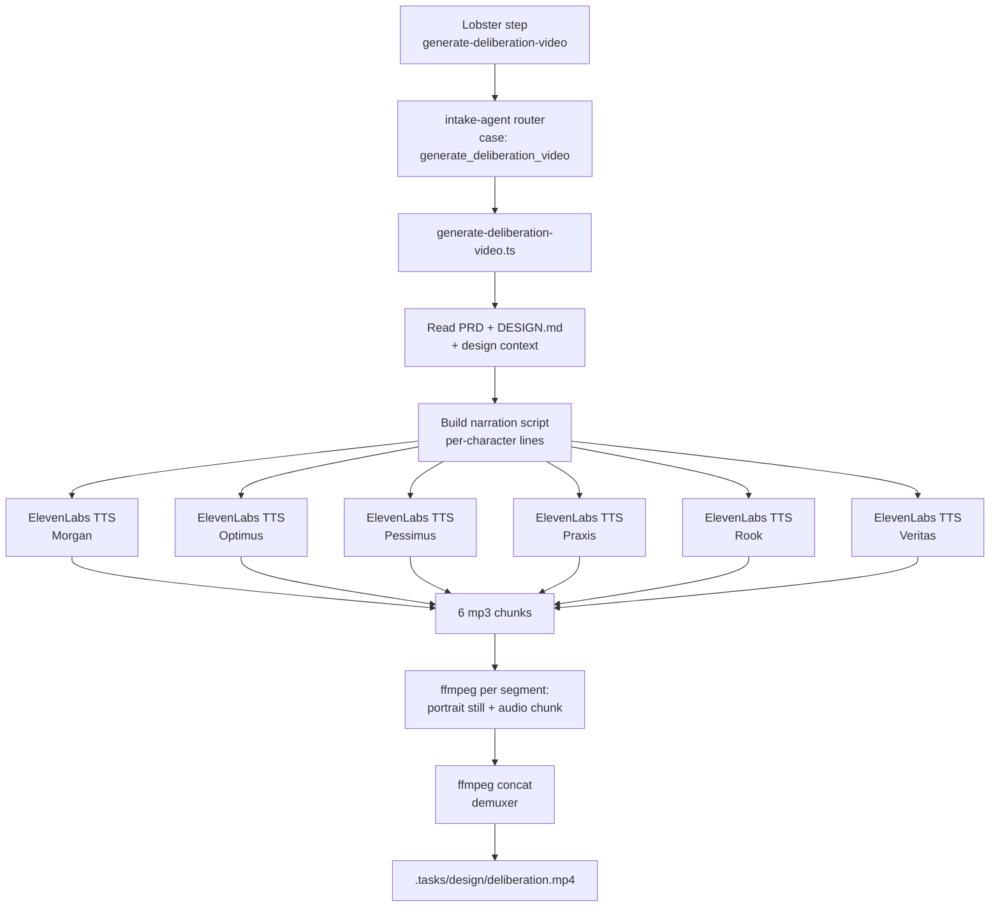

# Intake Deliberation Video — Handoff (ffmpeg slideshow path)

> **Status:** Descoped from FlashHead Pro. The deliberation video is now a
> **portrait-slideshow + ElevenLabs TTS** assembled locally with `ffmpeg`. No
> talking-head lipsync, no Scenario Workflow, no per-character video renders.
> This document is the handoff from the design/research thread to the engineer
> wiring the operation into the intake pipeline.

---

## 1. Overview

The intake pipeline produces a **single MP4** (`.tasks/design/deliberation.mp4`)
that narrates the committee's deliberation over the design decision points.
Each committee member's lines are synthesized by **ElevenLabs TTS** in
parallel, then `ffmpeg` overlays the speaker's approved cyberpunk portrait
for the duration of their audio segment. Segments are concatenated in
narration order to produce the final video.

There is **no real-time avatar, no lipsync, and no remote video render**.
Everything runs locally inside the intake-agent container during the
`generate-deliberation-video` Lobster step.

**Key constraints encoded here:**

- FlashHead Pro is **out of scope** — do not reintroduce it.
- Scenario SDK remains installed but is **not required** for this operation.
  It may be used later for hosting the finished MP4, deferred for now.
- Voice IDs are **orchestrator-managed**, locked into `intake/voices.json`
  after the user picks from sampled candidates.
- Portraits are **v3 Scenario assets** (cyberpunk Neo-Kyoto, 5D uniform,
  black gloves, 5D patch).

---

## 2. Architecture



The fan-out at the TTS step is the only parallelism. ffmpeg invocations are
sequential to keep CPU pressure predictable inside the runner.

---

## 3. Components

| Path | Role |
|---|---|
| `apps/intake-agent/src/operations/generate-deliberation-video.ts` | Bun/TypeScript operation. Reads design artifacts, builds narration, fans out TTS, drives ffmpeg, writes the MP4. |
| `apps/intake-agent/src/index.ts` | Router. Add a `case "generate_deliberation_video":` that dispatches to the operation. |
| `intake/workflows/pipeline.lobster.yaml` | New `generate-deliberation-video` step inserted **after** `design-deliberation`, gated on `INTAKE_DELIBERATION_VIDEO=1`. |
| `intake/voices.json` | Locked voice IDs per character (orchestrator-managed; see §5). |
| `docs/2026-04/avatar/committee-character-prompts.md` | Source of truth for portrait assets and prompts. |
| `docs/2026-04/avatar/deliberation-video-agent-rules.md` | Rules for narration tone and committee composition. |

The operation is the **only** new TypeScript file. The router and Lobster step
are small wiring changes.

---

## 4. Configuration

### Environment variables

| Var | Required | Purpose |
|---|---|---|
| `ELEVENLABS_API_KEY` | yes | Authn for TTS calls. See secret reference below. |
| `INTAKE_PORTRAIT_DIR` | yes | Local directory containing the 6 portrait stills (PNG/JPG) downloaded from Scenario. The operation reads `<character>.png` from this dir. |
| `INTAKE_DELIBERATION_VIDEO` | no | Gate. Lobster step is a no-op unless this is set to `1`. Default off in CI; enable for sigma-1 dry runs. |

### Secrets (1Password)

The ElevenLabs key lives in the **`Operations`** vault.

```
op://Operations/ElevenLabs API Key/credential
```

> **Note:** A previously documented reference
> `op://Automation/p5cretkdu4vcw2qrgfy7eiofta/credential` did **not** resolve
> in this shell. Use the `Operations` vault path above. Update
> `intake/local.env.op.defaults` accordingly when committing pipeline wiring.

Materialize via `op run` like the rest of the intake env:

```bash
op run --env-file=<(echo 'ELEVENLABS_API_KEY=op://Operations/ElevenLabs API Key/credential') -- \
  bun apps/intake-agent/src/index.ts generate_deliberation_video
```

### TTS model

- Model: `eleven_turbo_v2_5` (low latency, stable enough for committee VO).
- Output: `audio/mpeg` (mp3), 44.1kHz mono is fine.
- Concurrency: 6 parallel calls (one per character). ElevenLabs handles this
  comfortably on the standard plan; back off on 429 and retry once.

---

## 5. Character ↔ voice ↔ portrait mapping

| Character | Role | Voice ID | Portrait asset |
|---|---|---|---|
| **Morgan** | Host / moderator (red fox) | `iP95p4xoKVk53GoZ742B` (Chris — locked) | `asset_Pu5sikArqYfER2M4YR6NRUyk` |
| **Optimus** | Optimist framing | _from `intake/voices.json`_ | _existing locked Scenario asset; see `committee-character-prompts.md`_ |
| **Pessimus** | Pessimist framing | _from `intake/voices.json`_ | _existing locked Scenario asset; see `committee-character-prompts.md`_ |
| **Praxis** | Ship/deploy energy (badger) | _from `intake/voices.json`_ | `asset_BRyoPU6FXakm2AfPK2EULqeP` |
| **Rook** | Timeline/strategic (gray wolf) | _from `intake/voices.json`_ | `asset_NxCMWQwJ5F6PDywESf8HhnHD` |
| **Veritas** | Verify/source (meerkat) | _from `intake/voices.json`_ | `asset_kypkn1KKnMLPGtTGSmPTrPyH` |

**Voice selection process (orchestrator-driven):**

1. Sample ElevenLabs library, filter by gender / age / accent matching each
   character's vibe.
2. Render a short test phrase per candidate; user picks 1 of 2–3 per role.
3. Lock IDs into `intake/voices.json` (committed to repo). Morgan's Chris
   voice is already locked.

Praxis/Rook/Veritas portraits are the **v3** approved renders. If the
committee character prompts doc still shows v1 asset IDs (e.g.
`asset_Hct17255…`, `asset_sKyZqwQUd…`, `asset_MwHuyNs2…`), update those
records to the v3 IDs above as part of the `commit-v3-portraits` task.

---

## 6. Running locally

Prereqs: `bun`, `ffmpeg ≥ 6`, `op`, sigma-1 (or any) target repo with intake
artifacts already produced through the `design-deliberation` step.

```bash
# 1. Pull portrait stills once (manual, into INTAKE_PORTRAIT_DIR)
mkdir -p .intake/portraits
# Download each asset_… via Scenario UI or scripted download to:
#   .intake/portraits/morgan.png
#   .intake/portraits/optimus.png
#   .intake/portraits/pessimus.png
#   .intake/portraits/praxis.png
#   .intake/portraits/rook.png
#   .intake/portraits/veritas.png

# 2. Run the operation directly (bypassing Lobster) for tight iteration
op run --env-file ./intake/local.env.op -- bash -c '
  export INTAKE_PORTRAIT_DIR="$PWD/.intake/portraits"
  export INTAKE_DELIBERATION_VIDEO=1
  bun apps/intake-agent/src/index.ts generate_deliberation_video \
    --workspace "$PWD" \
    --output ".tasks/design/deliberation.mp4"
'
```

The operation emits stage logs on stderr (`tts:start`, `tts:done:<char>`,
`ffmpeg:segment:<char>`, `ffmpeg:concat`, `done`) to make pipeline tailing
useful.

---

## 7. Pipeline integration

A `generate-deliberation-video` step lands in `pipeline.lobster.yaml` **after**
the existing `design-deliberation` step (around line 1236 in the current
file). It is gated on `INTAKE_DELIBERATION_VIDEO=1` so default intake runs are
unaffected.

Sketch:

```yaml
  - id: generate-deliberation-video
    env:
      INTAKE_DELIBERATION_VIDEO: ${INTAKE_DELIBERATION_VIDEO}
      ELEVENLABS_API_KEY: ${ELEVENLABS_API_KEY}
      INTAKE_PORTRAIT_DIR: ${WORKSPACE}/.intake/portraits
    command: |
      WS="${WORKSPACE:-.}"
      if [ "${INTAKE_DELIBERATION_VIDEO:-0}" != "1" ]; then
        echo "generate-deliberation-video: gated off (INTAKE_DELIBERATION_VIDEO!=1) — skipping" >&2
        exit 0
      fi
      cd "$WS"
      bun apps/intake-agent/src/index.ts generate_deliberation_video \
        --workspace "$WS" \
        --output "$WS/.tasks/design/deliberation.mp4"
```

The step is intentionally a thin shell wrapper. All real logic lives in the
TypeScript operation so it can be unit-tested and run outside Lobster.

---

## 8. Testing

**Primary target:** the **sigma-1** repo, already used as the reference
brownfield/greenfield path through the rest of intake.

```bash
# from the sigma-1 worktree
INTAKE_DELIBERATION_VIDEO=1 \
INTAKE_PORTRAIT_DIR="$PWD/.intake/portraits" \
op run --env-file ./intake/local.env.op -- \
  lobster run intake/workflows/pipeline.lobster.yaml
```

Acceptance:

1. `.tasks/design/deliberation.mp4` exists, plays end-to-end.
2. Each speaker segment visually matches the speaker's portrait.
3. Audio cuts at segment boundaries are clean (no overlap, no >250ms gap).
4. Total duration ≈ sum of TTS chunk durations ± concat overhead.
5. Step is a no-op when `INTAKE_DELIBERATION_VIDEO` is unset or `0`.

For unit tests, mirror the existing `*.test.ts` style under
`apps/intake-agent/src/operations/`. Mock the ElevenLabs client and assert
the narration script ordering, the ffmpeg arg shape, and the concat list.

---

## 9. Known gaps & future work

- **Optimus / Pessimus portrait IDs** are not yet recorded inline in this
  doc; the operation should resolve them by name from
  `committee-character-prompts.md` (or a tiny `portraits.json` registry)
  rather than hard-coding strings here.
- **Voice selection UX** (sampling + user pick) is currently orchestrator
  manual. A small CLI `bun apps/intake-agent/src/scripts/sample-voices.ts`
  would make this repeatable.
- **Ken Burns / scanline overlay.** The first cut is a static still per
  segment. Subtle pan/zoom and a cyberpunk scanline overlay are easy ffmpeg
  filtergraph additions and can land after the baseline pipeline is green.
- **Scenario asset hosting.** The Scenario SDK stays installed in case we
  want `uploads.uploadFile` to push the finished MP4 to Scenario asset
  storage. Not required for sigma-1 acceptance.
- **Brownfield/OctoCode integration.** Out of scope for this operation;
  tracked separately in the research-track docs.
- **Linear plumbing.** Intentionally not wired here — v1 iterates against
  Discord only, per the session plan.

---

_Last update: 2026-04. Pipeline rewrite from FlashHead Pro → ffmpeg slideshow._
