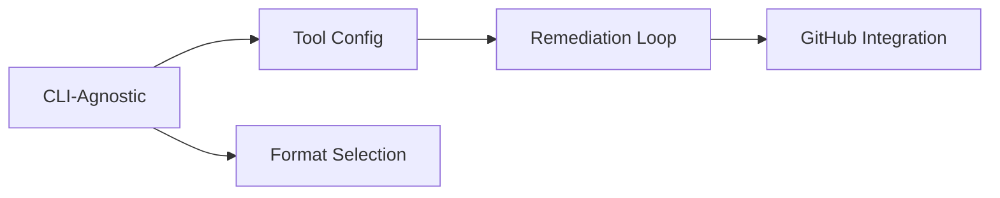

# CTO Platform Enhancements Overview

## Executive Summary

This document provides an overview of the ten mini-projects that comprise the CTO Platform Enhancements initiative. Each project is designed to be implemented within a focused timeframe while contributing to the platform's evolution into a comprehensive, vendor-agnostic AI development orchestration system.

## Project Structure

```
docs/
├── cli-agnostic-platform/
│   ├── prd.txt                 # Product Requirements Document
│   └── architecture.md          # Technical Architecture
├── agent-remediation-loop/
│   ├── prd.txt                 # Product Requirements Document
│   └── architecture.md          # Technical Architecture
├── agent-tool-configuration/
│   ├── prd.txt                 # Product Requirements Document
│   └── architecture.md          # Technical Architecture
├── format-selection-system/
│   ├── prd.txt                 # Product Requirements Document
│   └── architecture.md          # Technical Architecture
├── github-integration-enhancements/
│   ├── prd.txt                 # Product Requirements Document
│   └── architecture.md          # Technical Architecture
├── platform-packaging/
│   ├── prd.txt                 # Product Requirements Document
│   └── architecture.md          # Technical Architecture
├── telemetry-monitoring-enhancement/
│   ├── prd.txt                 # Product Requirements Document
│   └── architecture.md          # Technical Architecture
├── mcp-tool-selection-enhancement/
│   ├── prd.txt                 # Product Requirements Document
│   └── architecture.md          # Technical Architecture
├── landing-page-creation/
│   ├── prd.txt                 # Product Requirements Document
│   └── architecture.md          # Technical Architecture
└── parallel-task-execution/
    ├── prd.txt                 # Product Requirements Document
    └── architecture.md          # Technical Architecture
```

## Mini-Projects Overview

### 1. CLI-Agnostic Platform (High Priority)
**Timeline:** Days 1-7
**Status:** Documentation Complete

#### Objective
Transform the platform from Claude-specific to support multiple AI CLI tools (Claude, Cursor, Codex, Factory, OpenCode, Gemini).

#### Key Components
- Discovery Service for understanding each CLI's capabilities
- Configuration Bridge for translating between formats
- Command Adapters for CLI-specific operations
- Session Management across different CLI models

#### Critical Path
1. Discovery & Documentation (Days 1-3)
2. Standardization Design (Days 3-4)
3. Bridge Implementation (Days 5-6)
4. Integration & Testing (Day 7)

### 2. Agent Remediation Loop (High Priority)
**Timeline:** Days 1-5
**Status:** Documentation Complete

#### Objective
Create automated feedback loops where QA findings trigger implementation fixes without human intervention.

#### Key Components
- PR Comment Detection and parsing
- Issue Classification system
- Rex Auto-Restart mechanism
- Cleo/Tess Cancellation logic
- Recursive Remediation with safety limits

#### Critical Path
1. Event Infrastructure (Days 1-2)
2. Feedback Processing (Day 3)
3. Orchestration Logic (Day 4)
4. Testing & Safety (Day 5)

### 3. Agent Tool Configuration
**Timeline:** Days 1-4
**Status:** Documentation Complete

#### Objective
Transform from dynamic task-based tool generation to static agent-centric configuration, reducing token usage by 70%.

#### Key Components
- Static Tool Profiles per agent
- Role-Based Toolsets
- Tool Capability Database
- Version Management system

#### Critical Path
1. Tool Inventory (Day 1)
2. Profile Creation (Day 2)
3. Integration (Day 3)
4. Migration & Testing (Day 4)

### 4. Format Selection System
**Timeline:** Days 1-5
**Status:** Documentation Complete

#### Objective
Enable dynamic selection between XML and Markdown formats for task documentation with runtime configuration.

#### Key Components
- XML/Markdown Processors
- Format Router
- Bidirectional Conversion Service
- Schema Validation

#### Critical Path
1. XML Support (Days 1-2)
2. Selection Logic (Day 3)
3. Conversion Service (Day 4)
4. Testing & Metrics (Day 5)

### 5. GitHub Integration Enhancements
**Timeline:** Days 1-7
**Status:** Documentation Complete

#### Objective
Deep GitHub integration with PR feedback loops, Projects V2 sync, and automated GitHub App creation.

#### Key Components
- PR Comment Webhook Processor
- GitHub Projects V2 GraphQL Client
- App Manifest Generator
- Event Orchestrator

#### Critical Path
1. PR Comment Loop (Days 1-2)
2. Projects Integration (Days 3-4)
3. App Manifest System (Day 5)
4. Testing & Polish (Days 6-7)

### 6. Platform Packaging (Deferred)
**Timeline:** Days 8-15 (Post-MVP)
**Status:** Documentation Complete

#### Objective
Transform the platform into a generic, distributable product with automated installation, configuration abstraction, and multi-channel distribution support.

#### Key Components
- Interactive CLI Installer
- Template-Driven Configuration
- Multi-Profile Installation (Minimal, Standard, Production)
- Distribution Channels (Homebrew, Direct Download, Docker)
- Health Check System

#### Critical Path
1. CLI Framework (Days 8-10)
2. Template Engine (Days 10-12)
3. Distribution System (Days 12-14)
4. Documentation & Testing (Day 15)

### 7. Telemetry Monitoring Enhancement (Medium Priority)
**Timeline:** Days 1-8
**Status:** Documentation Complete

#### Objective
Validate and enhance existing telemetry infrastructure (Victoria Logs, Victoria Metrics, Fluent Bit, Grafana) with comprehensive dashboards, agent health monitoring, and Discord-based alerting.

#### Key Components
- Infrastructure validation and data flow verification
- Agent performance and platform health dashboards
- Health scoring algorithm with configurable thresholds
- Discord webhook integration with deduplication
- OpenTelemetry data correlation and visualization

#### Critical Path
1. Discovery & Validation (Days 1-2)
2. Dashboard Development (Days 3-4)
3. Alerting Implementation (Days 5-6)
4. Health Monitoring (Days 7-8)

### 8. MCP Tool Selection Enhancement (Medium Priority)
**Timeline:** Days 1-8
**Status:** Documentation Complete

#### Objective
Transform MCP tool selection from dynamic, task-based generation to static, Helm-defined configurations, eliminating expensive tool-man configuration copying and providing declarative tool management.

#### Key Components
- Static tool configurations defined in Helm charts
- ConfigMap-based tool storage for each agent
- Role-based tool profiles (Rex, Cleo, Tess)
- Tool registry with centralized definitions
- Simplified documentation generation without tool-man

#### Critical Path
1. Static Configuration (Days 1-2)
2. Helm Integration (Days 3-4)
3. Documentation Optimization (Days 5-6)
4. Testing and Validation (Days 7-8)

### 9. Landing Page Creation (Medium Priority)
**Timeline:** Days 1-12
**Status:** Documentation Complete

#### Objective
Create a professional landing page based on README content with modern web design, NGROK development exposure, and Cloudflare production deployment.

#### Key Components
- README content conversion to landing page format
- Modern responsive design with Next.js and Tailwind CSS
- Interactive elements and animations
- NGROK tunnel for development testing
- Cloudflare Pages deployment with custom domain
- SEO optimization and analytics integration

#### Critical Path
1. Content Analysis and Planning (Days 1-2)
2. Design and Development (Days 3-5)
3. NGROK Development Setup (Days 6-7)
4. Cloudflare Deployment (Days 8-9)
5. Testing and Optimization (Days 10-11)
6. Launch and Monitoring (Day 12)

### 10. Parallel Task Execution (High Priority)
**Timeline:** Days 1-12
**Status:** Documentation Complete

#### Objective
Implement parallel task execution capabilities by leveraging Taskmaster's dependency management features to identify and execute independent tasks concurrently.

#### Key Components
- Taskmaster dependency analysis and validation
- Dependency graph construction and parallel group identification
- Concurrent task execution engine with resource management
- Safety controls and conflict detection
- Performance monitoring and optimization

#### Critical Path
1. Taskmaster Analysis (Days 1-2)
2. Dependency Graph Implementation (Days 3-4)
3. Parallel Execution Engine (Days 5-7)
4. Workflow Integration (Days 8-9)
5. Performance Optimization (Days 10-11)
6. Testing and Validation (Day 12)

## Implementation Strategy

### Parallel Tracks
Given the one-week timeline, projects can be implemented in parallel tracks:

**Track A: Core Platform**
- CLI-Agnostic Platform (primary focus)
- Format Selection System (secondary)

**Track B: Automation**
- Agent Remediation Loop (primary focus)
- Agent Tool Configuration (secondary)

**Track C: Integration**
- GitHub Integration Enhancements

**Track D: Monitoring & Tools**
- Telemetry Monitoring Enhancement
- MCP Tool Selection Enhancement

**Track E: Marketing & Presentation**
- Landing Page Creation

**Track F: Performance Optimization**
- Parallel Task Execution

**Track G: Packaging (Post-MVP)**
- Platform Packaging (deferred until after core features)

### Dependencies


### Risk Mitigation
- **CLI Discovery Unknowns**: Start with discovery phase immediately
- **GitHub API Limits**: Implement caching and batching from day 1
- **Format Compatibility**: Default to Markdown, XML as enhancement
- **Remediation Loops**: Hard limits on recursion depth

## Success Criteria

### Week 1 Deliverables
1. ✅ Support for 3+ CLI tools (Claude + 2 others)
2. ✅ Working remediation loop with safety limits
3. ✅ Static tool configuration for all agents
4. ✅ XML format support with conversion
5. ✅ PR comment processing pipeline

### Week 1 Deliverables (Additional)
6. ✅ Telemetry infrastructure validation
7. ✅ Agent health monitoring dashboards
8. ✅ Discord alerting system
9. ✅ OpenTelemetry data correlation
10. ✅ Static MCP tool configurations
11. ✅ Helm-based tool management
12. ✅ ConfigMap tool storage
13. ✅ Simplified documentation generation

### Week 2 Deliverables (Additional)
14. ✅ Professional landing page
15. ✅ NGROK development exposure
16. ✅ Cloudflare production deployment
17. ✅ SEO optimization and analytics
18. ✅ Parallel task execution engine
19. ✅ Dependency graph analysis
20. ✅ Concurrent task scheduling
21. ✅ Performance optimization (40-60% speedup)

### Post-MVP Deliverables (Week 2-3)
10. ✅ Automated installation system
11. ✅ Multi-profile deployment support
12. ✅ Distribution packaging
13. ✅ Advanced health monitoring system

### Metrics
- CLI discovery completion: 100%
- Token usage reduction: 70%
- Remediation automation rate: 80%
- Format conversion fidelity: 99%
- PR feedback processing time: <5 minutes

## Resource Requirements

### Development Team
- 2 Platform Engineers (CLI & Infrastructure)
- 1 Integration Engineer (GitHub & Webhooks)
- 1 QA Engineer (Testing & Validation)

### Infrastructure
- Test Kubernetes cluster for CLI discovery
- GitHub test repositories
- GraphQL API access
- Webhook endpoints

## Next Steps

### Immediate Actions (Day 1)
1. Start CLI discovery containers for all tools
2. Set up GitHub webhook receivers
3. Create tool inventory database
4. Initialize format processors

### Quick Wins
- Claude to Cursor migration (similar architectures)
- Basic PR comment parsing
- Markdown/XML template creation
- Tool profile generation

### Long-term Vision
After successful implementation:
- Package distribution system
- Multi-cloud Kubernetes support
- Local development environments
- Enterprise security features

## Conclusion

These ten mini-projects represent a focused, achievable enhancement of the CTO platform within a two-week timeline for the core features, with packaging deferred to post-MVP. By prioritizing CLI agnosticism, automated remediation, comprehensive monitoring, optimized tool management, professional presentation, and performance optimization, we address the most critical needs while laying groundwork for future expansion.

The modular design ensures each project can deliver value independently while contributing to the platform's overall evolution into a comprehensive AI development orchestration system. The telemetry monitoring enhancement provides essential visibility into system health, the MCP tool selection enhancement eliminates complexity and improves performance, the landing page creation provides professional presentation and marketing capabilities, the parallel task execution provides significant performance improvements, while the packaging system will enable the platform to be distributed as a standalone product once the core functionality is stable.
