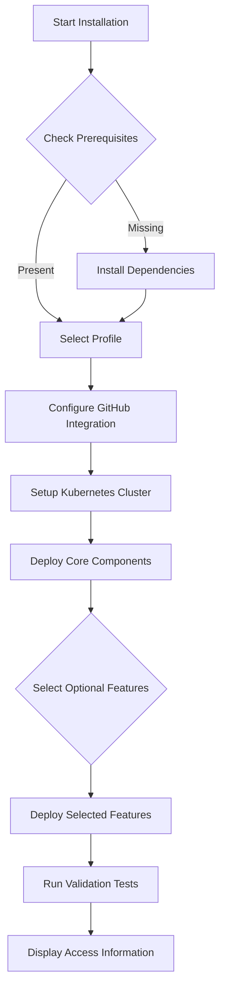

# Multi-Agent Platform Packaging Strategy

## Executive Summary

This document outlines the strategy for packaging the Multi-Agent Software Development Orchestration Platform as a distributable product for end users. The goal is to transform the current organization-specific deployment into a generic, easily installable solution that can run on any developer's workstation.

## Project Overview

The Multi-Agent Platform is an event-driven system that orchestrates automated software development workflows through specialized AI agents (Rex, Cleo, Tess) with production-grade quality assurance and human oversight. The platform currently runs on a Talos Kubernetes cluster with various 5D Labs-specific components that need to be abstracted or replaced.

## Packaging Architecture

### 1. Installation Modes

#### **Quick Start Mode (Local Development)**
- Single-node Kubernetes cluster (k3s/kind/minikube)
- Minimal resource requirements (16GB RAM, 8 CPU cores)
- SQLite instead of PostgreSQL for simplicity
- In-memory caching instead of Redis
- Local file storage instead of distributed PVCs

#### **Production Mode (Full Installation)**
- Multi-node Kubernetes cluster support
- Full database operators (PostgreSQL, Redis, QuestDB)
- Complete monitoring stack (Grafana, VictoriaMetrics)
- High availability configurations
- Enterprise security features

### 2. Component Categorization

#### **Core Components (Always Installed)**
```yaml
core:
  controller:
    - multi-agent-controller
    - agent-runtime-images
    - workspace-management
  
  orchestration:
    - argo-workflows
    - argo-events
    - workflow-templates
    
  integration:
    - github-app-manager
    - webhook-processor
    - mcp-servers
    
  storage:
    - local-path-provisioner
    - agent-workspaces
```

#### **Optional Components (User Selectable)**
```yaml
optional:
  databases:
    - postgresql-operator
    - redis-operator
    - questdb-operator
    - pgvector-extension
    
  monitoring:
    - grafana
    - victoria-metrics
    - victoria-logs
    - opentelemetry-collector
    
  security:
    - external-secrets-operator
    - network-policies
    - rbac-configurations
    
  development:
    - github-runners
    - rustdocs-server
    - context-server
```

### 3. Configuration Management

#### **Template Variables System**
```yaml
# config.yaml - User configuration file
platform:
  name: "my-agent-platform"
  domain: "agent.local"  # Or user's domain
  
github:
  organization: "${GITHUB_ORG}"
  repository: "${GITHUB_REPO}"
  
registry:
  type: "dockerhub"  # or "ghcr", "ecr", "gcr"
  namespace: "${REGISTRY_NAMESPACE}"
  
agents:
  rex:
    enabled: true
    github_app_id: "${REX_APP_ID}"  # Generated during setup
  cleo:
    enabled: true
    github_app_id: "${CLEO_APP_ID}"
  tess:
    enabled: true
    github_app_id: "${TESS_APP_ID}"
    
features:
  monitoring: false  # Enable in production
  mail_server: false  # Optional email notifications
  vpn_access: false  # No longer tied to Twingate
```

## Installation Wizard Design

### 1. CLI Tool Structure

```bash
agent-platform/
├── bin/
│   └── agent-platform      # Main CLI executable
├── lib/
│   ├── installer/          # Installation logic
│   ├── validators/         # System requirement checks
│   ├── templates/          # Kubernetes manifests templates
│   └── wizards/           # Interactive setup flows
└── config/
    ├── defaults.yaml      # Default configurations
    └── profiles/          # Pre-configured profiles
        ├── minimal.yaml
        ├── standard.yaml
        └── production.yaml
```

### 2. Installation Flow



### 3. Interactive Setup Process

```bash
$ agent-platform install

╔══════════════════════════════════════════════════════╗
║     Multi-Agent Development Platform Installer       ║
╚══════════════════════════════════════════════════════╝

[1/10] Checking system requirements...
  ✓ Docker installed (version 24.0.5)
  ✓ kubectl available (version 1.31.0)
  ✓ Sufficient resources (32GB RAM, 16 cores)
  
[2/10] Select installation profile:
  > [1] Minimal (Local development, 8GB RAM)
    [2] Standard (Team development, 16GB RAM)
    [3] Production (Full features, 32GB+ RAM)
    [4] Custom (Configure everything)

[3/10] GitHub Integration Setup:
  This platform requires GitHub Apps for agent authentication.
  
  Would you like to:
  > [1] Automatically create GitHub Apps (recommended)
    [2] Use existing GitHub Apps
    [3] Skip (manual configuration later)
    
  Enter your GitHub organization/username: myorg
  Enter repository for testing: myorg/test-repo
  
  Creating GitHub Apps...
  ✓ Rex Agent App created (ID: 1234567)
  ✓ Cleo Agent App created (ID: 1234568)
  ✓ Tess Agent App created (ID: 1234569)
  
[4/10] Container Registry Configuration:
  Where should agent images be stored?
  > [1] Docker Hub
    [2] GitHub Container Registry
    [3] Local Registry (offline mode)
    [4] Custom Registry URL
    
  Registry namespace: myorg
  
[5/10] Kubernetes Cluster Setup:
  No existing cluster detected. Create one?
  > [1] k3s (Recommended, lightweight)
    [2] kind (Docker-based, good for testing)
    [3] minikube (Traditional, more features)
    [4] Use existing cluster
    
  Installing k3s...
  ✓ k3s installed and configured
  ✓ Storage class configured
  ✓ Network policies enabled
  
[6/10] Installing Core Components:
  → Deploying ArgoCD...                    [████████████] 100%
  → Installing Argo Workflows...            [████████████] 100%
  → Setting up Argo Events...              [████████████] 100%
  → Deploying Multi-Agent Controller...     [████████████] 100%
  → Configuring MCP Servers...             [████████████] 100%
  
[7/10] Optional Features:
  Select additional features to install:
  [ ] PostgreSQL Database (production data storage)
  [ ] Redis Cache (performance optimization)
  [x] Monitoring Stack (recommended)
  [ ] Email Notifications
  [ ] Self-hosted GitHub Runners
  
  Installing selected features...
  ✓ Monitoring stack deployed
  
[8/10] Agent Configuration:
  Configuring AI agents with your settings...
  ✓ Rex (Implementation) configured
  ✓ Cleo (Code Quality) configured  
  ✓ Tess (QA Testing) configured
  
[9/10] Running Validation Tests:
  → Testing GitHub connectivity...         [✓]
  → Validating webhook delivery...         [✓]
  → Creating test workflow...              [✓]
  → Verifying agent activation...          [✓]
  → Checking event correlation...          [✓]
  
[10/10] Installation Complete!

╔══════════════════════════════════════════════════════╗
║                  Access Information                  ║
╠══════════════════════════════════════════════════════╣
║ ArgoCD Dashboard:  http://localhost:8080             ║
║ Username:          admin                             ║
║ Password:          <auto-generated>                  ║
║                                                       ║
║ Argo Workflows:    http://localhost:2746             ║
║ Grafana:          http://localhost:3000              ║
║                                                       ║
║ Configuration:     ~/.agent-platform/config.yaml     ║
║ Logs:             ~/.agent-platform/logs/            ║
╚══════════════════════════════════════════════════════╝

Quick Start:
  $ agent-platform create task "Implement user authentication"
  $ agent-platform status
  $ agent-platform logs rex

Need help? Run: agent-platform help
```

## Implementation Plan

### Phase 1: Core Abstraction (Week 1-2)

1. **Remove Hardcoded Values**
   - Replace all `5dlabs` references with template variables
   - Abstract GitHub App IDs and client IDs
   - Make container registry configurable
   - Remove domain-specific DNS entries

2. **Create Configuration Templates**
   - Convert Kubernetes manifests to Helm charts with values
   - Build Handlebars templates for agent configurations
   - Create environment-specific overlays

3. **Develop Configuration API**
   ```go
   type PlatformConfig struct {
       Platform  PlatformSettings
       GitHub    GitHubIntegration
       Registry  RegistryConfig
       Agents    map[string]AgentConfig
       Features  FeatureFlags
   }
   ```

### Phase 2: Installer Development (Week 3-4)

1. **CLI Framework**
   - Use Cobra/Bubble Tea for interactive CLI
   - Implement configuration wizard
   - Add progress indicators and logging

2. **Dependency Management**
   ```bash
   dependencies:
     - docker: ">=20.10"
     - kubectl: ">=1.28"
     - helm: ">=3.0"
     - git: ">=2.0"
   ```

3. **Cluster Provisioning**
   - k3s installer integration
   - kind cluster creation
   - minikube setup automation

### Phase 3: GitHub Automation (Week 5)

1. **GitHub App Creation API**
   ```go
   func CreateGitHubApps(org string, config Config) ([]GitHubApp, error) {
       // Automate GitHub App creation via API
       // Generate webhooks, permissions, keys
       // Store credentials securely
   }
   ```

2. **Webhook Configuration**
   - Automatic webhook URL generation
   - Event subscription setup
   - SSL/TLS certificate handling

### Phase 4: Validation & Testing (Week 6)

1. **Health Check System**
   ```yaml
   validations:
     - name: "GitHub Connectivity"
       command: "check-github-auth"
     - name: "Webhook Delivery"
       command: "test-webhook-flow"
     - name: "Agent Activation"
       command: "run-test-workflow"
   ```

2. **Diagnostic Tools**
   - Log aggregation and viewing
   - Troubleshooting wizard
   - System report generation

## Migration Strategy for Existing Components

### 1. Mail Server Replacement
- **Current**: Mailu (5D Labs specific)
- **Solution**: Optional email integration via:
  - SendGrid API (cloud)
  - SMTP relay configuration
  - Webhook notifications as alternative

### 2. VPN Access Alternative
- **Current**: Twingate (proprietary)
- **Solutions**:
  - kubectl port-forward for local access
  - Optional: WireGuard for secure remote access
  - Optional: Cloudflare Tunnel (free tier)
  - NodePort services for development

### 3. Taskmaster Integration
- **Current**: Proprietary task management
- **Options**:
  - Keep as optional paid integration
  - Develop open-source alternative
  - Use GitHub Projects as task backend
  - Integrate with JIRA/Linear/Notion APIs

### 4. NGrok Replacement
- **Current**: NGrok for tunnel access
- **Alternatives**:
  - LocalTunnel (open source)
  - Cloudflare Tunnel (free tier)
  - Bore (lightweight alternative)
  - Optional: Keep NGrok as paid option

## Resource Requirements

### Minimal Installation
```yaml
resources:
  cpu: 4 cores
  memory: 8GB RAM
  disk: 20GB
  network: Basic internet connection
```

### Standard Installation
```yaml
resources:
  cpu: 8 cores
  memory: 16GB RAM
  disk: 50GB
  network: Stable broadband
```

### Production Installation
```yaml
resources:
  cpu: 16+ cores
  memory: 32GB+ RAM
  disk: 100GB+ SSD
  network: High-speed connection
```

## Distribution Strategy

### 1. Release Artifacts
```
releases/
├── agent-platform-darwin-arm64.tar.gz
├── agent-platform-darwin-amd64.tar.gz
├── agent-platform-linux-amd64.tar.gz
├── agent-platform-linux-arm64.tar.gz
└── agent-platform-windows-amd64.exe
```

### 2. Installation Methods

#### **Homebrew (macOS/Linux)**
```bash
brew tap agent-platform/tap
brew install agent-platform
```

#### **Direct Download**
```bash
curl -L https://get.agent-platform.io | bash
```

#### **Docker Compose**
```yaml
version: '3.8'
services:
  platform:
    image: agent-platform/installer:latest
    volumes:
      - /var/run/docker.sock:/var/run/docker.sock
      - ./config:/config
```

## Configuration Profiles

### 1. Minimal Profile
```yaml
profile: minimal
components:
  - controller
  - argo-workflows
  - argo-events
  - single-agent (rex only)
features:
  monitoring: false
  databases: sqlite
  cache: in-memory
```

### 2. Standard Profile
```yaml
profile: standard
components:
  - controller
  - argo-workflows
  - argo-events
  - all-agents
  - postgresql
  - redis
features:
  monitoring: true
  databases: managed
  cache: redis
```

### 3. Production Profile
```yaml
profile: production
components:
  - all
features:
  monitoring: true
  databases: clustered
  cache: redis-cluster
  security: enhanced
  backup: enabled
```

## Post-Installation Operations

### 1. Quick Start Commands
```bash
# Create a new task
agent-platform task create "Build REST API"

# View workflow status
agent-platform status

# Access logs
agent-platform logs --agent rex --follow

# Update configuration
agent-platform config set agents.rex.timeout 3600

# Upgrade platform
agent-platform upgrade
```

### 2. Management UI Options
- Native: ArgoCD UI for GitOps management
- Optional: Custom web dashboard
- CLI: Comprehensive command-line interface
- API: REST/GraphQL for integrations

## Security Considerations

1. **Secrets Management**
   - Local secrets stored in system keychain
   - Kubernetes secrets with encryption at rest
   - Optional: HashiCorp Vault integration

2. **Network Security**
   - Default: NodePort with local access only
   - Optional: Ingress with TLS termination
   - VPN options for remote access

3. **RBAC Configuration**
   - Minimal permissions by default
   - Namespace isolation
   - Agent-specific service accounts

## Testing Strategy

### 1. Installation Testing
- Test on fresh VMs for each OS
- Validate all installation paths
- Test upgrade scenarios
- Verify rollback procedures

### 2. Integration Testing
- GitHub webhook flow validation
- Multi-agent workflow execution
- Resource cleanup verification
- Error handling scenarios

## Documentation Requirements

1. **Installation Guide** - Step-by-step setup
2. **Configuration Reference** - All options explained
3. **Troubleshooting Guide** - Common issues and solutions
4. **API Documentation** - For custom integrations
5. **Architecture Overview** - For advanced users
6. **Migration Guide** - From organization-specific to generic

## Success Criteria

- **5-minute installation** for minimal profile
- **Zero manual configuration** for basic setup
- **Single command** cluster + platform deployment
- **Automatic GitHub App** creation and configuration
- **Built-in validation** ensuring working system
- **Clear upgrade path** from minimal to production

## Next Steps

1. Create proof-of-concept installer for minimal profile
2. Abstract all 5D Labs-specific configurations
3. Develop GitHub App automation
4. Build interactive CLI wizard
5. Test on clean environments
6. Create comprehensive documentation
7. Beta test with external users
8. Package for distribution channels