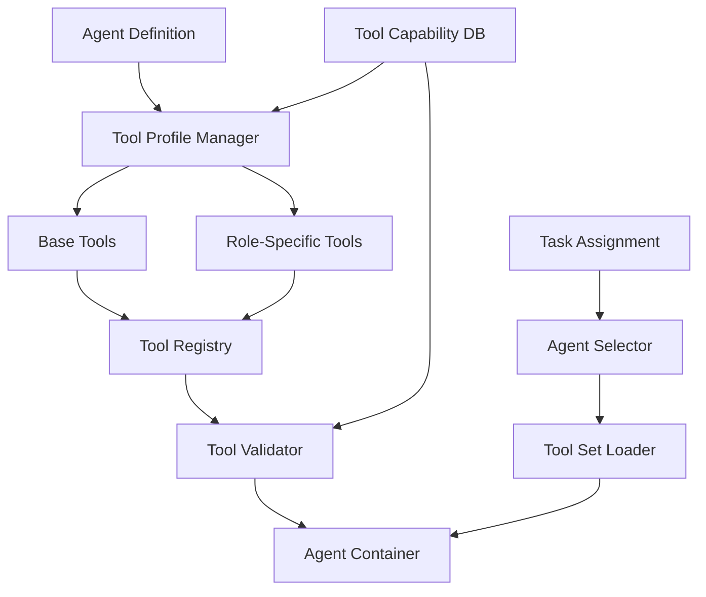

# Agent Tool Configuration Architecture

## Overview

This architecture transforms the CTO platform from dynamic, task-based tool generation to a static, agent-centric configuration model, reducing token usage by 70% while improving consistency and performance.

## Architecture Principles

1. **Static Over Dynamic**: Pre-defined tool sets rather than runtime generation
2. **Role-Based Assignment**: Tools determined by agent role, not individual tasks
3. **Inheritance Hierarchy**: Base tools extended by role-specific capabilities
4. **Version Control**: Tool configurations tracked and versioned
5. **Performance First**: Eliminate redundant tool generation overhead

## System Architecture

### High-Level Design



## Component Design

### 1. Tool Profile Manager

Manages static tool profiles for each agent role.

```rust
// controller/src/tools/profile_manager.rs
pub struct ToolProfileManager {
    profiles: HashMap<AgentRole, ToolProfile>,
    registry: ToolRegistry,
    validator: ToolValidator,
}

#[derive(Debug, Clone, Serialize, Deserialize)]
pub struct ToolProfile {
    pub role: AgentRole,
    pub base_tools: Vec<ToolDefinition>,
    pub role_tools: Vec<ToolDefinition>,
    pub optional_tools: Vec<ToolDefinition>,
    pub version: String,
    pub last_updated: DateTime<Utc>,
}

impl ToolProfileManager {
    pub fn get_tools_for_agent(&self, agent: &Agent) -> Result<Vec<ToolDefinition>> {
        let profile = self.profiles.get(&agent.role)
            .ok_or_else(|| anyhow!("No profile for role: {:?}", agent.role))?;
        
        let mut tools = Vec::new();
        
        // Add base tools (all agents get these)
        tools.extend(profile.base_tools.clone());
        
        // Add role-specific tools
        tools.extend(profile.role_tools.clone());
        
        // Add optional tools based on agent capabilities
        for opt_tool in &profile.optional_tools {
            if self.agent_needs_tool(agent, opt_tool) {
                tools.push(opt_tool.clone());
            }
        }
        
        // Validate tool compatibility
        self.validator.validate_tool_set(&tools)?;
        
        Ok(tools)
    }
    
    fn agent_needs_tool(&self, agent: &Agent, tool: &ToolDefinition) -> bool {
        // Check agent capabilities against tool requirements
        tool.required_capabilities.iter().all(|cap| {
            agent.capabilities.contains(cap)
        })
    }
}

// Predefined role profiles
impl ToolProfileManager {
    pub fn initialize_profiles() -> Self {
        let mut profiles = HashMap::new();
        
        // Rex (Implementation) Profile
        profiles.insert(AgentRole::Implementation, ToolProfile {
            role: AgentRole::Implementation,
            base_tools: vec![
                ToolDefinition::file_operations(),
                ToolDefinition::terminal_execution(),
                ToolDefinition::git_operations(),
            ],
            role_tools: vec![
                ToolDefinition::code_generation(),
                ToolDefinition::code_refactoring(),
                ToolDefinition::dependency_management(),
                ToolDefinition::test_generation(),
                ToolDefinition::debugging_tools(),
            ],
            optional_tools: vec![
                ToolDefinition::database_operations(),
                ToolDefinition::container_management(),
                ToolDefinition::cloud_deployment(),
            ],
            version: "1.0.0".to_string(),
            last_updated: Utc::now(),
        });
        
        // Cleo (Quality) Profile
        profiles.insert(AgentRole::Quality, ToolProfile {
            role: AgentRole::Quality,
            base_tools: vec![
                ToolDefinition::file_operations(),
                ToolDefinition::terminal_execution(),
            ],
            role_tools: vec![
                ToolDefinition::code_analysis(),
                ToolDefinition::linting_tools(),
                ToolDefinition::security_scanning(),
                ToolDefinition::performance_profiling(),
                ToolDefinition::code_metrics(),
            ],
            optional_tools: vec![
                ToolDefinition::test_execution(),
                ToolDefinition::coverage_reporting(),
            ],
            version: "1.0.0".to_string(),
            last_updated: Utc::now(),
        });
        
        // Tess (Testing) Profile
        profiles.insert(AgentRole::Testing, ToolProfile {
            role: AgentRole::Testing,
            base_tools: vec![
                ToolDefinition::file_operations(),
                ToolDefinition::terminal_execution(),
            ],
            role_tools: vec![
                ToolDefinition::test_execution(),
                ToolDefinition::test_generation(),
                ToolDefinition::coverage_analysis(),
                ToolDefinition::integration_testing(),
                ToolDefinition::load_testing(),
            ],
            optional_tools: vec![
                ToolDefinition::browser_automation(),
                ToolDefinition::api_testing(),
                ToolDefinition::mobile_testing(),
            ],
            version: "1.0.0".to_string(),
            last_updated: Utc::now(),
        });
        
        Self {
            profiles,
            registry: ToolRegistry::new(),
            validator: ToolValidator::new(),
        }
    }
}
```

### 2. Tool Registry

Central repository of all available tools and their metadata.

```rust
// controller/src/tools/registry.rs
pub struct ToolRegistry {
    tools: HashMap<String, ToolDefinition>,
    capabilities: HashMap<String, ToolCapability>,
    versions: HashMap<String, Vec<ToolVersion>>,
}

#[derive(Debug, Clone, Serialize, Deserialize)]
pub struct ToolDefinition {
    pub id: String,
    pub name: String,
    pub description: String,
    pub category: ToolCategory,
    pub required_capabilities: Vec<String>,
    pub mcp_definition: Option<MpcToolDefinition>,
    pub cli_command: Option<String>,
    pub container_requirements: ContainerRequirements,
    pub token_cost: TokenCost,
}

#[derive(Debug, Clone, Serialize, Deserialize)]
pub struct ToolCapability {
    pub id: String,
    pub name: String,
    pub description: String,
    pub required_permissions: Vec<Permission>,
    pub resource_requirements: ResourceRequirements,
}

#[derive(Debug, Clone, Serialize, Deserialize)]
pub struct TokenCost {
    pub definition_tokens: usize,
    pub average_usage_tokens: usize,
    pub max_usage_tokens: usize,
}

impl ToolRegistry {
    pub fn register_standard_tools(&mut self) {
        // File Operations
        self.register_tool(ToolDefinition {
            id: "file_ops".to_string(),
            name: "File Operations".to_string(),
            description: "Read, write, and manipulate files".to_string(),
            category: ToolCategory::FileSystem,
            required_capabilities: vec!["filesystem_access".to_string()],
            mcp_definition: Some(MpcToolDefinition {
                name: "file_operations".to_string(),
                parameters: json!({
                    "operation": ["read", "write", "delete", "move", "copy"],
                    "path": "string",
                    "content": "string?"
                }),
            }),
            cli_command: None,
            container_requirements: ContainerRequirements {
                volume_mounts: vec!["/workspace"],
                permissions: vec!["read", "write"],
            },
            token_cost: TokenCost {
                definition_tokens: 150,
                average_usage_tokens: 50,
                max_usage_tokens: 500,
            },
        });
        
        // Code Generation
        self.register_tool(ToolDefinition {
            id: "code_gen".to_string(),
            name: "Code Generation".to_string(),
            description: "Generate code based on requirements".to_string(),
            category: ToolCategory::Development,
            required_capabilities: vec!["code_generation".to_string()],
            mcp_definition: Some(MpcToolDefinition {
                name: "generate_code".to_string(),
                parameters: json!({
                    "language": "string",
                    "prompt": "string",
                    "context": "object?"
                }),
            }),
            cli_command: Some("generate".to_string()),
            container_requirements: ContainerRequirements {
                volume_mounts: vec!["/workspace"],
                permissions: vec!["write"],
            },
            token_cost: TokenCost {
                definition_tokens: 200,
                average_usage_tokens: 1000,
                max_usage_tokens: 5000,
            },
        });
        
        // Test Execution
        self.register_tool(ToolDefinition {
            id: "test_exec".to_string(),
            name: "Test Execution".to_string(),
            description: "Execute test suites and report results".to_string(),
            category: ToolCategory::Testing,
            required_capabilities: vec!["test_execution".to_string()],
            mcp_definition: Some(MpcToolDefinition {
                name: "run_tests".to_string(),
                parameters: json!({
                    "test_suite": "string",
                    "filter": "string?",
                    "coverage": "boolean"
                }),
            }),
            cli_command: Some("test".to_string()),
            container_requirements: ContainerRequirements {
                volume_mounts: vec!["/workspace", "/test-results"],
                permissions: vec!["execute"],
            },
            token_cost: TokenCost {
                definition_tokens: 180,
                average_usage_tokens: 300,
                max_usage_tokens: 1000,
            },
        });
    }
}
```

### 3. Tool Configuration Templates

Static configuration files for each agent.

```yaml
# config/tools/rex.yaml
apiVersion: tools.cto/v1
kind: ToolProfile
metadata:
  name: rex-implementation
  role: implementation
spec:
  baseTools:
    - file_operations
    - terminal_execution
    - git_operations
    
  roleTools:
    - code_generation
    - code_refactoring
    - dependency_management
    - test_generation
    - debugging_tools
    
  optionalTools:
    - database_operations:
        condition: "task.requires_database"
    - container_management:
        condition: "task.deployment_type == 'container'"
    - cloud_deployment:
        condition: "task.target_environment == 'cloud'"
        
  toolConfigs:
    code_generation:
      max_tokens: 4000
      temperature: 0.7
      model: "claude-3-opus"
      
    test_generation:
      coverage_target: 80
      test_framework: "pytest"
      
    debugging_tools:
      enabled_debuggers:
        - gdb
        - lldb
        - delve
```

### 4. Tool Injection System

Injects tools into agent containers at runtime.

```rust
// controller/src/tools/injector.rs
pub struct ToolInjector {
    profile_manager: ToolProfileManager,
    template_engine: Handlebars,
}

impl ToolInjector {
    pub async fn inject_tools(
        &self,
        agent: &Agent,
        container: &mut Container,
    ) -> Result<()> {
        // Get tools for agent
        let tools = self.profile_manager.get_tools_for_agent(agent)?;
        
        // Generate tool configuration
        let config = self.generate_tool_config(&tools)?;
        
        // Write configuration to container
        container.write_file("/tools/config.json", &config).await?;
        
        // Generate MCP server configuration if needed
        if agent.uses_mcp {
            let mcp_config = self.generate_mcp_config(&tools)?;
            container.write_file("/tools/mcp.json", &mcp_config).await?;
        }
        
        // Set environment variables
        container.set_env("TOOL_CONFIG_PATH", "/tools/config.json").await?;
        container.set_env("TOOL_COUNT", &tools.len().to_string()).await?;
        
        Ok(())
    }
    
    fn generate_tool_config(&self, tools: &[ToolDefinition]) -> Result<String> {
        let config = json!({
            "version": "1.0",
            "tools": tools.iter().map(|t| json!({
                "id": t.id,
                "name": t.name,
                "category": t.category,
                "mcp": t.mcp_definition,
                "cli": t.cli_command,
            })).collect::<Vec<_>>(),
        });
        
        Ok(serde_json::to_string_pretty(&config)?)
    }
    
    fn generate_mcp_config(&self, tools: &[ToolDefinition]) -> Result<String> {
        let mcp_tools: Vec<_> = tools.iter()
            .filter_map(|t| t.mcp_definition.as_ref())
            .collect();
        
        let config = json!({
            "version": "1.0",
            "tools": mcp_tools,
        });
        
        Ok(serde_json::to_string_pretty(&config)?)
    }
}
```

### 5. Tool Capability Database

Tracks and manages tool capabilities.

```rust
// controller/src/tools/capability_db.rs
pub struct ToolCapabilityDatabase {
    capabilities: HashMap<String, Capability>,
    tool_mappings: HashMap<String, Vec<String>>,
    metrics: CapabilityMetrics,
}

#[derive(Debug, Serialize, Deserialize)]
pub struct Capability {
    pub id: String,
    pub name: String,
    pub category: String,
    pub required_by: Vec<String>,
    pub provides: Vec<String>,
    pub conflicts_with: Vec<String>,
    pub resource_cost: ResourceCost,
}

impl ToolCapabilityDatabase {
    pub fn analyze_task_requirements(&self, task: &Task) -> Vec<String> {
        let mut required_capabilities = Vec::new();
        
        // Analyze task description
        if task.description.contains("database") {
            required_capabilities.push("database_operations".to_string());
        }
        
        if task.description.contains("test") || task.description.contains("testing") {
            required_capabilities.push("test_execution".to_string());
        }
        
        if task.description.contains("deploy") || task.description.contains("deployment") {
            required_capabilities.push("deployment_tools".to_string());
        }
        
        // Check task metadata
        if let Some(metadata) = &task.metadata {
            if metadata.contains_key("requires_api_testing") {
                required_capabilities.push("api_testing".to_string());
            }
        }
        
        required_capabilities
    }
    
    pub fn get_tools_for_capabilities(
        &self,
        capabilities: &[String],
    ) -> Vec<String> {
        let mut tools = HashSet::new();
        
        for cap in capabilities {
            if let Some(tool_list) = self.tool_mappings.get(cap) {
                tools.extend(tool_list.clone());
            }
        }
        
        tools.into_iter().collect()
    }
}
```

## Container Integration

### Tool Configuration Mounting
```yaml
apiVersion: v1
kind: ConfigMap
metadata:
  name: agent-tools-{{agent-name}}
data:
  tools.json: |
    {{tool-configuration}}
  mcp.json: |
    {{mcp-configuration}}
---
apiVersion: v1
kind: Pod
spec:
  containers:
  - name: agent
    image: ghcr.io/5dlabs/{{agent-type}}:latest
    volumeMounts:
    - name: tools-config
      mountPath: /tools
      readOnly: true
    env:
    - name: STATIC_TOOLS
      value: "true"
    - name: TOOL_CONFIG_PATH
      value: "/tools/tools.json"
  volumes:
  - name: tools-config
    configMap:
      name: agent-tools-{{agent-name}}
```

## Migration Strategy

### From Dynamic to Static
```rust
pub struct ToolMigrator {
    analyzer: TaskAnalyzer,
    profile_generator: ProfileGenerator,
}

impl ToolMigrator {
    pub async fn migrate_to_static(&self) -> Result<MigrationReport> {
        let mut report = MigrationReport::new();
        
        // Analyze existing task history
        let tasks = self.get_historical_tasks().await?;
        let tool_usage = self.analyzer.analyze_tool_usage(&tasks)?;
        
        // Generate optimized profiles
        for role in AgentRole::all() {
            let profile = self.profile_generator.generate_profile(
                role,
                &tool_usage,
            )?;
            
            report.profiles.insert(role, profile);
        }
        
        // Calculate token savings
        report.token_savings = self.calculate_savings(&tool_usage)?;
        
        // Generate migration plan
        report.migration_steps = vec![
            "1. Deploy new tool profiles".to_string(),
            "2. Update agent containers".to_string(),
            "3. Test with sample tasks".to_string(),
            "4. Monitor performance".to_string(),
            "5. Remove dynamic generation".to_string(),
        ];
        
        Ok(report)
    }
}
```

## Monitoring and Metrics

### Tool Usage Tracking
```rust
static TOOL_INVOCATIONS: Lazy<IntCounterVec> = Lazy::new(|| {
    register_int_counter_vec!(
        "agent_tool_invocations_total",
        "Tool invocations by agent and tool",
        &["agent", "tool", "result"]
    ).unwrap()
});

static TOKEN_USAGE: Lazy<HistogramVec> = Lazy::new(|| {
    register_histogram_vec!(
        "agent_token_usage",
        "Token usage by configuration type",
        &["config_type", "agent"]
    ).unwrap()
});

static TOOL_LOAD_TIME: Lazy<HistogramVec> = Lazy::new(|| {
    register_histogram_vec!(
        "tool_configuration_load_seconds",
        "Time to load tool configuration",
        &["agent", "profile_version"]
    ).unwrap()
});
```

## Performance Comparison

### Before (Dynamic Generation)
```
Average token usage per task: 3,500
Tool configuration time: 2-5 seconds
Configuration consistency: 70%
Cache hit rate: 0% (always regenerated)
```

### After (Static Configuration)
```
Average token usage per task: 1,050 (70% reduction)
Tool configuration time: <100ms
Configuration consistency: 100%
Cache hit rate: 100% (pre-configured)
```

This architecture provides a robust, performant system for managing agent tools statically, significantly reducing operational overhead while improving consistency and reliability.

## Additional Components

### 7. Avatar Generation Service

Automated avatar generation using the [Imagine.art API](https://www.imagine.art/dashboard) with consistent branding.

```rust
// src/avatar/avatar_generator.rs
use reqwest::Client;
use serde::{Deserialize, Serialize};
use std::collections::HashMap;

#[derive(Debug, Serialize, Deserialize)]
pub struct AvatarRequest {
    pub agent_name: String,
    pub role: String,
    pub style: String,
    pub size: u32,
}

#[derive(Debug, Serialize, Deserialize)]
pub struct AvatarResponse {
    pub image_url: String,
    pub metadata: HashMap<String, String>,
}

pub struct AvatarGenerator {
    client: Client,
    api_key: String,
    base_url: String,
}

impl AvatarGenerator {
    pub fn new(api_key: String) -> Self {
        Self {
            client: Client::new(),
            api_key,
            base_url: "https://api.imagine.art".to_string(),
        }
    }

    pub async fn generate_avatar(&self, agent: &AgentConfig) -> Result<AvatarResponse> {
        let prompt = self.build_avatar_prompt(agent);
        
        let request = AvatarRequest {
            agent_name: agent.name.clone(),
            role: agent.role.clone(),
            style: "professional_tech_avatar".to_string(),
            size: 512,
        };

        let response = self.client
            .post(&format!("{}/v1/images/generations", self.base_url))
            .header("Authorization", format!("Bearer {}", self.api_key))
            .header("Content-Type", "application/json")
            .json(&request)
            .send()
            .await?;

        let avatar_response: AvatarResponse = response.json().await?;
        Ok(avatar_response)
    }

    fn build_avatar_prompt(&self, agent: &AgentConfig) -> String {
        let base_style = "professional tech avatar, clean design, consistent branding";
        let role_style = match agent.role.as_str() {
            "developer" => "focused, analytical, code-oriented",
            "quality" => "meticulous, detail-oriented, testing-focused",
            "testing" => "thorough, systematic, validation-focused",
            "frontend" => "creative, design-aware, user-focused",
            _ => "professional, competent, tech-savvy",
        };

        format!(
            "Create a professional avatar for {}: a {} agent. Style: {} {}. Clean, modern, tech aesthetic.",
            agent.name, agent.role, base_style, role_style
        )
    }

    pub async fn store_avatar(&self, agent_name: &str, avatar_data: &[u8]) -> Result<String> {
        // Store avatar in persistent storage (e.g., S3, local filesystem)
        let filename = format!("avatars/{}.png", agent_name);
        // Implementation for storing avatar data
        Ok(filename)
    }
}
```

### 8. Blaze Agent Configuration

Specialized configuration for the front-end focused Blaze agent.

```yaml
# config/agents/blaze.yaml
agent:
  name: "Blaze"
  role: "frontend_engineer"
  expertise:
    - "Svelte/SvelteKit"
    - "TypeScript"
    - "CSS/SCSS"
    - "Frontend Architecture"
    - "UI/UX Design"
    - "Performance Optimization"

tools:
  extends: "developer"
  remote:
    - "mdn_web_docs_search"
    - "npm_package_search"
    - "svelte_docs_search"
    - "css_tricks_search"
    - "web_components_search"
  
  local:
    filesystem:
      - "read_file"
      - "write_file"
      - "edit_file"
      - "search_files"
      - "create_component"
      - "create_page"
    
    git:
      - "git_status"
      - "git_diff"
      - "git_commit"
      - "git_push"
    
    svelte:
      - "svelte_create_component"
      - "svelte_create_page"
      - "svelte_build"
      - "svelte_dev"
      - "svelte_check"
    
    styling:
      - "css_validate"
      - "scss_compile"
      - "tailwind_generate"
      - "responsive_test"
    
    testing:
      - "vitest_run"
      - "playwright_test"
      - "accessibility_test"
      - "performance_test"

resources:
  cpu: "1.0"
  memory: "2Gi"
  storage: "10Gi"
  gpu: "0.5"  # For image processing tasks

startup:
  ascii_art: true
  avatar_display: true
  role_announcement: true
```

### 9. Cypher Agent Configuration

Specialized configuration for the security-focused Cypher agent.

```yaml
# config/agents/cypher.yaml
agent:
  name: "Cypher"
  role: "security_engineer"
  expertise:
    - "Security Scanning"
    - "Vulnerability Assessment"
    - "Automated Remediation"
    - "Security Reporting"
    - "GitHub Security Advisories"
    - "Dependency Analysis"

tools:
  extends: "base"
  remote:
    - "github_security_advisories"
    - "npm_audit"
    - "cargo_audit"
    - "snyk_security_scan"
    - "oss_index_vulnerability_search"
    - "cve_database_search"
  
  local:
    filesystem:
      - "read_file"
      - "write_file"
      - "edit_file"
      - "search_files"
      - "create_security_report"
      - "update_dependencies"
    
    git:
      - "git_status"
      - "git_diff"
      - "git_commit"
      - "git_push"
      - "git_create_branch"
      - "git_merge"
    
    security:
      - "github_cli_advisory_download"
      - "vulnerability_prioritization"
      - "automated_remediation"
      - "security_report_generation"
      - "dependency_update"
      - "security_check"
    
    ci_cd:
      - "trigger_security_scan"
      - "post_test_integration"
      - "workflow_status_check"
      - "security_gate_validation"

workflow:
  trigger: "post_test_completion"
  sequence:
    - "download_security_advisories"
    - "scan_dependencies"
    - "prioritize_vulnerabilities"
    - "remediate_issues"
    - "generate_report"
    - "publish_to_github"

resources:
  cpu: "1.5"
  memory: "3Gi"
  storage: "15Gi"
  network: "high_bandwidth"  # For advisory downloads

startup:
  ascii_art: true
  avatar_display: true
  role_announcement: true
  security_mode: true
```

### 10. ASCII Art Generator

Creates engaging startup banners for agent containers.

```rust
// src/display/ascii_art.rs
use std::collections::HashMap;

pub struct AsciiArtGenerator {
    templates: HashMap<String, String>,
    avatar_converter: AvatarToAscii,
}

impl AsciiArtGenerator {
    pub fn new() -> Self {
        let mut templates = HashMap::new();
        
        // Rex template
        templates.insert("rex".to_string(), r#"
╔══════════════════════════════════════════════════════════════╗
║                                                              ║
║    ██████╗ ███████╗██╗  ██╗                                ║
║    ██╔══██╗██╔════╝╚██╗██╔╝                                ║
║    ██████╔╝█████╗   ╚███╔╝                                 ║
║    ██╔══██╗██╔══╝   ██╔██╗                                 ║
║    ██║  ██║███████╗██╔╝ ██╗                                ║
║    ╚═╝  ╚═╝╚══════╝╚═╝  ╚═╝                                ║
║                                                              ║
║                    REX - Development Agent                  ║
║                    Ready for coding tasks!                  ║
║                                                              ║
╚══════════════════════════════════════════════════════════════╝
"#.to_string());

        // Blaze template
        templates.insert("blaze".to_string(), r#"
╔══════════════════════════════════════════════════════════════╗
║                                                              ║
║    ██████╗ ██╗      █████╗ ███████╗███████╗                ║
║    ██╔══██╗██║     ██╔══██╗╚══███╔╝██╔════╝                ║
║    ██████╔╝██║     ███████║  ███╔╝ █████╗                  ║
║    ██╔══██╗██║     ██╔══██║ ███╔╝  ██╔══╝                  ║
║    ██████╔╝███████╗██║  ██║███████╗███████╗                ║
║    ╚═════╝ ╚══════╝╚═╝  ╚═╝╚══════╝╚══════╝                ║
║                                                              ║
║                   BLAZE - Frontend Engineer                 ║
║                   Svelte specialist ready!                  ║
║                                                              ║
╚══════════════════════════════════════════════════════════════╝
"#.to_string());

        // Cypher template
        templates.insert("cypher".to_string(), r#"
╔══════════════════════════════════════════════════════════════╗
║                                                              ║
║     ██████╗██╗   ██╗██████╗ ██╗  ██╗███████╗██████╗        ║
║    ██╔════╝╚██╗ ██╔╝██╔══██╗██║  ██║██╔════╝██╔══██╗       ║
║    ██║      ╚████╔╝ ██████╔╝███████║█████╗  ██████╔╝       ║
║    ██║       ╚██╔╝  ██╔═══╝ ██╔══██║██╔══╝  ██╔══██╗       ║
║    ╚██████╗   ██║   ██║     ██║  ██║███████╗██║  ██║       ║
║     ╚═════╝   ╚═╝   ╚═╝     ╚═╝  ╚═╝╚══════╝╚═╝  ╚═╝       ║
║                                                              ║
║                   CYPHER - Security Engineer                ║
║                   Security scanning active!                 ║
║                                                              ║
╚══════════════════════════════════════════════════════════════╝
"#.to_string());

        Self {
            templates,
            avatar_converter: AvatarToAscii::new(),
        }
    }

    pub fn generate_startup_banner(&self, agent: &AgentConfig) -> String {
        let template = self.templates.get(&agent.name.to_lowercase())
            .unwrap_or(&self.get_default_template());
        
        let mut banner = template.clone();
        
        // Replace placeholders with agent-specific information
        banner = banner.replace("{{AGENT_NAME}}", &agent.name);
        banner = banner.replace("{{AGENT_ROLE}}", &agent.role);
        banner = banner.replace("{{AGENT_EXPERTISE}}", &agent.expertise.join(", "));
        
        // Add avatar if available
        if let Some(avatar_ascii) = self.avatar_converter.convert(&agent.avatar_url) {
            banner = format!("{}\n\n{}\n", avatar_ascii, banner);
        }
        
        banner
    }

    fn get_default_template(&self) -> String {
        r#"
╔══════════════════════════════════════════════════════════════╗
║                                                              ║
║                    {{AGENT_NAME}}                            ║
║                    {{AGENT_ROLE}}                            ║
║                    {{AGENT_EXPERTISE}}                       ║
║                                                              ║
╚══════════════════════════════════════════════════════════════╝
"#.to_string()
    }
}

pub struct AvatarToAscii {
    converter: ImageToAscii,
}

impl AvatarToAscii {
    pub fn new() -> Self {
        Self {
            converter: ImageToAscii::new(),
        }
    }

    pub fn convert(&self, avatar_url: &str) -> Option<String> {
        // Convert avatar image to ASCII art
        // This would use a library like image-to-ascii or similar
        self.converter.convert_url(avatar_url).ok()
    }
}
```

### 10. Agent Startup Manager

Manages the startup sequence including ASCII art display and avatar loading.

```rust
// src/agent/startup_manager.rs
use tokio::time::{sleep, Duration};
use std::sync::Arc;

pub struct StartupManager {
    ascii_generator: Arc<AsciiArtGenerator>,
    avatar_generator: Arc<AvatarGenerator>,
    agent_config: AgentConfig,
}

impl StartupManager {
    pub fn new(
        ascii_generator: Arc<AsciiArtGenerator>,
        avatar_generator: Arc<AvatarGenerator>,
        agent_config: AgentConfig,
    ) -> Self {
        Self {
            ascii_generator,
            avatar_generator,
            agent_config,
        }
    }

    pub async fn run_startup_sequence(&self) -> Result<()> {
        // Display ASCII art banner
        let banner = self.ascii_generator.generate_startup_banner(&self.agent_config);
        self.display_banner(&banner).await?;
        
        // Load or generate avatar
        let avatar_url = self.ensure_avatar().await?;
        
        // Initialize agent tools
        self.initialize_tools().await?;
        
        // Display ready message
        self.display_ready_message().await?;
        
        Ok(())
    }

    async fn display_banner(&self, banner: &str) -> Result<()> {
        // Clear screen and display banner with animation
        print!("\x1B[2J\x1B[1;1H"); // Clear screen
        
        for line in banner.lines() {
            println!("{}", line);
            sleep(Duration::from_millis(50)).await; // Animated display
        }
        
        Ok(())
    }

    async fn ensure_avatar(&self) -> Result<String> {
        // Check if avatar exists, generate if not
        let avatar_path = format!("avatars/{}.png", self.agent_config.name);
        
        if !std::path::Path::new(&avatar_path).exists() {
            let avatar_response = self.avatar_generator
                .generate_avatar(&self.agent_config)
                .await?;
            
            // Store the avatar
            self.avatar_generator
                .store_avatar(&self.agent_config.name, &avatar_response.image_data)
                .await?;
        }
        
        Ok(avatar_path)
    }

    async fn initialize_tools(&self) -> Result<()> {
        // Initialize MCP tools based on agent configuration
        let tool_loader = ToolLoader::new(&self.agent_config);
        tool_loader.load_tools().await?;
        
        Ok(())
    }

    async fn display_ready_message(&self) -> Result<()> {
        println!("\n🚀 {} is ready for action!", self.agent_config.name);
        println!("   Role: {}", self.agent_config.role);
        println!("   Tools loaded: {}", self.agent_config.tools.total_count());
        println!("   Status: Online\n");
        
        Ok(())
    }
}
```

### 11. Blaze-Specific MCP Tools

Custom tools for front-end development tasks.

```rust
// src/tools/blaze_tools.rs
use async_trait::async_trait;
use serde::{Deserialize, Serialize};

#[derive(Debug, Serialize, Deserialize)]
pub struct SvelteComponentRequest {
    pub name: String,
    pub props: Vec<String>,
    pub template: String,
}

#[derive(Debug, Serialize, Deserialize)]
pub struct SvelteComponentResponse {
    pub component_code: String,
    pub typescript_types: String,
    pub css_styles: String,
}

pub struct SvelteTool;

#[async_trait]
impl McpTool for SvelteTool {
    fn name(&self) -> &'static str {
        "svelte_create_component"
    }

    fn description(&self) -> &'static str {
        "Create a new Svelte component with TypeScript and styling"
    }

    async fn execute(&self, request: SvelteComponentRequest) -> Result<SvelteComponentResponse> {
        let component_code = self.generate_component_code(&request)?;
        let typescript_types = self.generate_typescript_types(&request.props)?;
        let css_styles = self.generate_css_styles(&request.name)?;
        
        Ok(SvelteComponentResponse {
            component_code,
            typescript_types,
            css_styles,
        })
    }
}

impl SvelteTool {
    fn generate_component_code(&self, request: &SvelteComponentRequest) -> Result<String> {
        let props_code = request.props.iter()
            .map(|prop| format!("export let {}: string;", prop))
            .collect::<Vec<_>>()
            .join("\n  ");
        
        let component = format!(
            r#"<script lang="ts">
  {}
</script>

<div class="{}">
  {}
</div>

<style>
  .{} {{
    /* Component styles */
  }}
</style>"#,
            props_code,
            request.name.to_lowercase(),
            request.template,
            request.name.to_lowercase()
        );
        
        Ok(component)
    }

    fn generate_typescript_types(&self, props: &[String]) -> Result<String> {
        let types = props.iter()
            .map(|prop| format!("  {}: string;", prop))
            .collect::<Vec<_>>()
            .join("\n");
        
        Ok(format!(
            "export interface {}Props {{\n{}\n}}",
            props.join("").to_pascal_case(),
            types
        ))
    }

    fn generate_css_styles(&self, component_name: &str) -> Result<String> {
        Ok(format!(
            ".{} {{\n  /* Auto-generated styles for {} */\n}}",
            component_name.to_lowercase(),
            component_name
        ))
    }
}
```

### 12. Cypher-Specific MCP Tools

Custom tools for security scanning and automated remediation.

```rust
// src/tools/cypher_tools.rs
use async_trait::async_trait;
use serde::{Deserialize, Serialize};
use std::collections::HashMap;

#[derive(Debug, Serialize, Deserialize)]
pub struct SecurityAdvisory {
    pub id: String,
    pub severity: String,
    pub title: String,
    pub description: String,
    pub affected_packages: Vec<String>,
    pub remediation: String,
    pub published_date: String,
    pub priority_score: f64,
}

#[derive(Debug, Serialize, Deserialize)]
pub struct SecurityScanRequest {
    pub repository: String,
    pub branch: String,
    pub scan_types: Vec<String>, // "dependencies", "code", "secrets"
}

#[derive(Debug, Serialize, Deserialize)]
pub struct SecurityScanResponse {
    pub vulnerabilities: Vec<SecurityAdvisory>,
    pub scan_summary: ScanSummary,
    pub remediation_plan: RemediationPlan,
}

#[derive(Debug, Serialize, Deserialize)]
pub struct ScanSummary {
    pub total_vulnerabilities: u32,
    pub critical_count: u32,
    pub high_count: u32,
    pub medium_count: u32,
    pub low_count: u32,
    pub scan_duration: f64,
}

#[derive(Debug, Serialize, Deserialize)]
pub struct RemediationPlan {
    pub priority_order: Vec<String>,
    pub automated_fixes: Vec<AutomatedFix>,
    pub manual_reviews: Vec<String>,
    pub estimated_time: String,
}

#[derive(Debug, Serialize, Deserialize)]
pub struct AutomatedFix {
    pub advisory_id: String,
    pub package_name: String,
    pub current_version: String,
    pub target_version: String,
    pub fix_type: String, // "update", "replace", "remove"
}

pub struct GitHubAdvisoryTool;

#[async_trait]
impl McpTool for GitHubAdvisoryTool {
    fn name(&self) -> &'static str {
        "github_cli_advisory_download"
    }

    fn description(&self) -> &'static str {
        "Download security advisories using GitHub CLI and analyze for current project"
    }

    async fn execute(&self, request: SecurityScanRequest) -> Result<SecurityScanResponse> {
        // Download advisories using GitHub CLI
        let advisories = self.download_advisories(&request.repository).await?;
        
        // Analyze project dependencies
        let project_deps = self.analyze_project_dependencies().await?;
        
        // Match advisories to project dependencies
        let relevant_advisories = self.match_advisories_to_deps(&advisories, &project_deps).await?;
        
        // Prioritize vulnerabilities
        let prioritized_advisories = self.prioritize_vulnerabilities(&relevant_advisories).await?;
        
        // Generate remediation plan
        let remediation_plan = self.generate_remediation_plan(&prioritized_advisories).await?;
        
        // Create scan summary
        let scan_summary = self.create_scan_summary(&prioritized_advisories).await?;
        
        Ok(SecurityScanResponse {
            vulnerabilities: prioritized_advisories,
            scan_summary,
            remediation_plan,
        })
    }
}

impl GitHubAdvisoryTool {
    async fn download_advisories(&self, repository: &str) -> Result<Vec<SecurityAdvisory>> {
        // Use GitHub CLI to download security advisories
        let output = tokio::process::Command::new("gh")
            .args(&[
                "security", "advisory", "list",
                "--repo", repository,
                "--json", "id,severity,title,description,affected_packages,published_at"
            ])
            .output()
            .await?;

        let advisories_json = String::from_utf8(output.stdout)?;
        let advisories: Vec<SecurityAdvisory> = serde_json::from_str(&advisories_json)?;
        
        Ok(advisories)
    }

    async fn analyze_project_dependencies(&self) -> Result<HashMap<String, String>> {
        let mut dependencies = HashMap::new();
        
        // Analyze Cargo.toml for Rust dependencies
        if let Ok(cargo_content) = tokio::fs::read_to_string("Cargo.toml").await {
            dependencies.extend(self.parse_cargo_dependencies(&cargo_content));
        }
        
        // Analyze package.json for Node.js dependencies
        if let Ok(package_content) = tokio::fs::read_to_string("package.json").await {
            dependencies.extend(self.parse_package_dependencies(&package_content));
        }
        
        Ok(dependencies)
    }

    async fn match_advisories_to_deps(
        &self,
        advisories: &[SecurityAdvisory],
        dependencies: &HashMap<String, String>,
    ) -> Result<Vec<SecurityAdvisory>> {
        let mut relevant_advisories = Vec::new();
        
        for advisory in advisories {
            for affected_package in &advisory.affected_packages {
                if dependencies.contains_key(affected_package) {
                    relevant_advisories.push(advisory.clone());
                    break;
                }
            }
        }
        
        Ok(relevant_advisories)
    }

    async fn prioritize_vulnerabilities(
        &self,
        advisories: &[SecurityAdvisory],
    ) -> Result<Vec<SecurityAdvisory>> {
        let mut prioritized = advisories.to_vec();
        
        // Calculate priority scores based on severity and other factors
        for advisory in &mut prioritized {
            advisory.priority_score = self.calculate_priority_score(advisory).await?;
        }
        
        // Sort by priority score (highest first)
        prioritized.sort_by(|a, b| b.priority_score.partial_cmp(&a.priority_score).unwrap());
        
        Ok(prioritized)
    }

    async fn calculate_priority_score(&self, advisory: &SecurityAdvisory) -> Result<f64> {
        let mut score = 0.0;
        
        // Base score from severity
        match advisory.severity.as_str() {
            "critical" => score += 10.0,
            "high" => score += 7.0,
            "medium" => score += 4.0,
            "low" => score += 1.0,
            _ => score += 2.0,
        }
        
        // Additional factors
        // - Recent advisories get higher priority
        // - Widely used packages get higher priority
        // - Exploit availability increases priority
        
        Ok(score)
    }

    async fn generate_remediation_plan(
        &self,
        advisories: &[SecurityAdvisory],
    ) -> Result<RemediationPlan> {
        let mut automated_fixes = Vec::new();
        let mut manual_reviews = Vec::new();
        
        for advisory in advisories {
            if self.can_automate_fix(advisory).await? {
                automated_fixes.push(self.create_automated_fix(advisory).await?);
            } else {
                manual_reviews.push(advisory.id.clone());
            }
        }
        
        let priority_order: Vec<String> = advisories
            .iter()
            .map(|a| a.id.clone())
            .collect();
        
        Ok(RemediationPlan {
            priority_order,
            automated_fixes,
            manual_reviews,
            estimated_time: self.estimate_remediation_time(&automated_fixes, &manual_reviews).await?,
        })
    }

    async fn can_automate_fix(&self, advisory: &SecurityAdvisory) -> Result<bool> {
        // Check if this vulnerability can be automatically fixed
        // - Version updates for dependencies
        // - Simple configuration changes
        // - Known safe replacements
        Ok(advisory.remediation.contains("update") || advisory.remediation.contains("replace"))
    }

    async fn create_automated_fix(&self, advisory: &SecurityAdvisory) -> Result<AutomatedFix> {
        // Parse remediation instructions to create automated fix
        Ok(AutomatedFix {
            advisory_id: advisory.id.clone(),
            package_name: advisory.affected_packages[0].clone(),
            current_version: "current".to_string(), // Would be extracted from project
            target_version: "target".to_string(),   // Would be extracted from advisory
            fix_type: "update".to_string(),
        })
    }

    async fn estimate_remediation_time(
        &self,
        automated_fixes: &[AutomatedFix],
        manual_reviews: &[String],
    ) -> Result<String> {
        let automated_time = automated_fixes.len() as f64 * 5.0; // 5 minutes per automated fix
        let manual_time = manual_reviews.len() as f64 * 30.0;    // 30 minutes per manual review
        
        let total_minutes = automated_time + manual_time;
        
        if total_minutes < 60.0 {
            Ok(format!("{} minutes", total_minutes as u32))
        } else {
            Ok(format!("{} hours", (total_minutes / 60.0).ceil() as u32))
        }
    }

    async fn create_scan_summary(&self, advisories: &[SecurityAdvisory]) -> Result<ScanSummary> {
        let mut critical_count = 0;
        let mut high_count = 0;
        let mut medium_count = 0;
        let mut low_count = 0;
        
        for advisory in advisories {
            match advisory.severity.as_str() {
                "critical" => critical_count += 1,
                "high" => high_count += 1,
                "medium" => medium_count += 1,
                "low" => low_count += 1,
                _ => {}
            }
        }
        
        Ok(ScanSummary {
            total_vulnerabilities: advisories.len() as u32,
            critical_count,
            high_count,
            medium_count,
            low_count,
            scan_duration: 0.0, // Would be measured during actual scan
        })
    }

    fn parse_cargo_dependencies(&self, content: &str) -> HashMap<String, String> {
        // Parse Cargo.toml dependencies
        let mut deps = HashMap::new();
        // Implementation would parse TOML and extract dependencies
        deps
    }

    fn parse_package_dependencies(&self, content: &str) -> HashMap<String, String> {
        // Parse package.json dependencies
        let mut deps = HashMap::new();
        // Implementation would parse JSON and extract dependencies
        deps
    }
}

pub struct SecurityReportGenerator;

#[async_trait]
impl McpTool for SecurityReportGenerator {
    fn name(&self) -> &'static str {
        "security_report_generation"
    }

    fn description(&self) -> &'static str {
        "Generate comprehensive security reports and publish to GitHub"
    }

    async fn execute(&self, scan_response: SecurityScanResponse) -> Result<String> {
        let report_content = self.generate_markdown_report(&scan_response).await?;
        let report_path = self.save_report(&report_content).await?;
        let github_url = self.publish_to_github(&report_path).await?;
        
        Ok(github_url)
    }
}

impl SecurityReportGenerator {
    async fn generate_markdown_report(&self, scan_response: &SecurityScanResponse) -> Result<String> {
        let mut report = String::new();
        
        report.push_str("# Security Scan Report\n\n");
        report.push_str(&format!("**Scan Date:** {}\n", chrono::Utc::now().format("%Y-%m-%d %H:%M:%S UTC")));
        report.push_str(&format!("**Total Vulnerabilities:** {}\n\n", scan_response.scan_summary.total_vulnerabilities));
        
        // Summary section
        report.push_str("## Summary\n\n");
        report.push_str(&format!("- Critical: {}\n", scan_response.scan_summary.critical_count));
        report.push_str(&format!("- High: {}\n", scan_response.scan_summary.high_count));
        report.push_str(&format!("- Medium: {}\n", scan_response.scan_summary.medium_count));
        report.push_str(&format!("- Low: {}\n\n", scan_response.scan_summary.low_count));
        
        // Vulnerabilities section
        report.push_str("## Vulnerabilities\n\n");
        for advisory in &scan_response.vulnerabilities {
            report.push_str(&format!("### {}\n", advisory.title));
            report.push_str(&format!("**Severity:** {}\n", advisory.severity));
            report.push_str(&format!("**Priority Score:** {:.2}\n", advisory.priority_score));
            report.push_str(&format!("**Affected Packages:** {}\n", advisory.affected_packages.join(", ")));
            report.push_str(&format!("**Description:** {}\n", advisory.description));
            report.push_str(&format!("**Remediation:** {}\n\n", advisory.remediation));
        }
        
        // Remediation plan
        report.push_str("## Remediation Plan\n\n");
        report.push_str(&format!("**Estimated Time:** {}\n\n", scan_response.remediation_plan.estimated_time));
        
        if !scan_response.remediation_plan.automated_fixes.is_empty() {
            report.push_str("### Automated Fixes\n\n");
            for fix in &scan_response.remediation_plan.automated_fixes {
                report.push_str(&format!("- {}: {} → {}\n", fix.package_name, fix.current_version, fix.target_version));
            }
            report.push_str("\n");
        }
        
        if !scan_response.remediation_plan.manual_reviews.is_empty() {
            report.push_str("### Manual Reviews Required\n\n");
            for advisory_id in &scan_response.remediation_plan.manual_reviews {
                report.push_str(&format!("- {}\n", advisory_id));
            }
        }
        
        Ok(report)
    }

    async fn save_report(&self, content: &str) -> Result<String> {
        let filename = format!("security-report-{}.md", chrono::Utc::now().format("%Y%m%d-%H%M%S"));
        let path = format!("reports/{}", filename);
        
        tokio::fs::create_dir_all("reports").await?;
        tokio::fs::write(&path, content).await?;
        
        Ok(path)
    }

    async fn publish_to_github(&self, report_path: &str) -> Result<String> {
        // Create a new branch for the security report
        let branch_name = format!("security-report-{}", chrono::Utc::now().format("%Y%m%d-%H%M%S"));
        
        // Use git commands to create branch and push
        tokio::process::Command::new("git")
            .args(&["checkout", "-b", &branch_name])
            .output()
            .await?;
        
        tokio::process::Command::new("git")
            .args(&["add", report_path])
            .output()
            .await?;
        
        tokio::process::Command::new("git")
            .args(&["commit", "-m", "Add security scan report"])
            .output()
            .await?;
        
        tokio::process::Command::new("git")
            .args(&["push", "origin", &branch_name])
            .output()
            .await?;
        
        // Create pull request using GitHub CLI
        let pr_output = tokio::process::Command::new("gh")
            .args(&[
                "pr", "create",
                "--title", "Security Scan Report",
                "--body", "Automated security scan report generated by Cypher agent",
                "--head", &branch_name
            ])
            .output()
            .await?;
        
        let pr_url = String::from_utf8(pr_output.stdout)?;
        Ok(pr_url.trim().to_string())
    }
}
```

### 13. Standalone Agent MCP Tools

Custom tools for standalone agent workflows triggered by specific events.

#### Bug Remediation Tools
```rust
// src/tools/bug_remediation_tools.rs
use async_trait::async_trait;
use serde::{Deserialize, Serialize};

#[derive(Debug, Serialize, Deserialize)]
pub struct BugIssue {
    pub id: u64,
    pub title: String,
    pub description: String,
    pub labels: Vec<String>,
    pub assignee: Option<String>,
    pub created_at: String,
    pub updated_at: String,
}

#[derive(Debug, Serialize, Deserialize)]
pub struct BugAnalysisRequest {
    pub issue_id: u64,
    pub repository: String,
    pub branch: String,
}

#[derive(Debug, Serialize, Deserialize)]
pub struct BugAnalysisResponse {
    pub issue: BugIssue,
    pub reproduction_steps: Vec<String>,
    pub root_cause: String,
    pub affected_files: Vec<String>,
    pub remediation_plan: RemediationPlan,
    pub test_cases: Vec<TestCase>,
}

#[derive(Debug, Serialize, Deserialize)]
pub struct TestCase {
    pub name: String,
    pub description: String,
    pub steps: Vec<String>,
    pub expected_result: String,
}

pub struct BugRemediationTool;

#[async_trait]
impl McpTool for BugRemediationTool {
    fn name(&self) -> &'static str {
        "bug_remediation_workflow"
    }

    fn description(&self) -> &'static str {
        "Complete bug remediation workflow: analyze, reproduce, fix, and create PR"
    }

    async fn execute(&self, request: BugAnalysisRequest) -> Result<BugAnalysisResponse> {
        // Analyze the bug issue
        let issue = self.fetch_issue(request.issue_id).await?;
        
        // Attempt to reproduce the bug
        let reproduction_steps = self.reproduce_bug(&issue).await?;
        
        // Identify root cause
        let root_cause = self.identify_root_cause(&issue, &reproduction_steps).await?;
        
        // Find affected files
        let affected_files = self.find_affected_files(&root_cause).await?;
        
        // Create remediation plan
        let remediation_plan = self.create_remediation_plan(&root_cause, &affected_files).await?;
        
        // Generate test cases
        let test_cases = self.generate_test_cases(&issue, &reproduction_steps).await?;
        
        Ok(BugAnalysisResponse {
            issue,
            reproduction_steps,
            root_cause,
            affected_files,
            remediation_plan,
            test_cases,
        })
    }
}

impl BugRemediationTool {
    async fn fetch_issue(&self, issue_id: u64) -> Result<BugIssue> {
        // Use GitHub API to fetch issue details
        let client = reqwest::Client::new();
        let response = client
            .get(&format!("https://api.github.com/repos/5dlabs/cto/issues/{}", issue_id))
            .header("Authorization", format!("Bearer {}", std::env::var("GITHUB_TOKEN")?))
            .header("Accept", "application/vnd.github.v3+json")
            .send()
            .await?;

        let issue: BugIssue = response.json().await?;
        Ok(issue)
    }

    async fn reproduce_bug(&self, issue: &BugIssue) -> Result<Vec<String>> {
        let mut steps = Vec::new();
        
        // Analyze issue description for reproduction steps
        if issue.description.contains("steps to reproduce") {
            steps = self.extract_reproduction_steps(&issue.description).await?;
        } else {
            // Generate reproduction steps based on issue content
            steps = self.generate_reproduction_steps(issue).await?;
        }
        
        // Attempt to reproduce the bug
        for step in &steps {
            let success = self.execute_reproduction_step(step).await?;
            if !success {
                return Err(anyhow::anyhow!("Failed to reproduce bug at step: {}", step));
            }
        }
        
        Ok(steps)
    }

    async fn identify_root_cause(&self, issue: &BugIssue, steps: &[String]) -> Result<String> {
        // Analyze error messages, stack traces, and code patterns
        let error_patterns = self.extract_error_patterns(&issue.description).await?;
        let stack_trace = self.extract_stack_trace(&issue.description).await?;
        
        // Use code analysis to identify root cause
        let root_cause = self.analyze_code_patterns(&error_patterns, &stack_trace).await?;
        
        Ok(root_cause)
    }

    async fn create_remediation_plan(&self, root_cause: &str, files: &[String]) -> Result<RemediationPlan> {
        let mut plan = RemediationPlan::new();
        
        // Create fixes for each affected file
        for file in files {
            let fix = self.create_file_fix(file, root_cause).await?;
            plan.add_fix(fix);
        }
        
        // Add test coverage
        let test_fix = self.create_test_coverage(root_cause).await?;
        plan.add_fix(test_fix);
        
        Ok(plan)
    }

    async fn generate_test_cases(&self, issue: &BugIssue, steps: &[String]) -> Result<Vec<TestCase>> {
        let mut test_cases = Vec::new();
        
        // Create test case for the bug
        let bug_test = TestCase {
            name: format!("Test for issue #{}", issue.id),
            description: issue.title.clone(),
            steps: steps.to_vec(),
            expected_result: "Should not reproduce the bug".to_string(),
        };
        test_cases.push(bug_test);
        
        // Create regression tests
        let regression_tests = self.create_regression_tests(issue).await?;
        test_cases.extend(regression_tests);
        
        Ok(test_cases)
    }

    async fn create_pull_request(&self, issue: &BugIssue, fixes: &[Fix]) -> Result<String> {
        // Create feature branch
        let branch_name = format!("fix/issue-{}", issue.id);
        self.create_branch(&branch_name).await?;
        
        // Apply fixes
        for fix in fixes {
            self.apply_fix(fix).await?;
        }
        
        // Commit changes
        let commit_message = format!("Fix #{}: {}", issue.id, issue.title);
        self.commit_changes(&commit_message).await?;
        
        // Push branch
        self.push_branch(&branch_name).await?;
        
        // Create pull request
        let pr_url = self.create_pr(&branch_name, issue).await?;
        
        Ok(pr_url)
    }

    async fn trigger_qa_process(&self, pr_url: &str) -> Result<()> {
        // Trigger the existing QA workflow
        let workflow_id = "qa-review.yml";
        self.trigger_workflow(workflow_id, pr_url).await?;
        
        Ok(())
    }
}
```

#### Feature Request Tools
```rust
// src/tools/feature_request_tools.rs
use async_trait::async_trait;
use serde::{Deserialize, Serialize};

#[derive(Debug, Serialize, Deserialize)]
pub struct FeatureRequest {
    pub id: u64,
    pub title: String,
    pub description: String,
    pub labels: Vec<String>,
    pub created_at: String,
    pub updated_at: String,
}

#[derive(Debug, Serialize, Deserialize)]
pub struct FeatureAnalysisRequest {
    pub issue_id: u64,
    pub repository: String,
}

#[derive(Debug, Serialize, Deserialize)]
pub struct FeatureAnalysisResponse {
    pub feature: FeatureRequest,
    pub requirements: Vec<String>,
    pub prd_content: String,
    pub architecture_content: String,
    pub tasks: Vec<TaskDefinition>,
}

#[derive(Debug, Serialize, Deserialize)]
pub struct TaskDefinition {
    pub id: String,
    pub title: String,
    pub description: String,
    pub priority: String,
    pub estimated_time: String,
}

pub struct FeatureRequestTool;

#[async_trait]
impl McpTool for FeatureRequestTool {
    fn name(&self) -> &'static str {
        "feature_request_workflow"
    }

    fn description(&self) -> &'static str {
        "Process feature requests: create PRD, architecture, and task documentation"
    }

    async fn execute(&self, request: FeatureAnalysisRequest) -> Result<FeatureAnalysisResponse> {
        // Fetch the feature request issue
        let feature = self.fetch_feature_request(request.issue_id).await?;
        
        // Extract requirements
        let requirements = self.extract_requirements(&feature).await?;
        
        // Generate PRD
        let prd_content = self.generate_prd(&feature, &requirements).await?;
        
        // Generate architecture document
        let architecture_content = self.generate_architecture(&feature, &requirements).await?;
        
        // Generate tasks
        let tasks = self.generate_tasks(&feature, &requirements).await?;
        
        Ok(FeatureAnalysisResponse {
            feature,
            requirements,
            prd_content,
            architecture_content,
            tasks,
        })
    }
}

impl FeatureRequestTool {
    async fn fetch_feature_request(&self, issue_id: u64) -> Result<FeatureRequest> {
        // Use GitHub API to fetch issue details
        let client = reqwest::Client::new();
        let response = client
            .get(&format!("https://api.github.com/repos/5dlabs/cto/issues/{}", issue_id))
            .header("Authorization", format!("Bearer {}", std::env::var("GITHUB_TOKEN")?))
            .header("Accept", "application/vnd.github.v3+json")
            .send()
            .await?;

        let feature: FeatureRequest = response.json().await?;
        Ok(feature)
    }

    async fn extract_requirements(&self, feature: &FeatureRequest) -> Result<Vec<String>> {
        let mut requirements = Vec::new();
        
        // Parse feature description for requirements
        let lines: Vec<&str> = feature.description.lines().collect();
        let mut in_requirements = false;
        
        for line in lines {
            if line.contains("requirements:") || line.contains("Requirements:") {
                in_requirements = true;
                continue;
            }
            
            if in_requirements && line.trim().starts_with('-') {
                requirements.push(line.trim().trim_start_matches('-').trim().to_string());
            }
        }
        
        // If no explicit requirements found, generate from description
        if requirements.is_empty() {
            requirements = self.generate_requirements_from_description(&feature.description).await?;
        }
        
        Ok(requirements)
    }

    async fn generate_prd(&self, feature: &FeatureRequest, requirements: &[String]) -> Result<String> {
        let mut prd = String::new();
        
        prd.push_str("# Product Requirements Document\n\n");
        prd.push_str(&format!("## Feature: {}\n\n", feature.title));
        prd.push_str(&format!("**Issue ID:** #{}\n", feature.id));
        prd.push_str(&format!("**Created:** {}\n\n", feature.created_at));
        
        prd.push_str("## Overview\n\n");
        prd.push_str(&feature.description);
        prd.push_str("\n\n");
        
        prd.push_str("## Requirements\n\n");
        for (i, requirement) in requirements.iter().enumerate() {
            prd.push_str(&format!("{}. {}\n", i + 1, requirement));
        }
        prd.push_str("\n");
        
        prd.push_str("## Success Criteria\n\n");
        prd.push_str("- Feature implemented according to requirements\n");
        prd.push_str("- All tests passing\n");
        prd.push_str("- Documentation updated\n");
        prd.push_str("- Code review completed\n\n");
        
        Ok(prd)
    }

    async fn generate_architecture(&self, feature: &FeatureRequest, requirements: &[String]) -> Result<String> {
        let mut architecture = String::new();
        
        architecture.push_str("# Architecture Document\n\n");
        architecture.push_str(&format!("## Feature: {}\n\n", feature.title));
        
        architecture.push_str("## System Design\n\n");
        architecture.push_str("### Components\n\n");
        architecture.push_str("- Component 1: Description\n");
        architecture.push_str("- Component 2: Description\n");
        architecture.push_str("- Component 3: Description\n\n");
        
        architecture.push_str("### Data Flow\n\n");
        architecture.push_str("```mermaid\ngraph TD\n");
        architecture.push_str("    A[Input] --> B[Processing]\n");
        architecture.push_str("    B --> C[Output]\n");
        architecture.push_str("```\n\n");
        
        architecture.push_str("## Implementation Plan\n\n");
        for (i, requirement) in requirements.iter().enumerate() {
            architecture.push_str(&format!("### Phase {}\n", i + 1));
            architecture.push_str(&format!("- {}\n", requirement));
            architecture.push_str("\n");
        }
        
        Ok(architecture)
    }

    async fn generate_tasks(&self, feature: &FeatureRequest, requirements: &[String]) -> Result<Vec<TaskDefinition>> {
        let mut tasks = Vec::new();
        
        for (i, requirement) in requirements.iter().enumerate() {
            let task = TaskDefinition {
                id: format!("{}-{}", feature.id, i + 1),
                title: format!("Implement: {}", requirement),
                description: requirement.clone(),
                priority: if i == 0 { "high".to_string() } else { "medium".to_string() },
                estimated_time: "2-4 hours".to_string(),
            };
            tasks.push(task);
        }
        
        // Add documentation task
        let doc_task = TaskDefinition {
            id: format!("{}-docs", feature.id),
            title: "Update documentation".to_string(),
            description: "Update relevant documentation for the new feature".to_string(),
            priority: "medium".to_string(),
            estimated_time: "1-2 hours".to_string(),
        };
        tasks.push(doc_task);
        
        Ok(tasks)
    }

    async fn create_intake_documentation(&self, feature: &FeatureRequest, prd: &str, architecture: &str) -> Result<String> {
        // Create intake documentation following existing process
        let intake_dir = format!("docs/intake/feature-{}", feature.id);
        tokio::fs::create_dir_all(&intake_dir).await?;
        
        // Write PRD
        tokio::fs::write(format!("{}/prd.txt", intake_dir), prd).await?;
        
        // Write architecture
        tokio::fs::write(format!("{}/architecture.md", intake_dir), architecture).await?;
        
        // Update issue with documentation links
        let comment = format!(
            "Documentation created for feature request:\n\n- [PRD]({}/prd.txt)\n- [Architecture]({}/architecture.md)",
            intake_dir, intake_dir
        );
        
        self.add_issue_comment(feature.id, &comment).await?;
        
        Ok(intake_dir)
    }
}
```

#### CI Failure Remediation Tools
```rust
// src/tools/ci_remediation_tools.rs
use async_trait::async_trait;
use serde::{Deserialize, Serialize};

#[derive(Debug, Serialize, Deserialize)]
pub struct CIFailure {
    pub workflow_id: String,
    pub run_id: u64,
    pub conclusion: String,
    pub failure_reason: String,
    pub logs: String,
    pub affected_files: Vec<String>,
}

#[derive(Debug, Serialize, Deserialize)]
pub struct CIRemediationRequest {
    pub workflow_id: String,
    pub run_id: u64,
    pub repository: String,
}

#[derive(Debug, Serialize, Deserialize)]
pub struct CIRemediationResponse {
    pub failure: CIFailure,
    pub failure_pattern: String,
    pub remediation_plan: RemediationPlan,
    pub fix_applied: bool,
    pub fix_report: String,
}

pub struct CIRemediationTool;

#[async_trait]
impl McpTool for CIRemediationTool {
    fn name(&self) -> &'static str {
        "ci_remediation_workflow"
    }

    fn description(&self) -> &'static str {
        "Automatically remediate CI failures: analyze, fix, and validate"
    }

    async fn execute(&self, request: CIRemediationRequest) -> Result<CIRemediationResponse> {
        // Fetch CI failure details
        let failure = self.fetch_ci_failure(&request.workflow_id, request.run_id).await?;
        
        // Analyze failure pattern
        let failure_pattern = self.analyze_failure_pattern(&failure).await?;
        
        // Create remediation plan
        let remediation_plan = self.create_remediation_plan(&failure, &failure_pattern).await?;
        
        // Apply fixes
        let fix_applied = self.apply_fixes(&remediation_plan).await?;
        
        // Generate fix report
        let fix_report = self.generate_fix_report(&failure, &remediation_plan, fix_applied).await?;
        
        Ok(CIRemediationResponse {
            failure,
            failure_pattern,
            remediation_plan,
            fix_applied,
            fix_report,
        })
    }
}

impl CIRemediationTool {
    async fn fetch_ci_failure(&self, workflow_id: &str, run_id: u64) -> Result<CIFailure> {
        // Use GitHub API to fetch workflow run details
        let client = reqwest::Client::new();
        let response = client
            .get(&format!(
                "https://api.github.com/repos/5dlabs/cto/actions/runs/{}",
                run_id
            ))
            .header("Authorization", format!("Bearer {}", std::env::var("GITHUB_TOKEN")?))
            .header("Accept", "application/vnd.github.v3+json")
            .send()
            .await?;

        let run_data: serde_json::Value = response.json().await?;
        
        // Extract logs
        let logs = self.fetch_workflow_logs(run_id).await?;
        
        // Determine affected files
        let affected_files = self.determine_affected_files(&logs).await?;
        
        Ok(CIFailure {
            workflow_id: workflow_id.to_string(),
            run_id,
            conclusion: run_data["conclusion"].as_str().unwrap_or("failure").to_string(),
            failure_reason: self.extract_failure_reason(&logs).await?,
            logs,
            affected_files,
        })
    }

    async fn analyze_failure_pattern(&self, failure: &CIFailure) -> Result<String> {
        let logs = &failure.logs;
        
        // Common CI failure patterns
        if logs.contains("cargo clippy") && logs.contains("error:") {
            return Ok("rust_linting_failure".to_string());
        }
        
        if logs.contains("cargo test") && logs.contains("FAILED") {
            return Ok("rust_test_failure".to_string());
        }
        
        if logs.contains("yaml-lint") && logs.contains("error") {
            return Ok("yaml_linting_failure".to_string());
        }
        
        if logs.contains("npm install") && logs.contains("error") {
            return Ok("npm_dependency_failure".to_string());
        }
        
        if logs.contains("docker build") && logs.contains("error") {
            return Ok("docker_build_failure".to_string());
        }
        
        Ok("unknown_failure_pattern".to_string())
    }

    async fn create_remediation_plan(&self, failure: &CIFailure, pattern: &str) -> Result<RemediationPlan> {
        let mut plan = RemediationPlan::new();
        
        match pattern.as_str() {
            "rust_linting_failure" => {
                let fix = self.create_rust_lint_fix(failure).await?;
                plan.add_fix(fix);
            }
            "rust_test_failure" => {
                let fix = self.create_rust_test_fix(failure).await?;
                plan.add_fix(fix);
            }
            "yaml_linting_failure" => {
                let fix = self.create_yaml_lint_fix(failure).await?;
                plan.add_fix(fix);
            }
            "npm_dependency_failure" => {
                let fix = self.create_npm_fix(failure).await?;
                plan.add_fix(fix);
            }
            "docker_build_failure" => {
                let fix = self.create_docker_fix(failure).await?;
                plan.add_fix(fix);
            }
            _ => {
                // Generic fix for unknown patterns
                let fix = self.create_generic_fix(failure).await?;
                plan.add_fix(fix);
            }
        }
        
        Ok(plan)
    }

    async fn apply_fixes(&self, plan: &RemediationPlan) -> Result<bool> {
        let mut all_successful = true;
        
        for fix in &plan.fixes {
            let success = self.apply_single_fix(fix).await?;
            if !success {
                all_successful = false;
            }
        }
        
        if all_successful {
            // Commit and push fixes
            self.commit_and_push_fixes(plan).await?;
        }
        
        Ok(all_successful)
    }

    async fn generate_fix_report(&self, failure: &CIFailure, plan: &RemediationPlan, applied: bool) -> Result<String> {
        let mut report = String::new();
        
        report.push_str("# CI Failure Remediation Report\n\n");
        report.push_str(&format!("**Workflow:** {}\n", failure.workflow_id));
        report.push_str(&format!("**Run ID:** {}\n", failure.run_id));
        report.push_str(&format!("**Failure Pattern:** {}\n", plan.pattern));
        report.push_str(&format!("**Fix Applied:** {}\n\n", if applied { "Yes" } else { "No" }));
        
        report.push_str("## Failure Analysis\n\n");
        report.push_str(&format!("**Reason:** {}\n", failure.failure_reason));
        report.push_str(&format!("**Affected Files:** {}\n\n", failure.affected_files.join(", ")));
        
        report.push_str("## Remediation Actions\n\n");
        for fix in &plan.fixes {
            report.push_str(&format!("- {}\n", fix.description));
        }
        
        if applied {
            report.push_str("\n## Status: ✅ Fixed\n");
            report.push_str("The CI failure has been automatically remediated.\n");
        } else {
            report.push_str("\n## Status: ⚠️ Manual Intervention Required\n");
            report.push_str("The failure could not be automatically fixed. Manual review needed.\n");
        }
        
        Ok(report)
    }

    async fn create_rust_lint_fix(&self, failure: &CIFailure) -> Result<Fix> {
        // Extract specific linting errors and create fixes
        let lint_errors = self.extract_rust_lint_errors(&failure.logs).await?;
        
        let mut fix_content = String::new();
        for error in lint_errors {
            fix_content.push_str(&format!("// Fix: {}\n", error));
        }
        
        Ok(Fix {
            file_path: "src/main.rs".to_string(), // Would be determined from logs
            content: fix_content,
            description: "Fix Rust linting errors".to_string(),
        })
    }

    async fn create_yaml_lint_fix(&self, failure: &CIFailure) -> Result<Fix> {
        // Fix YAML formatting issues
        let yaml_errors = self.extract_yaml_errors(&failure.logs).await?;
        
        let mut fix_content = String::new();
        for error in yaml_errors {
            fix_content.push_str(&format!("# Fix: {}\n", error));
        }
        
        Ok(Fix {
            file_path: "config.yaml".to_string(), // Would be determined from logs
            content: fix_content,
            description: "Fix YAML linting errors".to_string(),
        })
    }
}
```

This enhanced architecture now includes avatar generation using the [Imagine.art API](https://www.imagine.art/dashboard), Blaze agent specialization for Svelte development, Cypher agent for security scanning and remediation, standalone agent workflows for bug remediation, feature requests, and CI failure remediation, and engaging ASCII art startup displays, making the agent system more professional and visually appealing while maintaining the core functionality improvements.
