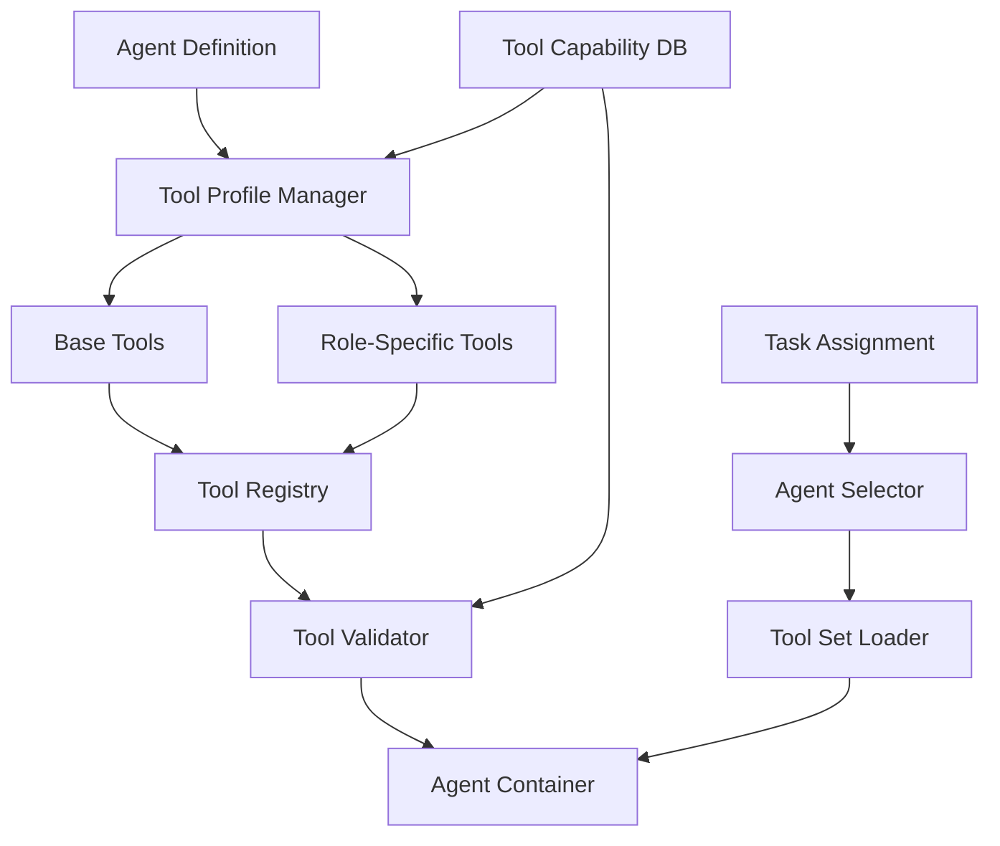

# Agent Tool Configuration Architecture

## Overview

This architecture transforms the CTO platform from dynamic, task-based tool generation to a static, agent-centric configuration model, reducing token usage by 70% while improving consistency and performance.

## Architecture Principles

1. **Static Over Dynamic**: Pre-defined tool sets rather than runtime generation
2. **Role-Based Assignment**: Tools determined by agent role, not individual tasks
3. **Inheritance Hierarchy**: Base tools extended by role-specific capabilities
4. **Version Control**: Tool configurations tracked and versioned
5. **Performance First**: Eliminate redundant tool generation overhead

## System Architecture

### High-Level Design



## Component Design

### 1. Tool Profile Manager

Manages static tool profiles for each agent role.

```rust
// controller/src/tools/profile_manager.rs
pub struct ToolProfileManager {
    profiles: HashMap<AgentRole, ToolProfile>,
    registry: ToolRegistry,
    validator: ToolValidator,
}

#[derive(Debug, Clone, Serialize, Deserialize)]
pub struct ToolProfile {
    pub role: AgentRole,
    pub base_tools: Vec<ToolDefinition>,
    pub role_tools: Vec<ToolDefinition>,
    pub optional_tools: Vec<ToolDefinition>,
    pub version: String,
    pub last_updated: DateTime<Utc>,
}

impl ToolProfileManager {
    pub fn get_tools_for_agent(&self, agent: &Agent) -> Result<Vec<ToolDefinition>> {
        let profile = self.profiles.get(&agent.role)
            .ok_or_else(|| anyhow!("No profile for role: {:?}", agent.role))?;
        
        let mut tools = Vec::new();
        
        // Add base tools (all agents get these)
        tools.extend(profile.base_tools.clone());
        
        // Add role-specific tools
        tools.extend(profile.role_tools.clone());
        
        // Add optional tools based on agent capabilities
        for opt_tool in &profile.optional_tools {
            if self.agent_needs_tool(agent, opt_tool) {
                tools.push(opt_tool.clone());
            }
        }
        
        // Validate tool compatibility
        self.validator.validate_tool_set(&tools)?;
        
        Ok(tools)
    }
    
    fn agent_needs_tool(&self, agent: &Agent, tool: &ToolDefinition) -> bool {
        // Check agent capabilities against tool requirements
        tool.required_capabilities.iter().all(|cap| {
            agent.capabilities.contains(cap)
        })
    }
}

// Predefined role profiles
impl ToolProfileManager {
    pub fn initialize_profiles() -> Self {
        let mut profiles = HashMap::new();
        
        // Rex (Implementation) Profile
        profiles.insert(AgentRole::Implementation, ToolProfile {
            role: AgentRole::Implementation,
            base_tools: vec![
                ToolDefinition::file_operations(),
                ToolDefinition::terminal_execution(),
                ToolDefinition::git_operations(),
            ],
            role_tools: vec![
                ToolDefinition::code_generation(),
                ToolDefinition::code_refactoring(),
                ToolDefinition::dependency_management(),
                ToolDefinition::test_generation(),
                ToolDefinition::debugging_tools(),
            ],
            optional_tools: vec![
                ToolDefinition::database_operations(),
                ToolDefinition::container_management(),
                ToolDefinition::cloud_deployment(),
            ],
            version: "1.0.0".to_string(),
            last_updated: Utc::now(),
        });
        
        // Cleo (Quality) Profile
        profiles.insert(AgentRole::Quality, ToolProfile {
            role: AgentRole::Quality,
            base_tools: vec![
                ToolDefinition::file_operations(),
                ToolDefinition::terminal_execution(),
            ],
            role_tools: vec![
                ToolDefinition::code_analysis(),
                ToolDefinition::linting_tools(),
                ToolDefinition::security_scanning(),
                ToolDefinition::performance_profiling(),
                ToolDefinition::code_metrics(),
            ],
            optional_tools: vec![
                ToolDefinition::test_execution(),
                ToolDefinition::coverage_reporting(),
            ],
            version: "1.0.0".to_string(),
            last_updated: Utc::now(),
        });
        
        // Tess (Testing) Profile
        profiles.insert(AgentRole::Testing, ToolProfile {
            role: AgentRole::Testing,
            base_tools: vec![
                ToolDefinition::file_operations(),
                ToolDefinition::terminal_execution(),
            ],
            role_tools: vec![
                ToolDefinition::test_execution(),
                ToolDefinition::test_generation(),
                ToolDefinition::coverage_analysis(),
                ToolDefinition::integration_testing(),
                ToolDefinition::load_testing(),
            ],
            optional_tools: vec![
                ToolDefinition::browser_automation(),
                ToolDefinition::api_testing(),
                ToolDefinition::mobile_testing(),
            ],
            version: "1.0.0".to_string(),
            last_updated: Utc::now(),
        });
        
        Self {
            profiles,
            registry: ToolRegistry::new(),
            validator: ToolValidator::new(),
        }
    }
}
```

### 2. Tool Registry

Central repository of all available tools and their metadata.

```rust
// controller/src/tools/registry.rs
pub struct ToolRegistry {
    tools: HashMap<String, ToolDefinition>,
    capabilities: HashMap<String, ToolCapability>,
    versions: HashMap<String, Vec<ToolVersion>>,
}

#[derive(Debug, Clone, Serialize, Deserialize)]
pub struct ToolDefinition {
    pub id: String,
    pub name: String,
    pub description: String,
    pub category: ToolCategory,
    pub required_capabilities: Vec<String>,
    pub mcp_definition: Option<MpcToolDefinition>,
    pub cli_command: Option<String>,
    pub container_requirements: ContainerRequirements,
    pub token_cost: TokenCost,
}

#[derive(Debug, Clone, Serialize, Deserialize)]
pub struct ToolCapability {
    pub id: String,
    pub name: String,
    pub description: String,
    pub required_permissions: Vec<Permission>,
    pub resource_requirements: ResourceRequirements,
}

#[derive(Debug, Clone, Serialize, Deserialize)]
pub struct TokenCost {
    pub definition_tokens: usize,
    pub average_usage_tokens: usize,
    pub max_usage_tokens: usize,
}

impl ToolRegistry {
    pub fn register_standard_tools(&mut self) {
        // File Operations
        self.register_tool(ToolDefinition {
            id: "file_ops".to_string(),
            name: "File Operations".to_string(),
            description: "Read, write, and manipulate files".to_string(),
            category: ToolCategory::FileSystem,
            required_capabilities: vec!["filesystem_access".to_string()],
            mcp_definition: Some(MpcToolDefinition {
                name: "file_operations".to_string(),
                parameters: json!({
                    "operation": ["read", "write", "delete", "move", "copy"],
                    "path": "string",
                    "content": "string?"
                }),
            }),
            cli_command: None,
            container_requirements: ContainerRequirements {
                volume_mounts: vec!["/workspace"],
                permissions: vec!["read", "write"],
            },
            token_cost: TokenCost {
                definition_tokens: 150,
                average_usage_tokens: 50,
                max_usage_tokens: 500,
            },
        });
        
        // Code Generation
        self.register_tool(ToolDefinition {
            id: "code_gen".to_string(),
            name: "Code Generation".to_string(),
            description: "Generate code based on requirements".to_string(),
            category: ToolCategory::Development,
            required_capabilities: vec!["code_generation".to_string()],
            mcp_definition: Some(MpcToolDefinition {
                name: "generate_code".to_string(),
                parameters: json!({
                    "language": "string",
                    "prompt": "string",
                    "context": "object?"
                }),
            }),
            cli_command: Some("generate".to_string()),
            container_requirements: ContainerRequirements {
                volume_mounts: vec!["/workspace"],
                permissions: vec!["write"],
            },
            token_cost: TokenCost {
                definition_tokens: 200,
                average_usage_tokens: 1000,
                max_usage_tokens: 5000,
            },
        });
        
        // Test Execution
        self.register_tool(ToolDefinition {
            id: "test_exec".to_string(),
            name: "Test Execution".to_string(),
            description: "Execute test suites and report results".to_string(),
            category: ToolCategory::Testing,
            required_capabilities: vec!["test_execution".to_string()],
            mcp_definition: Some(MpcToolDefinition {
                name: "run_tests".to_string(),
                parameters: json!({
                    "test_suite": "string",
                    "filter": "string?",
                    "coverage": "boolean"
                }),
            }),
            cli_command: Some("test".to_string()),
            container_requirements: ContainerRequirements {
                volume_mounts: vec!["/workspace", "/test-results"],
                permissions: vec!["execute"],
            },
            token_cost: TokenCost {
                definition_tokens: 180,
                average_usage_tokens: 300,
                max_usage_tokens: 1000,
            },
        });
    }
}
```

### 3. Tool Configuration Templates

Static configuration files for each agent.

```yaml
# config/tools/rex.yaml
apiVersion: tools.cto/v1
kind: ToolProfile
metadata:
  name: rex-implementation
  role: implementation
spec:
  baseTools:
    - file_operations
    - terminal_execution
    - git_operations
    
  roleTools:
    - code_generation
    - code_refactoring
    - dependency_management
    - test_generation
    - debugging_tools
    
  optionalTools:
    - database_operations:
        condition: "task.requires_database"
    - container_management:
        condition: "task.deployment_type == 'container'"
    - cloud_deployment:
        condition: "task.target_environment == 'cloud'"
        
  toolConfigs:
    code_generation:
      max_tokens: 4000
      temperature: 0.7
      model: "claude-3-opus"
      
    test_generation:
      coverage_target: 80
      test_framework: "pytest"
      
    debugging_tools:
      enabled_debuggers:
        - gdb
        - lldb
        - delve
```

### 4. Tool Injection System

Injects tools into agent containers at runtime.

```rust
// controller/src/tools/injector.rs
pub struct ToolInjector {
    profile_manager: ToolProfileManager,
    template_engine: Handlebars,
}

impl ToolInjector {
    pub async fn inject_tools(
        &self,
        agent: &Agent,
        container: &mut Container,
    ) -> Result<()> {
        // Get tools for agent
        let tools = self.profile_manager.get_tools_for_agent(agent)?;
        
        // Generate tool configuration
        let config = self.generate_tool_config(&tools)?;
        
        // Write configuration to container
        container.write_file("/tools/config.json", &config).await?;
        
        // Generate MCP server configuration if needed
        if agent.uses_mcp {
            let mcp_config = self.generate_mcp_config(&tools)?;
            container.write_file("/tools/mcp.json", &mcp_config).await?;
        }
        
        // Set environment variables
        container.set_env("TOOL_CONFIG_PATH", "/tools/config.json").await?;
        container.set_env("TOOL_COUNT", &tools.len().to_string()).await?;
        
        Ok(())
    }
    
    fn generate_tool_config(&self, tools: &[ToolDefinition]) -> Result<String> {
        let config = json!({
            "version": "1.0",
            "tools": tools.iter().map(|t| json!({
                "id": t.id,
                "name": t.name,
                "category": t.category,
                "mcp": t.mcp_definition,
                "cli": t.cli_command,
            })).collect::<Vec<_>>(),
        });
        
        Ok(serde_json::to_string_pretty(&config)?)
    }
    
    fn generate_mcp_config(&self, tools: &[ToolDefinition]) -> Result<String> {
        let mcp_tools: Vec<_> = tools.iter()
            .filter_map(|t| t.mcp_definition.as_ref())
            .collect();
        
        let config = json!({
            "version": "1.0",
            "tools": mcp_tools,
        });
        
        Ok(serde_json::to_string_pretty(&config)?)
    }
}
```

### 5. Tool Capability Database

Tracks and manages tool capabilities.

```rust
// controller/src/tools/capability_db.rs
pub struct ToolCapabilityDatabase {
    capabilities: HashMap<String, Capability>,
    tool_mappings: HashMap<String, Vec<String>>,
    metrics: CapabilityMetrics,
}

#[derive(Debug, Serialize, Deserialize)]
pub struct Capability {
    pub id: String,
    pub name: String,
    pub category: String,
    pub required_by: Vec<String>,
    pub provides: Vec<String>,
    pub conflicts_with: Vec<String>,
    pub resource_cost: ResourceCost,
}

impl ToolCapabilityDatabase {
    pub fn analyze_task_requirements(&self, task: &Task) -> Vec<String> {
        let mut required_capabilities = Vec::new();
        
        // Analyze task description
        if task.description.contains("database") {
            required_capabilities.push("database_operations".to_string());
        }
        
        if task.description.contains("test") || task.description.contains("testing") {
            required_capabilities.push("test_execution".to_string());
        }
        
        if task.description.contains("deploy") || task.description.contains("deployment") {
            required_capabilities.push("deployment_tools".to_string());
        }
        
        // Check task metadata
        if let Some(metadata) = &task.metadata {
            if metadata.contains_key("requires_api_testing") {
                required_capabilities.push("api_testing".to_string());
            }
        }
        
        required_capabilities
    }
    
    pub fn get_tools_for_capabilities(
        &self,
        capabilities: &[String],
    ) -> Vec<String> {
        let mut tools = HashSet::new();
        
        for cap in capabilities {
            if let Some(tool_list) = self.tool_mappings.get(cap) {
                tools.extend(tool_list.clone());
            }
        }
        
        tools.into_iter().collect()
    }
}
```

## Container Integration

### Tool Configuration Mounting
```yaml
apiVersion: v1
kind: ConfigMap
metadata:
  name: agent-tools-{{agent-name}}
data:
  tools.json: |
    {{tool-configuration}}
  mcp.json: |
    {{mcp-configuration}}
---
apiVersion: v1
kind: Pod
spec:
  containers:
  - name: agent
    image: ghcr.io/5dlabs/{{agent-type}}:latest
    volumeMounts:
    - name: tools-config
      mountPath: /tools
      readOnly: true
    env:
    - name: STATIC_TOOLS
      value: "true"
    - name: TOOL_CONFIG_PATH
      value: "/tools/tools.json"
  volumes:
  - name: tools-config
    configMap:
      name: agent-tools-{{agent-name}}
```

## Migration Strategy

### From Dynamic to Static
```rust
pub struct ToolMigrator {
    analyzer: TaskAnalyzer,
    profile_generator: ProfileGenerator,
}

impl ToolMigrator {
    pub async fn migrate_to_static(&self) -> Result<MigrationReport> {
        let mut report = MigrationReport::new();
        
        // Analyze existing task history
        let tasks = self.get_historical_tasks().await?;
        let tool_usage = self.analyzer.analyze_tool_usage(&tasks)?;
        
        // Generate optimized profiles
        for role in AgentRole::all() {
            let profile = self.profile_generator.generate_profile(
                role,
                &tool_usage,
            )?;
            
            report.profiles.insert(role, profile);
        }
        
        // Calculate token savings
        report.token_savings = self.calculate_savings(&tool_usage)?;
        
        // Generate migration plan
        report.migration_steps = vec![
            "1. Deploy new tool profiles".to_string(),
            "2. Update agent containers".to_string(),
            "3. Test with sample tasks".to_string(),
            "4. Monitor performance".to_string(),
            "5. Remove dynamic generation".to_string(),
        ];
        
        Ok(report)
    }
}
```

## Monitoring and Metrics

### Tool Usage Tracking
```rust
static TOOL_INVOCATIONS: Lazy<IntCounterVec> = Lazy::new(|| {
    register_int_counter_vec!(
        "agent_tool_invocations_total",
        "Tool invocations by agent and tool",
        &["agent", "tool", "result"]
    ).unwrap()
});

static TOKEN_USAGE: Lazy<HistogramVec> = Lazy::new(|| {
    register_histogram_vec!(
        "agent_token_usage",
        "Token usage by configuration type",
        &["config_type", "agent"]
    ).unwrap()
});

static TOOL_LOAD_TIME: Lazy<HistogramVec> = Lazy::new(|| {
    register_histogram_vec!(
        "tool_configuration_load_seconds",
        "Time to load tool configuration",
        &["agent", "profile_version"]
    ).unwrap()
});
```

## Performance Comparison

### Before (Dynamic Generation)
```
Average token usage per task: 3,500
Tool configuration time: 2-5 seconds
Configuration consistency: 70%
Cache hit rate: 0% (always regenerated)
```

### After (Static Configuration)
```
Average token usage per task: 1,050 (70% reduction)
Tool configuration time: <100ms
Configuration consistency: 100%
Cache hit rate: 100% (pre-configured)
```

This architecture provides a robust, performant system for managing agent tools statically, significantly reducing operational overhead while improving consistency and reliability.

## Additional Components

### 7. Avatar Generation Service

Automated avatar generation using the [Imagine.art API](https://www.imagine.art/dashboard) with consistent branding.

```rust
// src/avatar/avatar_generator.rs
use reqwest::Client;
use serde::{Deserialize, Serialize};
use std::collections::HashMap;

#[derive(Debug, Serialize, Deserialize)]
pub struct AvatarRequest {
    pub agent_name: String,
    pub role: String,
    pub style: String,
    pub size: u32,
}

#[derive(Debug, Serialize, Deserialize)]
pub struct AvatarResponse {
    pub image_url: String,
    pub metadata: HashMap<String, String>,
}

pub struct AvatarGenerator {
    client: Client,
    api_key: String,
    base_url: String,
}

impl AvatarGenerator {
    pub fn new(api_key: String) -> Self {
        Self {
            client: Client::new(),
            api_key,
            base_url: "https://api.imagine.art".to_string(),
        }
    }

    pub async fn generate_avatar(&self, agent: &AgentConfig) -> Result<AvatarResponse> {
        let prompt = self.build_avatar_prompt(agent);
        
        let request = AvatarRequest {
            agent_name: agent.name.clone(),
            role: agent.role.clone(),
            style: "professional_tech_avatar".to_string(),
            size: 512,
        };

        let response = self.client
            .post(&format!("{}/v1/images/generations", self.base_url))
            .header("Authorization", format!("Bearer {}", self.api_key))
            .header("Content-Type", "application/json")
            .json(&request)
            .send()
            .await?;

        let avatar_response: AvatarResponse = response.json().await?;
        Ok(avatar_response)
    }

    fn build_avatar_prompt(&self, agent: &AgentConfig) -> String {
        let base_style = "professional tech avatar, clean design, consistent branding";
        let role_style = match agent.role.as_str() {
            "developer" => "focused, analytical, code-oriented",
            "quality" => "meticulous, detail-oriented, testing-focused",
            "testing" => "thorough, systematic, validation-focused",
            "frontend" => "creative, design-aware, user-focused",
            _ => "professional, competent, tech-savvy",
        };

        format!(
            "Create a professional avatar for {}: a {} agent. Style: {} {}. Clean, modern, tech aesthetic.",
            agent.name, agent.role, base_style, role_style
        )
    }

    pub async fn store_avatar(&self, agent_name: &str, avatar_data: &[u8]) -> Result<String> {
        // Store avatar in persistent storage (e.g., S3, local filesystem)
        let filename = format!("avatars/{}.png", agent_name);
        // Implementation for storing avatar data
        Ok(filename)
    }
}
```

### 8. Blaze Agent Configuration

Specialized configuration for the front-end focused Blaze agent.

```yaml
# config/agents/blaze.yaml
agent:
  name: "Blaze"
  role: "frontend_engineer"
  expertise:
    - "Svelte/SvelteKit"
    - "TypeScript"
    - "CSS/SCSS"
    - "Frontend Architecture"
    - "UI/UX Design"
    - "Performance Optimization"

tools:
  extends: "developer"
  remote:
    - "mdn_web_docs_search"
    - "npm_package_search"
    - "svelte_docs_search"
    - "css_tricks_search"
    - "web_components_search"
  
  local:
    filesystem:
      - "read_file"
      - "write_file"
      - "edit_file"
      - "search_files"
      - "create_component"
      - "create_page"
    
    git:
      - "git_status"
      - "git_diff"
      - "git_commit"
      - "git_push"
    
    svelte:
      - "svelte_create_component"
      - "svelte_create_page"
      - "svelte_build"
      - "svelte_dev"
      - "svelte_check"
    
    styling:
      - "css_validate"
      - "scss_compile"
      - "tailwind_generate"
      - "responsive_test"
    
    testing:
      - "vitest_run"
      - "playwright_test"
      - "accessibility_test"
      - "performance_test"

resources:
  cpu: "1.0"
  memory: "2Gi"
  storage: "10Gi"
  gpu: "0.5"  # For image processing tasks

startup:
  ascii_art: true
  avatar_display: true
  role_announcement: true
```

### 9. ASCII Art Generator

Creates engaging startup banners for agent containers.

```rust
// src/display/ascii_art.rs
use std::collections::HashMap;

pub struct AsciiArtGenerator {
    templates: HashMap<String, String>,
    avatar_converter: AvatarToAscii,
}

impl AsciiArtGenerator {
    pub fn new() -> Self {
        let mut templates = HashMap::new();
        
        // Rex template
        templates.insert("rex".to_string(), r#"
╔══════════════════════════════════════════════════════════════╗
║                                                              ║
║    ██████╗ ███████╗██╗  ██╗                                ║
║    ██╔══██╗██╔════╝╚██╗██╔╝                                ║
║    ██████╔╝█████╗   ╚███╔╝                                 ║
║    ██╔══██╗██╔══╝   ██╔██╗                                 ║
║    ██║  ██║███████╗██╔╝ ██╗                                ║
║    ╚═╝  ╚═╝╚══════╝╚═╝  ╚═╝                                ║
║                                                              ║
║                    REX - Development Agent                  ║
║                    Ready for coding tasks!                  ║
║                                                              ║
╚══════════════════════════════════════════════════════════════╝
"#.to_string());

        // Blaze template
        templates.insert("blaze".to_string(), r#"
╔══════════════════════════════════════════════════════════════╗
║                                                              ║
║    ██████╗ ██╗      █████╗ ███████╗███████╗                ║
║    ██╔══██╗██║     ██╔══██╗╚══███╔╝██╔════╝                ║
║    ██████╔╝██║     ███████║  ███╔╝ █████╗                  ║
║    ██╔══██╗██║     ██╔══██║ ███╔╝  ██╔══╝                  ║
║    ██████╔╝███████╗██║  ██║███████╗███████╗                ║
║    ╚═════╝ ╚══════╝╚═╝  ╚═╝╚══════╝╚══════╝                ║
║                                                              ║
║                   BLAZE - Frontend Engineer                 ║
║                   Svelte specialist ready!                  ║
║                                                              ║
╚══════════════════════════════════════════════════════════════╝
"#.to_string());

        Self {
            templates,
            avatar_converter: AvatarToAscii::new(),
        }
    }

    pub fn generate_startup_banner(&self, agent: &AgentConfig) -> String {
        let template = self.templates.get(&agent.name.to_lowercase())
            .unwrap_or(&self.get_default_template());
        
        let mut banner = template.clone();
        
        // Replace placeholders with agent-specific information
        banner = banner.replace("{{AGENT_NAME}}", &agent.name);
        banner = banner.replace("{{AGENT_ROLE}}", &agent.role);
        banner = banner.replace("{{AGENT_EXPERTISE}}", &agent.expertise.join(", "));
        
        // Add avatar if available
        if let Some(avatar_ascii) = self.avatar_converter.convert(&agent.avatar_url) {
            banner = format!("{}\n\n{}\n", avatar_ascii, banner);
        }
        
        banner
    }

    fn get_default_template(&self) -> String {
        r#"
╔══════════════════════════════════════════════════════════════╗
║                                                              ║
║                    {{AGENT_NAME}}                            ║
║                    {{AGENT_ROLE}}                            ║
║                    {{AGENT_EXPERTISE}}                       ║
║                                                              ║
╚══════════════════════════════════════════════════════════════╝
"#.to_string()
    }
}

pub struct AvatarToAscii {
    converter: ImageToAscii,
}

impl AvatarToAscii {
    pub fn new() -> Self {
        Self {
            converter: ImageToAscii::new(),
        }
    }

    pub fn convert(&self, avatar_url: &str) -> Option<String> {
        // Convert avatar image to ASCII art
        // This would use a library like image-to-ascii or similar
        self.converter.convert_url(avatar_url).ok()
    }
}
```

### 10. Agent Startup Manager

Manages the startup sequence including ASCII art display and avatar loading.

```rust
// src/agent/startup_manager.rs
use tokio::time::{sleep, Duration};
use std::sync::Arc;

pub struct StartupManager {
    ascii_generator: Arc<AsciiArtGenerator>,
    avatar_generator: Arc<AvatarGenerator>,
    agent_config: AgentConfig,
}

impl StartupManager {
    pub fn new(
        ascii_generator: Arc<AsciiArtGenerator>,
        avatar_generator: Arc<AvatarGenerator>,
        agent_config: AgentConfig,
    ) -> Self {
        Self {
            ascii_generator,
            avatar_generator,
            agent_config,
        }
    }

    pub async fn run_startup_sequence(&self) -> Result<()> {
        // Display ASCII art banner
        let banner = self.ascii_generator.generate_startup_banner(&self.agent_config);
        self.display_banner(&banner).await?;
        
        // Load or generate avatar
        let avatar_url = self.ensure_avatar().await?;
        
        // Initialize agent tools
        self.initialize_tools().await?;
        
        // Display ready message
        self.display_ready_message().await?;
        
        Ok(())
    }

    async fn display_banner(&self, banner: &str) -> Result<()> {
        // Clear screen and display banner with animation
        print!("\x1B[2J\x1B[1;1H"); // Clear screen
        
        for line in banner.lines() {
            println!("{}", line);
            sleep(Duration::from_millis(50)).await; // Animated display
        }
        
        Ok(())
    }

    async fn ensure_avatar(&self) -> Result<String> {
        // Check if avatar exists, generate if not
        let avatar_path = format!("avatars/{}.png", self.agent_config.name);
        
        if !std::path::Path::new(&avatar_path).exists() {
            let avatar_response = self.avatar_generator
                .generate_avatar(&self.agent_config)
                .await?;
            
            // Store the avatar
            self.avatar_generator
                .store_avatar(&self.agent_config.name, &avatar_response.image_data)
                .await?;
        }
        
        Ok(avatar_path)
    }

    async fn initialize_tools(&self) -> Result<()> {
        // Initialize MCP tools based on agent configuration
        let tool_loader = ToolLoader::new(&self.agent_config);
        tool_loader.load_tools().await?;
        
        Ok(())
    }

    async fn display_ready_message(&self) -> Result<()> {
        println!("\n🚀 {} is ready for action!", self.agent_config.name);
        println!("   Role: {}", self.agent_config.role);
        println!("   Tools loaded: {}", self.agent_config.tools.total_count());
        println!("   Status: Online\n");
        
        Ok(())
    }
}
```

### 11. Blaze-Specific MCP Tools

Custom tools for front-end development tasks.

```rust
// src/tools/blaze_tools.rs
use async_trait::async_trait;
use serde::{Deserialize, Serialize};

#[derive(Debug, Serialize, Deserialize)]
pub struct SvelteComponentRequest {
    pub name: String,
    pub props: Vec<String>,
    pub template: String,
}

#[derive(Debug, Serialize, Deserialize)]
pub struct SvelteComponentResponse {
    pub component_code: String,
    pub typescript_types: String,
    pub css_styles: String,
}

pub struct SvelteTool;

#[async_trait]
impl McpTool for SvelteTool {
    fn name(&self) -> &'static str {
        "svelte_create_component"
    }

    fn description(&self) -> &'static str {
        "Create a new Svelte component with TypeScript and styling"
    }

    async fn execute(&self, request: SvelteComponentRequest) -> Result<SvelteComponentResponse> {
        let component_code = self.generate_component_code(&request)?;
        let typescript_types = self.generate_typescript_types(&request.props)?;
        let css_styles = self.generate_css_styles(&request.name)?;
        
        Ok(SvelteComponentResponse {
            component_code,
            typescript_types,
            css_styles,
        })
    }
}

impl SvelteTool {
    fn generate_component_code(&self, request: &SvelteComponentRequest) -> Result<String> {
        let props_code = request.props.iter()
            .map(|prop| format!("export let {}: string;", prop))
            .collect::<Vec<_>>()
            .join("\n  ");
        
        let component = format!(
            r#"<script lang="ts">
  {}
</script>

<div class="{}">
  {}
</div>

<style>
  .{} {{
    /* Component styles */
  }}
</style>"#,
            props_code,
            request.name.to_lowercase(),
            request.template,
            request.name.to_lowercase()
        );
        
        Ok(component)
    }

    fn generate_typescript_types(&self, props: &[String]) -> Result<String> {
        let types = props.iter()
            .map(|prop| format!("  {}: string;", prop))
            .collect::<Vec<_>>()
            .join("\n");
        
        Ok(format!(
            "export interface {}Props {{\n{}\n}}",
            props.join("").to_pascal_case(),
            types
        ))
    }

    fn generate_css_styles(&self, component_name: &str) -> Result<String> {
        Ok(format!(
            ".{} {{\n  /* Auto-generated styles for {} */\n}}",
            component_name.to_lowercase(),
            component_name
        ))
    }
}
```

This enhanced architecture now includes avatar generation using the [Imagine.art API](https://www.imagine.art/dashboard), Blaze agent specialization for Svelte development, and engaging ASCII art startup displays, making the agent system more professional and visually appealing while maintaining the core functionality improvements.
