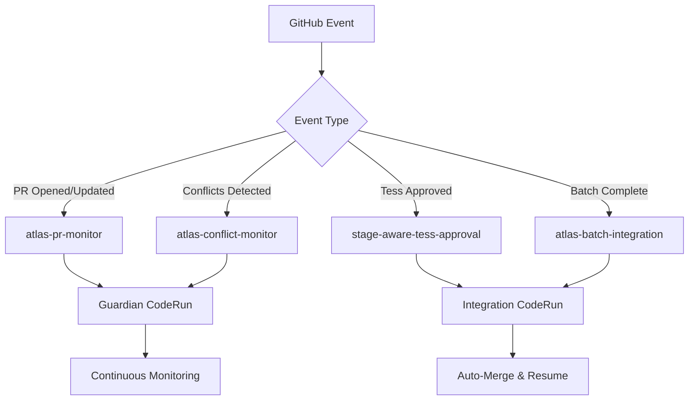

# Atlas Integration Architecture

## Overview

Atlas serves as the **Integration Specialist** in the CTO platform's multi-agent orchestration system, ensuring PRs remain merge-ready from creation through final integration. This document details the complete Atlas integration architecture implemented in November 2025.

## Core Responsibilities

### 1. PR Guardian Mode (`ATLAS_MODE=guardian`)
- **Activation**: On PR open/reopen/synchronize events
- **Mission**: Keep PRs green and merge-ready
- **Responsibilities**:
  - Monitor and resolve Bugbot comments
  - Fix CI failures (clippy, tests, lints)
  - Detect and resolve merge conflicts
  - Maintain PR health continuously

### 2. Integration Gate Mode (`ATLAS_MODE=integration-gate`)
- **Activation**: After Tess approval (stage: `waiting-atlas-integration`)
- **Mission**: Final integration and merge
- **Responsibilities**:
  - Resolve any last-minute conflicts
  - Ensure all checks pass
  - Auto-merge PRs when criteria met
  - Resume workflow to completion

## Event-Driven Architecture

### GitHub Webhook Pipeline



### Key Sensors

#### 1. `atlas-pr-monitor-sensor`
- **Location**: `infra/gitops/resources/github-webhooks/`
- **Triggers**: PR opened, reopened, synchronize, ready_for_review
- **Action**: Creates/resumes Atlas guardian CodeRun
- **Deduplication**: ConfigMap locks prevent duplicate guardians

#### 2. `stage-aware-tess-approval-sensor` (Modified)
- **Location**: `infra/gitops/resources/github-webhooks/`
- **Triggers**: PR review submitted (approved) by Tess
- **Action**: 
  1. Creates Atlas integration CodeRun
  2. Waits for PR merge
  3. Resumes main workflow

#### 3. `atlas-conflict-monitor-sensor`
- **Location**: `infra/gitops/resources/github-webhooks/`
- **Triggers**: PR marked unmergeable
- **Action**: Ensures guardian CodeRun exists for conflict resolution

#### 4. `atlas-batch-integration-sensor`
- **Location**: `infra/gitops/resources/github-webhooks/`
- **Triggers**: Batch/play completion comments
- **Action**: Launches integration checks for parallel task batches

## Workflow Integration

### Stage Transitions

The play workflow now includes Atlas integration as a mandatory gate:

```yaml
Stages:
1. pending
2. implementation-in-progress
3. waiting-pr-created
4. quality-in-progress (Cleo)
5. waiting-quality-complete
6. testing-in-progress (Tess)
7. waiting-atlas-integration    # NEW: Atlas gate
8. atlas-integration-in-progress # NEW: Atlas working
9. waiting-pr-merged
10. completed
```

### Suspend Points

```yaml
- name: wait-for-atlas-integration
  dependencies: [update-to-waiting-atlas]
  template: suspend-for-event
  arguments:
    parameters:
      - name: event-type
        value: "atlas-integration"
      - name: stage-name
        value: "waiting-atlas-integration"
```

## CodeRun Configuration

### Guardian Mode
```yaml
spec:
  githubApp: "5DLabs-Atlas"
  model: "claude-sonnet-4-5-20250929"
  continueSession: true  # Maintains context across cycles
  env:
    - name: ATLAS_MODE
      value: "guardian"
    - name: ATLAS_POLL_INTERVAL
      value: "60"  # Check every minute
    - name: ATLAS_MAX_CYCLES
      value: "0"   # Run indefinitely
```

### Integration Gate Mode
```yaml
spec:
  githubApp: "5DLabs-Atlas"
  model: "claude-sonnet-4-5-20250929"
  continueSession: false  # Fresh start for integration
  env:
    - name: ATLAS_MODE
      value: "integration-gate"
    - name: ATLAS_POLL_INTERVAL
      value: "30"  # More aggressive checking
    - name: ATLAS_MAX_CYCLES
      value: "120" # 1-hour timeout (30s × 120)
```

## Deduplication & Locking

### ConfigMap Locks
Prevent multiple Atlas instances per PR:

```bash
LOCK_NAME="atlas-guardian-lock-$PR_NUMBER"
kubectl create configmap "$LOCK_NAME" \
  --from-literal=pr-number="$PR_NUMBER" \
  --from-literal=workflow="{{workflow.name}}" \
  -n agent-platform
```

### Active CodeRun Detection
```bash
kubectl get coderuns -n agent-platform \
  -l agent=atlas,role=guardian,pr-number="$PR_NUMBER" \
  -o json | jq '.items[] | select(
    .status.phase == "Running" or 
    .status.phase == "Pending"
  )'
```

## Merge Criteria

Atlas enforces these criteria before auto-merging:

1. ✅ No open Bugbot comment threads
2. ✅ All CI checks passing
3. ✅ No merge conflicts
4. ✅ PR in mergeable state

### Special Case: Play Workflow PRs
During `integration-gate` mode, Atlas auto-merges even for play workflow PRs, as it owns the final integration responsibility.

## Parallel Execution Support

### Batch Integration Flow
```
Batch 1: Tasks 1,2,3 → Multiple PRs
  ↓
🔱 ATLAS: Batch 1 Integration
  ↓
Batch 2: Tasks 4,5 → More PRs  
  ↓
🔱 ATLAS: Batch 2 Integration
  ↓
Final: All PRs merged cleanly
```

### Batch Triggers
- Comment pattern: `"Batch N Complete"`
- Final trigger: `"Play Workflow Complete"`
- Each batch gets dedicated Atlas integration pass

## Error Handling

### Retry Strategies
```yaml
retryStrategy:
  steps: 3
  duration: "10s"
  factor: 2  # Exponential backoff
```

### Failure Escalation
After 3 failed fix attempts:
1. Add `blocked` label to PR
2. Post detailed error comment
3. Request human intervention

## Monitoring & Observability

### Key Metrics
- `atlas_coderuns_active`: Active Atlas instances
- `atlas_pr_merge_time`: Time from Tess approval to merge
- `atlas_conflict_resolution_time`: Time to resolve conflicts
- `atlas_bugbot_fix_rate`: Success rate for Bugbot resolutions

### Grafana Dashboards
- Atlas CodeRun status by PR
- Integration gate performance
- Conflict detection/resolution rates
- Bugbot comment resolution times

### Alerts
- Guardian CodeRun failures
- Integration gate timeouts
- Excessive retry attempts
- Lock contention issues

## Security Considerations

### GitHub App Permissions
Atlas uses dedicated GitHub App (`5DLabs-Atlas`) with:
- Write access to pull requests
- Write access to issues (for comments)
- Write access to checks
- Write access to contents (for conflict resolution)

### Secret Management
```yaml
- name: GITHUB_APP_PRIVATE_KEY
  valueFrom:
    secretKeyRef:
      name: github-app-5dlabs-atlas
      key: private-key
```

## Troubleshooting Guide

### Common Issues

#### 1. Duplicate CodeRuns
**Symptom**: Multiple Atlas instances for same PR
**Solution**: Check ConfigMap locks, ensure deduplication logic working

#### 2. Integration Gate Not Triggering
**Symptom**: Workflow stuck at `waiting-atlas-integration`
**Solution**: Verify Tess approval event, check sensor logs

#### 3. Merge Conflicts Not Detected
**Symptom**: PR has conflicts but Atlas not activated
**Solution**: Check GitHub webhook delivery, verify conflict monitor sensor

#### 4. Auto-Merge Failing
**Symptom**: All checks green but PR not merging
**Solution**: Verify GitHub App permissions, check branch protection rules

### Debug Commands

```bash
# Check Atlas CodeRuns for a PR
kubectl get coderuns -n agent-platform \
  -l agent=atlas,pr-number=<PR_NUMBER>

# View sensor logs
kubectl logs -n argo \
  deployment/atlas-pr-monitor-sensor-controller

# Check workflow stage
kubectl get workflows -n agent-platform \
  -l workflow=play-orchestration -o json | \
  jq '.items[0].metadata.labels["current-stage"]'

# View ConfigMap locks
kubectl get configmaps -n agent-platform \
  -l atlas-guardian-lock
```

## Migration Notes

### Deprecated Components
- `atlas-pr-guardian-sensor` (scaled to 0)
- `atlas-conflict-detection-sensor` (replaced)
- `atlas-batch-integration-sensor` (old version disabled)

### GitOps Considerations
All Atlas sensors now managed under:
- `infra/gitops/resources/github-webhooks/`

Legacy sensors disabled but retained for rollback:
- `infra/gitops/resources/sensors/` (replicas: 0)

## Future Enhancements

### Planned Improvements
1. **ML-based conflict resolution**: Use historical data to predict resolution strategies
2. **Predictive CI fixes**: Anticipate common CI failures based on code patterns
3. **Smart batching**: Optimize batch sizes based on conflict probability
4. **Cross-PR dependency detection**: Identify and handle inter-PR dependencies

### Performance Optimizations
1. **Caching**: Cache GitHub API responses to reduce rate limit usage
2. **Parallel processing**: Handle multiple PRs simultaneously in batch mode
3. **Incremental fixes**: Apply minimal changes to resolve issues
4. **Smart polling**: Adjust intervals based on PR activity patterns

---

*Last Updated: November 2025*
*Architecture Version: 2.0*
*Implementation PR: #[pending]*
