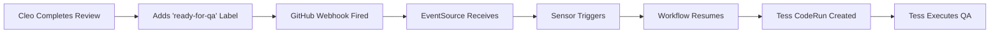

# Cleo to Tess Workflow Transition Flow

## Overview
This document describes the complete flow from Cleo (Code Quality Agent) to Tess (QA Testing Agent) in the multi-agent orchestration pipeline, including all components involved and debugging checkpoints.

## High-Level Flow



## Detailed Component Flow

### 1. Cleo Completion Phase

**Component**: Cleo CodeRun (`coderun-quality-task*`)
- **Location**: `agent-platform` namespace
- **Script**: `/infra/charts/controller/claude-templates/code/container-cleo.sh.hbs`
- **Key Actions**:
  - Reviews PR code quality
  - Adds comments to PR
  - **Critical**: Adds `ready-for-qa` label to PR via GitHub API
  - Updates PR with quality feedback

**Debug Commands**:
```bash
# Check Cleo CodeRun status
kubectl get coderun -n agent-platform | grep quality

# Check Cleo job logs for label addition
kubectl logs job/code-agent-platform-coderun-quality-task1-* -n agent-platform | grep "ready-for-qa"

# Verify PR has the label
gh pr view <PR_NUMBER> --repo 5dlabs/cto-play-test --json labels
```

### 2. GitHub Webhook Trigger

**Component**: GitHub Webhook
- **Event Type**: `pull_request` (labeled action)
- **Payload Contains**:
  - `action: "labeled"`
  - `label.name: "ready-for-qa"`
  - `pull_request.number`
  - `pull_request.html_url`

**Debug Commands**:
```bash
# Check GitHub webhook delivery (requires GitHub UI access)
# Go to: Settings > Webhooks > Recent Deliveries

# Check EventSource pod logs for webhook receipt
kubectl logs -n argo deployment/github-eventsource-git --tail=100 | grep ready-for-qa
```

### 3. Argo Events Processing

**Component**: EventSource
- **Name**: `github`
- **Namespace**: `argo`
- **Config**: `/infra/gitops/resources/github-webhooks/github-eventsource.yaml`
- **Endpoint**: Receives webhooks at `/push`

**Debug Commands**:
```bash
# Check EventSource status
kubectl get eventsource github -n argo

# Check EventSource pod logs
kubectl logs -n argo deployment/github-eventsource-git --tail=50

# Verify EventSource is receiving webhooks
kubectl describe eventsource github -n argo
```

### 4. Sensor Activation

**Component**: Sensor `play-workflow-ready-for-qa`
- **Namespace**: `argo`
- **Config**: `/infra/gitops/resources/github-webhooks/play-workflow-sensors.yaml`
- **Triggers On**:
  - Event from EventSource `github`
  - Filter: `label.name == "ready-for-qa"`
  - Additional filters for PR author (not Tess)

**Debug Commands**:
```bash
# Check sensor status
kubectl get sensor play-workflow-ready-for-qa -n argo

# Check sensor logs for trigger attempts
kubectl logs -n argo deployment/play-workflow-ready-for-qa-sensor --tail=100

# Verify sensor configuration
kubectl describe sensor play-workflow-ready-for-qa -n argo
```

### 5. Workflow Resume

**Component**: Play Workflow
- **Name Pattern**: `play-task-*` or `test-play-task-*`
- **Namespace**: `agent-platform`
- **Template**: `play-workflow-template`
- **Resume Point**: `wait-ready-for-qa` suspend step

**Key Workflow Labels**:
- `current-stage: waiting-ready-for-qa`
- `workflow-type: play-orchestration`
- `task-id: <task_number>`

**Debug Commands**:
```bash
# Find suspended workflows waiting for QA
kubectl get workflows -n agent-platform \
  -l current-stage=waiting-ready-for-qa,workflow-type=play-orchestration

# Check workflow status
kubectl describe workflow <workflow-name> -n agent-platform

# Check if workflow was resumed
kubectl get workflow <workflow-name> -n agent-platform -o jsonpath='{.spec.suspend}'
```

### 6. Tess CodeRun Creation

**Component**: Tess CodeRun
- **Name Pattern**: `coderun-testing-task*`
- **Namespace**: `agent-platform`
- **GitHub App**: `5DLabs-Tess`
- **Script**: `/infra/charts/controller/claude-templates/code/container-tess.sh.hbs`

**Environment Variables Passed**:
- `PR_NUMBER`: Pull request number
- `PR_URL`: Pull request URL
- `QA_READY: "true"`
- `WORKFLOW_STAGE: "testing"`

**Debug Commands**:
```bash
# Check if Tess CodeRun was created
kubectl get coderun -n agent-platform | grep testing

# Check Tess CodeRun details
kubectl describe coderun coderun-testing-task1-* -n agent-platform

# Check Tess job logs
kubectl logs job/code-agent-platform-coderun-testing-task1-* -n agent-platform
```

## Common Issues and Debugging

### 1. Label Not Added by Cleo
**Symptoms**: No `ready-for-qa` label on PR
**Debug**:
```bash
# Check Cleo logs for errors
kubectl logs job/code-agent-platform-coderun-quality-task1-* -n agent-platform | grep -E "(error|failed|label)"

# Verify GitHub token permissions
kubectl get secret github-app-5dlabs-cleo -n agent-platform -o yaml
```

### 2. Webhook Not Received
**Symptoms**: EventSource logs don't show webhook
**Debug**:
```bash
# Check webhook configuration in GitHub
# Settings > Webhooks > Check URL and events

# Verify EventSource is running
kubectl get pods -n argo | grep eventsource

# Check EventSource service
kubectl get svc -n argo | grep eventsource
```

### 3. Sensor Not Triggering
**Symptoms**: Sensor receives event but doesn't trigger
**Debug**:
```bash
# Check sensor logs for filter mismatches
kubectl logs -n argo deployment/play-workflow-ready-for-qa-sensor --tail=200 | grep -E "(filter|trigger|matched)"

# Verify sensor dependencies and filters
kubectl get sensor play-workflow-ready-for-qa -n argo -o yaml | grep -A 20 dependencies
```

### 4. Workflow Not Resuming
**Symptoms**: Workflow stays suspended despite trigger
**Debug**:
```bash
# Check workflow labels
kubectl get workflow <name> -n agent-platform --show-labels

# Verify workflow is at correct suspend point
kubectl get workflow <name> -n agent-platform -o yaml | grep -A 5 suspend

# Check for resume attempts in sensor logs
kubectl logs -n argo deployment/play-workflow-ready-for-qa-sensor | grep <workflow-name>
```

### 5. Tess CodeRun Failing
**Symptoms**: Tess starts but fails immediately
**Debug**:
```bash
# Check workspace setup issues
kubectl logs job/code-agent-platform-coderun-testing-task1-* -n agent-platform | head -50

# Verify ConfigMap has correct scripts
kubectl get configmap controller-claude-templates -n agent-platform -o yaml | grep -A 10 "container-tess"

# Check PVC exists
kubectl get pvc -n agent-platform | grep tess
```

## Key Configuration Files

1. **Sensor Configuration**: `/infra/gitops/resources/github-webhooks/play-workflow-sensors.yaml`
2. **Workflow Template**: `/infra/charts/controller/templates/workflowtemplates/play-workflow-template.yaml`
3. **Cleo Script**: `/infra/charts/controller/claude-templates/code/container-cleo.sh.hbs`
4. **Tess Script**: `/infra/charts/controller/claude-templates/code/container-tess.sh.hbs`
5. **EventSource**: `/infra/gitops/resources/github-webhooks/github-eventsource.yaml`

## Verification Checklist

- [ ] Cleo completes successfully
- [ ] `ready-for-qa` label appears on PR
- [ ] GitHub webhook shows as delivered (green checkmark)
- [ ] EventSource logs show webhook received
- [ ] Sensor logs show event matched filters
- [ ] Workflow transitions from `waiting-ready-for-qa` to running
- [ ] Tess CodeRun gets created
- [ ] Tess successfully clones repository
- [ ] Tess adds QA comments to PR

## Quick End-to-End Test

```bash
# 1. Check current suspended workflows
kubectl get workflows -n agent-platform -l current-stage=waiting-ready-for-qa

# 2. Manually add label to test (if needed)
gh pr edit <PR_NUMBER> --repo 5dlabs/cto-play-test --add-label ready-for-qa

# 3. Watch for workflow resume (should happen within 5-10 seconds)
kubectl get workflows -n agent-platform -w | grep <workflow-name>

# 4. Check for Tess CodeRun creation
kubectl get coderun -n agent-platform -w | grep testing
```

## Troubleshooting Decision Tree

```
Is Cleo completing successfully?
├─ No → Check Cleo logs and fix Cleo issues
└─ Yes → Is ready-for-qa label on PR?
    ├─ No → Check Cleo script for label addition logic
    └─ Yes → Is webhook delivered to EventSource?
        ├─ No → Check GitHub webhook config and EventSource service
        └─ Yes → Is sensor triggering?
            ├─ No → Check sensor filters and dependencies
            └─ Yes → Is workflow resuming?
                ├─ No → Check workflow labels and suspend state
                └─ Yes → Is Tess CodeRun created?
                    ├─ No → Check workflow template and CodeRun creation
                    └─ Yes → Is Tess running successfully?
                        ├─ No → Check Tess logs for workspace/git issues
                        └─ Yes → Success! Check PR for QA comments
```