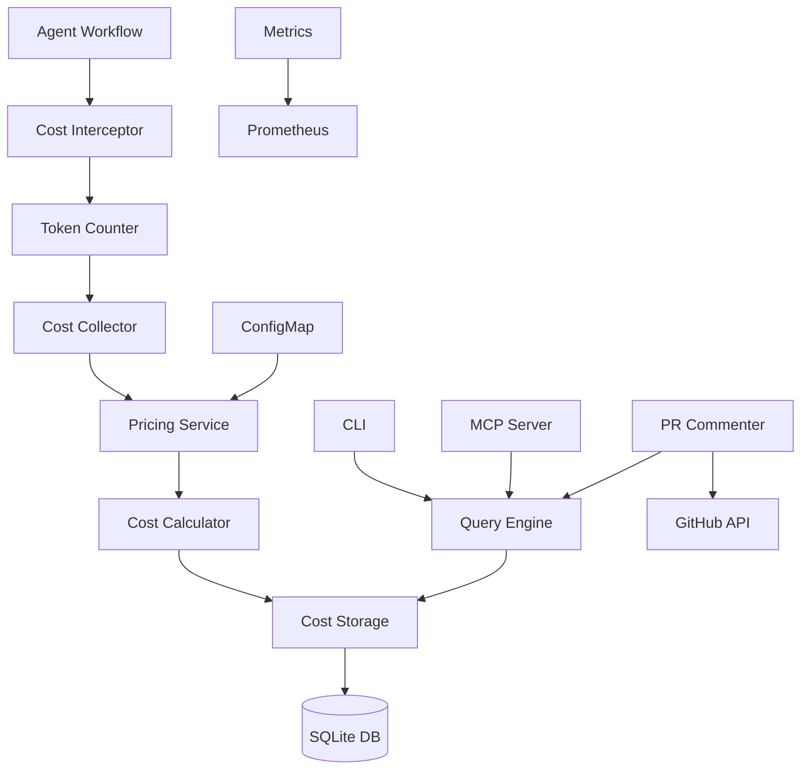
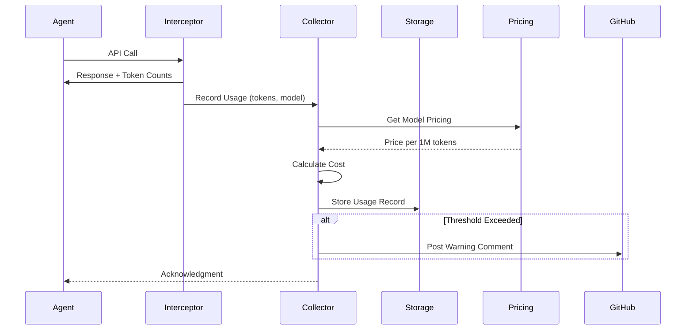

# Cost Reporting System Architecture

## Overview

This architecture provides comprehensive token usage tracking and cost analysis across the CTO platform, enabling per-PR cost visibility, agent efficiency analysis, and budget monitoring.

## Architecture Principles

1. **Minimal Overhead**: Cost tracking should not impact workflow performance
2. **Accurate Attribution**: Every token must be correctly attributed to PR, agent, and stage
3. **Real-time Visibility**: Cost data should be available immediately after execution
4. **Scalable Storage**: System should handle thousands of PRs without degradation
5. **Flexible Pricing**: Support dynamic pricing updates across multiple providers

## System Architecture

### High-Level Design



### Component Interactions



## Component Design

### 1. Cost Interceptor

Wraps AI API calls to capture token usage without modifying agent code.

```rust
// controller/src/costs/interceptor.rs
use std::sync::Arc;
use tokio::sync::Mutex;

pub struct CostInterceptor {
    collector: Arc<CostCollector>,
    context: ExecutionContext,
}

impl CostInterceptor {
    pub fn new(collector: Arc<CostCollector>, context: ExecutionContext) -> Self {
        Self { collector, context }
    }
    
    /// Wrap an AI API call to capture token usage
    pub async fn intercept_call<F, T>(
        &self,
        model: &str,
        call: F,
    ) -> Result<T>
    where
        F: Future<Output = Result<T>>,
        T: TokenizedResponse,
    {
        // Execute the actual API call
        let start = Instant::now();
        let response = call.await?;
        let duration = start.elapsed();
        
        // Extract token counts from response
        let usage = response.usage();
        
        // Record the usage
        self.collector.record_usage(
            self.context.pr_number,
            &self.context.agent,
            model,
            usage.input_tokens,
            usage.output_tokens,
            &self.context.stage,
            self.context.iteration,
        ).await?;
        
        tracing::debug!(
            pr = self.context.pr_number,
            agent = %self.context.agent,
            model = model,
            input_tokens = usage.input_tokens,
            output_tokens = usage.output_tokens,
            duration_ms = duration.as_millis(),
            "Recorded token usage"
        );
        
        Ok(response)
    }
}

#[derive(Clone)]
pub struct ExecutionContext {
    pub pr_number: u64,
    pub agent: String,
    pub stage: String,
    pub iteration: u32,
    pub task_id: Option<String>,
}

pub trait TokenizedResponse {
    fn usage(&self) -> TokenUsage;
}
```

### 2. Cost Collector

Central service for recording and aggregating cost data.

```rust
// controller/src/costs/collector.rs
use std::collections::HashMap;
use std::sync::Arc;
use tokio::sync::RwLock;

pub struct CostCollector {
    config: CostConfig,
    storage: Arc<dyn CostStorage>,
    pricing: Arc<RwLock<HashMap<String, ModelPricing>>>,
    pr_cache: Arc<RwLock<HashMap<u64, PRCostSummary>>>,
}

impl CostCollector {
    pub async fn new(
        config: CostConfig,
        storage: Arc<dyn CostStorage>,
    ) -> Result<Self> {
        let pricing = Self::load_pricing(&config).await?;
        
        Ok(Self {
            config,
            storage,
            pricing: Arc::new(RwLock::new(pricing)),
            pr_cache: Arc::new(RwLock::new(HashMap::new())),
        })
    }
    
    async fn load_pricing(config: &CostConfig) -> Result<HashMap<String, ModelPricing>> {
        let mut pricing = HashMap::new();
        
        for model_pricing in &config.pricing {
            pricing.insert(
                model_pricing.model.clone(),
                model_pricing.clone(),
            );
        }
        
        tracing::info!(
            "Loaded pricing for {} models",
            pricing.len()
        );
        
        Ok(pricing)
    }
    
    pub async fn record_usage(
        &self,
        pr_number: u64,
        agent: &str,
        model: &str,
        input_tokens: u64,
        output_tokens: u64,
        stage: &str,
        iteration: u32,
    ) -> Result<TokenUsage> {
        // Get pricing
        let pricing = self.pricing.read().await;
        let model_pricing = pricing.get(model)
            .ok_or_else(|| anyhow!("No pricing found for model: {}", model))?;
        
        // Calculate cost
        let input_cost = (input_tokens as f64 / 1_000_000.0) 
            * model_pricing.input_cost_per_million;
        let output_cost = (output_tokens as f64 / 1_000_000.0) 
            * model_pricing.output_cost_per_million;
        let total_cost = input_cost + output_cost;
        
        // Create usage record
        let usage = TokenUsage {
            id: Uuid::new_v4().to_string(),
            pr_number,
            agent: agent.to_string(),
            cli: None,
            model: model.to_string(),
            provider: model_pricing.provider.clone(),
            input_tokens,
            output_tokens,
            stage: stage.to_string(),
            iteration,
            task_id: None,
            timestamp: Utc::now(),
            cost_usd: total_cost,
        };
        
        // Store asynchronously
        let storage = Arc::clone(&self.storage);
        let usage_clone = usage.clone();
        tokio::spawn(async move {
            if let Err(e) = storage.insert_usage(&usage_clone).await {
                tracing::error!("Failed to store usage: {}", e);
            }
        });
        
        // Update cache
        self.update_pr_cache(pr_number, &usage).await;
        
        // Check thresholds
        self.check_thresholds(pr_number).await?;
        
        Ok(usage)
    }
    
    async fn update_pr_cache(&self, pr_number: u64, usage: &TokenUsage) {
        let mut cache = self.pr_cache.write().await;
        
        let summary = cache.entry(pr_number).or_insert_with(|| PRCostSummary {
            pr_number,
            total_cost: 0.0,
            total_input_tokens: 0,
            total_output_tokens: 0,
            agent_costs: HashMap::new(),
            stage_costs: HashMap::new(),
            iterations: HashMap::new(),
            started_at: Utc::now(),
            completed_at: None,
        });
        
        // Update totals
        summary.total_cost += usage.cost_usd;
        summary.total_input_tokens += usage.input_tokens;
        summary.total_output_tokens += usage.output_tokens;
        summary.completed_at = Some(usage.timestamp);
        
        // Update agent costs
        let agent_cost = summary.agent_costs
            .entry(usage.agent.clone())
            .or_insert_with(|| AgentCost {
                agent: usage.agent.clone(),
                cost: 0.0,
                input_tokens: 0,
                output_tokens: 0,
                iterations: 0,
            });
        
        agent_cost.cost += usage.cost_usd;
        agent_cost.input_tokens += usage.input_tokens;
        agent_cost.output_tokens += usage.output_tokens;
        agent_cost.iterations = agent_cost.iterations.max(usage.iteration);
        
        // Update stage costs
        let stage_cost = summary.stage_costs
            .entry(usage.stage.clone())
            .or_insert_with(|| StageCost {
                stage: usage.stage.clone(),
                cost: 0.0,
                input_tokens: 0,
                output_tokens: 0,
            });
        
        stage_cost.cost += usage.cost_usd;
        stage_cost.input_tokens += usage.input_tokens;
        stage_cost.output_tokens += usage.output_tokens;
    }
    
    pub async fn get_pr_summary(&self, pr_number: u64) -> Result<PRCostSummary> {
        // Check cache first
        {
            let cache = self.pr_cache.read().await;
            if let Some(summary) = cache.get(&pr_number) {
                return Ok(summary.clone());
            }
        }
        
        // Load from storage
        let usages = self.storage.get_pr_usages(pr_number).await?;
        
        if usages.is_empty() {
            return Err(anyhow!("No cost data found for PR {}", pr_number));
        }
        
        // Build summary
        let mut summary = PRCostSummary {
            pr_number,
            total_cost: 0.0,
            total_input_tokens: 0,
            total_output_tokens: 0,
            agent_costs: HashMap::new(),
            stage_costs: HashMap::new(),
            iterations: HashMap::new(),
            started_at: usages[0].timestamp,
            completed_at: None,
        };
        
        for usage in &usages {
            // Update totals
            summary.total_cost += usage.cost_usd;
            summary.total_input_tokens += usage.input_tokens;
            summary.total_output_tokens += usage.output_tokens;
            
            // Track timestamps
            if usage.timestamp < summary.started_at {
                summary.started_at = usage.timestamp;
            }
            summary.completed_at = Some(usage.timestamp);
            
            // Agent costs
            let agent_cost = summary.agent_costs
                .entry(usage.agent.clone())
                .or_insert_with(|| AgentCost {
                    agent: usage.agent.clone(),
                    cost: 0.0,
                    input_tokens: 0,
                    output_tokens: 0,
                    iterations: 0,
                });
            
            agent_cost.cost += usage.cost_usd;
            agent_cost.input_tokens += usage.input_tokens;
            agent_cost.output_tokens += usage.output_tokens;
            agent_cost.iterations = agent_cost.iterations.max(usage.iteration);
            
            // Stage costs
            let stage_cost = summary.stage_costs
                .entry(usage.stage.clone())
                .or_insert_with(|| StageCost {
                    stage: usage.stage.clone(),
                    cost: 0.0,
                    input_tokens: 0,
                    output_tokens: 0,
                });
            
            stage_cost.cost += usage.cost_usd;
            stage_cost.input_tokens += usage.input_tokens;
            stage_cost.output_tokens += usage.output_tokens;
        }
        
        // Update cache
        {
            let mut cache = self.pr_cache.write().await;
            cache.insert(pr_number, summary.clone());
        }
        
        Ok(summary)
    }
    
    async fn check_thresholds(&self, pr_number: u64) -> Result<()> {
        if !self.config.enabled {
            return Ok(());
        }
        
        let cache = self.pr_cache.read().await;
        let summary = match cache.get(&pr_number) {
            Some(s) => s,
            None => return Ok(()),
        };
        
        if let Some(threshold) = self.config.error_threshold {
            if summary.total_cost >= threshold {
                tracing::error!(
                    pr = pr_number,
                    cost = summary.total_cost,
                    threshold = threshold,
                    "PR exceeded error cost threshold"
                );
                
                if self.config.post_to_pr {
                    // TODO: Post error comment to PR
                }
            }
        }
        
        if let Some(threshold) = self.config.warning_threshold {
            if summary.total_cost >= threshold {
                tracing::warn!(
                    pr = pr_number,
                    cost = summary.total_cost,
                    threshold = threshold,
                    "PR exceeded warning cost threshold"
                );
                
                if self.config.post_to_pr {
                    // TODO: Post warning comment to PR
                }
            }
        }
        
        Ok(())
    }
}
```

### 3. Cost Storage

Persistent storage for cost data with efficient querying.

```rust
// controller/src/costs/storage.rs
use sqlx::{SqlitePool, FromRow};

#[derive(Debug, FromRow)]
struct TokenUsageRow {
    id: String,
    pr_number: i64,
    agent: String,
    cli: Option<String>,
    model: String,
    provider: String,
    input_tokens: i64,
    output_tokens: i64,
    stage: String,
    iteration: i64,
    task_id: Option<String>,
    timestamp: String,
    cost_usd: f64,
}

impl From<TokenUsageRow> for TokenUsage {
    fn from(row: TokenUsageRow) -> Self {
        Self {
            id: row.id,
            pr_number: row.pr_number as u64,
            agent: row.agent,
            cli: row.cli,
            model: row.model,
            provider: row.provider,
            input_tokens: row.input_tokens as u64,
            output_tokens: row.output_tokens as u64,
            stage: row.stage,
            iteration: row.iteration as u32,
            task_id: row.task_id,
            timestamp: DateTime::parse_from_rfc3339(&row.timestamp)
                .unwrap()
                .with_timezone(&Utc),
            cost_usd: row.cost_usd,
        }
    }
}

#[async_trait]
pub trait CostStorage: Send + Sync {
    async fn insert_usage(&self, usage: &TokenUsage) -> Result<()>;
    async fn get_pr_usages(&self, pr_number: u64) -> Result<Vec<TokenUsage>>;
    async fn get_agent_usages(&self, agent: &str, since: DateTime<Utc>) -> Result<Vec<TokenUsage>>;
    async fn get_usages_in_range(&self, start: DateTime<Utc>, end: DateTime<Utc>) -> Result<Vec<TokenUsage>>;
    async fn cleanup_old_records(&self, before: DateTime<Utc>) -> Result<u64>;
}

pub struct SqliteCostStorage {
    pool: SqlitePool,
}

impl SqliteCostStorage {
    pub async fn new(path: &str) -> Result<Self> {
        let connection_string = format!("sqlite:{}", path);
        let pool = SqlitePool::connect(&connection_string).await?;
        
        // Create schema
        sqlx::query(r#"
            CREATE TABLE IF NOT EXISTS token_usage (
                id TEXT PRIMARY KEY,
                pr_number INTEGER NOT NULL,
                agent TEXT NOT NULL,
                cli TEXT,
                model TEXT NOT NULL,
                provider TEXT NOT NULL,
                input_tokens INTEGER NOT NULL,
                output_tokens INTEGER NOT NULL,
                stage TEXT NOT NULL,
                iteration INTEGER NOT NULL,
                task_id TEXT,
                timestamp TEXT NOT NULL,
                cost_usd REAL NOT NULL
            )
        "#)
        .execute(&pool)
        .await?;
        
        // Create indexes for fast queries
        sqlx::query("CREATE INDEX IF NOT EXISTS idx_pr_number ON token_usage(pr_number)")
            .execute(&pool)
            .await?;
        
        sqlx::query("CREATE INDEX IF NOT EXISTS idx_agent ON token_usage(agent)")
            .execute(&pool)
            .await?;
        
        sqlx::query("CREATE INDEX IF NOT EXISTS idx_timestamp ON token_usage(timestamp)")
            .execute(&pool)
            .await?;
        
        sqlx::query("CREATE INDEX IF NOT EXISTS idx_stage ON token_usage(stage)")
            .execute(&pool)
            .await?;
        
        tracing::info!("Initialized SQLite cost storage at {}", path);
        
        Ok(Self { pool })
    }
}

#[async_trait]
impl CostStorage for SqliteCostStorage {
    async fn insert_usage(&self, usage: &TokenUsage) -> Result<()> {
        sqlx::query(r#"
            INSERT INTO token_usage (
                id, pr_number, agent, cli, model, provider,
                input_tokens, output_tokens, stage, iteration,
                task_id, timestamp, cost_usd
            ) VALUES (?, ?, ?, ?, ?, ?, ?, ?, ?, ?, ?, ?, ?)
        "#)
        .bind(&usage.id)
        .bind(usage.pr_number as i64)
        .bind(&usage.agent)
        .bind(&usage.cli)
        .bind(&usage.model)
        .bind(&usage.provider)
        .bind(usage.input_tokens as i64)
        .bind(usage.output_tokens as i64)
        .bind(&usage.stage)
        .bind(usage.iteration as i64)
        .bind(&usage.task_id)
        .bind(usage.timestamp.to_rfc3339())
        .bind(usage.cost_usd)
        .execute(&self.pool)
        .await?;
        
        Ok(())
    }
    
    async fn get_pr_usages(&self, pr_number: u64) -> Result<Vec<TokenUsage>> {
        let records = sqlx::query_as::<_, TokenUsageRow>(
            "SELECT * FROM token_usage WHERE pr_number = ? ORDER BY timestamp"
        )
        .bind(pr_number as i64)
        .fetch_all(&self.pool)
        .await?;
        
        Ok(records.into_iter().map(|r| r.into()).collect())
    }
    
    async fn get_agent_usages(&self, agent: &str, since: DateTime<Utc>) -> Result<Vec<TokenUsage>> {
        let records = sqlx::query_as::<_, TokenUsageRow>(
            "SELECT * FROM token_usage WHERE agent = ? AND timestamp >= ? ORDER BY timestamp"
        )
        .bind(agent)
        .bind(since.to_rfc3339())
        .fetch_all(&self.pool)
        .await?;
        
        Ok(records.into_iter().map(|r| r.into()).collect())
    }
    
    async fn get_usages_in_range(
        &self,
        start: DateTime<Utc>,
        end: DateTime<Utc>,
    ) -> Result<Vec<TokenUsage>> {
        let records = sqlx::query_as::<_, TokenUsageRow>(
            "SELECT * FROM token_usage WHERE timestamp >= ? AND timestamp <= ? ORDER BY timestamp"
        )
        .bind(start.to_rfc3339())
        .bind(end.to_rfc3339())
        .fetch_all(&self.pool)
        .await?;
        
        Ok(records.into_iter().map(|r| r.into()).collect())
    }
    
    async fn cleanup_old_records(&self, before: DateTime<Utc>) -> Result<u64> {
        let result = sqlx::query(
            "DELETE FROM token_usage WHERE timestamp < ?"
        )
        .bind(before.to_rfc3339())
        .execute(&self.pool)
        .await?;
        
        Ok(result.rows_affected())
    }
}
```

### 4. Query Engine

Provides flexible querying and aggregation of cost data.

```rust
// controller/src/costs/query.rs
pub struct CostQueryEngine {
    storage: Arc<dyn CostStorage>,
}

impl CostQueryEngine {
    pub async fn query_pr_costs(&self, pr_number: u64) -> Result<PRCostReport> {
        let usages = self.storage.get_pr_usages(pr_number).await?;
        self.build_pr_report(pr_number, usages)
    }
    
    pub async fn query_agent_costs(
        &self,
        agent: &str,
        since: DateTime<Utc>,
    ) -> Result<AgentCostReport> {
        let usages = self.storage.get_agent_usages(agent, since).await?;
        self.build_agent_report(agent, usages)
    }
    
    pub async fn compare_prs(&self, pr_numbers: &[u64]) -> Result<PRComparisonReport> {
        let mut reports = Vec::new();
        
        for &pr_number in pr_numbers {
            let report = self.query_pr_costs(pr_number).await?;
            reports.push(report);
        }
        
        Ok(PRComparisonReport { reports })
    }
    
    fn build_pr_report(&self, pr_number: u64, usages: Vec<TokenUsage>) -> Result<PRCostReport> {
        // Aggregate costs
        // Build detailed breakdown
        // Calculate percentages
        // Format output
        
        todo!("Implement PR report builder")
    }
    
    fn build_agent_report(&self, agent: &str, usages: Vec<TokenUsage>) -> Result<AgentCostReport> {
        // Group by PR
        // Calculate totals
        // Identify trends
        // Build report
        
        todo!("Implement agent report builder")
    }
}
```

### 5. PR Comment Poster

Posts cost summaries to GitHub PR comments.

```rust
// controller/src/costs/commenter.rs
pub struct PRCostCommenter {
    github_client: Arc<GithubClient>,
    query_engine: Arc<CostQueryEngine>,
}

impl PRCostCommenter {
    pub async fn post_cost_summary(&self, pr_number: u64) -> Result<()> {
        let report = self.query_engine.query_pr_costs(pr_number).await?;
        let comment_body = self.format_comment(&report)?;
        
        self.github_client
            .post_pr_comment(pr_number, &comment_body)
            .await?;
        
        Ok(())
    }
    
    fn format_comment(&self, report: &PRCostReport) -> Result<String> {
        let mut comment = String::new();
        
        comment.push_str("## 💰 Cost Report\n\n");
        comment.push_str(&format!("**Total Cost**: ${:.2}\n\n", report.total_cost));
        
        // Agent breakdown table
        comment.push_str("### Breakdown by Agent\n");
        comment.push_str("| Agent | Iterations | Input Tokens | Output Tokens | Cost |\n");
        comment.push_str("|-------|-----------|--------------|---------------|------|\n");
        
        for (agent, cost) in &report.agent_costs {
            comment.push_str(&format!(
                "| {} | {} | {:,} | {:,} | ${:.2} |\n",
                agent, cost.iterations, cost.input_tokens,
                cost.output_tokens, cost.cost
            ));
        }
        
        // Stage breakdown
        comment.push_str("\n### Breakdown by Stage\n");
        comment.push_str("| Stage | Cost | % of Total |\n");
        comment.push_str("|-------|------|------------|\n");
        
        for (stage, cost) in &report.stage_costs {
            let percentage = (cost.cost / report.total_cost) * 100.0;
            comment.push_str(&format!(
                "| {} | ${:.2} | {:.1}% |\n",
                stage, cost.cost, percentage
            ));
        }
        
        Ok(comment)
    }
}
```

## CLI Integration

### Cost Commands

```rust
// controller/src/cli/costs.rs
#[derive(Subcommand)]
pub enum CostsCommand {
    /// Show costs for a PR
    Show {
        #[arg(long)]
        pr: u64,
        
        #[arg(long)]
        detailed: bool,
    },
    
    /// Show cost summary
    Summary {
        #[arg(long)]
        month: Option<String>,
        
        #[arg(long)]
        since: Option<String>,
    },
    
    /// Show agent-specific costs
    Agent {
        #[arg(long)]
        name: String,
        
        #[arg(long)]
        days: Option<u32>,
        
        #[arg(long)]
        since: Option<String>,
    },
    
    /// Compare costs across PRs
    Compare {
        #[arg(long, value_delimiter = ',')]
        prs: Vec<u64>,
    },
    
    /// Export cost data
    Export {
        #[arg(long)]
        output: PathBuf,
        
        #[arg(long)]
        since: Option<String>,
        
        #[arg(long)]
        format: Option<String>,
    },
}

pub async fn handle_costs_command(cmd: CostsCommand, query_engine: Arc<CostQueryEngine>) -> Result<()> {
    match cmd {
        CostsCommand::Show { pr, detailed } => {
            let report = query_engine.query_pr_costs(pr).await?;
            print_pr_report(&report, detailed)?;
        }
        
        CostsCommand::Agent { name, days, since } => {
            let since_date = parse_since_date(days, since)?;
            let report = query_engine.query_agent_costs(&name, since_date).await?;
            print_agent_report(&report)?;
        }
        
        // ... other commands
    }
    
    Ok(())
}
```

## Monitoring and Observability

### Prometheus Metrics

```rust
use prometheus::{register_histogram_vec, register_int_counter_vec, register_gauge_vec};

lazy_static! {
    static ref COST_RECORDING_DURATION: HistogramVec = register_histogram_vec!(
        "cost_recording_duration_seconds",
        "Time to record cost data",
        &["agent", "stage"]
    ).unwrap();
    
    static ref TOTAL_COST_USD: GaugeVec = register_gauge_vec!(
        "total_cost_usd",
        "Total cost in USD",
        &["pr", "agent", "stage"]
    ).unwrap();
    
    static ref TOKEN_USAGE_TOTAL: IntCounterVec = register_int_counter_vec!(
        "token_usage_total",
        "Total tokens used",
        &["agent", "model", "type"]
    ).unwrap();
    
    static ref COST_THRESHOLD_VIOLATIONS: IntCounterVec = register_int_counter_vec!(
        "cost_threshold_violations_total",
        "Number of cost threshold violations",
        &["type"]
    ).unwrap();
}
```

## Testing Strategy

### Unit Tests

```rust
#[cfg(test)]
mod tests {
    use super::*;
    
    #[tokio::test]
    async fn test_cost_calculation() {
        let pricing = ModelPricing {
            model: "claude-3-7-sonnet-20250219".to_string(),
            provider: "anthropic".to_string(),
            input_cost_per_million: 3.0,
            output_cost_per_million: 15.0,
            updated_at: Utc::now(),
        };
        
        let input_tokens = 10_000;
        let output_tokens = 5_000;
        
        let expected_cost = (10_000.0 / 1_000_000.0) * 3.0
            + (5_000.0 / 1_000_000.0) * 15.0;
        
        assert_eq!(expected_cost, 0.105);
    }
    
    #[tokio::test]
    async fn test_pr_summary_aggregation() {
        let storage = Arc::new(MockCostStorage::new());
        let collector = CostCollector::new(test_config(), storage).await.unwrap();
        
        // Record multiple usages
        collector.record_usage(123, "rex", "claude-sonnet", 1000, 500, "code", 1).await.unwrap();
        collector.record_usage(123, "rex", "claude-sonnet", 2000, 1000, "code", 2).await.unwrap();
        collector.record_usage(123, "cleo", "claude-sonnet", 500, 250, "lint", 1).await.unwrap();
        
        // Get summary
        let summary = collector.get_pr_summary(123).await.unwrap();
        
        assert_eq!(summary.total_input_tokens, 3500);
        assert_eq!(summary.total_output_tokens, 1750);
        assert_eq!(summary.agent_costs.len(), 2);
    }
}
```

## Deployment Configuration

### Kubernetes Resources

```yaml
# Cost collector deployment
apiVersion: apps/v1
kind: Deployment
metadata:
  name: cost-collector
  namespace: cto
spec:
  replicas: 1
  selector:
    matchLabels:
      app: cost-collector
  template:
    metadata:
      labels:
        app: cost-collector
    spec:
      containers:
      - name: collector
        image: ghcr.io/5dlabs/cost-collector:latest
        env:
        - name: COST_DB_PATH
          value: /cost-data/costs.db
        - name: COST_CONFIG_PATH
          value: /config/cost-config.json
        volumeMounts:
        - name: cost-data
          mountPath: /cost-data
        - name: config
          mountPath: /config
      volumes:
      - name: cost-data
        persistentVolumeClaim:
          claimName: cost-database-pvc
      - name: config
        configMap:
          name: cost-pricing-config
```

This architecture provides a comprehensive, scalable, and performant cost reporting system that integrates seamlessly with the existing CTO platform infrastructure.

