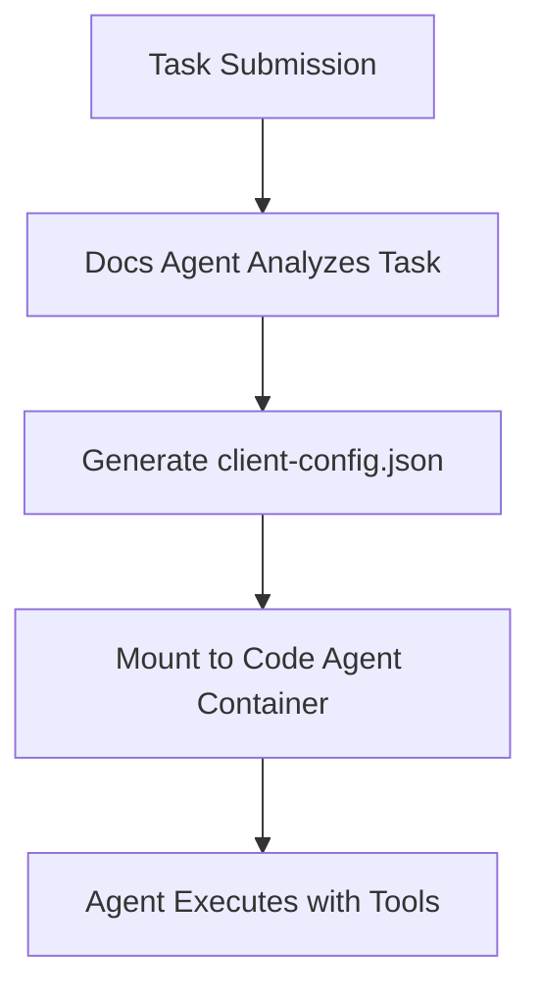
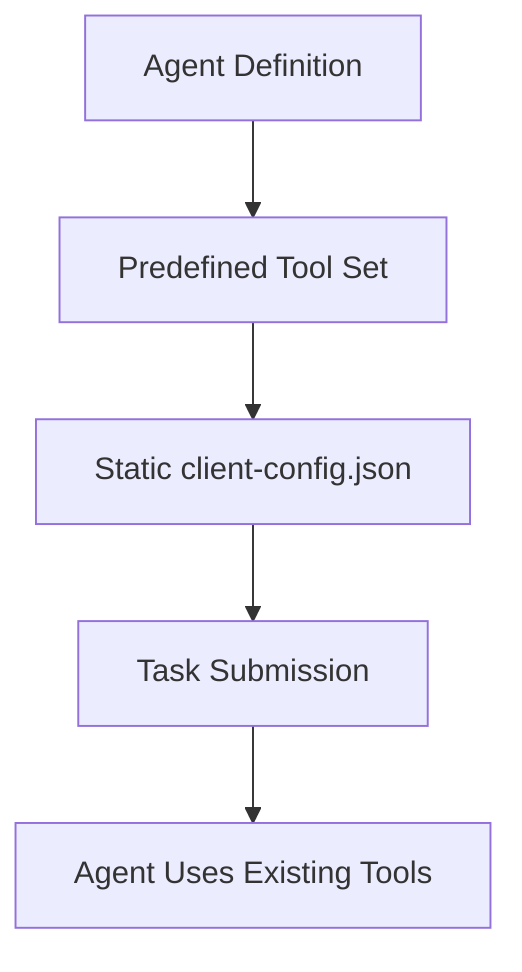

# Agent-Centric Tools Configuration Design

## Overview

This document outlines a redesign of the tools (MCP client) configuration system, moving from task-based dynamic generation to agent-centric static configuration. This approach treats tools as inherent capabilities of agents, similar to how employees have their standard toolsets.

## Problem Statement

### Current System Issues

1. **Token Inefficiency**: Each task requires the docs agent to analyze requirements and generate a custom `client-config.json`, consuming significant AI tokens
2. **Redundancy**: Similar tasks often result in identical or near-identical tool configurations
3. **Complexity**: The dynamic generation requires complex handlebars templates and runtime processing
4. **Inconsistency**: Same agent might receive different tools for similar tasks due to generation variability
5. **Maintenance Overhead**: Changes to tool requirements require updating templates and regeneration logic

### Current Flow



## Proposed Solution

### Agent-Centric Tool Configuration

Transform the tool configuration from a task-driven model to an agent-driven model where each agent has a predefined set of tools based on their role and expertise.

### New Flow



## Design Details

### 1. Agent Tool Profiles

Each agent will have a tool profile that defines their standard toolset:

```yaml
# In values.yaml or agent-config.yaml
agents:
  morgan:
    name: "Morgan"
    role: "Product Manager & Documentation Specialist"
    expertise: ["documentation", "requirements", "planning"]
    tools:
      remote:
        - "brave-search_brave_web_search"
        - "memory_create_entities"
        - "memory_query_entities"
        - "github_create_issue"
        - "github_list_issues"
      local:
        filesystem:
          - "read_file"
          - "write_file"
          - "list_directory"
          - "create_directory"
          - "edit_file"
        git:
          - "git_status"
          - "git_diff"
          - "git_commit"
      custom:
        - name: "task-manager"
          command: "npx"
          args: ["task-master-ai"]

  rex:
    name: "Rex"
    role: "Senior Backend Architect"
    expertise: ["backend", "architecture", "apis"]
    tools:
      remote:
        - "rustdocs_query_rust_docs"
        - "kubernetes_listResources"
        - "kubernetes_describeResource"
        - "kubernetes_createResource"
        - "terraform_plan"
        - "terraform_apply"
      local:
        filesystem:
          - "read_file"
          - "write_file"
          - "list_directory"
          - "edit_file"
          - "search_files"
        database:
          - "postgres_query"
          - "postgres_schema"

  cleo:
    name: "Cleo"
    role: "Code Quality Specialist"
    expertise: ["testing", "quality", "ci/cd"]
    tools:
      remote:
        - "github_create_check"
        - "github_update_check"
        - "sonarqube_analyze"
      local:
        filesystem:
          - "read_file"
          - "write_file"
          - "run_tests"
        linting:
          - "eslint_check"
          - "prettier_format"
          - "clippy_check"
```

### 2. Tool Inheritance and Composition

Support tool inheritance for common patterns:

```yaml
# Tool templates/base configurations
toolProfiles:
  base:
    # All agents get these by default
    remote:
      - "memory_create_entities"
      - "memory_query_entities"
    local:
      filesystem:
        - "read_file"
        - "write_file"
        - "list_directory"

  developer:
    # Extends base
    extends: base
    remote:
      - "rustdocs_query_rust_docs"
      - "github_create_pr"
    local:
      filesystem:
        - "edit_file"
        - "search_files"
      git:
        - "git_status"
        - "git_diff"

  infrastructure:
    # Extends developer
    extends: developer
    remote:
      - "kubernetes_listResources"
      - "kubernetes_describeResource"
      - "terraform_plan"
```

### 3. Client Config Generation

Transform agent definitions into `client-config.json` at deployment time:

```rust
// In controller or MCP server
impl AgentConfig {
    fn generate_client_config(&self) -> ClientConfig {
        let mut config = ClientConfig::default();

        // Add remote tools
        config.remote_tools = self.tools.remote.clone();

        // Configure local servers
        if !self.tools.local.filesystem.is_empty() {
            config.local_servers.insert(
                "filesystem".to_string(),
                LocalServer {
                    command: "npx".to_string(),
                    args: vec![
                        "-y".to_string(),
                        "@modelcontextprotocol/server-filesystem".to_string(),
                        "/workspace".to_string()
                    ],
                    tools: self.tools.local.filesystem.clone(),
                    working_directory: "project_root".to_string(),
                }
            );
        }

        // Add other local servers similarly
        config
    }
}
```

### 4. Dynamic Tool Augmentation

Support task-specific tool additions when necessary:

```yaml
# Task definition can request additional tools
task:
  id: 42
  agent: "rex"
  additionalTools:
    remote:
      - "aws_s3_upload"  # Special tool needed for this task
    local:
      custom:
        - name: "migration-tool"
          command: "./scripts/migrate.sh"
```

### 5. Tool Capability Discovery

Agents can query their available tools:

```typescript
// MCP endpoint for tool discovery
interface GetAgentCapabilities {
  agent: string;
  includeDescriptions?: boolean;
}

interface AgentCapabilities {
  agent: string;
  tools: {
    remote: ToolInfo[];
    local: {
      [server: string]: ToolInfo[];
    };
  };
  canAugment: boolean;  // Whether task-specific tools can be added
}
```

## Implementation Plan

### Phase 1: Agent Tool Profiles (Week 1)

1. **Update Agent ConfigMap Structure**
   ```yaml
   # controller/templates/agents-configmap.yaml
   apiVersion: v1
   kind: ConfigMap
   metadata:
     name: agents-tools-config
   data:
     morgan-tools.yaml: |
       {{ .Values.agents.morgan.tools | toYaml }}
     rex-tools.yaml: |
       {{ .Values.agents.rex.tools | toYaml }}

```

2. **Create Tool Profile Templates**
   - Define base profiles in `values.yaml`
   - Create inheritance resolver
   - Validate tool names against catalog

### Phase 2: Client Config Generation (Week 1-2)

1. **Controller Updates**
   ```rust
   // controller/src/crds/code_run.rs
   impl CodeRunController {
       async fn create_client_config(
           &self,
           agent: &str,
           task_tools: Option<TaskTools>
       ) -> Result<ClientConfig> {
           let agent_config = self.get_agent_config(agent).await?;
           let mut client_config = agent_config.generate_client_config();

           // Merge task-specific tools if provided
           if let Some(task_tools) = task_tools {
               client_config.merge(task_tools);
           }

           Ok(client_config)
       }
   }

```

2. **Remove Dynamic Generation from Docs Agent**
   - Remove handlebars templates for client-config generation
   - Update docs agent to focus on documentation tasks only

### Phase 3: Migration Support (Week 2)

1. **Backward Compatibility**
   ```rust
   // Support both old and new formats during migration
   enum ConfigSource {
       Dynamic(String),     // Old: from task files
       Static(AgentTools),  // New: from agent config
   }

```

2. **Migration Script**
   ```bash
   #!/bin/bash
   # scripts/migrate-tool-configs.sh

   # Extract common tool patterns from existing configs
   # Generate recommended agent tool profiles
   # Update values.yaml with new structure

```

### Phase 4: Tool Discovery & Management (Week 3)

1. **MCP Tool for Tool Management**
   ```rust
   Tool {
       name: "manage_agent_tools",
       description: "Add, remove, or list tools for an agent",
       parameters: json!({
           "action": {
               "type": "string",
               "enum": ["add", "remove", "list"]
           },
           "agent": {
               "type": "string"
           },
           "tools": {
               "type": "array",
               "items": {"type": "string"}
           }
       })
   }

```

2. **Web UI for Tool Configuration** (Future)
   - Visual tool selector
   - Drag-and-drop tool assignment
   - Tool usage analytics

## Benefits

### Immediate Benefits

1. **Token Savings**: Eliminate ~500-1000 tokens per task for tool configuration generation
2. **Consistency**: Same agent always has same core tools
3. **Speed**: No generation delay for client-config.json
4. **Simplicity**: Clearer mental model - agents have tools like employees
5. **Maintainability**: Centralized tool configuration in values.yaml

### Long-term Benefits

1. **Tool Usage Analytics**: Track which tools agents actually use
2. **Optimization**: Remove unused tools, add frequently requested ones
3. **Specialization**: Create highly specialized agent variants
4. **Team Composition**: Design agent teams with complementary toolsets

## Configuration Examples

### Example 1: Minimal Documentation Agent

```yaml
agents:
  lexie:
    name: "Lexie"
    role: "Documentation Writer"
    tools:
      remote:
        - "brave-search_brave_web_search"
      local:
        filesystem:
          - "read_file"
          - "write_file"
          - "list_directory"
```

Generated `client-config.json`:
```json
{
  "remoteTools": [
    "brave-search_brave_web_search"
  ],
  "localServers": {
    "filesystem": {
      "command": "npx",
      "args": ["-y", "@modelcontextprotocol/server-filesystem", "/workspace"],
      "tools": ["read_file", "write_file", "list_directory"],
      "workingDirectory": "project_root"
    }
  }
}
```

### Example 2: Full-Stack Developer Agent

```yaml
agents:
  nova:
    name: "Nova"
    role: "Full-Stack Developer"
    extends: developer  # Inherit from developer profile
    tools:
      remote:
        - "rustdocs_query_rust_docs"
        - "mdn_web_docs_search"
        - "npm_package_search"
        - "github_create_pr"
        - "github_review_pr"
      local:
        filesystem:
          - "read_file"
          - "write_file"
          - "edit_file"
          - "search_files"
          - "create_directory"
        git:
          - "git_status"
          - "git_diff"
          - "git_commit"
          - "git_push"
        npm:
          - "npm_install"
          - "npm_run"
          - "npm_test"
```

### Example 3: Infrastructure Specialist

```yaml
agents:
  terra:
    name: "Terra"
    role: "Infrastructure Engineer"
    tools:
      remote:
        - "kubernetes_*"  # All Kubernetes tools
        - "terraform_*"   # All Terraform tools
        - "aws_*"        # All AWS tools
        - "prometheus_query"
        - "grafana_dashboard"
      local:
        filesystem:
          - "read_file"
          - "write_file"
          - "edit_file"
        kubectl:
          command: "kubectl"
          workingDirectory: "/workspace"
        helm:
          command: "helm"
          workingDirectory: "/workspace"
```

## Migration Strategy

### Step 1: Analyze Existing Patterns
```bash
# Analyze all existing client-config.json files
find . -name "client-config.json" -exec jq '.remoteTools' {} \; | \
  jq -s 'flatten | group_by(.) | map({tool: .[0], count: length}) | sort_by(.count) | reverse'
```

### Step 2: Create Default Profiles
Based on analysis, create sensible defaults for each agent role

### Step 3: Gradual Rollout
1. Start with new agents using static configs
2. Migrate existing agents one at a time
3. Keep dynamic generation as fallback
4. Remove dynamic generation after full migration

### Step 4: Optimization
After migration, analyze actual tool usage and optimize profiles

## Tool Catalog Integration

Integrate with existing tool catalog for validation:

```rust
impl ToolValidator {
    fn validate_agent_tools(agent: &AgentConfig) -> Result<()> {
        let catalog = ToolCatalog::load()?;

        for tool in &agent.tools.remote {
            if !catalog.has_remote_tool(tool) {
                return Err(format!("Unknown remote tool: {}", tool));
            }
        }

        // Validate local tools similarly
        Ok(())
    }
}
```

## Security Considerations

1. **Tool Access Control**: Some tools may require additional permissions
2. **Sensitive Tools**: Mark tools that access secrets or production systems
3. **Audit Logging**: Track tool usage for security auditing
4. **Tool Sandboxing**: Isolate risky tools in separate processes

## Success Metrics

1. **Token Reduction**: Measure token savings per task
2. **Configuration Time**: Time to prepare agent for task execution
3. **Tool Hit Rate**: Percentage of tasks that use only predefined tools
4. **Agent Efficiency**: Task completion time with static vs dynamic tools
5. **Maintenance Burden**: Time spent managing tool configurations

## Future Enhancements

### 1. Smart Tool Recommendation
```rust
// Analyze task history to recommend tools
async fn recommend_tools_for_agent(
    agent: &str,
    task_history: &[Task]
) -> Vec<String> {
    // ML model or heuristics to suggest tools
}
```

### 2. Tool Usage Telemetry
```yaml
# Track actual tool usage
telemetry:
  morgan:
    tools_used:
      brave-search_brave_web_search: 145
      memory_create_entities: 89
      read_file: 1247
    tools_never_used:
      - terraform_plan
      - kubernetes_delete
```

### 3. Dynamic Tool Loading
```rust
// Load tools on-demand based on task requirements
impl DynamicToolLoader {
    async fn load_tool_if_needed(
        &self,
        tool: &str,
        agent: &mut Agent
    ) -> Result<()> {
        if !agent.has_tool(tool) && self.is_safe_to_add(tool, agent) {
            agent.add_tool(tool).await?;
        }
        Ok(())
    }
}
```

### 4. Tool Marketplace
- Central repository of MCP tools
- Agents can "shop" for new capabilities
- Community-contributed tools
- Tool ratings and reviews

## Conclusion

Moving to agent-centric tool configuration will significantly reduce token usage, improve consistency, and simplify the overall system. By treating tools as inherent capabilities of agents rather than task-specific requirements, we create a more intuitive and maintainable system that scales better with the growing number of agents and tasks.

The migration can be done gradually, maintaining backward compatibility while realizing immediate benefits from reduced token usage and faster task initialization.
