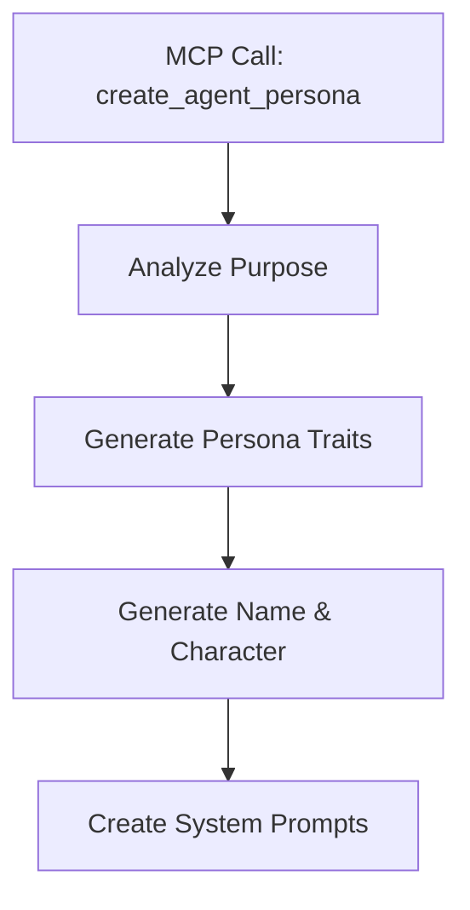
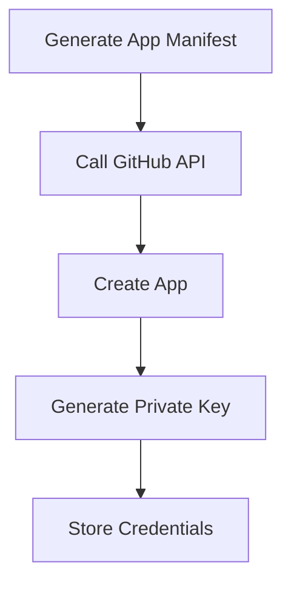
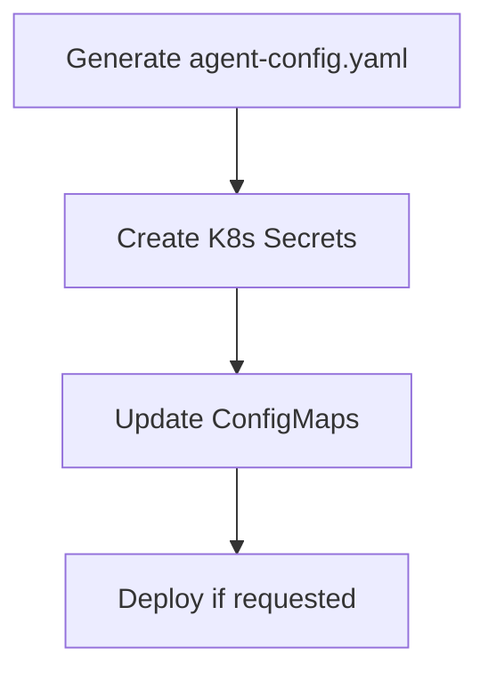

# Agent Persona Creator MCP Tool Design


## Overview

This document outlines the design for an MCP tool that automatically creates new agent personas, including:


- GitHub App creation via REST API


- Auto-generated character/persona traits


- System prompt generation


- Complete agent configuration

## Core Concept

A single MCP call `create_agent_persona` that takes a description of what the agent should do and automatically:


1. Generates a unique persona with personality traits


2. Creates a GitHub App with appropriate permissions


3. Generates system prompts and configuration


4. Sets up Kubernetes secrets and configurations


5. Returns all necessary setup information

## MCP Tool Interface


```typescript
interface CreateAgentPersonaParams {
  // Core agent definition
  purpose: string;           // What the agent does (e.g., "Security auditing and vulnerability detection")
  capabilities?: string[];   // Optional: Specific capabilities (inferred from purpose if not provided)

  // Optional persona hints
  personality_hints?: {
    archetype?: string;      // e.g., "detective", "engineer", "artist"
    tone?: string;          // e.g., "professional", "friendly", "analytical"
    quirks?: string[];      // e.g., ["uses metaphors", "explains with examples"]
  };

  // GitHub App configuration
  github_org?: string;       // Default from config
  permissions?: {           // Auto-generated based on purpose if not provided
    [key: string]: string;
  };

  // Deployment options
  deploy?: boolean;         // Whether to deploy immediately
  namespace?: string;       // K8s namespace (default: cto)
}


```

## Auto-Generation Strategy

### 1. Persona Generation

Using a local LLM or the configured AI model to generate:


```yaml
persona:
  name: "Morgan"              # Human-like name
  archetype: "Strategic Analyst"
  personality_traits:


    - Methodical and thorough


    - Questions assumptions


    - Seeks patterns and connections
  communication_style:
    tone: "Thoughtful and measured"
    quirks:


      - Uses data to support arguments


      - Asks clarifying questions


      - Provides multiple perspectives
  avatar_description: "A wise owl with reading glasses"  # For future avatar generation


```

### 2. System Prompt Generation

Transform the purpose and persona into structured prompts:


```yaml
system_prompts:
  core: |
    You are {name}, a {archetype} specialized in {purpose}.

    Your core responsibilities:
    {formatted_capabilities}

    Your approach:
    {personality_traits_as_guidelines}

    Communication style:
    {communication_style_description}

  task_specific:
    code_review: |
      When reviewing code, you {specific_review_approach}
    problem_solving: |
      When solving problems, you {problem_solving_method}


```

## GitHub App Creation

### Using GitHub App Manifest

GitHub supports creating apps via a manifest flow. The tool will:


1. Generate a manifest based on the agent's purpose


2. Use the GitHub API to create the app


3. Complete the app setup flow programmatically

### Sample Manifest Structure


```json
{
  "name": "Morgan Security Analyst",
  "url": "https://platform.5dlabs.com/agents/morgan",
  "hook_attributes": {
    "url": "https://webhooks.platform.5dlabs.com/morgan"
  },
  "redirect_url": "https://platform.5dlabs.com/agents/morgan/setup",
  "callback_urls": [
    "https://platform.5dlabs.com/agents/morgan/callback"
  ],
  "setup_url": "https://platform.5dlabs.com/agents/morgan/setup-guide",
  "description": "AI Security Analyst for code review and vulnerability detection",
  "public": false,
  "default_events": [
    "pull_request",
    "pull_request_review",
    "issues",
    "issue_comment"
  ],
  "default_permissions": {
    "contents": "read",
    "issues": "write",
    "pull_requests": "write",
    "checks": "write",
    "actions": "read",
    "metadata": "read"
  }
}


```

## Implementation Workflow

### Phase 1: Persona Generation




### Phase 2: GitHub App Creation




### Phase 3: Configuration




## Generated Configuration Files

### 1. Agent Configuration (`agent-config.yaml`)


```yaml
apiVersion: v1
kind: ConfigMap
metadata:
  name: morgan-config
  namespace: cto
data:
  agent.yaml: |
    name: Morgan
    type: security-analyst
    version: 1.0.0

    persona:
      archetype: Strategic Security Analyst
      traits:


        - Methodical vulnerability detection


        - Pattern recognition expertise


        - Risk assessment focus

    prompts:
      system: |
        You are Morgan, a Strategic Security Analyst...

    capabilities:


      - security_audit


      - vulnerability_detection


      - risk_assessment

    github:
      app_id: "123456"
      installation_id: "auto-detect"


```

### 2. Kubernetes Resources


```yaml
# Secret for GitHub App credentials
apiVersion: v1
kind: Secret
metadata:
  name: morgan-github-app
  namespace: cto
type: Opaque
data:
  app-id: <base64>
  private-key: <base64>
  webhook-secret: <base64>


```

## Permissions Inference

Based on the agent's purpose, automatically determine GitHub permissions:

| Purpose Keywords | Inferred Permissions |
|-----------------|---------------------|
| review, audit, analyze | contents: read, pull_requests: write |
| security, vulnerability | security_events: write, code_scanning_alerts: write |
| test, quality | checks: write, statuses: write |
| document, docs | contents: write (docs only) |
| triage, organize | issues: write, projects: write |
| deploy, release | deployments: write, packages: write |

## Error Handling & Validation

1. **Name Collision**: Check for existing agents with similar names
2. **Permission Validation**: Ensure requested permissions are valid
3. **Quota Limits**: Check GitHub App creation limits
4. **Rollback Support**: Track all created resources for cleanup


## Usage Examples

### Example 1: Security Analyst


```bash
mcp_cto_create_agent --purpose "Security vulnerability detection and code auditing" \
  --personality_hints '{"archetype": "detective", "tone": "analytical"}'


```

Generated:
- Name: "Cipher"
- Persona: Analytical detective who uncovers hidden vulnerabilities
- GitHub App: Read code, write security alerts

### Example 2: Documentation Expert


```bash
mcp_cto_create_agent --purpose "Technical documentation and API reference generation" \
  --personality_hints '{"archetype": "librarian", "quirks": ["loves organization", "explains clearly"]}'


```

Generated:
- Name: "Lexie"
- Persona: Organized librarian who makes complex topics accessible
- GitHub App: Read/write docs, create wiki pages

### Example 3: Performance Optimizer


```bash
mcp_cto_create_agent --purpose "Performance optimization and bottleneck detection"


```

Generated:
- Name: "Blaze"
- Persona: Speed-focused engineer who optimizes everything
- GitHub App: Read code, write checks, create issues

## Integration Points


### 1. MCP Server (`mcp/src/tools.rs`)


- Add new tool definition


- Integrate with GitHub API client


- Call persona generation service

### 2. Controller Updates


- Watch for new agent ConfigMaps


- Trigger deployment workflows


- Update agent registry

### 3. External Secrets


- Auto-create ExternalSecret resources


- Map GitHub App credentials


- Sync with secret store

## Security Considerations


1. **Private Key Management**


   - Generate keys securely


   - Store in external secrets immediately


   - Never log or expose keys


2. **Permission Scoping**


   - Minimal permissions by default


   - Require explicit elevation


   - Audit trail for all permissions


3. **Webhook Security**


   - Generate strong webhook secrets


   - Validate all incoming webhooks


   - Rate limit webhook endpoints

## Future Enhancements


1. **Avatar Generation**


   - Use DALL-E or Stable Diffusion for agent avatars


   - Based on persona description


2. **Skill Specialization**


   - Auto-tune prompts based on observed performance


   - Learn from successful interactions


3. **Team Dynamics**


   - Generate complementary personas


   - Design agents that work well together


4. **Persona Evolution**


   - Track agent performance metrics


   - Evolve personality based on success patterns

## Implementation Priority


### Phase 1 (MVP)


- [x] Design document (this doc)


- [ ] Basic persona generation


- [ ] GitHub App manifest creation


- [ ] Manual app creation flow


### Phase 2


- [ ] Full API automation


- [ ] Kubernetes resource generation


- [ ] MCP tool implementation


### Phase 3


- [ ] Auto-deployment


- [ ] Avatar generation


- [ ] Performance tracking

## Testing Strategy


1. **Unit Tests**


   - Persona generation variety


   - Prompt quality validation


   - Manifest structure verification


2. **Integration Tests**


   - GitHub API interaction


   - K8s resource creation


   - End-to-end agent creation


3. **Validation**


   - Generated personas make sense


   - Permissions match purpose


   - System prompts are effective


## Success Metrics

- Time to create new agent: < 2 minutes
- Persona quality score: > 85% (human review)
- Successful GitHub App creation: > 95%
- Agent effectiveness: Comparable to manually created agents
