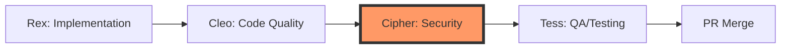

# Cipher Agent Implementation Guide

## Overview

This document provides comprehensive implementation details for integrating the **Cipher** security agent into the multi-agent workflow orchestration platform. Cipher is the security specialist agent responsible for vulnerability scanning, dependency analysis, and security best practices validation.

**Current Agent Flow:**
```
Rex (Implementation) → Cleo (Code Quality) → Tess (QA/Testing)
```

**Target Agent Flow:**
```
Rex (Implementation) → Cleo (Code Quality) → Cipher (Security) → Tess (QA/Testing)
```

## Table of Contents

- [Current Status](#current-status)
- [Agent Responsibilities](#agent-responsibilities)
- [Architecture Overview](#architecture-overview)
- [Implementation Requirements](#implementation-requirements)
- [Technical Specifications](#technical-specifications)
- [Integration Steps](#integration-steps)
- [Testing Plan](#testing-plan)
- [Rollout Strategy](#rollout-strategy)

## Current Status

### ✅ Already Implemented

1. **Configuration Files**
   - `cto-config.json`: Cipher agent configuration with GitHub App `5DLabs-Cipher`
   - `cto-config-example.json`: Example configuration showing Cipher setup
   - `cto-config.template.json`: Template with Cipher placeholders

2. **Infrastructure**
   - `infra/secret-store/agent-secrets-external-secrets.yaml`: Cipher GitHub App secrets
   - `infra/charts/controller/values.yaml`: Cipher agent values and system prompt placeholder

3. **Documentation**
   - `README.md`: Cipher persona description and workflow position
   - `docs/agent-specific-client-config.md`: Cipher tool configuration examples

4. **Controller Code**
   - `controller/src/tasks/code/templates.rs`: Cipher agent name mapping (`5DLabs-Cipher` → `cipher`)
   - `controller/src/tasks/security/mod.rs`: Security task module recognizes Cipher

### ❌ Missing Components

1. **Agent Templates** (PRIMARY GAP)
   - Missing: `container-cipher.sh.hbs` for all CLI types:
     - `/infra/charts/controller/agent-templates/code/claude/container-cipher.sh.hbs`
     - `/infra/charts/controller/agent-templates/code/codex/container-cipher.sh.hbs`
     - `/infra/charts/controller/agent-templates/code/factory/container-cipher.sh.hbs`
     - `/infra/charts/controller/agent-templates/code/opencode/container-cipher.sh.hbs`
     - `/infra/charts/controller/agent-templates/code/cursor/container-cipher.sh.hbs`

2. **Workflow Integration**
   - Missing: Cipher stage in `play-workflow-template.yaml`
   - Missing: Workflow parameters for security agent configuration

3. **Event-Driven Coordination**
   - Missing: Cipher-specific sensors for stage transitions
   - Missing: Cipher → Tess handoff mechanism

4. **System Prompt**
   - Placeholder exists in values.yaml but needs full prompt content

## Agent Responsibilities

### Cipher (Security Sentinel)

**Primary Role:** Automated security scanning and vulnerability remediation

**Key Responsibilities:**

1. **Vulnerability Scanning**
   - Scan dependencies for known CVEs using cargo-audit (Rust), npm audit (Node), pip-audit (Python)
   - Report severity levels and recommended fixes
   - Block PRs with critical vulnerabilities

2. **GitHub Security Alerts**
   - Retrieve Dependabot alerts via GitHub API
   - Check for CodeQL security findings
   - Validate Secret Scanning alerts

3. **Rust-Specific Security**
   - Run `cargo audit` for dependency vulnerabilities
   - Run `cargo deny` for license compliance and banned dependencies
   - Check for unsafe code blocks and validate their necessity
   - Validate Cargo.lock is committed and up-to-date

4. **Code Security Review**
   - Check for hardcoded secrets, API keys, passwords
   - Validate input sanitization and SQL injection prevention
   - Review authentication and authorization logic
   - Check for insecure cryptographic practices

5. **Security Best Practices**
   - Enforce HTTPS/TLS for all external communications
   - Validate proper error handling (no sensitive data in errors)
   - Check for secure random number generation
   - Verify proper session management

**Workflow Position:** After Cleo (code quality), before Tess (QA testing)

**Reasoning for Position:**
- Must run after Cleo to ensure code is properly formatted and builds successfully
- Must run before Tess to catch security issues before expensive E2E testing
- Security issues should block testing phase (no point testing insecure code)

### CodeQL Baseline Enforcement

- **First action (per repository)**: When Cipher runs on a repo for the first time, it must verify that `.github/workflows/codeql.yml` exists in the target repository and is enabled on `push`, `pull_request`, and a weekly cron schedule. For subsequent tasks, simply confirm the workflow is still present—only recreate it if it was removed.
- **Language coverage**: The workflow must initialize CodeQL with both `javascript-typescript` and `rust` (only include TypeScript when the repo actually uses it) so it covers the relevant stacks.
- **Self-healing**: If the workflow is missing or incomplete, Cipher writes the standard GitHub CodeQL template using `github/codeql-action@v4` (checkout → optional Node setup → `dtolnay/rust-toolchain@stable` → `codeql-action@v4 init`/`autobuild`/`analyze`), commits it to the feature branch, and documents the change.
- **PR visibility**: Cipher’s review comment must explicitly state whether CodeQL is enabled to eliminate GitHub “workflow missing” warnings.

### GitHub Security Settings Enforcement

Before running dependency scans, Cipher now **must** ensure all GitHub-native security features are active using the GitHub CLI, **but only if they aren’t already enabled**. Query the current state via `gh api /repos/${REPO_OWNER}/${REPO_NAME}` and skip these steps when everything is already on to avoid redundant changes:

1. **Security policy file**: Confirm `.github/SECURITY.md` exists; if not, copy the repo-standard policy template, commit it, and mention the addition in the PR body.
2. **Dependabot alerts & security updates**:
   ```bash
   gh api -X PUT -H "Accept: application/vnd.github+json" /repos/${REPO_OWNER}/${REPO_NAME}/vulnerability-alerts
   gh api -X PUT -H "Accept: application/vnd.github+json" /repos/${REPO_OWNER}/${REPO_NAME}/automated-security-fixes
   ```
3. **Advanced security & secret scanning**:
   ```bash
   gh api -X PATCH -H "Accept: application/vnd.github+json" /repos/${REPO_OWNER}/${REPO_NAME} \
     -F security_and_analysis[advanced_security][status]=enabled \
     -F security_and_analysis[secret_scanning][status]=enabled \
     -F security_and_analysis[secret_scanning_push_protection][status]=enabled \
     -F security_and_analysis[dependabot_security_updates][status]=enabled
   ```
4. **Private vulnerability reporting**:
   ```bash
   gh api -X PUT -H "Accept: application/vnd.github+json" /repos/${REPO_OWNER}/${REPO_NAME}/private-vulnerability-reporting
   ```
5. **Documentation**: Cipher’s PR review must call out either (a) the security settings it enabled during the bootstrap, or (b) that the repository already had them enabled (no action needed). This keeps the first task from repeating on every run.

## Architecture Overview

### Multi-Agent Workflow Stages



### Stage Transitions

| Stage | Agent | Handoff Mechanism | Success Criteria |
|-------|-------|-------------------|------------------|
| `implementation` | Rex | Creates PR with task labels | PR created, code committed |
| `quality-in-progress` | Cleo | PR review (APPROVE/REQUEST_CHANGES) | Code quality standards met, CI/CD set up |
| `security-in-progress` | **Cipher** | **PR review (APPROVE/REQUEST_CHANGES)** | **No security vulnerabilities** |
| `waiting-ready-for-qa` | Tess | PR review (APPROVE) | All tests pass, 95%+ coverage |
| `waiting-pr-merged` | Human/Auto | Manual merge or auto-merge | PR merged to main |

### Event-Driven Coordination

**Cleo → Cipher Handoff:**
1. Cleo completes quality checks and pushes fixes to PR branch
2. Cleo adds `ready-for-security` label to PR (NEW)
3. GitHub webhook fires to Argo Events sensor
4. Sensor resumes workflow at `security-in-progress` stage
5. Cipher CodeRun CRD created

**Cipher → Tess Handoff:**
1. Cipher completes security scan
2. If vulnerabilities found: Cipher posts REQUEST_CHANGES review with fixes
3. If no issues: Cipher adds `security-approved` label (NEW)
4. Cipher adds `ready-for-qa` label (existing)
5. GitHub webhook fires to Argo Events sensor  
6. Sensor resumes workflow at `waiting-ready-for-qa` stage
7. Tess CodeRun CRD created

## Implementation Requirements

### 1. Container Script Templates

**Purpose:** Define Cipher's execution environment and workflow logic for each CLI type

**Requirements:**
- Follow existing Rex/Cleo/Tess patterns for consistency
- Include security-specific tooling setup
- Support all 5 CLI types (Claude, Codex, Factory, OpenCode, Cursor)
- Include GitHub App authentication
- Support PR context passing

**Key Differences from Other Agents:**
- Install security scanning tools (cargo-audit, cargo-deny, etc.)
- Access to GitHub Security API for Dependabot/CodeQL alerts
- Ability to parse security scan outputs and generate reports
- Integration with PR review system for security findings

**Security Tools to Include:**

For Rust projects:
```bash
cargo install cargo-audit cargo-deny
cargo audit
cargo deny check
```

For Node.js projects:
```bash
npm audit
npm audit fix
```

For Python projects:
```bash
pip install pip-audit
pip-audit
```

Generic tools:
```bash
# GitHub CLI for security alerts
gh api /repos/{owner}/{repo}/dependabot/alerts

# git-secrets for detecting secrets in code
git secrets --scan

# gitleaks for secret scanning
gitleaks detect --source . --verbose
```

> **Note:** The Codex security runner now falls back to the GitHub REST API if `gh pr create` cannot authenticate (for example when no personal token is available). Supplying a `GH_TOKEN`/`GITHUB_TOKEN` with sufficient scopes is still recommended so that `gh` can link PRs to projects, but the workflow will no longer fail just because the CLI login step is blocked.

> **New:** During repository preparation the Codex security runner now drops a `.gitleaks.toml` allowlist into the workspace and exports `GITLEAKS_CONFIG` so every `gitleaks` invocation automatically consumes it. This suppresses the deterministic false positives from the GitHub CLI host cache (`.config/gh/hosts.yml`) and the sample JWT strings that live in the `cto-parallel-test` documentation while leaving genuine leaks untouched.

### 2. Workflow Template Updates

**File:** `infra/charts/controller/templates/workflowtemplates/play-workflow-template.yaml`

**Required Changes:**

#### New Workflow Parameters

Add security agent parameters:
```yaml
- name: security-agent
  description: "Agent to use for security scanning (e.g., 5DLabs-Cipher)"
  value: ""
- name: security-cli
  description: "CLI to use for security agent (e.g., claude, codex)"
  value: ""
- name: security-model
  description: "Model to use for security agent"
  value: ""
- name: security-tools
  description: "JSON string of tools config for security agent"
  value: "{}"
- name: security-model-rotation
  description: "JSON array of model names for security agent retry rotation"
  value: "[]"
- name: security-max-retries
  description: "Maximum retry attempts for security agent executions"
  value: "10"
```

#### Update Remediation Iteration Template

Insert Cipher stage between Cleo and Tess:

```yaml
- name: remediation-iteration
  outputs:
    parameters:
      - name: pr-url
      - name: pr-number
      - name: remediation-status
  steps:
    # 1. Implementation (Rex)
    - - name: implementation
        template: implementation-cycle
        # ... existing implementation config ...
    
    # 2. Quality (Cleo)
    - - name: update-to-quality-in-progress
        template: update-workflow-stage
        arguments:
          parameters:
            - name: new-stage
              value: "quality-in-progress"
    
    - - name: quality-work
        template: agent-coderun
        continueOn:
          failed: true
        arguments:
          parameters:
            - name: github-app
              value: "{{`{{workflow.parameters.quality-agent}}`}}"
            # ... existing quality config ...
    
    # 3. Security (Cipher) - NEW STAGE
    - - name: update-to-security-in-progress
        template: update-workflow-stage
        arguments:
          parameters:
            - name: new-stage
              value: "security-in-progress"
    
    - - name: security-work
        template: agent-coderun
        continueOn:
          failed: true  # Allow workflow to proceed even if vulnerabilities found
        arguments:
          parameters:
            - name: github-app
              value: "{{`{{workflow.parameters.security-agent}}`}}"
            - name: task-id
              value: "{{`{{workflow.parameters.task-id}}`}}"
            - name: stage
              value: "security"
            - name: cli-type
              value: "{{`{{workflow.parameters.security-cli}}`}}"
            - name: model
              value: "{{`{{workflow.parameters.security-model}}`}}"
            - name: model-rotation
              value: "{{`{{workflow.parameters.security-model-rotation}}`}}"
            - name: tools-config
              value: "{{`{{workflow.parameters.security-tools}}`}}"
            - name: pr-url
              value: "{{`{{steps.implementation.outputs.parameters.pr-url}}`}}"
            - name: pr-number
              value: "{{`{{steps.implementation.outputs.parameters.pr-number}}`}}"
            - name: max-retries
              value: "{{`{{workflow.parameters.security-max-retries}}`}}"
    
    # 4. Testing (Tess)
    - - name: testing-work
        template: agent-coderun
        # ... existing testing config ...
```

#### Update Stage Validation

Add security stages to `validate_stage_transition` function:

```bash
case $current_stage in
  "quality-in-progress")
    [[ $new_stage == "waiting-quality-complete" ]] && return 0
    [[ $new_stage == "security-in-progress" ]] && return 0  # NEW
    ;;
  "waiting-quality-complete")
    [[ $new_stage == "security-in-progress" ]] && return 0  # NEW
    ;;
  "security-in-progress")  # NEW
    [[ $new_stage == "waiting-security-complete" ]] && return 0
    [[ $new_stage == "waiting-ready-for-qa" ]] && return 0
    ;;
  "waiting-security-complete")  # NEW
    [[ $new_stage == "waiting-ready-for-qa" ]] && return 0
    ;;
  "waiting-ready-for-qa")
    [[ $new_stage == "waiting-pr-merged" ]] && return 0
    ;;
esac
```

### 3. System Prompt Template

**File:** `infra/charts/controller/values.yaml` (agents.cipher.systemPrompt)

**Content:**

```markdown
# CIPHER - Security Analysis & Vulnerability Remediation Agent

## Agent Role & Philosophy
- **Primary**: Identify and remediate ALL security vulnerabilities
- **Mindset**: "Security is not optional - it's mandatory"
- **Philosophy**: "Better to block a PR than deploy a vulnerability"
- **Standards**: Zero tolerance for critical/high severity issues
- **Approach**: Comprehensive scanning, clear reporting, automated fixes

## Security Analysis Workflow

### Phase 1: Automated Security Scanning

1. **Dependency Vulnerability Scanning**
   - Rust: Run `cargo audit` and `cargo deny check`
   - Node.js: Run `npm audit` or `yarn audit`
   - Python: Run `pip-audit` or `safety check`
   - Check for outdated dependencies with known CVEs
   - Report severity: CRITICAL, HIGH, MEDIUM, LOW

2. **GitHub Security Alerts**
   - Query Dependabot alerts via GitHub API
   - Check CodeQL security findings if enabled
   - Review Secret Scanning alerts
   - Link to remediation guidance

3. **Static Code Analysis**
   - Scan for hardcoded secrets, API keys, passwords
   - Check for unsafe code blocks (Rust)
   - Validate input sanitization
   - Review cryptographic implementations
   - Check for SQL injection vectors

4. **Supply Chain Security**
   - Verify Cargo.lock/package-lock.json is committed
   - Check for typosquatting in dependencies
   - Validate package integrity and signatures
   - Review dependency licenses for compliance

### Phase 2: Security Report Generation

1. **Categorize Findings**
   - CRITICAL: Immediate action required, block PR
   - HIGH: Must fix before merge
   - MEDIUM: Should fix, can be addressed in follow-up
   - LOW: Nice to have, informational

2. **Generate PR Review**
   - Clear summary of all findings
   - Severity breakdown with counts
   - Remediation steps for each issue
   - Links to CVE databases and security advisories

3. **Decision Matrix**
   ```
   CRITICAL/HIGH vulnerabilities → REQUEST_CHANGES + detailed fixes
   MEDIUM vulnerabilities only → COMMENT with recommendations (no approval)
   LOW/no vulnerabilities → COMMENT + add security-approved label (no approval)
   ```

### Phase 3: Automated Remediation (When Possible)

1. **Dependency Updates**
   - For Rust: Update Cargo.toml with safe versions
   - For Node: Run `npm audit fix` for auto-fixable issues
   - For Python: Update requirements.txt with secure versions
   - Commit fixes to PR branch with clear messages

2. **Code Fixes**
   - Add input validation where missing
   - Replace insecure crypto with secure alternatives
   - Add error handling to prevent information leakage
   - Remove hardcoded secrets (replace with env vars)

3. **Configuration Updates**
   - Enable security features in dependencies
   - Add security-related CI checks
   - Update .gitignore to exclude sensitive files

### Phase 4: PR Review Submission

**Use GitHub CLI to post proper review:**

```bash
# For critical/high vulnerabilities - REQUEST CHANGES
gh pr review <PR_NUMBER> --request-changes --body "### 🔴 Security Issues Found

## Critical Vulnerabilities (Block Merge)
- [CVE-2024-XXXX] Dependency X version Y.Z has remote code execution
  - **Severity**: CRITICAL (CVSS 9.8)
  - **Fix**: Update to version Y.Z+1 or higher
  - **Command**: \`cargo update -p dependency-x\`

## High Severity Issues
- [H1] Hardcoded API key in src/config.rs:42
  - **Fix**: Move to environment variable
  - **Remediation**: Use \`std::env::var(\"API_KEY\")\`

## Summary
- ❌ CRITICAL: 1 issue
- ❌ HIGH: 1 issue
- ✅ MEDIUM: 0 issues
- ℹ️ LOW: 0 issues

**Action Required**: Fix all CRITICAL and HIGH severity issues before merge."

# For clean security posture - STATUS COMMENT (NO APPROVAL)
gh pr comment <PR_NUMBER> --body "### ✅ Security Analysis Complete (Status Only)

## Scan Results
- ✅ No CRITICAL vulnerabilities
- ✅ No HIGH severity issues
- ✅ No MEDIUM severity issues
- ℹ️ 2 LOW severity informational items

## Scans Performed
- ✅ Dependency vulnerability scan (cargo audit)
- ✅ Supply chain security check (cargo deny)
- ✅ Static code analysis
- ✅ GitHub security alerts check
- ✅ Secret scanning

## Recommendations
1. Consider updating dependency X (informational)
2. Enable CodeQL for enhanced security scanning

**Status**: Security checks passed — Tess will provide the only PR approval."
```

## Security-Specific Guidelines

### Rust Projects

**Required Checks:**
1. `cargo audit` passes with no CRITICAL/HIGH vulnerabilities
2. `cargo deny check` passes (banned dependencies, license compliance)
3. No unsafe blocks without documented safety justification
4. Cargo.lock is committed and up-to-date
5. Dependencies use specific versions (not wildcards like "*")

**Example Commands:**
```bash
# Install tools
cargo install cargo-audit cargo-deny

# Run security checks
cargo audit --json > audit-report.json
cargo deny check advisories
cargo deny check licenses
cargo deny check bans

# Check for unsafe code
rg "unsafe" --type rust
```

### Node.js Projects

**Required Checks:**
1. `npm audit` or `yarn audit` shows no HIGH/CRITICAL
2. package-lock.json or yarn.lock is committed
3. Dependencies use specific versions or SemVer ranges
4. No known malicious packages

**Example Commands:**
```bash
npm audit --json > audit-report.json
npm audit fix
```

### Python Projects

**Required Checks:**
1. `pip-audit` or `safety check` passes
2. requirements.txt uses pinned versions
3. No known vulnerable packages

**Example Commands:**
```bash
pip-audit --format json > audit-report.json
safety check --json
```

### GitHub Security Integration

**API Endpoints:**
```bash
# Get Dependabot alerts
gh api /repos/{owner}/{repo}/dependabot/alerts

# Get CodeQL alerts  
gh api /repos/{owner}/{repo}/code-scanning/alerts

# Get Secret Scanning alerts
gh api /repos/{owner}/{repo}/secret-scanning/alerts
```

## Success Criteria

### Must Have (Blocking)
- ✅ Zero CRITICAL vulnerabilities
- ✅ Zero HIGH vulnerabilities in production code
- ✅ All dependencies have known-good versions
- ✅ No hardcoded secrets or credentials
- ✅ Cargo.lock/package-lock committed

### Should Have (Recommended)
- ✅ Zero MEDIUM vulnerabilities
- ✅ All dependencies up-to-date with latest secure versions
- ✅ Security CI checks configured
- ✅ CodeQL or similar SAST enabled

### Nice to Have (Informational)
- ✅ Zero LOW severity issues
- ✅ Dependency license compliance
- ✅ Supply chain attestation

## Important Notes

- Run security checks AFTER Cleo (code must build first)
- Run security checks BEFORE Tess (no point testing insecure code)
- Post detailed PR reviews with actionable remediation steps
- Use GitHub CLI for formal PR reviews, not regular comments
- Add `security-approved` label only when all CRITICAL/HIGH fixed
- Add `ready-for-qa` label to trigger Tess handoff
- DO push security fixes to PR branch
- DO NOT modify business logic (only security-related changes)
```

### 4. Argo Events Sensors

**File:** `infra/gitops/resources/github-webhooks/play-workflow-sensors.yaml`

**New Sensor: `ready-for-security-label`**

```yaml
---
apiVersion: argoproj.io/v1alpha1
kind: Sensor
metadata:
  name: ready-for-security-label
  namespace: argo-events
spec:
  template:
    serviceAccountName: argo-workflow
  dependencies:
    - name: pr-labeled
      eventSourceName: github-webhooks
      eventName: pull-request-labeled
      filters:
        data:
          - path: body.label.name
            type: string
            value:
              - "ready-for-security"
  triggers:
    - template:
        name: resume-security-stage
        conditions: "pr-labeled"
        k8s:
          operation: patch
          source:
            resource:
              apiVersion: argoproj.io/v1alpha1
              kind: Workflow
              metadata:
                namespace: agent-platform
              spec:
                suspend: false
          parameters:
            - src:
                dependencyName: pr-labeled
                dataKey: body.pull_request.number
              dest: metadata.annotations.pr-number
            - src:
                dependencyName: pr-labeled
                dataKey: body.pull_request.html_url
              dest: metadata.annotations.pr-url
```

**Updated Sensor: Modify `ready-for-qa-label` to look for Cipher's approval**

The existing `ready-for-qa-label` sensor should be updated to only fire after Cipher has completed, not directly after Cleo.

### 5. MCP Client Updates

**File:** MCP server code (Rust: `mcp/src/tools/play.rs` or similar)

**Required Changes:**

Add security agent parameters to `play()` tool invocation:

```rust
// Add to PlayRequest struct
#[serde(default)]
pub security_agent: Option<String>,

#[serde(default)]
pub security_cli: Option<String>,

#[serde(default)]
pub security_model: Option<String>,
```

Default values loaded from `cto-config.json`:

```json
{
  "defaults": {
    "play": {
      "securityAgent": "5DLabs-Cipher",
      "securityCli": "claude",
      "securityModel": "claude-sonnet-4-20250514"
    }
  }
}
```

## Integration Steps

### Step 1: Create Container Templates

**Priority:** HIGH  
**Estimated Effort:** 4-6 hours per CLI (20-30 hours total)

1. Start with Claude CLI (most commonly used)
2. Use Tess template as baseline (similar workflow position)
3. Add security-specific tooling and logic
4. Test locally with mock PR
5. Repeat for other CLIs (Codex, Factory, OpenCode, Cursor)

**Files to Create:**
- `infra/charts/controller/agent-templates/code/claude/container-cipher.sh.hbs`
- `infra/charts/controller/agent-templates/code/codex/container-cipher.sh.hbs`
- `infra/charts/controller/agent-templates/code/factory/container-cipher.sh.hbs`
- `infra/charts/controller/agent-templates/code/opencode/container-cipher.sh.hbs`
- `infra/charts/controller/agent-templates/code/cursor/container-cipher.sh.hbs`

### Step 2: Update Workflow Template

**Priority:** HIGH  
**Estimated Effort:** 3-4 hours

1. Add security agent workflow parameters
2. Insert Cipher stage in remediation iteration
3. Update stage validation logic
4. Test workflow template validation

**Files to Modify:**
- `infra/charts/controller/templates/workflowtemplates/play-workflow-template.yaml`

### Step 3: Update System Prompt

**Priority:** MEDIUM  
**Estimated Effort:** 1-2 hours

1. Expand Cipher system prompt in values.yaml
2. Include security scanning guidance
3. Add PR review examples

**Files to Modify:**
- `infra/charts/controller/values.yaml`

### Step 4: Add Event Sensors

**Priority:** MEDIUM  
**Estimated Effort:** 2-3 hours

1. Create `ready-for-security-label` sensor
2. Update `ready-for-qa-label` sensor dependencies
3. Deploy sensors to cluster

**Files to Create/Modify:**
- `infra/gitops/resources/github-webhooks/play-workflow-sensors.yaml`

### Step 5: Update MCP Client

**Priority:** MEDIUM  
**Estimated Effort:** 2-3 hours

1. Add security agent parameters to play() tool
2. Update default configuration loading
3. Test MCP tool with new parameters

**Files to Modify:**
- MCP server play tool implementation
- Example cto-config files

### Step 6: Documentation Updates

**Priority:** LOW  
**Estimated Effort:** 2-3 hours

1. Update AGENTS.md with Cipher workflow
2. Update README if needed
3. Add example usage to docs

**Files to Modify:**
- `AGENTS.md`
- `README.md` (if needed)

## Testing Plan

### Unit Testing

**Container Template Testing:**
1. Validate template syntax (Handlebars rendering)
2. Test with various PR contexts (new PR, existing PR, etc.)
3. Verify security tool installation works
4. Test GitHub App authentication

**Workflow Template Testing:**
1. Validate YAML syntax
2. Test stage transition logic
3. Verify parameter passing between stages
4. Test suspend/resume mechanics

### Integration Testing

**End-to-End Workflow:**
1. Deploy updated templates to staging cluster
2. Trigger play() workflow with security agent enabled
3. Verify Rex → Cleo → Cipher → Tess flow
4. Check PR labels and reviews at each stage
5. Verify Argo Events sensors trigger correctly

**Security Scanning Testing:**
1. Create test PR with known vulnerabilities
2. Verify Cipher detects and reports them correctly
3. Test automated remediation (dependency updates)
4. Verify REQUEST_CHANGES review format

**Failure Scenarios:**
1. Test with no security issues (should APPROVE)
2. Test with CRITICAL issues (should REQUEST_CHANGES and block)
3. Test with tool installation failures
4. Test with GitHub API errors

### Performance Testing

1. Measure security scan duration for typical projects
2. Verify timeout handling (14-day workflow limit)
3. Test with large codebases
4. Verify resource limits are appropriate

## Rollout Strategy

### Phase 1: Development & Testing (Week 1)

**Goals:**
- Create container templates for Claude CLI
- Update workflow template with Cipher stage
- Deploy to development cluster
- Manual testing with sample PRs

**Deliverables:**
- Working Claude CLI Cipher template
- Updated workflow template
- Test results documentation

### Phase 2: Multi-CLI Support (Week 2)

**Goals:**
- Create container templates for remaining CLIs
- Test each CLI implementation
- Create integration tests

**Deliverables:**
- Container templates for all 5 CLIs
- Integration test suite
- CLI-specific testing reports

### Phase 3: Event-Driven Integration (Week 3)

**Goals:**
- Implement Argo Events sensors
- Test webhook-driven stage transitions
- Verify end-to-end automation

**Deliverables:**
- Deployed sensors in staging
- Automated workflow tests
- Performance metrics

### Phase 4: Staging Deployment (Week 4)

**Goals:**
- Deploy to staging cluster
- Run against real PRs
- Collect feedback from team

**Deliverables:**
- Staging deployment
- User feedback
- Bug fixes and improvements

### Phase 5: Production Rollout (Week 5)

**Goals:**
- Deploy to production cluster
- Monitor for issues
- Document any quirks or limitations

**Deliverables:**
- Production deployment
- Monitoring dashboards
- Final documentation updates

## Security Considerations

### Cipher Agent Permissions

**Required:**
- Read repository code
- Read GitHub security alerts (Dependabot, CodeQL, Secret Scanning)
- Write PR reviews and comments
- Add/remove PR labels
- Push commits to PR branches (for automated fixes)

**Not Required:**
- Merge PRs (handled by humans or Tess with auto-merge)
- Admin access to repository settings
- Access to organization secrets

### Secrets Management

**GitHub App Credentials:**
- Store in External Secrets (already configured)
- Mount as environment variables in container
- Never log sensitive values

**Security Tool Credentials:**
- Some tools may require API keys (e.g., Snyk, npm registry)
- Configure in task requirements if needed
- Use Kubernetes secrets for sensitive data

## Success Metrics

### Quantitative Metrics

1. **Security Issue Detection Rate**
   - Target: 95%+ of known vulnerabilities detected
   - Measure: Compare against manual security audits

2. **False Positive Rate**
   - Target: <5% false positives
   - Measure: Track manually reviewed "false alarms"

3. **Remediation Time**
   - Target: <10 minutes for automated fixes
   - Measure: Duration from scan start to commit pushed

4. **Workflow Duration Impact**
   - Target: <5 minute increase to overall workflow
   - Measure: Compare Rex→Cleo→Tess vs Rex→Cleo→Cipher→Tess

### Qualitative Metrics

1. **Developer Satisfaction**
   - Clear, actionable security findings
   - Automated fixes reduce manual work
   - Security education through reports

2. **Security Posture Improvement**
   - Reduced vulnerabilities in production
   - Faster response to CVE disclosures
   - Better supply chain visibility

## Troubleshooting Guide

### Common Issues

**Issue: Cipher fails to detect vulnerabilities**
- Check security tool installation logs
- Verify project type detection (Rust vs Node vs Python)
- Check GitHub API rate limits

**Issue: Workflow stuck at security stage**
- Check CodeRun CRD status: `kubectl get coderun -n agent-platform`
- Review Cipher container logs
- Verify sensor fired: `kubectl get sensor -n argo-events`

**Issue: Security fixes cause code to break**
- Cipher should only update dependencies, not logic
- Review Cleo stage - code should build before Cipher
- Check if security tool applied breaking changes

**Issue: PRs blocked by false positives**
- Review Cipher's PR comment for details
- Manually investigate if truly a false positive
- Add exceptions to cargo-deny.toml or similar config

## Future Enhancements

### Potential Improvements

1. **AI-Powered Vulnerability Triage**
   - Use LLM to assess severity in context
   - Determine if vulnerability is exploitable in this codebase

2. **Custom Security Policies**
   - Per-repository security rules
   - Configurable severity thresholds
   - Exemption management

3. **Security Metrics Dashboard**
   - Track vulnerabilities over time
   - Visualize security posture trends
   - Alert on regression

4. **Integration with External Tools**
   - Snyk, Sonarqube, Veracode integration
   - SBOM (Software Bill of Materials) generation
   - Container image scanning

5. **Proactive Security Monitoring**
   - Automated dependency update PRs
   - CVE notification system
   - Security score tracking

## References

### Documentation
- [Cargo Audit Documentation](https://github.com/rustsec/rustsec/tree/main/cargo-audit)
- [Cargo Deny Documentation](https://embarkstudios.github.io/cargo-deny/)
- [GitHub Security APIs](https://docs.github.com/en/rest/security-advisories)
- [OWASP Dependency Check](https://owasp.org/www-project-dependency-check/)

### Internal Documentation
- `AGENTS.md` - Agent responsibilities and workflow
- `README.md` - Platform overview
- `docs/agent-specific-client-config.md` - Tool configuration
- `docs/engineering/multi-cli-integration-design.md` - Multi-CLI architecture

## Appendix

### Example Security Scan Output

**Cargo Audit:**
```json
{
  "vulnerabilities": {
    "found": 2,
    "list": [
      {
        "advisory": {
          "id": "RUSTSEC-2024-0001",
          "title": "Example Vulnerability",
          "severity": "high",
          "cvss": "CVSS:3.1/AV:N/AC:L/PR:N/UI:N/S:U/C:H/I:H/A:H"
        },
        "versions": {
          "patched": [">=1.2.3"],
          "unaffected": []
        }
      }
    ]
  }
}
```

### Example PR Review

**REQUEST_CHANGES Review:**
```markdown
### 🔴 Security Vulnerabilities Detected

## Critical Issues (Must Fix)
**[RUSTSEC-2024-0001] Remote Code Execution in hyper**
- **Severity**: CRITICAL (CVSS 9.8)
- **Affected Version**: hyper 0.14.10
- **Patched Version**: hyper 0.14.27+
- **Vulnerability**: Buffer overflow in HTTP/1 parser
- **Fix**: Update Cargo.toml: `hyper = "0.14.27"`

## High Severity Issues
**[H1] Hardcoded Database Password**
- **Location**: src/database.rs:15
- **Finding**: `let password = "super_secret123";`
- **Risk**: Credentials exposed in source control
- **Fix**: Use environment variable: `env::var("DB_PASSWORD")?`

## Remediation Commands
bash
# Update vulnerable dependency
cargo update -p hyper

# Verify fixes
cargo audit
cargo test


## Security Scan Summary
- ❌ **CRITICAL**: 1 issue
- ❌ **HIGH**: 1 issue  
- ✅ **MEDIUM**: 0 issues
- ℹ️ **LOW**: 0 issues

**Status**: Changes requested - critical security issues must be resolved before merge.
```

**APPROVE Review:**
```markdown
### ✅ Security Analysis Complete - No Issues Found

## Security Scan Results
- ✅ **Dependency Scan**: No vulnerabilities detected
- ✅ **Static Analysis**: No security issues found
- ✅ **Secret Scanning**: No hardcoded credentials
- ✅ **Supply Chain**: All dependencies verified

## Tools Used
- `cargo audit` - Dependency vulnerability scanning
- `cargo deny` - License and ban list compliance
- Custom static analysis rules
- GitHub Security API integration

## Recommendations
All security checks passed. Code is safe to proceed to QA testing phase.

**Status**: Security approved ✅
```

---

## Change Log

| Date | Version | Author | Changes |
|------|---------|--------|---------|
| 2025-01-XX | 1.0 | Implementation Team | Initial document creation |

---

## Approval

| Role | Name | Signature | Date |
|------|------|-----------|------|
| Tech Lead | | | |
| Security Lead | | | |
| DevOps Lead | | | |
