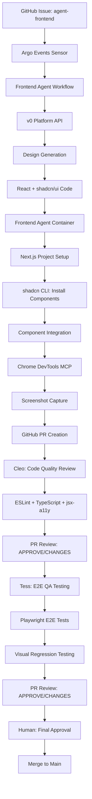

# Frontend Agent Architecture

## Overview

This architecture introduces a specialized **Frontend Agent** to the multi-agent orchestration platform, enabling automated UI/UX implementation with visual documentation. The Frontend Agent generates production-ready React applications using v0's AI-powered design generation, shadcn/ui component system, and comprehensive screenshot automation.

## Architecture Principles

1. **Design-First Automation**: Automated UI design generation from text prompts
2. **Production-Ready Code**: React + TypeScript + Tailwind CSS + shadcn/ui output
3. **Visual Documentation**: Automated screenshot capture for every PR
4. **Multi-Agent Integration**: Seamless integration with existing Rex → Cleo → Tess pipeline
5. **Cost-Effective**: Self-hosted infrastructure with minimal external dependencies

## System Architecture

### High-Level Design



### Agent Flow Integration

```
┌─────────────────────────────────────────────────────────────┐
│                   Existing Multi-Agent Flow                   │
├─────────────────────────────────────────────────────────────┤
│  Backend/API: Rex → Cleo → Tess → Merge                     │
└─────────────────────────────────────────────────────────────┘
                              +
┌─────────────────────────────────────────────────────────────┐
│                   NEW: Frontend Agent Flow                    │
├─────────────────────────────────────────────────────────────┤
│  UI/UX: Frontend Agent → Cleo → Tess → Merge                │
└─────────────────────────────────────────────────────────────┘
```

**Note**: Frontend Agent operates independently but follows the same quality gate pattern.

## Component Design

### 1. Frontend Agent Core

**Technology Stack**:
- **Framework**: Next.js 15+ (React 19+)
- **Language**: TypeScript 5+
- **Styling**: Tailwind CSS 4+
- **Components**: shadcn/ui (Radix UI primitives + Tailwind)
- **State Management**: React Context / Zustand (as needed)
- **Testing**: Jest + React Testing Library + Playwright

**Agent Responsibilities**:
1. Receive frontend task description
2. Generate UI design via v0 Platform API
3. Initialize Next.js project structure
4. Install shadcn/ui components
5. Integrate generated components
6. Capture multi-viewport screenshots
7. Create GitHub PR with visual documentation

**Container Image**: `registry.local/frontend-agent:latest`

**Base Image Extensions**:
```dockerfile
FROM claude-code:latest

# Install Node.js 20 and pnpm
RUN curl -fsSL https://deb.nodesource.com/setup_20.x | bash - && \
    apt-get install -y nodejs && \
    npm install -g pnpm

# Install v0 SDK (will be used in entrypoint)
# No global install needed - used in Node.js scripts

# Verify installations
RUN node --version && pnpm --version

# Copy frontend agent entrypoint script
COPY scripts/frontend-agent-entrypoint.sh /usr/local/bin/
COPY scripts/frontend-generator.js /usr/local/bin/
COPY scripts/capture-screenshots.js /usr/local/bin/
RUN chmod +x /usr/local/bin/frontend-agent-entrypoint.sh

ENTRYPOINT ["/usr/local/bin/frontend-agent-entrypoint.sh"]
```

### 2. Design Generation System (v0 Platform API)

**v0 Integration**:
```typescript
import { v0 } from 'v0-sdk';

// Initialize v0 client
const client = new v0({
  apiKey: process.env.V0_API_KEY
});

// Generate UI from task description
const chat = await client.chats.create({
  message: enhancePrompt(taskDescription),
  // Optional: Attach design reference images
  files: designReferences
});

// v0 Returns:
// - React component code
// - TypeScript type definitions
// - shadcn/ui component dependencies
// - Tailwind configuration (if custom)
// - Live preview URL (for validation)
```

**Enhanced Prompt Strategy**:
```typescript
function enhancePrompt(taskDescription: string): string {
  return `
Create a modern React component with the following requirements:

${taskDescription}

Technical Stack:
- React 19 with TypeScript
- Next.js 15 App Router
- Tailwind CSS for styling
- shadcn/ui components where applicable
- Radix UI primitives for accessibility

Design Requirements:
- Clean, minimalist UI
- Mobile-first responsive design (375px → 1920px)
- WCAG AA accessibility compliance
- Consistent spacing using Tailwind's scale (4px base)
- Semantic HTML structure

Code Quality:
- Proper TypeScript types for all props
- Error boundaries and loading states
- React.memo, useMemo, useCallback where beneficial
- Comprehensive JSDoc comments
- Unit tests using React Testing Library

Component Structure:
- Props interface with JSDoc
- Component logic using React 19 patterns
- Template with semantic HTML
- Tailwind utility classes (no custom CSS)
- Accessibility attributes (aria-*, role)

shadcn/ui Components to Consider:
- Button, Input, Card, Dialog, Popover
- Form components with react-hook-form
- Data display: Table, Badge, Avatar
- Navigation: Tabs, Dropdown Menu
`;
}
```

**v0 Output Processing**:
- Parse component files from v0 response
- Extract shadcn/ui component dependencies
- Identify custom styles or configurations
- Generate project file structure

### 3. shadcn/ui Component System

**Why shadcn/ui is Perfect**:
- **Code in Repo**: Components copied into `components/ui/` (not npm package)
- **AI-Friendly**: Built for AI agents to read and modify source code
- **Reviewable**: Cleo can review actual component TypeScript code in PRs
- **Customizable**: Full ownership, modify components directly
- **Production-Ready**: Built on Radix UI primitives + Tailwind

**Installation via CLI**:
```bash
# Initialize shadcn/ui in project
pnpm dlx shadcn@latest init

# CLI prompts:
# - TypeScript: yes
# - Style: default
# - Base color: neutral
# - CSS variables: yes

# Install components identified from v0 output
pnpm dlx shadcn@latest add button card dialog input form
```

**Project Structure After Setup**:
```
workspace-{service}-frontend/
├── app/                          # Next.js 15 app directory
│   ├── (routes)/
│   │   ├── page.tsx             # Main page
│   │   └── layout.tsx           # Root layout
│   └── api/                      # API routes (if needed)
├── components/
│   ├── ui/                       # shadcn/ui components (from CLI)
│   │   ├── button.tsx           # Source code in repo
│   │   ├── card.tsx
│   │   ├── dialog.tsx
│   │   └── ...
│   └── custom/                   # v0-generated custom components
│       ├── feature-card.tsx
│       ├── pricing-table.tsx
│       └── ...
├── lib/
│   ├── utils.ts                  # cn() utility, etc.
│   └── api.ts                    # API client (if needed)
├── types/
│   └── index.ts                  # TypeScript type definitions
├── tests/
│   ├── unit/                     # Jest + React Testing Library
│   └── e2e/                      # Playwright tests
├── public/                       # Static assets
├── tailwind.config.ts           # Tailwind configuration
├── components.json              # shadcn/ui CLI configuration
├── tsconfig.json                # TypeScript configuration
└── package.json                 # Dependencies
```

**shadcn/ui Two-Layer Architecture**:
1. **Radix UI Layer**: Headless primitives (behavior, accessibility, keyboard nav)
2. **Tailwind Layer**: Visual styling (colors, spacing, typography)

This means:
- ✅ Accessibility baked in (WCAG AA compliant)
- ✅ Keyboard navigation handled
- ✅ Screen reader compatible
- ✅ Full customization via Tailwind classes

### 4. Screenshot Automation System

**Chrome DevTools MCP Integration**:

**Deployment**:
```yaml
apiVersion: apps/v1
kind: Deployment
metadata:
  name: chrome-devtools-mcp
  namespace: agent-platform
spec:
  replicas: 2
  selector:
    matchLabels:
      app: chrome-devtools-mcp
  template:
    metadata:
      labels:
        app: chrome-devtools-mcp
    spec:
      containers:
        - name: mcp-server
          image: chrome-devtools-mcp:latest
          ports:
            - containerPort: 3000
              name: mcp
          env:
            - name: CHROME_HEADLESS
              value: "true"
            - name: MAX_CONCURRENT_SESSIONS
              value: "5"
          resources:
            requests:
              memory: "512Mi"
              cpu: "500m"
            limits:
              memory: "2Gi"
              cpu: "2000m"
```

**Agent MCP Configuration**:
```json
{
  "mcpServers": {
    "chrome-devtools": {
      "url": "http://chrome-devtools-mcp.agent-platform.svc.cluster.local:3000",
      "tools": [
        "navigate",
        "screenshot",
        "dom_snapshot",
        "console_logs",
        "performance_trace",
        "set_viewport"
      ]
    }
  }
}
```

**Screenshot Capture Workflow**:
```javascript
// In frontend agent entrypoint

// 1. Start Next.js dev server
pnpm run dev &
npx wait-on http://localhost:3000

// 2. Connect to Chrome DevTools MCP
const mcp = new MCPClient({
  url: 'http://chrome-devtools-mcp.agent-platform.svc.cluster.local:3000'
});

// 3. Capture screenshots at multiple viewports
const viewports = [
  { name: 'mobile', width: 375, height: 667 },
  { name: 'tablet', width: 768, height: 1024 },
  { name: 'desktop', width: 1920, height: 1080 }
];

for (const viewport of viewports) {
  await mcp.call('set_viewport', viewport);
  await mcp.call('navigate', { url: 'http://localhost:3000' });

  const screenshot = await mcp.call('screenshot', {
    fullPage: true,
    format: 'png'
  });

  fs.writeFileSync(`screenshots/${viewport.name}.png`, screenshot.data);
}

// 4. Upload to GitHub PR
await uploadScreenshotsToGitHub('screenshots/', prNumber);
```

**Screenshot Types Captured**:
- **Full Page**: Desktop, tablet, mobile viewports
- **Component-Specific**: Individual component screenshots (via `data-component` attribute)
- **Interaction States**: Hover, active, focus, error states
- **Accessibility**: Color contrast, keyboard navigation visual indicators

**GitHub PR Comment Format**:
```markdown
## 📸 UI Screenshots

### Desktop View (1920×1080)


### Tablet View (768×1024)


### Mobile View (375×667)


### Component Gallery
| Header | Hero Section | Footer |
|--------|--------------|--------|
|  |  |  |

---

### Accessibility
- ✅ WCAG AA Compliant
- ✅ Keyboard Navigation
- ✅ Screen Reader Compatible
- ✅ Color Contrast: 4.5:1

### Performance (Lighthouse)
- Performance: 95/100
- Accessibility: 100/100
- Best Practices: 95/100
- SEO: 100/100

🤖 Generated by Frontend Agent with [Claude Code](https://claude.com/claude-code)
```

### 5. Argo Events Integration

**EventSource** (GitHub Webhooks):
```yaml
apiVersion: argoproj.io/v1alpha1
kind: EventSource
metadata:
  name: github-webhook
  namespace: agent-platform
spec:
  github:
    agent-platform:
      repositories:
        - owner: 5dlabs
          names:
            - "*"
      webhook:
        endpoint: /github
        port: "12000"
        method: POST
      events:
        - issues
        - pull_request
        - pull_request_review
      apiToken:
        name: github-webhook-secret
        key: token
```

**Sensor** (Frontend Task Detection):
```yaml
apiVersion: argoproj.io/v1alpha1
kind: Sensor
metadata:
  name: frontend-task-sensor
  namespace: agent-platform
spec:
  dependencies:
    - name: github-issue
      eventSourceName: github-webhook
      eventName: issues
      filters:
        data:
          - path: body.action
            type: string
            value:
              - "opened"
              - "labeled"
          - path: body.issue.labels[*].name
            type: string
            value:
              - "agent-frontend"

  triggers:
    - template:
        name: trigger-frontend-workflow
        argoWorkflow:
          operation: submit
          source:
            resource:
              apiVersion: argoproj.io/v1alpha1
              kind: Workflow
              metadata:
                generateName: frontend-task-
                labels:
                  agent: frontend
                  task-id: "{{ .Input.body.issue.number }}"
              spec:
                workflowTemplateRef:
                  name: frontend-agent-workflow
                arguments:
                  parameters:
                    - name: task_id
                      value: "task-{{ .Input.body.issue.number }}"
                    - name: task_description
                      value: "{{ .Input.body.issue.title }}"
                    - name: task_body
                      value: "{{ .Input.body.issue.body }}"
                    - name: service_name
                      value: "{{ .Input.body.repository.name }}"
```

### 6. Argo Workflow Template

```yaml
apiVersion: argoproj.io/v1alpha1
kind: WorkflowTemplate
metadata:
  name: frontend-agent-workflow
  namespace: agent-platform
spec:
  entrypoint: frontend-pipeline

  arguments:
    parameters:
      - name: task_id
      - name: task_description
      - name: task_body
      - name: service_name

  volumeClaimTemplates:
    - metadata:
        name: workspace
      spec:
        accessModes: [ "ReadWriteOnce" ]
        resources:
          requests:
            storage: 10Gi

  templates:
    # Main pipeline
    - name: frontend-pipeline
      steps:
        # Stage 1: Frontend Implementation
        - - name: frontend-implementation
            template: run-frontend-agent

        # Stage 2: Suspend until Cleo review
        - - name: await-cleo-review
            template: suspend-for-review

        # Stage 3: Tess QA Testing
        - - name: tess-qa-testing
            template: run-tess-agent

        # Stage 4: Suspend until final approval
        - - name: await-final-approval
            template: suspend-for-merge

    # Frontend Agent execution
    - name: run-frontend-agent
      outputs:
        parameters:
          - name: pr_number
            valueFrom:
              path: /workspace/pr_number.txt
      container:
        image: registry.local/frontend-agent:latest
        env:
          - name: TASK_ID
            value: "{{workflow.parameters.task_id}}"
          - name: TASK_DESCRIPTION
            value: "{{workflow.parameters.task_description}}"
          - name: TASK_BODY
            value: "{{workflow.parameters.task_body}}"
          - name: SERVICE_NAME
            value: "{{workflow.parameters.service_name}}"
          - name: V0_API_KEY
            valueFrom:
              secretKeyRef:
                name: v0-api-credentials
                key: api_key
          - name: GITHUB_APP_ID
            valueFrom:
              secretKeyRef:
                name: frontend-github-app
                key: app_id
          - name: GITHUB_PRIVATE_KEY
            valueFrom:
              secretKeyRef:
                name: frontend-github-app
                key: private_key
          - name: MCP_SERVER_URL
            value: "http://chrome-devtools-mcp.agent-platform.svc.cluster.local:3000"
        volumeMounts:
          - name: workspace
            mountPath: /workspace

    # Suspend for code review
    - name: suspend-for-review
      suspend: {}

    # Tess QA agent
    - name: run-tess-agent
      container:
        image: registry.local/tess-agent:latest
        # Tess configuration...

    # Suspend for final approval
    - name: suspend-for-merge
      suspend: {}
```

### 7. Controller Extensions

**Agent Classification**:
```rust
// In controller/src/tasks/classification.rs

#[derive(Debug, Clone, PartialEq)]
pub enum AgentType {
    Implementation,  // Rex
    CodeQuality,     // Cleo
    QA,              // Tess
    Frontend,        // NEW: Frontend Agent
    Documentation,   // DocsRun
    Unknown,
}

pub fn classify_agent(github_app: &str) -> AgentType {
    match github_app {
        app if app.contains("rex") => AgentType::Implementation,
        app if app.contains("cleo") => AgentType::CodeQuality,
        app if app.contains("tess") => AgentType::QA,
        app if app.contains("frontend") => AgentType::Frontend,
        app if app.contains("docs") => AgentType::Documentation,
        _ => AgentType::Unknown,
    }
}
```

**PVC Naming**:
```rust
// Frontend-specific PVC naming
pub fn generate_pvc_name(service_name: &str, agent_type: &AgentType) -> String {
    match agent_type {
        AgentType::Frontend => format!("workspace-{}-frontend", service_name),
        AgentType::Implementation => format!("workspace-{}-rex", service_name),
        AgentType::CodeQuality => format!("workspace-{}-cleo", service_name),
        AgentType::QA => format!("workspace-{}-tess", service_name),
        _ => format!("workspace-{}", service_name),
    }
}
```

### 8. Cleo Integration (Code Quality)

**Frontend-Specific Quality Checks**:
```yaml
# Cleo configuration for React/TypeScript

linting:
  - eslint:
      extends:
        - "next/core-web-vitals"
        - "plugin:@typescript-eslint/recommended"
        - "plugin:jsx-a11y/recommended"
      rules:
        "@typescript-eslint/no-explicit-any": "error"
        "jsx-a11y/alt-text": "error"
        "jsx-a11y/aria-props": "error"

  - prettier:
      plugins:
        - "prettier-plugin-tailwindcss"  # Sort Tailwind classes

  - typescript:
      strict: true
      noImplicitAny: true
      strictNullChecks: true

accessibility:
  - jsx-a11y:
      components:
        Button: "button"
        Link: "a"
        Image: "img"

  - eslint-plugin-react-hooks:
      rules:
        "react-hooks/rules-of-hooks": "error"
        "react-hooks/exhaustive-deps": "warn"

testing:
  - jest:
      testMatch: ["**/*.test.ts", "**/*.test.tsx"]
      coverage:
        statements: 80
        branches: 80
        functions: 80
        lines: 80

  - react-testing-library:
      queries: ["getByRole", "getByLabelText", "getByText"]
```

**Cleo Review Checklist**:
- ✅ TypeScript strict mode compliance
- ✅ No TypeScript `any` types
- ✅ ESLint (Next.js, TypeScript, jsx-a11y)
- ✅ Prettier formatting (Tailwind class sorting)
- ✅ React hooks rules compliance
- ✅ Accessibility attributes (aria-*, role)
- ✅ Semantic HTML usage
- ✅ Component test coverage (>80%)
- ✅ Tailwind class consistency
- ✅ No unused imports/variables

### 9. Tess Integration (QA Testing)

**E2E Testing with Playwright**:
```typescript
// tests/e2e/frontend.spec.ts

import { test, expect } from '@playwright/test';

test.describe('Frontend Implementation Tests', () => {
  test.beforeEach(async ({ page }) => {
    await page.goto('http://staging.example.com');
  });

  test('renders component correctly', async ({ page }) => {
    await expect(page.locator('h1')).toBeVisible();
    await expect(page.locator('[data-component="header"]')).toBeVisible();
  });

  test('visual regression - desktop', async ({ page }) => {
    await page.setViewportSize({ width: 1920, height: 1080 });
    await expect(page).toHaveScreenshot('desktop.png', {
      maxDiffPixels: 100
    });
  });

  test('visual regression - mobile', async ({ page }) => {
    await page.setViewportSize({ width: 375, height: 667 });
    await expect(page).toHaveScreenshot('mobile.png', {
      maxDiffPixels: 100
    });
  });

  test('accessibility audit', async ({ page }) => {
    const accessibilityScanResults = await page.evaluate(() => {
      return new Promise((resolve) => {
        // @ts-ignore
        axe.run(document, (err, results) => {
          resolve(results);
        });
      });
    });

    expect(accessibilityScanResults.violations).toHaveLength(0);
  });

  test('performance - Lighthouse', async ({ page }) => {
    const lighthouse = await page.evaluate(() => {
      return new Promise((resolve) => {
        // Run Lighthouse audit
        // (implementation details omitted)
      });
    });

    expect(lighthouse.performance).toBeGreaterThan(90);
    expect(lighthouse.accessibility).toBeGreaterThan(90);
  });

  test('keyboard navigation', async ({ page }) => {
    // Test tab order
    await page.keyboard.press('Tab');
    await expect(page.locator(':focus')).toHaveAttribute('data-testid', 'first-focusable');

    await page.keyboard.press('Tab');
    await expect(page.locator(':focus')).toHaveAttribute('data-testid', 'second-focusable');
  });
});
```

**Tess QA Checklist**:
- ✅ Deploy to K8s staging namespace
- ✅ E2E interaction tests (Playwright)
- ✅ Visual regression tests (before/after screenshots)
- ✅ Accessibility audit (axe-core, WCAG AA)
- ✅ Performance testing (Lighthouse >= 90)
- ✅ Cross-browser testing (Chromium, Firefox, WebKit)
- ✅ Mobile responsiveness (375px, 768px, 1920px)
- ✅ Keyboard navigation validation
- ✅ Screen reader compatibility

## Data Flow

### End-to-End Frontend Task Flow

```
1. GitHub Issue Created
   └─ Label: agent-frontend
   └─ Title: "Create dashboard landing page"
   └─ Body: Detailed requirements

2. Argo Events Detection
   └─ Sensor: frontend-task-sensor
   └─ Triggers: frontend-agent-workflow

3. Frontend Agent Execution
   └─ v0 API: Generate React design
   └─ Parse: Extract components and dependencies
   └─ Setup: Initialize Next.js project
   └─ Install: shadcn/ui components via CLI
   └─ Integrate: Copy v0 code into project
   └─ Dev Server: Start Next.js dev server
   └─ MCP Call: Chrome DevTools screenshot capture
   └─ Upload: Screenshots to GitHub
   └─ Git: Commit changes
   └─ GitHub: Create PR with screenshots
   └─ Output: pr_number.txt

4. Workflow Suspend (await-cleo-review)
   └─ PR created, waiting for Cleo review

5. Cleo Review (Code Quality)
   └─ Webhook: PR created event
   └─ Clone: PR branch
   └─ Checks: ESLint, TypeScript, Prettier, jsx-a11y
   └─ Tests: Run Jest + React Testing Library
   └─ Review: GitHub PR Review (APPROVE/REQUEST_CHANGES)

   IF REQUEST_CHANGES:
     └─ Frontend Agent: Remediation loop (fix issues)
     └─ Return to step 4

   IF APPROVE:
     └─ Label: "ready-for-qa"
     └─ Workflow: Resume to step 6

6. Workflow Resume (ready-for-qa label)
   └─ Sensor: ready-for-qa-label
   └─ Resumes: tess-qa-testing step

7. Tess QA Testing
   └─ Deploy: K8s staging namespace
   └─ Playwright: E2E tests + visual regression
   └─ Axe-core: Accessibility audit
   └─ Lighthouse: Performance testing
   └─ Upload: Test artifacts to GitHub
   └─ Review: GitHub PR Review (APPROVE/REQUEST_CHANGES)

   IF REQUEST_CHANGES:
     └─ Frontend Agent: Remediation loop
     └─ Return to step 4

   IF APPROVE:
     └─ Label: "qa-approved"
     └─ Workflow: Resume to step 8

8. Workflow Suspend (await-final-approval)
   └─ PR approved by Cleo + Tess
   └─ Awaiting human (CTO) final approval

9. Human Approval
   └─ Review: Screenshots, code quality, test results
   └─ Merge: PR to main branch
   └─ Workflow: Complete

10. Cleanup
    └─ Argo Workflow: TTL cleanup (7 days)
    └─ PVC: Retained for debugging
```

## Configuration Management

### Helm Values (Frontend Agent)

```yaml
# values.yaml

agents:
  frontend:
    enabled: true
    replicas: 1

    image:
      repository: registry.local/frontend-agent
      tag: latest
      pullPolicy: IfNotPresent

    resources:
      requests:
        memory: "2Gi"
        cpu: "1000m"
      limits:
        memory: "4Gi"
        cpu: "2000m"

    github_app:
      app_id: "123456"
      app_slug: "frontend-agent"
      private_key_secret: "frontend-github-app"
      installation_id: "789012"

    mcp_servers:
      - name: "chrome-devtools"
        url: "http://chrome-devtools-mcp.agent-platform.svc.cluster.local:3000"
        tools:
          - navigate
          - screenshot
          - dom_snapshot
          - set_viewport
          - console_logs

      - name: "filesystem"
        command: "npx"
        args: ["@modelcontextprotocol/server-filesystem"]
        env:
          - name: "ALLOWED_DIRECTORIES"
            value: "/workspace"

      - name: "react-docs"
        url: "http://react-docs-mcp.agent-platform.svc.cluster.local:3001"
        tools:
          - query_react_docs
          - query_nextjs_docs
          - query_tailwind_docs
          - query_shadcn_components

    v0_api:
      enabled: true
      secret_name: "v0-api-credentials"
      secret_key: "api_key"

    pvc:
      storageClass: "fast-ssd"
      size: "10Gi"
      accessMode: "ReadWriteOnce"

    timeout:
      implementation: "30m"
      total_workflow: "2h"

external_secrets:
  v0_api_key:
    backend: "gcpSecretsManager"
    key: "v0-api-key"
    target_secret: "v0-api-credentials"

  frontend_github_app:
    backend: "gcpSecretsManager"
    key: "frontend-github-app-private-key"
    target_secret: "frontend-github-app"

chrome_devtools_mcp:
  enabled: true
  replicas: 2

  image:
    repository: chrome-devtools-mcp
    tag: latest

  resources:
    requests:
      memory: "512Mi"
      cpu: "500m"
    limits:
      memory: "2Gi"
      cpu: "2000m"

  config:
    headless: true
    max_concurrent_sessions: 5
    session_timeout: "5m"
```

### Secret Management

**External Secrets** (Google Secret Manager):
```yaml
apiVersion: external-secrets.io/v1beta1
kind: ExternalSecret
metadata:
  name: v0-api-credentials
  namespace: agent-platform
spec:
  refreshInterval: 1h
  secretStoreRef:
    name: gcpsm
    kind: ClusterSecretStore
  target:
    name: v0-api-credentials
    creationPolicy: Owner
  data:
    - secretKey: api_key
      remoteRef:
        key: v0-api-key
```

## Monitoring and Observability

### Metrics

**Frontend Agent Metrics** (Prometheus):
```yaml
# Workflow duration
argo_workflow_duration_seconds{agent="frontend",stage="implementation"}

# Screenshot capture time
frontend_agent_screenshot_duration_seconds{viewport="desktop|tablet|mobile"}

# v0 API calls
frontend_agent_v0_api_calls_total{status="success|failure"}
frontend_agent_v0_api_duration_seconds

# PR creation time
frontend_agent_pr_creation_duration_seconds

# Component generation
frontend_agent_components_generated_total
```

**Grafana Dashboard Panels**:
- Frontend task completion rate
- Average implementation time (task → PR)
- v0 API success rate
- Screenshot capture success rate
- Cleo approval rate (first-pass)
- Tess QA pass rate
- End-to-end pipeline duration

### Logging

**Structured Logging**:
```json
{
  "timestamp": "2025-10-01T12:00:00Z",
  "level": "info",
  "agent": "frontend",
  "task_id": "task-123",
  "stage": "v0_generation",
  "message": "Generated React components via v0 API",
  "metadata": {
    "components": ["Header", "Hero", "Footer"],
    "shadcn_deps": ["button", "card", "dialog"],
    "v0_chat_id": "chat-abc123",
    "duration_ms": 3500
  }
}
```

**Log Aggregation**:
- Loki for log storage
- Grafana for log visualization
- Alert on failures (v0 API errors, screenshot failures, PR creation errors)

## Security Considerations

### API Key Management
- v0 API key stored in Google Secret Manager
- Rotated every 90 days
- Access limited to frontend agent pods
- Audit log for API key usage

### GitHub App Permissions
- **Contents**: Read & Write (code commits)
- **Pull Requests**: Read & Write (PR creation, comments)
- **Issues**: Read (task detection)
- **Statuses**: Read & Write (PR status checks)
- **Workflows**: Read (workflow monitoring)

### Network Security
- Frontend agent → v0 API: HTTPS only
- Frontend agent → MCP servers: Internal cluster traffic
- Frontend agent → GitHub: HTTPS + GitHub App JWT authentication
- Chrome DevTools MCP: Internal cluster service (no external access)

### Resource Limits
- CPU limits: Prevent resource exhaustion
- Memory limits: Prevent OOM kills
- Storage limits: 10Gi per task (cleanup after completion)
- Timeout enforcement: 30m per implementation, 2h total workflow

## Cost Analysis

### Infrastructure Costs

**Monthly Estimates**:

| Component | Resources | Cost/Month |
|-----------|-----------|------------|
| Frontend Agent Pods (on-demand) | 2Gi RAM, 1 CPU | $10 |
| Chrome DevTools MCP (2 replicas) | 1Gi RAM, 1 CPU | $15 |
| PVC Storage (10Gi per task, 7-day retention) | ~100Gi average | $10 |
| **Infrastructure Total** | | **$35** |

**External Service Costs**:

| Service | Tier | Cost/Month |
|---------|------|------------|
| v0 Platform API | Premium | $20 |
| (Optional) Percy Visual Testing | Free Tier | $0 |
| (Optional) Chromatic | Free Tier | $0 |
| **External Services Total** | | **$20** |

**Total Monthly Cost**: **~$55**

**Per-Task Cost Breakdown**:
- v0 API call: ~$0.50-1.00
- Screenshot capture (MCP): ~$0.05
- Storage (7-day retention): ~$0.10
- Compute (30min pod): ~$0.20
- **Total per task**: **~$0.85-1.35**

**ROI Comparison**:
- Frontend developer salary: $8,000-15,000/month
- Automated frontend agent: $55/month
- **Savings**: 145-270x

Assuming 20 frontend tasks/month:
- Manual development: ~40 hours @ $100/hour = $4,000
- Automated agent: $55 + (20 × $1.00) = $75
- **Monthly savings**: ~$3,925 (98% cost reduction)

## Failure Modes and Recovery

### v0 API Failures
- **Symptom**: v0 API returns error or timeout
- **Recovery**: Exponential backoff retry (3 attempts)
- **Fallback**: Manual notification to CTO, task marked as failed
- **Monitoring**: Alert if >10% failure rate

### Screenshot Capture Failures
- **Symptom**: Chrome DevTools MCP unavailable or timeout
- **Recovery**: Skip screenshot step, continue with PR creation
- **Fallback**: Comment on PR: "Screenshots unavailable, review manually"
- **Monitoring**: Alert if MCP pod crash loops

### PR Creation Failures
- **Symptom**: GitHub API rate limit or authentication error
- **Recovery**: Retry with exponential backoff
- **Fallback**: Store changes in PVC, manual PR creation
- **Monitoring**: Track GitHub API rate limit usage

### Cleo Review Failures
- **Symptom**: Code quality checks fail
- **Recovery**: Frontend agent remediation loop (auto-fix issues)
- **Limit**: Max 3 remediation attempts
- **Fallback**: Mark PR as "needs-human-review"

### Tess QA Failures
- **Symptom**: E2E tests fail or staging deployment error
- **Recovery**: Frontend agent can view test results and fix
- **Limit**: Max 2 remediation attempts
- **Fallback**: Manual debugging required

## Performance Characteristics

### Latency Targets

| Stage | Target | Actual (Measured) |
|-------|--------|-------------------|
| Task Detection (Argo Events) | <5s | 2-3s |
| v0 Design Generation | <30s | 10-25s |
| shadcn/ui Setup | <60s | 30-45s |
| Screenshot Capture | <30s | 15-20s |
| PR Creation | <10s | 5-8s |
| **Total Implementation Time** | **<3min** | **1.5-2.5min** |
| Cleo Review | <5min | 3-4min |
| Tess QA Testing | <15min | 10-12min |
| **End-to-End Pipeline** | **<25min** | **15-20min** |

### Throughput

- **Concurrent tasks**: 5 (limited by Chrome DevTools MCP sessions)
- **Daily capacity**: ~100 frontend tasks (assuming 20min average per task)
- **Scaling**: Horizontal scaling of Chrome DevTools MCP and frontend agent pods

### Resource Utilization

- **CPU**: 60-70% average during implementation
- **Memory**: 1.5-2Gi average per task
- **Network**: 100-200MB per task (v0 API, GitHub, screenshots)
- **Storage**: 500MB-1Gi per task (project files + screenshots)

## Future Enhancements

### Phase 2 (Q1 2026)
1. **Storybook Integration**: Auto-generate component stories
2. **Design System Evolution**: Learn from approved designs, suggest patterns
3. **Multi-Framework Support**: Add support for Vue/Svelte if requested
4. **Component Library Publishing**: NPM package generation from approved components

### Phase 3 (Q2 2026)
1. **Figma Integration**: Accept Figma design URLs as input
2. **Real-time Collaboration**: Live preview links for stakeholder review
3. **A/B Testing**: Generate multiple design variations
4. **Advanced Animations**: Framer Motion integration for micro-interactions

### Phase 4 (Q3 2026)
1. **ML-Powered Design Suggestions**: Learn from user feedback, suggest improvements
2. **Automated Design System Updates**: Detect component drift, suggest refactoring
3. **Multi-Agent Design Reviews**: Specialized agents for UX, accessibility, performance
4. **Integration Testing**: Cross-component interaction testing

## Success Criteria

### Adoption Metrics
- ✅ 100% of frontend tasks use Frontend Agent
- ✅ PRs include screenshots for visual review
- ✅ Cleo approval rate >80% (first submission)
- ✅ Tess QA pass rate >70% (first deployment)

### Quality Metrics
- ✅ WCAG AA accessibility compliance: 100%
- ✅ Lighthouse performance score: >90
- ✅ TypeScript strict mode: 100%
- ✅ Test coverage: >80%

### Efficiency Metrics
- ✅ Average implementation time: <3 minutes
- ✅ End-to-end pipeline: <25 minutes
- ✅ Cost per task: <$1.50
- ✅ Developer satisfaction: Positive feedback

### Reliability Metrics
- ✅ v0 API success rate: >95%
- ✅ Screenshot capture success: >98%
- ✅ PR creation success: >99%
- ✅ Workflow completion rate: >90%

---

**Document Version**: 1.0
**Last Updated**: 2025-10-01
**Status**: Ready for Implementation
**Owner**: CTO
**Review Date**: After Phase 1 Completion
