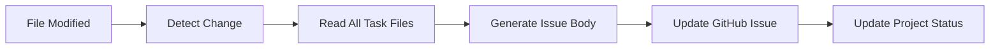
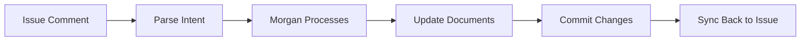

# GitHub Projects & Document Synchronization Design

## Context

The multi-agent orchestration system needs better visibility and human feedback loops. Rather than building complex integrations into TaskMaster, we can create a clean document-issue synchronization system where:


1. **Text files remain source of truth** - All task definitions, acceptance criteria, and documentation in files


2. **GitHub Issues provide human interface** - Natural place for discussions, scope changes, and feedback


3. **Bidirectional sync keeps everything aligned** - Changes in either direction automatically update the other


4. **GitHub Projects provides visibility** - Dashboard view of all work without being part of the core workflow

## Architecture Principles


### Source of Truth: Text Files


```
docs/
├── task-1/
│   ├── task.md              # Core task definition
│   ├── acceptance-criteria.md
│   ├── implementation-notes.md
│   └── .github-issue-link    # Contains issue number
├── task-2/
│   ├── task.md
│   └── ...


```

### GitHub Issues: Human Interface


- Each task directory maps to exactly one GitHub Issue


- Issues provide discussion space and change requests


- Issue body syncs with combined document content


- Issue comments drive document updates

### Bidirectional Sync: Keep Everything Aligned


- **File Change** → Update Issue body and project status


- **Issue Change** → Update corresponding document files


- **Issue Comments** → Trigger document review and updates

## Core Synchronization Components

### 1. **Document-Issue Mapping**

#### File Structure with Issue Links


```bash
docs/task-1/
├── task.md                    # Core task definition
├── acceptance-criteria.md     # Success criteria
├── implementation-notes.md    # Technical details
├── .github-issue-link        # Contains: "123"
└── .sync-metadata.json       # Last sync timestamps, checksums


```


#### Issue Body Structure


```markdown
# Task 1: Implement user authentication service

## Task Definition
[Content from task.md]

## Acceptance Criteria
[Content from acceptance-criteria.md]

## Implementation Notes
[Content from implementation-notes.md]


---


*This issue is automatically synchronized with task documents.
Direct edits to this body will be overwritten.*


```

### 2. **Bidirectional Sync Flows**

#### Files → Issue (Document Changes)




#### Issue → Files (Human Feedback)




### 3. **Synchronization Mechanisms**


#### File Watcher Service


```bash
# Monitors document directories for changes
inotifywait -m -r docs/ --format '%w%f %e' | while read file event; do
  if [[ "$file" =~ \.md$ ]]; then
    task_dir=$(dirname "$file")
    sync_task_to_issue "$task_dir"
  fi
done


```

#### GitHub Webhook Handler


```javascript
// Processes issue comment webhooks
app.post('/webhook/issue-comment', (req, res) => {
  const { action, issue, comment } = req.body;

  if (action === 'created') {
    const taskDir = findTaskByIssue(issue.number);
    if (taskDir) {
      processIssueComment(taskDir, comment.body, comment.user.login);
    }
  }
});


```

### 4. **Document Update Patterns**

#### Scope Change Example


```markdown
<!-- Issue Comment -->
@morgan The authentication service needs to support SSO. Please add:


- SAML 2.0 integration


- OAuth with Google/Microsoft


- Configurable session timeouts

<!-- Morgan's Process -->


1. Parse comment for actionable changes


2. Update acceptance-criteria.md with new requirements


3. Modify task.md to reflect expanded scope
4. Commit changes: "Update auth service scope per issue #123"


5. Sync updated content back to issue body


```

#### Clarification Example


```markdown
<!-- Issue Comment -->
The "user profile management" requirement is unclear. Do we need:


- Full CRUD operations?


- Just read-only profile viewing?


- Profile photo upload?

<!-- Morgan's Process -->


1. Identify ambiguous requirement in task.md


2. Add clarification section to implementation-notes.md


3. Update task.md with specific requirements


4. Comment back on issue with clarification


```

## Technical Implementation

### 1. **Document Synchronization Service**

#### Core Sync Service


```bash
#!/bin/bash
# sync-service.sh - Main synchronization daemon

sync_task_to_issue() {
  local task_dir="$1"
  local issue_num=$(cat "$task_dir/.github-issue-link")

  # Combine all markdown files into issue body
  local issue_body=""
  issue_body+="# $(basename "$task_dir" | tr '-' ' ' | title)\n\n"

  if [[ -f "$task_dir/task.md" ]]; then
    issue_body+="## Task Definition\n"
    issue_body+="$(cat "$task_dir/task.md")\n\n"
  fi

  if [[ -f "$task_dir/acceptance-criteria.md" ]]; then
    issue_body+="## Acceptance Criteria\n"
    issue_body+="$(cat "$task_dir/acceptance-criteria.md")\n\n"
  fi

  # Update GitHub issue
  gh issue edit "$issue_num" --body "$issue_body"

  # Update sync metadata
  echo "{\"last_sync\": \"$(date -Iseconds)\", \"direction\": \"files_to_issue\"}" > "$task_dir/.sync-metadata.json"
}


```

#### File Watcher Implementation


```bash
#!/bin/bash
# file-watcher.sh - Monitors document changes

# Install: apt-get install inotify-tools
inotifywait -m -r docs/ --format '%w%f %e' -e modify,create,delete | while read file event; do
  # Only process markdown files
  if [[ "$file" =~ \.md$ ]] && [[ "$event" =~ (MODIFY|CREATE) ]]; then
    task_dir=$(dirname "$file")

    # Debounce: wait 2 seconds for multiple rapid changes
    sleep 2

    echo "Syncing $(basename "$task_dir") to GitHub after file change"
    sync_task_to_issue "$task_dir"
  fi
done


```

### 2. **Issue-Driven Documentation Updates**

#### Morgan Agent Enhancement


```yaml
# Enhanced agent prompt for GitHub integration
systemPrompt: |
  You are Morgan, enhanced with GitHub Projects integration capabilities.

  When processing GitHub issue comments:


  1. Parse human feedback for scope changes


  2. Update TaskMaster documentation files


  3. Validate changes against project constraints


  4. Commit updates with clear change descriptions


  5. Resume orchestration workflow if needed

  Monitor these issue patterns:
  - Scope changes: "add requirement", "update criteria"
  - Clarifications: "clarify", "explain", "define"
  - Guidance: "consider", "recommend", "suggest"


```

#### Issue Comment Webhook


```yaml
# Argo Events sensor for issue comments
apiVersion: argoproj.io/v1alpha1
kind: Sensor
metadata:
  name: github-issue-comment
spec:
  triggers:
    - template:
        name: process-issue-comment
        argoWorkflow:
          operation: submit
          source:
            resource:
              apiVersion: argoproj.io/v1alpha1
              kind: Workflow
              spec:
                templates:
                  - name: process-comment
                    script:
                      image: ghcr.io/5dlabs/claude:latest
                      command: [sh]
                      source: |
                        # Extract task ID from issue
                        # Trigger Morgan to process comment
                        # Update documentation if needed


```

### 3. **Project Board Configuration**


#### Custom Fields
- **Status**: Backlog → In Progress → Code Review → Testing → Done
- **Current Agent**: Rex, Cleo, Tess, Human Review
- **Stage**: Implementation, Quality, QA, Approval
- **Priority**: P0 (Critical), P1 (High), P2 (Medium), P3 (Low)
- **Complexity**: Small, Medium, Large, XL
- **Task ID**: Direct link to TaskMaster task

#### Automation Rules


- Move to "In Progress" when Rex starts


- Move to "Code Review" when Cleo begins


- Move to "Testing" when Tess starts


- Move to "Done" when PR merges


- Add "Needs Human Input" label when agents request guidance

## Benefits and Use Cases

### For Development Teams
1. **Real-time Visibility**: See exactly what agents are working on
2. **Progress Tracking**: Monitor velocity and identify bottlenecks
3. **Quality Gates**: Visual confirmation of each stage completion
4. **Resource Planning**: Understand agent utilization and capacity

### For Product Management
1. **Scope Management**: Direct interface for requirement changes
2. **Priority Adjustment**: Drag-and-drop task reordering
3. **Stakeholder Communication**: Share project board with stakeholders
4. **Metrics and Reporting**: Track completion rates and cycle times

### For QA and Operations
1. **Test Coordination**: Clear visibility into testing pipeline
2. **Issue Correlation**: Link defects back to original tasks
3. **Release Planning**: Group tasks by milestone or release
4. **Compliance Tracking**: Document review and approval stages

## Implementation Phases

### Phase 1: Basic Sync (2-3 weeks)
- **Goal**: Bi-directional sync between TaskMaster and GitHub Projects
- **Deliverables**:


  - GitHub Projects API client


  - Task → Project Item mapping


  - Basic status updates (Created, In Progress, Done)


  - Project board template and configuration


### Phase 2: Real-time Updates (2-3 weeks)
- **Goal**: Live status updates as workflows progress
- **Deliverables**:


  - Argo Workflow integration points


  - Agent stage tracking


  - Custom project fields (Agent, Stage, Priority)


  - Automated status transitions

### Phase 3: Issue Integration (3-4 weeks)
- **Goal**: Issue-driven documentation updates
- **Deliverables**:


  - Issue comment webhooks


  - Morgan agent GitHub integration


  - Scope change processing


  - Documentation update workflows

### Phase 4: Advanced Features (4-6 weeks)
- **Goal**: Full human-in-the-loop capabilities
- **Deliverables**:


  - Priority-driven orchestration


  - Batch task management


  - Advanced project automation


  - Metrics and reporting dashboard

## Technical Considerations

### Security and Access


- Use GitHub Apps for fine-grained permissions


- Separate bot accounts for different automation levels


- Audit trail for all project modifications


- Rate limiting and error handling

### Performance and Scale


- Async updates to avoid blocking workflows


- Batch operations for multiple task updates


- Caching for frequently accessed project data


- Graceful degradation if GitHub API unavailable

### Integration Points


- Argo Events for webhook processing


- Enhanced agent templates for GitHub operations


- TaskMaster file format extensions


- Existing workflow template modifications


## Success Metrics

### Operational
- **Sync Accuracy**: 99%+ consistency between TaskMaster and Projects
- **Update Latency**: <30 seconds for status changes
- **Availability**: 99.9% uptime for integration services

### User Experience
- **Visibility Improvement**: Reduce "where is my task?" inquiries by 80%
- **Feedback Loop**: <2 hours from human comment to documentation update
- **Adoption**: 90%+ of tasks managed through project board

### Business Impact
- **Cycle Time**: Measure impact on overall task completion time
- **Quality**: Track correlation between human feedback and final quality
- **Productivity**: Measure agent utilization and efficiency gains

## Open Questions and Considerations

### Workflow Integration
1. **Conflict Resolution**: How to handle simultaneous updates from humans and agents?
2. **Rollback Scenarios**: What happens if scope changes break in-progress work?
3. **Notification Strategy**: How to avoid overwhelming humans with updates?

### Technical Architecture
1. **Event Ordering**: Ensuring consistent state across systems
2. **Failure Recovery**: Handling GitHub API outages gracefully
3. **Schema Evolution**: Managing changes to project structure over time

### User Experience
1. **Learning Curve**: Training teams on new workflow integration
2. **Customization**: Allowing teams to adapt board structure to their needs
3. **Mobile Access**: Ensuring project boards work well on mobile devices


## Next Steps

1. **Prototype Development**: Build minimal GitHub Projects sync
2. **User Research**: Interview teams about current pain points
3. **API Exploration**: Deep dive into GitHub Projects v2 capabilities
4. **Integration Design**: Detail specific touchpoints with existing system
5. **Pilot Planning**: Identify first team/project for testing

This integration represents a significant step toward truly transparent, human-guided AI orchestration while maintaining the automation benefits of the current system.
