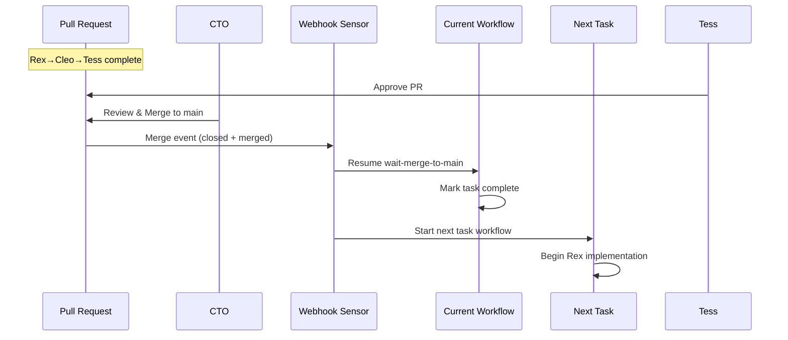

# Merge to Main Workflow Design


## Overview
Replace the current "wait for PR approval" pattern with "wait for merge to main" to properly complete tasks and start the next one in queue.

## Current State


- Workflow suspends after Tess approval waiting for "PR approved" webhook


- This is incomplete - PR approval doesn't mean task is done


- Human (CTO) performs the actual merge


- No mechanism to start next task after merge

## Proposed Changes

### 1. New Sensor: PR Merged to Main


```yaml
apiVersion: argoproj.io/v1alpha1
kind: Sensor
metadata:
  name: play-workflow-pr-merged
  namespace: argo
spec:
  replicas: 2
  template:
    serviceAccountName: argo-events-sa
  dependencies:
    - name: github-pr-merged
      eventSourceName: github
      eventName: org
      filters:
        data:
          # Filter for pull_request closed events with merged=true
          - path: headers.X-Github-Event
            type: string
            value: ["pull_request"]
          - path: body.action
            type: string
            value: ["closed"]
          - path: body.pull_request.merged
            type: bool
            value: [true]
          - path: body.pull_request.base.ref
            type: string
            value: ["main"]
  triggers:
    - template:
        name: task-completion-handler
        k8s:
          operation: create
          source:
            resource:
              apiVersion: argoproj.io/v1alpha1
              kind: Workflow
              metadata:
                generateName: task-complete-
                namespace: agent-platform
              spec:
                entrypoint: handle-task-completion
                templates:
                  - name: handle-task-completion
                    script:
                      image: alpine/k8s:1.31.0
                      command: [bash]
                      source: |
                        #!/bin/bash
                        set -e

                        echo "=== Task Completion Handler ==="

                        # Extract task ID from PR title or labels
                        PR_TITLE="{{ .Input.body.pull_request.title }}"
                        PR_LABELS="{{ .Input.body.pull_request.labels }}"

                        # Parse task ID (e.g., "Task 1: Initialize..." -> "1")
                        TASK_ID=$(echo "$PR_TITLE" | grep -oE 'Task ([0-9]+)' | sed 's/Task //')

                        if [ -z "$TASK_ID" ]; then
                          echo "No task ID found in PR title"
                          exit 0
                        fi

                        echo "Task $TASK_ID completed via merge to main"

                        # 1. Mark current orchestration workflow as complete
                        CURRENT_WORKFLOW=$(kubectl get workflows -n agent-platform \


                          -l task-id=$TASK_ID,workflow-type=play-orchestration \


                          --field-selector status.phase=Running \


                          -o jsonpath='{.items[0].metadata.name}')

                        if [ -n "$CURRENT_WORKFLOW" ]; then
                          # Resume the waiting-for-merge suspend node
                          NODE_ID=$(kubectl get workflow $CURRENT_WORKFLOW -n agent-platform -o json | \
                            jq -r '.status.nodes | to_entries | .[] |
                            select(.value.displayName == "wait-merge-to-main" and .value.type == "Suspend") |
                            .key')

                          if [ -n "$NODE_ID" ]; then
                            kubectl patch workflow $CURRENT_WORKFLOW -n agent-platform \
                              --type='merge' -p "{\"status\":{\"nodes\":{\"$NODE_ID\":{\"phase\":\"Succeeded\"}}}}"
                            echo "✅ Task $TASK_ID workflow completed"
                          fi
                        fi

                        # 2. Start next task in queue
                        NEXT_TASK_ID=$((TASK_ID + 1))
                        echo "Checking if task $NEXT_TASK_ID should be started..."

                        # Check if next task exists in documentation
                        # This would need to query the docs repo or a ConfigMap
                        # For now, we'll assume tasks 1-29 exist

                        if [ $NEXT_TASK_ID -le 29 ]; then
                          echo "Starting Task $NEXT_TASK_ID..."

                          # Create new orchestration workflow for next task
                          cat <<EOF | kubectl create -f -
                          apiVersion: argoproj.io/v1alpha1
                          kind: Workflow
                          metadata:
                            generateName: play-task-${NEXT_TASK_ID}-
                            namespace: agent-platform
                            labels:
                              task-id: "$NEXT_TASK_ID"
                              workflow-type: play-orchestration
                              triggered-by: task-completion
                          spec:
                            entrypoint: orchestrate
                            serviceAccountName: argo-workflow
                            arguments:
                              parameters:
                                - name: task-id
                                  value: "$NEXT_TASK_ID"
                                - name: github-owner
                                  value: "5dlabs"
                                - name: github-repo
                                  value: "cto-play-test"
                            workflowTemplateRef:
                              name: play-orchestration-template
                        EOF

                          echo "✅ Task $NEXT_TASK_ID workflow started"
                        else
                          echo "No more tasks in queue. All tasks completed!"
                        fi


```

### 2. Update Orchestration Workflow
Change the final suspend stage from `wait-pr-approved` to `wait-merge-to-main`:


```yaml
# In the orchestration workflow template
- - name: wait-merge-to-main
    template: wait-suspend
    arguments:
      parameters:
        - name: stage
          value: "waiting-merge-to-main"


```

### 3. Task Queue Management
Options for managing the task queue:

**Option A: Sequential Processing**
- Simple: Task N+1 starts when Task N merges


- Each task gets its own PR/branch


- Easy to track progress

**Option B: ConfigMap-Based Queue**


```yaml
apiVersion: v1
kind: ConfigMap
metadata:
  name: task-queue
  namespace: agent-platform
data:
  current-task: "1"
  max-task: "29"
  status: |
    task-1: completed
    task-2: in-progress
    task-3: pending
    ...


```

**Option C: CRD-Based Queue**
Create a TaskQueue CRD to track state more robustly.

## Workflow Sequence




## Benefits

1. **Proper Task Completion**: Task only marked done when code is in main
2. **Automatic Progression**: Next task starts immediately after merge
3. **Clear Audit Trail**: Each task has its own PR and workflow
4. **Human Control**: CTO maintains merge authority
5. **No Manual Intervention**: Fully automated task progression

## Implementation Steps


1. Add PR merged sensor to play-workflow-sensors.yaml


2. Update orchestration workflow template with wait-merge-to-main


3. Create workflow template reference for consistent orchestration


4. Test with tasks 1-3 in sequence


5. Add task queue status monitoring


## Edge Cases

1. **Merge without Approval**: Should still trigger completion
2. **Direct Push to Main**: Won't trigger sensor (good - maintains process)
3. **Failed Next Task Start**: Log and alert, don't block current task
4. **Revert Commits**: Would need separate handling
5. **Multiple PRs per Task**: Use task ID labels to correlate

## Monitoring


- Add metrics for task completion time


- Track queue depth


- Alert on stuck workflows


- Dashboard showing task progression
