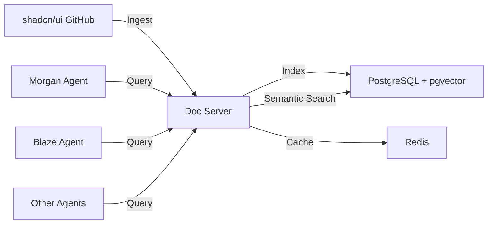

# shadcn/ui Documentation Ingestion Guide

**Date:** 2025-10-31  
**Purpose:** Enable AI agents to access shadcn/ui documentation via doc server  
**Target Agents:** Morgan (docs), Blaze (frontend), All agents needing UI component guidance

---

## Why Ingest shadcn/ui Docs?

### Problems Solved

1. **Hallucinated Component APIs**
   - AI models may invent non-existent component props
   - Outdated knowledge from training data
   - Incorrect usage patterns

2. **Manual Documentation Lookup**
   - Agents need to search external websites
   - Slower implementation workflow
   - Risk of following deprecated patterns

3. **Inconsistent Component Usage**
   - Different agents using components differently
   - Lack of awareness of best practices
   - Missing accessibility requirements

### Benefits of Doc Server Integration

- ✅ **Semantic search** - Find relevant patterns by concept
- ✅ **Up-to-date information** - Fresh from GitHub repository
- ✅ **Example code** - Real usage examples from official docs
- ✅ **Composition patterns** - Learn how to combine components
- ✅ **Accessibility guidance** - WCAG compliance built-in
- ✅ **Offline access** - No external API calls needed

---

## Doc Server Architecture

### Overview



### Components

**1. Doc Server (`doc-server-agent-docs-server.mcp.svc.cluster.local:80`)**
- HTTP server exposing MCP protocol
- Semantic search via pgvector embeddings
- Caching layer (Redis)
- Rate limiting and access control

**2. Storage Layer**
- PostgreSQL with pgvector extension
- Document chunks with embeddings
- Full-text search capabilities
- Metadata indexing (doc type, version, etc.)

**3. MCP Interface**
- Tools: `query_docs`, `search_docs`, `get_examples`
- Accessible via tools proxy or direct connection
- Streaming responses for large results

---

## Ingestion Process

### Using `docs_ingest` MCP Tool

**Automatic Analysis & Ingestion:**

```javascript
// From any MCP client (Cursor, Claude Code, etc.)
docs_ingest({
  repository_url: "https://github.com/shadcn-ui/ui",
  doc_type: "shadcn-ui"
})
```

**What Happens:**
1. **Claude analyzes** the repository structure
2. **Determines optimal strategy** (docs location, file types, extraction methods)
3. **Clones repository** (shallow clone for efficiency)
4. **Extracts documentation** from identified paths
5. **Chunks content** for embedding (optimal sizes)
6. **Generates embeddings** (OpenAI text-embedding-3-large)
7. **Stores in PostgreSQL** with pgvector indexes
8. **Updates metadata** (version, last updated, doc count)

**Ingestion Sources:**
- `/apps/www/content/docs/components/` - Component documentation
- `/apps/www/registry/` - Component implementations
- `/apps/www/content/docs/` - General documentation
- README files with usage examples

---

## Ingestion Configuration

### Doc Server URL

**Default (Kubernetes):**
```bash
DOC_SERVER_URL=http://doc-server-agent-docs-server.mcp.svc.cluster.local:80
```

**Configuration in `cto-config.json`:**
```json
{
  "defaults": {
    "docs_ingest": {
      "model": "claude-sonnet-4-20250514",
      "docServerUrl": "http://doc-server-agent-docs-server.mcp.svc.cluster.local:80"
    }
  }
}
```

### Agent Access Configuration

**Morgan (Documentation Agent):**
```json
{
  "agents": {
    "morgan": {
      "tools": {
        "remote": [
          "context7_get_library_docs",  // shadcn docs via doc server
          "brave_search_brave_web_search"
        ]
      }
    }
  }
}
```

**Blaze (Frontend Agent):**
```json
{
  "agents": {
    "blaze": {
      "tools": {
        "remote": [
          "context7_get_library_docs",  // shadcn docs via doc server
          "brave_search_brave_web_search"
        ],
        "localServers": {
          "shadcn": {
            "enabled": true,
            "command": "npx",
            "args": ["shadcn@latest", "mcp"]
          }
        }
      }
    }
  }
}
```

**Note:** Blaze has **both**:
- `shadcn` local MCP server (component installation)
- `context7_get_library_docs` remote tool (documentation queries)

---

## Usage Patterns

### Morgan: Creating Component Guides

**Scenario:** Morgan creates implementation guides for Blaze

```javascript
// Morgan queries doc server for component patterns
const dashboardDocs = await context7_get_library_docs({
  library: "shadcn-ui",
  query: "dashboard layout with cards and metrics",
  maxResults: 5
})

// Morgan synthesizes guide from results
const guide = `
# Dashboard Implementation Guide

Based on shadcn/ui official patterns:

## Components Needed
${dashboardDocs.map(d => `- ${d.component}: ${d.description}`).join('\n')}

## Implementation Pattern
${dashboardDocs[0].example}

## Accessibility Notes
${dashboardDocs.map(d => d.accessibility).join('\n')}
`

// Write guide to task documentation
write_file({
  path: "task/dashboard-guide.md",
  content: guide
})
```

### Blaze: Implementing Components

**Scenario:** Blaze needs to implement a form

```javascript
// 1. Query doc server for form patterns
const formDocs = await context7_get_library_docs({
  library: "shadcn-ui", 
  query: "form with validation using react-hook-form and zod",
  maxResults: 3
})

// 2. Install components via shadcn MCP
await add_component({
  components: ["form", "input", "button", "label"]
})

// 3. Implement using official patterns from doc server
// Blaze writes code based on formDocs examples
```

### All Agents: Component Discovery

**Scenario:** Any agent needs to know available components

```javascript
// Search for components by functionality
const components = await context7_get_library_docs({
  library: "shadcn-ui",
  query: "components for data visualization and charts"
})

// Returns:
// - chart component documentation
// - data-table with visualization examples
// - badge for metrics display
// - card for metric containers
```

---

## Query Best Practices

### Semantic vs Exact Queries

**❌ Bad Query (Too Vague):**
```javascript
context7_get_library_docs({
  library: "shadcn-ui",
  query: "button"  // Returns generic button docs
})
```

**✅ Good Query (Specific Intent):**
```javascript
context7_get_library_docs({
  library: "shadcn-ui",
  query: "button variants for destructive actions with confirmation dialog"
})
```

### Contextual Queries

**Include usage context:**
```javascript
context7_get_library_docs({
  library: "shadcn-ui",
  query: "mobile-responsive navigation menu with dropdown for desktop"
})
```

### Pattern-Based Queries

**Ask for composition patterns:**
```javascript
context7_get_library_docs({
  library: "shadcn-ui",
  query: "dashboard layout pattern with sidebar, header, and content cards"
})
```

---

## Ingestion Schedule

### Initial Ingestion

**One-time setup:**
```bash
# Run from any agent container or local dev environment
docs_ingest({
  repository_url: "https://github.com/shadcn-ui/ui",
  doc_type: "shadcn-ui"
})
```

**Duration:** ~5-10 minutes  
**Storage:** ~50MB indexed documents  
**Embeddings:** ~500K tokens for embedding generation

### Update Frequency

**Recommended:**
- **Weekly:** Automatic scheduled ingestion
- **On-demand:** When shadcn/ui releases new components
- **Manual trigger:** When agents report outdated information

**Automation (via CronJob):**
```yaml
# infra/gitops/applications/doc-ingest-cronjob.yaml
apiVersion: batch/v1
kind: CronJob
metadata:
  name: shadcn-docs-ingest
  namespace: agent-platform
spec:
  schedule: "0 0 * * 0"  # Weekly on Sunday
  jobTemplate:
    spec:
      template:
        spec:
          containers:
          - name: ingest
            image: ghcr.io/5dlabs/cto-mcp:latest
            command:
            - cto-mcp
            - docs-ingest
            - --repository-url=https://github.com/shadcn-ui/ui
            - --doc-type=shadcn-ui
```

---

## Verification

### Verify Ingestion Success

**Check document count:**
```bash
# Using PostgreSQL client
psql -h doc-server-postgres -U postgres -c "
  SELECT doc_type, COUNT(*) as doc_count 
  FROM documents 
  WHERE doc_type = 'shadcn-ui' 
  GROUP BY doc_type;
"
```

**Expected result:**
```
 doc_type   | doc_count 
------------+-----------
 shadcn-ui  |       150
```

### Test Queries

**Basic query:**
```javascript
const result = await context7_get_library_docs({
  library: "shadcn-ui",
  query: "button component usage",
  maxResults: 1
})

console.log(result)
// Should return button documentation with examples
```

**Semantic search quality:**
```javascript
const result = await context7_get_library_docs({
  library: "shadcn-ui",
  query: "how to show loading state while fetching data",
  maxResults: 3
})

// Should return:
// 1. skeleton component
// 2. spinner component  
// 3. loading state patterns
```

---

## Troubleshooting

### Ingestion Fails

**Check logs:**
```bash
kubectl logs -n agent-platform deployment/doc-server --tail=100
```

**Common issues:**
1. **GitHub rate limiting** - Wait and retry
2. **Out of memory** - Increase pod resources
3. **Invalid repository URL** - Verify repository exists
4. **Embedding API errors** - Check OpenAI API key

### Queries Return No Results

**Check:**
1. Ingestion completed successfully
2. Query uses correct `doc_type` ("shadcn-ui")
3. Query is specific enough (not too vague)

**Debug:**
```javascript
// Check what doc types are available
const docs = await query_docs({
  query: "SELECT DISTINCT doc_type FROM documents"
})
```

### Outdated Results

**Re-ingest:**
```javascript
// Force fresh ingestion
docs_ingest({
  repository_url: "https://github.com/shadcn-ui/ui",
  doc_type: "shadcn-ui",
  force: true  // Clears existing docs first
})
```

---

## Future Enhancements

1. **Version Tracking** - Ingest multiple shadcn/ui versions
2. **Diff Detection** - Only update changed documentation
3. **Component Examples** - Extract and index live examples
4. **Usage Analytics** - Track most-queried components
5. **Auto-update** - Webhook from GitHub on new releases

---

## References

- [Doc Server Repository](https://github.com/5dlabs/docs)
- [shadcn/ui Repository](https://github.com/shadcn-ui/ui)
- [MCP Specification](https://modelcontextprotocol.io)
- [Tools MCP Architecture](./tools-mcp-architecture.md)
- [Blaze Modern Frontend Stack](./blaze-modern-frontend-stack.md)

