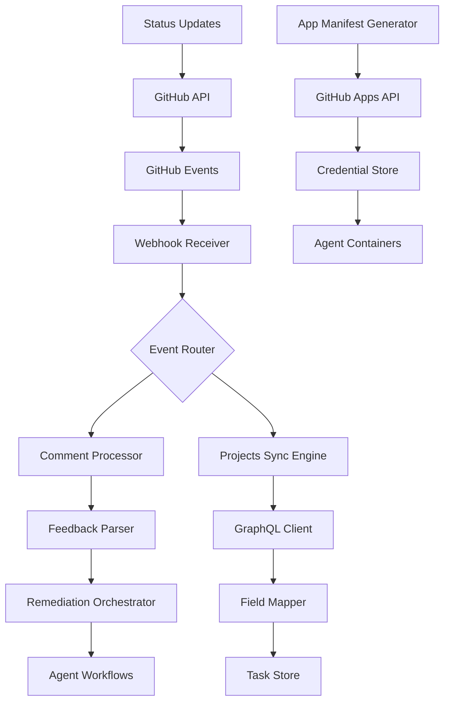

# GitHub Integration Enhancements Architecture

## Overview

This architecture extends the CTO platform with comprehensive GitHub integration capabilities, including PR comment feedback loops, GitHub Projects V2 synchronization, and automated GitHub App creation via the Manifest API.

## Architecture Principles

1. **Event-Driven Processing**: All GitHub interactions triggered by webhooks
2. **Idempotent Operations**: Safe to replay events without side effects  
3. **Least Privilege Access**: Apps request minimal required permissions
4. **Bidirectional Sync**: Changes flow both directions between systems
5. **Audit Trail**: Complete history of all GitHub interactions

## System Architecture

### High-Level Design



## Component Design

### 1. PR Comment Feedback System

Processes PR comments to extract feedback and trigger remediation workflows.

```rust
// controller/src/github/feedback.rs
pub struct FeedbackSystem {
    webhook_receiver: WebhookReceiver,
    parser: CommentParser,
    orchestrator: RemediationOrchestrator,
    github_client: GitHubClient,
}

impl FeedbackSystem {
    pub async fn process_comment_event(&self, event: IssueCommentEvent) -> Result<()> {
        // Stage 1: Validate and filter
        if !self.should_process_comment(&event) {
            return Ok(());
        }
        
        // Stage 2: Parse feedback structure
        let feedback = match self.parser.parse(&event.comment.body) {
            Ok(f) => f,
            Err(e) => {
                self.post_parse_error(&event, e).await?;
                return Ok(());
            }
        };
        
        // Stage 3: Create remediation plan
        let plan = self.create_remediation_plan(&feedback)?;
        
        // Stage 4: Trigger remediation
        let workflow_id = self.orchestrator.start_remediation(plan).await?;
        
        // Stage 5: Update PR with acknowledgment
        self.acknowledge_remediation(&event, &workflow_id).await?;
        
        // Stage 6: Set PR status checks
        self.update_pr_status(&event, "pending", &workflow_id).await?;
        
        Ok(())
    }
    
    fn should_process_comment(&self, event: &IssueCommentEvent) -> bool {
        // Check if PR (not issue)
        if event.issue.pull_request.is_none() {
            return false;
        }
        
        // Check for bot comments with feedback
        if event.comment.user.login.ends_with("[bot]") {
            return self.contains_feedback_markers(&event.comment.body);
        }
        
        // Check for human commands
        self.contains_commands(&event.comment.body)
    }
    
    fn contains_feedback_markers(&self, body: &str) -> bool {
        body.contains("<qa-feedback>") ||
        body.contains("## QA Results") ||
        body.contains("## Issues Found")
    }
}

pub struct CommentParser {
    xml_parser: XmlFeedbackParser,
    markdown_parser: MarkdownFeedbackParser,
    command_parser: CommandParser,
}

impl CommentParser {
    pub fn parse(&self, comment: &str) -> Result<ParsedFeedback> {
        // Try XML format first (most structured)
        if comment.contains("<qa-feedback>") {
            return self.xml_parser.parse(comment);
        }
        
        // Try markdown format
        if comment.contains("## Issues Found") || comment.contains("## QA Results") {
            return self.markdown_parser.parse(comment);
        }
        
        // Try command format
        if comment.contains("@cto-") {
            return self.command_parser.parse(comment);
        }
        
        Err(anyhow!("No recognized feedback format found"))
    }
}

pub struct RemediationOrchestrator {
    task_creator: TaskCreator,
    workflow_manager: WorkflowManager,
    agent_selector: AgentSelector,
}

impl RemediationOrchestrator {
    pub async fn start_remediation(&self, plan: RemediationPlan) -> Result<String> {
        // Select appropriate agent
        let agent = self.agent_selector.select_for_plan(&plan)?;
        
        // Create remediation task
        let task = self.task_creator.create_from_plan(&plan)?;
        
        // Start workflow
        let workflow = self.workflow_manager.create_remediation_workflow(
            &agent,
            &task,
            plan.pr_number,
        )?;
        
        let workflow_id = self.workflow_manager.start(workflow).await?;
        
        Ok(workflow_id)
    }
}
```

### 2. GitHub Projects V2 Integration

Synchronizes tasks with GitHub Projects using GraphQL API.

```rust
// controller/src/github/projects.rs
pub struct ProjectsSyncEngine {
    graphql_client: GraphQLClient,
    field_mapper: FieldMapper,
    conflict_resolver: ConflictResolver,
}

impl ProjectsSyncEngine {
    pub async fn sync_task(&self, task: &Task, project_id: &str) -> Result<()> {
        // Find or create project item
        let item = self.ensure_project_item(task, project_id).await?;
        
        // Map task fields to project fields
        let field_updates = self.field_mapper.map_task_to_project(task)?;
        
        // Apply field updates
        for (field_id, value) in field_updates {
            self.update_field(project_id, &item.id, &field_id, value).await?;
        }
        
        // Store mapping for reverse sync
        self.store_mapping(task.id, &item.id, project_id).await?;
        
        Ok(())
    }
    
    async fn ensure_project_item(&self, task: &Task, project_id: &str) -> Result<ProjectItem> {
        // Check if item exists
        if let Some(item) = self.find_item_for_task(task.id, project_id).await? {
            return Ok(item);
        }
        
        // Create new item
        let mutation = r#"
            mutation AddProjectItem($projectId: ID!, $contentId: ID) {
                addProjectV2DraftIssue(input: {
                    projectId: $projectId,
                    title: $title,
                    body: $body
                }) {
                    projectItem {
                        id
                        content {
                            ... on DraftIssue {
                                id
                                title
                                body
                            }
                        }
                    }
                }
            }
        "#;
        
        let variables = json!({
            "projectId": project_id,
            "title": format!("Task {}: {}", task.id, task.title),
            "body": task.description,
        });
        
        let response: AddProjectItemResponse = self.graphql_client
            .execute(mutation, variables)
            .await?;
        
        Ok(response.add_project_item.project_item)
    }
    
    async fn update_field(
        &self,
        project_id: &str,
        item_id: &str,
        field_id: &str,
        value: FieldValue,
    ) -> Result<()> {
        let mutation = r#"
            mutation UpdateField($projectId: ID!, $itemId: ID!, $fieldId: ID!, $value: ProjectV2FieldValue!) {
                updateProjectV2ItemFieldValue(input: {
                    projectId: $projectId,
                    itemId: $itemId,
                    fieldId: $fieldId,
                    value: $value
                }) {
                    clientMutationId
                }
            }
        "#;
        
        let variables = json!({
            "projectId": project_id,
            "itemId": item_id,
            "fieldId": field_id,
            "value": value,
        });
        
        self.graphql_client.execute(mutation, variables).await?;
        Ok(())
    }
}

pub struct FieldMapper {
    field_definitions: HashMap<String, ProjectField>,
}

impl FieldMapper {
    pub fn map_task_to_project(&self, task: &Task) -> Result<Vec<(String, FieldValue)>> {
        let mut updates = Vec::new();
        
        // Map status to column
        if let Some(status_field) = self.field_definitions.get("Status") {
            let column = self.map_status_to_column(&task.status)?;
            updates.push((
                status_field.id.clone(),
                FieldValue::SingleSelect(column),
            ));
        }
        
        // Map priority
        if let Some(priority_field) = self.field_definitions.get("Priority") {
            updates.push((
                priority_field.id.clone(),
                FieldValue::SingleSelect(task.priority.clone()),
            ));
        }
        
        // Map story points
        if let Some(points_field) = self.field_definitions.get("Points") {
            if let Some(points) = task.story_points {
                updates.push((
                    points_field.id.clone(),
                    FieldValue::Number(points as f64),
                ));
            }
        }
        
        // Map assignee
        if let Some(assignee_field) = self.field_definitions.get("Assignee") {
            updates.push((
                assignee_field.id.clone(),
                FieldValue::Text(task.assigned_agent.clone()),
            ));
        }
        
        Ok(updates)
    }
    
    fn map_status_to_column(&self, status: &str) -> Result<String> {
        Ok(match status {
            "pending" => "📋 Backlog",
            "in_progress" => "🏃 In Progress", 
            "in_review" => "👀 In Review",
            "completed" => "✅ Done",
            "blocked" => "🚫 Blocked",
            _ => return Err(anyhow!("Unknown status: {}", status)),
        }.to_string())
    }
}
```

### 3. GitHub App Manifest System

Automates GitHub App creation for agents.

```rust
// controller/src/github/apps.rs
pub struct AppManifestSystem {
    manifest_generator: ManifestGenerator,
    apps_api_client: GitHubAppsClient,
    credential_manager: CredentialManager,
}

impl AppManifestSystem {
    pub async fn create_agent_app(&self, agent: &AgentConfig) -> Result<GitHubApp> {
        // Generate manifest
        let manifest = self.manifest_generator.generate(agent)?;
        
        // Submit to GitHub
        let app = self.apps_api_client.create_from_manifest(manifest).await?;
        
        // Store credentials securely
        self.credential_manager.store_app_credentials(&app).await?;
        
        // Configure webhooks
        self.configure_webhooks(&app, agent).await?;
        
        Ok(app)
    }
}

pub struct ManifestGenerator {
    base_config: BaseAppConfig,
}

impl ManifestGenerator {
    pub fn generate(&self, agent: &AgentConfig) -> Result<AppManifest> {
        let manifest = AppManifest {
            name: self.generate_app_name(agent),
            url: format!("{}/agents/{}", self.base_config.base_url, agent.name),
            description: format!("CTO Agent: {} - {}", agent.name, agent.description),
            public: false,
            default_permissions: self.calculate_permissions(agent),
            default_events: self.determine_events(agent),
            webhook_config: WebhookConfig {
                url: format!("{}/webhooks/github", self.base_config.webhook_url),
                content_type: "json".to_string(),
                secret: self.generate_webhook_secret(),
                active: true,
            },
            redirect_url: format!("{}/auth/callback", self.base_config.base_url),
            callback_urls: vec![
                format!("{}/auth/callback", self.base_config.base_url),
            ],
            setup_url: Some(format!("{}/setup", self.base_config.base_url)),
        };
        
        Ok(manifest)
    }
    
    fn calculate_permissions(&self, agent: &AgentConfig) -> Permissions {
        let mut perms = Permissions::default();
        
        // Base permissions for all agents
        perms.metadata = Some("read".to_string());
        
        // Role-specific permissions
        match agent.role {
            AgentRole::Implementation => {
                perms.contents = Some("write".to_string());
                perms.pull_requests = Some("write".to_string());
                perms.issues = Some("write".to_string());
                perms.actions = Some("write".to_string());
                perms.checks = Some("write".to_string());
            },
            AgentRole::QA => {
                perms.contents = Some("read".to_string());
                perms.pull_requests = Some("write".to_string());
                perms.issues = Some("write".to_string());
                perms.checks = Some("write".to_string());
            },
            AgentRole::Documentation => {
                perms.contents = Some("write".to_string());
                perms.pages = Some("write".to_string());
            },
        }
        
        perms
    }
    
    fn determine_events(&self, agent: &AgentConfig) -> Vec<String> {
        match agent.role {
            AgentRole::Implementation => vec![
                "pull_request",
                "pull_request_review",
                "issue_comment",
                "push",
            ],
            AgentRole::QA => vec![
                "pull_request",
                "check_suite",
                "check_run",
                "issue_comment",
            ],
            AgentRole::Documentation => vec![
                "push",
                "release",
                "wiki",
            ],
        }.into_iter().map(String::from).collect()
    }
}

pub struct CredentialManager {
    kube_client: kube::Client,
    encryption: EncryptionService,
}

impl CredentialManager {
    pub async fn store_app_credentials(&self, app: &GitHubApp) -> Result<()> {
        // Encrypt sensitive data
        let encrypted_key = self.encryption.encrypt(&app.private_key)?;
        let encrypted_secret = self.encryption.encrypt(&app.webhook_secret)?;
        
        // Create Kubernetes secret
        let secret = Secret {
            metadata: ObjectMeta {
                name: Some(format!("github-app-{}", app.slug)),
                namespace: Some("cto".to_string()),
                labels: Some(BTreeMap::from([
                    ("app".to_string(), "cto".to_string()),
                    ("component".to_string(), "github-app".to_string()),
                    ("agent".to_string(), app.slug.clone()),
                ])),
                ..Default::default()
            },
            data: Some(BTreeMap::from([
                ("app_id".to_string(), ByteString(app.id.to_string().into())),
                ("app_slug".to_string(), ByteString(app.slug.clone().into())),
                ("private_key".to_string(), ByteString(encrypted_key)),
                ("webhook_secret".to_string(), ByteString(encrypted_secret)),
                ("client_id".to_string(), ByteString(app.client_id.clone().into())),
                ("client_secret".to_string(), ByteString(app.client_secret.clone().into())),
            ])),
            ..Default::default()
        };
        
        let api: Api<Secret> = Api::namespaced(self.kube_client.clone(), "cto");
        api.create(&PostParams::default(), &secret).await?;
        
        Ok(())
    }
}
```

## Event Processing Pipeline

### Webhook Event Flow
```yaml
apiVersion: argoproj.io/v1alpha1
kind: EventSource
metadata:
  name: github-webhook
spec:
  service:
    ports:
      - port: 12000
        targetPort: 12000
  webhook:
    github:
      port: "12000"
      endpoint: /github
      method: POST
      repositories:
        - owner: 5dlabs
          names:
            - cto
          events:
            - pull_request
            - issue_comment
            - push
            - check_suite
      webhookSecret:
        name: github-webhook-secret
        key: secret
---
apiVersion: argoproj.io/v1alpha1
kind: Sensor
metadata:
  name: github-event-processor
spec:
  dependencies:
    - name: pr-comment
      eventSourceName: github-webhook
      eventName: github
      filters:
        data:
          - path: body.action
            type: string
            value:
              - created
              - edited
          - path: body.issue.pull_request
            type: exists
  triggers:
    - template:
        name: process-pr-comment
        k8s:
          operation: create
          source:
            resource:
              apiVersion: v1
              kind: Pod
              metadata:
                name: comment-processor-{{.Input.body.comment.id}}
              spec:
                containers:
                - name: processor
                  image: ghcr.io/5dlabs/controller:latest
                  command: ["controller", "process-comment"]
                  env:
                  - name: EVENT_PAYLOAD
                    value: '{{.Input | toJson}}'
```

## Database Schema

### Feedback Tracking
```sql
CREATE TABLE pr_feedback (
    id UUID PRIMARY KEY DEFAULT gen_random_uuid(),
    pr_number INTEGER NOT NULL,
    repo_owner VARCHAR(255) NOT NULL,
    repo_name VARCHAR(255) NOT NULL,
    comment_id BIGINT UNIQUE NOT NULL,
    author VARCHAR(255) NOT NULL,
    feedback_type VARCHAR(50) NOT NULL,
    parsed_feedback JSONB NOT NULL,
    remediation_status VARCHAR(50) DEFAULT 'pending',
    workflow_id VARCHAR(255),
    created_at TIMESTAMP WITH TIME ZONE DEFAULT CURRENT_TIMESTAMP,
    updated_at TIMESTAMP WITH TIME ZONE DEFAULT CURRENT_TIMESTAMP
);

CREATE TABLE remediation_workflows (
    id UUID PRIMARY KEY DEFAULT gen_random_uuid(),
    feedback_id UUID REFERENCES pr_feedback(id),
    workflow_name VARCHAR(255) NOT NULL,
    agent VARCHAR(50) NOT NULL,
    status VARCHAR(50) NOT NULL,
    started_at TIMESTAMP WITH TIME ZONE DEFAULT CURRENT_TIMESTAMP,
    completed_at TIMESTAMP WITH TIME ZONE,
    result JSONB
);
```

### Projects Synchronization
```sql
CREATE TABLE task_project_mappings (
    task_id INTEGER NOT NULL,
    project_id VARCHAR(255) NOT NULL,
    project_item_id VARCHAR(255) NOT NULL,
    last_synced TIMESTAMP WITH TIME ZONE DEFAULT CURRENT_TIMESTAMP,
    sync_direction VARCHAR(50) DEFAULT 'bidirectional',
    field_mappings JSONB NOT NULL,
    PRIMARY KEY (task_id, project_id)
);

CREATE TABLE project_sync_events (
    id UUID PRIMARY KEY DEFAULT gen_random_uuid(),
    task_id INTEGER NOT NULL,
    project_id VARCHAR(255) NOT NULL,
    event_type VARCHAR(50) NOT NULL,
    field_changes JSONB,
    synced_at TIMESTAMP WITH TIME ZONE DEFAULT CURRENT_TIMESTAMP,
    success BOOLEAN DEFAULT true,
    error_message TEXT
);
```

## Security Considerations

### App Permission Scoping
```rust
pub struct PermissionAuditor {
    required_permissions: HashMap<AgentRole, Permissions>,
}

impl PermissionAuditor {
    pub fn audit_app(&self, app: &GitHubApp, role: AgentRole) -> AuditResult {
        let required = &self.required_permissions[&role];
        let actual = &app.permissions;
        
        let mut violations = Vec::new();
        
        // Check for over-permissioning
        if self.has_excess_permissions(actual, required) {
            violations.push(Violation::ExcessPermissions);
        }
        
        // Check for missing permissions
        if self.has_missing_permissions(actual, required) {
            violations.push(Violation::MissingPermissions);
        }
        
        AuditResult {
            app_id: app.id,
            violations,
            timestamp: Utc::now(),
        }
    }
}
```

## Monitoring and Observability

### Metrics
```rust
use prometheus::{register_histogram_vec, register_int_counter_vec};

lazy_static! {
    static ref FEEDBACK_PROCESSING_TIME: HistogramVec = register_histogram_vec!(
        "github_feedback_processing_duration_seconds",
        "Time to process PR feedback",
        &["feedback_type", "result"]
    ).unwrap();
    
    static ref PROJECT_SYNC_OPERATIONS: IntCounterVec = register_int_counter_vec!(
        "github_project_sync_total",
        "GitHub Projects synchronization operations",
        &["operation", "status"]
    ).unwrap();
    
    static ref APP_CREATION_SUCCESS: IntCounterVec = register_int_counter_vec!(
        "github_app_creation_total",
        "GitHub App creation attempts",
        &["agent", "result"]
    ).unwrap();
}
```

This architecture provides a comprehensive GitHub integration layer that enables sophisticated automation workflows while maintaining security and auditability.
