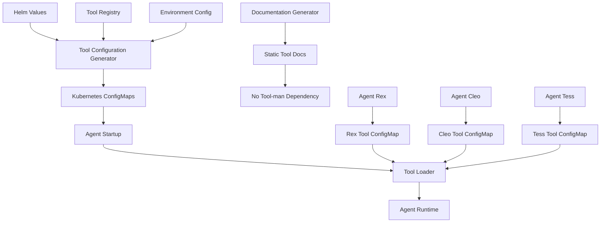

# MCP Tool Selection Enhancement Architecture

## Overview

This architecture transforms the MCP tool selection system from dynamic, task-based generation to static, Helm-defined configurations. It eliminates expensive tool-man configuration copying and provides declarative tool management through Kubernetes ConfigMaps and Helm charts.

## Architecture Principles

1. **Static Configuration**: Tool sets defined once and loaded at startup
2. **Declarative Management**: Tool configurations managed through Helm
3. **Role-Based Access**: Tools assigned based on agent roles and responsibilities
4. **Performance Optimization**: Eliminate runtime tool configuration overhead
5. **Simplified Documentation**: Remove tool-man dependency from docs generation

## System Architecture

### High-Level Design



## Component Design

### 1. Helm Tool Configuration Generator

Generates ConfigMaps from Helm values for each agent's tool configuration.

```yaml
# templates/tool-configmaps.yaml
{{- range $agentName, $agentConfig := .Values.agents }}
---
apiVersion: v1
kind: ConfigMap
metadata:
  name: {{ $agentName }}-tools-config
  namespace: {{ $.Release.Namespace }}
  labels:
    app: agent-platform
    agent: {{ $agentName }}
    component: tools-config
data:
  tools.yaml: |
    {{- include "agent-tools-config" (dict "agentName" $agentName "agentConfig" $agentConfig "root" $) | nindent 4 }}
  metadata.yaml: |
    {{- include "agent-tools-metadata" (dict "agentName" $agentName "agentConfig" $agentConfig "root" $) | nindent 4 }}
{{- end }}
```

```yaml
# templates/_helpers.tpl
{{- define "agent-tools-config" -}}
tools:
{{- range $toolName := .agentConfig.tools }}
  - name: {{ $toolName }}
    {{- $toolConfig := index $.root.Values.tool_definitions $toolName }}
    {{- if $toolConfig }}
    description: {{ $toolConfig.description | quote }}
    capabilities: {{ $toolConfig.capabilities | toYaml | nindent 6 }}
    {{- if index $.agentConfig.tool_config $toolName }}
    config: {{ index $.agentConfig.tool_config $toolName | toYaml | nindent 6 }}
    {{- end }}
    {{- end }}
{{- end }}
{{- end }}

{{- define "agent-tools-metadata" -}}
agent:
  name: {{ .agentName }}
  role: {{ .agentConfig.role | default "unknown" }}
  version: {{ .root.Chart.AppVersion }}
  created_at: {{ now | date "2006-01-02T15:04:05Z07:00" }}
tools:
  count: {{ len .agentConfig.tools }}
  last_updated: {{ now | date "2006-01-02T15:04:05Z07:00" }}
{{- end }}
```

### 2. Tool Registry and Definitions

Centralized tool definitions with capabilities and metadata.

```yaml
# values.yaml - Tool Definitions
tool_definitions:
  code_generation:
    description: "Generate code based on requirements and specifications"
    capabilities:
      - file_creation
      - code_writing
      - refactoring
      - template_generation
    parameters:
      max_file_size: "1MB"
      allowed_languages: ["python", "javascript", "rust", "go", "typescript"]
      code_style: "project_default"
  
  file_operations:
    description: "Create, modify, and delete files and directories"
    capabilities:
      - read
      - write
      - delete
      - move
      - copy
    parameters:
      allowed_paths: ["src/", "tests/", "docs/", "config/"]
      max_file_size: "10MB"
      backup_enabled: true
  
  git_operations:
    description: "Perform Git operations for version control"
    capabilities:
      - commit
      - push
      - pull
      - branch
      - merge
      - rebase
    parameters:
      allowed_branches: ["main", "develop", "feature/*", "hotfix/*"]
      commit_message_format: "conventional"
      auto_stash: true
  
  code_review:
    description: "Review code for quality, standards, and best practices"
    capabilities:
      - linting
      - style_check
      - security_scan
      - complexity_analysis
      - documentation_check
    parameters:
      strict_mode: true
      required_checks: ["lint", "security", "complexity"]
      auto_fix: false
  
  validation:
    description: "Validate code, configurations, and system state"
    capabilities:
      - syntax_check
      - dependency_check
      - schema_validation
      - type_checking
    parameters:
      validation_level: "strict"
      auto_correct: false
  
  testing:
    description: "Execute comprehensive test suites"
    capabilities:
      - unit_tests
      - integration_tests
      - e2e_tests
      - performance_tests
      - coverage_analysis
    parameters:
      timeout: "30m"
      parallel_execution: true
      coverage_threshold: 80
  
  verification:
    description: "Verify functionality and requirements compliance"
    capabilities:
      - requirement_check
      - functionality_test
      - regression_testing
      - smoke_testing
    parameters:
      verification_mode: "comprehensive"
      auto_retry: true
  
  reporting:
    description: "Generate test reports, metrics, and analysis"
    capabilities:
      - test_reports
      - coverage_reports
      - metrics_collection
      - trend_analysis
    parameters:
      report_format: "html"
      include_metrics: true
      historical_data: true
  
  documentation:
    description: "Generate and update documentation"
    capabilities:
      - readme_generation
      - api_docs
      - code_comments
      - changelog_updates
    parameters:
      doc_format: "markdown"
      auto_update: true
      include_examples: true
```

### 3. Agent Tool Configuration

Role-based tool assignments for each agent type.

```yaml
# values.yaml - Agent Configurations
agents:
  rex:
    role: "implementation"
    tools:
      - code_generation
      - file_operations
      - git_operations
      - testing
    tool_config:
      code_generation:
        max_file_size: "1MB"
        allowed_languages: ["python", "javascript", "rust", "go"]
        code_style: "project_default"
      git_operations:
        allowed_branches: ["main", "develop", "feature/*"]
        commit_message_format: "conventional"
        auto_stash: true
      testing:
        timeout: "15m"
        parallel_execution: true
        coverage_threshold: 70
  
  cleo:
    role: "quality"
    tools:
      - code_review
      - validation
      - testing
      - documentation
    tool_config:
      code_review:
        strict_mode: true
        required_checks: ["lint", "security", "complexity"]
        auto_fix: false
      validation:
        validation_level: "strict"
        auto_correct: false
      testing:
        timeout: "20m"
        parallel_execution: true
        coverage_threshold: 80
      documentation:
        doc_format: "markdown"
        auto_update: true
        include_examples: true
  
  tess:
    role: "qa"
    tools:
      - testing
      - verification
      - reporting
      - validation
    tool_config:
      testing:
        timeout: "30m"
        parallel_execution: true
        coverage_threshold: 85
      verification:
        verification_mode: "comprehensive"
        auto_retry: true
      reporting:
        report_format: "html"
        include_metrics: true
        historical_data: true
      validation:
        validation_level: "strict"
        auto_correct: false
```

### 4. Agent Tool Loader

Runtime component that loads and validates tool configurations from ConfigMaps.

```rust
// pkg/tools/loader.rs
use serde::{Deserialize, Serialize};
use std::collections::HashMap;
use tokio::fs;
use anyhow::Result;

#[derive(Debug, Clone, Serialize, Deserialize)]
pub struct ToolDefinition {
    pub name: String,
    pub description: String,
    pub capabilities: Vec<String>,
    pub config: Option<serde_json::Value>,
}

#[derive(Debug, Clone, Serialize, Deserialize)]
pub struct AgentToolConfig {
    pub tools: Vec<ToolDefinition>,
}

#[derive(Debug, Clone, Serialize, Deserialize)]
pub struct AgentToolMetadata {
    pub agent: AgentInfo,
    pub tools: ToolInfo,
}

#[derive(Debug, Clone, Serialize, Deserialize)]
pub struct AgentInfo {
    pub name: String,
    pub role: String,
    pub version: String,
    pub created_at: String,
}

#[derive(Debug, Clone, Serialize, Deserialize)]
pub struct ToolInfo {
    pub count: usize,
    pub last_updated: String,
}

pub struct ToolLoader {
    agent_name: String,
    config_path: String,
}

impl ToolLoader {
    pub fn new(agent_name: &str) -> Self {
        let config_path = format!("/etc/agent-tools/{}-tools-config", agent_name);
        Self {
            agent_name: agent_name.to_string(),
            config_path,
        }
    }

    pub async fn load_tools(&self) -> Result<AgentToolConfig> {
        let tools_config_path = format!("{}/tools.yaml", self.config_path);
        let tools_content = fs::read_to_string(&tools_config_path).await?;
        
        let config: AgentToolConfig = serde_yaml::from_str(&tools_content)?;
        
        // Validate tool configurations
        self.validate_tools(&config).await?;
        
        Ok(config)
    }

    pub async fn load_metadata(&self) -> Result<AgentToolMetadata> {
        let metadata_path = format!("{}/metadata.yaml", self.config_path);
        let metadata_content = fs::read_to_string(&metadata_path).await?;
        
        let metadata: AgentToolMetadata = serde_yaml::from_str(&metadata_content)?;
        Ok(metadata)
    }

    async fn validate_tools(&self, config: &AgentToolConfig) -> Result<()> {
        for tool in &config.tools {
            // Validate tool name
            if tool.name.is_empty() {
                return Err(anyhow!("Tool name cannot be empty"));
            }

            // Validate capabilities
            if tool.capabilities.is_empty() {
                return Err(anyhow!("Tool {} must have at least one capability", tool.name));
            }

            // Validate configuration if present
            if let Some(ref tool_config) = tool.config {
                self.validate_tool_config(tool.name.as_str(), tool_config).await?;
            }
        }

        Ok(())
    }

    async fn validate_tool_config(&self, tool_name: &str, config: &serde_json::Value) -> Result<()> {
        // Tool-specific validation logic
        match tool_name {
            "code_generation" => {
                if let Some(max_size) = config.get("max_file_size") {
                    if !max_size.is_string() {
                        return Err(anyhow!("max_file_size must be a string"));
                    }
                }
                if let Some(languages) = config.get("allowed_languages") {
                    if !languages.is_array() {
                        return Err(anyhow!("allowed_languages must be an array"));
                    }
                }
            }
            "git_operations" => {
                if let Some(branches) = config.get("allowed_branches") {
                    if !branches.is_array() {
                        return Err(anyhow!("allowed_branches must be an array"));
                    }
                }
            }
            "testing" => {
                if let Some(timeout) = config.get("timeout") {
                    if !timeout.is_string() {
                        return Err(anyhow!("timeout must be a string"));
                    }
                }
                if let Some(threshold) = config.get("coverage_threshold") {
                    if !threshold.is_number() {
                        return Err(anyhow!("coverage_threshold must be a number"));
                    }
                }
            }
            _ => {
                // Generic validation for unknown tools
                log::warn!("No specific validation for tool: {}", tool_name);
            }
        }

        Ok(())
    }

    pub fn get_tool_by_name(&self, config: &AgentToolConfig, tool_name: &str) -> Option<&ToolDefinition> {
        config.tools.iter().find(|tool| tool.name == tool_name)
    }

    pub fn get_tools_by_capability(&self, config: &AgentToolConfig, capability: &str) -> Vec<&ToolDefinition> {
        config.tools
            .iter()
            .filter(|tool| tool.capabilities.contains(&capability.to_string()))
            .collect()
    }
}
```

### 5. MCP Tool Registry

Centralized registry for managing tool definitions and capabilities.

```rust
// pkg/tools/registry.rs
use std::collections::HashMap;
use serde::{Deserialize, Serialize};
use tokio::sync::RwLock;
use std::sync::Arc;

#[derive(Debug, Clone, Serialize, Deserialize)]
pub struct ToolCapability {
    pub name: String,
    pub description: String,
    pub parameters: Vec<ToolParameter>,
}

#[derive(Debug, Clone, Serialize, Deserialize)]
pub struct ToolParameter {
    pub name: String,
    pub description: String,
    pub required: bool,
    pub parameter_type: ParameterType,
    pub default_value: Option<serde_json::Value>,
}

#[derive(Debug, Clone, Serialize, Deserialize)]
pub enum ParameterType {
    String,
    Number,
    Boolean,
    Array,
    Object,
}

#[derive(Debug, Clone, Serialize, Deserialize)]
pub struct ToolRegistryEntry {
    pub name: String,
    pub description: String,
    pub capabilities: Vec<String>,
    pub parameters: Vec<ToolParameter>,
    pub version: String,
    pub deprecated: bool,
}

pub struct ToolRegistry {
    tools: Arc<RwLock<HashMap<String, ToolRegistryEntry>>>,
    capabilities: Arc<RwLock<HashMap<String, ToolCapability>>>,
}

impl ToolRegistry {
    pub fn new() -> Self {
        Self {
            tools: Arc::new(RwLock::new(HashMap::new())),
            capabilities: Arc::new(RwLock::new(HashMap::new())),
        }
    }

    pub async fn register_tool(&self, entry: ToolRegistryEntry) -> Result<()> {
        let mut tools = self.tools.write().await;
        tools.insert(entry.name.clone(), entry);
        Ok(())
    }

    pub async fn get_tool(&self, name: &str) -> Option<ToolRegistryEntry> {
        let tools = self.tools.read().await;
        tools.get(name).cloned()
    }

    pub async fn list_tools(&self) -> Vec<ToolRegistryEntry> {
        let tools = self.tools.read().await;
        tools.values().cloned().collect()
    }

    pub async fn get_tools_by_capability(&self, capability: &str) -> Vec<ToolRegistryEntry> {
        let tools = self.tools.read().await;
        tools
            .values()
            .filter(|tool| tool.capabilities.contains(&capability.to_string()))
            .cloned()
            .collect()
    }

    pub async fn register_capability(&self, capability: ToolCapability) -> Result<()> {
        let mut capabilities = self.capabilities.write().await;
        capabilities.insert(capability.name.clone(), capability);
        Ok(())
    }

    pub async fn get_capability(&self, name: &str) -> Option<ToolCapability> {
        let capabilities = self.capabilities.read().await;
        capabilities.get(name).cloned()
    }

    pub async fn validate_tool_config(&self, tool_name: &str, config: &serde_json::Value) -> Result<()> {
        if let Some(tool) = self.get_tool(tool_name).await {
            for param in &tool.parameters {
                if param.required {
                    if !config.get(&param.name).is_some() {
                        return Err(anyhow!("Required parameter '{}' missing for tool '{}'", param.name, tool_name));
                    }
                }
            }
        }
        Ok(())
    }
}

impl Default for ToolRegistry {
    fn default() -> Self {
        Self::new()
    }
}
```

### 6. Documentation Generator

Simplified documentation generation without tool-man dependency.

```rust
// pkg/docs/generator.rs
use serde::{Deserialize, Serialize};
use std::collections::HashMap;
use anyhow::Result;

#[derive(Debug, Clone, Serialize, Deserialize)]
pub struct ToolDocumentation {
    pub name: String,
    pub description: String,
    pub capabilities: Vec<String>,
    pub parameters: Vec<ParameterDoc>,
    pub examples: Vec<ExampleDoc>,
    pub version: String,
}

#[derive(Debug, Clone, Serialize, Deserialize)]
pub struct ParameterDoc {
    pub name: String,
    pub description: String,
    pub required: bool,
    pub parameter_type: String,
    pub default_value: Option<String>,
}

#[derive(Debug, Clone, Serialize, Deserialize)]
pub struct ExampleDoc {
    pub title: String,
    pub description: String,
    pub code: String,
    pub output: Option<String>,
}

pub struct DocumentationGenerator {
    tool_registry: Arc<ToolRegistry>,
}

impl DocumentationGenerator {
    pub fn new(tool_registry: Arc<ToolRegistry>) -> Self {
        Self { tool_registry }
    }

    pub async fn generate_tool_documentation(&self, tool_name: &str) -> Result<ToolDocumentation> {
        let tool = self.tool_registry.get_tool(tool_name).await
            .ok_or_else(|| anyhow!("Tool '{}' not found in registry", tool_name))?;

        let capability = self.tool_registry.get_capability(&tool.capabilities[0]).await;

        let parameters = tool.parameters.iter().map(|param| ParameterDoc {
            name: param.name.clone(),
            description: param.description.clone(),
            required: param.required,
            parameter_type: format!("{:?}", param.parameter_type),
            default_value: param.default_value.as_ref().map(|v| v.to_string()),
        }).collect();

        let examples = self.generate_examples(tool_name).await?;

        Ok(ToolDocumentation {
            name: tool.name,
            description: tool.description,
            capabilities: tool.capabilities,
            parameters,
            examples,
            version: tool.version,
        })
    }

    pub async fn generate_agent_documentation(&self, agent_name: &str, tool_config: &AgentToolConfig) -> Result<String> {
        let mut doc = String::new();
        
        doc.push_str(&format!("# {} Agent Tools\n\n", agent_name));
        doc.push_str(&format!("This document describes the tools available to the {} agent.\n\n", agent_name));
        
        doc.push_str("## Available Tools\n\n");
        
        for tool in &tool_config.tools {
            let tool_doc = self.generate_tool_documentation(&tool.name).await?;
            
            doc.push_str(&format!("### {}\n\n", tool_doc.name));
            doc.push_str(&format!("{}\n\n", tool_doc.description));
            
            doc.push_str("**Capabilities:**\n");
            for capability in &tool_doc.capabilities {
                doc.push_str(&format!("- {}\n", capability));
            }
            doc.push_str("\n");
            
            if !tool_doc.parameters.is_empty() {
                doc.push_str("**Parameters:**\n");
                for param in &tool_doc.parameters {
                    let required = if param.required { "Required" } else { "Optional" };
                    doc.push_str(&format!("- `{}` ({}) - {}\n", param.name, required, param.description));
                }
                doc.push_str("\n");
            }
            
            if !tool_doc.examples.is_empty() {
                doc.push_str("**Examples:**\n\n");
                for example in &tool_doc.examples {
                    doc.push_str(&format!("#### {}\n\n", example.title));
                    doc.push_str(&format!("{}\n\n", example.description));
                    doc.push_str("```\n");
                    doc.push_str(&example.code);
                    doc.push_str("\n```\n\n");
                    
                    if let Some(output) = &example.output {
                        doc.push_str("**Output:**\n\n");
                        doc.push_str("```\n");
                        doc.push_str(output);
                        doc.push_str("\n```\n\n");
                    }
                }
            }
        }
        
        Ok(doc)
    }

    async fn generate_examples(&self, tool_name: &str) -> Result<Vec<ExampleDoc>> {
        // Generate tool-specific examples
        let examples = match tool_name {
            "code_generation" => vec![
                ExampleDoc {
                    title: "Generate Python Function".to_string(),
                    description: "Generate a simple Python function with docstring".to_string(),
                    code: r#"{
  "language": "python",
  "function_name": "calculate_fibonacci",
  "description": "Calculate the nth Fibonacci number"
}"#.to_string(),
                    output: Some(r#"def calculate_fibonacci(n: int) -> int:
    \"\"\"
    Calculate the nth Fibonacci number.
    
    Args:
        n: The position in the Fibonacci sequence
        
    Returns:
        The Fibonacci number at position n
    \"\"\"
    if n <= 1:
        return n
    return calculate_fibonacci(n-1) + calculate_fibonacci(n-2)"#.to_string()),
                }
            ],
            "git_operations" => vec![
                ExampleDoc {
                    title: "Create Feature Branch".to_string(),
                    description: "Create a new feature branch from main".to_string(),
                    code: r#"{
  "operation": "branch",
  "branch_name": "feature/user-authentication",
  "base_branch": "main"
}"#.to_string(),
                    output: Some("Branch 'feature/user-authentication' created successfully".to_string()),
                }
            ],
            _ => vec![]
        };
        
        Ok(examples)
    }
}
```

## Helm Chart Structure

### Chart Organization
```
helm-charts/agent-platform/
├── Chart.yaml
├── values.yaml
├── values-dev.yaml
├── values-prod.yaml
├── templates/
│   ├── _helpers.tpl
│   ├── tool-configmaps.yaml
│   ├── tool-registry-configmap.yaml
│   └── agent-deployments.yaml
└── charts/
    └── tool-definitions/
        ├── Chart.yaml
        └── values.yaml
```

### Values Structure
```yaml
# values.yaml
global:
  environment: production
  tool_registry_version: "1.0.0"

agents:
  rex:
    enabled: true
    role: implementation
    tools:
      - code_generation
      - file_operations
      - git_operations
      - testing
    tool_config:
      code_generation:
        max_file_size: "1MB"
        allowed_languages: ["python", "javascript", "rust", "go"]
      git_operations:
        allowed_branches: ["main", "develop", "feature/*"]
  
  cleo:
    enabled: true
    role: quality
    tools:
      - code_review
      - validation
      - testing
      - documentation
    tool_config:
      code_review:
        strict_mode: true
        required_checks: ["lint", "security"]
  
  tess:
    enabled: true
    role: qa
    tools:
      - testing
      - verification
      - reporting
      - validation
    tool_config:
      testing:
        timeout: "30m"
        parallel_execution: true

tool_definitions:
  # Tool definitions as shown in the registry section above

documentation:
  enabled: true
  format: markdown
  output_path: /docs/tools
  auto_generate: true
```

## Migration Strategy

### Phase 1: Static Configuration (Days 1-2)
1. Create Helm chart structure for tool configurations
2. Define tool registry and agent tool profiles
3. Implement ConfigMap generation from Helm values
4. Update agent initialization to load static tools

### Phase 2: Documentation Optimization (Days 3-4)
1. Remove tool-man dependency from documentation jobs
2. Implement static documentation generation
3. Test documentation accuracy and completeness
4. Update documentation deployment process

### Phase 3: Validation and Testing (Days 5-6)
1. End-to-end testing of tool configurations
2. Performance testing and optimization
3. Validation of all agent tool sets
4. Migration testing from dynamic to static configuration

### Phase 4: Deployment and Monitoring (Days 7-8)
1. Deploy new tool configuration system
2. Monitor agent performance and tool usage
3. Validate tool configuration effectiveness
4. Update deployment documentation and guides

This architecture provides a clean, maintainable, and performant solution for MCP tool management while eliminating the complexity and overhead of dynamic tool generation.
