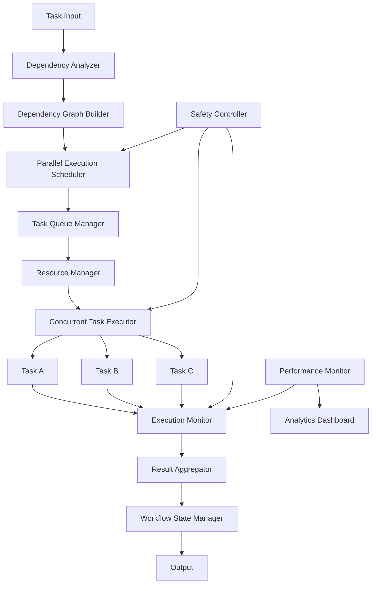

# Parallel Task Execution Architecture

## Overview

This architecture implements parallel task execution for the CTO platform by leveraging Taskmaster's dependency management features. The system identifies independent tasks that can execute concurrently, significantly reducing workflow execution time while maintaining data consistency and system reliability.

## Architecture Principles

1. **Dependency-First**: All parallel execution decisions are based on accurate dependency analysis
2. **Safety Over Speed**: Reliability and data consistency take precedence over performance gains
3. **Resource Awareness**: Parallel execution respects system resource limits and constraints
4. **Observability**: Comprehensive monitoring and visibility into parallel execution
5. **Graceful Degradation**: System gracefully falls back to sequential execution when needed

## System Architecture

### High-Level Design



## Component Design

### 1. Dependency Analyzer

Core component that analyzes Taskmaster dependencies and identifies parallel execution opportunities.

```rust
// src/parallel/dependency_analyzer.rs
use std::collections::{HashMap, HashSet};
use tokio::sync::RwLock;
use serde::{Deserialize, Serialize};

#[derive(Debug, Clone, Serialize, Deserialize)]
pub struct TaskDependency {
    pub task_id: String,
    pub dependencies: Vec<String>,
    pub resources: Vec<String>,
    pub estimated_duration: Duration,
    pub priority: u8,
}

#[derive(Debug, Clone, Serialize, Deserialize)]
pub struct DependencyGraph {
    pub nodes: HashMap<String, TaskDependency>,
    pub edges: HashMap<String, Vec<String>>,
    pub parallel_groups: Vec<Vec<String>>,
}

pub struct DependencyAnalyzer {
    graph: RwLock<DependencyGraph>,
    taskmaster_client: TaskmasterClient,
}

impl DependencyAnalyzer {
    pub async fn new(taskmaster_client: TaskmasterClient) -> Result<Self> {
        Ok(Self {
            graph: RwLock::new(DependencyGraph::new()),
            taskmaster_client,
        })
    }

    pub async fn analyze_dependencies(&self, task_ids: Vec<String>) -> Result<DependencyGraph> {
        let mut graph = DependencyGraph::new();
        
        // Fetch task dependencies from Taskmaster
        for task_id in task_ids {
            let task_deps = self.taskmaster_client.get_task_dependencies(&task_id).await?;
            graph.add_task(task_deps);
        }
        
        // Build dependency graph
        graph.build_edges();
        
        // Identify parallel execution groups
        graph.identify_parallel_groups();
        
        // Validate graph integrity
        graph.validate()?;
        
        *self.graph.write().await = graph.clone();
        Ok(graph)
    }

    pub async fn get_parallel_groups(&self) -> Result<Vec<Vec<String>>> {
        let graph = self.graph.read().await;
        Ok(graph.parallel_groups.clone())
    }

    pub async fn validate_dependencies(&self) -> Result<ValidationResult> {
        let graph = self.graph.read().await;
        
        let mut result = ValidationResult::new();
        
        // Check for circular dependencies
        if let Some(cycle) = graph.detect_cycles() {
            result.add_error(format!("Circular dependency detected: {:?}", cycle));
        }
        
        // Check for resource conflicts
        let conflicts = graph.detect_resource_conflicts();
        for conflict in conflicts {
            result.add_warning(format!("Resource conflict: {}", conflict));
        }
        
        // Validate Taskmaster dependency resolution
        let taskmaster_validation = self.validate_taskmaster_dependencies().await?;
        result.merge(taskmaster_validation);
        
        Ok(result)
    }

    async fn validate_taskmaster_dependencies(&self) -> Result<ValidationResult> {
        let mut result = ValidationResult::new();
        
        // Test Taskmaster's dependency resolution accuracy
        let test_cases = self.generate_test_cases();
        
        for test_case in test_cases {
            let taskmaster_result = self.taskmaster_client.resolve_dependencies(&test_case).await?;
            let expected_result = self.calculate_expected_dependencies(&test_case);
            
            if taskmaster_result != expected_result {
                result.add_warning(format!(
                    "Taskmaster dependency resolution mismatch for test case: {:?}",
                    test_case
                ));
            }
        }
        
        Ok(result)
    }
}
```

### 2. Dependency Graph Builder

Constructs and manages dependency graphs with parallel execution analysis.

```rust
// src/parallel/graph_builder.rs
use petgraph::graph::{DiGraph, NodeIndex};
use petgraph::algo::{toposort, is_cyclic_directed};
use std::collections::HashMap;

pub struct DependencyGraphBuilder {
    graph: DiGraph<TaskDependency, ()>,
    node_indices: HashMap<String, NodeIndex>,
}

impl DependencyGraphBuilder {
    pub fn new() -> Self {
        Self {
            graph: DiGraph::new(),
            node_indices: HashMap::new(),
        }
    }

    pub fn add_task(&mut self, task: TaskDependency) -> NodeIndex {
        let node_index = self.graph.add_node(task.clone());
        self.node_indices.insert(task.task_id.clone(), node_index);
        node_index
    }

    pub fn add_dependency(&mut self, from: &str, to: &str) -> Result<()> {
        let from_index = self.node_indices.get(from)
            .ok_or_else(|| anyhow!("Task not found: {}", from))?;
        let to_index = self.node_indices.get(to)
            .ok_or_else(|| anyhow!("Task not found: {}", to))?;
        
        self.graph.add_edge(*from_index, *to_index, ());
        Ok(())
    }

    pub fn identify_parallel_groups(&self) -> Vec<Vec<String>> {
        let mut parallel_groups = Vec::new();
        let mut visited = HashSet::new();
        
        // Find all nodes with no incoming edges (root nodes)
        let root_nodes: Vec<NodeIndex> = self.graph.node_indices()
            .filter(|&node| self.graph.edges_directed(node, petgraph::Direction::Incoming).count() == 0)
            .collect();
        
        for root in root_nodes {
            let mut group = Vec::new();
            self.collect_parallel_tasks(root, &mut group, &mut visited);
            if !group.is_empty() {
                parallel_groups.push(group);
            }
        }
        
        parallel_groups
    }

    fn collect_parallel_tasks(&self, node: NodeIndex, group: &mut Vec<String>, visited: &mut HashSet<NodeIndex>) {
        if visited.contains(&node) {
            return;
        }
        
        visited.insert(node);
        let task_id = self.graph[node].task_id.clone();
        group.push(task_id);
        
        // Find all tasks that can run in parallel (no dependencies between them)
        let successors: Vec<NodeIndex> = self.graph.neighbors(node).collect();
        for successor in successors {
            if !visited.contains(&successor) && !self.has_dependency_path(successor, node) {
                self.collect_parallel_tasks(successor, group, visited);
            }
        }
    }

    fn has_dependency_path(&self, from: NodeIndex, to: NodeIndex) -> bool {
        // Check if there's a path from 'from' to 'to' (dependency relationship)
        use petgraph::algo::has_path_connecting;
        has_path_connecting(&self.graph, from, to, None)
    }

    pub fn detect_cycles(&self) -> Option<Vec<String>> {
        if is_cyclic_directed(&self.graph) {
            // Find the cycle using DFS
            let mut visited = HashSet::new();
            let mut rec_stack = HashSet::new();
            let mut cycle = Vec::new();
            
            for node in self.graph.node_indices() {
                if !visited.contains(&node) {
                    if self.dfs_cycle_detection(node, &mut visited, &mut rec_stack, &mut cycle) {
                        return Some(cycle);
                    }
                }
            }
        }
        None
    }

    fn dfs_cycle_detection(&self, node: NodeIndex, visited: &mut HashSet<NodeIndex>, 
                          rec_stack: &mut HashSet<NodeIndex>, cycle: &mut Vec<String>) -> bool {
        visited.insert(node);
        rec_stack.insert(node);
        
        for neighbor in self.graph.neighbors(node) {
            if !visited.contains(&neighbor) {
                if self.dfs_cycle_detection(neighbor, visited, rec_stack, cycle) {
                    cycle.push(self.graph[node].task_id.clone());
                    return true;
                }
            } else if rec_stack.contains(&neighbor) {
                cycle.push(self.graph[node].task_id.clone());
                return true;
            }
        }
        
        rec_stack.remove(&node);
        false
    }

    pub fn detect_resource_conflicts(&self) -> Vec<String> {
        let mut conflicts = Vec::new();
        let mut resource_usage = HashMap::new();
        
        for node in self.graph.node_indices() {
            let task = &self.graph[node];
            for resource in &task.resources {
                if let Some(existing_task) = resource_usage.get(resource) {
                    conflicts.push(format!(
                        "Resource conflict: {} used by tasks {} and {}",
                        resource, existing_task, task.task_id
                    ));
                } else {
                    resource_usage.insert(resource.clone(), task.task_id.clone());
                }
            }
        }
        
        conflicts
    }
}
```

### 3. Parallel Execution Scheduler

Manages concurrent task execution with resource management and safety controls.

```rust
// src/parallel/scheduler.rs
use tokio::sync::{Semaphore, mpsc};
use std::sync::Arc;
use futures::stream::{StreamExt, FuturesUnordered};

pub struct ParallelScheduler {
    max_concurrency: usize,
    resource_semaphore: Arc<Semaphore>,
    task_queue: mpsc::UnboundedSender<ScheduledTask>,
    execution_monitor: Arc<ExecutionMonitor>,
    safety_controller: Arc<SafetyController>,
}

#[derive(Debug, Clone)]
pub struct ScheduledTask {
    pub task_id: String,
    pub dependencies: Vec<String>,
    pub resources: Vec<String>,
    pub priority: u8,
    pub estimated_duration: Duration,
}

impl ParallelScheduler {
    pub fn new(max_concurrency: usize) -> Self {
        let (tx, rx) = mpsc::unbounded_channel();
        let execution_monitor = Arc::new(ExecutionMonitor::new());
        let safety_controller = Arc::new(SafetyController::new());
        
        let scheduler = Self {
            max_concurrency,
            resource_semaphore: Arc::new(Semaphore::new(max_concurrency)),
            task_queue: tx,
            execution_monitor: execution_monitor.clone(),
            safety_controller: safety_controller.clone(),
        };
        
        // Start task processing loop
        tokio::spawn(scheduler.process_tasks(rx, execution_monitor, safety_controller));
        
        scheduler
    }

    pub async fn schedule_tasks(&self, parallel_groups: Vec<Vec<String>>) -> Result<()> {
        for group in parallel_groups {
            // Check safety conditions before scheduling
            if !self.safety_controller.can_execute_parallel(&group).await? {
                log::warn!("Safety check failed for parallel group: {:?}", group);
                continue;
            }
            
            // Schedule tasks in parallel group
            for task_id in group {
                let task = self.create_scheduled_task(&task_id).await?;
                self.task_queue.send(task)?;
            }
        }
        
        Ok(())
    }

    async fn process_tasks(
        &self,
        mut rx: mpsc::UnboundedReceiver<ScheduledTask>,
        execution_monitor: Arc<ExecutionMonitor>,
        safety_controller: Arc<SafetyController>,
    ) {
        let mut running_tasks = FuturesUnordered::new();
        
        while let Some(task) = rx.recv().await {
            // Wait for available concurrency slot
            let _permit = self.resource_semaphore.acquire().await.unwrap();
            
            // Check safety conditions
            if !safety_controller.can_execute_task(&task).await {
                log::warn!("Safety check failed for task: {}", task.task_id);
                continue;
            }
            
            // Start task execution
            let task_future = self.execute_task(task, execution_monitor.clone());
            running_tasks.push(task_future);
            
            // Process completed tasks
            while let Some(result) = running_tasks.next().await {
                match result {
                    Ok(task_id) => {
                        log::info!("Task completed successfully: {}", task_id);
                        execution_monitor.record_completion(&task_id).await;
                    }
                    Err(e) => {
                        log::error!("Task failed: {}", e);
                        execution_monitor.record_failure(&task_id, &e.to_string()).await;
                        
                        // Trigger safety measures
                        safety_controller.handle_task_failure(&task_id).await;
                    }
                }
            }
        }
    }

    async fn execute_task(&self, task: ScheduledTask, monitor: Arc<ExecutionMonitor>) -> Result<String> {
        let task_id = task.task_id.clone();
        
        // Record task start
        monitor.record_start(&task_id).await;
        
        // Execute task with timeout
        let timeout_duration = task.estimated_duration * 2; // 2x estimated time as timeout
        let task_result = tokio::time::timeout(
            timeout_duration,
            self.run_task(task)
        ).await;
        
        match task_result {
            Ok(result) => {
                monitor.record_success(&task_id).await;
                result
            }
            Err(_) => {
                let error = format!("Task timeout after {:?}", timeout_duration);
                monitor.record_timeout(&task_id).await;
                Err(anyhow!(error))
            }
        }
    }

    async fn run_task(&self, task: ScheduledTask) -> Result<String> {
        // Execute the actual task using the existing task execution system
        let task_executor = TaskExecutor::new();
        task_executor.execute(&task.task_id).await
    }
}
```

### 4. Resource Manager

Handles resource allocation, conflict resolution, and resource limits.

```rust
// src/parallel/resource_manager.rs
use std::collections::HashMap;
use tokio::sync::RwLock;
use std::sync::Arc;

#[derive(Debug, Clone)]
pub struct Resource {
    pub name: String,
    pub capacity: u32,
    pub current_usage: u32,
    pub tasks: Vec<String>,
}

pub struct ResourceManager {
    resources: Arc<RwLock<HashMap<String, Resource>>>,
    resource_locks: Arc<RwLock<HashMap<String, tokio::sync::Mutex<()>>>>,
}

impl ResourceManager {
    pub fn new() -> Self {
        Self {
            resources: Arc::new(RwLock::new(HashMap::new())),
            resource_locks: Arc::new(RwLock::new(HashMap::new())),
        }
    }

    pub async fn register_resource(&self, name: String, capacity: u32) {
        let mut resources = self.resources.write().await;
        resources.insert(name.clone(), Resource {
            name: name.clone(),
            capacity,
            current_usage: 0,
            tasks: Vec::new(),
        });
        
        let mut locks = self.resource_locks.write().await;
        locks.insert(name, tokio::sync::Mutex::new(()));
    }

    pub async fn allocate_resources(&self, task_id: &str, resources: Vec<String>) -> Result<bool> {
        let mut allocated = Vec::new();
        
        for resource_name in resources {
            let resource_lock = {
                let locks = self.resource_locks.read().await;
                locks.get(&resource_name)
                    .ok_or_else(|| anyhow!("Resource not found: {}", resource_name))?
                    .clone()
            };
            
            let _lock = resource_lock.lock().await;
            
            let mut resources = self.resources.write().await;
            if let Some(resource) = resources.get_mut(&resource_name) {
                if resource.current_usage < resource.capacity {
                    resource.current_usage += 1;
                    resource.tasks.push(task_id.to_string());
                    allocated.push(resource_name);
                } else {
                    // Rollback allocated resources
                    self.release_resources(task_id, &allocated).await;
                    return Ok(false);
                }
            }
        }
        
        Ok(true)
    }

    pub async fn release_resources(&self, task_id: &str, resources: &[String]) {
        for resource_name in resources {
            let resource_lock = {
                let locks = self.resource_locks.read().await;
                if let Some(lock) = locks.get(resource_name) {
                    lock.clone()
                } else {
                    continue;
                }
            };
            
            let _lock = resource_lock.lock().await;
            
            let mut resources = self.resources.write().await;
            if let Some(resource) = resources.get_mut(resource_name) {
                resource.current_usage = resource.current_usage.saturating_sub(1);
                resource.tasks.retain(|id| id != task_id);
            }
        }
    }

    pub async fn get_resource_status(&self) -> HashMap<String, Resource> {
        self.resources.read().await.clone()
    }

    pub async fn detect_conflicts(&self, task_resources: &[String]) -> Vec<String> {
        let mut conflicts = Vec::new();
        let resources = self.resources.read().await;
        
        for resource_name in task_resources {
            if let Some(resource) = resources.get(resource_name) {
                if resource.current_usage >= resource.capacity {
                    conflicts.push(format!(
                        "Resource {} at capacity ({}/{})",
                        resource_name, resource.current_usage, resource.capacity
                    ));
                }
            }
        }
        
        conflicts
    }
}
```

### 5. Execution Monitor

Tracks parallel execution status, performance metrics, and provides observability.

```rust
// src/parallel/execution_monitor.rs
use std::collections::HashMap;
use tokio::sync::RwLock;
use std::sync::Arc;
use std::time::{Instant, Duration};
use metrics::{counter, histogram, gauge};

#[derive(Debug, Clone)]
pub struct TaskExecution {
    pub task_id: String,
    pub start_time: Instant,
    pub end_time: Option<Instant>,
    pub status: TaskStatus,
    pub duration: Option<Duration>,
    pub error_message: Option<String>,
}

#[derive(Debug, Clone)]
pub enum TaskStatus {
    Running,
    Completed,
    Failed,
    Timeout,
}

pub struct ExecutionMonitor {
    executions: Arc<RwLock<HashMap<String, TaskExecution>>>,
    parallel_groups: Arc<RwLock<Vec<Vec<String>>>>,
    performance_metrics: Arc<RwLock<PerformanceMetrics>>,
}

#[derive(Debug, Clone)]
pub struct PerformanceMetrics {
    pub total_tasks: u64,
    pub completed_tasks: u64,
    pub failed_tasks: u64,
    pub average_duration: Duration,
    pub parallel_execution_time: Duration,
    pub sequential_execution_time: Duration,
    pub speedup_ratio: f64,
}

impl ExecutionMonitor {
    pub fn new() -> Self {
        Self {
            executions: Arc::new(RwLock::new(HashMap::new())),
            parallel_groups: Arc::new(RwLock::new(Vec::new())),
            performance_metrics: Arc::new(RwLock::new(PerformanceMetrics::new())),
        }
    }

    pub async fn record_start(&self, task_id: &str) {
        let execution = TaskExecution {
            task_id: task_id.to_string(),
            start_time: Instant::now(),
            end_time: None,
            status: TaskStatus::Running,
            duration: None,
            error_message: None,
        };
        
        let mut executions = self.executions.write().await;
        executions.insert(task_id.to_string(), execution);
        
        counter!("parallel_tasks_started", 1);
        gauge!("parallel_tasks_running", executions.len() as f64);
    }

    pub async fn record_completion(&self, task_id: &str) {
        let mut executions = self.executions.write().await;
        if let Some(execution) = executions.get_mut(task_id) {
            execution.end_time = Some(Instant::now());
            execution.status = TaskStatus::Completed;
            execution.duration = Some(execution.end_time.unwrap().duration_since(execution.start_time));
        }
        
        counter!("parallel_tasks_completed", 1);
        self.update_performance_metrics().await;
    }

    pub async fn record_failure(&self, task_id: &str, error: &str) {
        let mut executions = self.executions.write().await;
        if let Some(execution) = executions.get_mut(task_id) {
            execution.end_time = Some(Instant::now());
            execution.status = TaskStatus::Failed;
            execution.duration = Some(execution.end_time.unwrap().duration_since(execution.start_time));
            execution.error_message = Some(error.to_string());
        }
        
        counter!("parallel_tasks_failed", 1);
        self.update_performance_metrics().await;
    }

    pub async fn record_timeout(&self, task_id: &str) {
        let mut executions = self.executions.write().await;
        if let Some(execution) = executions.get_mut(task_id) {
            execution.end_time = Some(Instant::now());
            execution.status = TaskStatus::Timeout;
            execution.duration = Some(execution.end_time.unwrap().duration_since(execution.start_time));
        }
        
        counter!("parallel_tasks_timeout", 1);
        self.update_performance_metrics().await;
    }

    async fn update_performance_metrics(&self) {
        let executions = self.executions.read().await;
        let mut metrics = self.performance_metrics.write().await;
        
        metrics.total_tasks = executions.len() as u64;
        metrics.completed_tasks = executions.values()
            .filter(|e| matches!(e.status, TaskStatus::Completed))
            .count() as u64;
        metrics.failed_tasks = executions.values()
            .filter(|e| matches!(e.status, TaskStatus::Failed | TaskStatus::Timeout))
            .count() as u64;
        
        // Calculate average duration
        let completed_durations: Vec<Duration> = executions.values()
            .filter_map(|e| e.duration)
            .collect();
        
        if !completed_durations.is_empty() {
            let total_duration: Duration = completed_durations.iter().sum();
            metrics.average_duration = total_duration / completed_durations.len() as u32;
        }
        
        // Calculate speedup ratio
        if metrics.sequential_execution_time > Duration::ZERO {
            metrics.speedup_ratio = metrics.sequential_execution_time.as_secs_f64() / 
                                   metrics.parallel_execution_time.as_secs_f64();
        }
        
        // Update metrics
        histogram!("parallel_task_duration", metrics.average_duration.as_secs_f64());
        gauge!("parallel_speedup_ratio", metrics.speedup_ratio);
        gauge!("parallel_success_rate", 
               (metrics.completed_tasks as f64 / metrics.total_tasks as f64) * 100.0);
    }

    pub async fn get_execution_status(&self) -> HashMap<String, TaskExecution> {
        self.executions.read().await.clone()
    }

    pub async fn get_performance_metrics(&self) -> PerformanceMetrics {
        self.performance_metrics.read().await.clone()
    }

    pub async fn generate_report(&self) -> ExecutionReport {
        let executions = self.executions.read().await;
        let metrics = self.performance_metrics.read().await;
        
        ExecutionReport {
            total_tasks: executions.len(),
            completed_tasks: executions.values()
                .filter(|e| matches!(e.status, TaskStatus::Completed))
                .count(),
            failed_tasks: executions.values()
                .filter(|e| matches!(e.status, TaskStatus::Failed | TaskStatus::Timeout))
                .count(),
            average_duration: metrics.average_duration,
            speedup_ratio: metrics.speedup_ratio,
            parallel_groups: self.parallel_groups.read().await.clone(),
        }
    }
}

#[derive(Debug, Clone)]
pub struct ExecutionReport {
    pub total_tasks: usize,
    pub completed_tasks: usize,
    pub failed_tasks: usize,
    pub average_duration: Duration,
    pub speedup_ratio: f64,
    pub parallel_groups: Vec<Vec<String>>,
}
```

### 6. Safety Controller

Implements safeguards, conflict detection, and error recovery mechanisms.

```rust
// src/parallel/safety_controller.rs
use std::collections::HashMap;
use tokio::sync::RwLock;
use std::sync::Arc;
use std::time::{Instant, Duration};

pub struct SafetyController {
    circuit_breakers: Arc<RwLock<HashMap<String, CircuitBreaker>>>,
    failure_counts: Arc<RwLock<HashMap<String, u32>>>,
    resource_conflicts: Arc<RwLock<Vec<String>>>,
    safety_thresholds: SafetyThresholds,
}

#[derive(Debug, Clone)]
pub struct CircuitBreaker {
    pub name: String,
    pub failure_count: u32,
    pub last_failure_time: Option<Instant>,
    pub state: CircuitBreakerState,
    pub threshold: u32,
    pub timeout: Duration,
}

#[derive(Debug, Clone)]
pub enum CircuitBreakerState {
    Closed,    // Normal operation
    Open,      // Circuit is open, requests are blocked
    HalfOpen,  // Testing if service has recovered
}

#[derive(Debug, Clone)]
pub struct SafetyThresholds {
    pub max_concurrent_tasks: usize,
    pub max_failure_rate: f64,
    pub max_resource_utilization: f64,
    pub timeout_multiplier: f64,
}

impl SafetyController {
    pub fn new() -> Self {
        Self {
            circuit_breakers: Arc::new(RwLock::new(HashMap::new())),
            failure_counts: Arc::new(RwLock::new(HashMap::new())),
            resource_conflicts: Arc::new(RwLock::new(Vec::new())),
            safety_thresholds: SafetyThresholds {
                max_concurrent_tasks: 10,
                max_failure_rate: 0.1, // 10%
                max_resource_utilization: 0.8, // 80%
                timeout_multiplier: 2.0,
            },
        }
    }

    pub async fn can_execute_parallel(&self, task_group: &[String]) -> Result<bool> {
        // Check circuit breakers
        for task_id in task_group {
            if !self.check_circuit_breaker(task_id).await? {
                return Ok(false);
            }
        }
        
        // Check failure rates
        if self.get_failure_rate().await > self.safety_thresholds.max_failure_rate {
            log::warn!("Failure rate too high: {}", self.get_failure_rate().await);
            return Ok(false);
        }
        
        // Check resource conflicts
        let conflicts = self.resource_conflicts.read().await;
        if !conflicts.is_empty() {
            log::warn!("Resource conflicts detected: {:?}", conflicts);
            return Ok(false);
        }
        
        Ok(true)
    }

    pub async fn can_execute_task(&self, task: &ScheduledTask) -> Result<bool> {
        // Check task-specific circuit breaker
        if !self.check_circuit_breaker(&task.task_id).await? {
            return Ok(false);
        }
        
        // Check resource availability
        if !self.check_resource_availability(&task.resources).await? {
            return Ok(false);
        }
        
        Ok(true)
    }

    async fn check_circuit_breaker(&self, task_id: &str) -> Result<bool> {
        let mut breakers = self.circuit_breakers.write().await;
        
        if let Some(breaker) = breakers.get_mut(task_id) {
            match breaker.state {
                CircuitBreakerState::Closed => Ok(true),
                CircuitBreakerState::Open => {
                    if let Some(last_failure) = breaker.last_failure_time {
                        if Instant::now().duration_since(last_failure) > breaker.timeout {
                            breaker.state = CircuitBreakerState::HalfOpen;
                            Ok(true)
                        } else {
                            Ok(false)
                        }
                    } else {
                        Ok(false)
                    }
                }
                CircuitBreakerState::HalfOpen => Ok(true),
            }
        } else {
            // Create new circuit breaker
            breakers.insert(task_id.to_string(), CircuitBreaker {
                name: task_id.to_string(),
                failure_count: 0,
                last_failure_time: None,
                state: CircuitBreakerState::Closed,
                threshold: 5,
                timeout: Duration::from_secs(60),
            });
            Ok(true)
        }
    }

    async fn check_resource_availability(&self, resources: &[String]) -> Result<bool> {
        // This would integrate with the ResourceManager
        // For now, return true
        Ok(true)
    }

    pub async fn handle_task_failure(&self, task_id: &str) {
        let mut breakers = self.circuit_breakers.write().await;
        let mut failure_counts = self.failure_counts.write().await;
        
        // Update failure count
        *failure_counts.entry(task_id.to_string()).or_insert(0) += 1;
        
        // Update circuit breaker
        if let Some(breaker) = breakers.get_mut(task_id) {
            breaker.failure_count += 1;
            breaker.last_failure_time = Some(Instant::now());
            
            if breaker.failure_count >= breaker.threshold {
                breaker.state = CircuitBreakerState::Open;
                log::warn!("Circuit breaker opened for task: {}", task_id);
            }
        }
    }

    pub async fn handle_task_success(&self, task_id: &str) {
        let mut breakers = self.circuit_breakers.write().await;
        
        if let Some(breaker) = breakers.get_mut(task_id) {
            breaker.failure_count = 0;
            breaker.last_failure_time = None;
            breaker.state = CircuitBreakerState::Closed;
        }
    }

    async fn get_failure_rate(&self) -> f64 {
        let failure_counts = self.failure_counts.read().await;
        let total_failures: u32 = failure_counts.values().sum();
        let total_tasks = failure_counts.len() as u32;
        
        if total_tasks == 0 {
            0.0
        } else {
            total_failures as f64 / total_tasks as f64
        }
    }

    pub async fn add_resource_conflict(&self, conflict: String) {
        let mut conflicts = self.resource_conflicts.write().await;
        conflicts.push(conflict);
    }

    pub async fn clear_resource_conflicts(&self) {
        let mut conflicts = self.resource_conflicts.write().await;
        conflicts.clear();
    }
}
```

## Integration with Existing Workflows

### Workflow Modification

```rust
// src/workflows/parallel_workflow.rs
use crate::parallel::{DependencyAnalyzer, ParallelScheduler, ExecutionMonitor};

pub struct ParallelWorkflow {
    dependency_analyzer: DependencyAnalyzer,
    scheduler: ParallelScheduler,
    monitor: ExecutionMonitor,
}

impl ParallelWorkflow {
    pub async fn new() -> Result<Self> {
        let taskmaster_client = TaskmasterClient::new().await?;
        let dependency_analyzer = DependencyAnalyzer::new(taskmaster_client).await?;
        let scheduler = ParallelScheduler::new(10); // Max 10 concurrent tasks
        let monitor = ExecutionMonitor::new();
        
        Ok(Self {
            dependency_analyzer,
            scheduler,
            monitor,
        })
    }

    pub async fn execute_parallel(&self, task_ids: Vec<String>) -> Result<ExecutionReport> {
        // Analyze dependencies
        let dependency_graph = self.dependency_analyzer.analyze_dependencies(task_ids).await?;
        
        // Validate dependencies
        let validation = self.dependency_analyzer.validate_dependencies().await?;
        if !validation.is_valid() {
            return Err(anyhow!("Dependency validation failed: {:?}", validation.errors));
        }
        
        // Get parallel groups
        let parallel_groups = self.dependency_analyzer.get_parallel_groups().await?;
        
        // Schedule parallel execution
        self.scheduler.schedule_tasks(parallel_groups).await?;
        
        // Wait for completion and generate report
        tokio::time::sleep(Duration::from_secs(1)).await; // Wait for tasks to complete
        let report = self.monitor.generate_report().await;
        
        Ok(report)
    }
}
```

## Performance Monitoring

### Metrics Collection

```rust
// src/parallel/metrics.rs
use metrics::{counter, histogram, gauge};

pub struct ParallelMetrics {
    pub total_execution_time: Duration,
    pub parallel_execution_time: Duration,
    pub sequential_execution_time: Duration,
    pub speedup_ratio: f64,
    pub resource_utilization: f64,
    pub error_rate: f64,
}

impl ParallelMetrics {
    pub fn record_execution_time(&self, duration: Duration) {
        histogram!("parallel_execution_time", duration.as_secs_f64());
    }

    pub fn record_speedup_ratio(&self, ratio: f64) {
        gauge!("parallel_speedup_ratio", ratio);
    }

    pub fn record_resource_utilization(&self, utilization: f64) {
        gauge!("parallel_resource_utilization", utilization);
    }

    pub fn record_error_rate(&self, rate: f64) {
        gauge!("parallel_error_rate", rate);
    }
}
```

## Configuration

### Parallel Execution Settings

```yaml
# config/parallel-execution.yaml
parallel_execution:
  enabled: true
  max_concurrency: 10
  safety_thresholds:
    max_failure_rate: 0.1
    max_resource_utilization: 0.8
    timeout_multiplier: 2.0
  
  circuit_breaker:
    failure_threshold: 5
    timeout_seconds: 60
    half_open_timeout_seconds: 30
  
  resource_limits:
    cpu_per_task: "0.5"
    memory_per_task: "512Mi"
    max_concurrent_tasks: 10
  
  monitoring:
    metrics_enabled: true
    detailed_logging: true
    performance_tracking: true
```

This architecture provides a robust, safe, and efficient parallel task execution system that leverages Taskmaster's dependency management while adding comprehensive safety controls, resource management, and performance monitoring.
