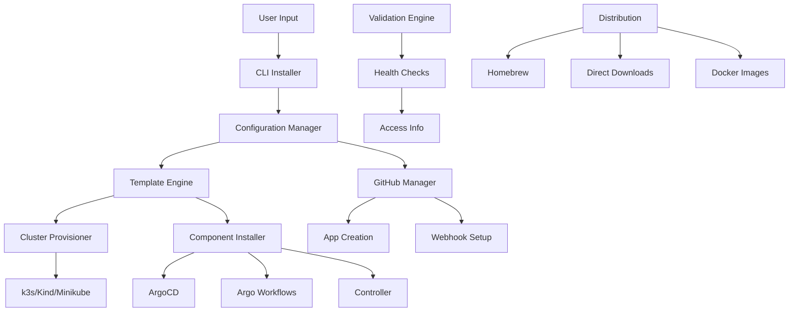

# Platform Packaging Architecture

## Overview

This architecture transforms the CTO platform from an organization-specific deployment into a generic, distributable product through automated installation, configuration abstraction, and multi-channel distribution.

## Architecture Principles

1. **Template-Driven Configuration**: All hardcoded values replaced with dynamic templates
2. **Profile-Based Installation**: Pre-configured profiles for different use cases
3. **Progressive Enhancement**: Start simple, add features as needed
4. **Cross-Platform Compatibility**: Support multiple Kubernetes distributions
5. **Zero-Configuration Defaults**: Sensible defaults for quick start

## System Architecture

### High-Level Design



## Component Design

### 1. CLI Installer Framework

Interactive command-line interface with progress tracking and error handling.

```rust
// cmd/cto/main.rs
use clap::{App, Arg, SubCommand};
use indicatif::{ProgressBar, ProgressStyle};
use tokio;

#[tokio::main]
async fn main() -> Result<()> {
    let matches = App::new("cto")
        .version(env!("CARGO_PKG_VERSION"))
        .about("Multi-Agent Development Platform")
        .subcommand(SubCommand::with_name("install")
            .about("Install the platform")
            .arg(Arg::with_name("profile")
                .short("p")
                .long("profile")
                .value_name("PROFILE")
                .help("Installation profile (minimal, standard, production)")
                .takes_value(true))
            .arg(Arg::with_name("config")
                .short("c")
                .long("config")
                .value_name("FILE")
                .help("Configuration file path")
                .takes_value(true))
            .arg(Arg::with_name("non-interactive")
                .long("non-interactive")
                .help("Skip interactive prompts")))
        .subcommand(SubCommand::with_name("status")
            .about("Show platform status"))
        .subcommand(SubCommand::with_name("upgrade")
            .about("Upgrade platform components"))
        .subcommand(SubCommand::with_name("uninstall")
            .about("Remove platform components"))
        .get_matches();

    match matches.subcommand() {
        ("install", Some(args)) => {
            let installer = Installer::new()?;
            installer.run(args).await?;
        }
        ("status", _) => {
            let status = StatusChecker::new()?;
            status.show()?;
        }
        ("upgrade", _) => {
            let upgrader = Upgrader::new()?;
            upgrader.upgrade().await?;
        }
        ("uninstall", _) => {
            let uninstaller = Uninstaller::new()?;
            uninstaller.uninstall().await?;
        }
        _ => {
            println!("{}", matches.usage());
        }
    }

    Ok(())
}

// pkg/installer/installer.rs
pub struct Installer {
    config: PlatformConfig,
    progress: ProgressBar,
    validator: PrerequisitesValidator,
    cluster_provisioner: Box<dyn ClusterProvisioner>,
    component_installer: ComponentInstaller,
    github_manager: GitHubManager,
    validation_engine: ValidationEngine,
}

impl Installer {
    pub async fn run(&self, args: &ArgMatches) -> Result<()> {
        // Initialize progress bar
        let progress = ProgressBar::new_spinner();
        progress.set_style(ProgressStyle::default_spinner()
            .template("{spinner:.green} {wide_msg}")
            .unwrap());

        // Step 1: Validate prerequisites
        progress.set_message("Checking prerequisites...");
        self.validator.validate()?;

        // Step 2: Load or create configuration
        progress.set_message("Loading configuration...");
        let config = self.load_config(args)?;

        // Step 3: Provision Kubernetes cluster
        progress.set_message("Setting up Kubernetes cluster...");
        self.cluster_provisioner.provision(&config).await?;

        // Step 4: Install core components
        progress.set_message("Installing core components...");
        self.component_installer.install_core(&config).await?;

        // Step 5: Configure GitHub integration
        progress.set_message("Setting up GitHub integration...");
        self.github_manager.setup_integration(&config).await?;

        // Step 6: Install optional features
        if config.features.monitoring || config.features.databases {
            progress.set_message("Installing optional features...");
            self.component_installer.install_optional(&config).await?;
        }

        // Step 7: Run validation tests
        progress.set_message("Running validation tests...");
        self.validation_engine.run_all_checks(&config).await?;

        // Step 8: Display access information
        progress.finish_with_message("Installation complete!");
        self.show_access_info(&config)?;

        Ok(())
    }

    fn load_config(&self, args: &ArgMatches) -> Result<PlatformConfig> {
        if let Some(config_file) = args.value_of("config") {
            // Load from file
            let content = std::fs::read_to_string(config_file)?;
            Ok(serde_yaml::from_str(&content)?)
        } else {
            // Interactive configuration
            self.create_interactive_config(args)
        }
    }

    fn create_interactive_config(&self, args: &ArgMatches) -> Result<PlatformConfig> {
        let profile = args.value_of("profile")
            .unwrap_or("minimal")
            .to_string();

        let non_interactive = args.is_present("non-interactive");

        if non_interactive {
            // Use defaults
            Ok(PlatformConfig::default_for_profile(&profile))
        } else {
            // Interactive wizard
            self.run_configuration_wizard(&profile)
        }
    }
}
```

### 2. Template Engine

Dynamic configuration generation using Handlebars templates.

```rust
// pkg/templates/engine.rs
use handlebars::{Handlebars, Context, Template, Helper, RenderContext, RenderError, Output};
use serde_json::Value;
use std::collections::HashMap;

pub struct TemplateEngine {
    handlebars: Handlebars,
    templates: HashMap<String, String>,
    config: PlatformConfig,
}

impl TemplateEngine {
    pub fn new(config: PlatformConfig) -> Result<Self> {
        let mut handlebars = Handlebars::new();
        
        // Register custom helpers
        handlebars.register_helper("env", Box::new(env_helper));
        handlebars.register_helper("secret", Box::new(secret_helper));
        handlebars.register_helper("random", Box::new(random_helper));
        handlebars.register_helper("k8s_name", Box::new(k8s_name_helper));
        handlebars.register_helper("base64", Box::new(base64_helper));
        
        Ok(Self {
            handlebars,
            templates: HashMap::new(),
            config,
        })
    }

    pub fn render_kubernetes_manifest(&self, template_name: &str) -> Result<String> {
        let template = self.templates.get(template_name)
            .ok_or_else(|| anyhow!("Template not found: {}", template_name))?;
        
        let data = serde_json::to_value(&self.config)?;
        
        self.handlebars.render_template(template, &data)
            .map_err(|e| anyhow!("Template render error: {}", e))
    }

    pub fn render_all_manifests(&self) -> Result<HashMap<String, String>> {
        let mut manifests = HashMap::new();
        
        for template_name in self.templates.keys() {
            let rendered = self.render_kubernetes_manifest(template_name)?;
            manifests.insert(template_name.clone(), rendered);
        }
        
        Ok(manifests)
    }
}

// Custom template helpers
fn env_helper(h: &Helper, _: &Handlebars, _: &Context, _: &mut RenderContext, out: &mut dyn Output) -> Result<(), RenderError> {
    let var_name = h.param(0)
        .and_then(|v| v.value().as_str())
        .ok_or_else(|| RenderError::new("Environment variable name required"))?;
    
    let value = std::env::var(var_name)
        .unwrap_or_else(|_| format!("${{{}}}", var_name));
    
    out.write(&value)?;
    Ok(())
}

fn k8s_name_helper(h: &Helper, _: &Handlebars, _: &Context, _: &mut RenderContext, out: &mut dyn Output) -> Result<(), RenderError> {
    let input = h.param(0)
        .and_then(|v| v.value().as_str())
        .ok_or_else(|| RenderError::new("Input string required"))?;
    
    // Convert to Kubernetes-compatible name
    let k8s_name = input
        .to_lowercase()
        .replace(|c: char| !c.is_alphanumeric(), "-")
        .trim_matches('-')
        .to_string();
    
    out.write(&k8s_name)?;
    Ok(())
}

fn base64_helper(h: &Helper, _: &Handlebars, _: &Context, _: &mut RenderContext, out: &mut dyn Output) -> Result<(), RenderError> {
    let input = h.param(0)
        .and_then(|v| v.value().as_str())
        .ok_or_else(|| RenderError::new("Input string required"))?;
    
    let encoded = base64::encode(input.as_bytes());
    out.write(&encoded)?;
    Ok(())
}
```

### 3. Cluster Provisioner

Abstract interface for different Kubernetes cluster types.

```rust
// pkg/cluster/provisioner.rs
use async_trait::async_trait;
use std::process::Command;

#[async_trait]
pub trait ClusterProvisioner: Send + Sync {
    async fn provision(&self, config: &PlatformConfig) -> Result<()>;
    async fn validate(&self) -> Result<()>;
    async fn destroy(&self) -> Result<()>;
    fn get_kubeconfig_path(&self) -> String;
}

pub struct K3sProvisioner {
    config: K3sConfig,
}

#[async_trait]
impl ClusterProvisioner for K3sProvisioner {
    async fn provision(&self, config: &PlatformConfig) -> Result<()> {
        let install_script = format!(r#"
#!/bin/bash
set -e

echo "Installing k3s cluster..."

# Install k3s
curl -sfL https://get.k3s.io | INSTALL_K3S_VERSION={} sh -s - \
    --disable traefik \
    --write-kubeconfig-mode 644 \
    --node-label cto=true \
    --node-label profile={}

# Wait for cluster to be ready
echo "Waiting for cluster to be ready..."
kubectl wait --for=condition=Ready nodes --all --timeout=300s

# Install local path provisioner
echo "Installing storage provisioner..."
kubectl apply -f https://raw.githubusercontent.com/rancher/local-path-provisioner/master/deploy/local-path-storage.yaml
kubectl patch storageclass local-path -p '{{"metadata": {{"annotations":{{"storageclass.kubernetes.io/is-default-class": "true"}}}}}}'

# Create namespace
kubectl create namespace {} --dry-run=client -o yaml | kubectl apply -f -

echo "k3s cluster ready!"
"#, self.config.k3s_version, config.profile.name, config.platform.namespace);

        // Execute installation script
        let output = Command::new("bash")
            .arg("-c")
            .arg(&install_script)
            .output()
            .await?;

        if !output.status.success() {
            return Err(anyhow!("K3s installation failed: {}", 
                String::from_utf8_lossy(&output.stderr)));
        }

        Ok(())
    }

    async fn validate(&self) -> Result<()> {
        // Check if k3s is running
        let output = Command::new("kubectl")
            .arg("get")
            .arg("nodes")
            .output()
            .await?;

        if !output.status.success() {
            return Err(anyhow!("Kubernetes cluster not accessible"));
        }

        Ok(())
    }

    async fn destroy(&self) -> Result<()> {
        // Uninstall k3s
        let output = Command::new("/usr/local/bin/k3s-uninstall.sh")
            .output()
            .await?;

        if !output.status.success() {
            return Err(anyhow!("Failed to uninstall k3s"));
        }

        Ok(())
    }

    fn get_kubeconfig_path(&self) -> String {
        "/etc/rancher/k3s/k3s.yaml".to_string()
    }
}

pub struct KindProvisioner {
    config: KindConfig,
}

#[async_trait]
impl ClusterProvisioner for KindProvisioner {
    async fn provision(&self, config: &PlatformConfig) -> Result<()> {
        let kind_config = format!(r#"
kind: Cluster
apiVersion: kind.x-k8s.io/v1alpha4
name: cto
nodes:
- role: control-plane
  extraPortMappings:
  - containerPort: 80
    hostPort: 80
  - containerPort: 443
    hostPort: 443
  - containerPort: 8080
    hostPort: 8080
  - containerPort: 2746
    hostPort: 2746
  - containerPort: 3000
    hostPort: 3000
  kubeadmConfigPatches:
  - |
    kind: InitConfiguration
    nodeRegistration:
      kubeletExtraArgs:
        node-labels: "cto=true,profile={}"
"#, config.profile.name);

        // Create kind cluster
        let output = Command::new("kind")
            .arg("create")
            .arg("cluster")
            .arg("--config")
            .arg("-")
            .arg("--name")
            .arg("cto")
            .stdin(Stdio::piped())
            .output()
            .await?;

        if !output.status.success() {
            return Err(anyhow!("Kind cluster creation failed: {}", 
                String::from_utf8_lossy(&output.stderr)));
        }

        // Create namespace
        Command::new("kubectl")
            .arg("create")
            .arg("namespace")
            .arg(&config.platform.namespace)
            .arg("--dry-run=client")
            .arg("-o")
            .arg("yaml")
            .pipe_to(Command::new("kubectl").arg("apply").arg("-f").arg("-"))
            .await?;

        Ok(())
    }

    async fn validate(&self) -> Result<()> {
        let output = Command::new("kind")
            .arg("get")
            .arg("clusters")
            .output()
            .await?;

        if !output.status.success() || !String::from_utf8_lossy(&output.stdout).contains("cto") {
            return Err(anyhow!("Kind cluster 'cto' not found"));
        }

        Ok(())
    }

    async fn destroy(&self) -> Result<()> {
        let output = Command::new("kind")
            .arg("delete")
            .arg("cluster")
            .arg("--name")
            .arg("cto")
            .output()
            .await?;

        if !output.status.success() {
            return Err(anyhow!("Failed to delete kind cluster"));
        }

        Ok(())
    }

    fn get_kubeconfig_path(&self) -> String {
        // Kind uses the default kubeconfig
        std::env::var("KUBECONFIG").unwrap_or_else(|_| {
            let home = std::env::var("HOME").unwrap_or_else(|_| ".".to_string());
            format!("{}/.kube/config", home)
        })
    }
}
```

### 4. Component Installer

Manages installation of platform components in the correct order.

```rust
// pkg/components/installer.rs
use kube::{Client, Api, ResourceExt};
use k8s_openapi::api::apps::v1::Deployment;
use k8s_openapi::api::core::v1::Pod;

pub struct ComponentInstaller {
    kube_client: Client,
    template_engine: TemplateEngine,
}

impl ComponentInstaller {
    pub async fn install_core(&self, config: &PlatformConfig) -> Result<()> {
        let components = self.get_core_components();
        
        for component in components {
            self.install_component(&component, config).await?;
        }

        Ok(())
    }

    pub async fn install_optional(&self, config: &PlatformConfig) -> Result<()> {
        let mut optional_components = Vec::new();

        if config.features.monitoring {
            optional_components.extend(self.get_monitoring_components());
        }

        if config.features.databases {
            optional_components.extend(self.get_database_components());
        }

        if config.features.backup {
            optional_components.extend(self.get_backup_components());
        }

        for component in optional_components {
            self.install_component(&component, config).await?;
        }

        Ok(())
    }

    async fn install_component(&self, component: &Component, config: &PlatformConfig) -> Result<()> {
        println!("Installing {}...", component.display_name);

        // Render component manifests
        let manifests = self.template_engine.render_component_manifests(component, config)?;

        // Apply manifests to cluster
        for (name, manifest) in manifests {
            self.apply_manifest(&name, &manifest).await?;
        }

        // Wait for component to be ready
        self.wait_for_component_ready(component).await?;

        println!("✓ {} installed successfully", component.display_name);
        Ok(())
    }

    async fn apply_manifest(&self, name: &str, manifest: &str) -> Result<()> {
        // Parse YAML manifest
        let docs: Vec<serde_yaml::Value> = serde_yaml::from_str(manifest)?;

        for doc in docs {
            if let Some(kind) = doc.get("kind").and_then(|k| k.as_str()) {
                match kind {
                    "Deployment" => {
                        let deployment: Deployment = serde_yaml::from_value(doc)?;
                        let api: Api<Deployment> = Api::namespaced(
                            self.kube_client.clone(),
                            &deployment.metadata.namespace.as_deref().unwrap_or("default")
                        );
                        api.create(&kube::api::PostParams::default(), &deployment).await?;
                    }
                    "Service" => {
                        let service: k8s_openapi::api::core::v1::Service = serde_yaml::from_value(doc)?;
                        let api: Api<k8s_openapi::api::core::v1::Service> = Api::namespaced(
                            self.kube_client.clone(),
                            &service.metadata.namespace.as_deref().unwrap_or("default")
                        );
                        api.create(&kube::api::PostParams::default(), &service).await?;
                    }
                    "ConfigMap" => {
                        let configmap: k8s_openapi::api::core::v1::ConfigMap = serde_yaml::from_value(doc)?;
                        let api: Api<k8s_openapi::api::core::v1::ConfigMap> = Api::namespaced(
                            self.kube_client.clone(),
                            &configmap.metadata.namespace.as_deref().unwrap_or("default")
                        );
                        api.create(&kube::api::PostParams::default(), &configmap).await?;
                    }
                    _ => {
                        // Use generic apply for other resource types
                        self.apply_generic_resource(&doc).await?;
                    }
                }
            }
        }

        Ok(())
    }

    async fn wait_for_component_ready(&self, component: &Component) -> Result<()> {
        let timeout = std::time::Duration::from_secs(300); // 5 minutes
        let start = std::time::Instant::now();

        while start.elapsed() < timeout {
            if self.is_component_ready(component).await? {
                return Ok(());
            }
            tokio::time::sleep(std::time::Duration::from_secs(5)).await;
        }

        Err(anyhow!("Component {} failed to become ready within timeout", component.name))
    }

    async fn is_component_ready(&self, component: &Component) -> Result<bool> {
        // Check if all deployments are ready
        let api: Api<Deployment> = Api::all(self.kube_client.clone());
        let deployments = api.list(&kube::api::ListParams::default()).await?;

        for deployment in deployments {
            if deployment.metadata.labels.as_ref()
                .and_then(|l| l.get("app"))
                .and_then(|v| v.as_str())
                .map(|app| app.contains(&component.name))
                .unwrap_or(false)
            {
                if let Some(status) = deployment.status {
                    if let Some(ready_replicas) = status.ready_replicas {
                        if let Some(replicas) = status.replicas {
                            if ready_replicas < replicas {
                                return Ok(false);
                            }
                        }
                    }
                }
            }
        }

        Ok(true)
    }

    fn get_core_components(&self) -> Vec<Component> {
        vec![
            Component::new("argocd", "ArgoCD", ComponentCategory::Core),
            Component::new("argo-workflows", "Argo Workflows", ComponentCategory::Core),
            Component::new("argo-events", "Argo Events", ComponentCategory::Core),
            Component::new("controller", "Multi-Agent Controller", ComponentCategory::Core),
        ]
    }

    fn get_monitoring_components(&self) -> Vec<Component> {
        vec![
            Component::new("grafana", "Grafana", ComponentCategory::Monitoring),
            Component::new("victoria-metrics", "VictoriaMetrics", ComponentCategory::Monitoring),
            Component::new("victoria-logs", "VictoriaLogs", ComponentCategory::Monitoring),
        ]
    }

    fn get_database_components(&self) -> Vec<Component> {
        vec![
            Component::new("postgresql-operator", "PostgreSQL Operator", ComponentCategory::Database),
            Component::new("redis-operator", "Redis Operator", ComponentCategory::Database),
        ]
    }
}
```

### 5. GitHub Integration Manager

Automates GitHub App creation and webhook configuration.

```rust
// pkg/github/manager.rs
use octocrab::Octocrab;
use serde_json::json;

pub struct GitHubManager {
    client: Octocrab,
    config: GitHubConfig,
}

impl GitHubManager {
    pub async fn setup_integration(&self, platform_config: &PlatformConfig) -> Result<()> {
        // Create GitHub Apps for each agent
        for (agent_name, agent_config) in &platform_config.agents {
            if agent_config.enabled {
                let app = self.create_github_app(agent_name, platform_config).await?;
                println!("✓ Created GitHub App for {} (ID: {})", agent_name, app.id);
            }
        }

        // Configure webhooks
        self.setup_webhooks(platform_config).await?;

        Ok(())
    }

    async fn create_github_app(&self, agent_name: &str, config: &PlatformConfig) -> Result<GitHubApp> {
        let manifest = json!({
            "name": format!("{}-agent-{}", config.platform.name, agent_name),
            "url": format!("https://github.com/{}", config.github.organization),
            "hook_attributes": {
                "url": format!("{}/webhooks/{}", self.get_webhook_url(config), agent_name),
                "content_type": "json"
            },
            "redirect_url": "http://localhost:8080/callback",
            "callback_urls": ["http://localhost:8080/callback"],
            "public": false,
            "default_permissions": self.get_agent_permissions(agent_name),
            "default_events": self.get_agent_events(agent_name),
        });

        // Note: GitHub App creation via API requires OAuth flow
        // For now, we'll provide instructions for manual creation
        println!("Please create GitHub App manually:");
        println!("1. Go to: https://github.com/settings/apps/new");
        println!("2. Use this manifest:");
        println!("{}", serde_json::to_string_pretty(&manifest)?);
        println!("3. Save the App ID and private key");

        // In a full implementation, this would use the GitHub API
        // to create the app programmatically
        Ok(GitHubApp {
            id: "manual-creation-required".to_string(),
            name: format!("{}-agent-{}", config.platform.name, agent_name),
            webhook_url: format!("{}/webhooks/{}", self.get_webhook_url(config), agent_name),
        })
    }

    fn get_agent_permissions(&self, agent_name: &str) -> serde_json::Value {
        match agent_name {
            "rex" => json!({
                "contents": "write",
                "pull_requests": "write",
                "issues": "write",
                "actions": "write",
                "checks": "write"
            }),
            "cleo" => json!({
                "contents": "read",
                "pull_requests": "write",
                "issues": "write",
                "checks": "write"
            }),
            "tess" => json!({
                "contents": "read",
                "pull_requests": "write",
                "issues": "write",
                "checks": "write"
            }),
            _ => json!({
                "contents": "read",
                "metadata": "read"
            })
        }
    }

    fn get_agent_events(&self, agent_name: &str) -> Vec<String> {
        match agent_name {
            "rex" => vec![
                "pull_request".to_string(),
                "pull_request_review".to_string(),
                "issue_comment".to_string(),
                "push".to_string(),
            ],
            "cleo" | "tess" => vec![
                "pull_request".to_string(),
                "check_suite".to_string(),
                "check_run".to_string(),
                "issue_comment".to_string(),
            ],
            _ => vec![
                "push".to_string(),
                "release".to_string(),
            ]
        }
    }

    fn get_webhook_url(&self, config: &PlatformConfig) -> String {
        // This would be determined by the tunnel provider
        match config.tunneling.provider.as_str() {
            "ngrok" => format!("https://{}.ngrok.io", config.platform.name),
            "cloudflare" => format!("https://webhooks.{}", config.platform.domain.as_deref().unwrap_or("local")),
            _ => "http://localhost:8080".to_string(),
        }
    }
}
```

## Distribution Architecture

### Build System
```bash
#!/bin/bash
# build-release.sh

set -e

VERSION=${1:-"0.1.0"}
PLATFORMS=("darwin/amd64" "darwin/arm64" "linux/amd64" "linux/arm64" "windows/amd64")

echo "Building cto v${VERSION}"

# Clean previous builds
rm -rf dist/
mkdir -p dist/

# Build binaries for all platforms
for PLATFORM in "${PLATFORMS[@]}"; do
    GOOS=${PLATFORM%/*}
    GOARCH=${PLATFORM#*/}
    
    echo "Building for $GOOS/$GOARCH..."
    
    env GOOS=$GOOS GOARCH=$GOARCH go build \
        -ldflags "-X main.Version=$VERSION -X main.BuildTime=$(date -u '+%Y-%m-%d_%H:%M:%S')" \
        -o "dist/cto-${GOOS}-${GOARCH}" \
        ./cmd/cto
done

# Package with assets
for PLATFORM in "${PLATFORMS[@]}"; do
    GOOS=${PLATFORM%/*}
    GOARCH=${PLATFORM#*/}
    
    echo "Packaging for $GOOS/$GOARCH..."
    
    # Create package directory
    mkdir -p "dist/cto-${VERSION}-${GOOS}-${GOARCH}"
    
    # Copy binary
    cp "dist/cto-${GOOS}-${GOARCH}" "dist/cto-${VERSION}-${GOOS}-${GOARCH}/cto"
    
    # Copy assets
    cp -r templates/ "dist/cto-${VERSION}-${GOOS}-${GOARCH}/"
    cp -r scripts/ "dist/cto-${VERSION}-${GOOS}-${GOARCH}/"
    cp -r config/ "dist/cto-${VERSION}-${GOOS}-${GOARCH}/"
    
    # Create archive
    tar -czf "dist/cto-${VERSION}-${GOOS}-${GOARCH}.tar.gz" \
        -C "dist" "cto-${VERSION}-${GOOS}-${GOARCH}"
    
    # Clean up
    rm -rf "dist/cto-${VERSION}-${GOOS}-${GOARCH}"
done

# Create checksums
cd dist
sha256sum cto-${VERSION}-*.tar.gz > SHA256SUMS

echo "Build complete! Artifacts in dist/"
```

### Homebrew Integration
```ruby
# Formula/cto.rb
class AgentPlatform < Formula
  desc "Multi-Agent Software Development Orchestration Platform"
  homepage "https://github.com/yourusername/cto"
  version "0.1.0"
  
  if OS.mac? && Hardware::CPU.arm?
    url "https://github.com/yourusername/cto/releases/download/v#{version}/cto-#{version}-darwin-arm64.tar.gz"
    sha256 "xxx"
  elsif OS.mac?
    url "https://github.com/yourusername/cto/releases/download/v#{version}/cto-#{version}-darwin-amd64.tar.gz"
    sha256 "xxx"
  elsif OS.linux?
    url "https://github.com/yourusername/cto/releases/download/v#{version}/cto-#{version}-linux-amd64.tar.gz"
    sha256 "xxx"
  end
  
  depends_on "kubectl"
  depends_on "helm"
  
  def install
    bin.install "cto"
    (share/"cto").install "templates", "scripts", "config"
  end
  
  def post_install
    (var/"cto").mkpath
    (etc/"cto").mkpath
  end
  
  test do
    assert_match version.to_s, shell_output("#{bin}/cto version")
  end
end
```

## Configuration Management

### Profile System
```rust
// pkg/config/profiles.rs
pub struct ProfileManager {
    profiles: HashMap<String, InstallationProfile>,
}

impl ProfileManager {
    pub fn new() -> Self {
        let mut profiles = HashMap::new();
        
        // Minimal profile
        profiles.insert("minimal".to_string(), InstallationProfile {
            name: "minimal".to_string(),
            description: "Local development with minimal resources".to_string(),
            components: vec![
                Component::new("argocd", "ArgoCD", ComponentCategory::Core),
                Component::new("argo-workflows", "Argo Workflows", ComponentCategory::Core),
                Component::new("controller", "Multi-Agent Controller", ComponentCategory::Core),
            ],
            features: FeatureFlags {
                monitoring: false,
                databases: false,
                mail_notifications: false,
                backup: false,
                high_availability: false,
            },
            resource_requirements: ResourceRequirements {
                cpu: 4,
                memory: 8 * 1024 * 1024 * 1024, // 8GB
                disk: 20 * 1024 * 1024 * 1024,  // 20GB
            },
            estimated_install_time: Duration::from_secs(300), // 5 minutes
        });
        
        // Standard profile
        profiles.insert("standard".to_string(), InstallationProfile {
            name: "standard".to_string(),
            description: "Team development with full features".to_string(),
            components: vec![
                Component::new("argocd", "ArgoCD", ComponentCategory::Core),
                Component::new("argo-workflows", "Argo Workflows", ComponentCategory::Core),
                Component::new("argo-events", "Argo Events", ComponentCategory::Core),
                Component::new("controller", "Multi-Agent Controller", ComponentCategory::Core),
                Component::new("grafana", "Grafana", ComponentCategory::Monitoring),
                Component::new("victoria-metrics", "VictoriaMetrics", ComponentCategory::Monitoring),
                Component::new("postgresql-operator", "PostgreSQL Operator", ComponentCategory::Database),
            ],
            features: FeatureFlags {
                monitoring: true,
                databases: true,
                mail_notifications: false,
                backup: false,
                high_availability: false,
            },
            resource_requirements: ResourceRequirements {
                cpu: 8,
                memory: 16 * 1024 * 1024 * 1024, // 16GB
                disk: 50 * 1024 * 1024 * 1024,   // 50GB
            },
            estimated_install_time: Duration::from_secs(600), // 10 minutes
        });
        
        // Production profile
        profiles.insert("production".to_string(), InstallationProfile {
            name: "production".to_string(),
            description: "Production deployment with high availability".to_string(),
            components: vec![
                Component::new("argocd", "ArgoCD", ComponentCategory::Core),
                Component::new("argo-workflows", "Argo Workflows", ComponentCategory::Core),
                Component::new("argo-events", "Argo Events", ComponentCategory::Core),
                Component::new("controller", "Multi-Agent Controller", ComponentCategory::Core),
                Component::new("grafana", "Grafana", ComponentCategory::Monitoring),
                Component::new("victoria-metrics", "VictoriaMetrics", ComponentCategory::Monitoring),
                Component::new("victoria-logs", "VictoriaLogs", ComponentCategory::Monitoring),
                Component::new("postgresql-operator", "PostgreSQL Operator", ComponentCategory::Database),
                Component::new("redis-operator", "Redis Operator", ComponentCategory::Database),
                Component::new("backup-operator", "Backup Operator", ComponentCategory::Security),
            ],
            features: FeatureFlags {
                monitoring: true,
                databases: true,
                mail_notifications: true,
                backup: true,
                high_availability: true,
            },
            resource_requirements: ResourceRequirements {
                cpu: 16,
                memory: 32 * 1024 * 1024 * 1024, // 32GB
                disk: 100 * 1024 * 1024 * 1024,  // 100GB
            },
            estimated_install_time: Duration::from_secs(900), // 15 minutes
        });
        
        Self { profiles }
    }
}
```

## Validation and Health Checks

### Health Check System
```rust
// pkg/validation/health.rs
pub struct HealthChecker {
    kube_client: Client,
    config: PlatformConfig,
}

impl HealthChecker {
    pub async fn run_all_checks(&self) -> Result<ValidationReport> {
        let mut report = ValidationReport::new();
        
        // Check Kubernetes connectivity
        report.add_check(self.check_kubernetes_connectivity().await);
        
        // Check core components
        report.add_check(self.check_core_components().await);
        
        // Check GitHub integration
        report.add_check(self.check_github_integration().await);
        
        // Check webhook delivery
        report.add_check(self.check_webhook_delivery().await);
        
        // Check agent readiness
        report.add_check(self.check_agent_readiness().await);
        
        Ok(report)
    }
    
    async fn check_kubernetes_connectivity(&self) -> HealthCheck {
        match self.kube_client.list_core_v1_nodes().await {
            Ok(_) => HealthCheck::passed("Kubernetes Connectivity"),
            Err(e) => HealthCheck::failed("Kubernetes Connectivity", &e.to_string()),
        }
    }
    
    async fn check_core_components(&self) -> HealthCheck {
        let components = ["argocd", "argo-workflows", "controller"];
        let mut failed = Vec::new();
        
        for component in &components {
            if !self.is_component_healthy(component).await {
                failed.push(component.to_string());
            }
        }
        
        if failed.is_empty() {
            HealthCheck::passed("Core Components")
        } else {
            HealthCheck::failed("Core Components", &format!("Failed: {}", failed.join(", ")))
        }
    }
    
    async fn check_github_integration(&self) -> HealthCheck {
        // Test GitHub API connectivity
        match self.test_github_api().await {
            Ok(_) => HealthCheck::passed("GitHub Integration"),
            Err(e) => HealthCheck::failed("GitHub Integration", &e.to_string()),
        }
    }
    
    async fn check_webhook_delivery(&self) -> HealthCheck {
        // Test webhook delivery
        match self.test_webhook_delivery().await {
            Ok(_) => HealthCheck::passed("Webhook Delivery"),
            Err(e) => HealthCheck::failed("Webhook Delivery", &e.to_string()),
        }
    }
    
    async fn check_agent_readiness(&self) -> HealthCheck {
        // Check if agents can be scheduled
        match self.test_agent_scheduling().await {
            Ok(_) => HealthCheck::passed("Agent Readiness"),
            Err(e) => HealthCheck::failed("Agent Readiness", &e.to_string()),
        }
    }
}

#[derive(Debug)]
pub struct HealthCheck {
    pub name: String,
    pub status: HealthStatus,
    pub message: String,
    pub timestamp: DateTime<Utc>,
}

#[derive(Debug)]
pub enum HealthStatus {
    Passed,
    Failed,
    Warning,
}

impl HealthCheck {
    pub fn passed(name: &str) -> Self {
        Self {
            name: name.to_string(),
            status: HealthStatus::Passed,
            message: "Check passed".to_string(),
            timestamp: Utc::now(),
        }
    }
    
    pub fn failed(name: &str, error: &str) -> Self {
        Self {
            name: name.to_string(),
            status: HealthStatus::Failed,
            message: error.to_string(),
            timestamp: Utc::now(),
        }
    }
}
```

This architecture provides a comprehensive packaging system that transforms the CTO platform into a distributable product while maintaining flexibility and ease of use.
