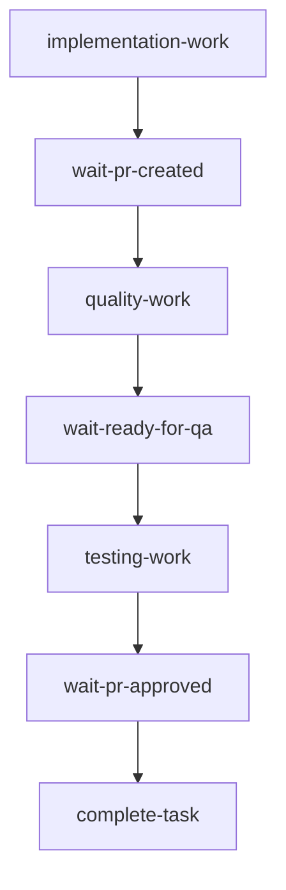

# Play Workflow Architecture

## Overview

The Play Workflow Template orchestrates multi-agent collaboration through a sophisticated event-driven DAG structure. It coordinates implementation, quality assurance, and testing phases across days or weeks of development time.

## Architecture Components

### 1. Workflow Template Structure

The `play-workflow-template` is an Argo WorkflowTemplate that defines:
- **14-day execution window** (`activeDeadlineSeconds: 1209600`)
- **Parameterized agent selection** (no hardcoded agent names)
- **Event-driven suspend/resume patterns**
- **Comprehensive labeling for correlation**

### 2. DAG Task Structure



Each task represents a specific phase:
- **implementation-work**: Rex/Blaze creates initial implementation
- **wait-pr-created**: Suspend until PR is created
- **quality-work**: Cleo ensures code quality
- **wait-ready-for-qa**: Suspend until ready-for-qa label added
- **testing-work**: Tess performs comprehensive testing
- **wait-pr-approved**: Suspend until PR is approved
- **complete-task**: Finalize workflow and cleanup

### 3. Agent Integration

The workflow integrates with CodeRun CRDs for agent execution:

```yaml
apiVersion: agents.platform/v1
kind: CodeRun
metadata:
  labels:
    task-id: "{{task-id}}"
    github-app: "{{github-app}}"
    workflow-stage: "{{stage}}"
spec:
  githubApp: "{{github-app}}"
  continueSession: true
  environment:
    PR_URL: "{{pr-url}}"
    WORKFLOW_STAGE: "{{stage}}"
```

### 4. Suspend/Resume Pattern

Suspend points enable indefinite pausing:
- No timeout on suspension
- External events trigger resume
- State preserved across suspension
- Parameters passed on resume

### 5. Event Correlation

Workflows are correlated through labels:
- `workflow-type: play-orchestration`
- `task-id: {{task-id}}`
- `current-stage: {{stage}}`
- `repository: {{repository}}`

## Parameter System

### Required Parameters

| Parameter | Description | Default |
|-----------|-------------|---------|
| `task-id` | Unique task identifier | (required) |
| `implementation-agent` | Agent for implementation | `5DLabs-Rex` |
| `quality-agent` | Agent for quality | `5DLabs-Cleo` |
| `testing-agent` | Agent for testing | `5DLabs-Tess` |
| `repository` | GitHub repository | `5dlabs/cto` |
| `service` | Service identifier | `cto` |
| `model` | Claude model | `claude-3-5-sonnet-20241022` |

### Dynamic Parameters

Parameters populated during workflow execution:
- `pr-url`: Set after PR creation
- `pr-number`: Set after PR creation
- `qa-status`: Set after QA approval
- `qa-comments`: QA feedback

## Event Integration

### GitHub Webhook Events

The workflow responds to GitHub events via Argo Events sensors:

1. **PR Created Event**
   - Trigger: `pull_request.opened`
   - Action: Resume `wait-pr-created`
   - Data: PR URL and number

2. **Ready-for-QA Label**
   - Trigger: `pull_request.labeled`
   - Label: `ready-for-qa`
   - Action: Resume `wait-ready-for-qa`

3. **PR Approved**
   - Trigger: `pull_request_review.submitted`
   - State: `approved`
   - Action: Resume `wait-pr-approved`

### Implementation Agent Remediation

When implementation agents push fixes:
1. Cancel running Cleo/Tess CodeRuns
2. Workflow continues from quality stage
3. Prevents outdated work from continuing

## Workflow Lifecycle

### Submission

```bash
# Using Argo CLI
argo submit --from workflowtemplate/play-workflow-template \
  -p task-id=3 \
  -p implementation-agent=5DLabs-Rex

# Using kubectl
kubectl apply -f workflow-instance.yaml
```

### Monitoring

```bash
# Watch workflow progress
argo watch play-task-3-workflow

# Get workflow status
kubectl get workflow play-task-3-workflow -o yaml

# View logs
argo logs play-task-3-workflow
```

### Manual Resume

```bash
# Resume suspended workflow
argo resume play-task-3-workflow

# Resume with parameters
argo resume play-task-3-workflow \
  --parameter pr-url=https://github.com/5dlabs/cto/pull/123
```

## Resource Management

### Cleanup Strategy

- **TTL**: Workflows deleted after 24 hours (success) or 3 days (failure)
- **Pod GC**: Pods deleted immediately on completion
- **Volume Claims**: Cleaned up with workflow

### Resource Limits

- **Workflow timeout**: 14 days
- **Pod retries**: 2 attempts with exponential backoff
- **Storage**: 10Gi per workflow

## Testing Strategy

### Template Validation

1. **Syntax Check**: `kubectl apply --dry-run=client`
2. **Argo Lint**: `argo template lint`
3. **Parameter Testing**: Verify all parameters work
4. **DAG Validation**: Check task dependencies

### Functional Testing

1. **Suspend/Resume**: Test indefinite suspension
2. **Parameter Propagation**: Verify data flow
3. **Agent Integration**: Test all agent types
4. **Event Correlation**: Validate label targeting

### Integration Testing

1. **End-to-End**: Complete workflow execution
2. **Event Handling**: GitHub webhook integration
3. **Concurrent Workflows**: Multiple tasks simultaneously
4. **Error Scenarios**: Failure handling

## Troubleshooting

### Common Issues

1. **Workflow Not Resuming**
   - Check workflow labels match sensor filters
   - Verify GitHub webhook is firing
   - Check sensor logs for errors

2. **CodeRun Creation Fails**
   - Verify RBAC permissions
   - Check agent GitHub App secrets
   - Review CodeRun controller logs

3. **Parameter Issues**
   - Ensure task-id is provided
   - Check parameter substitution syntax
   - Verify parameter types

### Debug Commands

```bash
# Check workflow status
kubectl describe workflow play-task-3-workflow

# View sensor logs
kubectl logs -n argo deployment/sensor-controller

# Check events
kubectl get events -n argo --sort-by='.lastTimestamp'

# Inspect CodeRuns
kubectl get coderuns -l task-id=3
```

## Security Considerations

1. **RBAC**: ServiceAccount needs workflow and CodeRun permissions
2. **Secrets**: GitHub App credentials properly mounted
3. **Network**: Webhook authentication and validation
4. **Resource Limits**: Prevent resource exhaustion

## Future Enhancements

1. **Multi-Repository Support**: Extend beyond single repo
2. **Custom Agent Support**: Easy addition of new agents
3. **Advanced Metrics**: Prometheus integration
4. **Workflow Templates**: Variations for different workflows
5. **Notification System**: Slack/email integration