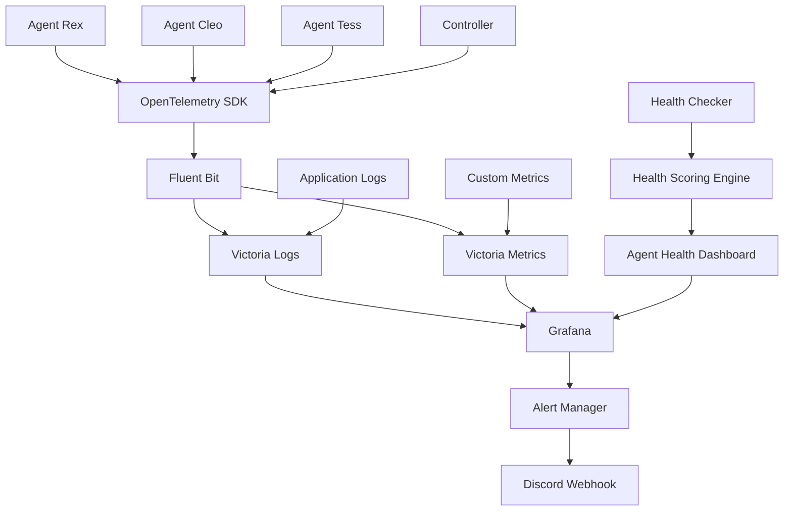

# Telemetry Monitoring Enhancement Architecture

## Overview

This architecture enhances the existing telemetry infrastructure to provide comprehensive monitoring, alerting, and health tracking for the multi-agent platform. It leverages Victoria Logs, Victoria Metrics, Fluent Bit, and Grafana with Discord-based alerting.

## Architecture Principles

1. **Zero Data Loss**: Ensure all telemetry data is captured and stored
2. **Real-time Visibility**: Provide immediate insights into system health
3. **Proactive Alerting**: Detect issues before they impact users
4. **Scalable Monitoring**: Handle increasing telemetry volume efficiently
5. **Actionable Insights**: Provide context-rich information for operators

## System Architecture

### High-Level Design



## Component Design

### 1. OpenTelemetry Integration Layer

Centralized observability data collection from all agents and components.

```rust
// pkg/telemetry/opentelemetry.rs
use opentelemetry::{
    global,
    trace::{Tracer, Span},
    metrics::{Meter, Counter, Histogram},
    logs::{Logger, LogRecord},
};
use opentelemetry_otlp::WithExportConfig;
use serde_json::Value;

pub struct TelemetryManager {
    tracer: Tracer,
    meter: Meter,
    logger: Logger,
    agent_name: String,
}

impl TelemetryManager {
    pub async fn new(agent_name: &str, endpoint: &str) -> Result<Self> {
        // Initialize OTLP exporter
        let otlp_exporter = opentelemetry_otlp::new_exporter()
            .tonic()
            .with_endpoint(endpoint)
            .with_timeout(std::time::Duration::from_secs(10));

        // Initialize tracer
        let tracer = opentelemetry_otlp::new_pipeline()
            .tracing()
            .with_exporter(otlp_exporter.clone())
            .with_trace_config(opentelemetry::sdk::trace::config().with_sampler(
                opentelemetry::sdk::trace::Sampler::ParentBased(
                    opentelemetry::sdk::trace::Sampler::TraceIdRatioBased(0.1)
                )
            ))
            .install_batch(opentelemetry::runtime::Tokio)?;

        // Initialize meter
        let meter = opentelemetry_otlp::new_pipeline()
            .metrics(opentelemetry::runtime::Tokio)
            .with_exporter(otlp_exporter.clone())
            .build()?;

        // Initialize logger
        let logger = opentelemetry_otlp::new_pipeline()
            .logging()
            .with_exporter(otlp_exporter)
            .install_batch(opentelemetry::runtime::Tokio)?;

        Ok(Self {
            tracer,
            meter,
            logger,
            agent_name: agent_name.to_string(),
        })
    }

    pub fn record_task_start(&self, task_id: &str, task_type: &str) -> Span {
        let mut span = self.tracer.start("task_execution");
        span.set_attribute("task.id", task_id.to_string());
        span.set_attribute("task.type", task_type.to_string());
        span.set_attribute("agent.name", self.agent_name.clone());
        span
    }

    pub fn record_task_completion(&self, task_id: &str, success: bool, duration: std::time::Duration) {
        let counter = self.meter.u64_counter("tasks_completed");
        counter.add(1, &[
            ("task_id", task_id.to_string()),
            ("success", success.to_string()),
            ("agent", self.agent_name.clone()),
        ]);

        let histogram = self.meter.f64_histogram("task_duration");
        histogram.record(duration.as_secs_f64(), &[
            ("task_id", task_id.to_string()),
            ("agent", self.agent_name.clone()),
        ]);
    }

    pub fn log_agent_event(&self, level: &str, message: &str, attributes: Value) {
        let mut log_record = LogRecord::default();
        log_record.severity_text = level.to_string();
        log_record.body = message.to_string();
        log_record.attributes = attributes;
        log_record.resource = opentelemetry::KeyValue::new("agent.name", self.agent_name.clone());
        
        self.logger.emit(log_record);
    }

    pub fn record_health_check(&self, health_score: f64, details: Value) {
        let gauge = self.meter.f64_observable_gauge("agent_health_score");
        gauge.observe(health_score, &[
            ("agent", self.agent_name.clone()),
        ]);

        self.log_agent_event("INFO", "Health check completed", json!({
            "health_score": health_score,
            "details": details,
        }));
    }
}
```

### 2. Fluent Bit Configuration

Enhanced log collection and forwarding with proper parsing and filtering.

```yaml
# config/fluent-bit.conf
[SERVICE]
    Flush        1
    Log_Level    info
    Parsers_File parsers.conf
    HTTP_Server  On
    HTTP_Listen  0.0.0.0
    HTTP_Port    2020

[INPUT]
    Name              tail
    Tag               kube.*
    Path              /var/log/containers/*.log
    Parser            docker
    DB                /var/log/flb_kube.db
    Skip_Long_Lines   On
    Refresh_Interval  10
    Mem_Buf_Limit     5MB

[INPUT]
    Name              systemd
    Tag               systemd.*
    Systemd_Filter    _SYSTEMD_UNIT=cto.service
    Read_From_Tail    true

[FILTER]
    Name                modify
    Match               *
    Add                 cluster_name cto
    Add                 environment production

[FILTER]
    Name                lua
    Match               *
    Script              /fluent-bit/scripts/parse_agent_logs.lua
    Call                cb_parse_agent_logs

[FILTER]
    Name                record_modifier
    Match               *
    Record              hostname ${HOSTNAME}
    Record              pod_name ${POD_NAME}
    Record              namespace ${POD_NAMESPACE}

[OUTPUT]
    Name                loki
    Match               *
    Host                victoria-logs.cto.svc.cluster.local
    Port                3100
    Labels              job=cto,agent=$agent_name
    Label_Keys          $kubernetes['labels']['app'],$kubernetes['labels']['component']
    Remove_Keys         kubernetes,stream,time,tag
    Auto_Kubernetes_Labels On

[OUTPUT]
    Name                prometheus_remote_write
    Match               metrics.*
    Host                victoria-metrics.cto.svc.cluster.local
    Port                8428
    URI                 /api/v1/write
    Header              Content-Type application/x-protobuf
    tls                 On
    tls.verify          Off
```

### 3. Victoria Logs Configuration

Optimized log storage and querying for agent telemetry data.

```yaml
# config/victoria-logs.yaml
apiVersion: v1
kind: ConfigMap
metadata:
  name: victoria-logs-config
  namespace: cto
data:
  victoria-logs.yaml: |
    global:
      scrape_interval: 15s
      evaluation_interval: 15s

    rule_files:
      - "alert_rules/*.yml"

    alerting:
      alertmanagers:
        - static_configs:
            - targets:
              - alertmanager:9093

    scrape_configs:
      - job_name: 'cto'
        static_configs:
          - targets: ['localhost:9090']
        metrics_path: /metrics
        scrape_interval: 5s

      - job_name: 'victoria-logs'
        static_configs:
          - targets: ['victoria-logs:3100']
        metrics_path: /metrics

      - job_name: 'victoria-metrics'
        static_configs:
          - targets: ['victoria-metrics:8428']
        metrics_path: /metrics

    remote_write:
      - url: "http://victoria-metrics:8428/api/v1/write"
        remote_timeout: 30s
        write_relabel_configs:
          - source_labels: [__name__]
            regex: 'agent_.*'
            action: keep

    remote_read:
      - url: "http://victoria-metrics:8428/api/v1/read"
        read_timeout: 30s
```

### 4. Grafana Dashboard Management

Automated dashboard creation and management for monitoring.

```typescript
// pkg/grafana/dashboard-manager.ts
import { GrafanaAPI } from './grafana-api';
import { DashboardTemplate } from './templates';

export class DashboardManager {
    private grafana: GrafanaAPI;

    constructor(grafanaUrl: string, apiKey: string) {
        this.grafana = new GrafanaAPI(grafanaUrl, apiKey);
    }

    async createAgentPerformanceDashboard(): Promise<void> {
        const dashboard: DashboardTemplate = {
            title: 'Agent Performance Overview',
            uid: 'agent-performance',
            panels: [
                {
                    title: 'Task Completion Rate',
                    type: 'stat',
                    targets: [
                        {
                            expr: 'rate(tasks_completed_total[5m])',
                            legendFormat: '{{agent}}'
                        }
                    ],
                    fieldConfig: {
                        defaults: {
                            thresholds: {
                                steps: [
                                    { color: 'red', value: 0 },
                                    { color: 'yellow', value: 0.5 },
                                    { color: 'green', value: 1.0 }
                                ]
                            }
                        }
                    }
                },
                {
                    title: 'Task Duration Distribution',
                    type: 'heatmap',
                    targets: [
                        {
                            expr: 'rate(task_duration_seconds_bucket[5m])',
                            legendFormat: '{{le}}'
                        }
                    ]
                },
                {
                    title: 'Agent Health Scores',
                    type: 'timeseries',
                    targets: [
                        {
                            expr: 'agent_health_score',
                            legendFormat: '{{agent}}'
                        }
                    ],
                    fieldConfig: {
                        defaults: {
                            thresholds: {
                                steps: [
                                    { color: 'red', value: 0 },
                                    { color: 'orange', value: 50 },
                                    { color: 'yellow', value: 75 },
                                    { color: 'green', value: 90 }
                                ]
                            }
                        }
                    }
                },
                {
                    title: 'Error Rate by Agent',
                    type: 'timeseries',
                    targets: [
                        {
                            expr: 'rate(tasks_completed_total{success="false"}[5m]) / rate(tasks_completed_total[5m])',
                            legendFormat: '{{agent}}'
                        }
                    ]
                }
            ]
        };

        await this.grafana.createDashboard(dashboard);
    }

    async createPlatformHealthDashboard(): Promise<void> {
        const dashboard: DashboardTemplate = {
            title: 'Platform Health Overview',
            uid: 'platform-health',
            panels: [
                {
                    title: 'System Components Status',
                    type: 'stat',
                    targets: [
                        {
                            expr: 'up',
                            legendFormat: '{{job}}'
                        }
                    ]
                },
                {
                    title: 'API Response Times',
                    type: 'timeseries',
                    targets: [
                        {
                            expr: 'histogram_quantile(0.95, rate(http_request_duration_seconds_bucket[5m]))',
                            legendFormat: '{{endpoint}}'
                        }
                    ]
                },
                {
                    title: 'Database Connection Pool',
                    type: 'timeseries',
                    targets: [
                        {
                            expr: 'database_connections_active',
                            legendFormat: '{{database}}'
                        }
                    ]
                },
                {
                    title: 'Memory Usage',
                    type: 'timeseries',
                    targets: [
                        {
                            expr: 'process_resident_memory_bytes / process_heap_size_bytes',
                            legendFormat: '{{job}}'
                        }
                    ]
                }
            ]
        };

        await this.grafana.createDashboard(dashboard);
    }

    async createWorkflowDashboard(): Promise<void> {
        const dashboard: DashboardTemplate = {
            title: 'Workflow Status',
            uid: 'workflow-status',
            panels: [
                {
                    title: 'PR Processing Pipeline',
                    type: 'timeseries',
                    targets: [
                        {
                            expr: 'rate(pr_events_total[5m])',
                            legendFormat: '{{event_type}}'
                        }
                    ]
                },
                {
                    title: 'GitHub API Rate Limits',
                    type: 'timeseries',
                    targets: [
                        {
                            expr: 'github_api_remaining_requests',
                            legendFormat: '{{endpoint}}'
                        }
                    ]
                },
                {
                    title: 'Webhook Delivery Success Rate',
                    type: 'stat',
                    targets: [
                        {
                            expr: 'rate(webhook_delivery_total{status="success"}[5m]) / rate(webhook_delivery_total[5m])',
                            legendFormat: 'Success Rate'
                        }
                    ]
                }
            ]
        };

        await this.grafana.createDashboard(dashboard);
    }
}
```

### 5. Health Scoring Engine

Intelligent agent health monitoring with configurable scoring algorithms.

```rust
// pkg/health/scoring.rs
use serde::{Deserialize, Serialize};
use std::collections::HashMap;
use tokio::time::{Duration, Instant};

#[derive(Debug, Clone, Serialize, Deserialize)]
pub struct HealthMetrics {
    pub task_success_rate: f64,
    pub avg_response_time: Duration,
    pub memory_usage_percent: f64,
    pub cpu_usage_percent: f64,
    pub network_connectivity: bool,
    pub github_api_remaining: u32,
    pub last_heartbeat: Instant,
}

#[derive(Debug, Clone, Serialize, Deserialize)]
pub struct HealthScore {
    pub agent_name: String,
    pub overall_score: f64,
    pub component_scores: HashMap<String, f64>,
    pub status: HealthStatus,
    pub last_updated: Instant,
    pub recommendations: Vec<String>,
}

#[derive(Debug, Clone, Serialize, Deserialize)]
pub enum HealthStatus {
    Critical,
    Warning,
    Healthy,
    Excellent,
}

pub struct HealthScoringEngine {
    thresholds: HealthThresholds,
    weights: HealthWeights,
}

#[derive(Debug, Clone)]
pub struct HealthThresholds {
    pub task_success_rate_min: f64,
    pub response_time_max: Duration,
    pub memory_usage_max: f64,
    pub cpu_usage_max: f64,
    pub heartbeat_timeout: Duration,
    pub github_api_min: u32,
}

#[derive(Debug, Clone)]
pub struct HealthWeights {
    pub task_success_rate: f64,
    pub response_time: f64,
    pub resource_usage: f64,
    pub connectivity: f64,
}

impl Default for HealthScoringEngine {
    fn default() -> Self {
        Self {
            thresholds: HealthThresholds {
                task_success_rate_min: 0.95,
                response_time_max: Duration::from_secs(30),
                memory_usage_max: 80.0,
                cpu_usage_max: 80.0,
                heartbeat_timeout: Duration::from_secs(300),
                github_api_min: 100,
            },
            weights: HealthWeights {
                task_success_rate: 0.4,
                response_time: 0.3,
                resource_usage: 0.2,
                connectivity: 0.1,
            },
        }
    }
}

impl HealthScoringEngine {
    pub fn calculate_health_score(&self, agent_name: &str, metrics: &HealthMetrics) -> HealthScore {
        let mut component_scores = HashMap::new();
        let mut recommendations = Vec::new();

        // Task Success Rate Score (0-100)
        let task_score = (metrics.task_success_rate * 100.0).min(100.0);
        component_scores.insert("task_success_rate".to_string(), task_score);
        
        if metrics.task_success_rate < self.thresholds.task_success_rate_min {
            recommendations.push(format!("Task success rate ({:.1}%) below threshold ({:.1}%)", 
                metrics.task_success_rate * 100.0, 
                self.thresholds.task_success_rate_min * 100.0));
        }

        // Response Time Score (0-100)
        let response_score = if metrics.avg_response_time <= self.thresholds.response_time_max {
            100.0
        } else {
            let ratio = self.thresholds.response_time_max.as_secs_f64() / metrics.avg_response_time.as_secs_f64();
            (ratio * 100.0).max(0.0)
        };
        component_scores.insert("response_time".to_string(), response_score);
        
        if metrics.avg_response_time > self.thresholds.response_time_max {
            recommendations.push(format!("Average response time ({:.1}s) exceeds threshold ({:.1}s)", 
                metrics.avg_response_time.as_secs_f64(), 
                self.thresholds.response_time_max.as_secs_f64()));
        }

        // Resource Usage Score (0-100)
        let memory_score = if metrics.memory_usage_percent <= self.thresholds.memory_usage_max {
            100.0
        } else {
            let ratio = self.thresholds.memory_usage_max / metrics.memory_usage_percent;
            (ratio * 100.0).max(0.0)
        };
        component_scores.insert("memory_usage".to_string(), memory_score);

        let cpu_score = if metrics.cpu_usage_percent <= self.thresholds.cpu_usage_max {
            100.0
        } else {
            let ratio = self.thresholds.cpu_usage_max / metrics.cpu_usage_percent;
            (ratio * 100.0).max(0.0)
        };
        component_scores.insert("cpu_usage".to_string(), cpu_score);

        let resource_score = (memory_score + cpu_score) / 2.0;
        component_scores.insert("resource_usage".to_string(), resource_score);

        if metrics.memory_usage_percent > self.thresholds.memory_usage_max {
            recommendations.push(format!("Memory usage ({:.1}%) exceeds threshold ({:.1}%)", 
                metrics.memory_usage_percent, 
                self.thresholds.memory_usage_max));
        }

        if metrics.cpu_usage_percent > self.thresholds.cpu_usage_max {
            recommendations.push(format!("CPU usage ({:.1}%) exceeds threshold ({:.1}%)", 
                metrics.cpu_usage_percent, 
                self.thresholds.cpu_usage_max));
        }

        // Connectivity Score (0-100)
        let connectivity_score = if metrics.network_connectivity && metrics.github_api_remaining >= self.thresholds.github_api_min {
            100.0
        } else if metrics.network_connectivity {
            50.0
        } else {
            0.0
        };
        component_scores.insert("connectivity".to_string(), connectivity_score);

        if !metrics.network_connectivity {
            recommendations.push("Network connectivity issues detected".to_string());
        }

        if metrics.github_api_remaining < self.thresholds.github_api_min {
            recommendations.push(format!("GitHub API remaining requests ({}) below threshold ({})", 
                metrics.github_api_remaining, 
                self.thresholds.github_api_min));
        }

        // Heartbeat Check
        if metrics.last_heartbeat.elapsed() > self.thresholds.heartbeat_timeout {
            recommendations.push(format!("No heartbeat for {:.1} minutes", 
                metrics.last_heartbeat.elapsed().as_secs_f64() / 60.0));
        }

        // Calculate Overall Score
        let overall_score = 
            task_score * self.weights.task_success_rate +
            response_score * self.weights.response_time +
            resource_score * self.weights.resource_usage +
            connectivity_score * self.weights.connectivity;

        // Determine Status
        let status = if overall_score >= 90.0 {
            HealthStatus::Excellent
        } else if overall_score >= 75.0 {
            HealthStatus::Healthy
        } else if overall_score >= 50.0 {
            HealthStatus::Warning
        } else {
            HealthStatus::Critical
        };

        HealthScore {
            agent_name: agent_name.to_string(),
            overall_score,
            component_scores,
            status,
            last_updated: Instant::now(),
            recommendations,
        }
    }
}
```

### 6. Discord Alerting System

Intelligent alert delivery with deduplication and rate limiting.

```rust
// pkg/alerting/discord.rs
use reqwest::Client;
use serde_json::json;
use std::collections::HashMap;
use tokio::time::{Duration, Instant};
use uuid::Uuid;

#[derive(Debug, Clone)]
pub struct DiscordAlert {
    pub id: String,
    pub level: AlertLevel,
    pub title: String,
    pub message: String,
    pub agent_name: Option<String>,
    pub timestamp: Instant,
    pub metadata: HashMap<String, String>,
}

#[derive(Debug, Clone, PartialEq)]
pub enum AlertLevel {
    Critical,
    Warning,
    Info,
}

pub struct DiscordAlertManager {
    client: Client,
    webhook_url: String,
    alert_history: HashMap<String, Instant>,
    rate_limits: HashMap<AlertLevel, (u32, Duration)>,
    deduplication_window: Duration,
}

impl DiscordAlertManager {
    pub fn new(webhook_url: String) -> Self {
        let mut rate_limits = HashMap::new();
        rate_limits.insert(AlertLevel::Critical, (5, Duration::from_secs(60))); // 5 per minute
        rate_limits.insert(AlertLevel::Warning, (10, Duration::from_secs(300))); // 10 per 5 minutes
        rate_limits.insert(AlertLevel::Info, (20, Duration::from_secs(600))); // 20 per 10 minutes

        Self {
            client: Client::new(),
            webhook_url,
            alert_history: HashMap::new(),
            rate_limits,
            deduplication_window: Duration::from_secs(300), // 5 minutes
        }
    }

    pub async fn send_alert(&mut self, alert: DiscordAlert) -> Result<()> {
        // Check deduplication
        if self.is_duplicate(&alert) {
            log::info!("Skipping duplicate alert: {}", alert.id);
            return Ok(());
        }

        // Check rate limits
        if !self.check_rate_limit(&alert.level) {
            log::warn!("Rate limit exceeded for alert level: {:?}", alert.level);
            return Ok(());
        }

        // Create Discord embed
        let embed = self.create_embed(&alert);
        
        // Send to Discord
        let response = self.client
            .post(&self.webhook_url)
            .json(&json!({
                "embeds": [embed]
            }))
            .send()
            .await?;

        if response.status().is_success() {
            // Record alert in history
            self.alert_history.insert(alert.id.clone(), Instant::now());
            log::info!("Alert sent successfully: {}", alert.id);
        } else {
            log::error!("Failed to send alert: {}", response.status());
        }

        Ok(())
    }

    fn create_embed(&self, alert: &DiscordAlert) -> serde_json::Value {
        let color = match alert.level {
            AlertLevel::Critical => 0xFF0000, // Red
            AlertLevel::Warning => 0xFFA500,  // Orange
            AlertLevel::Info => 0x00BFFF,     // Blue
        };

        let mut embed = json!({
            "title": alert.title,
            "description": alert.message,
            "color": color,
            "timestamp": chrono::Utc::now().to_rfc3339(),
            "footer": {
                "text": "Agent Platform Monitoring"
            }
        });

        // Add fields if metadata exists
        if !alert.metadata.is_empty() {
            let fields: Vec<serde_json::Value> = alert.metadata
                .iter()
                .map(|(key, value)| json!({
                    "name": key,
                    "value": value,
                    "inline": true
                }))
                .collect();
            
            embed["fields"] = serde_json::Value::Array(fields);
        }

        embed
    }

    fn is_duplicate(&self, alert: &DiscordAlert) -> bool {
        if let Some(last_sent) = self.alert_history.get(&alert.id) {
            last_sent.elapsed() < self.deduplication_window
        } else {
            false
        }
    }

    fn check_rate_limit(&self, level: &AlertLevel) -> bool {
        if let Some((limit, window)) = self.rate_limits.get(level) {
            let now = Instant::now();
            let recent_alerts = self.alert_history
                .values()
                .filter(|&timestamp| now.duration_since(*timestamp) < *window)
                .count();
            
            recent_alerts < *limit as usize
        } else {
            true // No rate limit configured
        }
    }

    pub async fn send_agent_health_alert(&mut self, agent_name: &str, health_score: f64, status: &str, recommendations: &[String]) -> Result<()> {
        let level = if health_score < 50.0 {
            AlertLevel::Critical
        } else if health_score < 75.0 {
            AlertLevel::Warning
        } else {
            AlertLevel::Info
        };

        let title = format!("Agent Health Alert: {}", agent_name);
        let message = format!(
            "Agent **{}** health status: **{}** (Score: {:.1}/100)\n\n**Recommendations:**\n{}",
            agent_name,
            status,
            health_score,
            recommendations.join("\n")
        );

        let mut metadata = HashMap::new();
        metadata.insert("agent_name".to_string(), agent_name.to_string());
        metadata.insert("health_score".to_string(), format!("{:.1}", health_score));
        metadata.insert("status".to_string(), status.to_string());

        let alert = DiscordAlert {
            id: format!("health-{}-{}", agent_name, Uuid::new_v4()),
            level,
            title,
            message,
            agent_name: Some(agent_name.to_string()),
            timestamp: Instant::now(),
            metadata,
        };

        self.send_alert(alert).await
    }
}
```

## Monitoring Configuration

### Grafana Alert Rules
```yaml
# config/grafana/alert-rules.yml
groups:
  - name: agent-health
    rules:
      - alert: AgentUnresponsive
        expr: agent_health_score < 10
        for: 2m
        labels:
          severity: critical
        annotations:
          summary: "Agent {{ $labels.agent }} is unresponsive"
          description: "Agent {{ $labels.agent }} health score is {{ $value }}/100"

      - alert: AgentPerformanceDegraded
        expr: agent_health_score < 50
        for: 5m
        labels:
          severity: warning
        annotations:
          summary: "Agent {{ $labels.agent }} performance degraded"
          description: "Agent {{ $labels.agent }} health score is {{ $value }}/100"

      - alert: HighErrorRate
        expr: rate(tasks_completed_total{success="false"}[5m]) / rate(tasks_completed_total[5m]) > 0.1
        for: 2m
        labels:
          severity: warning
        annotations:
          summary: "High error rate for agent {{ $labels.agent }}"
          description: "Error rate is {{ $value | humanizePercentage }}"

      - alert: GitHubAPIRateLimit
        expr: github_api_remaining_requests < 100
        for: 1m
        labels:
          severity: warning
        annotations:
          summary: "GitHub API rate limit approaching"
          description: "Only {{ $value }} requests remaining"

      - alert: VictoriaLogsDown
        expr: up{job="victoria-logs"} == 0
        for: 1m
        labels:
          severity: critical
        annotations:
          summary: "Victoria Logs is down"
          description: "Victoria Logs instance is not responding"

      - alert: VictoriaMetricsDown
        expr: up{job="victoria-metrics"} == 0
        for: 1m
        labels:
          severity: critical
        annotations:
          summary: "Victoria Metrics is down"
          description: "Victoria Metrics instance is not responding"
```

### Dashboard Variables
```json
{
  "templating": {
    "list": [
      {
        "name": "agent",
        "type": "query",
        "query": "label_values(agent_health_score, agent)",
        "refresh": 2,
        "includeAll": true
      },
      {
        "name": "time_range",
        "type": "interval",
        "query": "1m,5m,10m,30m,1h,6h,12h,1d",
        "current": "5m"
      }
    ]
  }
}
```

This architecture provides comprehensive telemetry monitoring with intelligent alerting, ensuring the platform operators have full visibility into agent health and system performance.
