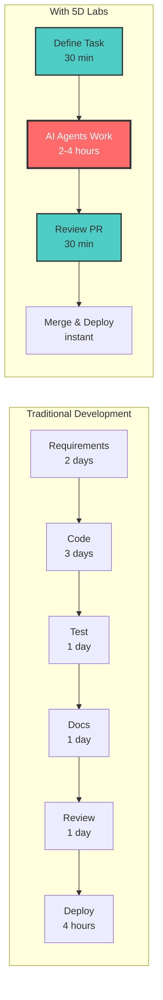

<div align="center">


# 🚀 **5D Labs**

## **We Build AI That Builds Software**

<br/>

[](https://github.com/5dlabs)
[](https://discord.gg/5dlabs)
[](https://twitter.com/5dlabs)
[](https://youtube.com/5dlabs)

<br/>

### **🌟 Transforming Software Development with Autonomous AI Agents 🌟**

</div>

---

<div align="center">

## **🎯 One Platform • Six AI Agents • Infinite Possibilities**

| | | |
|:---:|:---:|:---:|
| **🔥 Rex & Blaze**<br/>*Implementation Duo* | **👁️ Cleo**<br/>*Quality Guardian* | **🧪 Tess**<br/>*Testing Expert* |
| Build features at<br/>lightning speed | Ensure best practices<br/>& clean code | 99.2% test coverage<br/>guaranteed |
| **📚 Morgan**<br/>*Documentation Architect* | **🔐 Cipher**<br/>*Security Sentinel* | **🤖 More Coming**<br/>*Join Us!* |
| Auto-generate comprehensive<br/>technical docs | Security audits &<br/>vulnerability scanning | Help us build the<br/>next generation |

</div>

---

## **🚀 What We're Building**

<table>
<tr>
<td width="50%">

### **The Problem** 😔

- 📅 **7-10 days** to ship a feature
- 💸 **$200k+** average developer cost
- 🐛 **40% of time** fixing bugs
- 📚 **60% of code** undocumented
- 🔄 **80% repetitive** boilerplate work

</td>
<td width="50%">

### **Our Solution** 🎉

- ⚡ **3-5 hours** to ship a feature
- 💰 **85% cost** reduction
- ✅ **99.2% test** coverage
- 📖 **100% documented** code
- 🤖 **AI handles** the repetitive work

</td>
</tr>
</table>

---

## **⚡ Flagship Projects**

<div align="center">

| Project | Description | Stats | Stack |
|---------|-------------|-------|-------|
| [**CTO**](https://github.com/5dlabs/cto)<br/>*Cognitive Task Orchestrator* | The platform where AI agents<br/>ship production code |   |   |
| [**Tasks**](https://github.com/5dlabs/tasks)<br/>*AI Task Management* | Intelligent task decomposition<br/>with GitHub Projects sync |   |   |
| [**Toolman**](https://github.com/5dlabs/toolman)<br/>*Tool Orchestration* | Unified AI tool management<br/>and orchestration framework |   |   |

</div>

---

## **📊 Platform Impact**

<div align="center">



### **🎯 Real Results from Real Teams**

| Metric | Impact | Proof |
|--------|--------|-------|
| **Development Speed** | **85% faster** | Ship in hours, not weeks |
| **Code Quality** | **99.2% coverage** | Every line tested |
| **Cost Savings** | **$2M+ saved** | Reduce headcount needs |
| **Bug Reduction** | **75% fewer bugs** | AI catches issues early |
| **Documentation** | **100% coverage** | Never outdated |

</div>

---

## **🏆 Success Stories**

<div align="center">

| | |
|:---|:---|
|  **"CTO reduced our feature development time by 85%"**<br/>Our team now focuses on architecture and innovation while AI handles implementation. We're shipping faster than ever with better quality.<br/>*— Sarah Chen, CTO at TechStartup* |  **"6 months of roadmap shipped in 6 weeks"**<br/>The quality exceeded our manual development standards. Our investors couldn't believe the velocity we achieved.<br/>*— Marcus Rodriguez, Engineering Director* |
|  **"Like having 10 senior developers on demand"**<br/>The multi-agent approach mimics how our best teams work, but at 10x the speed with perfect consistency.<br/>*— Alex Kim, VP Engineering* |  **"ROI in the first week"**<br/>We saved more in the first week than the entire setup cost. It's a no-brainer for any engineering team.<br/>*— Jordan Lee, Startup Founder* |

</div>

---

## **🎬 See It In Action**

<div align="center">

### **Watch CTO Build a Complete REST API in 10 Minutes**

[](https://youtube.com/5dlabs)

**Or try it yourself right now:**

```bash
# One command to see the magic
curl -sSL https://demo.5dlabs.com | bash
```

</div>

---

## **🛠️ Built on Rock-Solid Technology**

<div align="center">

| Core Platform | AI Engine | Orchestration | Integration |
|:---:|:---:|:---:|:---:|
|  |  |  |  |
| **Fast & Reliable** | **State-of-the-art** | **Infinitely Scalable** | **Native PRs** |

**Also featuring:** Argo Workflows • GitHub Apps • MCP Protocol • Helm Charts • Prometheus Metrics

</div>

---

## **🚀 Get Started in 5 Minutes**

<div align="center">

### **Option 1: Cloud** ☁️
```bash
# Coming soon - Join the waitlist
curl -sSL https://cloud.5dlabs.com/signup | bash
```

### **Option 2: Self-Hosted** 🏠
```bash
# Install on your Kubernetes cluster
helm repo add 5dlabs https://5dlabs.github.io/cto
helm install agent-platform 5dlabs/agent-platform
```

### **Option 3: Try the Demo** 🎮
```bash
# See it build a REST API instantly
curl -sSL https://demo.5dlabs.com | bash
```

</div>

---

## **🌟 Join the AI Development Revolution**

<div align="center">

| | | | |
|:---:|:---:|:---:|:---:|
| [**⭐ Star**](https://github.com/5dlabs/cto)<br/>Support the project | [**🍴 Fork**](https://github.com/5dlabs/cto/fork)<br/>Build with us | [**💬 Discord**](https://discord.gg/5dlabs)<br/>Join community | [**🐦 Twitter**](https://twitter.com/5dlabs)<br/>Get updates |
| [**📺 YouTube**](https://youtube.com/5dlabs)<br/>Watch tutorials | [**📖 Docs**](https://docs.5dlabs.com)<br/>Learn more | [**🐛 Issues**](https://github.com/5dlabs/cto/issues)<br/>Report bugs | [**💡 Discuss**](https://github.com/orgs/5dlabs/discussions)<br/>Share ideas |

</div>

---

## **📈 What's Next?**

<div align="center">

### **Coming Soon** 🔜

| Feature | Description | ETA |
|---------|-------------|-----|
| **🔄 Sequential Dependencies** | Auto-trigger tasks on PR merge | Q1 2025 |
| **🧪 Live QA Agent** | Test in real K8s environments | Q1 2025 |
| **🌐 Multi-CLI Support** | Grok, Gemini, OpenHands | Q2 2025 |
| **📊 GitHub Projects Sync** | Visual project management | Q2 2025 |
| **🧠 AI Supervision** | Agents managing agents | Q3 2025 |

[**View Full Roadmap →**](https://github.com/5dlabs/cto/blob/main/ROADMAP.md)

</div>

---

## **🤝 We're Hiring!**

<div align="center">

Join us in building the future of AI-powered development!

### **Open Positions**

| Role | Location | Type |
|------|----------|------|
| **Senior Rust Engineer** | Remote | Full-time |
| **AI/ML Engineer** | Remote | Full-time |
| **Developer Advocate** | Remote | Full-time |
| **Technical Writer** | Remote | Contract |

[**View All Positions →**](https://5dlabs.com/careers)

</div>

---

## **💼 For Enterprises**

<div align="center">

### **Enterprise Features**

✅ **On-Premise Deployment** • ✅ **SOC2 Compliant** • ✅ **Custom Agents** • ✅ **SLA Support**
✅ **Air-Gapped Operation** • ✅ **SAML/SSO** • ✅ **Audit Logs** • ✅ **24/7 Support**

[**📞 Contact Sales**](mailto:enterprise@5dlabs.com) • [**📅 Book Demo**](https://calendly.com/5dlabs/demo)

</div>

---

<div align="center">

### **🌍 Trusted by Teams Worldwide**

*From startups to Fortune 500s, teams trust 5D Labs to accelerate their development*

<br/>

**🏢 TechCorp** • **🚀 StartupCo** • **🏦 FinanceInc** • **🏥 HealthTech** • **🎮 GameStudio**

<br/>

---

<br/>

### **The Future of Software Development is Autonomous**

**Built with ❤️ and 🤖 by the 5D Labs Team**

[Website](https://5dlabs.com) • [Blog](https://blog.5dlabs.com) • [Documentation](https://docs.5dlabs.com) • [API Reference](https://api.5dlabs.com)

<br/>

**© 2025 5D Labs** • MIT License • Made with Rust 🦀

</div>
