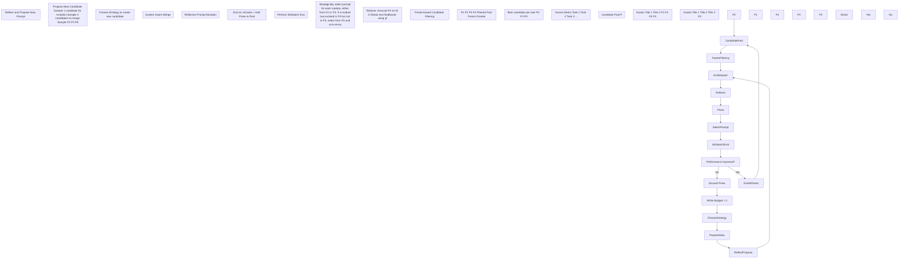

# GEPA: Reflective Prompt Evolution Can Outperform Reinforcement Learning

**Authors:**  
Lakshya A Agrawal¹, Shangyin Tan¹, Dilara Soylu², Noah Ziems⁴,  
Rishi Khare¹, Krista Opsahl-Ong⁵, Arnav Singhvi²⁵, Herumb Shandilya²,  
Michael J Ryan², Meng Jiang⁴, Christopher Potts², Koushik Sen¹,  
Alexandros G. Dimakis¹³, Ion Stoica¹, Dan Klein¹, Matei Zaharia¹⁵, Omar Khattab⁶  

**Affiliations:**  
¹UC Berkeley  
²Stanford University  
³BespokeLabs.ai  
⁴Notre Dame  
⁵Databricks  
⁶MIT  

## Abstract

Large language models (LLMs) are increasingly adapted to downstream tasks via reinforcement learning (RL) methods like Group Relative Policy Optimization (GRPO), which often require thousands of rollouts to learn new tasks. We argue that the interpretable nature of language can often provide a much richer learning medium for LLMs, compared with policy gradients derived from sparse, scalar rewards. To test this, we introduce GEPA (Genetic-Pareto), a prompt optimizer that thoroughly incorporates natural language reflection to learn high-level rules from trial and error. Given any AI system containing one or more LLM prompts, GEPA samples system-level trajectories (e.g., reasoning, tool calls, and tool outputs) and reflects on them in natural language to diagnose problems, propose and test prompt updates, and combine complementary lessons from the Pareto frontier of its own attempts. As a result of GEPA’s design, it can often turn even just a few rollouts into a large quality gain. Across four tasks, GEPA outperforms GRPO by 10% on average and by up to 20%, while using up to 35x fewer rollouts. GEPA also outperforms the leading prompt optimizer, MIPROv2, by over 10% across two LLMs, and demonstrates promising results as an inference-time search strategy for code optimization.

## 1 Introduction

```chartjs
{
  "type": "line",
  "data": {
    "labels": [0, 5000, 10000, 15000, 20000, 25000],
    "datasets": [
      {
        "label": "Baseline",
        "data": [42.5, 42.5, 42.5, 42.5, 42.5, 42.5],
        "borderColor": "#1f77b4",
        "backgroundColor": "#1f77b4",
        "fill": false
      },
      {
        "label": "MIPROv2",
        "data": [42.5, 45.0, 48.0, 52.0, 55.0, 55.33],
        "borderColor": "#ff7f0e",
        "backgroundColor": "#ff7f0e",
        "fill": false
      },
      {
        "label": "GRPO",
        "data": [42.5, 43.0, 43.5, 44.0, 44.5, 43.33],
        "borderColor": "#2ca02c",
        "backgroundColor": "#2ca02c",
        "fill": false
      },
      {
        "label": "GEPA",
        "data": [42.5, 50.0, 55.0, 60.0, 62.5, 62.33],
        "borderColor": "#d62728",
        "backgroundColor": "#d62728",
        "fill": false
      }
    ]
  },
  "options": {
    "responsive": true,
    "plugins": {
      "title": {
        "display": true,
        "text": "HotpotQA, Qwen3 8B"
      },
      "legend": {
        "display": true
      }
    },
    "scales": {
      "x": {
        "title": {
          "display": true,
          "text": "Number of Rollouts"
        }
      },
      "y": {
        "title": {
          "display": true,
          "text": "Score"
        },
        "beginAtZero": false
      }
    }
  }
}
```

```chartjs
{
  "type": "line",
  "data": {
    "labels": [0, 5000, 10000, 15000, 20000, 25000],
    "datasets": [
      {
        "label": "Baseline",
        "data": [35.0, 35.0, 35.0, 35.0, 35.0, 35.0],
        "borderColor": "#1f77b4",
        "backgroundColor": "#1f77b4",
        "fill": false
      },
      {
        "label": "MIPROv2",
        "data": [35.0, 37.5, 40.0, 43.0, 46.0, 47.33],
        "borderColor": "#ff7f0e",
        "backgroundColor": "#ff7f0e",
        "fill": false
      },
      {
        "label": "GRPO",
        "data": [35.0, 35.5, 36.0, 36.5, 37.0, 38.67],
        "borderColor": "#2ca02c",
        "backgroundColor": "#2ca02c",
        "fill": false
      },
      {
        "label": "GEPA",
        "data": [35.0, 42.5, 47.5, 50.0, 52.0, 52.33],
        "borderColor": "#d62728",
        "backgroundColor": "#d62728",
        "fill": false
      }
    ]
  },
  "options": {
    "responsive": true,
    "plugins": {
      "title": {
        "display": true,
        "text": "HoVer, Qwen3 8B"
      },
      "legend": {
        "display": true
      }
    },
    "scales": {
      "x": {
        "title": {
          "display": true,
          "text": "Number of Rollouts"
        }
      },
      "y": {
        "title": {
          "display": true,
          "text": "Score"
        },
        "beginAtZero": false
      }
    }
  }
}
```

**Figure 1:** A comparison of the learning behavior of our proposed GEPA prompt optimizer against a state-of-the-art prompt optimizer (MIPROv2) and the GRPO (24,000 rollouts) algorithm. As more rollouts are sampled, the prompt optimizers can learn much more quickly than GRPO. GEPA substantially outperforms both GRPO and MIPROv2 in final score. The Test-set star markers demonstrate the performance gap in a held-out set of questions.

Large language models (LLMs) have enabled the development of agents and systems that combine fuzzy natural-language behavior specification with tools like retrieval and code execution. These types of systems raise the question of how LLMs should be “optimized” for the best downstream performance within their harness. One popular approach for adapting LLMs to downstream tasks is reinforcement learning with verifiable rewards (RLVR), including algorithms such as Group Relative Policy Optimization (GRPO) (Shao et al., 2024). Such RL methods cast success metrics as a scalar reward observed at the end of each rollout (Lambert, 2025) and use these rewards to estimate gradients for policy improvement.

While these RL approaches are effective, they typically require tens of thousands of rollouts in practice to fit new tasks. For example, recent works leveraging GRPO across a range of tasks typically use up to hundreds of thousands of rollouts for training (Chen et al., 2025b; Wu et al., 2025c; Zhang et al., 2025; Jin et al., 2025; Si et al., 2025; Wang et al., 2025a; Java et al., 2025; Chen et al., 2025a; Wu et al., 2025a; Sha et al., 2025; Lin et al., 2025; Peng et al., 2025; Song et al., 2025). This sample inefficiency can quickly become a serious bottleneck: many downstream LLM applications invoke expensive tool calls, have limited inference budget for sampling from the LLM itself, or simply cannot finetune the weights of the largest or best-performing LLMs.

We observe that the rollouts sampled from even highly sophisticated LLM systems can be serialized into traces of natural (and formal) language, as they contain nothing but the instructions of each LLM module, the resulting LLM reasoning chains, tool calls, and potentially the internal workings of the reward function (for example, compiler error messages, before they are collapsed into scalar rewards). Because such serialized trajectories can be readily understood by modern LLMs, we argue that algorithms that learn deliberately in natural language by reflecting on these trajectories can potentially make much more effective use of the strong language priors that LLMs have, compared with standard RL approaches.

To operationalize this, we introduce GEPA (Genetic-Pareto), a reflective prompt optimizer for compound AI systems that merges textual reflection with multi-objective evolutionary search. GEPA iteratively mutates every prompt within the AI system in light of natural language feedback drawn from new rollouts. In each mutation, the candidate prompt is derived from an ancestor, accumulating high-level lessons derived from observations and LLM feedback. To avoid the local optima that afflict greedy prompt updates, GEPA maintains a Pareto front: instead of evolving only the global best prompt, it stochastically explores the top-performing prompts for each problem instance, thereby diversifying strategies and encouraging robust generalization.

We evaluate GEPA on four diverse tasks—multi-hop reasoning (HotpotQA; Yang et al. 2018), instruction following (IFBench; Pyatkin et al. 2025b), privacy-aware delegation (PUPA; Li et al. 2025a), and retrieval-augmented verification (HoVer; Jiang et al. 2020)—using both open (Qwen3 8B; Yang et al. 2025; Team 2025) and proprietary (GPT-4.1 mini; OpenAI 2025) models. Our results show that GEPA demonstrates robust generalization and is highly sample-efficient: on Qwen3 8B, GEPA outperforms GRPO (24,000 rollouts with LoRA) by up to 19% while requiring up to 35× fewer rollouts. Overall, GEPA achieves an average improvement of +10% over GRPO across all tasks. Furthermore, GEPA surpasses the previous state-of-the-art prompt optimizer, MIPROv2 (Opsahl-Ong et al., 2024), on every benchmark and model, obtaining aggregate optimization gains of +14%, more than doubling the gains achieved by MIPROv2 (+7%).

Even qualitatively, GEPA generated prompts can be highly effective. Figure 2 highlights excerpts from a prompt crafted by GEPA for the query creation module of a multi-hop question answering system (Used in HotpotQA). We also find that in most cases, even a single reflective prompt update can give large improvements (as highlighted in the optimization trajectory in Figure 5). These results demonstrate that reflective prompt evolution using language feedback enables substantial sample efficiency and robust generalization, providing a practical path to optimizing complex, real-world AI workflows in data- or budget-constrained environments. Finally, we also show promising preliminary results demonstrating GEPA’s use as an inference-time search strategy for code optimization over NPUEval (Kalade & Schelle, 2025) and KernelBench (Ouyang et al., 2025).

## 2 Problem Statement

### Compound AI Systems
We follow related work in defining a compound AI system as any modular system composed of one or more language model (LLM) invocations, potentially interleaved with external tool calls, orchestrated through arbitrary control flow. This definition subsumes a broad class of real-world LLM-based AI systems, including agents, multi-agent systems, and general-purpose scaffolding techniques like ReAct (Yao et al., 2023), Archon (Saad-Falcon et al., 2025), etc. Following Soylu et al. (2024); Khattab et al. (2024); Opsahl-Ong et al. (2024); Tan et al. (2025), we formalize such a system as Φ = (M, C, X, Y), where M = ⟨M₁, . . . , M₍|M|⟩ denotes language modules, C specifies control flow logic, and X, Y are global input/output schemas. Each module Mᵢ = (πᵢ, θᵢ, Xᵢ, Yᵢ) is an LLM subcomponent: πᵢ is its (system) prompt including instructions and few-shot demonstrations; θᵢ the underlying model weights; Xᵢ, Yᵢ are input/output schemas. At runtime, C orchestrates the sequencing and invocation of modules—e.g., passing outputs from one module to another, invoking modules conditionally, or leveraging tool APIs. This way, C can invoke different modules in any order multiples of times.

### Compound AI System Optimization
Given Φ, let ΠΦ = ⟨π₁, . . . , π₍|M|⟩ denote the collection of all module prompts and ΘΦ = ⟨θ₁, . . . , θ₍|M|⟩ the set of module weights. The learnable parameters are thus ⟨Π, Θ⟩Φ. For a task instance (x, m)—where x maps to the input schema X and m contains evaluator metadata (e.g., gold answers, evaluation rubrics, code unit tests)—the system induces an output y = Φ(x; ⟨Π, Θ⟩Φ). A metric µ : Y × M → [0, 1] then measures the output quality of y with respect to metadata m (for example by calculating, exact match, F1, pass rate, etc.). The optimization problem is thus defined by:

⟨Π*, Θ*⟩Φ = arg max⟨Π,Θ⟩Φ E(x,m)∼T [µ(Φ(x; ⟨Π, Θ⟩Φ), m)],

where T is a task distribution.

### Sample-Efficient Optimization
In many real-world scenarios, rollouts—concretely, invocations of Φ plus evaluation by µ—are often computationally, monetarily, or timewise expensive. The optimizer is thus limited to at most B rollouts on a dataset Dtrain = {(x, m)ᵢ}Nᵢ=1 with full access to µ. The goal is to identify parameters ⟨Π*, Θ*⟩Φ that maximize held-out performance, subject to not exceeding the rollout budget B:

⟨Π*, Θ*⟩Φ = arg max⟨Π,Θ⟩Φ E(x,m)∼T [µ(Φ(x; ⟨Π, Θ⟩Φ), m)] s.t. #rollouts ≤ B.

This formulation captures the core challenge motivating our work: How can we extract maximal learning signal from every expensive rollout to enable effective adaptation of complex, modular AI systems in low-data or budget-constrained settings?

## 3 GEPA: Reflective Prompt Evolution



**Figure 3:** GEPA works iteratively—proposing a new candidate in every iteration by improving some existing candidates using one of the two strategies (Reflective Prompt Mutation (Section 3.2) or System Aware Merge (Appendix F)), first evaluating them on a minibatch, and if improved, evaluating on a larger dataset. Instead of selecting the best performing candidate to mutate always, which can lead to a local-optimum, GEPA introduces Pareto-based candidate sampling (Section 3.3), which filters and samples from the list of best candidates per task, ensuring sufficient diversity. Overall, these design decisions allow GEPA to be highly sample-efficient while demonstrating strong generalization.

We introduce GEPA (Genetic-Pareto), a sample-efficient optimizer for compound AI systems motivated by three core principles: genetic prompt evolution (Section 3.1), reflection using natural language feedback (Section 3.2), and Pareto-based candidate selection (Section 3.3). Figure 3 gives an overview of GEPA and the full GEPA algorithm is formalized in Figure 4.

GEPA receives the following inputs: A compound AI system Φ instantiated with simple prompts to be optimized, training dataset Dtrain (consisting of task instances (x, m) as described in Section 2), the standard evaluation metric µ for the task, a feedback function µf (introduced in Section 3.2) and the total rollout budget B.

### 3.1 Genetic Optimization Loop

Given a compound AI system Φ, the goal of the optimization process is to identify a set of parameters ⟨Π, Θ⟩Φ that maximize the score over a task distribution. GEPA starts by initializing a candidate pool P, where a candidate is a concrete instantiation of the learnable parameters of the compound system, ⟨Π, Θ⟩Φ. Initially, the candidate pool consists only of the base system’s parameters as the sole candidate. GEPA then proceeds in an optimization loop, iteratively proposing new candidates and adding them to the pool, continuing this process until the evaluation budget is exhausted.

Iteratively, GEPA proposes increasingly effective candidates by modifying existing ones through mutation or crossover, informed by learning signals from newly gathered rollouts and while tracking each new candidates’ ancestry. This enables GEPA to accumulate lessons along the genetic tree as optimization progresses. Each new candidate inherits learning signals from its parents, as well as signals from the current rollout.

During each iteration, GEPA identifies promising candidates from the candidate pool (candidate selection), proposes a new candidate—possibly by mutating prompts in a module based on reflective feedback or by performing crossover between two candidates—and evaluates this new variant on a minibatch of tasks. If the newly proposed candidate demonstrates improved performance relative to its parent(s) on the local minibatch, then GEPA adds the new candidate to the candidate pool P. This involves tracking internal data structures including tracking the ancestry of the new candidate, along with the full evaluation of the new candidate on a Dpareto, a validation set used for candidate selection.

After the budget is depleted, GEPA returns the candidate with the best aggregate performance on Dpareto.

```python
# Algorithm 1 GEPA: Reflective Evolutionary Prompt Optimizer

# Require: Inputs: System Φ, dataset Dtrain, eval metric µ, feedback
# function µf, budget B
# Require: Hyperparams: minibatch size b, Pareto set size npareto

# 1: Split Dtrain into Dfeedback, Dpareto, s.t. |Dpareto| = npareto
# 2: Initialize candidates P ←[Φ], parents A ←[None]
# 3: for each (xi, mi) in Dpareto do
# 4:     SΦ[i] ←µ(Φ(xi), mi)
# 5: end for
# 6: while budget B not exhausted do
# 7:     k ←SELECTCANDIDATE(P, S)
# 8:     j ←SELECTMODULE(Φk)
# 9:     M ←minibatch of size b from Dfeedback
# 10:    Gather feedback, scores, traces for Φk[j] on M using µf
# 11:    π′j ←UPDATEPROMPT(πj, feedbacks, traces[j])
# 12:    Φ′ ←Copy of Φk w/ module j updated by π′j
# 13:    σ, σ′ ←avg score on M (before, after)
# 14:    if σ′ improved then
# 15:        Add Φ′ to P; Add k to A
# 16:        for each (xi, mi) in Dpareto do
# 17:            SΦ′[i] ←µ(Φ′(xi), mi)
# 18:        end for
# 19:    end if
# 20: end while
# 21: return Φ∗ maximizing average score on Dpareto
```

```python
# Algorithm 2 Pareto-based candidate selection

# 1: function SELECTCANDIDATE(P, S)
# 2:     // Build instance-wise Pareto sets
# 3:     for each i do
# 4:         s∗[i] ←maxk SP[k][i]
# 5:         P∗[i] ←{P[k] : SP[k][i] = s∗[i]}
# 6:     end for
# 7:     C ←unique candidates in ⋃i P∗[i]
# 8:     D ←∅
# 9:     while there exists Φ ∈C\D dominated by another in C \ D do
# 10:        D ←D ∪{Φ}
# 11:    end while
# 12:    Remove D from each P∗[i] to get ˆP∗[i]
# 13:    Let f[Φ] = number of i for which Φ ∈ˆP∗[i]
# 14:    Sample Φk from ˆC with probability ∝f[Φk]
# 15:    return index k of Φk in P
# 16: end function
```

**Figure 4:** (Left) GEPA’s core algorithm for reflective prompt evolution. GEPA works iteratively, in each iteration, selecting some of the current candidates to evolve (line 7), executing the identified candidate on a minibatch of rollouts, while utilizing a special feedback function µf to gather module specific feedback when available (lines 9-10, described in detail in Section 3.2), using an LLM to reflectively update the prompt (line 11), and evaluating whether the system instantiated with the new prompt improved the performance on the minibatch (line 14). If improved, GEPA then proceeds to evaluate the new system candidate on the full Dpareto set, adding it to the list of candidates tracked and marking the new system’s parent. (Right) The SelectCandidate subprocedure used by GEPA’s core algorithm is tasked with identifying the best candidate to evolve in the next optimization iteration. GEPA’s chief candidate selection strategy is to find non-dominated candidates in the Pareto frontier (of all task instances), and stochastically select one of them based on their appearance frequency in the Pareto front.

### 3.2 Reflective Prompt Mutation

Natural language traces generated during the execution of a compound AI system offer rich visibility into the behavior and responsibilities of each module, as they capture the intermediate inferences and underlying reasoning steps. When these traces are paired with the final outcome of the system (e.g., success or failure), they provide substantial diagnostic value, allowing practitioners to trace errors or successes back to specific decisions made at the module level. LLMs can then leverage these traces via reflection to perform implicit credit assignment, attributing responsibility for the final outcome to the relevant modules. This process of reflection can then be used to make targeted updates to individual modules, making large and effective updates to the whole system’s behavior.

GEPA operationalizes this as follows: Given a selected candidate to mutate in the current iteration of the optimization loop, GEPA updates the system with the candidate parameters, selects a target module within the system to improve (via round robin to ensure all modules receive updates), and generates a few rollouts over a minibatch sampled from the training dataset, recording their outcomes (success/failure). By examining the execution traces of the system, GEPA identifies the target module’s inputs, outputs, and reasoning. With this, GEPA uses an LLM to reflectively examine this information, attributing successes or failures to elements of the module’s prompt (or omission thereof), and propose new instructions for the target module. A new candidate is then proposed as a copy of the current candidate, with the target module’s prompt updated to the new proposed prompt. The meta-prompt used by GEPA to perform reflective prompt update is presented in Appendix B.

Evaluation trace as diagnostic signal: While the system’s own execution traces already provide useful information to enable successful reflection and prompt updates, we identify another source of highly diagnostic information: The evaluation metric µ. Often, the evaluation metric µ applies rich strategies to perform evaluations to arrive at a final score. For example, code evaluation environments run a series of steps (compilation, execution, profiling, etc.) each of which produce natural language traces, before providing a scalar reward.

We propose the use of these evaluation traces in addition to the system’s own execution traces to perform reflective credit assignment, and targeted prompt updates. GEPA operationalizes this as a simple update to the evaluation metric µ, to create a feedback function µf, which identifies relevant textual traces produced during the evaluation metric’s execution, and returns the final score along with feedback_text. Whenever available, such a feedback function can also provide module-level feedback (for example, in multi-hop systems, the evaluator can provide feedback after each hop of the system).

### 3.3 Pareto-based Candidate Selection

GEPA is a highly modular algorithm capable of supporting various strategies for selecting candidates in each iteration of optimization. Crucially, the choice of candidate selection strategy determines the exploration-exploitation tradeoff adopted by the optimizer. A naive strategy is to always select the best-performing candidate in the pool. However, this can cause the optimizer to get stuck in a local optimum within the prompt space: once a dominant strategy is found, it becomes difficult to surpass, and the optimizer exhausts its budget without learning new, potentially better strategies. An example search tree generated with this strategy is demonstrated in Figure 6a. Specifically, note how the search process found one new strategy (the first child node), and then kept trying to improve it, failing to do so across many iterations, finally exhausting all the rollouts budget.

To address this, GEPA employs a Pareto-based “illumination” strategy (Mouret & Clune, 2015), as shown in Algorithm 2. Specifically, GEPA identifies the highest score achieved for each individual training instance across all candidates in the pool, creating a “Pareto frontier” of scores achieved by the optimization process so far. GEPA then compiles a list of candidates that achieve the best score on at least one training task. This filters the pool down to candidates that incorporate “winning” strategies, preserving every valuable insight discovered in any reflective mutation. Next, GEPA prunes candidates that are strictly dominated: for instance, if Candidate 2 has the best score on Task 1 only, but Candidate 3 achieves that same best score on Task 1 and the best on Task 2, Candidate 2 is removed. Finally, GEPA stochastically samples a candidate from this pruned list, assigning higher selection probability to candidates that achieved the best score across more training instances.

In practice, this strategy helps GEPA escape local optima without expanding the search excessively. By focusing resources on promising candidates that have already demonstrated impactful, “winning” strategies, GEPA efficiently balances exploration and exploitation, allowing for continual improvement within the optimization budget.

## 4 Evaluation Setup

In this section, we detail our experimental setup. For each benchmark, we adopt a standard three-way data split: train, validation, and test. The train split is fully accessible to the optimizers, allowing them to read and utilize the text and labels of the training instances for program tuning. Although optimizers may monitor the performance of candidate parameters (like model checkpoints) by tracking scores on the validation set (to implement early stopping, for example), direct access to the content of validation instances is restricted. The test set remains entirely held out and is inaccessible throughout the optimization process; performance on this split is only measured post-optimization to assess the performance of the optimized program.

### 4.1 Benchmarks, Reference Compound AI Systems, and Feedback Functions

To rigorously evaluate the performance of GEPA and compare it against current state-of-the-art compound AI system optimizers, we assemble a diverse suite of benchmarks mostly obtained from Tan et al. (2025), each paired with available Compound AI Systems.

HotpotQA (Yang et al., 2018) is a large-scale question-answering dataset consisting of 113K Wikipedia-based question-answer pairs. It features questions that require reasoning over multiple supporting documents. We modify the last hop of the HoVerMultiHop program (described below) to answer the question instead of generating another query, and the rest of the system remains unmodified. The textual feedback module identifies the set of relevant documents remaining to be retrieved at each stage of the program, and provides that as feedback to the modules at that stage. We use 150 examples for training, 300 for validation, and 300 for testing.

IFBench (Pyatkin et al., 2025b) introduced a benchmark specifically designed to assess language models’ ability to follow precise human instructions, especially output constraints (e.g., “answer only with yes or no”, or “mention a word at least three times”). The IFBench test set consists of 58 new and out-of-distribution output constraints and instructions to test system’s ability to generalize to new task constraints. Pyatkin et al. (2025b) also release IFTrain and IF-RLVR Train data (Pyatkin et al., 2025a) which are used for training. We split the IF-RLVR Train into our train/val sets, and IFBench as our test set in order to ensure that the optimizers do not access the new, unseen constraints being tested in IFBench. We design a 2-stage system, that first attempts to answer the user query, and then in the second stage, rewrites the answer following the constraints. The textual feedback module provides the descriptions of constraints satisfied and failed-to-be-satisfied by the system’s response. Our splits contain 150 training examples, 300 for validation, and 294 for testing.

HoVer (Jiang et al., 2020) is an open-domain multihop fact extraction and claim verification benchmark built on a Wikipedia-based corpus requiring complex reasoning across multiple sentences and documents, typically involving multiple wikipedia articles. Following Tan et al. (2025), the systems are evaluated for their ability to write queries in multiple hops to retrieve all relevant wikipedia documents (gold documents) required to make the claim. We obtain the HoverMultiHop program from Tan et al. (2025), which performs up to 3-hop retrievals using 2 query writer modules, and 2 document summary modules. The textual feedback module simply identifies the set of correct documents retrieved, and the set of documents remaining to be retrieved, and returns them as feedback text. For HoVer, we use 150 examples for training, 300 for validation, and 300 for testing.

PUPA (Li et al., 2025a) propose the task of Privacy-Conscious Delegation: addressing real-world user queries using an ensemble of trusted and untrusted models. The core challenges are maintaining high response quality while minimizing leakage of personally identifiable information (PII) to untrusted models. Li et al. (2025a) also present PAPILLON, a compound AI system consisting of 2 modules, a user query rewriter and a response rewriter, run over the trusted model, along with an intermediate call to the untrusted model with the rewritten query. The feedback text simply provides the breakdown of the aggregate score, consisting of a response quality score and a PII leakage score. The dataset is split into 111 training examples, 111 for validation, and 221 for testing.

### 4.2 Models and Inference Parameters

We evaluate GEPA and baseline optimizers using two contemporary LLMs, chosen to represent both open-source and commercial model families. Each compound AI system is instantiated once per model, with all modules (e.g., retrievers, rewriters, answer generators) relying on the same model. All models are allowed a context window of up to 16384 tokens for inference.

Qwen3 8B (Yang et al., 2025): For our open-source experiments (including GRPO), we use Qwen3-8B. Following the recommended settings as per Team (2025), we use a decoding temperature of 0.6, top-p of 0.95, and top-k of 20 for training as well as inference.

GPT-4.1 Mini (OpenAI, 2025): For comparison with large commercial models, we use GPT-4.1 mini (openai/gpt-4.1-mini-2025-04-14) accessed via the OpenAI API with a model temperature of 1.0.

### 4.3 Optimizers

Baseline: The base program is directly evaluated without any further optimization applied.

MIPROv2 (Opsahl-Ong et al., 2024): MIPROv2 is a widely used compound AI system prompt optimizer and has been integrated into the DSPy (Khattab et al., 2024) and llama-prompt-ops (AI, 2025) frameworks. It works by jointly optimizing both instructions and demonstrations using Bayesian optimization. For each program module, it first bootstraps candidate sets of instructions and demonstrations, assigning uniform priors over their utilities. Candidate assignments are proposed with the Tree-Structured Parzen Estimator (TPE), and the Bayesian model is updated based on evaluation scores to favor high-performing candidates. The most probable sets of instructions and demonstrations are then selected and validated to obtain the final optimized program configuration. In order to

All MIPROv2 optimization runs are performed with the auto = heavy setting, which corresponds to proposing 18 instruction candidates and 18 bootstrapped few-shot sets. Hence, across benchmarks, the exact number of rollouts varies depending on the number of trials it takes to bootstrap examples (finding 18 successful solution instances), the required number of Bayesian search steps (determined by the number of modules in the system), and size of the valset. Overall, MIPROv2’s rollouts ranged from a minimum of 2270 (for PUPA) to maximum of 6926 (for HoVer).

GRPO (Shao et al., 2024): Group Relative Policy Optimization (GRPO) is a reinforcement learning algorithm that estimates advantages in a group-relative manner. We use the GRPO implementation for compound AI systems provided and open-sourced by Ziems, Soylu, and Agrawal et al. (2025) to perform our experiments. Across all training runs, each training step uses a group size of 12, with 4 training instances per step (total batch size 48, with per device train batch size 1). Training employs LoRA (Hu et al., 2022) with rank dimension 16, α = 64, and dropout 0.05, using bf16 precision targeting the projection modules [q, k, v, o, up, down, gate]. We use a learning rate of 1 × 10−5, β = 0.01, reward scale normalization, and gradient norm clipping of 0.1. Gradients are accumulated for 20 steps before each update, with a “constant with warmup learning” rate scheduler. Non-reentrant gradient checkpointing is enabled to further reduce memory usage. We manually explore several values for [LR, beta, norm clipping] hyperparameters. All GRPO optimizations run for 500 training steps, amounting to fixed 24,000 rollouts, with validation performed every 20 training steps, which is used to implement early stopping. All training experiments are performed on 1xH100/A100 (80 GB memory) with separate GPUs for inference rollouts.

GEPA: GEPA is our optimizer, based on the algorithm described in Section 3. We evaluate 2 variants of our main optimizer GEPA: GEPA and GEPA+Merge, along with 2 ablations created by replacing the Pareto-based sampling strategy with a naive, SelectBestCandidate strategy (SelectBestCandidate and SelectBestCandidate+Merge). All GEPA optimization runs use a minibatch size of 3, and merge is invoked a maximum of 5 times during the optimization run, when enabled. To ensure a fair comparison with MIPROv2, we align the computational budget between GEPA and MIPROv2 on a per-benchmark basis. The training set from each benchmark is used as Dfeedback (which is used to derive the training signals, as discussed in Section 3) and the validation set is used as Dpareto. Specifically, since MIPROv2’s total rollout budget depends on factors such as validation set size and the number of modules, we first record the number of rollouts expended by MIPROv2 for each benchmark, and then cap GEPA’s optimization to match this rollout budget. While differences in proposal and validation procedures cause the exact budget usage by the systems to be slightly different, the discrepancy is always within 10.15%. This protocol ensures that any performance differences arise from the optimization algorithms themselves, rather than from differences in search budget. The exact rollout counts for each optimizer is visualized in Appendix C.

## 5 Results and Analysis

| Model       | HotpotQA | IFBench | HoVer | PUPA  | Aggregate | Improvement |
|-------------|----------|---------|-------|-------|-----------|-------------|
| **Qwen3-8B** |          |         |       |       |           |             |
| Baseline    | 42.33    | 36.90   | 35.33 | 80.82 | 48.85     | —           |
| MIPROv2     | 55.33    | 36.22   | 47.33 | 81.55 | 55.11     | +6.26       |
| GRPO        | 43.33    | 35.88   | 38.67 | 86.66 | 51.14     | +2.29       |
| GEPA        | 62.33    | 38.61   | 52.33 | 91.85 | 61.28     | +12.44      |
| GEPA+Merge  | 64.33    | 28.23   | 51.67 | 86.26 | 57.62     | +8.78       |
| **GPT-4.1 mini** |          |         |       |       |           |             |
| Baseline    | 38.00    | 47.79   | 46.33 | 78.57 | 52.67     | —           |
| MIPROv2     | 58.00    | 49.15   | 48.33 | 83.37 | 59.71     | +7.04       |
| GEPA        | 69.00    | 52.72   | 51.67 | 94.47 | 66.97     | +14.29      |
| GEPA+Merge  | 65.67    | 55.95   | 56.67 | 96.46 | 68.69     | +16.02      |

**Table 1:** Benchmark results for different optimizers over Qwen3 8B and GPT-4.1 Mini models across multiple tasks.

Table 1 and Figure 9 summarize our main results, from which we derive the following observations:

**Observation 1:** Reflective Prompt Evolution is highly sample-efficient and can outperform weight-space reinforcement learning: Across all four benchmarks, GEPA demonstrates rapid adaptation and robust generalization in compound AI systems—outperforming GRPO (24,000 rollouts with LoRA) by up to 19% while using up to 35× fewer rollouts.

GEPA attains optimal test set performance on HotpotQA, IFBench, HoVer, and PUPA with only 6,438, 678 (35× fewer), 6,858, and 2,157 (11× fewer) rollouts, respectively—surpassing GRPO by 19%, 2.73%, 13.66%, and 5.19% on these tasks. Notably, GEPA matches GRPO’s best validation scores after only 402, 330, 1179, and 306 rollouts respectively, achieving up to 78× greater sample efficiency. Furthermore, the combined GEPA+Merge approach outperforms GRPO by an even wider margin of 21% at a comparable rollout budget as GEPA. We especially highlight the +8.16% achieved by GEPA+Merge on IFBench with GPT-4.1 mini, even though it contains new, completely out-of-domain constraints in the test set.

It is also important to note that the majority of GEPA’s counted rollouts are allocated to the validation set, where scores are utilized solely for candidate selection and not for producing learning signals. If we restrict the analysis to train set rollouts—the rollouts actually used for learning—GEPA requires just 737, 79, 558, and 269 training rollouts to reach optimal performance on HotpotQA, IFBench, HoVer, and PUPA, respectively. To match GRPO’s best validation scores, GEPA achieves this with only 102, 32, 6, and 179 train rollouts, underscoring the high sample efficiency of learning based on reflective prompt evolution.

Since tracking candidates’ validation performance accounts for the majority of GEPA’s rollout budget, sample efficiency could be further improved by evaluating on a smaller validation set or by tracking scores on dynamically selected validation subsets instead of the full set—both of which we propose as directions for future work.

Figures 1a, 11c, 1b and 13c show the full performance-vs-rollouts curve for all optimizers over benchmarks HotpotQA, IFBench, HoVer and PUPA, respectively.

**Observation 2:** Reflective prompt evolution enables Instruction-Optimization alone to outperform joint Instruction and Few-Shot Optimization: We compare GEPA with MIPROv2—a state-of-the-art joint instruction and few-shot optimizer—using two leading models (GPT-4.1 mini and Qwen3 8B) across four diverse tasks. Our experiments show that GEPA consistently outperforms MIPROv2 in all settings, achieving margins as high as 11.1% for GPT-4.1 mini and 10.3% for Qwen3 8B. Furthermore, GEPA and GEPA+Merge more than double the aggregate gains over baseline seen with MIPROv2 across all benchmarks and both models (+16.02% and +14.29% vs +7.04% for MIPROv2).

While prior works such as Opsahl-Ong et al. (2024) and Wan et al. (2024) have provided compelling evidence for the effectiveness of few-shot example optimization—often outperforming instruction-based approaches—our findings suggest an exciting shift in this trend. We attribute this primarily to recent advances in the instruction-following and self-reflective abilities of LLMs, as well as the design choices in GEPA that capitalize on these improved capabilities. To further contextualize our findings, we redo the study on generalization gap (the difference between validation and test set performance for optimized prompts) as proposed by Wan et al. (2024). The results presented in figure 14 reinforce these observations: reflectively evolved instructions now demonstrate a lower generalization gap, underscoring both advancements in model capabilities and the benefits of GEPA’s design. We see this as a reflection of the continuous evolution of LLMs and GEPA’s ability to effectively leverage these improvements.

Finally, we provide the full-length optimized prompts produced by GEPA for all systems, benchmarks, and models in Appendix I, alongside the corresponding MIPROv2 prompts. Notably, in contrast to prior findings where instruction optimization yielded improvements primarily through quasi-exemplars (Wan et al., 2024), GEPA’s prompts frequently contain detailed declarative instructions for completing the task, as illustrated in Figure 2.

**Observation 3:** The next-candidate selection strategy strongly influences the optimization trajectory and final performance, with Pareto-based sampling providing a distinct advantage. GEPA seeks to iteratively refine prompts by leveraging feedback from new rollouts. In order to test the impact of our Pareto-based candidate selection strategy, we consider a straightforward baseline for instantiating SelectCandidate strategy: always selecting the currently best-performing candidate. As shown by the ablation results in Table 2, this approach often leads to sub-optimal exploration of the prompt search space ultimately leading to poor performance—GEPA with Pareto-based sampling strategy outperforms the SelectBestCandidate strategy by as much as 8.17%, maintaining an aggregate margin of +6.4% across all benchmarks. Figure 6 illustrates the stark difference in optimization trajectories between this na¨ıve strategy and our proposed Pareto-based sampling-strategy. Always choosing the current best candidate tends to yield immediate improvement in the next iteration, but then causes the optimizer to stall, expending its entire rollout budget attempting to further improve this specific candidate. In contrast, our Pareto-based sampling method expands the search by considering all Pareto-optimal candidates (representing all the “winning” strategies discovered so far), ensuring a tight balance between exploration and exploitation tradeoffs—ultimately converging to a higher-performing solution within the same rollout budget.

| Model       | HotpotQA | IFBench | HoVer | PUPA  | Aggregate | Improvement |
|-------------|----------|---------|-------|-------|-----------|-------------|
| **Qwen3-8B** |          |         |       |       |           |             |
| SelectBestCandidate | 58.33 | 30.44 | 45.33 | 85.45 | 54.89 | — |
| GEPA        | 62.33    | 38.61   | 52.33 | 91.85 | 61.28     | +6.4        |

**Table 2:** Benchmark results for different optimizers over Qwen3 8B and GPT-4.1 Mini models across multiple tasks.

**Observation 4:** Instruction-optimized prompts are computationally cheaper and generalize better than few-shot demonstration prompts: In addition to their strong generalization capabilities, reflectively evolved instructions offer a significant practical advantage: they are often much shorter and thus computationally more efficient than few-shot demonstration prompts. This advantage becomes especially clear for complex tasks, where even a single few-shot demonstration can be prohibitively long. The problem is further exacerbated when few-shot examples are optimized using state-of-the-art methods such as MIPROv2, which jointly optimizes multiple demonstrations to be used simultaneously, further increasing prompt length.

In contrast, reflectively evolved instructions—such as those generated by GEPA—maintain compactness while providing large performance gains (as demonstrated in Lessons 1 and 2). To illustrate this, we compare GEPA’s and MIPROv2’s prompt lengths (see Figure 16). Notably, prompts produced by GEPA and GEPA+Merge are up to 9.2× shorter than those from MIPROv2, representing a substantial improvement in efficiency, alongside performance improvements.

Moreover, we observe a trend where, in aggregate, optimizers that achieve higher performance tend to produce shorter prompts (see Figure 15). This reduction in prompt size has a significant impact—not only reducing runtime cost for downstream tasks (as all API-providers meter the input tokens), but also decreasing latency and improving the overall efficiency of LLM-serving systems (Kwon et al., 2023; Zheng et al., 2024; Agrawal et al., 2023; Yu et al., 2025).

**Observation 5:** System aware crossover strategies can provide large gains, but the optimal budget allocation between mutation and crossover, as well as when to invoke merge needs further study: We identify a unique system-aware crossover strategy and operationalize it as Merge (described in Appendix F). GEPA+Merge can outperform GEPA by as much as 5%, providing an aggregate 2% additional improvement over the already strong performance established by GEPA. Detailed results are available in Table 1. We attribute these gains to the ability of GEPA+Merge to identify distinct optimization lineages, that have learnt complementary strategies (by evolving distinct modules), and merging them by picking the best version of different modules from each of these lineages to propose a single, optimal candidate.

While in our analysis, we found GEPA+Merge works especially well for GPT-4.1 Mini, it lead to performance degradation when used with Qwen3 8B. Even Qwen3 8B benefits from Merge on one out of four tasks. We attribute these discrepancies to the way the rollout budget is allocated between reflective mutation and crossover, and the timing of invocation of the crossover strategy. In our experiments, we fixed the same hyperparameters for GPT-4.1 Mini and Qwen3 8B, leading to suboptimal choice for Qwen3 8B. Intuitively, crossover would provide the maximum benefit, when there are independent lineages that perform well. Hence, the hyperparameters should be chosen such that Merge is invoked once the optimization tree has evolved sufficiently different lineages. We propose the study of such adaptive techniques as future work.

## 6 GEPA for Inference-Time Search

While the primary focus of this paper is sample-efficient adaptation of AI systems to new tasks, preliminary findings suggest that GEPA may also serve as a promising inference-time search technique. This can be achieved by passing the set of tasks to be solved (for example, a list of Pytorch modules to be converted to CUDA) as the training set to GEPA, ensuring that both Dtrain and Dpareto contain the full set of tasks. This way, GEPA can “overfit” the set of tasks, iteratively proposing better solutions to every problem. We also note that this allows GEPA to apply lessons and insights extracted from rollouts for one task to other tasks. To explore this use case, we conduct preliminary experiments using GEPA as an inference-time search technique for code-generation tasks on two hardware platforms:

writing kernels for AMD’s recently introduced XDNA2 Architecture (Advanced Micro Devices, 2025) using an early version of the NPUEval benchmark (Kalade & Schelle, 2025), and generating CUDA code for NVIDIA-V100 GPUs using KernelBench (Ouyang et al., 2025).

A distinguishing aspect of these experiments is the use of the feedback function µf to dynamically inject domain-specific knowledge into the optimization process. Specifically, kernel development expertise—often codified in technical manuals and documentation—can be selectively surfaced by retrieving relevant manual sections based on rollout failures (e.g., compiler error messages). By using error information to make targetted retrieval queries, GEPA promotes integration of architectural best practices into prompt evolution, as exemplified by the detailed prompt for NPUEval shown in Figure 25. We also note that generation stochasticity (temperature based sampling) is eliminated by operating under a cache; this ensures that observed improvements tie closely to inference scaling through prompt updates and GEPA’s diverse prompt exploration, rather than stochasticity in the model’s sampling process.

NPU Kernels: We create a sequential refinement agent that iteratively generates kernels (up to 10 times) based on feedback like compiler errors and profiling results (Sequential10), and evaluate the Best-of-N generation. With GPT-4o alone, Sequential10 reaches only 4.25% mean vector utilization. Adding RAG, sourced from technical manuals, improves this to 16.33%, and integrating MIPROv2 further raises it to 19.03%. Notably, applying GEPA to Sequential10 (without RAG) dramatically boosts kernel performance, with several generated kernels achieving up to 70% vector utilization and a mean of 30.52%. Furthermore, a single prompt generated by GEPA enables Sequential10 (again without RAG) to attain a score of 26.85%.

CUDA Kernels: For 35 tasks from the KernelBench “representative subset” (Ouyang et al., 2025), spanning three difficulty levels, we ran GEPA with GPT-4o. As depicted in Figure 8, GEPA boosts GPT-4o’s close-to-0% fast1 score to above 20% with increasing search budget. This task used an agent that could generate upto 5 sequential refinements based on environment feedback (Sequential5).

These experiments with GPT-4o also demonstrate GEPA’s ability to leverage the abilities of frontier LLMs. However, these are early results and warrant further systematic study. We believe that leveraging GEPA for inference-time search, particularly when coupled with domain specific textual feedback, could generalize to other code generation and domain adaptation tasks—a direction we leave for future work.

```chartjs
{
  "type": "bar",
  "data": {
    "labels": ["Sequential10", "Sequential10 + RAG", "Sequential10 + RAG + MIPROv2", "GEPA Best-1", "GEPA Pareto"],
    "datasets": [
      {
        "label": "Vector Utilization (%)",
        "data": [4.25, 16.33, 19.03, 26.85, 30.52],
        "backgroundColor": ["#1f77b4", "#ff7f0e", "#2ca02c", "#d62728", "#9467bd"]
      }
    ]
  },
  "options": {
    "responsive": true,
    "plugins": {
      "title": {
        "display": true,
        "text": "NPUEval: Mean Vector Utilization (%) (GPT-4o)"
      },
      "legend": {
        "display": false
      }
    },
    "scales": {
      "x": {
        "title": {
          "display": true,
          "text": "Method"
        }
      },
      "y": {
        "title": {
          "display": true,
          "text": "Vector Utilization (%)"
        },
        "beginAtZero": true
      }
    }
  }
}
```

```chartjs
{
  "type": "scatter",
  "data": {
    "datasets": [
      {
        "label": "Sequential10 + RAG",
        "data": [
          {"x": 1, "y": 0},
          {"x": 2, "y": 10},
          {"x": 3, "y": 20},
          {"x": 4, "y": 30},
          {"x": 5, "y": 40},
          {"x": 6, "y": 50},
          {"x": 7, "y": 60},
          {"x": 8, "y": 70},
          {"x": 9, "y": 0},
          {"x": 10, "y": 10},
          {"x": 11, "y": 20},
          {"x": 12, "y": 30},
          {"x": 13, "y": 40},
          {"x": 14, "y": 50},
          {"x": 15, "y": 60},
          {"x": 16, "y": 70},
          {"x": 17, "y": 0},
          {"x": 18, "y": 10},
          {"x": 19, "y": 20},
          {"x": 20, "y": 30},
          {"x": 21, "y": 40},
          {"x": 22, "y": 50},
          {"x": 23, "y": 60},
          {"x": 24, "y": 70}
        ],
        "backgroundColor": "#1f77b4"
      },
      {
        "label": "GEPA Pareto",
        "data": [
          {"x": 1, "y": 10},
          {"x": 2, "y": 20},
          {"x": 3, "y": 30},
          {"x": 4, "y": 40},
          {"x": 5, "y": 50},
          {"x": 6, "y": 60},
          {"x": 7, "y": 70},
          {"x": 8, "y": 10},
          {"x": 9, "y": 20},
          {"x": 10, "y": 30},
          {"x": 11, "y": 40},
          {"x": 12, "y": 50},
          {"x": 13, "y": 60},
          {"x": 14, "y": 70},
          {"x": 15, "y": 10},
          {"x": 16, "y": 20},
          {"x": 17, "y": 30},
          {"x": 18, "y": 40},
          {"x": 19, "y": 50},
          {"x": 20, "y": 60},
          {"x": 21, "y": 70},
          {"x": 22, "y": 10},
          {"x": 23, "y": 20},
          {"x": 24, "y": 30}
        ],
        "backgroundColor": "#d62728"
      }
    ]
  },
  "options": {
    "responsive": true,
    "plugins": {
      "title": {
        "display": true,
        "text": "NPUEval: Vector Utilization (%) for Functionally Correct Kernels (GPT-4o)"
      },
      "legend": {
        "display": true
      }
    },
    "scales": {
      "x": {
        "title": {
          "display": true,
          "text": "Kernel"
        }
      },
      "y": {
        "title": {
          "display": true,
          "text": "Vector Utilization (%)"
        },
        "beginAtZero": true
      }
    }
  }
}
```

**Figure 7:** GEPA with GPT-4o is able to generate kernels for AMD NPUs that achieve vector utilization rates as high as 70%, with a mean utilization score of 30.52%. In comparison, GPT-4o, even after up to 10 sequential refinements with environment feedback, achieves an aggregate score of only 4.25%. When enhanced with retrieval-augmented generation (RAG) and MIPRO, the sequential refinement agent improves to scores of 16.33% and 19.03%, respectively. Notably, the final prompt produced by GEPA enables the same agent to reach a utilization score of 26.85%, all without requiring any runtime RAG.

```chartjs
{
  "type": "line",
  "data": {
    "labels": [0, 500, 1000, 1500, 2000, 2500, 3000],
    "datasets": [
      {
        "label": "Fastp",
        "data": [0.0, 0.05, 0.1, 0.15, 0.2, 0.25, 0.3],
        "borderColor": "#1f77b4",
        "backgroundColor": "#1f77b4",
        "fill": false
      },
      {
        "label": "fast0.5",
        "data": [0.0, 0.1, 0.2, 0.3, 0.4, 0.5, 0.6],
        "borderColor": "#ff7f0e",
        "backgroundColor": "#ff7f0e",
        "fill": false
      },
      {
        "label": "fast1",
        "data": [0.0, 0.15, 0.25, 0.35, 0.45, 0.55, 0.65],
        "borderColor": "#2ca02c",
        "backgroundColor": "#2ca02c",
        "fill": false
      }
    ]
  },
  "options": {
    "responsive": true,
    "plugins": {
      "title": {
        "display": true,
        "text": "KernelBench: Fastp Score vs Budget with GEPA, GPT-4o"
      },
      "legend": {
        "display": true
      }
    },
    "scales": {
      "x": {
        "title": {
          "display": true,
          "text": "Budget (Number of rollouts)"
        }
      },
      "y": {
        "title": {
          "display": true,
          "text": "Fastp Score"
        },
        "beginAtZero": true
      }
    }
  }
}
```

**Figure 8:** GEPA with GPT-4o is able to iteratively refine and improve CUDA Kernel Code. The graphs shows fastp vs. rollouts plot for p=[0.5, 1], where the speedup is calculated over Pytorch-eager. fastp is a metric described in (Ouyang et al., 2025) that measures the fraction of tasks for which the method generated a kernel executing faster than p times the baseline. As can be seen, GEPA with GPT-4o is able to generate cuda kernels executing faster than Pytorch-eager for over 20% of the 35 representative tasks.

## 7 Related Work

### Prompt Optimization
Prompt optimization has been shown to be effective for large language models. Manual prompt tuning like chain-of-thought prompting Wei et al. (2023) promotes the model performance by a large margin, but requires human knowledge to decide what instructions and demonstrations are useful. To scale tuning prompts to more domains, recent work (Zhou et al., 2022; Yang et al., 2024; Agarwal et al., 2024; Fernando et al., 2024) propose using large language models to optimize the prompt. GEPA also leverages LLMs to optimize the prompt. However, GEPA is different from all previous work for using textual feedback from the environment, searching the best prompt candidates through Pareto-aware optimization, and using evolution strategies to optimize prompts for each submodule in a compound AI optimization.

### Evolutionary LLMs
Beyond naive prompt optimization, evolutionary algorithms are also popular for optimizing LLM performance. For example, EvoPrompt (Guo et al., 2024) connects LLMs with evolutionary algorithms that gradually populate optimized prompts. While the evolutionary algorithm is powerful, EvoPrompt’s prompt population fails to leverage training feedback. Further, unlike the use of random mutation, GEPA leverages domain specific feedback to perform mutations, enabling it to converge faster, evidences by GEPA’s sample efficiency.

Another recent work, AlphaEvolve (Novikov et al., 2025) (and its open-source implementation OpenEvolve (Sharma, 2025)), demonstrates the effectiveness of evolutionary search when applied directly to code: the system iteratively rewrites portions of the code with evolutionary feedback inside the prompt. This approach excels in domains where solutions can be explicitly encoded and directly manipulated at the code level. While AlphaEvolve applies solution search toward a single hard problem, GEPA brings the evolutionary paradigm to a domain of problems through prompts. By combining Pareto-front optimization and prompt evolution, GEPA leverages knowledge and tactics from similar problems to construct a powerful prompt.

### Reflection and Feedback
Utilizing feedback and reward is another prominent way to improve LLM performances on verifiable tasks. A common strategy is to use the reward to guide the model’s learning process through reinforcement learning (RL) techniques. For example, Xu et al. (2025a); Zuo et al. (2025) proposed using natural language feedback and major voting knowledge to perform reinforcement learning training, respectively. However, weight-altering reinforcement learning bears sample inefficiency, especially when reward or feedback calculation is slow.

An alternative way to “learn” from environment feedback is through learning in the natural language space. Monea et al. (2025) uses the language model itself to perform in-context learning through self-bootstrapping with external verifiers. Wang et al. (2024) proposes summarizing “memories” from successful agent trajectories to resemble leaning. Similarly, Dynamic Cheatsheet (Suzgun et al., 2025) proposes test-time learning through synthesizing strategies for later reference. In contrast, GEPA leverages the examples for reflectively proposing new instructions, rather than using them as few-shot demonstrations, thereby creating task-specific knowledge and rules.

### Optimizing Compound AI Systems and Agents
Optimizing compound AI systems has always been a challenge with multiple LLM modules involved. DSPy (Khattab et al., 2022; 2024) introduces optimization for searching and bootstrapping few-shot in-context examples. TextGrad (Yuksekgonul et al., 2025) optimizes compound systems by backpropagating textual feedback from other LLMs. MIPROv2 (Opsahl-Ong et al., 2024) attempts to align instructions and few-shot examples jointly for compound AI systems through Bayesian Optimization. Despite using different algorithms, the aforementioned optimizers rely on final global rewards as signals for success. Recent work Optimas (Wu et al., 2025b) proposes using globally aligned local rewards for each LLM module to further improve compound AI systems.

GEPA leverages global rewards as signals while incorporating additional textual feedback for each module from the environment. Unlike previous optimizers that treat the training set as a monolithic entity and optimize for overall performance, GEPA takes a fundamentally different approach. At each step, GEPA maintains and updates a Pareto front across all data instances, enabling it to match prompts to specific data points within the training set. This more fine-grained approach set the basis for GEPA’s effective prompt evolution, enabling it to explore many different prompt strategies before converging to a generalizable prompt.

## 8 Limitations and Future Work

While GEPA demonstrates strong sample efficiency and generalization via reflective prompt evolution, several limitations remain. The boundary between prompt-based and weight-based learning is not well understood—although GEPA excels when rollouts are expensive, it is likely that weight updates will outperform prompting in regimes with abundant data or when large-scale rollouts are feasible. We adopted LoRA for our GRPO baseline experiments because it offers lower computational costs and has been successfully applied to reinforcement learning in previous work across a range of tasks (Wang et al., 2025b; Xu et al., 2025b; Li et al., 2025b; Yue et al., 2025; Sun et al., 2025; Hayou et al., 2025; Zhao et al., 2025; Teknium et al., 2024; Zhao et al., 2024; Sidahmed et al., 2024). However, future work should investigate the impact of full-parameter finetuning for GRPO. At the same time, we note that prior studies using full-parameter GRPO have consistently required a high number of rollouts—typically ranging from 100,000 to 512,000 (Chen et al., 2025b; Wu et al., 2025c; Zhang et al., 2025; Jin et al., 2025; Si et al., 2025; Wang et al., 2025a; Java et al., 2025; Chen et al., 2025a; Wu et al., 2025a; Sha et al., 2025; Lin et al., 2025; Peng et al., 2025; Song et al., 2025). While we explored several hyperparameter values for [LR, beta, norm clipping], future work should study the impact of careful hyperparameter tuning for RL algorithms.

GEPA currently focuses on optimizing instructions alone, omitting exemplar or few-shot demonstration optimization. Incorporating such examples could further improve performance, particularly in tasks where in-context demonstrations are known to help. Furthermore, we made the observation that in the current form, the majority of GEPA’s rollouts are expended for candidate validation, which can be performed well even on smaller Pareto datasets. Future works should explore the impact of the hyperparameter Pareto-validation set size (Algorithm 1) and developing dynamic or subsampled validation strategies to further enhance sample efficiency. A promising and underexplored direction is what we dub feedback engineering, i.e., identifying which of the system’s execution or evaluation traces could provide the most valuable learning signal for reflective optimization. Finally, GEPA currently operates on fixed model parameters; we hypothesize that integrating reflective prompt evolution with weight-space adaptation—for example, using GEPA’s language-based lessons to perform RL rollouts—could yield additive gains and help unify prompt- and weight-based approaches for optimizing compound AI systems.

## 9 Conclusion

We introduced GEPA, a novel prompt optimizer for arbitrary LLM agents and workflows. GEPA leverages reflective prompt evolution and Pareto-based selection, showing superior sample efficiency compared to reinforcement learning (GRPO) alongside robust generalization, while outperforming leading prompt optimizers (MIPROv2). By explicitly incorporating natural language feedback and maintaining a diverse pool of Pareto-optimal candidates, GEPA rapidly adapts AI systems to new tasks. Our results across diverse benchmarks and multiple models suggest that language-based reflection can offer a scalable strategy for optimizing complex real-world AI workflows, especially in resource-constrained settings. GEPA also shows promise as an inference-time search strategy, showing ability to write code in very challenging domains. We view GEPA as a step towards more human-like, adaptive, and efficient AI system learning, and anticipate that its core principles will inspire further research into language-driven, reflection-based learning in AI.

## References

[Full list of references as in the PDF...]

## Appendix A Results (Contd.)

```chartjs
{
  "type": "bar",
  "data": {
    "labels": ["Aggregate", "HotpotQA", "IFBench", "HoVer", "PUPA"],
    "datasets": [
      {
        "label": "Baseline",
        "data": [52.7, 38.0, 47.8, 46.3, 78.6],
        "backgroundColor": "#1f77b4"
      },
      {
        "label": "MIPROv2",
        "data": [59.7, 58.0, 49.1, 48.3, 83.4],
        "backgroundColor": "#ff7f0e"
      },
      {
        "label": "GEPA",
        "data": [67.0, 69.0, 52.7, 51.7, 94.5],
        "backgroundColor": "#2ca02c"
      },
      {
        "label": "GEPA+Merge",
        "data": [68.7, 65.7, 56.0, 56.7, 96.5],
        "backgroundColor": "#d62728"
      }
    ]
  },
  "options": {
    "responsive": true,
    "plugins": {
      "title": {
        "display": true,
        "text": "Optimizer Performance on GPT-4.1 Mini"
      },
      "legend": {
        "display": true
      }
    },
    "scales": {
      "x": {
        "title": {
          "display": true,
          "text": "Benchmark"
        }
      },
      "y": {
        "title": {
          "display": true,
          "text": "Score"
        },
        "beginAtZero": true
      }
    }
  }
}
```

```chartjs
{
  "type": "bar",
  "data": {
    "labels": ["Aggregate", "HotpotQA", "IFBench", "HoVer", "PUPA"],
    "datasets": [
      {
        "label": "Baseline",
        "data": [48.8, 42.3, 36.9, 35.3, 80.8],
        "backgroundColor": "#1f77b4"
      },
      {
        "label": "MIPROv2",
        "data": [55.1, 55.3, 36.2, 47.3, 81.5],
        "backgroundColor": "#ff7f0e"
      },
      {
        "label": "GRPO (24000 rollouts)",
        "data": [51.1, 43.3, 35.9, 38.7, 86.7],
        "backgroundColor": "#2ca02c"
      },
      {
        "label": "GEPA",
        "data": [61.3, 62.3, 38.6, 52.3, 91.8],
        "backgroundColor": "#d62728"
      },
      {
        "label": "GEPA+Merge",
        "data": [57.6, 64.3, 28.2, 51.7, 86.3],
        "backgroundColor": "#9467bd"
      }
    ]
  },
  "options": {
    "responsive": true,
    "plugins": {
      "title": {
        "display": true,
        "text": "Optimizer Performance on Qwen3 8B"
      },
      "legend": {
        "display": true
      }
    },
    "scales": {
      "x": {
        "title": {
          "display": true,
          "text": "Benchmark"
        }
      },
      "y": {
        "title": {
          "display": true,
          "text": "Score"
        },
        "beginAtZero": true
      }
    }
  }
}
```

**Figure 9:** Final test set performance for aggregate and individual benchmarks.

## Appendix B GEPA’s Reflection and Prompt Update Meta Prompt

GEPA’s Meta Prompt

I provided an assistant with the following instructions to perform a task for me:

‘‘‘  
<current instruction>  
‘‘‘  

The following are examples of different task inputs provided to the assistant along with the assistant’s response for each of them, and some feedback on how the assistant’s response could be better:  

‘‘‘  
<Inputs, Outputs and Feedback for minibatch of examples>  
‘‘‘  

Your task is to write a new instruction for the assistant.

Read the inputs carefully and identify the input format and infer detailed task description about the task I wish to solve with the assistant.

Read all the assistant responses and the corresponding feedback. Identify all niche and domain specific factual information about the task and include it in the instruction, as a lot of it may not be available to the assistant in the future. The assistant may have utilized a generalizable strategy to solve the task, if so, include that in the instruction as well.

Provide the new instructions within ‘‘‘ blocks.

Figure B provides the meta prompt used by GEPA for LLM’s to reflectively update the current set of instructions, given input-output examples with the current instruction, and the corresponding feedback from the environment.

## Appendix C Performance vs. Budget (Rollouts) Curves (Contd.)

[Additional charts similar to Figure 1 for other benchmarks, omitted for brevity in this response.]

## Appendix D Generalization Gap

[Description and charts for generalization gap as in Figure 14, omitted for brevity.]

## Appendix E Cost vs. Performance Analysis for Optimized Systems

[Description and charts for prompt lengths as in Figure 15 and 16, omitted for brevity.]

## Appendix F Merge: System-Aware Crossover Strategy for Compound AI Optimization

```python
# Algorithm 3 Check if module combination is desirable

# 1: function DESIRABLE(a, i, j, P)
# 2:     for module m = 1 to |M| do
# 3:         πa ←ancestor’s prompt for module m
# 4:         πi ←descendent i’s prompt for module m
# 5:         πj ←descendent j’s prompt for module m
# 6:         if (πa = πi and πj ≠ πi) or(πa = πj and πi ≠ πj) then
# 7:             return True
# 8:         end if
# 9:     end for
# 10:    return False
# 11: end function
```

```python
# Algorithm 4 MERGE: Genetic Crossover for Modular Candidates

# 1: function MERGE(P, A, S, r)
# 2:     i, j ←r.sample(2, |P|) // distinct i ≠ j
# 3:     Ai ←GETANCESTORS(i, A), Aj ←GETANCESTORS(j, A)
# 4:     if i ∈Aj or j ∈Ai then
# 5:         continue // skip direct ancestry
# 6:     end if
# 7:     for a ∈Ai ∩Aj do
# 8:         if this merge (i, j, a) has been tried before then
# 9:             continue
# 10:        end if
# 11:        if S[a] > min(S[i], S[j]) then
# 12:            continue
# 13:        end if
# 14:        if not DESIRABLE(a, i, j, P) then
# 15:            continue
# 16:        end if
# 17:        Φ′ ←copy of P[a]
# 18:        for module m = 1 to |M| do
# 19:            πa ←P[a].Mm.π
# 20:            πi ←P[i].Mm.π
# 21:            πj ←P[j].Mm.π
# 22:            if πa = πi and πj ≠ πi then
# 23:                Φ′.Mm.π ←πj
# 24:            else if πa = πj and πi ≠ πj then
# 25:                Φ′.Mm.π ←πi
# 26:            else if πi ≠ πj ≠ πa then
# 27:                Choose d∗= arg max{S[i], S[j]} (break ties randomly)
# 28:                Φ′.Mm.π ←πd∗
# 29:            else
# 30:                Φ′.Mm.π ←πi // default
# 31:            end if
# 32:        end for
# 33:        return (Φ′, i, j, a)
# 34:    end for
# 35:    return None
# 36: end function
```

## Appendix G Visualizing the Iterative Refinement Achieved by GEPA

Figure 5 presented a summary of the prompt refinements performed by GEPA during the optimization for PUPA. In this section, we present the full prompts produced during the optimization.

### G.1 Prompts at Intermediate Stages for PUPA

**Node 0 (Score 82.26)**

Given a private user query, create a privacy-preserving request for a powerful external LLM.  
The LLM may assist without learning private information about the user.

**Node 2 (Score 90.99)**

Task Description:  
You are provided with a private user query that may contain sensitive, personal, or identifying information. Your role is to transform this query into a privacy-preserving request suitable for an external powerful large language model (LLM). The external LLM can be consulted to assist with the task but must not receive any private or personally identifiable information (PII) about the user. Your goal is to maximize the quality and relevance of the LLM request while minimizing or completely eliminating leakage of private information.

Key Points and Domain-Specific Details:  

1. Privacy Preservation:  
   - Do not include any user-specific or sensitive data in the external LLM request.  
   - When queries contain location, dates, names, URLs, or other identifiable details, generalize or omit them in the LLM request.

2. Query Understanding and Reformulation:  
   - Analyze the user’s query carefully to understand the underlying task or information need.  
   - Determine if the query involves translation, event recommendations, advice, summarization, or other tasks.  
   - Identify when user-provided content is sensitive or proprietary (e.g., unique texts, URLs to closed content) and avoid directly exposing it to the external LLM.

3. Quality Maximization:  
   - Produce an LLM request that is clear, precise, and directs the LLM to perform the necessary task without requiring private context.  
   - Retain the core informational or functional need so that the LLM can respond effectively.  
   - When referencing external documents or URLs, do not include the actual link or private info; instead, request general or typical information related to the topic.

4. Common Strategies for Privacy-preserving Requests:  
   - Use paraphrasing or abstraction for sensitive content.  
   - Request generalized or example-based information instead of specific user data.  
   - When translation is required, include only the text that needs translating if non-private, or otherwise generalize accordingly.  
   - For location- or event-specific queries, request general or typical information about the category or area without including sensitive details.

5. Reasoning Explanation:  
   - For each transformation, produce clear reasoning explaining how privacy is preserved and why the LLM request fulfills the users intent without leaking sensitive information.

Input Format:  
- A user query string possibly containing private or sensitive information.  
- Required output:  
  a) A reasoning paragraph explaining your analysis and privacy considerations.  
  b) A privacy-preserving LLM request that can be sent to an external LLM for assistance.

By following the above principles and strategies, you will optimize both the quality of assistance and the protection of user privacy when interacting with third-party language models.

**Node 4 (Score 94.44)**

[Full prompt as in PDF, omitted for brevity in this response.]

[Continue with all nodes as provided in the PDF.]

## Appendix H GEPA Search Trees

[Descriptions and figures for search trees as in Figures 17-24, omitted for brevity.]

## Appendix I Examples of Best Prompts for Every Benchmark

### I.1 HotpotQA, GPT-4.1 Mini

**HotpotQA GPT-4.1 Mini create_query_hop2.predict**

Base Prompt:  
Given the fields ‘question‘, ‘summary_1‘, produce the fields ‘query‘.

MIPROv2 Prompt:  
You are an expert multi-hop question answering system designed to refine retrieval queries for complex questions. Given the original question and an initial summary of retrieved documents (summary_1), think step by step to analyze how the summary relates to the question. Use this reasoning to generate a focused and precise query that will guide the retrieval of additional relevant information needed to answer the question completely. Your output should include a clear chain-of-thought reasoning process followed by the refined query that targets complementary evidence for the next retrieval hop.  
Demos:  
Example 1:  
question:  

Simone Benedetti plays for a team that currently competes in which Serie?  
summary_1:  

Simone Benedetti plays for Virtus Entella, but the passages do not specify which Serie the team currently competes in.  
reasoning:  

The summary indicates that Simone Benedetti plays for Virtus Entella, but it does not state the current Serie (league level) in which Virtus Entella competes. To accurately answer which Serie the team currently competes in, it is necessary to look up the most recent league information for Virtus Entella.  
query:  

What Serie (league level) does Virtus Entella currently compete in?

##################################  
3 other demos omitted for brevity.  
##################################

GEPA Prompt generated by config GEPA:  
You will be given two input fields: ‘question‘ and ‘summary_1‘.  

Your task is to generate a new search query (‘query‘) optimized for the **second hop** of a multi-hop retrieval system. The original user question is typically complex and requires information from multiple documents to answer. The first hop query is the original question used to retrieve an initial set of documents. Your goal is to generate a **second hop query** that retrieves *additional relevant documents* that were *not* found in the first hop but are necessary to answer the original question completely.  

Detailed task instructions and hints:  

1. **Input Understanding:**  
   - ‘question‘ is the original multi-hop question posed by the user.  
   - ‘summary_1‘ is a concise summary of information from a document retrieved in the first hop, which partially addresses the question.  

2. **Purpose and Context:**  
   - Your generated ‘query‘ aims to find the *missing pieces* of information needed to fully answer the ‘question‘.  
   - The multi-hop retrieval system works in stages:  
     - First hop: The original question returns some documents.  
     - Second hop: Your query must help retrieve any *other relevant documents* NOT found in the first hop that hold complementary or broader context necessary for final answer extraction.  

3. **Key Observations from Examples and Feedback:**  
   - First-hop documents often cover one entity or aspect in the question.  
   - Remaining relevant documents often involve connected or higher-level concepts mentioned in ‘summary_1‘ but not explicitly asked in the original question.  
   - The ‘query‘ should be formulated to explicitly target these *missing*, but logically linked, documents.  
   - Avoid merely paraphrasing the original question or restating known facts from ‘summary_1‘.  
   - Instead, infer what broader or related entities/concepts might provide the crucial missing information.  
   - For example, if ‘summary_1‘ describes a population for a small civil parish, but the question wants total population of the wider region, your ‘query‘ should target that wider region (e.g., \"Madeira archipelago population in 2011\").  
   - Similarly, if ‘summary_1‘ covers a song and the question wants the album it came from, but first hop got song-level documents, your query should retrieve documents about the album itself.  

4. **How to Build the Query:**  
   - Identify the entities or topics mentioned in ‘summary_1‘ that appear related but different from first-hop documents.  
   - Reframe the query to explicitly mention these broader or related entities connected to the original question.  
   - Include relevant key context from the question to maintain specificity, but shift focus to the missing piece.  
   - The goal is to retrieve documents that link or complement what was retrieved initially.  

5. **Practical Strategy:**  
   - Read the ‘summary_1‘ carefully to spot references to bigger contexts or other entities not covered in the first hop.  
   - Ask yourself, \"What entity or aspect does this summary hint at that could answer the original question but was not found yet?\"  
   - Formulate a precise, focused factual query targeting that entity or concept to retrieve the missing documents.  

6. **Output:**  
   - Produce only the field ‘query‘ as a clear, concise question or keyword phrase designed for efficient retrieval of **second-hop documents**.  
   - Ensure the query relates logically to the original question while targeting the broader or complementary knowledge identified in ‘summary_1‘.  
   - Do **not** include the original question or simply rephrase it.  
   - Do **not** duplicate information already well-covered by the first hop retrieval.  

By following these principles, you will help the multi-hop retrieval system find all necessary documents to answer the multi-faceted original question completely.

[Continue with all other prompts for all benchmarks and models as in Appendix I of the PDF, omitted for brevity in this response.]

[End of document conversion. Remaining appendices like J for inference-time search prompts are included as text or code blocks where applicable.]