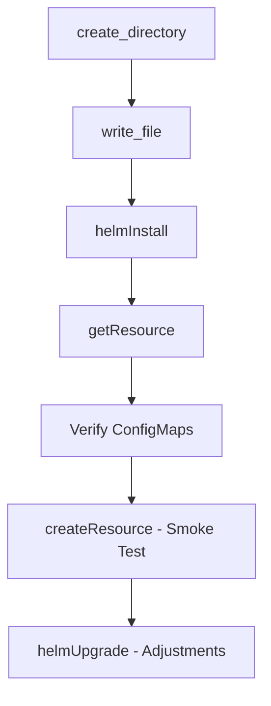

# Task 1: Toolman Guide - Helm Configuration Management

## Overview

This guide explains the MCP tools selection for implementing Helm values and ConfigMaps for the multi-agent orchestration system. The task requires creating and managing Helm charts, templates, and Kubernetes ConfigMaps.

## Core Tools

### Filesystem Operations (Local Server)

The filesystem server provides essential file management capabilities for creating and editing Helm chart files.

#### write_file
**Purpose**: Create new Helm templates, values files, and configuration files  
**When to use**: 
- Creating initial chart structure (`Chart.yaml`, `values.yaml`)
- Writing new template files (`.yaml` templates)
- Creating prompt files in `files/agents/`

**Example**:
```javascript
await write_file({
  path: "charts/platform/values.yaml",
  content: helmValuesContent
});
```

#### edit_file
**Purpose**: Make line-based modifications to existing files  
**When to use**:
- Updating existing Helm templates
- Modifying values.yaml with new agent configurations
- Adjusting helper functions in _helpers.tpl

**Key features**:
- Returns git-style diff showing changes
- Preserves file formatting and indentation
- Safer than full file replacement for incremental changes

#### create_directory
**Purpose**: Set up the Helm chart directory structure  
**When to use**:
- Creating `charts/platform` directory hierarchy
- Setting up `templates/`, `files/`, subdirectories
- Ensuring required paths exist before file operations

**Example structure**:
```
charts/platform/
├── Chart.yaml
├── values.yaml
├── values.schema.json
├── templates/
│   ├── _helpers.tpl
│   ├── controller-agents-configmap.yaml
│   └── mcp-requirements-configmap.yaml
└── files/
    ├── agents/
    │   ├── rex_system-prompt.md
    │   └── ...
    └── requirements.yaml
```

#### read_file / read_text_file
**Purpose**: Verify generated content and validate configurations  
**When to use**:
- Reading existing configurations for reference
- Validating generated template output
- Checking file content before modifications

#### list_directory
**Purpose**: Verify chart structure and file organization  
**When to use**:
- Confirming all required files are in place
- Discovering existing chart components
- Validating directory structure

## Supporting Tools

### Helm Operations (Remote Tools)

#### helmInstall
**Purpose**: Install the Helm chart to a Kubernetes cluster  
**When to use**: Initial deployment of the platform chart to dev/test namespace  
**Arguments**:
- `release`: Platform release name
- `chart`: Path to chart (`charts/platform`)
- `namespace`: Target namespace (e.g., "dev")
- `values`: Optional value overrides

#### helmUpgrade
**Purpose**: Upgrade existing Helm release with changes  
**When to use**: Applying configuration updates after modifications  
**Benefits**:
- Supports incremental updates
- Maintains release history
- Enables rollback if needed

#### helmList
**Purpose**: Verify Helm releases in the cluster  
**When to use**: Checking deployment status and release information

#### helmGet
**Purpose**: Retrieve details of deployed Helm release  
**When to use**: 
- Debugging deployment issues
- Verifying rendered values
- Checking release configuration

### Kubernetes Resources (Remote Tools)

#### createResource
**Purpose**: Create Kubernetes resources directly  
**When to use**: 
- Creating test WorkflowTemplates
- Deploying ConfigMaps if Helm has issues
- Setting up test workflows

#### getResource
**Purpose**: Retrieve and verify created resources  
**When to use**:
- Verifying ConfigMap creation
- Checking WorkflowTemplate deployment
- Validating resource configurations

**Example verification**:
```javascript
const configMap = await getResource({
  kind: "ConfigMap",
  name: "controller-agents",
  namespace: "dev"
});
// Verify all agent prompts are present
```

#### listResources  
**Purpose**: List resources of a specific type  
**When to use**:
- Discovering existing ConfigMaps
- Finding WorkflowTemplates
- Checking for resource conflicts

## Implementation Flow

### Phase 1: Chart Setup
1. Use `create_directory` to establish chart structure
2. Use `write_file` to create initial Chart.yaml and values.yaml
3. Use `write_file` to create values.schema.json for validation

### Phase 2: Template Development
1. Use `write_file` to create _helpers.tpl with helper functions
2. Use `write_file` to create ConfigMap templates
3. Use `write_file` to create smoke test WorkflowTemplate

### Phase 3: Content Packaging
1. Use `create_directory` for files/agents directory
2. Use `write_file` to create each agent prompt file
3. Use `write_file` to create requirements.yaml

### Phase 4: Deployment and Testing
1. Use `helmInstall` for initial deployment
2. Use `getResource` to verify ConfigMaps
3. Use `createResource` to run smoke test workflow
4. Use `helmUpgrade` for any adjustments

## Best Practices

### File Management
- Always create directories before writing files
- Use `edit_file` for modifications to preserve formatting
- Validate YAML syntax before deploying

### Helm Operations
- Run `helm lint` equivalent checks before install
- Use `--dry-run` flag for testing
- Keep values.yaml well-documented

### Verification
- Always verify ConfigMap creation after Helm operations
- Check mount points in deployed pods
- Run smoke tests to validate configuration

### Error Handling
- Check for existing resources before creation
- Validate file paths are within allowed directories  
- Handle missing files gracefully with clear errors

## Troubleshooting

### Common Issues

**ConfigMap Too Large**
- Check total size with filesystem tools
- Consider splitting large prompts
- Implement compression if needed

**Template Rendering Errors**
- Verify helper function syntax
- Check indentation (nindent values)
- Validate Files.Get paths

**Mount Failures**
- Verify ConfigMap exists in namespace
- Check volume and volumeMount definitions
- Validate mount paths in containers

**Helm Install Failures**
- Check RBAC permissions
- Verify namespace exists
- Validate values against schema

## Tool Relationships



## Security Considerations

- ConfigMaps should not contain secrets
- Use read-only mounts for agent prompts
- Validate file content before writing
- Ensure proper RBAC for ConfigMap access

## Performance Tips

- Keep ConfigMap sizes under 900KB total
- Use efficient helper functions
- Cache rendered templates for validation
- Batch file operations when possible

## Summary

This task primarily uses filesystem tools for Helm chart creation and Helm/Kubernetes tools for deployment and verification. The key is proper sequencing: create structure → write templates → package files → deploy → verify. Always validate at each step to catch issues early.