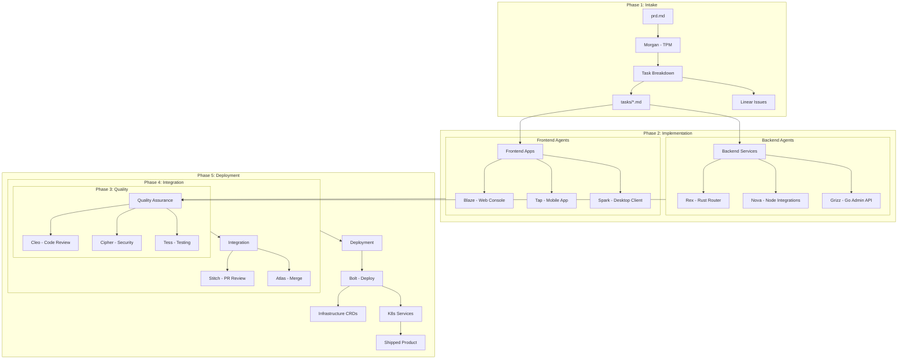

# AlertHub E2E Test Plan

## Overview

This document defines the comprehensive end-to-end test plan for the AlertHub project, designed to validate the entire CTO platform workflow from PRD ingestion through final deployment. The test exercises all 13 agents, 6+ CLIs, 6 infrastructure operators, and the full 5-phase workflow.

---

## Test Objectives

1. **Validate PRD Processing**: Ensure Morgan correctly parses the PRD and generates appropriate tasks
2. **Test Agent Diversity**: Exercise all backend (Rex, Grizz, Nova) and frontend (Blaze, Tap, Spark) agents
3. **Verify CLI Compatibility**: Test multiple CLIs (Claude, Cursor, Codex, Factory, OpenCode, Gemini)
4. **Confirm Infrastructure Provisioning**: Validate all operators (PostgreSQL, Redis, Kafka, MongoDB, RabbitMQ, SeaweedFS)
5. **End-to-End Workflow**: Complete the full workflow from intake to deployment

---

## Test Architecture



---

## CLI/Provider Rotation Matrix

Each task is assigned a specific CLI and model provider to ensure comprehensive coverage:

| Phase | Task | Agent | CLI | Provider | Model |
|-------|------|-------|-----|----------|-------|
| 1 | PRD Parsing | Morgan | claude | Anthropic | claude-sonnet-4-20250514 |
| 2 | Notification Router | Rex | factory | OpenAI | gpt-4o |
| 2 | Integration Service | Nova | cursor | Anthropic | claude-sonnet-4-20250514 |
| 2 | Admin API | Grizz | opencode | Anthropic | claude-sonnet-4-20250514 |
| 2 | Web Console | Blaze | codex | OpenAI | gpt-4o |
| 2 | Mobile App | Tap | claude | Anthropic | claude-sonnet-4-20250514 |
| 2 | Desktop Client | Spark | gemini | Google | gemini-2.0-flash |
| 3 | Quality Review | Cleo | claude | Anthropic | claude-sonnet-4-20250514 |
| 3 | Security Scan | Cipher | cursor | Anthropic | claude-sonnet-4-20250514 |
| 3 | Test Suite | Tess | factory | OpenAI | gpt-4o |
| 4 | Code Review | Stitch | claude | Anthropic | claude-sonnet-4-20250514 |
| 4 | Merge | Atlas | claude | Anthropic | claude-sonnet-4-20250514 |
| 5 | Deploy | Bolt | claude | Anthropic | claude-sonnet-4-20250514 |

---

## Test Phases

### Phase 1: Intake (Morgan)

**Objective**: Validate PRD parsing and task generation

**Prerequisites**:
- PRD file exists at `tests/intake/alerthub-e2e-test/prd.md`
- Architecture doc exists at `tests/intake/alerthub-e2e-test/architecture.md`
- CTO platform is running and accessible

**Test Steps**:

1. **Invoke Intake**
   ```javascript
   intake({
     project_name: "alerthub-e2e-test",
     enrich_context: true,
     analyze: true,
     expand: true,
     num_tasks: 15,
     local: false
   });
   ```

2. **Validate Task Generation**
   - [ ] Tasks directory created with individual task files
   - [ ] Each task has: task.md, prompt.md, acceptance-criteria.md
   - [ ] Backend tasks assigned to correct agents (Rex/Grizz/Nova)
   - [ ] Frontend tasks assigned to correct agents (Blaze/Tap/Spark)
   - [ ] Infrastructure requirements identified and documented
   - [ ] Task dependencies correctly mapped

3. **Validate Linear Integration** (if configured)
   - [ ] Linear project created or updated
   - [ ] Issues created for each task
   - [ ] Proper labels and priorities assigned

**Success Criteria**:
- [ ] Morgan completes without errors
- [ ] 10-20 tasks generated with proper structure
- [ ] Agent routing is correct for each task type
- [ ] Infrastructure requirements extracted from PRD
- [ ] PR submitted with task documentation

---

### Phase 2: Implementation

**Objective**: Build all backend services and frontend applications

#### 2.1 Notification Router (Rex - Rust)

**CLI**: Factory  
**Provider**: OpenAI

**Test Steps**:
```javascript
play({
  task_id: <router_task_id>,
  implementation_agent: "rex",
  cli: "factory"
});
```

**Validation**:
- [ ] Rust project structure created (Cargo.toml, src/)
- [ ] Axum server implementation
- [ ] API endpoints implemented (/api/v1/notifications, /ws)
- [ ] Database migrations (sqlx)
- [ ] Unit tests pass
- [ ] `cargo build --release` succeeds
- [ ] `cargo clippy` passes
- [ ] Dockerfile created

#### 2.2 Integration Service (Nova - Node.js)

**CLI**: Cursor  
**Provider**: Anthropic

**Test Steps**:
```javascript
play({
  task_id: <integration_task_id>,
  implementation_agent: "nova",
  cli: "cursor"
});
```

**Validation**:
- [ ] Node.js project structure (package.json, tsconfig.json)
- [ ] Fastify server implementation
- [ ] Channel integrations (Slack, Discord, email)
- [ ] MongoDB schema (Prisma or Mongoose)
- [ ] Unit tests pass
- [ ] `npm run build` succeeds
- [ ] `npm run lint` passes
- [ ] Dockerfile created

#### 2.3 Admin API (Grizz - Go)

**CLI**: OpenCode  
**Provider**: Anthropic

**Test Steps**:
```javascript
play({
  task_id: <admin_task_id>,
  implementation_agent: "grizz",
  cli: "opencode"
});
```

**Validation**:
- [ ] Go module structure (go.mod, cmd/, pkg/)
- [ ] gRPC service definitions (.proto files)
- [ ] grpc-gateway REST endpoints
- [ ] Database layer (PostgreSQL)
- [ ] Unit tests pass
- [ ] `go build ./...` succeeds
- [ ] `golangci-lint run` passes
- [ ] Dockerfile created

#### 2.4 Web Console (Blaze - React/Next.js)

**CLI**: Codex  
**Provider**: OpenAI

**Test Steps**:
```javascript
play({
  task_id: <web_task_id>,
  frontend_agent: "blaze",
  cli: "codex"
});
```

**Validation**:
- [ ] Next.js 14+ App Router structure
- [ ] shadcn/ui components integrated
- [ ] Pages: dashboard, notifications, integrations, rules, settings
- [ ] API route handlers or server actions
- [ ] TailwindCSS styling
- [ ] `npm run build` succeeds
- [ ] `npm run lint` passes
- [ ] Dockerfile created

#### 2.5 Mobile App (Tap - Expo)

**CLI**: Claude  
**Provider**: Anthropic

**Test Steps**:
```javascript
play({
  task_id: <mobile_task_id>,
  frontend_agent: "tap",
  cli: "claude"
});
```

**Validation**:
- [ ] Expo SDK 50+ project structure
- [ ] NativeWind styling configured
- [ ] Screens: Home, NotificationDetail, Integrations, Settings, Profile
- [ ] Navigation (bottom tabs + stack)
- [ ] Push notification setup (expo-notifications)
- [ ] `npx expo prebuild` succeeds
- [ ] `npm run lint` passes

#### 2.6 Desktop Client (Spark - Electron)

**CLI**: Gemini  
**Provider**: Google

**Test Steps**:
```javascript
play({
  task_id: <desktop_task_id>,
  frontend_agent: "spark",
  cli: "gemini"
});
```

**Validation**:
- [ ] Electron project structure
- [ ] Main process (main.js/ts)
- [ ] Renderer process (React)
- [ ] System tray implementation
- [ ] Native notifications
- [ ] `npm run build` succeeds
- [ ] `npm run lint` passes

---

### Phase 3: Quality Assurance

**Objective**: Code review, security scanning, and test coverage

#### 3.1 Code Review (Cleo)

**CLI**: Claude

**Test Steps**:
```javascript
play({
  quality_agent: "cleo",
  cli: "claude"
});
```

**Validation**:
- [ ] PR review comments generated
- [ ] Code quality issues identified
- [ ] Architecture feedback provided
- [ ] Best practices recommendations
- [ ] No blocking issues remaining

#### 3.2 Security Scan (Cipher)

**CLI**: Cursor

**Test Steps**:
```javascript
play({
  security_agent: "cipher",
  cli: "cursor"
});
```

**Validation**:
- [ ] Dependency vulnerability scan (Trivy)
- [ ] Secret scanning (Gitleaks)
- [ ] OWASP checks
- [ ] No critical/high vulnerabilities
- [ ] Security findings documented

#### 3.3 Test Suite (Tess)

**CLI**: Factory

**Test Steps**:
```javascript
play({
  testing_agent: "tess",
  cli: "factory"
});
```

**Validation**:
- [ ] Unit tests created for all services
- [ ] Integration tests for API endpoints
- [ ] E2E tests for critical flows
- [ ] Test coverage > 70%
- [ ] All tests pass

---

### Phase 4: Integration

**Objective**: Code review, merge, and CI validation

#### 4.1 PR Review (Stitch)

**CLI**: Claude

**Test Steps**:
```javascript
play({
  // Stitch reviews automatically
});
```

**Validation**:
- [ ] All PRs reviewed
- [ ] Review comments addressed
- [ ] Approval granted

#### 4.2 Merge (Atlas)

**CLI**: Claude

**Test Steps**:
```javascript
play({
  // Atlas merges automatically
});
```

**Validation**:
- [ ] PRs merged without conflicts
- [ ] CI pipeline passes
- [ ] Branch protection rules satisfied

---

### Phase 5: Deployment

**Objective**: Deploy to Kubernetes with infrastructure

#### 5.1 Infrastructure Provisioning (Bolt)

**CLI**: Claude

**Test Steps**:
```javascript
play({
  // Bolt deploys automatically
});
```

**Infrastructure Validation**:
- [ ] PostgreSQL Cluster created and healthy
- [ ] Redis/Valkey instance running
- [ ] Kafka cluster with topics created
- [ ] MongoDB replica set initialized
- [ ] RabbitMQ cluster running
- [ ] SeaweedFS bucket created

**Service Deployment Validation**:
- [ ] All Deployments have desired replicas
- [ ] All Pods running and healthy
- [ ] Services created and accessible
- [ ] Ingress/Tunnels configured
- [ ] ConfigMaps and Secrets mounted

---

## Validation Checkpoints Summary

### Phase 1 - Intake
- [ ] PRD parsed successfully
- [ ] Tasks generated with correct agent routing
- [ ] Infrastructure requirements identified
- [ ] Documentation created (task.md, prompt.md, acceptance-criteria.md)
- [ ] Linear issues created (if configured)

### Phase 2 - Implementation
- [ ] Rex: Rust notification router builds and tests pass
- [ ] Nova: Node.js integration service builds and tests pass
- [ ] Grizz: Go admin API builds and tests pass
- [ ] Blaze: Next.js web console builds successfully
- [ ] Tap: Expo mobile app builds successfully
- [ ] Spark: Electron desktop client builds successfully
- [ ] All PRs submitted with proper descriptions

### Phase 3 - Quality
- [ ] Cleo review completed with actionable feedback
- [ ] Cipher security scan passed (no critical vulnerabilities)
- [ ] Tess test coverage meets threshold (>70%)

### Phase 4 - Integration
- [ ] Stitch code review approved
- [ ] Atlas merge completed without conflicts
- [ ] CI pipeline passes

### Phase 5 - Deployment
- [ ] Bolt deployment successful
- [ ] All infrastructure CRDs healthy
- [ ] All pods running and healthy
- [ ] Services accessible via ingress/tunnels
- [ ] Integration tests pass against deployed services

---

## Test Execution Commands

### Full E2E Test

```bash
# 1. Start intake
mcp_cto_intake({
  project_name: "alerthub-e2e-test",
  enrich_context: true,
  num_tasks: 15
})

# 2. Monitor intake progress
mcp_cto_jobs({ include: ["intake"] })

# 3. Start play workflow (auto-detects tasks)
mcp_cto_play({
  repository: "5dlabs/agent-sandbox",
  service: "alerthub-test",
  docs_repository: "5dlabs/docs",
  docs_project_directory: "alerthub-e2e-test",
  parallel_execution: true
})

# 4. Monitor play progress
mcp_cto_play_status()
mcp_cto_jobs({ include: ["play"] })

# 5. Check specific workflow logs
mcp_argocd_get_application_workload_logs({
  applicationName: "alerthub-test",
  applicationNamespace: "argocd"
})
```

### Validation Commands

```bash
# Check infrastructure
kubectl get clusters.postgresql.cnpg.io -n databases
kubectl get redis -n databases
kubectl get kafka -n kafka
kubectl get perconaservermongodbs -n databases
kubectl get rabbitmqclusters -n messaging

# Check deployments
kubectl get deployments -n alerthub
kubectl get pods -n alerthub

# Check logs
kubectl logs -n alerthub -l app=notification-router
kubectl logs -n alerthub -l app=integration-service
kubectl logs -n alerthub -l app=admin-api
```

---

## Troubleshooting

### Common Issues

1. **Intake fails to parse PRD**
   - Check PRD format and structure
   - Verify Morgan agent is configured
   - Check MCP server logs

2. **Agent task fails**
   - Check agent CLI configuration
   - Verify model provider credentials
   - Review task prompt for clarity

3. **Infrastructure CRD fails**
   - Check operator is installed
   - Verify storage class exists
   - Check namespace permissions

4. **Build fails**
   - Check dependency versions
   - Review build logs
   - Verify base images exist

5. **Deployment fails**
   - Check resource limits
   - Verify secrets exist
   - Review pod events

---

## Metrics & Reporting

### Test Metrics to Collect

| Metric | Target | Actual |
|--------|--------|--------|
| Intake duration | < 10 min | |
| Tasks generated | 10-20 | |
| Implementation success rate | 100% | |
| Build success rate | 100% | |
| Test pass rate | > 90% | |
| Security issues (critical) | 0 | |
| Deployment success | 100% | |
| Total E2E duration | < 4 hours | |

### Test Report Template

```markdown
# AlertHub E2E Test Report

**Date**: YYYY-MM-DD
**Duration**: X hours Y minutes
**Status**: PASS/FAIL

## Summary
- Total tasks: X
- Passed: X
- Failed: X
- Skipped: X

## Phase Results
| Phase | Status | Duration | Notes |
|-------|--------|----------|-------|
| Intake | | | |
| Implementation | | | |
| Quality | | | |
| Integration | | | |
| Deployment | | | |

## Issues Encountered
1. Issue description and resolution

## Recommendations
1. Improvement suggestions
```

---

## Test Schedule

| Step | Estimated Duration | Dependencies |
|------|-------------------|--------------|
| Setup & Prerequisites | 30 min | - |
| Phase 1: Intake | 15-30 min | Setup complete |
| Phase 2: Implementation | 2-3 hours | Intake complete |
| Phase 3: Quality | 30-60 min | Implementation complete |
| Phase 4: Integration | 15-30 min | Quality complete |
| Phase 5: Deployment | 30-60 min | Integration complete |
| Validation & Cleanup | 30 min | Deployment complete |
| **Total** | **4-6 hours** | |

---

## Appendix: Agent Capabilities Reference

| Agent | Role | Languages/Stacks | Key Tools |
|-------|------|------------------|-----------|
| Morgan | TPM | - | Linear, GitHub Issues |
| Rex | Backend | Rust, Axum, Tokio | Context7, OpenMemory |
| Grizz | Backend | Go, gRPC | Context7, OpenMemory |
| Nova | Backend | Node.js, Fastify | Context7, OpenMemory |
| Blaze | Frontend | React, Next.js, shadcn | shadcn/ui, Context7 |
| Tap | Mobile | Expo, React Native | Context7 |
| Spark | Desktop | Electron, Tauri | Context7 |
| Cleo | Quality | Multi-language | GitHub PR Review |
| Cipher | Security | Multi-language | Trivy, Gitleaks |
| Tess | Testing | Multi-language | Testing frameworks |
| Stitch | Review | Multi-language | GitHub PR Review |
| Atlas | Integration | - | GitHub Merge |
| Bolt | Deployment | K8s, Helm | ArgoCD, kubectl |

