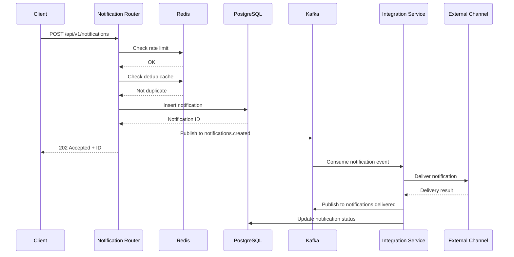
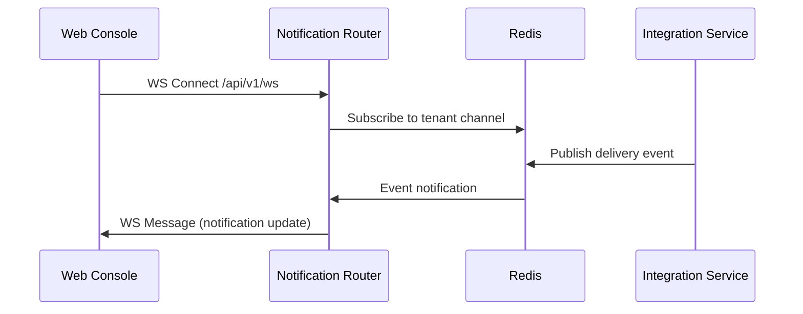

# AlertHub Architecture

## System Overview

AlertHub is a multi-platform notification system built as a microservices architecture. It demonstrates the full capabilities of the CTO platform by utilizing multiple backend languages, frontend frameworks, and infrastructure operators.

## High-Level Architecture

```
                                    ┌─────────────────────────────────────────┐
                                    │              Load Balancer              │
                                    │         (Cloudflare Tunnel)             │
                                    └────────────────────┬────────────────────┘
                                                         │
                    ┌────────────────────────────────────┼────────────────────────────────────┐
                    │                                    │                                    │
                    ▼                                    ▼                                    ▼
           ┌────────────────┐                   ┌────────────────┐                   ┌────────────────┐
           │  Web Console   │                   │   Mobile App   │                   │ Desktop Client │
           │   (Next.js)    │                   │    (Expo)      │                   │  (Electron)    │
           │     Blaze      │                   │      Tap       │                   │     Spark      │
           └───────┬────────┘                   └───────┬────────┘                   └───────┬────────┘
                   │                                    │                                    │
                   │              WebSocket             │              Push                  │
                   │                 ▼                  │                ▼                   │
                   │         ┌──────────────┐          │         ┌──────────────┐          │
                   │         │   Real-time  │          │         │     FCM      │          │
                   │         │   Updates    │          │         │    Service   │          │
                   │         └──────────────┘          │         └──────────────┘          │
                   │                                    │                                    │
                   └────────────────────────────────────┼────────────────────────────────────┘
                                                        │
                                                        ▼
┌───────────────────────────────────────────────────────────────────────────────────────────────────────┐
│                                         API Gateway Layer                                              │
│                                                                                                        │
│  ┌─────────────────────────────────┐  ┌─────────────────────────────────┐  ┌────────────────────────┐ │
│  │     Notification Router         │  │      Admin API                  │  │   Integration Service  │ │
│  │         (Rust/Axum)             │  │       (Go/gRPC)                 │  │    (Node.js/Fastify)   │ │
│  │            Rex                  │  │         Grizz                   │  │          Nova          │ │
│  │                                 │  │                                 │  │                        │ │
│  │  • POST /api/v1/notifications   │  │  • gRPC TenantService          │  │  • CRUD Integrations   │ │
│  │  • GET /api/v1/notifications/:id│  │  • gRPC UserService            │  │  • Channel Delivery    │ │
│  │  • WS /api/v1/ws               │  │  • gRPC RuleService            │  │  • Template Rendering  │ │
│  │  • GET /metrics                 │  │  • REST via grpc-gateway       │  │  • Retry Logic         │ │
│  └──────────────┬──────────────────┘  └──────────────┬──────────────────┘  └───────────┬────────────┘ │
│                 │                                    │                                  │              │
└─────────────────┼────────────────────────────────────┼──────────────────────────────────┼──────────────┘
                  │                                    │                                  │
                  ▼                                    ▼                                  ▼
┌───────────────────────────────────────────────────────────────────────────────────────────────────────┐
│                                       Message Bus Layer                                                │
│                                                                                                        │
│  ┌─────────────────────────────────────────────┐  ┌──────────────────────────────────────────────────┐│
│  │              Kafka (Strimzi)                │  │              RabbitMQ                            ││
│  │                                             │  │                                                  ││
│  │  Topics:                                    │  │  Queues:                                         ││
│  │  • alerthub.notifications.created          │  │  • integration.slack.delivery                    ││
│  │  • alerthub.notifications.delivered        │  │  • integration.discord.delivery                  ││
│  │  • alerthub.notifications.failed           │  │  • integration.email.delivery                    ││
│  │                                             │  │  • integration.webhook.delivery                  ││
│  └─────────────────────────────────────────────┘  └──────────────────────────────────────────────────┘│
│                                                                                                        │
└───────────────────────────────────────────────────────────────────────────────────────────────────────┘
                  │                                    │                                  │
                  ▼                                    ▼                                  ▼
┌───────────────────────────────────────────────────────────────────────────────────────────────────────┐
│                                       Data Layer                                                       │
│                                                                                                        │
│  ┌──────────────────┐  ┌──────────────────┐  ┌──────────────────┐  ┌──────────────────┐               │
│  │   PostgreSQL     │  │   Redis/Valkey   │  │     MongoDB      │  │    SeaweedFS     │               │
│  │  (CloudNative-PG)│  │ (Redis Operator) │  │    (Percona)     │  │       (S3)       │               │
│  │                  │  │                  │  │                  │  │                  │               │
│  │  • Users         │  │  • Rate limits   │  │  • Templates     │  │  • Attachments   │               │
│  │  • Tenants       │  │  • Sessions      │  │  • Integrations  │  │  • Media files   │               │
│  │  • Notifications │  │  • Dedup cache   │  │  • Configs       │  │  • Exports       │               │
│  │  • Rules         │  │  • Pub/sub       │  │                  │  │                  │               │
│  │  • Audit logs    │  │                  │  │                  │  │                  │               │
│  └──────────────────┘  └──────────────────┘  └──────────────────┘  └──────────────────┘               │
│                                                                                                        │
└───────────────────────────────────────────────────────────────────────────────────────────────────────┘
```

---

## Service Details

### Notification Router (Rex - Rust/Axum)

**Responsibilities**:
- Receive notification requests from clients
- Validate and authenticate requests
- Apply rate limiting
- Queue notifications for processing
- Publish events to Kafka
- Maintain WebSocket connections for real-time updates

**Technology Stack**:
| Component | Technology |
|-----------|------------|
| Language | Rust 1.75+ |
| Framework | Axum 0.7 |
| Async Runtime | Tokio |
| Database | sqlx (PostgreSQL) |
| Serialization | serde, serde_json |
| Validation | validator |
| Logging | tracing |
| Metrics | prometheus |

**API Endpoints**:
```
POST   /api/v1/notifications           # Submit notification
POST   /api/v1/notifications/batch     # Batch submit (max 100)
GET    /api/v1/notifications/:id       # Get notification status
GET    /api/v1/notifications/:id/events# Get delivery events
WS     /api/v1/ws                      # Real-time updates
GET    /health/live                    # Liveness probe
GET    /health/ready                   # Readiness probe
GET    /metrics                        # Prometheus metrics
```

**Dependencies**:
- PostgreSQL (primary data store)
- Redis (rate limiting, deduplication)
- Kafka (event publishing)

---

### Integration Service (Nova - Node.js/Fastify)

**Responsibilities**:
- Manage channel integrations (Slack, Discord, email, webhooks)
- Consume notification events from Kafka
- Deliver notifications to external channels
- Handle retries with exponential backoff
- Render notification templates

**Technology Stack**:
| Component | Technology |
|-----------|------------|
| Language | Node.js 20+ |
| Framework | Fastify 4.x |
| TypeScript | 5.x |
| Database ORM | Prisma or Mongoose |
| Queue Consumer | kafkajs |
| Template Engine | Handlebars |
| HTTP Client | undici |
| Validation | Zod |

**API Endpoints**:
```
POST   /api/v1/integrations            # Create integration
GET    /api/v1/integrations            # List integrations
GET    /api/v1/integrations/:id        # Get integration
PATCH  /api/v1/integrations/:id        # Update integration
DELETE /api/v1/integrations/:id        # Delete integration
POST   /api/v1/integrations/:id/test   # Test connectivity
GET    /health                         # Health check
```

**Supported Channels**:
| Channel | Integration Type | Auth Method |
|---------|-----------------|-------------|
| Slack | Webhook, Bot API | OAuth2, Webhook URL |
| Discord | Webhook | Webhook URL |
| Email | SMTP | API Key, SMTP Auth |
| Push | FCM | Service Account |
| Webhook | HTTP | HMAC Signature |

**Dependencies**:
- MongoDB (integration configs, templates)
- RabbitMQ (delivery task queue)
- Kafka (event consumption)

---

### Admin API (Grizz - Go/gRPC)

**Responsibilities**:
- Tenant and user management
- Notification rules configuration
- Analytics and reporting
- RBAC enforcement
- Audit logging

**Technology Stack**:
| Component | Technology |
|-----------|------------|
| Language | Go 1.22+ |
| RPC Framework | gRPC |
| REST Gateway | grpc-gateway |
| Database | pgx (PostgreSQL) |
| Validation | protoc-gen-validate |
| Logging | zap |
| Metrics | prometheus |

**gRPC Services**:
```protobuf
service TenantService {
  rpc CreateTenant(CreateTenantRequest) returns (Tenant);
  rpc GetTenant(GetTenantRequest) returns (Tenant);
  rpc UpdateTenant(UpdateTenantRequest) returns (Tenant);
  rpc ListTenants(ListTenantsRequest) returns (ListTenantsResponse);
  rpc DeleteTenant(DeleteTenantRequest) returns (Empty);
}

service UserService {
  rpc CreateUser(CreateUserRequest) returns (User);
  rpc GetUser(GetUserRequest) returns (User);
  rpc UpdateUser(UpdateUserRequest) returns (User);
  rpc ListUsers(ListUsersRequest) returns (ListUsersResponse);
  rpc DeleteUser(DeleteUserRequest) returns (Empty);
  rpc UpdatePreferences(UpdatePreferencesRequest) returns (UserPreferences);
}

service RuleService {
  rpc CreateRule(CreateRuleRequest) returns (NotificationRule);
  rpc GetRule(GetRuleRequest) returns (NotificationRule);
  rpc UpdateRule(UpdateRuleRequest) returns (NotificationRule);
  rpc ListRules(ListRulesRequest) returns (ListRulesResponse);
  rpc DeleteRule(DeleteRuleRequest) returns (Empty);
  rpc EvaluateRule(EvaluateRuleRequest) returns (EvaluateRuleResponse);
}

service AnalyticsService {
  rpc GetNotificationStats(StatsRequest) returns (NotificationStats);
  rpc GetDeliveryMetrics(MetricsRequest) returns (DeliveryMetrics);
  rpc GetChannelBreakdown(BreakdownRequest) returns (ChannelBreakdown);
}
```

**REST Endpoints** (via grpc-gateway):
```
POST   /api/v1/tenants                 # Create tenant
GET    /api/v1/tenants/:id             # Get tenant
PUT    /api/v1/tenants/:id             # Update tenant
GET    /api/v1/tenants                 # List tenants

POST   /api/v1/users                   # Create user
GET    /api/v1/users/:id               # Get user
PUT    /api/v1/users/:id               # Update user
GET    /api/v1/users                   # List users

POST   /api/v1/rules                   # Create rule
GET    /api/v1/rules/:id               # Get rule
PUT    /api/v1/rules/:id               # Update rule
GET    /api/v1/rules                   # List rules

GET    /api/v1/analytics/stats         # Get statistics
GET    /api/v1/analytics/metrics       # Get metrics
```

**Dependencies**:
- PostgreSQL (all admin data)
- Redis (session cache)

---

## Frontend Applications

### Web Console (Blaze - Next.js)

**Technology Stack**:
| Component | Technology |
|-----------|------------|
| Framework | Next.js 14+ (App Router) |
| UI Library | shadcn/ui |
| Styling | TailwindCSS |
| State | TanStack Query |
| Forms | React Hook Form + Zod |
| Charts | Recharts |

**Pages**:
| Route | Purpose |
|-------|---------|
| `/` | Dashboard overview |
| `/notifications` | Notification history |
| `/integrations` | Manage channels |
| `/rules` | Configure rules |
| `/settings` | User/tenant settings |
| `/analytics` | Metrics & charts |

---

### Mobile App (Tap - Expo)

**Technology Stack**:
| Component | Technology |
|-----------|------------|
| Framework | Expo SDK 50+ |
| Styling | NativeWind |
| Navigation | Expo Router |
| Push | expo-notifications |
| Storage | expo-secure-store |

**Screens**:
| Screen | Purpose |
|--------|---------|
| Home | Recent notifications |
| Detail | Notification details |
| Integrations | Connected channels |
| Settings | Preferences |
| Profile | User profile |

---

### Desktop Client (Spark - Electron)

**Technology Stack**:
| Component | Technology |
|-----------|------------|
| Framework | Electron 28+ |
| UI | React + TailwindCSS |
| Build | electron-builder |
| Auto-update | electron-updater |

**Features**:
- System tray with unread badge
- Native desktop notifications
- Keyboard shortcuts
- Auto-start on boot
- Cross-platform (Windows, macOS, Linux)

---

## Infrastructure Components

### PostgreSQL (CloudNative-PG)

**Purpose**: Primary relational database for structured data

**Data Stored**:
- User accounts and profiles
- Tenant configurations
- Notification records and history
- Notification rules
- Audit logs

**Configuration**:
```yaml
apiVersion: postgresql.cnpg.io/v1
kind: Cluster
metadata:
  name: alerthub-postgres
  namespace: databases
spec:
  instances: 1
  postgresql:
    parameters:
      max_connections: "200"
      shared_buffers: "256MB"
      work_mem: "16MB"
  storage:
    size: 20Gi
    storageClass: mayastor
  bootstrap:
    initdb:
      database: alerthub
      owner: alerthub_user
  resources:
    requests:
      memory: 512Mi
      cpu: 250m
    limits:
      memory: 2Gi
      cpu: 1000m
```

**Connection**: `postgresql://alerthub_user:<password>@alerthub-postgres-rw.databases.svc:5432/alerthub`

---

### Redis/Valkey (Redis Operator)

**Purpose**: Caching, rate limiting, pub/sub

**Data Stored**:
- Rate limit counters (per tenant, per endpoint)
- Session tokens
- Deduplication cache (notification hashes)
- Real-time pub/sub channels

**Configuration**:
```yaml
apiVersion: redis.redis.opstreelabs.in/v1beta2
kind: Redis
metadata:
  name: alerthub-valkey
  namespace: databases
spec:
  kubernetesConfig:
    image: valkey/valkey:7.2-alpine
    resources:
      requests:
        cpu: 100m
        memory: 256Mi
      limits:
        cpu: 500m
        memory: 1Gi
  storage:
    volumeClaimTemplate:
      spec:
        storageClassName: mayastor
        resources:
          requests:
            storage: 5Gi
```

**Connection**: `redis://alerthub-valkey.databases.svc:6379`

---

### Kafka (Strimzi)

**Purpose**: Event streaming for async notification processing

**Topics**:
| Topic | Purpose | Partitions | Retention |
|-------|---------|------------|-----------|
| `alerthub.notifications.created` | New notifications | 6 | 7 days |
| `alerthub.notifications.delivered` | Successful deliveries | 3 | 7 days |
| `alerthub.notifications.failed` | Failed deliveries | 3 | 14 days |
| `alerthub.integrations.events` | Integration changes | 3 | 7 days |

**Configuration**:
```yaml
apiVersion: kafka.strimzi.io/v1beta2
kind: Kafka
metadata:
  name: alerthub-kafka
  namespace: kafka
spec:
  kafka:
    version: "3.8.0"
    replicas: 1
    listeners:
      - name: plain
        port: 9092
        type: internal
        tls: false
    config:
      offsets.topic.replication.factor: 1
      transaction.state.log.replication.factor: 1
      transaction.state.log.min.isr: 1
      log.retention.hours: 168
    storage:
      type: persistent-claim
      size: 20Gi
      class: mayastor
```

**Bootstrap**: `alerthub-kafka-kafka-bootstrap.kafka.svc:9092`

---

### MongoDB (Percona)

**Purpose**: Flexible document storage for integrations

**Collections**:
| Collection | Purpose |
|------------|---------|
| `integrations` | Channel configurations |
| `templates` | Notification templates |
| `delivery_logs` | Detailed delivery logs |

**Configuration**:
```yaml
apiVersion: psmdb.percona.com/v1
kind: PerconaServerMongoDB
metadata:
  name: alerthub-mongodb
  namespace: databases
spec:
  crVersion: "1.18.0"
  image: percona/percona-server-mongodb:7.0.14-8
  replsets:
    - name: rs0
      size: 1
      volumeSpec:
        persistentVolumeClaim:
          storageClassName: mayastor
          resources:
            requests:
              storage: 10Gi
```

**Connection**: `mongodb://alerthub-mongodb-rs0.databases.svc:27017`

---

### RabbitMQ (RabbitMQ Operator)

**Purpose**: Task queue for integration deliveries

**Queues**:
| Queue | Purpose | DLQ |
|-------|---------|-----|
| `integration.slack.delivery` | Slack deliveries | Yes |
| `integration.discord.delivery` | Discord deliveries | Yes |
| `integration.email.delivery` | Email deliveries | Yes |
| `integration.webhook.delivery` | Webhook deliveries | Yes |

**Configuration**:
```yaml
apiVersion: rabbitmq.com/v1beta1
kind: RabbitmqCluster
metadata:
  name: alerthub-rabbitmq
  namespace: messaging
spec:
  replicas: 1
  resources:
    requests:
      cpu: 200m
      memory: 512Mi
    limits:
      cpu: 500m
      memory: 1Gi
  persistence:
    storageClassName: mayastor
    storage: 10Gi
```

**Connection**: `amqp://alerthub-rabbitmq.messaging.svc:5672`

---

### SeaweedFS (S3-Compatible Storage)

**Purpose**: Object storage for attachments and exports

**Buckets**:
| Bucket | Purpose |
|--------|---------|
| `alerthub-attachments` | Notification attachments |
| `alerthub-exports` | Data exports (GDPR) |
| `alerthub-media` | Media files |

**Configuration**:
```bash
# Create buckets via weed shell
aws s3 mb s3://alerthub-attachments --endpoint-url http://seaweedfs-filer.seaweedfs.svc:8333
aws s3 mb s3://alerthub-exports --endpoint-url http://seaweedfs-filer.seaweedfs.svc:8333
aws s3 mb s3://alerthub-media --endpoint-url http://seaweedfs-filer.seaweedfs.svc:8333
```

**Endpoint**: `http://seaweedfs-filer.seaweedfs.svc:8333`

---

## Data Flow

### Notification Submission Flow



### Real-time Update Flow



---

## Security Considerations

### Authentication
- JWT tokens with RS256 signing
- Refresh token rotation
- API key authentication for service-to-service

### Authorization
- RBAC with roles: owner, admin, member, viewer
- Tenant isolation at all data layers
- Resource-level permissions

### Data Protection
- TLS for all external connections
- Encryption at rest for secrets
- PII data masking in logs
- GDPR compliance (export, deletion)

### Rate Limiting
- Per-tenant limits (configurable)
- Per-endpoint limits
- Burst allowance with token bucket

---

## Observability

### Metrics (Prometheus)
- Request latency (p50, p95, p99)
- Throughput (requests/second)
- Error rates by endpoint
- Queue depths (Kafka, RabbitMQ)
- Database connection pool stats

### Logging (Structured JSON)
- Trace ID propagation
- Request/response logging
- Error stack traces
- Audit events

### Tracing (Optional)
- OpenTelemetry integration
- Distributed trace context
- Service dependency mapping

### Dashboards (Grafana)
- Service health overview
- Notification delivery metrics
- Infrastructure resource usage
- Alert rules for SLA breaches

